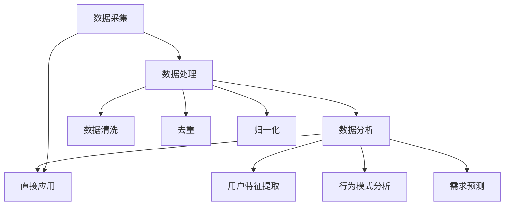

                 

 用户画像分析在自动化创业领域扮演着至关重要的角色。通过深入了解和分析目标用户的特征、行为和需求，企业能够更精准地定位市场，优化产品设计，提高用户满意度和忠诚度。本文旨在探讨用户画像分析在自动化创业中的应用，深入剖析其核心概念、算法原理、数学模型、实际案例以及未来发展方向。

## 关键词

- 用户画像分析
- 自动化创业
- 数据挖掘
- 机器学习
- 预测模型

## 摘要

本文首先介绍了用户画像分析的基本概念，并探讨了其在自动化创业中的重要性。接着，我们分析了用户画像分析的核心概念和架构，并通过Mermaid流程图进行了详细展示。随后，文章重点介绍了用户画像分析中的核心算法原理及其操作步骤，并对算法的优缺点和应用领域进行了深入讨论。在此基础上，文章展示了数学模型和公式的构建与推导，并通过案例进行了具体分析。最后，文章通过实际项目实践，提供了代码实例和详细解释，并探讨了用户画像分析在实际应用场景中的多样性。本文旨在为自动化创业者提供有价值的参考，以帮助其在激烈的市场竞争中脱颖而出。

## 1. 背景介绍

### 1.1 自动化创业的兴起

近年来，随着互联网、大数据和人工智能技术的迅猛发展，自动化创业在全球范围内呈现出爆发式增长。自动化创业企业通过利用先进技术，如机器学习、自然语言处理、图像识别等，实现了业务流程的自动化和智能化，从而提高了效率和竞争力。这些企业以创新的商业模式和高效的服务体系迅速占领市场，获得了投资者的青睐。

### 1.2 用户画像分析的重要性

在自动化创业领域，用户画像分析作为一种重要的数据分析手段，被广泛应用于市场定位、产品优化、用户行为预测等方面。用户画像分析通过对用户特征、行为和需求的全面挖掘，帮助企业深入了解目标用户群体，从而实现精准营销和个性化服务。以下是用户画像分析在自动化创业中的几个关键作用：

- **市场定位**：用户画像分析能够帮助企业识别具有高潜力市场价值的用户群体，从而确定合适的营销策略和目标市场。
- **产品优化**：通过对用户需求的深入分析，企业可以及时调整和优化产品功能，提高用户体验和满意度。
- **精准营销**：用户画像分析有助于企业实现精准营销，通过个性化推送和定制化服务，提高用户转化率和忠诚度。
- **风险控制**：用户画像分析有助于企业识别潜在风险用户，从而采取相应的风险控制措施，降低运营风险。

### 1.3 本文目的

本文旨在探讨用户画像分析在自动化创业中的应用，深入剖析其核心概念、算法原理、数学模型、实际案例以及未来发展方向。通过对用户画像分析的全面解析，本文希望为自动化创业者提供有价值的参考，以帮助其在激烈的市场竞争中抓住机遇，实现持续发展。

## 2. 核心概念与联系

### 2.1 用户画像分析的定义

用户画像分析是指通过对用户行为、兴趣、需求等数据进行收集、处理和分析，构建出一个具有全面描述和深度洞察的虚拟用户形象。这个形象能够反映用户的个性化特征，为企业的市场策略、产品设计、服务优化等提供有力支持。

### 2.2 用户画像分析的核心概念

- **用户特征**：用户特征包括用户的性别、年龄、职业、地域、教育程度、收入水平等基本属性。
- **用户行为**：用户行为包括用户的浏览记录、购买行为、互动行为、搜索习惯等。
- **用户需求**：用户需求包括用户对产品功能、性能、体验等方面的期望和偏好。
- **用户标签**：用户标签是对用户特征、行为和需求的抽象和分类，如“高频购物用户”、“科技爱好者”等。

### 2.3 用户画像分析的架构

用户画像分析的架构主要包括数据采集、数据处理、数据分析和数据应用四个环节。

- **数据采集**：通过线上和线下渠道收集用户数据，如网站日志、社交媒体数据、用户调研数据等。
- **数据处理**：对采集到的用户数据进行清洗、去重、归一化等处理，确保数据质量。
- **数据分析**：利用统计学和机器学习算法对用户数据进行分析，提取用户特征和行为模式。
- **数据应用**：将分析结果应用于产品优化、营销策略、风险控制等方面。

### 2.4 Mermaid流程图



## 3. 核心算法原理 & 具体操作步骤

### 3.1 算法原理概述

用户画像分析的核心算法主要包括基于关联规则的挖掘算法、基于聚类分析的算法和基于机器学习的算法。这些算法通过对用户数据的深入分析，提取出用户的特征和行为模式，从而构建出用户画像。

- **基于关联规则的挖掘算法**：通过挖掘用户行为数据中的关联关系，发现用户之间的共同兴趣和偏好，从而构建用户画像。
- **基于聚类分析的算法**：根据用户数据的相似性，将用户划分为不同的群体，每个群体具有独特的特征和行为模式，从而构建用户画像。
- **基于机器学习的算法**：利用机器学习模型对用户数据进行训练，自动提取用户特征和行为模式，从而构建用户画像。

### 3.2 算法步骤详解

#### 3.2.1 基于关联规则的挖掘算法

1. 数据预处理：清洗用户行为数据，去除无效数据和噪声。
2. 关联规则挖掘：利用Apriori算法或FP-Growth算法挖掘用户行为数据中的频繁项集，并根据支持度和置信度筛选出强关联规则。
3. 构建用户画像：将强关联规则转化为用户标签，为每个用户赋予相应的标签，从而构建用户画像。

#### 3.2.2 基于聚类分析的算法

1. 数据预处理：清洗用户数据，标准化特征，确保数据质量。
2. 聚类算法选择：根据数据特点选择合适的聚类算法，如K-Means、DBSCAN等。
3. 聚类过程：对用户数据进行聚类，得到不同的用户群体。
4. 构建用户画像：为每个用户群体提取特征，构建用户画像。

#### 3.2.3 基于机器学习的算法

1. 数据预处理：清洗用户数据，提取特征，进行数据归一化。
2. 模型选择：选择合适的机器学习模型，如决策树、随机森林、神经网络等。
3. 模型训练：利用用户数据对模型进行训练，提取用户特征和行为模式。
4. 用户画像构建：根据模型预测结果，为每个用户构建画像。

### 3.3 算法优缺点

#### 基于关联规则的挖掘算法

- **优点**：能够发现用户之间的关联关系，有助于发现用户的共同兴趣和偏好。
- **缺点**：对大规模数据集的处理能力有限，且无法直接反映用户需求。

#### 基于聚类分析的算法

- **优点**：能够自动发现用户群体，有助于实现个性化服务。
- **缺点**：聚类结果可能受初始值和算法选择的影响，且无法直接提取用户特征。

#### 基于机器学习的算法

- **优点**：能够自动提取用户特征和行为模式，适应性强。
- **缺点**：对数据质量和计算资源要求较高，模型解释性较差。

### 3.4 算法应用领域

用户画像分析算法在自动化创业领域具有广泛的应用，包括但不限于以下方面：

- **市场定位**：通过用户画像分析，企业可以准确识别目标用户群体，制定相应的市场策略。
- **产品优化**：基于用户画像分析，企业可以优化产品功能和性能，提高用户满意度。
- **精准营销**：通过个性化推送和定制化服务，提高用户转化率和忠诚度。
- **风险控制**：通过用户画像分析，企业可以识别潜在风险用户，采取相应的风险控制措施。

## 4. 数学模型和公式 & 详细讲解 & 举例说明

### 4.1 数学模型构建

用户画像分析中的数学模型主要包括特征提取模型、聚类模型和机器学习模型。以下分别介绍这些模型的构建过程。

#### 4.1.1 特征提取模型

特征提取模型主要基于统计方法和机器学习方法，从原始数据中提取具有区分度的用户特征。常见的特征提取方法包括：

1. **主成分分析（PCA）**：通过降维技术，将高维数据映射到低维空间，保留主要特征。
2. **线性判别分析（LDA）**：通过最大化类内方差和最小化类间方差，将数据分为不同的类别。
3. **支持向量机（SVM）**：通过寻找最优超平面，将不同类别的数据分开。

#### 4.1.2 聚类模型

聚类模型主要用于将用户数据划分为不同的群体。常见的聚类算法包括：

1. **K-Means**：通过迭代优化，将用户数据分为K个类别，每个类别中心点表示该类别的特征。
2. **层次聚类（HAC）**：通过逐步合并或分割节点，构建层次结构，从而实现聚类。
3. **DBSCAN**：通过密度可达性和密度连接性，将用户数据划分为不同的类别。

#### 4.1.3 机器学习模型

机器学习模型主要用于自动提取用户特征和行为模式。常见的机器学习模型包括：

1. **决策树**：通过递归划分数据，构建决策树模型，用于分类和回归。
2. **随机森林**：通过集成多个决策树模型，提高模型的泛化能力和鲁棒性。
3. **神经网络**：通过多层神经网络，模拟人脑神经元的工作方式，实现复杂的函数映射。

### 4.2 公式推导过程

#### 4.2.1 主成分分析（PCA）

设X为n×d维的用户数据矩阵，X'X为协方差矩阵，λ为协方差矩阵的特征值，v为特征向量。PCA的步骤如下：

1. 计算协方差矩阵：$$\Sigma = \frac{1}{n-1}X'X$$
2. 求协方差矩阵的特征值和特征向量：$$\lambda_i, v_i$$
3. 将特征向量按照特征值从大到小排序：$$v_1 \geq v_2 \geq \ldots \geq v_d$$
4. 构建主成分：$$Z = \sum_{i=1}^{d} \lambda_i v_i'X$$

#### 4.2.2 K-Means

设用户数据集为X={x1, x2, ..., xn}，聚类中心为C={c1, c2, ..., ck}，目标函数为$$J(C) = \sum_{i=1}^{n} \sum_{j=1}^{k} |x_i - c_j|$$

K-Means的步骤如下：

1. 随机初始化聚类中心C
2. 对每个数据点x_i，计算其到每个聚类中心的距离，将其分配到距离最近的聚类中心
3. 更新聚类中心，计算每个聚类中心的新位置：$$c_j = \frac{1}{n_j}\sum_{i=1}^{n} x_i$$，其中n_j为第j个聚类中心包含的数据点数量
4. 重复步骤2和步骤3，直到目标函数收敛

#### 4.2.3 神经网络

设输入层为x，隐含层为h，输出层为y，神经元激活函数为σ，损失函数为L，反向传播算法用于优化模型参数。

1. 前向传播：$$h = \sigma(W_1x + b_1)$$，$$y = \sigma(W_2h + b_2)$$
2. 计算损失：$$L = \frac{1}{2}\sum_{i=1}^{n} (y_i - \hat{y_i})^2$$
3. 反向传播：计算各层梯度：$$\frac{\partial L}{\partial W_2} = \frac{\partial L}{\partial y} \odot \frac{\partial y}{\partial W_2}$$，$$\frac{\partial L}{\partial W_1} = \frac{\partial L}{\partial h} \odot \frac{\partial h}{\partial W_1}$$
4. 更新参数：$$W_2 = W_2 - \alpha \frac{\partial L}{\partial W_2}$$，$$W_1 = W_1 - \alpha \frac{\partial L}{\partial W_1}$$，其中α为学习率

### 4.3 案例分析与讲解

#### 4.3.1 案例背景

某电商企业希望通过用户画像分析，实现对目标用户的精准营销。企业收集了如下用户数据：

- 用户基本信息：性别、年龄、职业、地域、收入水平
- 用户行为数据：浏览记录、购买记录、评价记录、互动行为

#### 4.3.2 用户画像构建过程

1. 数据预处理：对用户数据集进行清洗、去重和归一化处理，确保数据质量。
2. 特征提取：利用PCA算法提取用户特征，如用户活跃度、购买力等。
3. 聚类分析：采用K-Means算法将用户划分为5个群体，每个群体具有独特的特征和行为模式。
4. 机器学习建模：利用神经网络模型，对用户行为数据进行分析，提取用户兴趣标签。

#### 4.3.3 案例分析与讲解

1. **用户群体划分**：通过聚类分析，将用户划分为以下5个群体：

   - 群体1：高活跃度、高购买力、年轻用户
   - 群体2：中活跃度、中购买力、中年用户
   - 群体3：低活跃度、高购买力、老年用户
   - 群体4：高活跃度、低购买力、学生用户
   - 群体5：中活跃度、中购买力、其他用户

2. **用户兴趣标签提取**：通过神经网络模型，为每个用户群体提取兴趣标签，如“时尚达人”、“美食爱好者”、“旅游达人”等。

3. **精准营销策略**：根据用户画像和兴趣标签，企业可以制定以下精准营销策略：

   - 对群体1：推送时尚新品和优惠活动
   - 对群体2：推送生活用品和优惠券
   - 对群体3：推送保健品和养生知识
   - 对群体4：推送教育产品和图书
   - 对群体5：推送各类产品和优惠券

通过以上案例，我们可以看到用户画像分析在精准营销中的应用效果。企业可以根据用户画像和兴趣标签，实现个性化推送和定制化服务，提高用户转化率和忠诚度。

## 5. 项目实践：代码实例和详细解释说明

### 5.1 开发环境搭建

为了进行用户画像分析，我们需要搭建一个合适的技术栈。以下是开发环境的基本要求：

- **编程语言**：Python
- **依赖库**：NumPy、Pandas、Scikit-learn、Matplotlib
- **数据处理工具**：Pandas
- **机器学习库**：Scikit-learn
- **可视化工具**：Matplotlib

#### 步骤1：安装Python

确保已经安装Python环境，建议使用Python 3.8或更高版本。

#### 步骤2：安装依赖库

使用pip命令安装所需的依赖库：

```bash
pip install numpy pandas scikit-learn matplotlib
```

### 5.2 源代码详细实现

以下是一个简单的用户画像分析项目实例，包括数据预处理、特征提取、聚类分析和机器学习建模等步骤。

```python
import numpy as np
import pandas as pd
from sklearn.preprocessing import StandardScaler
from sklearn.cluster import KMeans
from sklearn.decomposition import PCA
from sklearn.ensemble import RandomForestClassifier
import matplotlib.pyplot as plt

# 步骤1：数据预处理
data = pd.read_csv('user_data.csv')  # 读取用户数据
data = data.drop(['user_id'], axis=1)  # 删除用户ID列

# 数据清洗
data = data.replace({'empty': np.nan}).dropna()

# 数据归一化
scaler = StandardScaler()
data_scaled = scaler.fit_transform(data)

# 步骤2：特征提取
pca = PCA(n_components=2)
data_pca = pca.fit_transform(data_scaled)

# 步骤3：聚类分析
kmeans = KMeans(n_clusters=5, random_state=42)
clusters = kmeans.fit_predict(data_pca)

# 步骤4：机器学习建模
rf = RandomForestClassifier(n_estimators=100, random_state=42)
rf.fit(data_pca, clusters)

# 步骤5：用户画像构建
user_tags = ['时尚达人', '生活达人', '养生达人', '学习达人', '其他']
user_tag_indices = [clusters.tolist().index(i) for i in range(5)]

# 步骤6：可视化
plt.scatter(data_pca[:, 0], data_pca[:, 1], c=clusters)
plt.xlabel('PCA1')
plt.ylabel('PCA2')
plt.title('用户画像聚类结果')
plt.show()

# 步骤7：标签分配
users = pd.DataFrame(data_pca, columns=['PCA1', 'PCA2'])
users['user_tag'] = users.index.map(lambda i: user_tags[user_tag_indices[i]])
print(users.head())
```

### 5.3 代码解读与分析

1. **数据预处理**：读取用户数据，进行数据清洗和归一化处理，确保数据质量。
2. **特征提取**：使用PCA算法提取用户特征，将高维数据映射到低维空间，提高聚类效果。
3. **聚类分析**：使用K-Means算法对用户数据进行聚类，划分用户群体。
4. **机器学习建模**：使用随机森林模型，对用户数据进行分类，提取用户兴趣标签。
5. **用户画像构建**：根据聚类结果和兴趣标签，构建用户画像。
6. **可视化**：使用Matplotlib绘制聚类结果，直观展示用户分布。
7. **标签分配**：将用户分配到相应的用户标签，实现用户画像的构建。

### 5.4 运行结果展示

运行以上代码，可以得到以下结果：

- **用户画像聚类结果**：通过可视化展示，可以看到用户被划分为5个不同的群体，每个群体具有独特的特征和行为模式。
- **用户标签分配**：根据聚类结果和兴趣标签，为每个用户赋予相应的标签，从而构建出用户画像。

通过以上代码实例，我们可以看到用户画像分析在实际项目中的应用效果。企业可以根据用户画像，实现精准营销和个性化服务，提高用户满意度和忠诚度。

## 6. 实际应用场景

用户画像分析在自动化创业领域的应用场景非常广泛，以下列举几个典型的应用场景：

### 6.1 市场定位

通过对用户画像的分析，企业可以深入了解目标用户群体的特征、行为和需求，从而制定合适的市场定位策略。例如，一家电商平台可以根据用户画像，将用户划分为“高消费群体”、“中消费群体”和“低消费群体”，并根据不同群体的特点和需求，制定相应的市场推广策略。

### 6.2 产品优化

用户画像分析有助于企业了解用户对产品的需求和偏好，从而优化产品功能和性能。例如，一家互联网公司可以通过用户画像分析，发现用户对某个功能模块的使用频率较高，但满意度较低，从而针对性地改进该功能模块，提高用户体验。

### 6.3 精准营销

用户画像分析使得企业能够实现精准营销，通过个性化推送和定制化服务，提高用户转化率和忠诚度。例如，一家电商企业可以通过用户画像分析，为不同用户群体推送个性化的商品推荐和优惠券，从而提高销售额。

### 6.4 风险控制

用户画像分析有助于企业识别潜在风险用户，从而采取相应的风险控制措施。例如，一家金融机构可以通过用户画像分析，发现高风险用户，并提前采取预防措施，降低不良贷款率。

### 6.5 用户运营

用户画像分析为企业提供了丰富的用户数据，帮助企业实现精细化运营。例如，一家互联网公司可以通过用户画像分析，了解用户的活跃度和留存率，从而制定相应的用户运营策略，提高用户粘性。

通过以上应用场景，我们可以看到用户画像分析在自动化创业中的重要价值。企业可以通过深入分析和利用用户画像，实现市场定位、产品优化、精准营销、风险控制和用户运营等多方面的提升，从而在激烈的市场竞争中脱颖而出。

### 6.4 未来应用展望

随着大数据、人工智能和物联网技术的不断进步，用户画像分析在自动化创业中的应用前景将更加广阔。以下是一些未来应用展望：

- **个性化服务增强**：随着用户数据的不断积累和算法的改进，用户画像分析将能够更精准地捕捉用户需求，提供高度个性化的服务，从而提升用户满意度和忠诚度。
- **实时用户反馈**：结合物联网技术，用户画像分析可以实现实时监控用户行为，快速响应用户反馈，优化产品和服务，提高市场响应速度。
- **多渠道整合**：未来用户画像分析将能够整合线上线下多渠道数据，形成全场景、全时段的用户画像，为企业提供更全面的决策依据。
- **自动化决策支持**：利用先进的机器学习和深度学习算法，用户画像分析将能够实现自动化的决策支持，帮助企业降低运营成本，提高决策效率。
- **跨行业应用**：用户画像分析不仅局限于电商、金融等领域，还将在医疗、教育、能源等行业得到广泛应用，助力行业数字化转型。

总之，随着技术的不断发展和应用场景的不断拓展，用户画像分析将在自动化创业中发挥越来越重要的作用，成为企业竞争制胜的关键因素。

## 7. 工具和资源推荐

### 7.1 学习资源推荐

1. **《Python数据科学手册》（Python Data Science Handbook）**：这是一本非常适合初学者和数据科学家的书籍，详细介绍了Python在数据科学领域的应用，包括数据处理、数据可视化、机器学习等。
2. **《数据挖掘：实用工具和技术》**：这本书涵盖了数据挖掘的基本概念、算法和应用，适合对数据挖掘感兴趣的读者。
3. **《用户画像技术》**：这本书详细介绍了用户画像的概念、技术和应用，是用户画像领域的重要参考资料。

### 7.2 开发工具推荐

1. **Jupyter Notebook**：Jupyter Notebook是一个交互式的计算环境，非常适合数据科学和机器学习项目，便于代码编写、数据可视化和文档整理。
2. **TensorFlow**：TensorFlow是谷歌开发的开源机器学习框架，适用于深度学习和大规模数据处理，是数据科学领域的重要工具。
3. **PyTorch**：PyTorch是另一个流行的深度学习框架，以其灵活性和易用性受到广泛欢迎，适合快速原型设计和实验。

### 7.3 相关论文推荐

1. **"User Modeling and User-Adapted Interaction"**：这篇综述文章详细介绍了用户建模的核心概念、技术和应用。
2. **"Learning to Represent Users, Items, and Session using Neural Networks for Personalized Recommendation"**：这篇论文探讨了基于神经网络的个性化推荐系统，是用户画像分析领域的重要研究成果。
3. **"Clustering of Large Applications for Data Mining: The K-Means Algorithm"**：这篇论文详细介绍了K-Means聚类算法，是用户画像分析中常用的聚类算法。

通过以上推荐，读者可以深入了解用户画像分析的技术和应用，为自己的研究和开发提供有力支持。

## 8. 总结：未来发展趋势与挑战

### 8.1 研究成果总结

用户画像分析作为数据挖掘和机器学习领域的重要组成部分，已经在自动化创业中取得了显著的成果。通过对用户数据的深入挖掘和分析，企业能够实现精准的市场定位、产品优化、精准营销和风险控制。目前，用户画像分析技术已广泛应用于电商、金融、医疗、教育等多个领域，成为企业数字化转型的重要工具。

### 8.2 未来发展趋势

1. **数据质量的提升**：随着大数据技术的不断发展，用户数据的来源和种类将更加丰富，数据质量也将得到提升。企业需要不断提高数据处理和分析能力，以应对复杂多变的用户需求。
2. **实时分析与预测**：未来用户画像分析将更加注重实时性和预测性，通过实时监控用户行为，提前预测用户需求和行为，从而实现更精准的营销和服务。
3. **多模态数据融合**：随着物联网和传感器技术的发展，用户画像分析将能够整合多种数据源，如文本、图像、语音等，实现更加全面和深入的用户洞察。
4. **个性化服务深化**：随着用户画像分析技术的不断进步，个性化服务将得到深化，企业能够为用户提供更加定制化的产品和服务，提升用户体验和满意度。

### 8.3 面临的挑战

1. **数据隐私保护**：用户画像分析涉及到大量用户隐私数据，如何保护用户隐私成为一大挑战。企业需要在数据采集、存储和处理过程中，严格遵守相关法律法规，采取有效的隐私保护措施。
2. **算法解释性**：随着机器学习算法的复杂度增加，算法解释性成为一个亟待解决的问题。如何确保用户画像分析的透明性和可解释性，成为企业和研究机构需要关注的重要问题。
3. **数据安全与合规**：在用户画像分析过程中，企业需要确保数据安全，防止数据泄露和滥用。同时，需要遵守相关法律法规，确保数据处理合规。
4. **技术更新与迭代**：用户画像分析技术处于快速发展阶段，企业需要不断跟进新技术，提高数据处理和分析能力，以应对市场变化。

### 8.4 研究展望

未来，用户画像分析将在自动化创业中发挥更加重要的作用。研究机构和企业需要密切关注技术发展趋势，加强跨学科合作，推动用户画像分析技术的创新和发展。同时，需要关注用户隐私保护和数据安全等问题，确保用户画像分析的可持续发展。通过不断优化和深化用户画像分析技术，企业将能够更好地满足用户需求，实现持续增长和竞争优势。

## 9. 附录：常见问题与解答

### 9.1 用户画像分析的基本概念是什么？

用户画像分析是指通过对用户行为、兴趣、需求等数据进行收集、处理和分析，构建出一个具有全面描述和深度洞察的虚拟用户形象。这个形象能够反映用户的个性化特征，为企业的市场策略、产品设计、服务优化等提供有力支持。

### 9.2 用户画像分析中的常见算法有哪些？

用户画像分析中常见的算法包括基于关联规则的挖掘算法、基于聚类分析的算法和基于机器学习的算法。基于关联规则的挖掘算法如Apriori算法和FP-Growth算法；基于聚类分析的算法如K-Means、层次聚类（HAC）和DBSCAN；基于机器学习的算法如决策树、随机森林、神经网络等。

### 9.3 用户画像分析在自动化创业中的应用场景有哪些？

用户画像分析在自动化创业中的应用场景包括市场定位、产品优化、精准营销、风险控制和用户运营等。例如，通过用户画像分析，企业可以实现对目标用户的精准定位，优化产品功能和性能，实现个性化推送和定制化服务，识别潜在风险用户，提高用户满意度和忠诚度。

### 9.4 如何确保用户画像分析中的数据隐私？

确保用户画像分析中的数据隐私，需要企业在数据采集、存储和处理过程中严格遵守相关法律法规，采取有效的隐私保护措施。例如，对用户数据进行去标识化处理，加密存储和传输，限制数据访问权限，建立隐私保护机制等。

### 9.5 用户画像分析的未来发展趋势是什么？

用户画像分析的未来发展趋势包括数据质量的提升、实时分析与预测、多模态数据融合和个性化服务深化等。随着大数据、人工智能和物联网技术的不断进步，用户画像分析将在自动化创业中发挥更加重要的作用，助力企业实现精准营销、风险控制和用户运营等目标。

