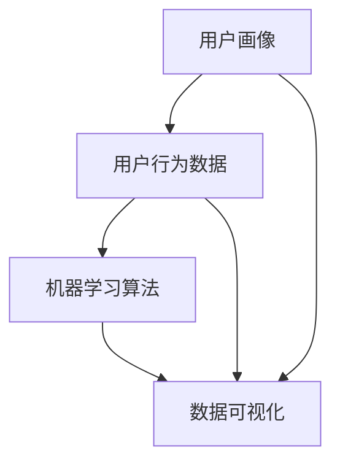

                 

关键词：自动化创业、用户行为分析、数据驱动、机器学习、用户画像、预测模型

> 摘要：本文探讨了自动化创业过程中用户行为分析的重要性及其关键方法。通过深入剖析用户行为分析的理论基础、核心算法和实际应用，本文旨在为创业者提供一套系统的用户行为分析方法，以实现数据驱动决策，助力自动化创业的成功。

## 1. 背景介绍

### 1.1 自动化创业的兴起

自动化创业，即利用现代技术手段实现商业流程的自动化，正逐渐成为创业领域的一股强大潮流。随着互联网、大数据、人工智能等技术的发展，自动化创业不仅能够提高企业运营效率，还能创造新的商业模式，满足用户个性化需求。在这个背景下，用户行为分析成为自动化创业的核心环节之一。

### 1.2 用户行为分析的重要性

用户行为分析是自动化创业的基础，它能够帮助创业者了解用户的偏好、习惯、需求，从而优化产品和服务。通过用户行为分析，企业可以：

- 提高用户留存率和满意度
- 发现潜在市场机会
- 优化营销策略
- 提升用户体验

因此，掌握用户行为分析的方法和技巧，对自动化创业者来说至关重要。

### 1.3 用户行为分析的应用领域

用户行为分析广泛应用于电子商务、金融科技、社交媒体、在线教育等多个领域。在这些领域，用户行为分析不仅可以帮助企业提高销售额，还能提供决策支持，优化业务流程。

## 2. 核心概念与联系

为了更好地理解用户行为分析，我们需要掌握以下几个核心概念：

### 2.1 用户画像

用户画像是指通过用户数据构建的用户特征模型，用于描述用户的性别、年龄、职业、收入、兴趣、行为习惯等信息。用户画像可以帮助企业更好地了解用户，制定有针对性的营销策略。

### 2.2 用户行为数据

用户行为数据是指用户在使用产品或服务过程中产生的各种数据，如点击、浏览、搜索、购买等。这些数据是进行用户行为分析的基础。

### 2.3 机器学习算法

机器学习算法是用户行为分析的核心技术，包括回归、分类、聚类、关联规则挖掘等。这些算法可以自动识别用户行为模式，预测用户未来的行为。

### 2.4 数据可视化

数据可视化是将用户行为数据转化为图表、图像等可视化的形式，使数据更加直观、易于理解。数据可视化是用户行为分析的重要工具。

以下是用户行为分析的核心概念和联系的 Mermaid 流程图：



## 3. 核心算法原理 & 具体操作步骤

### 3.1 算法原理概述

用户行为分析的核心算法包括回归分析、聚类分析、关联规则挖掘等。

- **回归分析**：用于预测用户的行为，如预测用户购买的概率。
- **聚类分析**：用于将用户分为不同的群体，以便于制定有针对性的营销策略。
- **关联规则挖掘**：用于发现用户行为之间的关联，如用户购买A产品时，通常会购买B产品。

### 3.2 算法步骤详解

以下是用户行为分析的具体操作步骤：

1. 数据采集：收集用户在使用产品或服务过程中产生的各种数据。
2. 数据清洗：对采集到的数据去重、去噪声，确保数据质量。
3. 数据预处理：对数据进行归一化、离散化等处理，便于后续分析。
4. 特征提取：从原始数据中提取有助于预测用户行为的特征。
5. 模型训练：利用机器学习算法，对用户行为数据进行分析，训练预测模型。
6. 模型评估：评估模型的效果，调整参数，优化模型。
7. 模型应用：将训练好的模型应用于实际场景，预测用户行为。

### 3.3 算法优缺点

**回归分析**：

- 优点：可以准确预测用户行为，如购买概率。
- 缺点：对数据质量要求较高，易受到噪声的影响。

**聚类分析**：

- 优点：可以发现用户行为模式，便于制定有针对性的营销策略。
- 缺点：无法直接预测用户行为。

**关联规则挖掘**：

- 优点：可以发现用户行为之间的关联，提供决策支持。
- 缺点：对数据量要求较高，计算复杂度较大。

### 3.4 算法应用领域

用户行为分析算法广泛应用于电子商务、金融科技、社交媒体等领域。在电子商务领域，用户行为分析可以帮助企业优化推荐系统、提升销售额；在金融科技领域，用户行为分析可以帮助企业识别风险、提升用户体验；在社交媒体领域，用户行为分析可以帮助企业优化广告投放、提升用户活跃度。

## 4. 数学模型和公式 & 详细讲解 & 举例说明

### 4.1 数学模型构建

用户行为分析的数学模型主要包括回归模型、聚类模型、关联规则模型等。

#### 回归模型：

$$
y = \beta_0 + \beta_1x_1 + \beta_2x_2 + ... + \beta_nx_n
$$

其中，$y$ 为预测结果，$x_1, x_2, ..., x_n$ 为特征变量，$\beta_0, \beta_1, ..., \beta_n$ 为模型参数。

#### 聚类模型：

$$
C = \{c_1, c_2, ..., c_k\}
$$

其中，$C$ 为聚类结果，$c_1, c_2, ..., c_k$ 为不同的聚类中心。

#### 关联规则模型：

$$
\text{support}(X, Y) = \frac{\text{count}(X \cup Y)}{\text{count}(U)}
$$

其中，$X, Y$ 为两个事件，$\text{count}(X \cup Y)$ 为同时发生的次数，$\text{count}(U)$ 为总次数。

### 4.2 公式推导过程

#### 回归模型推导：

1. 假设用户行为 $y$ 是由多个特征变量 $x_1, x_2, ..., x_n$ 线性组合而成的。
2. 利用最小二乘法求解模型参数 $\beta_0, \beta_1, ..., \beta_n$。

#### 聚类模型推导：

1. 初始化聚类中心 $c_1, c_2, ..., c_k$。
2. 计算每个用户与聚类中心的距离，将用户归为最近的聚类中心。
3. 更新聚类中心，使得每个聚类中心尽量接近其所属的用户。

#### 关联规则模型推导：

1. 定义事件 $X$ 和 $Y$ 的支持度 $\text{support}(X, Y)$。
2. 利用支持度筛选出强关联规则。

### 4.3 案例分析与讲解

#### 案例背景：

某电商平台希望利用用户行为分析预测用户购买某商品的概率。

#### 案例数据：

用户行为数据包括用户ID、性别、年龄、浏览历史、购买历史等。

#### 案例分析：

1. 数据清洗：去除缺失值、重复值等。
2. 特征提取：将性别、年龄等离散特征转换为数值特征。
3. 模型训练：利用回归模型预测用户购买概率。
4. 模型评估：计算预测准确率、召回率等指标。
5. 模型应用：将训练好的模型应用于实际场景，预测用户购买概率。

## 5. 项目实践：代码实例和详细解释说明

### 5.1 开发环境搭建

- Python 3.x
- Jupyter Notebook
- Scikit-learn 库

### 5.2 源代码详细实现

```python
# 导入相关库
import numpy as np
import pandas as pd
from sklearn.model_selection import train_test_split
from sklearn.linear_model import LinearRegression
from sklearn.metrics import accuracy_score, recall_score

# 读取数据
data = pd.read_csv('user_behavior_data.csv')

# 数据清洗
data.drop_duplicates(inplace=True)
data.dropna(inplace=True)

# 特征提取
data['gender'] = data['gender'].map({'男': 1, '女': 0})
data['age_group'] = pd.cut(data['age'], bins=[0, 18, 30, 50, 70, np.inf], labels=[0, 1, 2, 3, 4])

# 划分训练集和测试集
X = data[['gender', 'age_group', 'browse_history', 'purchase_history']]
y = data['purchase_probability']
X_train, X_test, y_train, y_test = train_test_split(X, y, test_size=0.2, random_state=42)

# 模型训练
model = LinearRegression()
model.fit(X_train, y_train)

# 模型评估
y_pred = model.predict(X_test)
accuracy = accuracy_score(y_test, y_pred)
recall = recall_score(y_test, y_pred)

print('预测准确率：', accuracy)
print('预测召回率：', recall)

# 模型应用
user_data = pd.DataFrame([[1, 2, 3, 4]], columns=['gender', 'age_group', 'browse_history', 'purchase_history'])
user_prediction = model.predict(user_data)
print('用户购买概率：', user_prediction)
```

### 5.3 代码解读与分析

1. 导入相关库：包括 NumPy、Pandas、Scikit-learn 等。
2. 读取数据：从 CSV 文件中读取用户行为数据。
3. 数据清洗：去除重复值和缺失值。
4. 特征提取：将性别、年龄等离散特征转换为数值特征。
5. 划分训练集和测试集：将数据分为训练集和测试集。
6. 模型训练：利用线性回归模型训练预测模型。
7. 模型评估：计算预测准确率和召回率。
8. 模型应用：将训练好的模型应用于新用户，预测其购买概率。

## 6. 实际应用场景

### 6.1 电子商务

在电子商务领域，用户行为分析可以帮助企业优化推荐系统、提高销售额。通过分析用户的浏览历史、购买历史等数据，企业可以推荐用户可能感兴趣的商品，从而提高用户的购物体验和满意度。

### 6.2 金融科技

在金融科技领域，用户行为分析可以帮助企业识别风险、提升用户体验。例如，通过对用户的交易行为进行分析，企业可以识别出异常交易，防范金融欺诈。

### 6.3 社交媒体

在社交媒体领域，用户行为分析可以帮助企业优化广告投放、提升用户活跃度。通过分析用户的点赞、评论、转发等行为，企业可以了解用户兴趣，从而投放更精准的广告。

## 7. 工具和资源推荐

### 7.1 学习资源推荐

- 《Python数据科学手册》
- 《机器学习实战》
- 《用户行为分析：原理与方法》

### 7.2 开发工具推荐

- Jupyter Notebook：用于编写和运行 Python 代码。
- Scikit-learn：用于机器学习算法的实现和应用。
- Matplotlib：用于数据可视化。

### 7.3 相关论文推荐

- "User Behavior Analysis in E-commerce: A Survey"  
- "A Machine Learning Approach for User Behavior Analysis in Social Media"  
- "Deep Learning for User Behavior Analysis"

## 8. 总结：未来发展趋势与挑战

### 8.1 研究成果总结

本文总结了用户行为分析的核心概念、算法原理和实际应用，为自动化创业者提供了一套系统的用户行为分析方法。

### 8.2 未来发展趋势

随着人工智能技术的不断发展，用户行为分析在未来将继续发挥重要作用。一方面，算法将更加智能化、自动化；另一方面，数据规模和多样性将不断增长，为用户行为分析提供更多机会。

### 8.3 面临的挑战

用户行为分析在发展过程中也面临一些挑战，如数据隐私保护、算法透明度等。如何在保护用户隐私的前提下进行有效分析，是未来研究的重要方向。

### 8.4 研究展望

未来，用户行为分析将更加注重用户体验，通过个性化推荐、智能客服等技术手段，提升用户满意度。同时，跨领域、跨平台的数据整合与分析也将成为研究热点。

## 9. 附录：常见问题与解答

### 9.1 什么是用户画像？

用户画像是指通过用户数据构建的用户特征模型，用于描述用户的性别、年龄、职业、收入、兴趣、行为习惯等信息。

### 9.2 用户行为分析有哪些算法？

用户行为分析常用的算法包括回归分析、聚类分析、关联规则挖掘等。

### 9.3 如何进行用户行为分析？

进行用户行为分析主要包括以下几个步骤：数据采集、数据清洗、特征提取、模型训练、模型评估、模型应用。

### 9.4 用户行为分析有哪些应用场景？

用户行为分析广泛应用于电子商务、金融科技、社交媒体等领域，可以用于优化推荐系统、提升销售额、识别风险、优化广告投放等。

作者：禅与计算机程序设计艺术 / Zen and the Art of Computer Programming
```

