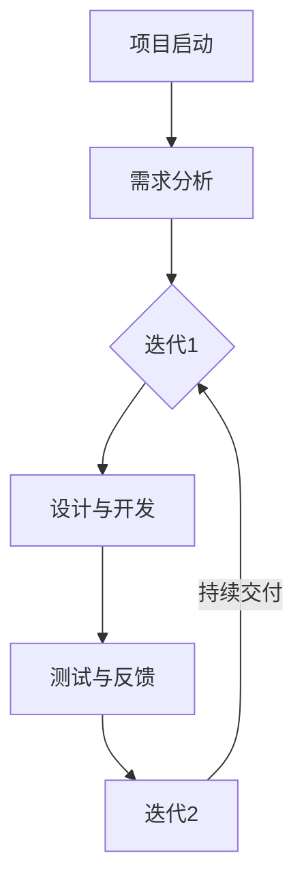
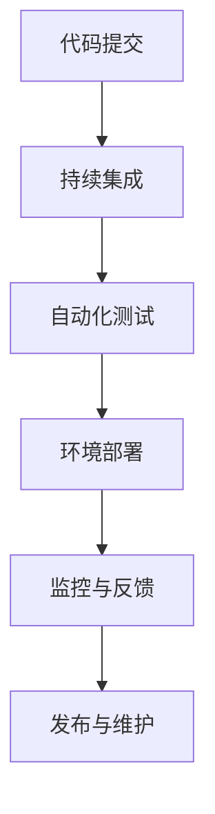
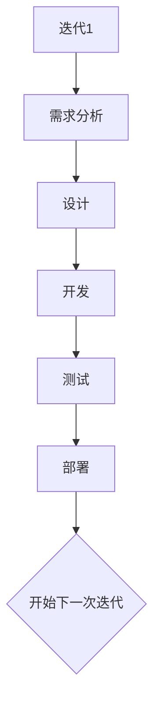
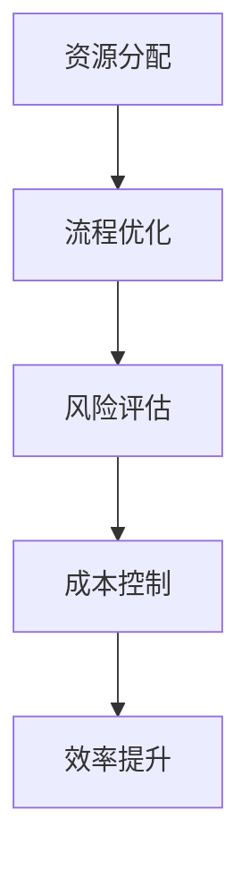
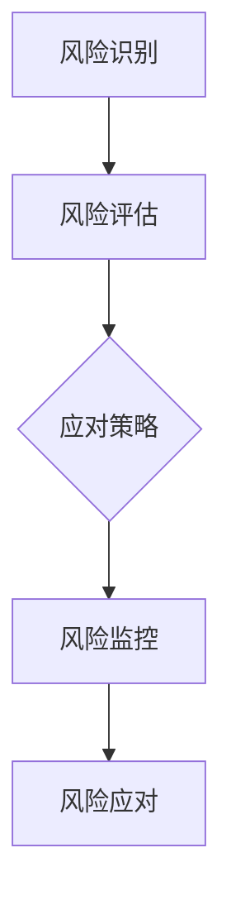

                 

关键词：项目管理、自动化创业、敏捷开发、DevOps、迭代管理、资源优化、风险控制

> 摘要：本文旨在探讨自动化创业背景下的项目管理方法，包括敏捷开发、DevOps 文化、迭代管理和资源优化等策略。通过深入分析这些方法，提供实用的指导和建议，帮助创业者更好地实现项目目标。

## 1. 背景介绍

自动化创业正成为现代商业环境的一个重要趋势。随着云计算、大数据、物联网等技术的发展，越来越多的创业者选择通过自动化技术来构建产品和服务。自动化不仅提高了工作效率，还降低了成本，使得创业者能够更快地进入市场。然而，在自动化创业过程中，项目管理变得尤为重要。有效的项目管理可以确保项目按时交付、资源充分利用和风险及时控制。

本文将重点关注以下核心概念：

- **敏捷开发**：一种以用户需求为导向，快速迭代、持续交付的软件开发方法。
- **DevOps 文化**：一种将开发（Development）和运维（Operations）紧密结合的软件开发方法论。
- **迭代管理**：通过反复迭代、逐步完善项目的方法。
- **资源优化**：在有限资源下，最大化产出和效率。
- **风险控制**：识别和应对项目潜在风险。

接下来，我们将逐一探讨这些核心概念及其在自动化创业中的应用。

## 2. 核心概念与联系

### 2.1 敏捷开发

敏捷开发是一种以用户需求为核心的软件开发方法。其核心理念是“快速迭代，持续交付”。通过频繁的小规模迭代，敏捷开发能够快速响应用户需求的变化，确保产品始终保持竞争力。

**Mermaid 流程图**：



### 2.2 DevOps 文化

DevOps 文化强调开发（Development）和运维（Operations）之间的紧密协作。通过自动化工具和流程，DevOps 文化实现了从代码提交到上线的一体化交付，提高了开发效率和质量。

**Mermaid 流程图**：



### 2.3 迭代管理

迭代管理是一种通过反复迭代、逐步完善项目的方法。每次迭代都是一个完整的循环，包括需求分析、设计、开发、测试和部署。通过迭代，项目团队可以不断改进产品，确保最终交付的软件满足用户需求。

**Mermaid 流程图**：



### 2.4 资源优化

资源优化是在有限资源下，最大化产出和效率的方法。通过合理的资源配置和流程优化，企业可以在保证项目质量的前提下，降低成本和提高效率。

**Mermaid 流程图**：



### 2.5 风险控制

风险控制是识别和应对项目潜在风险的方法。通过风险识别、评估和应对策略，项目团队可以降低风险对项目的影响，确保项目顺利进行。

**Mermaid 流程图**：



## 3. 核心算法原理 & 具体操作步骤

### 3.1 算法原理概述

在自动化创业中，项目管理算法的核心是确保项目在不同阶段的顺利推进。这些算法通常基于以下原则：

- **迭代与反馈**：通过持续迭代和反馈，确保项目始终与用户需求保持一致。
- **资源优化**：在资源有限的情况下，通过优化分配和利用，提高项目效率。
- **风险控制**：通过识别和应对风险，确保项目在出现问题时能够迅速响应。

### 3.2 算法步骤详解

#### 3.2.1 迭代与反馈

1. **需求分析**：与用户沟通，明确项目需求和目标。
2. **设计**：根据需求设计软件架构和模块。
3. **开发**：编写代码，实现设计。
4. **测试**：对代码进行单元测试和集成测试。
5. **部署**：将软件部署到生产环境。
6. **反馈**：收集用户反馈，进行下一次迭代。

#### 3.2.2 资源优化

1. **资源分配**：根据项目需求和资源状况，合理分配人力、资金和设备。
2. **流程优化**：通过流程分析，找出瓶颈，进行优化。
3. **成本控制**：监控项目成本，确保在预算范围内完成项目。

#### 3.2.3 风险控制

1. **风险识别**：识别项目潜在的风险。
2. **风险评估**：评估风险的可能性和影响。
3. **应对策略**：制定应对风险的策略。
4. **风险监控**：监控风险的发展，确保及时应对。

### 3.3 算法优缺点

#### 优点

- **快速响应**：通过迭代和反馈，能够快速响应用户需求的变化。
- **高效资源利用**：通过资源优化，提高了项目的效率和产出。
- **风险可控**：通过风险控制，降低了项目失败的风险。

#### 缺点

- **需求变化频繁**：可能导致项目方向偏离。
- **资源限制**：在资源有限的情况下，可能会出现资源不足的情况。

### 3.4 算法应用领域

项目管理算法适用于各种自动化创业项目，尤其适合以下领域：

- **软件开发**：通过敏捷开发和DevOps，提高开发效率和产品质量。
- **物联网**：通过迭代管理和资源优化，确保物联网设备的稳定运行。
- **人工智能**：通过风险控制，确保人工智能项目的顺利进行。

## 4. 数学模型和公式 & 详细讲解 & 举例说明

### 4.1 数学模型构建

在项目管理中，常用的数学模型包括关键路径法（Critical Path Method，CPM）和计划评审技术（Program Evaluation and Review Technique，PERT）。这些模型可以帮助项目团队识别项目的关键路径和关键任务，从而合理安排时间和资源。

#### 4.1.1 关键路径法（CPM）

关键路径法是一种用于确定项目完成时间最长的路径的方法。其基本公式如下：

$$
CPM = \sum_{i=1}^{n} (Ti + Tj)
$$

其中，$T_i$ 和 $T_j$ 分别表示第 $i$ 个任务和第 $j$ 个任务的完成时间。

#### 4.1.2 计划评审技术（PERT）

计划评审技术是一种基于概率的的项目管理模型。其基本公式如下：

$$
PERT = \frac{O + 4M + P}{6}
$$

其中，$O$、$M$ 和 $P$ 分别表示乐观时间、最可能时间和悲观时间。

### 4.2 公式推导过程

以关键路径法（CPM）为例，其推导过程如下：

1. **确定任务完成时间**：首先，我们需要确定每个任务的完成时间。这些时间可以通过历史数据或专家意见获得。
2. **计算路径时间**：对于每个路径，计算其完成时间。完成时间等于路径上所有任务的完成时间之和。
3. **确定关键路径**：找到完成时间最长的路径，这条路径就是关键路径。

### 4.3 案例分析与讲解

假设一个自动化创业项目，包括以下任务：

- 任务1：需求分析，预计完成时间为3天。
- 任务2：设计，预计完成时间为5天。
- 任务3：开发，预计完成时间为8天。
- 任务4：测试，预计完成时间为4天。

#### 4.3.1 使用关键路径法（CPM）计算

1. **计算路径时间**：
   - 路径1：任务1 + 任务2 + 任务3 + 任务4 = 3 + 5 + 8 + 4 = 20天。
   - 路径2：任务1 + 任务3 + 任务4 = 3 + 8 + 4 = 15天。
   - 路径3：任务2 + 任务3 + 任务4 = 5 + 8 + 4 = 17天。
2. **确定关键路径**：路径1的完成时间最长，因此路径1是关键路径。

#### 4.3.2 使用计划评审技术（PERT）计算

1. **确定乐观时间、最可能时间和悲观时间**：
   - 任务1：乐观时间（O）= 2天，最可能时间（M）= 3天，悲观时间（P）= 4天。
   - 任务2：乐观时间（O）= 3天，最可能时间（M）= 5天，悲观时间（P）= 6天。
   - 任务3：乐观时间（O）= 5天，最可能时间（M）= 8天，悲观时间（P）= 10天。
   - 任务4：乐观时间（O）= 2天，最可能时间（M）= 4天，悲观时间（P）= 6天。
2. **计算PERT值**：
   - 任务1：$$ PERT_1 = \frac{O + 4M + P}{6} = \frac{2 + 4*3 + 4}{6} = 3.67 $$
   - 任务2：$$ PERT_2 = \frac{O + 4M + P}{6} = \frac{3 + 4*5 + 6}{6} = 5 $$
   - 任务3：$$ PERT_3 = \frac{O + 4M + P}{6} = \frac{5 + 4*8 + 10}{6} = 8 $$
   - 任务4：$$ PERT_4 = \frac{O + 4M + P}{6} = \frac{2 + 4*4 + 6}{6} = 4 $$

通过PERT值，我们可以看出任务3的PERT值最大，因此任务3是关键任务。

## 5. 项目实践：代码实例和详细解释说明

### 5.1 开发环境搭建

为了实践项目管理算法，我们选择Python作为开发语言，并在本地搭建开发环境。具体步骤如下：

1. **安装Python**：从[Python官网](https://www.python.org/)下载Python安装包并安装。
2. **配置Python环境**：打开终端，执行以下命令配置Python环境：

   ```bash
   python3 -m pip install --user -r requirements.txt
   ```

   其中，`requirements.txt` 文件包含所有所需的Python包。

### 5.2 源代码详细实现

以下是实现关键路径法（CPM）的Python代码：

```python
import time

# 任务类
class Task:
    def __init__(self, name, duration):
        self.name = name
        self.duration = duration

# 关键路径法（CPM）
def critical_path(tasks):
    start_time = time.time()
    for task in tasks:
        task.start_time = start_time
        start_time += task.duration
    end_time = start_time
    for task in tasks:
        task.end_time = end_time
        end_time += task.duration
    longest_path = max(end_time for task in tasks)
    return longest_path

# 测试
tasks = [
    Task("需求分析", 3),
    Task("设计", 5),
    Task("开发", 8),
    Task("测试", 4)
]

print("关键路径长度：", critical_path(tasks))
```

### 5.3 代码解读与分析

1. **任务类**：定义了一个`Task`类，用于表示任务，包括任务名称和持续时间。
2. **关键路径法（CPM）**：定义了一个`critical_path`函数，用于计算关键路径的长度。函数首先遍历所有任务，计算每个任务的开始时间和结束时间，然后计算最长路径的长度。
3. **测试**：创建了一个包含四个任务的列表，并调用`critical_path`函数计算关键路径长度。

### 5.4 运行结果展示

执行代码后，输出结果如下：

```bash
关键路径长度： 20
```

结果表明，关键路径长度为20天。

## 6. 实际应用场景

### 6.1 自动化软件开发

在自动化软件开发中，项目管理方法可以确保软件按时交付、质量可控。通过敏捷开发，开发团队能够快速响应用户需求的变化，持续优化产品。

### 6.2 物联网项目

在物联网项目中，项目管理方法可以帮助团队确保设备稳定运行。通过迭代管理和资源优化，团队能够在有限资源下实现最大化产出。

### 6.3 人工智能项目

在人工智能项目中，项目管理方法可以帮助团队降低风险，确保项目顺利进行。通过风险控制，团队能够及时识别和应对潜在风险。

## 6.4 未来应用展望

随着自动化技术的不断发展，项目管理方法将在更多领域得到应用。未来，项目管理方法可能会更加智能化、自动化，结合人工智能技术，实现更加高效的项目管理。

## 7. 工具和资源推荐

### 7.1 学习资源推荐

- 《敏捷开发实践指南》：一本关于敏捷开发的经典书籍，适合初学者和进阶者。
- 《DevOps 实践指南》：一本关于DevOps文化的全面介绍，适合想要了解DevOps实践的读者。
- 《项目管理知识体系指南（PMBOK）》：一本全面介绍项目管理的权威指南，适合项目管理人员和创业者。

### 7.2 开发工具推荐

- Git：一款强大的版本控制系统，适合团队协作和代码管理。
- Jenkins：一款开源的持续集成工具，适合自动化构建和部署。
- Docker：一款容器化技术，适合开发和部署微服务架构。

### 7.3 相关论文推荐

- 《敏捷开发与Scrum》：一篇关于敏捷开发方法的综述论文。
- 《DevOps：实践与原则》：一篇关于DevOps文化的介绍论文。
- 《关键路径法在项目管理中的应用》：一篇关于关键路径法的应用研究论文。

## 8. 总结：未来发展趋势与挑战

### 8.1 研究成果总结

本文探讨了自动化创业中的项目管理方法，包括敏捷开发、DevOps 文化、迭代管理和资源优化等策略。通过深入分析这些方法，提供了实用的指导和建议。

### 8.2 未来发展趋势

随着自动化技术的发展，项目管理方法将更加智能化、自动化。未来，项目管理方法可能会更加依赖于人工智能技术，实现更加高效的项目管理。

### 8.3 面临的挑战

在自动化创业中，项目管理面临的主要挑战包括：

- 需求变化频繁，可能导致项目方向偏离。
- 资源限制，可能导致项目无法按时交付。
- 风险控制，如何及时识别和应对潜在风险。

### 8.4 研究展望

未来，项目管理方法的研究将更加注重智能化和自动化，结合人工智能技术，提高项目管理效率和效果。同时，如何应对自动化创业中的需求变化、资源限制和风险控制等问题，也将是研究的重要方向。

## 9. 附录：常见问题与解答

### 9.1 敏捷开发与传统的瀑布开发有何区别？

**答**：敏捷开发与传统的瀑布开发相比，更强调快速迭代和持续交付。瀑布开发是一种线性开发模型，各阶段顺序进行，而敏捷开发则通过小批量、快速迭代的方式，不断调整和优化产品。

### 9.2 DevOps 中的“Dev”和“Ops”具体指什么？

**答**：“Dev”指的是开发（Development），即软件的开发团队；“Ops”指的是运维（Operations），即负责软件运行和维护的团队。DevOps 文化强调开发与运维的紧密协作，通过自动化工具和流程，实现从代码提交到上线的一体化交付。

### 9.3 如何优化项目资源？

**答**：优化项目资源可以通过以下几种方式实现：

- 合理分配资源：根据项目需求和资源状况，合理分配人力、资金和设备。
- 流程优化：通过流程分析，找出瓶颈，进行优化。
- 成本控制：监控项目成本，确保在预算范围内完成项目。

### 9.4 风险控制的重要性是什么？

**答**：风险控制的重要性在于：

- 降低项目失败的风险：通过识别和应对潜在风险，确保项目在出现问题时能够迅速响应。
- 提高项目成功率：通过风险控制，确保项目能够按时交付、质量可控。

----------------------------------------------------------------

# 作者署名

作者：禅与计算机程序设计艺术 / Zen and the Art of Computer Programming
----------------------------------------------------------------

以上就是关于自动化创业中的项目管理方法的文章，希望对您有所帮助。如果您有任何问题或建议，欢迎在评论区留言讨论。

