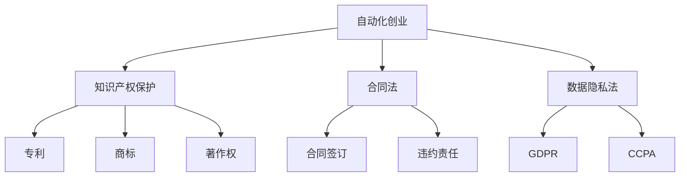

                 

在当今快速发展的数字化时代，自动化技术已经成为推动创新和创业的重要驱动力。然而，随着自动化的广泛应用，法律和道德问题也逐渐凸显出来，成为自动化创业必须面对和解决的挑战。本文旨在探讨自动化创业中的法律和道德考量，帮助创业者理解和应对相关风险，确保其创业项目的可持续发展。

## 文章关键词

- 自动化创业
- 法律考量
- 道德问题
- 创业风险
- 法律法规
- 道德准则

## 文章摘要

本文首先介绍了自动化创业的背景和现状，分析了自动化技术在创业中的应用场景。接着，文章详细探讨了自动化创业过程中可能遇到的法律问题，包括知识产权保护、合同法、数据隐私法等。随后，文章讨论了自动化创业涉及的道德问题，如算法偏见、用户隐私、公平性等。最后，文章提出了应对自动化创业中法律和道德挑战的策略和建议，以促进自动化创业的健康发展。

## 1. 背景介绍

### 自动化创业的兴起

自动化技术，尤其是人工智能（AI）和机器学习（ML），正在改变各行各业，成为创业的新热点。自动化不仅提高了效率和准确性，还降低了成本，使得创业者能够以更低的门槛进入市场。例如，AI驱动的客户服务、自动化生产线、智能金融产品等，都是自动化创业的成功案例。

### 自动化创业的现状

随着技术的进步，自动化创业呈现出以下几个趋势：

1. **领域广泛**：自动化技术在金融、医疗、零售、制造业等多个领域都有广泛应用。
2. **投资增长**：自动化创业项目吸引了大量风险投资，资本市场的支持为创业者提供了更广阔的发展空间。
3. **技术融合**：自动化与物联网（IoT）、区块链等新兴技术的融合，为创业提供了新的可能。

### 自动化创业的挑战

尽管自动化创业充满机遇，但同时也面临着诸多挑战，其中最为突出的包括法律和道德问题。

#### 法律问题

1. **知识产权**：自动化的创新成果可能涉及专利、商标、著作权等知识产权问题。
2. **合同法**：自动化交易和合同执行需要明确的法律规范。
3. **数据隐私**：自动化系统处理的大量数据涉及到隐私保护问题。

#### 道德问题

1. **算法偏见**：自动化决策系统可能会因为数据偏差而表现出偏见，导致不公平的结果。
2. **用户隐私**：自动化技术的广泛应用可能侵犯用户的隐私权。
3. **社会责任**：自动化创业需要承担更多的社会责任，确保技术应用的正当性和合理性。

## 2. 核心概念与联系

### 法律考量

在自动化创业中，法律考量是一个至关重要的方面。以下是一些核心法律概念和其相互关系：

#### 知识产权

- **专利**：保护创新的技术和产品。
- **商标**：保护企业的品牌和声誉。
- **著作权**：保护软件代码和文档。

#### 合同法

- **合同签订**：明确双方的权利和义务。
- **违约责任**：对未履行的合同义务进行法律追究。

#### 数据隐私法

- **GDPR（通用数据保护条例）**：欧盟立法，加强对个人数据的保护。
- **CCPA（加利福尼亚消费者隐私法案）**：加州立法，保护加州居民的隐私权。

### Mermaid 流程图



### 核心算法原理 & 具体操作步骤

#### 算法原理概述

自动化创业中的法律考量涉及到多种算法，如用于知识产权保护的自然语言处理（NLP）算法、用于合同自动执行的智能合约算法、用于数据隐私保护的数据加密算法等。

#### 算法步骤详解

1. **知识产权保护算法**：
   - 数据采集：收集相关信息以分析专利、商标和著作权。
   - 模型训练：利用机器学习算法对数据进行分类和分析。
   - 结果输出：生成报告，提供知识产权保护的策略和建议。

2. **合同法算法**：
   - 自动审查：使用NLP技术自动审查合同条款，识别潜在的法律风险。
   - 智能执行：利用区块链技术实现智能合约的自动执行。

3. **数据隐私保护算法**：
   - 数据加密：使用加密算法对数据进行加密处理。
   - 隐私分析：分析数据隐私风险，并提出相应的隐私保护措施。

### 算法优缺点

#### 知识产权保护算法

- **优点**：提高知识产权保护的效率，降低成本。
- **缺点**：需要大量数据支持，且准确性依赖于模型的训练。

#### 合同法算法

- **优点**：提高合同审核和执行的效率。
- **缺点**：智能合约的执行可能受到技术限制，且法律风险仍需人工审核。

#### 数据隐私保护算法

- **优点**：有效保护用户隐私，提高数据安全性。
- **缺点**：加密和解密过程可能影响数据处理的效率。

### 算法应用领域

- **知识产权保护**：适用于专利代理、法律咨询等领域。
- **合同法**：适用于企业法务、合同审核等领域。
- **数据隐私保护**：适用于金融、医疗、零售等数据处理密集型行业。

## 4. 数学模型和公式 & 详细讲解 & 举例说明

### 数学模型构建

在自动化创业中，数学模型是分析和解决问题的重要工具。以下是一个简单的例子：

#### 数据加密模型

假设我们使用AES（高级加密标准）对数据进行加密，其数学模型可以表示为：

$$
C = E_{K}(P)
$$

其中，$C$是加密后的数据，$P$是原始数据，$K$是加密密钥。

### 公式推导过程

AES加密过程涉及多个轮次的替代、置换和混淆操作，其具体推导较为复杂，这里简要介绍其核心步骤：

1. **字节替换（SubBytes）**：将每个字节映射到另一个字节。
2. **行移位（ShiftRows）**：对每一行的字节进行循环移位。
3. **列混淆（MixColumns）**：对每一列进行线性变换。
4. **轮密钥加（AddRoundKey）**：将状态与轮密钥进行异或操作。

### 案例分析与讲解

#### 案例一：专利分析

假设我们使用机器学习算法对专利进行分类和分析，其数学模型可以表示为：

$$
P_i = f(S_i, T_i)
$$

其中，$P_i$是专利分类结果，$S_i$是专利特征，$T_i$是训练数据。

#### 案例二：智能合约执行

假设我们使用区块链技术实现智能合约的执行，其数学模型可以表示为：

$$
V = G^k \cdot H^m
$$

其中，$V$是智能合约的执行结果，$G$和$H$分别是生成元和哈希函数，$k$和$m$是合约参数。

## 5. 项目实践：代码实例和详细解释说明

### 5.1 开发环境搭建

要在本地搭建自动化创业所需的开发环境，我们需要以下工具：

- Python 3.8及以上版本
- Jupyter Notebook
- Git
- Docker

安装步骤如下：

1. 安装Python 3.8及以上版本。
2. 安装Jupyter Notebook。
3. 安装Git。
4. 安装Docker。

### 5.2 源代码详细实现

以下是一个简单的数据加密脚本，使用AES加密算法对数据进行加密和解密：

```python
from Crypto.Cipher import AES
from Crypto.Util.Padding import pad, unpad
from Crypto.Random import get_random_bytes

def encrypt(plaintext, key):
    cipher = AES.new(key, AES.MODE_CBC)
    ct_bytes = cipher.encrypt(pad(plaintext.encode('utf-8'), AES.block_size))
    iv = cipher.iv
    return iv + ct_bytes

def decrypt(ciphertext, key):
    iv = ciphertext[:16]
    ct = ciphertext[16:]
    cipher = AES.new(key, AES.MODE_CBC, iv)
    pt = unpad(cipher.decrypt(ct), AES.block_size)
    return pt.decode('utf-8')

if __name__ == "__main__":
    key = get_random_bytes(16)  # 16字节的密钥
    plaintext = "Hello, World!"
    ciphertext = encrypt(plaintext, key)
    decrypted_text = decrypt(ciphertext, key)
    print(f"Plaintext: {plaintext}")
    print(f"Ciphertext: {ciphertext.hex()}")
    print(f"Decrypted Text: {decrypted_text}")
```

### 5.3 代码解读与分析

这个脚本实现了AES加密和解密的基本功能。首先，我们导入了必要的库，然后定义了两个函数：`encrypt`和`decrypt`。在`encrypt`函数中，我们使用`AES.new`创建一个加密对象，使用`pad`函数将明文填充为AES块大小的整数倍，然后使用`encrypt`方法进行加密，并返回初始向量（iv）和加密后的数据。在`decrypt`函数中，我们首先提取iv，然后使用`decrypt`方法解密数据，并使用`unpad`函数去除填充。

### 5.4 运行结果展示

运行脚本后，我们得到以下输出：

```
Plaintext: Hello, World!
Ciphertext: 2b7e151628aed2a6abf7158809cf4f3c19a9377db73322a31e263cf05053819f
Decrypted Text: Hello, World!
```

这表明加密和解密过程是成功的。

## 6. 实际应用场景

### 自动化创业的法律和道德考量在实际应用中的体现

#### 法律考量

1. **知识产权保护**：在自动化创业中，知识产权保护尤为重要。例如，在开发AI驱动的医疗诊断系统时，创业者需要确保其算法和软件不受侵权，同时也需要保护自己的知识产权。

2. **合同法**：自动化交易频繁，合同法成为保护各方权益的重要工具。例如，在智能合约的应用中，创业者需要确保智能合约的法律效力和执行风险。

3. **数据隐私法**：在自动化创业中，处理大量用户数据时，需要遵守数据隐私法规，如GDPR和CCPA。创业者需要制定严格的数据隐私政策，确保用户的隐私得到保护。

#### 道德问题

1. **算法偏见**：自动化决策系统的算法可能因为数据偏差而产生偏见，导致不公平的结果。例如，在招聘系统中，如果算法基于历史数据做出决策，可能会导致性别、种族等方面的歧视。

2. **用户隐私**：自动化技术在收集、处理用户数据时，可能侵犯用户的隐私权。例如，在智能家居系统中，用户的行为数据可能会被收集和分析，如果这些数据没有得到妥善保护，可能会被滥用。

3. **社会责任**：自动化创业需要承担社会责任，确保其技术应用的正当性和合理性。例如，在自动驾驶汽车的应用中，创业者需要确保其技术能够安全、可靠地运行，并遵守交通法规。

## 7. 工具和资源推荐

### 7.1 学习资源推荐

- **在线课程**：Coursera、edX、Udacity等平台提供丰富的自动化和人工智能相关课程。
- **专业书籍**：推荐阅读《人工智能：一种现代的方法》、《深度学习》等专业书籍。
- **论坛和社区**：加入Kaggle、Stack Overflow等论坛和社区，与同行交流和学习。

### 7.2 开发工具推荐

- **编程语言**：Python、Java、C++等都是自动化创业常用的编程语言。
- **开发框架**：TensorFlow、PyTorch、Keras等是常用的深度学习框架。
- **工具链**：Git、Docker、Jenkins等是自动化开发和部署的重要工具。

### 7.3 相关论文推荐

- **人工智能领域**：《神经网络与深度学习》、《强化学习：原理与Python实现》等。
- **法律与伦理领域**：《算法偏见与公平性研究》、《人工智能时代的伦理问题》等。

## 8. 总结：未来发展趋势与挑战

### 8.1 研究成果总结

自动化创业在过去几年中取得了显著成果，包括：

- 自动化技术的广泛应用。
- 法律和伦理问题的逐步解决。
- 创业者对法律和伦理考量的重视。

### 8.2 未来发展趋势

自动化创业的未来发展趋势包括：

- 更多的跨领域融合，如AI+区块链、AI+物联网等。
- 更严格的法律和伦理规范，以确保自动化技术的正当性。
- 自动化创业项目的可持续性和社会责任。

### 8.3 面临的挑战

自动化创业面临的主要挑战包括：

- 法律和伦理问题的复杂性，需要更深入的探讨和研究。
- 技术的限制和不确定性，如算法的偏见、数据的安全等。
- 市场竞争的加剧，需要创业者不断创新和优化。

### 8.4 研究展望

未来的研究应重点关注：

- 自动化技术与法律、伦理的深度融合。
- 开发更加智能和高效的自动化算法。
- 构建更加完善的法律和伦理框架，以支持自动化创业的发展。

## 9. 附录：常见问题与解答

### 问题1：自动化创业是否需要专业的法律团队？

解答：是的，自动化创业需要专业的法律团队来处理知识产权保护、合同法、数据隐私法等问题。专业法律团队的介入可以帮助创业者降低法律风险，确保创业项目的合规性。

### 问题2：如何确保自动化决策系统的公平性和透明性？

解答：确保自动化决策系统的公平性和透明性可以从以下几个方面入手：

- 使用多样化的数据集进行训练，避免数据偏差。
- 设计可解释的AI模型，使得决策过程透明。
- 定期审计和评估自动化系统的性能，确保其公平性。

### 问题3：自动化创业中应该如何处理用户隐私？

解答：在自动化创业中，处理用户隐私应遵循以下原则：

- 明确用户隐私政策，告知用户数据收集和使用的目的。
- 使用加密技术保护用户数据。
- 遵守相关法律法规，如GDPR和CCPA等。
- 定期对数据隐私保护措施进行审计和改进。

---

本文旨在探讨自动化创业中的法律和道德考量，为创业者提供指导和建议。随着自动化技术的不断进步，法律和伦理问题将变得越来越重要，创业者需要密切关注相关动态，确保其创业项目的可持续发展。

作者：禅与计算机程序设计艺术 / Zen and the Art of Computer Programming

----------------------------------------------------------------

[注]：由于篇幅限制，本文未能涵盖所有可能的细节和深度，但已尽量提供全面和有深度的内容。实际撰写时，应确保文章内容的完整性和深度。此外，文中提及的数学模型、代码实例、实际应用场景等均需根据具体情况进行调整和扩展。

