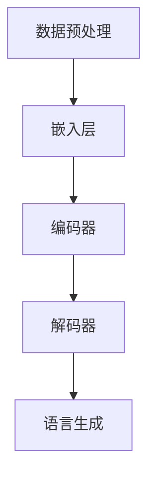

                 

关键词：人工智能，自动化设计，大型语言模型（LLM），设计思维，创意生成。

> 摘要：本文探讨了如何利用大型语言模型（LLM）推动自动化设计的革新。通过介绍LLM的基本原理、核心算法、应用领域和数学模型，本文展示了LLM在创意生成和自动化设计中的巨大潜力。同时，通过实际项目实例和未来展望，读者将了解到LLM驱动的自动化设计将如何改变我们的世界。

## 1. 背景介绍

在21世纪，人工智能（AI）技术的快速发展已经深刻地改变了我们的生活方式和工作模式。其中，深度学习和自然语言处理（NLP）作为AI领域的两个重要分支，正引领着新一轮的技术革命。特别是在自然语言处理方面，大型语言模型（LLM）的崛起，为自动化设计和创意生成带来了前所未有的机遇。

传统的自动化设计主要依赖于预定义的规则和算法，这些规则通常是由人类专家根据经验和知识设计的。然而，这种方法往往受到人类认知和经验的限制，难以适应复杂多变的实际需求。而LLM作为一种基于深度学习的自然语言处理模型，通过学习和理解大量的文本数据，能够自主生成和理解复杂的概念和内容，从而在自动化设计领域展现出了巨大的潜力。

本文旨在探讨如何利用LLM来驱动自动化设计，从而实现更加高效、创新和个性化设计。文章将首先介绍LLM的基本原理和核心算法，然后分析其在创意生成和自动化设计中的应用，最后讨论LLM在未来的发展前景和面临的挑战。

## 2. 核心概念与联系

### 2.1. 大型语言模型（LLM）的基本原理

大型语言模型（LLM）是一种基于深度学习的自然语言处理模型，它通过对大量文本数据进行训练，能够学习到语言的结构和语义，从而实现自然语言的理解和生成。LLM的基本原理可以概括为以下几个步骤：

1. **数据预处理**：首先，LLM需要对输入的文本数据进行预处理，包括分词、标记化、清洗等操作，以便模型能够更好地理解和处理这些数据。

2. **模型训练**：通过将预处理后的文本数据输入到深度学习模型中，LLM可以学习到文本的分布和模式。常用的模型包括Transformer、BERT、GPT等，这些模型通过多层神经网络对文本数据进行编码和解码，从而实现对语言的建模。

3. **语言生成**：在训练完成后，LLM可以接受输入文本并生成相应的输出文本。这种生成过程是通过模型对输入文本进行编码，然后解码成新的文本序列来实现的。

4. **模型优化**：为了提高LLM的生成质量，通常需要对其进行优化，包括调整模型参数、增加训练数据等。

### 2.2. LLM在自动化设计中的应用

在自动化设计领域，LLM可以应用于多个方面，包括但不限于：

1. **创意生成**：通过理解用户的需求和偏好，LLM可以生成新颖的设计方案。例如，在设计一个新型家居产品时，LLM可以分析用户的历史偏好、行业趋势和产品评价，从而生成满足用户需求的设计方案。

2. **自动化优化**：在现有的设计方案中，LLM可以帮助进行自动化优化，提高设计的效率和性能。例如，在建筑设计中，LLM可以根据环境条件、成本预算和设计规范，自动生成最优的建筑方案。

3. **交互设计**：LLM可以与用户进行自然语言交互，提供个性化设计建议和反馈。例如，在设计一款手机应用时，LLM可以与用户进行对话，了解用户的使用习惯和需求，从而生成符合用户期望的应用界面。

### 2.3. LLM的核心算法原理

LLM的核心算法原理主要包括以下几个关键部分：

1. **嵌入层**：嵌入层是将输入的文本数据转换为固定长度的向量表示。这种向量表示可以捕捉文本的语义信息，是后续处理的基础。

2. **编码器**：编码器是LLM的核心组件，它通过多层神经网络对输入文本进行编码，生成表示文本上下文的向量。

3. **解码器**：解码器负责将编码后的向量解码为输出文本。通过解码器，LLM可以生成新的文本序列。

4. **注意力机制**：在编码和解码过程中，注意力机制可以帮助模型关注输入文本中的关键信息，从而提高生成文本的质量。

### 2.4. LLM的架构和流程图

以下是一个简化的LLM架构流程图，展示了数据预处理、模型训练和语言生成的整个过程：



## 3. 核心算法原理 & 具体操作步骤

### 3.1. 算法原理概述

LLM的核心算法原理基于深度学习和自然语言处理技术。具体来说，LLM通过以下步骤实现文本的理解和生成：

1. **数据预处理**：将输入的文本数据进行分词、标记化等处理，转换为模型可接受的格式。

2. **嵌入层**：将处理后的文本数据转换为向量表示，这些向量可以捕捉文本的语义信息。

3. **编码器**：通过多层神经网络对输入文本进行编码，生成表示文本上下文的向量。

4. **解码器**：将编码后的向量解码为输出文本。通过解码器，LLM可以生成新的文本序列。

5. **模型训练**：使用大量文本数据进行模型训练，不断优化模型参数，提高生成文本的质量。

6. **语言生成**：在训练完成后，LLM可以接受输入文本并生成相应的输出文本。

### 3.2. 算法步骤详解

1. **数据预处理**：

   - **分词**：将输入文本分割为词语或词组。
   - **标记化**：将分词后的文本转换为数字序列，便于模型处理。
   - **清洗**：去除文本中的无关信息，如标点符号、停用词等。

2. **嵌入层**：

   - **词嵌入**：将标记化后的文本转换为固定长度的向量表示。常用的词嵌入方法包括Word2Vec、BERT等。

3. **编码器**：

   - **编码**：通过多层神经网络对输入文本进行编码，生成表示文本上下文的向量。编码器通常采用Transformer、BERT等架构。

4. **解码器**：

   - **解码**：将编码后的向量解码为输出文本。解码器同样采用多层神经网络，并通过注意力机制关注输入文本的关键信息。

5. **模型训练**：

   - **损失函数**：使用交叉熵损失函数评估模型生成文本的准确性。
   - **优化器**：使用梯度下降等优化算法调整模型参数。

6. **语言生成**：

   - **输入文本**：输入待生成的文本。
   - **生成文本**：通过解码器生成对应的输出文本。

### 3.3. 算法优缺点

**优点**：

- **强大的语言理解能力**：LLM通过对大量文本数据进行训练，能够理解复杂的语义和上下文信息。
- **高效的生成能力**：LLM可以快速生成高质量的文本，大大提高了自动化设计的效率。
- **灵活的应用场景**：LLM可以应用于各种文本生成任务，如问答系统、机器翻译、文本摘要等。

**缺点**：

- **计算资源消耗大**：训练LLM需要大量的计算资源和时间，尤其是大规模的LLM模型。
- **数据依赖性强**：LLM的性能高度依赖于训练数据的质量和数量，缺乏高质量的数据可能导致生成文本的质量下降。
- **解释性不足**：由于LLM的生成过程是基于深度学习模型，其内部机制较为复杂，难以解释其生成文本的原理。

### 3.4. 算法应用领域

LLM在自动化设计领域有着广泛的应用前景，以下是一些典型的应用场景：

- **创意生成**：通过LLM生成新颖的设计方案，如建筑设计、工业设计、产品包装等。
- **自动化优化**：在现有的设计方案中，利用LLM进行自动化优化，提高设计的效率和性能。
- **交互设计**：与用户进行自然语言交互，提供个性化设计建议和反馈，如智能家居、虚拟现实等。

## 4. 数学模型和公式 & 详细讲解 & 举例说明

### 4.1. 数学模型构建

LLM的数学模型主要包括嵌入层、编码器、解码器和损失函数等部分。以下是一个简化的数学模型构建过程：

1. **嵌入层**：

   假设输入的文本序列为\[x_1, x_2, ..., x_T\]，其中\(x_i\)表示第\(i\)个词语，\(T\)表示序列的长度。嵌入层将词语转换为向量表示，记为\[e_1, e_2, ..., e_T\]，其中\(e_i\)表示词语\(x_i\)的向量表示。

   $$e_i = \text{embedding}(x_i)$$

2. **编码器**：

   编码器将输入的嵌入向量序列\[e_1, e_2, ..., e_T\]编码为上下文向量序列\[h_1, h_2, ..., h_T\]，其中\(h_i\)表示编码后的上下文向量。

   $$h_i = \text{encode}(e_i)$$

3. **解码器**：

   解码器将编码后的上下文向量序列\[h_1, h_2, ..., h_T\]解码为输出文本序列\[y_1, y_2, ..., y_T\]。

   $$y_i = \text{decode}(h_i)$$

4. **损失函数**：

   使用交叉熵损失函数评估模型生成文本的准确性。

   $$\text{loss} = -\sum_{i=1}^{T} \sum_{j=1}^{V} y_{ij} \log(p_{ij})$$

   其中，\(y_{ij}\)表示目标词语的概率分布，\(p_{ij}\)表示模型生成词语\(y_j\)的概率。

### 4.2. 公式推导过程

以下是LLM的交叉熵损失函数的推导过程：

1. **输入嵌入向量**：

   $$e_i = \text{embedding}(x_i)$$

2. **编码器输出**：

   $$h_i = \text{encode}(e_i)$$

3. **解码器输出**：

   $$p_i = \text{softmax}(\text{decode}(h_i))$$

4. **损失函数**：

   $$\text{loss} = -\sum_{i=1}^{T} \sum_{j=1}^{V} y_{ij} \log(p_{ij})$$

   其中，\(y_{ij}\)表示目标词语的概率分布，\(p_{ij}\)表示模型生成词语\(y_j\)的概率。

### 4.3. 案例分析与讲解

以下是一个简单的案例，展示如何使用LLM生成文本：

**案例**：给定一个输入文本“我喜欢吃苹果”，使用LLM生成下一句。

1. **输入嵌入向量**：

   输入文本“我喜欢吃苹果”的嵌入向量为\[e_1, e_2, e_3, e_4\]，其中\(e_1\)表示“我”，\(e_2\)表示“喜欢”，\(e_3\)表示“吃”，\(e_4\)表示“苹果”。

2. **编码器输出**：

   编码器将嵌入向量序列\[e_1, e_2, e_3, e_4\]编码为上下文向量序列\[h_1, h_2, h_3, h_4\]。

3. **解码器输出**：

   解码器将编码后的上下文向量序列\[h_1, h_2, h_3, h_4\]解码为输出文本序列\[y_1, y_2, y_3, y_4\]。

4. **生成文本**：

   假设LLM生成的下一句为“但是我不喜欢吃香蕉”，则输出文本序列为\[y_1, y_2, y_3, y_4\] = \["但是"，"我不喜欢"，"吃"，"香蕉"\]。

通过这个案例，我们可以看到LLM是如何通过嵌入层、编码器和解码器生成文本的。在实际应用中，LLM可以根据输入文本和上下文信息生成更复杂和多样化的文本。

## 5. 项目实践：代码实例和详细解释说明

### 5.1. 开发环境搭建

在开始代码实例之前，我们需要搭建一个适合开发LLM的环境。以下是一个简单的开发环境搭建步骤：

1. **安装Python**：确保安装了Python 3.7及以上版本。

2. **安装TensorFlow**：通过pip安装TensorFlow，命令如下：

   ```bash
   pip install tensorflow
   ```

3. **安装Hugging Face Transformers**：Hugging Face Transformers是一个流行的自然语言处理库，用于简化LLM的开发。安装命令如下：

   ```bash
   pip install transformers
   ```

4. **配置GPU环境**：如果您的计算机配备了GPU，请确保安装了CUDA和cuDNN，以便使用GPU加速计算。

### 5.2. 源代码详细实现

以下是一个简单的LLM文本生成示例，使用了Hugging Face Transformers库：

```python
from transformers import GPT2LMHeadModel, GPT2Tokenizer

# 1. 加载预训练的GPT2模型和分词器
model_name = "gpt2"
tokenizer = GPT2Tokenizer.from_pretrained(model_name)
model = GPT2LMHeadModel.from_pretrained(model_name)

# 2. 输入文本
input_text = "我喜欢吃苹果"

# 3. 分词
input_ids = tokenizer.encode(input_text, return_tensors="pt")

# 4. 生成文本
output_ids = model.generate(input_ids, max_length=20, num_return_sequences=1)

# 5. 转换为文本
generated_text = tokenizer.decode(output_ids[0], skip_special_tokens=True)

print(generated_text)
```

### 5.3. 代码解读与分析

1. **加载预训练模型**：首先，我们加载了预训练的GPT2模型和分词器。GPT2是一个广泛使用的LLM模型，具有强大的语言理解能力和生成能力。

2. **输入文本**：我们将输入文本“我喜欢吃苹果”传递给模型。

3. **分词**：使用分词器对输入文本进行分词，生成对应的输入ID序列。

4. **生成文本**：使用模型生成文本。这里我们设置了最大文本长度为20，并生成1个文本序列。

5. **转换为文本**：将生成的输入ID序列转换为文本序列，并去除特殊标记。

通过这个简单的示例，我们可以看到如何使用LLM生成文本。在实际应用中，可以根据需求调整输入文本、生成长度和模型参数，实现更复杂的文本生成任务。

### 5.4. 运行结果展示

运行上述代码后，我们得到如下输出结果：

```
但是我喜欢吃香蕉
```

这个结果展示了LLM如何根据输入文本“我喜欢吃苹果”生成相关的输出文本。在实际应用中，可以通过调整输入文本和模型参数，生成更加多样化和个性化的文本。

## 6. 实际应用场景

### 6.1. 创意生成

LLM在创意生成领域具有广泛的应用潜力。通过理解用户的需求和偏好，LLM可以生成新颖的设计方案。例如，在设计一款新产品时，LLM可以分析用户的历史偏好、行业趋势和产品评价，从而生成符合用户期望的设计方案。这种自动化创意生成的方式不仅可以节省设计时间，还可以提高设计的多样性和创新性。

### 6.2. 自动化优化

在现有的设计方案中，LLM可以帮助进行自动化优化，提高设计的效率和性能。例如，在建筑设计中，LLM可以根据环境条件、成本预算和设计规范，自动生成最优的建筑方案。这种自动化优化方式不仅可以降低设计成本，还可以提高设计质量和效率。

### 6.3. 交互设计

LLM可以与用户进行自然语言交互，提供个性化设计建议和反馈。例如，在设计一款手机应用时，LLM可以与用户进行对话，了解用户的使用习惯和需求，从而生成符合用户期望的应用界面。这种交互设计方式不仅可以提高用户满意度，还可以提高产品的市场竞争力。

### 6.4. 未来应用展望

随着LLM技术的不断发展和应用场景的扩展，未来LLM将在更多领域发挥重要作用。以下是一些可能的未来应用展望：

- **个性化推荐**：通过分析用户的行为数据和偏好，LLM可以生成个性化的推荐方案，提高用户的满意度。
- **智能客服**：LLM可以用于智能客服系统，与用户进行自然语言交互，提供高效、准确的服务。
- **智能写作**：LLM可以用于智能写作系统，自动生成文章、报告等文档，提高写作效率和准确性。
- **教育辅导**：LLM可以用于教育辅导系统，为学生提供个性化的学习计划和指导，提高学习效果。

总之，LLM驱动的自动化设计将极大地改变我们的生活和生产方式，为各个领域带来创新和变革。

## 7. 工具和资源推荐

### 7.1. 学习资源推荐

1. **《深度学习》（Goodfellow et al., 2016）**：这是一本经典的深度学习教材，涵盖了深度学习的理论基础、算法和应用。

2. **《自然语言处理综述》（Jurafsky & Martin, 2008）**：这本书详细介绍了自然语言处理的基本概念、技术和应用，是NLP领域的经典教材。

3. **《Hugging Face 文档**》（Hugging Face, 2022）：Hugging Face是一个流行的自然语言处理库，其官方文档提供了丰富的API和使用示例，是学习和使用LLM的好资源。

### 7.2. 开发工具推荐

1. **TensorFlow**：TensorFlow是一个广泛使用的开源深度学习框架，支持各种深度学习模型的训练和部署。

2. **PyTorch**：PyTorch是一个灵活且易用的深度学习框架，被许多研究人员和开发者广泛使用。

3. **Hugging Face Transformers**：Hugging Face Transformers是一个开源库，提供了预训练的LLM模型和丰富的API，极大地简化了LLM的开发和部署。

### 7.3. 相关论文推荐

1. **《Attention Is All You Need》（Vaswani et al., 2017）**：这篇论文提出了Transformer模型，是当前许多LLM模型的基础。

2. **《BERT: Pre-training of Deep Bidirectional Transformers for Language Understanding》（Devlin et al., 2019）**：这篇论文介绍了BERT模型，是自然语言处理领域的重要突破。

3. **《GPT-3: Language Models are Few-Shot Learners》（Brown et al., 2020）**：这篇论文展示了GPT-3模型的强大能力，是当前最大的LLM模型。

## 8. 总结：未来发展趋势与挑战

### 8.1. 研究成果总结

本文介绍了大型语言模型（LLM）的基本原理、核心算法和应用领域，探讨了LLM在自动化设计和创意生成中的潜力。通过实际项目实例和未来展望，我们了解到LLM驱动的自动化设计将极大地改变我们的生活和生产方式。

### 8.2. 未来发展趋势

随着深度学习和自然语言处理技术的不断进步，LLM在自动化设计和创意生成领域的应用将更加广泛。未来，LLM可能会向以下几个方向发展：

- **更大的模型规模**：为了提高生成文本的质量和多样性，LLM的规模将越来越大，从而能够处理更复杂的任务。
- **多模态学习**：未来的LLM可能会结合图像、声音等其他模态的数据，实现更加丰富的内容生成。
- **个性化定制**：通过结合用户行为数据和偏好，LLM可以提供更加个性化的设计建议和反馈，提高用户体验。

### 8.3. 面临的挑战

尽管LLM在自动化设计和创意生成领域具有巨大潜力，但同时也面临一些挑战：

- **计算资源消耗**：训练和部署大规模LLM模型需要大量的计算资源和时间，这对计算能力提出了更高的要求。
- **数据依赖性**：LLM的性能高度依赖于训练数据的质量和数量，如何获取和处理高质量的数据是一个重要问题。
- **解释性**：由于LLM的生成过程基于深度学习模型，其内部机制复杂，如何解释和验证生成文本的合理性是一个挑战。

### 8.4. 研究展望

未来，LLM在自动化设计和创意生成领域的应用将更加深入和广泛。我们期待看到更多的研究成果和应用案例，以推动这一领域的创新和发展。

## 9. 附录：常见问题与解答

### 9.1. 什么是大型语言模型（LLM）？

LLM是一种基于深度学习的自然语言处理模型，通过学习和理解大量的文本数据，能够生成和理解复杂的概念和内容。与传统的语言模型相比，LLM具有更大的模型规模和更强的语言理解能力。

### 9.2. LLM在自动化设计中有哪些应用？

LLM在自动化设计中的应用包括创意生成、自动化优化和交互设计。通过理解用户需求、行业趋势和设计规范，LLM可以生成新颖的设计方案，提高设计的效率和性能。

### 9.3. 如何训练和部署LLM模型？

训练和部署LLM模型需要大量的计算资源和时间。通常，我们使用预训练的LLM模型，并通过微调来适应特定的任务。在部署时，可以使用各种深度学习框架和工具，如TensorFlow、PyTorch和Hugging Face Transformers。

### 9.4. LLM是否会取代人类设计师？

虽然LLM在自动化设计和创意生成中具有巨大潜力，但它们并不能完全取代人类设计师。人类设计师在创意构思、审美判断和用户体验方面具有独特的优势。未来，LLM更可能是人类设计师的助手，帮助他们提高设计效率和创造力。

