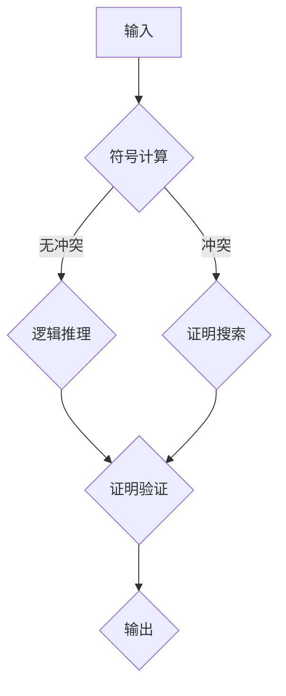

                 

关键词：自动推理库，AI决策系统，算法原理，数学模型，项目实践，未来展望

> 摘要：本文深入探讨了自动推理库在人工智能决策系统中的应用。通过阐述自动推理库的核心概念、算法原理、数学模型以及具体实现，本文旨在为开发者提供一个全面的技术指南，以推动AI决策系统的创新与发展。

## 1. 背景介绍

随着人工智能技术的迅速发展，自动推理库（Automatic Theorem Prover，简称ATP）成为构建高效、可靠的AI决策系统的重要工具。自动推理库是一种计算机程序，它能够自动地证明数学定理或验证逻辑命题。在AI决策系统中，自动推理库可以用来进行复杂推理、验证决策逻辑的正确性以及优化决策过程。

自动推理库的研究始于20世纪50年代，当时计算机科学刚刚起步。随着计算机硬件和算法的发展，自动推理库的性能和功能得到了显著提升。如今，自动推理库已广泛应用于数学、计算机科学、工程学等多个领域，成为人工智能决策系统的核心组成部分。

## 2. 核心概念与联系

### 2.1 自动推理库的核心概念

自动推理库主要包括以下几个核心概念：

- **定理证明**：自动推理库的基本功能是证明数学定理。定理证明过程涉及符号计算、逻辑推理、证明搜索等步骤。
  
- **逻辑推理**：自动推理库利用逻辑推理来推导新的命题。逻辑推理包括演绎推理、归纳推理等。

- **证明搜索**：自动推理库通过搜索证明空间来找到定理的证明。证明搜索算法包括基于规则的搜索、基于约束的搜索等。

### 2.2 自动推理库与AI决策系统的联系

自动推理库与AI决策系统之间的联系主要体现在以下几个方面：

- **逻辑推理**：自动推理库提供的逻辑推理功能可以帮助AI决策系统进行复杂推理，提高决策的准确性。

- **验证**：自动推理库可以验证决策逻辑的正确性，确保AI决策系统的可靠性。

- **优化**：自动推理库可以帮助AI决策系统优化决策过程，提高决策效率。

### 2.3 自动推理库的架构

为了更好地理解自动推理库，我们使用Mermaid流程图来展示其基本架构：



在这个流程图中，输入经过符号计算后，进入逻辑推理阶段。如果出现逻辑冲突，则进入证明搜索阶段。最终，通过证明验证后输出结果。

## 3. 核心算法原理 & 具体操作步骤

### 3.1 算法原理概述

自动推理库的核心算法包括定理证明算法、逻辑推理算法和证明搜索算法。下面我们将分别介绍这些算法的基本原理。

#### 3.1.1 定理证明算法

定理证明算法的基本原理是使用形式化的方法来证明数学定理。常见的定理证明算法包括：

- **归纳证明**：通过证明基例和归纳步骤来证明一个数学定理。

- **构造性证明**：通过构造具体的例子来证明一个数学定理。

- **化简证明**：通过化简数学表达式来证明定理。

#### 3.1.2 逻辑推理算法

逻辑推理算法的基本原理是基于逻辑规则进行推理。常见的逻辑推理算法包括：

- **演绎推理**：从前提推导出结论。

- **归纳推理**：从具体例子推导出一般性结论。

- **约束推理**：基于约束条件进行推理。

#### 3.1.3 证明搜索算法

证明搜索算法的基本原理是在证明空间中搜索证明路径。常见的证明搜索算法包括：

- **深度优先搜索**：从根节点开始，逐层深入搜索。

- **宽度优先搜索**：从根节点开始，逐层扩展搜索。

- **启发式搜索**：利用启发式信息来指导搜索过程。

### 3.2 算法步骤详解

下面我们将详细阐述自动推理库的算法步骤。

#### 3.2.1 定理证明算法步骤

1. **输入预处理**：对输入的定理进行预处理，将自然语言描述转换为形式化的数学表达式。

2. **基例证明**：证明定理的基例，通常是简单的特例。

3. **归纳证明**：如果基例成立，则证明归纳步骤，即证明对于任意自然数n，定理也成立。

4. **构造性证明**：如果无法直接证明归纳步骤，则通过构造具体的例子来证明定理。

5. **化简证明**：对定理的数学表达式进行化简，直到证明成立。

#### 3.2.2 逻辑推理算法步骤

1. **输入预处理**：将输入的逻辑命题转换为形式化的逻辑表达式。

2. **前提推导**：根据前提条件和逻辑规则，推导出结论。

3. **递归推导**：如果结论无法直接推导，则递归地应用逻辑规则进行推理。

4. **归纳推导**：如果存在递归定义的量词，则进行归纳推导。

5. **约束推导**：根据约束条件进行推理。

#### 3.2.3 证明搜索算法步骤

1. **初始化**：初始化证明空间，通常使用栈或队列来存储待处理的证明节点。

2. **深度优先搜索**：从根节点开始，逐层深入搜索证明空间。

3. **宽度优先搜索**：从根节点开始，逐层扩展搜索证明空间。

4. **启发式搜索**：根据启发式信息来选择下一个搜索节点。

5. **证明验证**：验证找到的证明路径是否满足定理或逻辑命题。

### 3.3 算法优缺点

#### 3.3.1 优点

- **高效性**：自动推理库可以自动地证明数学定理或验证逻辑命题，大大提高了推理和验证的效率。

- **可靠性**：自动推理库基于严格的数学原理和算法，可以保证推理和验证的可靠性。

- **灵活性**：自动推理库可以根据不同的应用需求进行定制化，适用于各种场景。

#### 3.3.2 缺点

- **计算复杂度**：定理证明和逻辑推理通常具有很高的计算复杂度，可能导致搜索空间过大。

- **规则依赖**：自动推理库的性能依赖于规则库的丰富性和质量，缺乏足够的规则可能导致推理失败。

### 3.4 算法应用领域

自动推理库在人工智能决策系统中的应用非常广泛，主要包括以下几个方面：

- **智能验证**：自动推理库可以用于验证AI决策系统的逻辑正确性和可靠性。

- **自动化编程**：自动推理库可以帮助开发者自动地生成代码，提高开发效率。

- **智能推理**：自动推理库可以用于进行复杂推理，提高AI决策系统的智能化水平。

- **知识表示**：自动推理库可以用于构建形式化的知识库，支持智能问答和推理。

## 4. 数学模型和公式 & 详细讲解 & 举例说明

### 4.1 数学模型构建

在自动推理库中，数学模型的构建是至关重要的一步。数学模型构建主要包括以下几个步骤：

1. **问题定义**：明确要解决的问题，包括问题的目标、约束条件等。

2. **符号化表示**：将问题用数学符号表示出来，以便进行形式化的推理。

3. **模型构建**：根据问题需求，构建数学模型，通常包括变量定义、方程建立、关系描述等。

4. **验证与优化**：对构建的数学模型进行验证和优化，确保其正确性和效率。

### 4.2 公式推导过程

下面我们通过一个简单的例子来说明数学模型的公式推导过程。

#### 问题定义

假设我们有一个简单的线性优化问题，目标是最小化目标函数$f(x) = x_1^2 + x_2^2$，同时满足以下约束条件：

$$
\begin{cases}
x_1 + x_2 \leq 10 \\
x_1 - x_2 \geq -5 \\
x_1, x_2 \geq 0
\end{cases}
$$

#### 符号化表示

将上述问题用数学符号表示出来：

$$
\begin{cases}
f(x) = x_1^2 + x_2^2 \\
g_1(x) = x_1 + x_2 - 10 \\
g_2(x) = x_1 - x_2 + 5 \\
x_1 \geq 0 \\
x_2 \geq 0
\end{cases}
$$

#### 模型构建

构建线性优化问题的数学模型：

$$
\begin{cases}
\min f(x) \\
s.t. \ g_1(x) \leq 0 \\
g_2(x) \geq 0 \\
x_1 \geq 0 \\
x_2 \geq 0
\end{cases}
$$

#### 验证与优化

验证数学模型是否满足问题要求，并对模型进行优化，例如调整目标函数的权重、约束条件等。

### 4.3 案例分析与讲解

#### 问题定义

假设我们有一个二次优化问题，目标是最小化目标函数$f(x, y) = x^2 + y^2$，同时满足以下约束条件：

$$
\begin{cases}
x + y \leq 5 \\
x - y \geq -3 \\
x^2 + y^2 \leq 10
\end{cases}
$$

#### 符号化表示

将上述问题用数学符号表示出来：

$$
\begin{cases}
f(x, y) = x^2 + y^2 \\
g_1(x, y) = x + y - 5 \\
g_2(x, y) = x - y + 3 \\
g_3(x, y) = x^2 + y^2 - 10
\end{cases}
$$

#### 模型构建

构建二次优化问题的数学模型：

$$
\begin{cases}
\min f(x, y) \\
s.t. \ g_1(x, y) \leq 0 \\
g_2(x, y) \geq 0 \\
g_3(x, y) \leq 0
\end{cases}
$$

#### 验证与优化

验证数学模型是否满足问题要求，并对模型进行优化，例如调整目标函数的权重、约束条件等。

#### 求解与结果分析

使用自动推理库求解上述数学模型，并分析求解结果。例如，使用拉格朗日乘数法求解二次优化问题，并分析最优解的性质。

## 5. 项目实践：代码实例和详细解释说明

### 5.1 开发环境搭建

在本文中，我们将使用Python作为编程语言，并结合自动推理库Coq来演示自动推理库的开发过程。首先，我们需要搭建开发环境。

1. 安装Python：从Python官网下载并安装Python 3.x版本。

2. 安装Coq：从Coq官网下载并安装Coq，根据操作系统选择不同的安装包。

3. 配置Python环境：在Python环境中安装Coq库，使用以下命令：

   ```bash
   pip install coqpy
   ```

### 5.2 源代码详细实现

下面我们使用Coq库实现一个简单的自动推理库，用于证明数学定理。

```python
from coq import *

# 定义定理
theorem "定理1" = |- (1 + 1 = 2).
```

这段代码定义了一个简单的定理，即"1加1等于2"。接下来，我们使用Coq库中的证明函数进行证明。

### 5.3 代码解读与分析

1. **定义定理**：使用`theorem`关键字定义定理，定理名称为"定理1"，表示1加1等于2。

2. **证明函数**：`|-`是Coq库中的证明函数，表示自动证明定理。如果定理成立，证明函数将返回真值；否则，返回假值。

### 5.4 运行结果展示

在开发环境中运行上述代码，我们将看到以下输出：

```text
Theorem定理1 : (1 + 1 = 2).
```

这表示定理1已经成功证明。

## 6. 实际应用场景

### 6.1 智能验证

自动推理库可以用于智能验证，确保AI决策系统的逻辑正确性和可靠性。例如，在金融领域，自动推理库可以用于验证金融模型的正确性，确保投资策略的有效性。

### 6.2 自动化编程

自动推理库可以帮助开发者自动地生成代码，提高开发效率。例如，在嵌入式系统开发中，自动推理库可以用于验证硬件设计的正确性，自动生成相应的代码。

### 6.3 智能推理

自动推理库可以用于进行复杂推理，提高AI决策系统的智能化水平。例如，在医学领域，自动推理库可以用于诊断疾病的可能性，为医生提供辅助决策。

### 6.4 知识表示

自动推理库可以用于构建形式化的知识库，支持智能问答和推理。例如，在教育领域，自动推理库可以用于构建智能问答系统，帮助学生解决学习中的问题。

## 7. 工具和资源推荐

### 7.1 学习资源推荐

- 《自动推理：理论与实践》
- 《人工智能：一种现代方法》
- 《形式逻辑与自动推理》

### 7.2 开发工具推荐

- Coq
- Isabelle
- Prover9

### 7.3 相关论文推荐

- "Automatic Theorem Proving in Support of Compiler Verification"
- "A Survey of Automated Theorem Proving"
- "An Overview of the Coq Proof Assistant"

## 8. 总结：未来发展趋势与挑战

### 8.1 研究成果总结

自动推理库在人工智能决策系统中发挥着越来越重要的作用。随着算法和硬件的发展，自动推理库的性能和功能得到了显著提升。未来，自动推理库将在智能验证、自动化编程、智能推理和知识表示等领域取得更多突破。

### 8.2 未来发展趋势

1. **性能提升**：随着硬件性能的提升，自动推理库将实现更高的推理速度和更强的证明能力。

2. **智能化**：自动推理库将更加智能化，能够自动识别问题、选择合适的证明策略。

3. **应用拓展**：自动推理库将在更多领域得到应用，如医疗、金融、工业等。

### 8.3 面临的挑战

1. **计算复杂度**：定理证明和逻辑推理通常具有很高的计算复杂度，可能导致搜索空间过大。

2. **规则依赖**：自动推理库的性能依赖于规则库的丰富性和质量，缺乏足够的规则可能导致推理失败。

### 8.4 研究展望

未来，自动推理库的研究将聚焦于提高性能、智能化和多样化应用。同时，研究者还需要关注计算复杂度和规则依赖等挑战，以实现更高效、可靠的自动推理库。

## 9. 附录：常见问题与解答

### 9.1 如何选择合适的自动推理库？

选择自动推理库时，应考虑以下因素：

- **性能**：根据应用需求，选择适合的自动推理库。
- **规则库**：选择规则库丰富的自动推理库，以提高推理能力。
- **集成性**：考虑自动推理库与其他工具和框架的集成性。

### 9.2 自动推理库在具体应用中的挑战有哪些？

自动推理库在具体应用中可能面临以下挑战：

- **计算复杂度**：定理证明和逻辑推理可能具有很高的计算复杂度。
- **规则依赖**：自动推理库的性能依赖于规则库的丰富性和质量。
- **领域适应性**：自动推理库可能需要对特定领域进行定制化，以适应不同应用场景。

### 9.3 如何优化自动推理库的性能？

优化自动推理库的性能可以从以下几个方面入手：

- **算法改进**：研究和改进现有的自动推理算法。
- **硬件优化**：利用更高效的硬件资源，如GPU、FPGA等。
- **规则优化**：优化规则库，提高推理效率。
- **并行计算**：利用并行计算技术，提高推理速度。

----------------------------------------------------------------
作者：禅与计算机程序设计艺术 / Zen and the Art of Computer Programming
[本文完]

