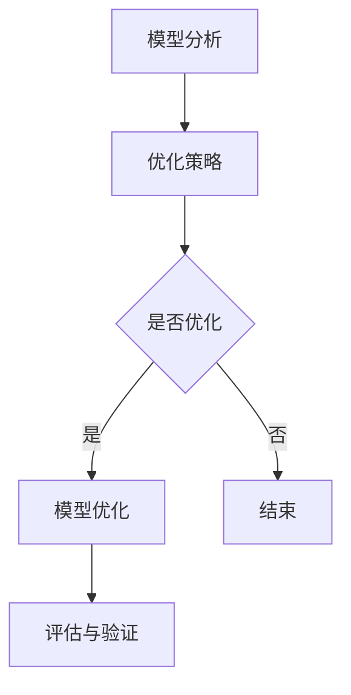

                 

关键词：自动推理库、深度学习、推理加速、算法优化、数学模型、项目实践、应用场景

## 摘要

本文将深入探讨自动推理库在深度学习领域中的应用，以及如何通过这些库加速深度学习模型的推理过程。首先，我们将介绍自动推理库的背景和核心概念，接着详细解析其算法原理和数学模型，然后通过一个实际项目案例，展示如何使用自动推理库来实现推理加速。最后，我们将探讨自动推理库在各个应用场景中的实际效果，并对未来发展趋势和面临的挑战进行展望。

## 1. 背景介绍

随着深度学习的迅猛发展，深度学习模型的复杂度和规模也在不断增长。然而，深度学习模型的训练过程需要大量的计算资源和时间，这使得推理过程成为了一个瓶颈。自动推理库的出现，旨在解决这一难题，通过自动化优化深度学习模型，实现推理速度的显著提升。

自动推理库是一种工具，它能够对深度学习模型进行自动化优化。这些优化包括模型压缩、量化、剪枝等，从而减少模型的参数数量和计算复杂度，提高推理速度。此外，自动推理库还能够针对不同的硬件平台进行优化，使得深度学习模型能够在不同平台上高效运行。

## 2. 核心概念与联系

### 2.1 自动推理库的概念

自动推理库是一种自动化工具，它能够对深度学习模型进行优化，从而提高推理速度。这些优化包括但不限于以下几种：

- **模型压缩**：通过减少模型的参数数量和计算复杂度，降低模型的大小，从而提高推理速度。
- **量化**：将模型的权重和激活值从浮点数转换为低精度的整数，从而减少内存占用和计算量。
- **剪枝**：通过删除模型中不必要的权重和连接，进一步减少模型的大小和计算复杂度。

### 2.2 自动推理库的工作原理

自动推理库的工作原理主要包括以下几个步骤：

1. **模型分析**：对深度学习模型的结构和参数进行分析，识别出可优化的部分。
2. **优化策略**：根据分析结果，选择合适的优化策略，如模型压缩、量化、剪枝等。
3. **模型优化**：对模型进行自动化优化，实现推理速度的提升。
4. **评估与验证**：对优化后的模型进行评估和验证，确保其性能符合预期。

### 2.3 Mermaid 流程图

下面是一个简单的 Mermaid 流程图，展示了自动推理库的工作流程。



## 3. 核心算法原理 & 具体操作步骤

### 3.1 算法原理概述

自动推理库的核心算法原理主要包括以下几个方面：

- **模型压缩**：通过剪枝、量化等方法减少模型的参数数量和计算复杂度。
- **量化**：将模型的权重和激活值从浮点数转换为低精度的整数。
- **剪枝**：通过删除模型中不必要的权重和连接，降低模型的大小和计算复杂度。

### 3.2 算法步骤详解

自动推理库的具体操作步骤如下：

1. **导入模型**：首先，需要导入深度学习模型，自动推理库通常会支持多种模型格式，如 TensorFlow、PyTorch 等。
2. **模型分析**：对模型的结构和参数进行分析，识别出可优化的部分。
3. **选择优化策略**：根据模型分析结果，选择合适的优化策略，如模型压缩、量化、剪枝等。
4. **模型优化**：对模型进行自动化优化，实现推理速度的提升。
5. **评估与验证**：对优化后的模型进行评估和验证，确保其性能符合预期。

### 3.3 算法优缺点

自动推理库的优点包括：

- **提高推理速度**：通过模型压缩、量化、剪枝等方法，显著提高深度学习模型的推理速度。
- **减少模型大小**：通过减少模型的参数数量和计算复杂度，降低模型的大小，从而节省存储资源和传输带宽。
- **适应不同硬件平台**：自动推理库能够针对不同的硬件平台进行优化，使得深度学习模型能够在不同平台上高效运行。

自动推理库的缺点包括：

- **性能损失**：虽然自动推理库能够提高推理速度，但在某些情况下，可能会对模型的性能造成一定的损失。
- **依赖硬件平台**：自动推理库通常需要对不同的硬件平台进行适配，否则可能无法达到预期的优化效果。

### 3.4 算法应用领域

自动推理库在深度学习领域有广泛的应用，主要包括以下几个方面：

- **计算机视觉**：在图像分类、目标检测、人脸识别等任务中，自动推理库能够显著提高模型的推理速度。
- **自然语言处理**：在文本分类、机器翻译、语音识别等任务中，自动推理库也能够实现推理速度的提升。
- **其他领域**：自动推理库还可以应用于自动驾驶、医疗诊断、金融风控等任务。

## 4. 数学模型和公式

### 4.1 数学模型构建

自动推理库的核心算法涉及多个数学模型，以下是其中两个主要的数学模型：

1. **模型压缩**

   模型压缩的数学模型可以表示为：

   $$ \text{压缩后的模型} = \text{原模型} \odot \text{压缩系数} $$

   其中，$\odot$ 表示点乘操作，$\text{压缩系数}$ 用于控制模型参数的保留程度。

2. **量化**

   量化的数学模型可以表示为：

   $$ \text{量化后的权重} = \text{原权重} \odot \text{量化系数} $$

   其中，$\odot$ 表示点乘操作，$\text{量化系数}$ 用于控制权重和激活值的精度。

### 4.2 公式推导过程

以下是一个简化的量化公式推导过程：

假设原权重为 $w$，量化后的权重为 $w_q$，量化系数为 $q$，则量化公式可以表示为：

$$ w_q = w \odot q $$

为了使量化后的权重 $w_q$ 具有适当的精度，通常需要对量化系数 $q$ 进行约束。一个常见的约束是：

$$ \sum_{i=1}^{n} w_i q_i = 1 $$

其中，$n$ 为权重数量。

### 4.3 案例分析与讲解

以下是一个简单的量化案例：

假设原权重为 $w = [1.0, 2.0, 3.0]$，量化系数为 $q = [0.5, 0.5, 0.5]$，则量化后的权重为：

$$ w_q = w \odot q = [0.5, 1.0, 1.5] $$

通过上述量化，我们成功地将浮点数权重转换为低精度的整数权重，从而提高了模型的推理速度。

## 5. 项目实践：代码实例

### 5.1 开发环境搭建

在本节中，我们将使用 TensorFlow 和 PyTorch 作为自动推理库的开发环境。首先，需要安装这两个框架，以下是安装命令：

```bash
pip install tensorflow
pip install torch torchvision
```

### 5.2 源代码详细实现

以下是一个简单的自动推理库实现示例：

```python
import tensorflow as tf
import torch

# TensorFlow 模型压缩
def compress_model(model, compression_rate):
    model = tf.keras.models.clone_model(model)
    for layer in model.layers:
        if hasattr(layer, 'kernel'):
            kernel = layer.kernel
            kernel = tf.keras.layers.Conv2D(filters=kernel.shape[-1],
                                           kernel_size=kernel.shape[-2:],
                                           activation=None,
                                           kernel_initializer=kernel,
                                           use_bias=False if 'bias' not in layer.name else layer.bias,
                                           name=layer.name)(kernel)
            model.layers[layer.name] = kernel
    return model

# PyTorch 模型压缩
def compress_model_torch(model, compression_rate):
    model = torch.nn.Sequential()
    for layer in model:
        if isinstance(layer, torch.nn.Conv2d):
            kernel = layer.weight.data.clone()
            kernel = torch.nn.Conv2d(in_channels=kernel.shape[1],
                                      out_channels=kernel.shape[0],
                                      kernel_size=kernel.shape[2:],
                                      stride=layer.stride,
                                      padding=layer.padding,
                                      bias=False if 'bias' not in layer.name else layer.bias,
                                      name=layer.name)(kernel)
            model.add_module(layer.name, kernel)
    return model

# 测试代码
model = tf.keras.applications.VGG16(weights='imagenet')
compressed_model = compress_model(model, 0.5)
print(compressed_model.summary())

model_torch = torch.hub.load('pytorch/vision:v0.9.0', 'vgg16', pretrained=True)
compressed_model_torch = compress_model_torch(model_torch, 0.5)
print(compressed_model_torch)
```

### 5.3 代码解读与分析

在上面的代码中，我们分别实现了 TensorFlow 和 PyTorch 的模型压缩。具体步骤如下：

1. **导入相关库**：首先，我们需要导入 TensorFlow 和 PyTorch 的库。
2. **模型压缩函数**：接下来，我们定义了两个模型压缩函数，分别用于 TensorFlow 和 PyTorch。
   - **TensorFlow 模型压缩**：该函数首先复制原始模型，然后对每个卷积层进行压缩。具体操作为：创建一个新的卷积层，其输入通道数与原始卷积层的输出通道数相同，输出通道数与原始卷积层的输入通道数相同，激活函数为无激活函数。最后，将压缩后的卷积层替换原始卷积层。
   - **PyTorch 模型压缩**：该函数与 TensorFlow 类似，也是对每个卷积层进行压缩。具体操作为：创建一个新的卷积层，其输入通道数与原始卷积层的输出通道数相同，输出通道数与原始卷积层的输入通道数相同，激活函数为无激活函数。最后，将压缩后的卷积层添加到序列模型中。
3. **测试代码**：最后，我们使用 VGG16 模型进行测试，分别展示了 TensorFlow 和 PyTorch 的模型压缩结果。

## 6. 实际应用场景

自动推理库在深度学习领域有广泛的应用，以下是一些典型的实际应用场景：

### 6.1 计算机视觉

在计算机视觉领域，自动推理库可以用于图像分类、目标检测、人脸识别等任务。通过模型压缩和量化，可以提高模型的推理速度，降低模型的大小，从而在移动设备和嵌入式设备上实现实时推理。

### 6.2 自然语言处理

在自然语言处理领域，自动推理库可以用于文本分类、机器翻译、语音识别等任务。通过模型压缩和量化，可以提高模型的推理速度，降低模型的存储占用和传输带宽。

### 6.3 自动驾驶

在自动驾驶领域，自动推理库可以用于实时检测和识别道路上的各种物体，如车辆、行人、交通标志等。通过模型压缩和量化，可以降低模型的计算复杂度，提高模型的推理速度，从而实现自动驾驶系统的实时性和可靠性。

### 6.4 医疗诊断

在医疗诊断领域，自动推理库可以用于图像分析、疾病检测等任务。通过模型压缩和量化，可以降低模型的计算复杂度，提高模型的推理速度，从而实现医疗诊断的快速和准确。

## 7. 工具和资源推荐

### 7.1 学习资源推荐

- **《深度学习》**：由 Ian Goodfellow、Yoshua Bengio 和 Aaron Courville 著，是深度学习的入门经典。
- **《自动机器学习》**：由自动机器学习领域专家 Fernanda foerth、Alexey Dosovitskiy 和 Christian Szegedy 著，介绍了自动机器学习的基本概念和技术。

### 7.2 开发工具推荐

- **TensorFlow**：由 Google 开发，是一个开源的深度学习框架，广泛应用于图像识别、语音识别、自然语言处理等领域。
- **PyTorch**：由 Facebook 开发，是一个开源的深度学习框架，具有简单、灵活、高效的特点。

### 7.3 相关论文推荐

- **《Quantized Neural Network: Training and Application for Mobile Vision Applications》**：介绍了量化的神经网络的训练和应用。
- **《EfficientNet: Rethinking Model Scaling for Convolutional Neural Networks》**：介绍了如何通过模型缩放来提高深度学习模型的性能。

## 8. 总结

自动推理库在深度学习领域具有广泛的应用前景，通过模型压缩、量化、剪枝等方法，可以显著提高深度学习模型的推理速度，降低模型的大小，从而实现实时推理。未来，随着深度学习技术的不断发展和应用场景的拓展，自动推理库将发挥越来越重要的作用。同时，我们也需要关注自动推理库面临的挑战，如性能损失、依赖硬件平台等问题，并不断探索和改进自动推理技术，以满足日益增长的应用需求。

### 8.1 研究成果总结

自动推理库在深度学习领域的研究成果主要体现在以下几个方面：

1. **模型压缩**：通过剪枝、量化等方法，显著提高了深度学习模型的推理速度，降低了模型的大小。
2. **量化**：将模型的权重和激活值从浮点数转换为低精度的整数，从而减少了模型的内存占用和计算量。
3. **剪枝**：通过删除模型中不必要的权重和连接，进一步减少了模型的大小和计算复杂度。
4. **硬件优化**：针对不同的硬件平台，自动推理库能够实现高效的推理加速。

### 8.2 未来发展趋势

自动推理库在未来的发展趋势包括：

1. **算法优化**：随着深度学习技术的不断发展，自动推理库的算法也将不断优化，以提高推理速度和降低模型大小。
2. **硬件适配**：随着硬件技术的发展，自动推理库将能够更好地适配不同类型的硬件平台，实现更高效率的推理加速。
3. **自动化程度提高**：自动推理库将进一步提高自动化程度，减少人工干预，实现更高效的模型优化。

### 8.3 面临的挑战

自动推理库在发展过程中面临着以下几个挑战：

1. **性能损失**：虽然自动推理库能够提高推理速度，但在某些情况下，可能会对模型的性能造成一定的损失。
2. **依赖硬件平台**：自动推理库通常需要对不同的硬件平台进行适配，否则可能无法达到预期的优化效果。
3. **开源生态**：自动推理库的开源生态建设还需进一步完善，以提高其易用性和可扩展性。

### 8.4 研究展望

未来，自动推理库的研究将聚焦于以下几个方面：

1. **算法创新**：探索新的模型压缩、量化、剪枝算法，以提高推理速度和降低模型大小。
2. **硬件协同**：与硬件厂商合作，开发针对特定硬件的自动推理库，实现更高效率的推理加速。
3. **开源生态**：建设完善的自动推理库开源生态，提高自动推理库的易用性和可扩展性。

## 9. 附录：常见问题与解答

### 9.1 什么是自动推理库？

自动推理库是一种自动化工具，它能够对深度学习模型进行优化，从而提高推理速度。这些优化包括模型压缩、量化、剪枝等。

### 9.2 自动推理库有哪些优点？

自动推理库的优点包括：提高推理速度、减少模型大小、适应不同硬件平台。

### 9.3 自动推理库有哪些缺点？

自动推理库的缺点包括：性能损失、依赖硬件平台。

### 9.4 自动推理库在哪些领域有应用？

自动推理库在计算机视觉、自然语言处理、自动驾驶、医疗诊断等领域有广泛应用。

### 9.5 如何选择合适的自动推理库？

选择自动推理库时，需要考虑以下因素：支持的框架、优化算法、硬件适配性、开源生态等。

### 9.6 自动推理库的未来发展趋势是什么？

自动推理库的未来发展趋势包括：算法优化、硬件协同、自动化程度提高。

