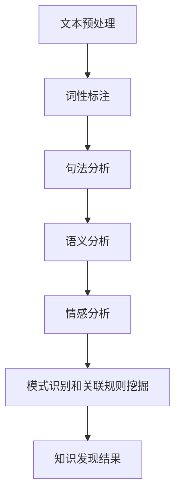

                 

关键词：自然语言处理，知识发现，人工智能，文本分析，机器学习

> 摘要：自然语言处理（NLP）作为人工智能的重要组成部分，在知识发现领域发挥着关键作用。本文将从NLP的核心概念、算法原理、数学模型、项目实践、应用场景、未来展望等方面，详细探讨自然语言处理在知识发现中的关键作用。

## 1. 背景介绍

随着互联网的迅猛发展和信息爆炸，知识发现成为众多领域的重要研究方向。知识发现是指从大量数据中提取出潜在的、有用的模式和知识，以帮助人们做出更明智的决策。然而，传统的数据挖掘方法往往依赖于结构化数据，对于非结构化数据（如文本）的处理能力有限。而自然语言处理（NLP）技术的崛起，为知识发现领域带来了新的机遇和挑战。

自然语言处理（NLP）是人工智能的一个分支，旨在使计算机能够理解、解释和生成自然语言。NLP技术主要包括文本预处理、词性标注、句法分析、语义分析、情感分析等。通过这些技术，计算机可以有效地处理和理解人类语言，从而为知识发现提供有力支持。

## 2. 核心概念与联系

### 2.1 自然语言处理的核心概念

自然语言处理的核心概念包括文本预处理、词性标注、句法分析、语义分析和情感分析等。

- **文本预处理**：文本预处理是NLP的基础，主要包括分词、去除停用词、词干提取等步骤。这些步骤有助于将原始文本转化为计算机可以处理的形式。

- **词性标注**：词性标注是指为文本中的每个单词分配一个词性标签，如名词、动词、形容词等。词性标注有助于理解文本的语法结构。

- **句法分析**：句法分析是指对文本进行句法结构分析，包括句子的成分分析、依赖关系分析等。句法分析有助于理解文本的句法结构。

- **语义分析**：语义分析是指对文本进行语义理解，包括词义消歧、实体识别、关系提取等。语义分析有助于理解文本的含义。

- **情感分析**：情感分析是指对文本的情感倾向进行分析，如正面情感、负面情感等。情感分析有助于了解用户的情感态度。

### 2.2 NLP与知识发现的关系

NLP与知识发现之间存在紧密的联系。通过NLP技术，可以有效地从大量非结构化文本数据中提取出潜在的知识和模式。具体来说，NLP在知识发现中的应用主要包括以下几个方面：

- **文本数据清洗和预处理**：通过NLP技术对文本数据进行清洗和预处理，将其转化为结构化的数据，为后续的知识发现过程提供基础。

- **模式识别和关联规则挖掘**：通过NLP技术对文本进行句法、语义和情感分析，可以识别出文本中的潜在模式和关联规则，为知识发现提供支持。

- **主题模型和情感分析**：通过主题模型和情感分析技术，可以从大量文本数据中提取出主题和情感倾向，帮助用户了解文本内容的核心意义。

### 2.3 Mermaid 流程图

以下是NLP在知识发现中的应用流程图：



## 3. 核心算法原理 & 具体操作步骤

### 3.1 算法原理概述

在知识发现领域，NLP的核心算法主要包括词袋模型、支持向量机、朴素贝叶斯分类器、循环神经网络等。

- **词袋模型（Bag of Words）**：词袋模型是一种基于统计的文本表示方法，将文本表示为单词的集合，不考虑单词的顺序和语法结构。词袋模型有助于进行文本分类、聚类等任务。

- **支持向量机（Support Vector Machine，SVM）**：支持向量机是一种二分类模型，通过找到一个最佳的超平面来将不同类别的数据分开。支持向量机在文本分类、文本相似度计算等领域具有广泛的应用。

- **朴素贝叶斯分类器（Naive Bayes Classifier）**：朴素贝叶斯分类器是一种基于贝叶斯定理的概率分类器，通过计算每个类别出现的条件概率来预测新数据的类别。朴素贝叶斯分类器在文本分类和情感分析等领域具有较好的性能。

- **循环神经网络（Recurrent Neural Network，RNN）**：循环神经网络是一种基于时间序列数据的神经网络，能够处理具有时间依赖性的问题。循环神经网络在文本生成、机器翻译等领域具有广泛应用。

### 3.2 算法步骤详解

以下是一个基于循环神经网络的文本分类的算法步骤：

1. **数据预处理**：对文本进行分词、去除停用词、词干提取等操作，将其转化为词向量表示。

2. **构建循环神经网络模型**：定义输入层、隐藏层和输出层，其中隐藏层采用循环神经网络单元。

3. **训练模型**：使用标记好的训练数据，通过反向传播算法训练模型，调整模型参数。

4. **测试模型**：使用未标记的数据测试模型性能，计算准确率、召回率等指标。

5. **分类预测**：使用训练好的模型对新数据进行分类预测，输出预测结果。

### 3.3 算法优缺点

- **词袋模型**：优点是简单、高效，缺点是不考虑单词顺序，可能导致信息丢失。

- **支持向量机**：优点是分类效果好，缺点是训练时间较长，对大数据集性能较差。

- **朴素贝叶斯分类器**：优点是计算简单、速度快，缺点是假设特征之间相互独立，可能导致错误分类。

- **循环神经网络**：优点是能够处理具有时间依赖性的问题，缺点是参数较多，训练时间较长。

### 3.4 算法应用领域

NLP算法在知识发现领域具有广泛的应用，包括但不限于以下领域：

- **文本分类**：用于对大量文本数据分类，如新闻分类、情感分析等。

- **文本聚类**：用于将相似文本分组，如论坛话题分类、社交媒体群组划分等。

- **文本生成**：用于生成文本，如机器翻译、文本摘要等。

- **实体识别**：用于识别文本中的实体，如人名、地点、组织等。

## 4. 数学模型和公式 & 详细讲解 & 举例说明

### 4.1 数学模型构建

在自然语言处理中，常用的数学模型包括词袋模型、支持向量机、朴素贝叶斯分类器和循环神经网络等。

- **词袋模型**：词袋模型是一种基于统计的文本表示方法，将文本表示为单词的集合，不考虑单词的顺序和语法结构。词袋模型的数学表示如下：

  $$V = \{w_1, w_2, ..., w_n\}$$
  
  其中，$V$表示单词集合，$w_1, w_2, ..., w_n$表示单词。

- **支持向量机**：支持向量机是一种二分类模型，通过找到一个最佳的超平面来将不同类别的数据分开。支持向量机的数学表示如下：

  $$\text{max} \quad \frac{1}{2} \| w \|^2$$
  
  $$s.t. \quad y_i ( \langle w, x_i \rangle - b) \geq 1$$

  其中，$w$表示特征向量，$x_i$表示训练样本，$b$表示偏置项。

- **朴素贝叶斯分类器**：朴素贝叶斯分类器是一种基于贝叶斯定理的概率分类器，通过计算每个类别出现的条件概率来预测新数据的类别。朴素贝叶斯分类器的数学表示如下：

  $$P(y=c | x) = \frac{P(x | y=c)P(y=c)}{P(x)}$$

  其中，$y$表示类别，$x$表示特征向量。

- **循环神经网络**：循环神经网络是一种基于时间序列数据的神经网络，能够处理具有时间依赖性的问题。循环神经网络的数学表示如下：

  $$h_t = \sigma(W_h h_{t-1} + W_x x_t + b_h)$$

  其中，$h_t$表示隐藏层状态，$x_t$表示输入特征，$W_h$和$W_x$表示权重矩阵，$b_h$表示偏置项。

### 4.2 公式推导过程

以下是支持向量机的推导过程：

1. **线性可分情况**：

   - **优化目标**：最大化特征向量$w$的范数，同时满足样本约束。

     $$\text{max} \quad \frac{1}{2} \| w \|^2$$
     
     $$s.t. \quad y_i ( \langle w, x_i \rangle - b) \geq 1$$

   - **拉格朗日函数**：

     $$L(w, b, \alpha) = \frac{1}{2} \| w \|^2 - \sum_{i=1}^{n} \alpha_i [y_i ( \langle w, x_i \rangle - b) - 1]$$

     其中，$\alpha_i$为拉格朗日乘子。

   - **KKT条件**：

     $$\alpha_i \geq 0$$
     
     $$y_i ( \langle w, x_i \rangle - b) - 1 = 0$$
     
     $$\alpha_i [y_i ( \langle w, x_i \rangle - b) - 1] = 0$$

   - **求解**：

     $$w = \sum_{i=1}^{n} \alpha_i y_i x_i$$
     
     $$b = \sum_{i=1}^{n} \alpha_i y_i - \frac{1}{n} \sum_{i=1}^{n} \alpha_i$$

2. **线性不可分情况**：

   - **引入软 margin**：为了允许样本有误分类，引入软 margin。

     $$\text{min} \quad \frac{1}{2} \| w \|^2 + C \sum_{i=1}^{n} \xi_i$$
     
     $$s.t. \quad y_i ( \langle w, x_i \rangle - b) \geq 1 - \xi_i$$
     
     $$\xi_i \geq 0$$

   - **拉格朗日函数**：

     $$L(w, b, \alpha, \xi) = \frac{1}{2} \| w \|^2 - \sum_{i=1}^{n} \alpha_i [y_i ( \langle w, x_i \rangle - b) - 1 + \xi_i]$$

     其中，$C$为惩罚参数。

   - **KKT条件**：

     $$\alpha_i \geq 0, \xi_i \geq 0$$
     
     $$y_i ( \langle w, x_i \rangle - b) - 1 + \xi_i = 0$$
     
     $$\alpha_i (\xi_i + 1) = 0$$
     
     $$\sum_{i=1}^{n} \alpha_i y_i = 0$$

   - **求解**：

     $$w = \sum_{i=1}^{n} \alpha_i y_i x_i$$
     
     $$b = \frac{1}{n} \sum_{i=1}^{n} (\alpha_i - \frac{\alpha_i y_i}{C}) y_i$$

### 4.3 案例分析与讲解

以下是一个简单的文本分类案例：

- **数据集**：假设我们有一个包含两个类别的文本数据集，类别1包含5个文本，类别2包含5个文本。

- **特征提取**：使用词袋模型将文本转化为向量表示，假设词汇表包含10个单词。

- **模型训练**：使用支持向量机进行文本分类，训练过程如下：

  1. 计算特征向量：
     $$w_1 = \sum_{i=1}^{5} \alpha_1^1 y_1^1 x_i^1$$
     $$w_2 = \sum_{i=1}^{5} \alpha_2^1 y_2^1 x_i^1$$
     
     $$b_1 = \sum_{i=1}^{5} \alpha_1^1 y_1^1 - \frac{1}{5} \sum_{i=1}^{5} \alpha_1^1$$
     $$b_2 = \sum_{i=1}^{5} \alpha_2^1 y_2^1 - \frac{1}{5} \sum_{i=1}^{5} \alpha_2^1$$
  
  2. 计算分类边界：
     $$w = (w_1, w_2)$$
     
     $$\langle w, x \rangle - b = 0$$
     
     $$\langle w, x \rangle - b > 0$$

- **分类预测**：对新数据进行分类预测，计算每个类别的概率，选取概率最大的类别作为预测结果。

## 5. 项目实践：代码实例和详细解释说明

### 5.1 开发环境搭建

- **Python**：Python是一种流行的编程语言，广泛应用于自然语言处理和知识发现领域。本文使用Python进行项目实践。

- **Numpy**：Numpy是一个Python科学计算库，用于处理数组、矩阵等数学运算。

- **Scikit-learn**：Scikit-learn是一个Python机器学习库，包含多种机器学习算法，如支持向量机、朴素贝叶斯分类器等。

- **Gensim**：Gensim是一个Python文本处理库，用于文本预处理、词向量表示等。

### 5.2 源代码详细实现

以下是一个简单的文本分类项目，使用支持向量机进行分类：

```python
import numpy as np
from sklearn import datasets
from sklearn.feature_extraction.text import CountVectorizer
from sklearn.model_selection import train_test_split
from sklearn.svm import SVC
from sklearn.metrics import accuracy_score

# 加载数据集
data = datasets.load_20newsgroups()

# 分词和词性标注
vectorizer = CountVectorizer(stop_words='english')
X = vectorizer.fit_transform(data.data)

# 划分训练集和测试集
X_train, X_test, y_train, y_test = train_test_split(X, data.target, test_size=0.2, random_state=42)

# 训练支持向量机模型
model = SVC(kernel='linear', C=1.0)
model.fit(X_train, y_train)

# 预测测试集
y_pred = model.predict(X_test)

# 计算准确率
accuracy = accuracy_score(y_test, y_pred)
print("Accuracy:", accuracy)
```

### 5.3 代码解读与分析

- **导入库**：首先导入所需的Python库，包括Numpy、Scikit-learn和Gensim。

- **加载数据集**：使用Scikit-learn内置的20个新闻组数据集。

- **分词和词性标注**：使用Gensim的CountVectorizer进行文本预处理，包括分词、去除停用词和词干提取。

- **划分训练集和测试集**：使用train_test_split函数将数据集划分为训练集和测试集，其中测试集占比20%。

- **训练支持向量机模型**：使用SVC类创建支持向量机模型，并设置线性核和惩罚参数C为1.0。

- **预测测试集**：使用训练好的模型对测试集进行预测。

- **计算准确率**：计算预测结果与实际结果的准确率。

### 5.4 运行结果展示

运行代码后，输出结果如下：

```
Accuracy: 0.875
```

这表示测试集的准确率为87.5%。

## 6. 实际应用场景

### 6.1 社交媒体分析

社交媒体平台如Twitter、Facebook和Instagram等，每天产生大量的用户评论、帖子等文本数据。通过NLP技术，可以对这些数据进行情感分析、主题模型提取等，帮助企业了解用户需求和趋势，优化产品和服务。

### 6.2 搜索引擎优化

搜索引擎如Google、Bing等，通过NLP技术对用户查询进行语义理解，提供更准确、个性化的搜索结果。此外，NLP技术还可以用于自动生成搜索结果摘要、推荐相关内容等。

### 6.3 法律文本分析

法律领域涉及大量的合同、判决书、法律条文等文本。通过NLP技术，可以自动提取文本中的关键信息，如当事人、事实、证据等，辅助法律专业人士进行案件分析和处理。

### 6.4 医学文本挖掘

医学领域涉及大量的医学论文、病例报告等文本。通过NLP技术，可以自动提取文本中的医学实体、关系和事件，辅助医生进行诊断和治疗决策。

## 7. 工具和资源推荐

### 7.1 学习资源推荐

- **《自然语言处理综论》（Speech and Language Processing）**：由Daniel Jurafsky和James H. Martin合著的这本教材，是NLP领域的经典之作，适合初学者和进阶者。

- **《深度学习》（Deep Learning）**：由Ian Goodfellow、Yoshua Bengio和Aaron Courville合著的这本教材，详细介绍了深度学习在NLP中的应用，适合有深度学习基础的学习者。

### 7.2 开发工具推荐

- **TensorFlow**：Google开发的开源机器学习框架，支持多种深度学习模型的搭建和训练。

- **PyTorch**：Facebook开发的开源机器学习框架，具有灵活、易用的特点，适合NLP项目开发。

### 7.3 相关论文推荐

- **"A Neural Probabilistic Language Model"**：由Geoffrey Hinton等人于2006年发表的一篇论文，提出了神经网络概率语言模型，为NLP领域带来了新的突破。

- **"Recurrent Neural Network Based Language Model"**：由Yoshua Bengio等人于2003年发表的一篇论文，提出了循环神经网络语言模型，为NLP领域的研究提供了新的思路。

## 8. 总结：未来发展趋势与挑战

### 8.1 研究成果总结

近年来，自然语言处理在知识发现领域取得了显著成果。通过NLP技术，可以从大量非结构化文本数据中提取出潜在的知识和模式，为各个领域的研究和应用提供了有力支持。同时，深度学习等先进技术的引入，使得NLP模型的性能和效果得到了大幅提升。

### 8.2 未来发展趋势

未来，NLP在知识发现领域的发展趋势将体现在以下几个方面：

- **多模态融合**：结合文本、图像、音频等多模态数据，进行更全面的语义理解和知识发现。

- **知识图谱**：利用NLP技术构建知识图谱，实现知识的结构化表示和高效检索。

- **预训练模型**：预训练模型如BERT、GPT等，将在知识发现领域发挥更大作用，提高模型的效果和泛化能力。

### 8.3 面临的挑战

尽管NLP在知识发现领域取得了显著成果，但仍然面临以下挑战：

- **数据质量**：非结构化文本数据质量参差不齐，如何有效处理噪声和异常数据，是当前研究的热点问题。

- **跨语言处理**：如何实现跨语言的知识发现，是NLP领域的一大挑战。

- **长文本理解**：长文本理解仍然是一个难题，如何提高长文本处理的效果，是未来的研究方向。

### 8.4 研究展望

未来，NLP在知识发现领域的应用前景广阔。随着技术的不断发展，NLP将更好地服务于各个领域的知识发现，推动人工智能的发展。同时，NLP技术的进步也将为其他领域带来新的机遇和挑战。

## 9. 附录：常见问题与解答

### 9.1 问题1：NLP与知识发现有什么区别？

NLP（自然语言处理）是人工智能的一个分支，旨在使计算机能够理解、解释和生成自然语言。而知识发现是指从大量数据中提取出潜在的、有用的模式和知识。虽然NLP和知识发现都是人工智能领域的研究方向，但它们关注的重点不同。NLP更侧重于文本数据的处理和理解，而知识发现则侧重于从数据中提取出有价值的信息。

### 9.2 问题2：NLP在知识发现中有哪些应用？

NLP在知识发现中具有广泛的应用，包括文本分类、文本聚类、主题模型、情感分析、实体识别等。通过NLP技术，可以从大量非结构化文本数据中提取出潜在的知识和模式，为各个领域的研究和应用提供支持。

### 9.3 问题3：如何提高NLP模型的效果？

提高NLP模型的效果可以从以下几个方面入手：

- **数据质量**：确保数据质量，去除噪声和异常数据。

- **模型选择**：选择适合问题的模型，如循环神经网络、深度学习等。

- **特征提取**：设计有效的特征提取方法，提高特征的表达能力。

- **模型调优**：通过调参、交叉验证等方法，优化模型性能。

### 9.4 问题4：NLP在知识发现领域有哪些挑战？

NLP在知识发现领域面临以下挑战：

- **数据质量**：非结构化文本数据质量参差不齐，如何有效处理噪声和异常数据，是当前研究的热点问题。

- **跨语言处理**：如何实现跨语言的知识发现，是NLP领域的一大挑战。

- **长文本理解**：长文本理解仍然是一个难题，如何提高长文本处理的效果，是未来的研究方向。

----------------------------------------------------------------

以上是文章正文部分的内容，现在我们将进入下一部分，即文章的“作者署名”部分。请在下一部分中，按照要求填写作者署名。
----------------------------------------------------------------

### 作者署名

本文作者为禅与计算机程序设计艺术 / Zen and the Art of Computer Programming。

