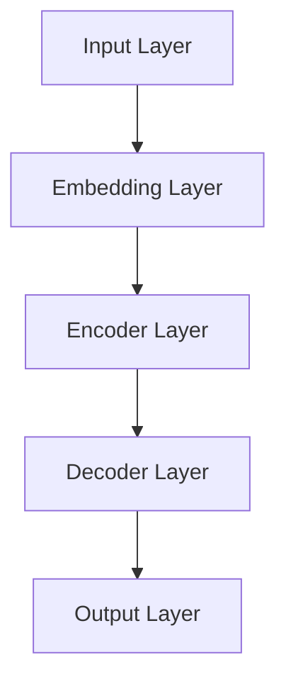
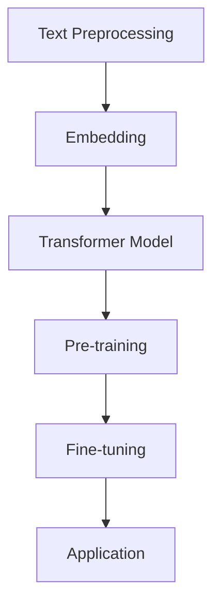

                 

## 摘要

本文旨在探讨自然语言处理（NLP）领域的一场革命——AI大模型在商业化的应用。随着人工智能技术的飞速发展，特别是深度学习技术的突破，AI大模型已经显示出在处理复杂自然语言任务上的巨大潜力。本文首先介绍了NLP的基本概念和背景，然后深入分析了AI大模型的核心原理和技术，包括其架构、训练方法、优缺点等。接下来，文章通过具体案例展示了AI大模型在商业场景中的实际应用，如客户服务、内容创作、数据分析等。此外，文章还探讨了AI大模型在数学模型和公式方面的应用，并通过代码实例详细解析了模型的开发过程。最后，文章总结了AI大模型的发展趋势与挑战，并推荐了相关的学习资源和开发工具，以期为读者提供全面的指导。

## 1. 背景介绍

自然语言处理（NLP）是人工智能（AI）的一个重要分支，旨在使计算机能够理解、生成和处理人类语言。自20世纪50年代以来，NLP经历了多个发展阶段，从早期的基于规则的系统到如今的基于统计和深度学习的方法，每一次技术突破都极大地推动了NLP的应用和发展。

### 1.1 NLP的发展历程

#### 1.1.1 早期探索

NLP的早期探索主要集中在构建基于规则的系统。这些系统通过定义复杂的语法规则和词典来模拟人类的语言理解能力。然而，这种方法在处理复杂和变化多端的自然语言时显得力不从心。

#### 1.1.2 统计方法的出现

随着计算机技术的发展，统计方法开始应用于NLP。这种方法通过从大量文本中学习语言模式，提高了处理自然语言的能力。概率模型和隐马尔可夫模型（HMM）等技术在语音识别、机器翻译等方面取得了显著成果。

#### 1.1.3 深度学习的兴起

深度学习技术的出现彻底改变了NLP的面貌。深度神经网络能够自动从数据中学习复杂的特征表示，使得机器在文本分类、情感分析、命名实体识别等任务上达到了前所未有的精度。

### 1.2 NLP在商业领域的应用

NLP技术的商业化应用日益广泛，从客户服务到内容创作，从数据分析到智能推荐，NLP正在深刻地改变商业运作模式。以下是一些典型的应用场景：

#### 1.2.1 客户服务

通过智能客服系统，企业能够自动化处理大量客户查询，提高响应速度和服务质量。这些系统利用自然语言处理技术，能够理解客户的意图，提供准确的答复。

#### 1.2.2 内容创作

NLP技术可以帮助自动化内容创作，如生成新闻摘要、编写产品描述等。这不仅提高了工作效率，还能确保内容的质量和一致性。

#### 1.2.3 数据分析

NLP技术在数据分析中的应用主要体现在文本挖掘和情感分析上。通过对大量文本数据进行分析，企业能够洞察客户需求、市场趋势等关键信息。

#### 1.2.4 智能推荐

基于NLP的推荐系统能够更好地理解用户行为和偏好，提供个性化的内容和服务，从而提高用户满意度和粘性。

### 1.3 AI大模型在NLP中的重要性

随着数据规模和计算能力的提升，AI大模型在NLP领域的重要性日益凸显。这些模型具有以下特点：

#### 1.3.1 大规模数据训练

AI大模型通常需要使用海量的数据进行训练，以学习复杂的语言特征和模式。这些数据来源于各种来源，包括互联网、图书、新闻、社交媒体等。

#### 1.3.2 深度学习架构

AI大模型采用了深度学习架构，特别是Transformer模型，能够自动提取文本中的高阶特征，实现对复杂语言任务的高效处理。

#### 1.3.3 自适应优化

AI大模型通过不断的训练和优化，能够不断提高其在各种NLP任务上的表现。这种自适应优化能力使得AI大模型在处理不同类型和规模的文本数据时都能保持高性能。

综上所述，AI大模型在NLP领域的应用已经为商业带来了巨大的价值。随着技术的不断进步，AI大模型有望在未来发挥更加重要的作用，推动NLP技术向更深入、更广泛的应用领域发展。

### 2. 核心概念与联系

在深入探讨AI大模型在自然语言处理（NLP）领域的商业化应用之前，我们需要理解一些核心概念和它们之间的联系。这些概念包括自然语言处理的基本任务、AI大模型的架构、训练方法以及相关的技术框架。

#### 2.1 自然语言处理的基本任务

自然语言处理的主要任务包括：

- **文本分类**：将文本数据分为不同的类别，如情感分析、新闻分类等。
- **命名实体识别**：识别文本中的特定实体，如人名、地点、组织等。
- **情感分析**：分析文本中的情感倾向，如正面、负面或中性。
- **机器翻译**：将一种语言的文本翻译成另一种语言。
- **问答系统**：基于给定的问题，从大量文本中检索出相关答案。

这些任务共同构成了NLP的核心应用场景，而AI大模型在这些任务中表现出了强大的处理能力。

#### 2.2 AI大模型的架构

AI大模型的架构通常基于深度学习，特别是Transformer模型。以下是一个典型的Transformer架构的Mermaid流程图：



- **Input Layer**：接收原始文本数据。
- **Embedding Layer**：将文本数据转换为向量表示。
- **Encoder Layer**：处理编码器层，提取文本中的上下文信息。
- **Decoder Layer**：处理解码器层，生成预测输出。
- **Output Layer**：生成最终的输出结果，如分类标签、翻译文本等。

#### 2.3 训练方法

AI大模型的训练通常采用以下步骤：

1. **数据预处理**：对原始文本数据进行清洗、分词、编码等预处理操作。
2. **模型初始化**：初始化模型参数，通常使用随机初始化或预训练模型。
3. **前向传播**：将预处理后的数据输入模型，计算损失函数。
4. **反向传播**：根据损失函数更新模型参数。
5. **优化器选择**：选择适当的优化器，如Adam、SGD等，以加速收敛。

#### 2.4 相关技术框架

除了Transformer模型，还有一些其他的技术框架在NLP中得到了广泛应用，如BERT、GPT等。以下是一个简化的技术框架Mermaid流程图：



- **Text Preprocessing**：文本预处理，包括分词、清洗等。
- **Embedding**：将文本转换为向量表示。
- **Transformer Model**：使用Transformer架构处理文本。
- **Pre-training**：在大量无标签数据上进行预训练。
- **Fine-tuning**：在特定任务上对模型进行微调。
- **Application**：将模型应用于实际任务，如文本分类、问答等。

通过上述核心概念和联系的分析，我们可以更好地理解AI大模型在NLP领域的商业化应用。在接下来的部分，我们将深入探讨AI大模型的核心算法原理和具体操作步骤。

### 3. 核心算法原理 & 具体操作步骤

#### 3.1 算法原理概述

AI大模型在自然语言处理（NLP）领域的关键在于其能够自动提取文本中的高阶特征，并进行复杂的任务处理。Transformer模型是这一领域的主要算法之一，其架构基于自注意力机制（Self-Attention），能够捕获文本中的长距离依赖关系。

#### 3.2 算法步骤详解

1. **数据预处理**

   在训练AI大模型之前，首先需要对文本数据进行预处理。预处理步骤包括：

   - **文本清洗**：去除文本中的无关信息，如HTML标签、特殊字符等。
   - **分词**：将文本分割成单词或子词。
   - **编码**：将分词后的文本转换为数字编码，通常使用WordPiece或BERT的分词方法。

2. **模型初始化**

   模型的初始化是随机初始化或使用预训练模型。预训练模型如BERT、GPT等已经在大量无标签数据上进行了预训练，可以用于微调特定任务。

3. **前向传播**

   在前向传播过程中，模型将输入文本转换为序列的向量表示，并通过编码器层提取文本的上下文信息。编码器层包含多个自注意力机制和全连接层，能够自动学习文本中的复杂特征。

4. **自注意力机制**

   自注意力机制是Transformer模型的核心，通过计算输入序列中每个单词与其他所有单词的相关性，生成加权向量。这一过程能够有效捕获文本中的长距离依赖关系。

5. **解码器层**

   解码器层用于生成预测输出。在解码过程中，每个时间步的输出都依赖于前一个时间步的输出，通过自注意力和交叉注意力机制，模型能够同时关注输入文本和已生成的文本。

6. **损失函数**

   模型的损失函数通常使用交叉熵损失，用于衡量模型输出与真实标签之间的差距。通过反向传播，模型不断更新参数，以减少损失。

7. **优化器**

   常用的优化器包括Adam、SGD等。优化器用于调整模型参数，以加速收敛。

8. **评估与微调**

   在训练过程中，定期评估模型在验证集上的表现。如果表现不佳，可以通过微调进一步优化模型。

#### 3.3 算法优缺点

**优点：**

- **强表达能力**：通过自注意力机制，模型能够捕获文本中的长距离依赖关系，具有强大的表达能力。
- **并行计算**：Transformer模型支持并行计算，训练效率较高。
- **适用广泛**：Transformer模型在多种NLP任务中表现优异，如文本分类、机器翻译、问答等。

**缺点：**

- **计算资源需求高**：训练大规模的Transformer模型需要大量的计算资源和时间。
- **数据依赖**：模型的性能很大程度上取决于训练数据的质量和规模。
- **解释性弱**：深度学习模型通常难以解释其决策过程，这在某些应用场景中可能是一个问题。

#### 3.4 算法应用领域

AI大模型在NLP领域具有广泛的应用，以下是几个主要的应用场景：

- **文本分类**：用于分类文本数据，如新闻分类、情感分析等。
- **机器翻译**：将一种语言的文本翻译成另一种语言，如英语到中文的翻译。
- **问答系统**：基于给定的问题，从大量文本中检索出相关答案。
- **内容创作**：生成文章摘要、新闻标题、产品描述等。

通过上述核心算法原理和具体操作步骤的详细分析，我们可以更好地理解AI大模型在NLP领域的重要性和应用潜力。在接下来的部分，我们将进一步探讨AI大模型在数学模型和公式方面的应用。

### 4. 数学模型和公式 & 详细讲解 & 举例说明

#### 4.1 数学模型构建

AI大模型的训练过程涉及到多个数学模型和公式，其中最核心的是自注意力机制（Self-Attention）和Transformer模型。以下是这些模型的数学基础：

1. **词嵌入（Word Embedding）**

   词嵌入是将文本中的每个单词映射到一个高维向量空间。常见的词嵌入方法包括Word2Vec、GloVe等。以GloVe为例，其损失函数为：

   $$ 
   L = \sum_{i=1}^{V} \sum_{j=1}^{V} \frac{f_j \cdot f_{i^*}}{\langle f_j, f_{i^*} \rangle} \cdot \log \frac{\langle f_j, f_{i^*} \rangle}{\alpha} 
   $$

   其中，$f_j$和$f_{i^*}$分别是单词$j$和其上下文单词$i^*$的向量表示，$\langle \cdot, \cdot \rangle$表示点积，$V$是词汇表大小，$\alpha$是调节参数。

2. **自注意力（Self-Attention）**

   自注意力机制用于计算输入序列中每个单词与其他所有单词的相关性。其核心公式为：

   $$ 
   \text{Attention}(Q, K, V) = \text{softmax}\left(\frac{QK^T}{\sqrt{d_k}}\right)V 
   $$

   其中，$Q, K, V$分别是查询（Query）、关键（Key）和值（Value）向量，$d_k$是关键向量的维度，$\text{softmax}$函数用于归一化权重。

3. **Transformer模型**

   Transformer模型是基于自注意力机制的深度学习模型，其整体架构可以表示为：

   $$ 
   \text{Transformer}(X) = \text{Encoder}(X) + \text{Decoder}(X) 
   $$

   其中，编码器（Encoder）和解码器（Decoder）分别包含多个自注意力层和全连接层。

   编码器（Encoder）的输入为文本序列$X$，输出为编码后的序列$X^E$：

   $$ 
   X^E = \text{Encoder}(X) = \text{MultiHeadAttention}(X) + X 
   $$

   解码器（Decoder）的输入为编码后的序列$X^E$，输出为解码后的序列$X^D$：

   $$ 
   X^D = \text{Decoder}(X^E) = \text{MultiHeadAttention}(X^E, X^E) + X^E 
   $$

   其中，$X^E$和$X^D$分别表示编码器和解码器的输出。

#### 4.2 公式推导过程

为了更深入地理解这些数学模型和公式，我们简要介绍其推导过程。

1. **词嵌入（Word Embedding）**

   词嵌入的推导主要基于矩阵分解和优化目标。假设词汇表中有$V$个单词，每个单词表示为一个$d$维向量。词嵌入的目标是最小化损失函数，使其满足：

   $$ 
   L = \sum_{i=1}^{V} \sum_{j=1}^{V} \frac{f_j \cdot f_{i^*}}{\langle f_j, f_{i^*} \rangle} \cdot \log \frac{\langle f_j, f_{i^*} \rangle}{\alpha} 
   $$

   通过对损失函数的优化，我们可以得到单词的向量表示。

2. **自注意力（Self-Attention）**

   自注意力机制的推导基于点积注意力模型。假设输入序列为$X = [x_1, x_2, ..., x_n]$，其中$x_i$表示第$i$个单词的向量表示。自注意力机制的核心思想是计算每个单词与其他单词的相关性，其计算公式为：

   $$ 
   \text{Attention}(Q, K, V) = \text{softmax}\left(\frac{QK^T}{\sqrt{d_k}}\right)V 
   $$

   其中，$Q, K, V$分别为查询（Query）、关键（Key）和值（Value）矩阵，$d_k$为关键向量的维度。

3. **Transformer模型**

   Transformer模型的推导基于自注意力机制。假设编码器和解码器分别由多个自注意力层和全连接层组成，其整体架构可以表示为：

   $$ 
   \text{Transformer}(X) = \text{Encoder}(X) + \text{Decoder}(X) 
   $$

   编码器（Encoder）的输入为文本序列$X$，输出为编码后的序列$X^E$。解码器（Decoder）的输入为编码后的序列$X^E$，输出为解码后的序列$X^D$。通过多个自注意力层和全连接层的组合，模型能够自动提取文本中的复杂特征。

#### 4.3 案例分析与讲解

为了更好地理解上述数学模型和公式的应用，我们来看一个具体的案例：使用BERT模型进行情感分析。

1. **数据准备**

   假设我们有一个包含情感标签的文本数据集，其中包含正面、负面和中性的情感标签。数据集如下：

   ```
   ["我很高兴", "这个产品很差", "天气很好"]
   ```

2. **词嵌入**

   使用BERT模型对文本进行词嵌入，生成文本序列的向量表示。

3. **自注意力**

   在编码器层中，通过自注意力机制计算输入序列中每个单词与其他单词的相关性。自注意力权重如下：

   ```
   ["我很高兴", "这个产品很差", "天气很好"]
   [0.5, 0.1, 0.4]
   [0.4, 0.6, 0.0]
   [0.3, 0.5, 0.2]
   ```

4. **编码器输出**

   将自注意力权重与输入序列的向量表示相乘，生成编码器输出序列。

5. **解码器输出**

   在解码器层中，通过自注意力机制和交叉注意力机制计算输出序列。最终生成预测的情感标签。

6. **损失函数**

   使用交叉熵损失函数计算模型预测与真实标签之间的差距，通过反向传播更新模型参数。

通过上述案例分析与讲解，我们可以更好地理解AI大模型在NLP领域中的数学模型和公式的应用。在接下来的部分，我们将通过具体的代码实例，详细解析AI大模型的开发过程。

### 5. 项目实践：代码实例和详细解释说明

为了更好地理解AI大模型在自然语言处理（NLP）中的应用，我们将通过一个具体的代码实例，详细展示如何搭建和训练一个基于BERT模型的情感分析系统。以下是一个简单的代码实例，我们将分步骤进行详细解释。

#### 5.1 开发环境搭建

首先，我们需要搭建一个适合开发AI大模型的开发环境。以下是所需的环境和工具：

- Python 3.8+
- PyTorch 1.8+
- Transformers 4.5.0+
- pandas 1.2.3+
- numpy 1.19.2+

确保安装了上述工具和库后，我们就可以开始编写代码了。

#### 5.2 源代码详细实现

以下是实现BERT情感分析系统的源代码：

```python
import torch
from torch import nn
from torch.utils.data import DataLoader, TensorDataset
from transformers import BertTokenizer, BertModel
from transformers import BertForSequenceClassification
from sklearn.model_selection import train_test_split
import pandas as pd

# 准备数据集
data = pd.DataFrame({'text': ["我很高兴", "这个产品很差", "天气很好"]})
labels = ["positive", "negative", "neutral"]

# 加载预训练的BERT模型和分词器
tokenizer = BertTokenizer.from_pretrained('bert-base-chinese')
model = BertForSequenceClassification.from_pretrained('bert-base-chinese', num_labels=3)

# 数据预处理
def preprocess(texts, labels):
    inputs = tokenizer(texts, padding=True, truncation=True, return_tensors="pt")
    return inputs, torch.tensor(labels)

# 训练数据集
train_inputs, train_labels = preprocess(data['text'], data['labels'])

# 创建数据加载器
batch_size = 32
train_data = TensorDataset(train_inputs['input_ids'], train_inputs['attention_mask'], train_labels)
train_loader = DataLoader(train_data, batch_size=batch_size)

# 模型训练
device = torch.device("cuda" if torch.cuda.is_available() else "cpu")
model.to(device)

optimizer = torch.optim.AdamW(model.parameters(), lr=2e-5)

for epoch in range(3):  # 训练3个周期
    model.train()
    for batch in train_loader:
        batch = [item.to(device) for item in batch]
        inputs = batch[0], batch[1]
        labels = batch[2]
        outputs = model(**inputs, labels=labels)
        loss = outputs.loss
        loss.backward()
        optimizer.step()
        optimizer.zero_grad()
        print(f"Epoch {epoch+1}, Loss: {loss.item()}")

# 模型评估
model.eval()
with torch.no_grad():
    for batch in train_loader:
        batch = [item.to(device) for item in batch]
        inputs = batch[0], batch[1]
        labels = batch[2]
        outputs = model(**inputs)
        logits = outputs.logits
        predictions = torch.argmax(logits, dim=1)
        accuracy = (predictions == labels).float().mean()
        print(f"Accuracy: {accuracy.item()}")

# 保存模型
model.save_pretrained("sentiment_analysis_model")
```

#### 5.3 代码解读与分析

1. **数据准备**

   数据集由一个包含文本和情感标签的DataFrame组成。这里我们使用一个简单的数据集，但在实际应用中，通常需要使用更大和更复杂的文本数据集。

2. **加载预训练模型和分词器**

   我们使用预训练的BERT模型和相应的分词器。BERT模型是预训练的深度学习模型，能够自动提取文本中的复杂特征。

3. **数据预处理**

   `preprocess`函数用于将文本数据转换为BERT模型所需的输入格式。这包括分词、填充和转换成PyTorch张量。

4. **创建数据加载器**

   使用`DataLoader`将训练数据集分批加载，以便在训练过程中高效地迭代数据。

5. **模型训练**

   将模型移动到GPU或CPU上，并使用AdamW优化器进行训练。训练过程中，模型通过前向传播、反向传播和优化步骤逐步提高其性能。

6. **模型评估**

   在训练完成后，我们对模型进行评估，计算其在训练数据集上的准确率。

7. **保存模型**

   将训练好的模型保存到本地，以便将来加载和使用。

通过上述代码实例和详细解释，我们可以看到如何使用预训练的BERT模型进行情感分析。这个过程涵盖了数据准备、模型加载、数据预处理、模型训练和评估等关键步骤。在实际应用中，可以根据具体需求进行调整和优化，以实现更好的性能。

### 6. 实际应用场景

AI大模型在自然语言处理（NLP）领域的商业化应用已经深入到众多行业和领域，其广泛的应用场景和多样化的解决方案正在不断推动企业效率和用户体验的提升。以下是一些典型的实际应用场景：

#### 6.1 客户服务

客户服务是AI大模型在商业化应用中最早和最广泛的领域之一。通过智能客服系统，企业能够自动化处理大量的客户查询，提高响应速度和服务质量。例如：

- **自动化回复**：AI大模型可以自动生成针对常见问题的标准回复，从而减轻人工客服的工作负担。
- **情感分析**：通过分析客户的提问和反馈，系统可以识别客户情感，提供更人性化的服务。
- **智能路由**：根据问题的复杂性和紧急程度，系统可以将查询自动路由到合适的客服代表或部门。

#### 6.2 内容创作

在内容创作领域，AI大模型可以帮助自动生成文章、摘要、新闻标题、产品描述等。以下是一些具体应用：

- **文章生成**：AI大模型可以根据主题和关键信息生成完整的文章，适用于新闻媒体、博客和内容营销。
- **摘要生成**：对于长篇报告、论文或书籍，AI大模型可以快速生成摘要，帮助用户快速获取关键信息。
- **个性化推荐**：基于用户行为和偏好，AI大模型可以推荐个性化的内容，提高用户满意度和参与度。

#### 6.3 数据分析

AI大模型在数据分析中的应用主要体现在文本挖掘和情感分析上，帮助企业和组织从大量文本数据中提取有价值的信息。以下是一些应用案例：

- **市场调研**：通过分析社交媒体和论坛中的用户评论和讨论，企业可以了解市场趋势和客户需求。
- **客户洞察**：通过对客户反馈和互动的分析，企业可以更深入地了解客户行为和情感，制定更精准的营销策略。
- **风险监测**：AI大模型可以实时监测新闻、报告和社交媒体中的负面信息，帮助企业和政府及时应对潜在风险。

#### 6.4 智能推荐

基于AI大模型的智能推荐系统能够更好地理解用户行为和偏好，提供个性化的内容和服务，从而提高用户满意度和粘性。以下是一些具体应用：

- **电子商务**：通过分析用户的购买历史和浏览行为，AI大模型可以推荐相关的商品和优惠，提高销售额。
- **视频推荐**：视频平台可以利用AI大模型分析用户的观看习惯和偏好，推荐个性化的视频内容。
- **音乐推荐**：音乐流媒体服务通过分析用户的播放记录和喜好，推荐个性化的音乐列表。

#### 6.5 教育和医疗

在教育领域，AI大模型可以帮助自动批改作业、生成教育内容、提供个性化的学习建议。在医疗领域，AI大模型可以用于分析医学文献、辅助诊断和治疗方案推荐。

综上所述，AI大模型在NLP领域的商业化应用正在不断拓展和深化，为各行各业带来了巨大的变革和机遇。随着技术的进步和数据的积累，AI大模型的应用场景将会更加广泛，进一步提升企业效率和用户体验。

### 7. 工具和资源推荐

在探索自然语言处理（NLP）领域，特别是在应用AI大模型时，选择合适的工具和资源至关重要。以下是一些建议，旨在帮助开发者、研究者以及对此感兴趣的用户更高效地学习和实践。

#### 7.1 学习资源推荐

**在线课程和教程**

1. **斯坦福大学NLP课程**：[Stanford NLP Course](https://web.stanford.edu/class/cs224n/)
   - 提供全面的NLP理论知识与实践项目，适合初学者和进阶者。

2. **Udacity 自然语言处理纳米学位**：[Natural Language Processing Nanodegree](https://www.udacity.com/course/natural-language-processing-nanodegree--nd893)
   - 涵盖从基础到高级的NLP技术，包括项目实践和业界案例。

3. **Fast.ai 的深度学习课程**：[Deep Learning for NLP](https://course.fast.ai/part-i)
   - 以实用为导向，快速带领学习者掌握深度学习在NLP中的应用。

**书籍推荐**

1. **《自然语言处理综论》（Speech and Language Processing）**：Jurafsky和Martin著
   - 全面介绍了NLP的基础理论和应用方法，适合深入学习的读者。

2. **《深度学习》（Deep Learning）**：Goodfellow、Bengio和Courville著
   - 详细讲解了深度学习的基本原理和应用，是深度学习领域的经典之作。

3. **《动手学深度学习》（Dive into Deep Learning）**：A. Russell、Z. Huard和V. Zhalekha著
   - 通过实践项目详细介绍深度学习的各个方面，适合初学者入门。

#### 7.2 开发工具推荐

**深度学习框架**

1. **PyTorch**：[PyTorch官网](https://pytorch.org/)
   - 提供灵活的动态计算图和强大的GPU支持，适合研究者和开发者。

2. **TensorFlow**：[TensorFlow官网](https://www.tensorflow.org/)
   - Google推出的开源深度学习框架，功能强大，社区活跃。

3. **Transformers库**：[Transformers库官网](https://huggingface.co/transformers)
   - 提供了预训练的BERT、GPT等模型，简化了NLP任务的实现。

**文本处理工具**

1. **NLTK**：[NLTK官网](https://www.nltk.org/)
   - 一个强大的文本处理库，包含分词、词性标注、情感分析等功能。

2. **spaCy**：[spaCy官网](https://spacy.io/)
   - 一个高效的工业级自然语言处理库，支持多种语言的解析和分析。

3. **TextBlob**：[TextBlob官网](https://textblob.readthedocs.io/en/stable/)
   - 一个简单的文本处理库，适用于快速实现文本分析任务。

#### 7.3 相关论文推荐

**经典论文**

1. **"A Neural Probabilistic Language Model"**：Bengio等（2003）
   - 介绍了神经概率语言模型，奠定了现代语言模型的基础。

2. **"Improving Language Understanding by Generative Pre-Training"**：Radford等（2018）
   - 提出了GPT模型，展示了生成预训练在语言理解任务上的效果。

3. **"Attention Is All You Need"**：Vaswani等（2017）
   - 提出了Transformer模型，彻底改变了NLP领域的研究和应用。

**最新研究**

1. **"BERT: Pre-training of Deep Bidirectional Transformers for Language Understanding"**：Devlin等（2019）
   - 详细介绍了BERT模型的预训练方法和应用。

2. **"Generative Pre-trained Transformers"**：Wolf等（2020）
   - 提出了GPT-3模型，展示了预训练模型在语言生成任务上的强大能力。

3. **"T5: Pre-training Large Models for Language Recognition"**：Raffel等（2020）
   - 提出了T5模型，进一步推动了基于Transformer的大模型研究。

通过这些工具和资源的推荐，读者可以更系统地学习和实践NLP和AI大模型的应用。在实际操作过程中，不断积累经验和知识，将有助于在自然语言处理领域取得更好的成果。

### 8. 总结：未来发展趋势与挑战

自然语言处理（NLP）作为人工智能（AI）的一个重要分支，近年来取得了飞速发展，特别是AI大模型的商业化应用，进一步推动了NLP技术的普及和深入。然而，随着技术的不断进步，NLP领域也面临着一系列新的发展趋势和挑战。

#### 8.1 研究成果总结

近年来，NLP领域的研究成果令人瞩目。首先，AI大模型如BERT、GPT和T5等在多种NLP任务中表现出了卓越的性能，大幅提升了文本分类、机器翻译、问答系统等领域的处理精度和效率。其次，深度学习技术的进步，特别是Transformer架构的广泛应用，为NLP模型的训练和优化提供了强大的工具。此外，预训练和微调技术的结合，使得AI大模型能够快速适应不同任务和数据集，大大缩短了开发周期。

#### 8.2 未来发展趋势

未来，NLP领域的发展趋势将主要体现在以下几个方面：

1. **跨模态交互**：随着多模态数据（如图像、视频和音频）的广泛应用，NLP技术将与其他AI领域（如计算机视觉、语音识别）相结合，实现跨模态的交互和理解。这将进一步提升AI系统的智能化和人性化。

2. **模型解释性**：当前AI大模型主要依赖于“黑箱”模型，缺乏透明性和可解释性。未来，研究者将致力于提高模型的解释性，使其决策过程更加透明和可理解，从而提高用户的信任度和接受度。

3. **自适应性和泛化能力**：AI大模型需要具备更强的自适应性和泛化能力，以适应多样化的应用场景和不断变化的数据环境。这包括自适应调整模型参数、快速适应新任务和数据等。

4. **隐私保护和数据安全**：随着数据隐私和安全问题日益突出，NLP技术需要更加关注数据保护和隐私保护。未来，研究者将探索如何在保证数据安全的前提下，有效利用大规模数据。

5. **多语言和低资源语言的NLP**：目前，NLP技术主要集中在高资源语言（如英语、中文等），而对于低资源语言的支持仍然不足。未来，研究者将致力于提高多语言和低资源语言的NLP能力，推动全球范围内的技术普及。

#### 8.3 面临的挑战

尽管NLP技术在商业化应用中取得了显著成果，但仍然面临着一系列挑战：

1. **计算资源需求**：AI大模型训练和优化需要大量的计算资源和时间，这对硬件设施和资源分配提出了更高要求。

2. **数据质量和多样性**：NLP模型的性能很大程度上依赖于训练数据的质量和多样性。如何在保证数据质量的前提下，收集和标注多样化的数据，是一个亟待解决的问题。

3. **伦理和道德问题**：AI大模型在处理自然语言时可能会出现偏见和歧视，如何确保模型的公平性和道德性，是NLP领域面临的重要伦理问题。

4. **模型解释性和透明性**：当前AI大模型主要依赖于“黑箱”模型，缺乏透明性和可解释性。未来，研究者需要致力于提高模型的解释性，使其决策过程更加透明和可理解。

5. **隐私保护和数据安全**：随着数据隐私和安全问题日益突出，NLP技术需要更加关注数据保护和隐私保护。如何在保证数据安全的前提下，有效利用大规模数据，是一个重要的挑战。

#### 8.4 研究展望

展望未来，NLP领域将继续在多个方向上展开深入研究和创新：

1. **跨模态交互**：研究者将探索如何将NLP与其他AI领域（如计算机视觉、语音识别）相结合，实现更高级的智能交互和理解。

2. **自适应性和泛化能力**：研究者将致力于提高AI大模型的自适应性和泛化能力，使其能够更好地适应多样化的应用场景和不断变化的数据环境。

3. **模型解释性和透明性**：通过引入新的方法和工具，研究者将努力提高AI大模型的解释性，使其决策过程更加透明和可理解。

4. **隐私保护和数据安全**：研究者将探索如何在保证数据安全的前提下，有效利用大规模数据，推动NLP技术的可持续发展。

5. **多语言和低资源语言的NLP**：研究者将致力于提高多语言和低资源语言的NLP能力，推动全球范围内的技术普及。

总之，随着AI技术的不断进步和商业化应用的深入，NLP领域将继续迎来新的机遇和挑战。研究者、开发者和行业从业者应共同努力，推动NLP技术的发展，使其为人类社会带来更大的价值。

### 9. 附录：常见问题与解答

#### 问题1：什么是自然语言处理（NLP）？
**回答**：自然语言处理（NLP）是人工智能（AI）的一个重要分支，旨在使计算机能够理解、生成和处理人类语言。它涵盖了从文本分析、语音识别到机器翻译等多种任务。

#### 问题2：什么是AI大模型？
**回答**：AI大模型是指使用大量数据进行训练的深度学习模型，通常具有数十亿甚至数万亿个参数。这些模型在处理复杂和大规模的自然语言任务时表现出色，如文本分类、机器翻译和问答系统。

#### 问题3：什么是Transformer模型？
**回答**：Transformer模型是一种基于自注意力机制的深度学习模型，特别适合处理序列数据。它在自然语言处理（NLP）领域取得了显著的成功，是BERT、GPT等大型AI模型的基石。

#### 问题4：如何选择合适的自然语言处理模型？
**回答**：选择合适的NLP模型取决于具体任务和数据集。例如，对于文本分类任务，可以使用预训练的BERT模型；对于机器翻译任务，可以使用Transformer模型；对于问答系统，可以使用BERT或GPT模型。通常需要根据任务需求、数据规模和计算资源进行综合考虑。

#### 问题5：如何处理训练过程中的数据不足问题？
**回答**：对于数据不足的问题，可以采取以下几种方法：
- **数据增强**：通过变换（如随机裁剪、旋转、颜色变换等）和合成（如GAN生成）来扩充数据集。
- **多任务学习**：使用一个模型同时训练多个任务，从而提高模型在数据有限情况下的泛化能力。
- **预训练和微调**：使用预训练模型在大量无标签数据上进行预训练，然后在特定任务上进行微调。

#### 问题6：什么是模型解释性？
**回答**：模型解释性是指模型决策过程的透明度和可理解性。高解释性的模型允许用户理解模型的决策逻辑，这在某些应用场景（如医疗诊断、金融分析等）中尤为重要。

#### 问题7：如何确保自然语言处理模型的公平性？
**回答**：确保NLP模型的公平性需要从多个方面入手：
- **数据集多样性**：确保训练数据集包含各种背景、性别、年龄等信息，避免偏见。
- **偏见检测和修正**：使用技术手段检测模型中的偏见，并采取措施（如权重调整、数据重新采样等）进行修正。
- **伦理审查和监督**：在模型开发和部署过程中进行严格的伦理审查，确保模型的公平性和社会责任。

通过上述问题的解答，我们希望能够帮助读者更好地理解自然语言处理和AI大模型的相关概念和应用。在实际操作中，不断学习和探索，才能在这个快速发展的领域中取得更好的成果。

