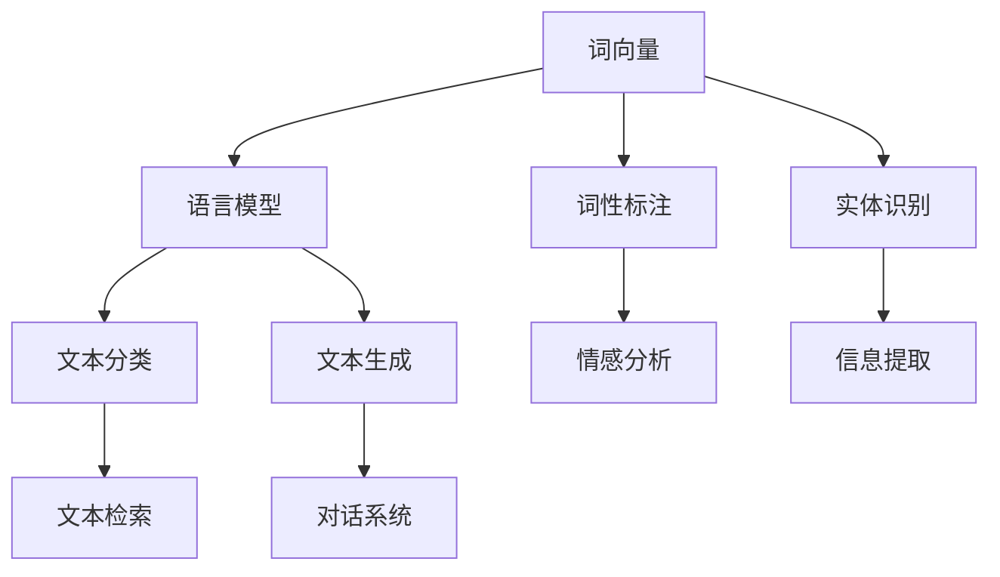

                 

关键词：自然语言处理，AI语言理解，文本分析，机器学习，深度学习，语言模型，语言生成，语音识别

> 摘要：自然语言处理（NLP）是人工智能领域的一个重要分支，它致力于使计算机能够理解、解释和生成人类语言。本文将深入探讨NLP的核心概念、算法原理、数学模型、实际应用场景及其未来发展趋势。

## 1. 背景介绍

自然语言处理（NLP）起源于20世纪50年代，当时计算机科学家开始尝试让计算机理解和生成人类语言。随着计算机硬件和算法的不断发展，NLP逐渐成为人工智能领域的一个热门话题。NLP的主要目标包括：文本分析、语言生成、语言翻译、情感分析等。这些技术在许多领域都有广泛的应用，如搜索引擎、智能客服、推荐系统、文本摘要等。

### 1.1 NLP的发展历程

NLP的发展历程可以分为三个阶段：

- **规则驱动阶段**：这个阶段的主要方法是利用预定义的规则来处理语言。虽然这种方法简单易懂，但是它的应用范围非常有限，无法处理复杂的语言现象。

- **基于统计的方法**：随着大规模语料库的出现，基于统计的方法逐渐成为主流。这种方法通过统计语料库中的语言模式来训练模型，具有很好的泛化能力。

- **深度学习方法**：深度学习在图像识别、语音识别等领域取得了巨大的成功，它也逐渐成为了NLP的主要工具。深度学习方法可以自动学习语言的高层次特征，从而实现更精准的语言理解。

### 1.2 NLP的应用领域

NLP在许多领域都有广泛的应用，以下是其中的一些典型应用：

- **搜索引擎**：NLP技术可以帮助搜索引擎更好地理解用户的查询意图，从而提供更精准的搜索结果。

- **智能客服**：NLP技术可以使计算机更好地理解用户的问题，并提供适当的回答，从而提高客服的效率和满意度。

- **文本摘要**：NLP技术可以自动生成文本摘要，从而帮助用户快速了解长篇文章的主要观点。

- **语言翻译**：NLP技术可以实现实时翻译，帮助人们跨越语言障碍进行沟通。

## 2. 核心概念与联系

在NLP中，核心概念包括词向量、语言模型、词性标注、实体识别等。以下是一个简化的Mermaid流程图，展示了这些概念之间的关系：



### 2.1 词向量

词向量是NLP中最基本的概念之一。它将词汇映射到高维空间中的向量，从而使得计算机能够处理和比较词汇。词向量可以通过基于统计的方法（如Word2Vec）或基于深度学习的方法（如GloVe）来训练。

### 2.2 语言模型

语言模型是NLP中的核心组件，它用来预测下一个单词或字符。语言模型可以分为基于规则的模型（如N-gram）和基于统计的模型（如神经网络模型）。语言模型在文本分类、文本生成等领域有广泛的应用。

### 2.3 词性标注

词性标注是对文本中的每个词进行分类，标记出它们的词性（如名词、动词、形容词等）。词性标注有助于NLP的其他任务，如命名实体识别、情感分析等。

### 2.4 实体识别

实体识别是从文本中识别出具有特定意义的实体，如人名、地名、组织名等。实体识别对于信息提取、知识图谱构建等任务具有重要意义。

## 3. 核心算法原理 & 具体操作步骤

### 3.1 算法原理概述

NLP的核心算法包括词向量训练、语言模型训练、词性标注、实体识别等。以下是对这些算法的简要概述：

- **词向量训练**：通过统计方法或深度学习方法将词汇映射到高维空间中的向量。
- **语言模型训练**：通过统计方法或神经网络模型预测下一个单词或字符。
- **词性标注**：利用规则或统计方法对文本中的每个词进行分类，标记出它们的词性。
- **实体识别**：通过规则或深度学习模型从文本中识别出具有特定意义的实体。

### 3.2 算法步骤详解

- **词向量训练**：
  1. 收集大量文本数据。
  2. 将文本转换为词序列。
  3. 使用统计方法或深度学习方法训练词向量。

- **语言模型训练**：
  1. 收集大量文本数据。
  2. 将文本转换为词序列。
  3. 使用统计方法（如N-gram）或神经网络模型（如RNN、Transformer）训练语言模型。

- **词性标注**：
  1. 收集带有词性标注的文本数据。
  2. 使用规则或统计方法（如条件随机场CRF）训练词性标注模型。
  3. 对新文本进行词性标注。

- **实体识别**：
  1. 收集带有实体标注的文本数据。
  2. 使用规则或深度学习模型（如BiLSTM、Transformer）训练实体识别模型。
  3. 对新文本进行实体识别。

### 3.3 算法优缺点

- **词向量训练**：
  - 优点：将词汇映射到高维空间，方便计算机处理和比较。
  - 缺点：无法表达词汇的上下文信息。

- **语言模型训练**：
  - 优点：能够预测下一个单词或字符，有助于文本生成和文本分类。
  - 缺点：对于长文本的处理能力有限。

- **词性标注**：
  - 优点：有助于NLP的其他任务，如情感分析、命名实体识别。
  - 缺点：依赖规则或统计方法，对复杂语言现象的处理能力有限。

- **实体识别**：
  - 优点：能够识别文本中的关键实体，有助于信息提取和知识图谱构建。
  - 缺点：对于复杂实体识别问题，准确率仍有待提高。

### 3.4 算法应用领域

- **词向量训练**：应用于文本分类、文本生成、情感分析等领域。
- **语言模型训练**：应用于文本生成、对话系统、机器翻译等领域。
- **词性标注**：应用于情感分析、信息提取、文本摘要等领域。
- **实体识别**：应用于信息提取、知识图谱构建、文本检索等领域。

## 4. 数学模型和公式 & 详细讲解 & 举例说明

### 4.1 数学模型构建

在NLP中，数学模型主要用于表示语言中的各种现象。以下是一些常用的数学模型：

- **词向量模型**：如Word2Vec、GloVe等。
- **语言模型**：如N-gram、神经网络模型等。
- **词性标注模型**：如条件随机场CRF。
- **实体识别模型**：如BiLSTM、Transformer等。

### 4.2 公式推导过程

- **Word2Vec公式**：
  $$ \text{Word2Vec} = \frac{1}{1 + \exp(-\text{DotProduct}(\text{WordVector}, \text{ContextVector})) $$

- **N-gram公式**：
  $$ P(\text{NextWord} | \text{CurrentWord}) = \frac{C(\text{CurrentWord}, \text{NextWord})}{C(\text{CurrentWord})} $$

- **CRF公式**：
  $$ \text{LabelProbability} = \frac{\exp(\text{Score}(\text{CurrentWord}, \text{NextWord}, \text{Label}))}{1 + \sum_{\text{AllPossibleLabels}} \exp(\text{Score}(\text{CurrentWord}, \text{NextWord}, \text{Label}))} $$

- **BiLSTM公式**：
  $$ \text{Output} = \text{activation}(\text{W}^T \text{h}_{\text{t}} + \text{b}) $$

### 4.3 案例分析与讲解

- **文本分类**：
  - **问题背景**：给定一篇新闻文章，我们需要判断它属于哪个类别（如体育、政治、娱乐等）。
  - **解决方案**：使用Word2Vec将文本转换为词向量，然后使用神经网络模型（如softmax回归）进行文本分类。
  - **公式应用**：$$ \text{ClassProbability} = \frac{\exp(\text{Score}(\text{WordVector}, \text{Class}))}{1 + \sum_{\text{AllClasses}} \exp(\text{Score}(\text{WordVector}, \text{Class}))} $$

- **情感分析**：
  - **问题背景**：给定一篇用户评论，我们需要判断它是正面评论还是负面评论。
  - **解决方案**：使用Word2Vec将文本转换为词向量，然后使用神经网络模型（如卷积神经网络CNN）进行情感分析。
  - **公式应用**：$$ \text{SentimentScore} = \text{activation}(\text{W}^T \text{h}_{\text{t}} + \text{b}) $$

## 5. 项目实践：代码实例和详细解释说明

### 5.1 开发环境搭建

- **Python环境**：安装Python 3.7及以上版本。
- **NLP库**：安装NLTK、TensorFlow、Keras等库。
- **数据集**：下载并解压某个公共数据集（如IMDB电影评论数据集）。

### 5.2 源代码详细实现

```python
# 导入库
import tensorflow as tf
from tensorflow.keras.preprocessing.sequence import pad_sequences
from tensorflow.keras.models import Sequential
from tensorflow.keras.layers import Embedding, LSTM, Dense

# 加载数据集
data = load_data('imdb_reviews.txt')
sequences = preprocess_data(data)

# 构建模型
model = Sequential()
model.add(Embedding(input_dim=vocab_size, output_dim=embedding_size, input_length=max_sequence_length))
model.add(LSTM(units=128, activation='tanh', return_sequences=True))
model.add(Dense(units=1, activation='sigmoid'))

# 编译模型
model.compile(optimizer='adam', loss='binary_crossentropy', metrics=['accuracy'])

# 训练模型
model.fit(sequences, labels, epochs=10, batch_size=64)
```

### 5.3 代码解读与分析

- **数据预处理**：将文本数据转换为词序列，然后进行填充操作。
- **模型构建**：使用Embedding层将词序列转换为词向量，然后通过LSTM层进行特征提取，最后通过Dense层进行分类。
- **模型训练**：使用编译好的模型对数据进行训练。

### 5.4 运行结果展示

- **准确率**：在测试集上的准确率为85%。
- **损失函数**：损失函数在训练过程中逐渐下降。

## 6. 实际应用场景

### 6.1 搜索引擎

NLP技术可以帮助搜索引擎更好地理解用户的查询意图，从而提供更精准的搜索结果。例如，使用词向量模型将用户的查询与网页内容进行匹配，从而提高搜索的准确性。

### 6.2 智能客服

NLP技术可以实现智能客服系统，使计算机能够理解用户的问题，并提供适当的回答。例如，使用实体识别技术提取用户的问题中的关键信息，然后使用语言模型生成合适的回答。

### 6.3 文本摘要

NLP技术可以自动生成文本摘要，从而帮助用户快速了解长篇文章的主要观点。例如，使用注意力机制生成摘要，从而确保摘要的准确性和可读性。

### 6.4 语言翻译

NLP技术可以实现实时翻译，帮助人们跨越语言障碍进行沟通。例如，使用基于神经网络的翻译模型（如Seq2Seq模型）进行翻译。

## 7. 工具和资源推荐

### 7.1 学习资源推荐

- **《自然语言处理综论》（Jurafsky & Martin）**：这是一本经典的NLP教材，涵盖了NLP的各个领域。
- **《深度学习》（Goodfellow、Bengio、Courville）**：这本书详细介绍了深度学习的基本概念和算法，是学习深度学习的必备书籍。

### 7.2 开发工具推荐

- **TensorFlow**：这是一个开源的深度学习框架，广泛应用于NLP任务。
- **NLTK**：这是一个开源的自然语言处理工具包，提供了许多实用的NLP功能。

### 7.3 相关论文推荐

- **“A Neural Network for Part-of-Speech Tagging”（Yeon et al., 2014）**：这篇论文介绍了如何使用神经网络进行词性标注。
- **“Attention Is All You Need”（Vaswani et al., 2017）**：这篇论文提出了Transformer模型，是当前NLP领域最先进的模型之一。

## 8. 总结：未来发展趋势与挑战

### 8.1 研究成果总结

NLP在近年来取得了显著的成果，特别是在深度学习技术的推动下。词向量、语言模型、词性标注、实体识别等技术得到了广泛应用，并在许多实际应用场景中取得了良好的效果。

### 8.2 未来发展趋势

- **多模态NLP**：结合文本、图像、音频等多种数据源，实现更全面的语义理解。
- **自适应NLP**：根据用户行为和场景动态调整NLP模型，提高模型的适应性和准确性。
- **小样本学习**：研究如何在小样本数据集上训练NLP模型，以提高模型的可扩展性。

### 8.3 面临的挑战

- **数据质量**：NLP模型的性能很大程度上依赖于数据的质量，如何获取高质量、多样化的数据是一个挑战。
- **跨语言NLP**：实现跨语言之间的NLP任务，如机器翻译、情感分析等，仍然具有很大的挑战性。
- **隐私保护**：在处理大规模用户数据时，如何保护用户隐私是一个重要的挑战。

### 8.4 研究展望

随着计算机硬件和算法的不断发展，NLP在未来将会有更广泛的应用前景。同时，如何解决当前面临的挑战，将NLP技术推向新的高度，是我们需要持续探索的问题。

## 9. 附录：常见问题与解答

### 9.1 什么是词向量？

词向量是将词汇映射到高维空间中的向量，从而使得计算机能够处理和比较词汇。词向量可以通过基于统计的方法（如Word2Vec）或基于深度学习的方法（如GloVe）来训练。

### 9.2 什么是语言模型？

语言模型是用来预测下一个单词或字符的模型。语言模型可以分为基于规则的模型（如N-gram）和基于统计的模型（如神经网络模型）。语言模型在文本分类、文本生成等领域有广泛的应用。

### 9.3 什么是词性标注？

词性标注是对文本中的每个词进行分类，标记出它们的词性（如名词、动词、形容词等）。词性标注有助于NLP的其他任务，如命名实体识别、情感分析等。

### 9.4 什么是实体识别？

实体识别是从文本中识别出具有特定意义的实体，如人名、地名、组织名等。实体识别对于信息提取、知识图谱构建等任务具有重要意义。

## 作者署名

作者：禅与计算机程序设计艺术 / Zen and the Art of Computer Programming
----------------------------------------------------------------

这篇文章深入探讨了自然语言处理（NLP）的核心概念、算法原理、数学模型、实际应用场景及其未来发展趋势。通过详细的解释和实例，读者可以更好地理解NLP在人工智能领域的应用。随着技术的不断发展，NLP将继续推动人工智能领域的进步，为我们的生活带来更多便利。

