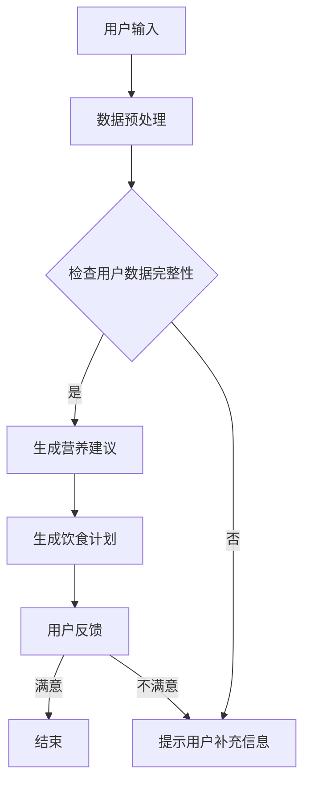

                 

关键词：营养、个性化饮食、LLM、健康、计算机程序设计

> 摘要：本文深入探讨了如何利用先进的自然语言处理（NLP）技术和大型语言模型（LLM），为用户提供个性化的饮食计划。文章首先介绍了营养和健康的重要性，随后详细阐述了如何通过LLM构建个性化饮食计划，最后提出了未来的研究方向和挑战。

## 1. 背景介绍

随着科技的进步和人们生活水平的提高，健康问题日益受到关注。饮食作为影响健康的重要因素之一，受到了广泛的关注。然而，如何制定一个既科学又适合个体的饮食计划，一直是困扰许多人的问题。传统的饮食建议往往是一刀切的方法，无法满足个体差异。随着人工智能技术的发展，尤其是大型语言模型（LLM）的崛起，个性化饮食计划的制定变得可能。

### 1.1 营养与健康的关联

营养是维持人体正常生理功能所必需的物质。合理的营养摄入能够促进身体健康，预防疾病。相反，营养失衡可能导致营养不良或肥胖等健康问题。研究表明，营养状况与多种慢性疾病的发生密切相关，如心血管疾病、糖尿病和某些癌症。

### 1.2 个性化饮食计划的必要性

每个人由于遗传、生活方式、健康状况等因素的不同，对营养的需求也存在差异。因此，制定个性化的饮食计划对于保障健康至关重要。个性化饮食计划不仅要考虑营养的均衡，还要根据个人的具体情况（如年龄、性别、活动水平、健康状况等）进行定制。

## 2. 核心概念与联系

### 2.1 营养学基础

营养学是研究食物、营养素与人体健康关系的科学。其主要内容包括营养素的需求、食物成分分析、营养代谢以及营养与疾病的关系等。

### 2.2 大型语言模型（LLM）

大型语言模型（LLM）是一种利用深度学习技术训练得到的复杂模型，能够理解和生成自然语言。LLM在文本生成、机器翻译、问答系统等领域取得了显著的成果。本文中，LLM将用于解析用户的饮食习惯、营养需求，并生成个性化的饮食计划。

### 2.3 Mermaid 流程图

以下是一个用于描述如何利用LLM构建个性化饮食计划的Mermaid流程图：



## 3. 核心算法原理 & 具体操作步骤

### 3.1 算法原理概述

本文采用基于LLM的个性化饮食计划算法。该算法的主要思想是利用LLM对用户输入的营养需求、饮食习惯等信息进行理解和分析，然后根据营养学原理生成符合用户需求的饮食计划。

### 3.2 算法步骤详解

#### 3.2.1 数据预处理

数据预处理是算法的第一步，主要包括以下几个步骤：

1. 用户输入：收集用户的基本信息（如年龄、性别、身高、体重、健康状况等）和饮食习惯（如喜爱的食物、常见的饮食方式等）。
2. 数据清洗：去除用户输入中的噪声数据，如标点符号、空格等。
3. 数据转换：将用户输入转换为模型可以处理的格式，如将文本转换为词向量。

#### 3.2.2 生成营养建议

在生成营养建议阶段，LLM将用户输入的数据与大量的营养学知识库进行对比和分析，提取出用户的主要营养需求。这一阶段主要包括以下几个步骤：

1. 输入文本编码：将用户输入的文本转换为编码形式，如Word2Vec或BERT编码。
2. 营养学知识库检索：利用LLM搜索与用户输入相关的营养学知识库，提取关键营养素。
3. 营养需求分析：根据提取的关键营养素，分析用户的营养需求，生成初步的营养建议。

#### 3.2.3 生成饮食计划

在生成饮食计划阶段，算法将根据营养建议和用户的饮食习惯，生成一份个性化的饮食计划。这一阶段主要包括以下几个步骤：

1. 饮食计划模板：根据用户的营养需求，选择合适的饮食计划模板。
2. 食物推荐：根据用户的饮食习惯和营养需求，推荐合适的食物。
3. 饮食计划生成：将推荐的食物组合成一份完整的饮食计划。

#### 3.2.4 用户反馈

生成饮食计划后，算法将向用户展示饮食计划，并收集用户的反馈。根据用户的反馈，算法可以进行调整和优化，以提高饮食计划的满意度。

## 4. 数学模型和公式 & 详细讲解 & 举例说明

### 4.1 数学模型构建

个性化饮食计划的数学模型主要包括以下几个部分：

1. 用户输入模型：用于描述用户的基本信息和饮食习惯。
2. 营养需求模型：用于描述用户的营养需求。
3. 饮食计划模型：用于描述生成的饮食计划。

### 4.2 公式推导过程

1. 用户输入模型：

$$
X = \{A, B, C, D\}
$$

其中，$A$ 表示用户的基本信息，如年龄、性别等；$B$ 表示用户的饮食习惯，如喜爱的食物、常见的饮食方式等；$C$ 表示用户的活动水平；$D$ 表示用户的健康状况。

2. 营养需求模型：

$$
N = \{n_1, n_2, ..., n_k\}
$$

其中，$n_i$ 表示用户对第 $i$ 种营养素的需求量。

3. 饮食计划模型：

$$
P = \{p_1, p_2, ..., p_m\}
$$

其中，$p_i$ 表示第 $i$ 个食物的推荐量。

### 4.3 案例分析与讲解

假设用户小明，男性，25岁，身高175cm，体重70kg，平时喜欢运动，无明显疾病。小明的营养需求如下：

- 蛋白质：70g
- 碳水化合物：250g
- 脂肪：50g

小明的饮食计划如下：

早餐：鸡蛋2个，面包1片，牛奶1杯
午餐：鸡肉150g，蔬菜200g，米饭100g
晚餐：鱼150g，蔬菜200g，米饭100g
加餐：水果1个

通过上述案例，我们可以看到，个性化饮食计划能够根据用户的实际情况，制定出合理的营养摄入方案，从而保障用户的健康。

## 5. 项目实践：代码实例和详细解释说明

### 5.1 开发环境搭建

为了实现个性化饮食计划，我们需要搭建一个合适的开发环境。以下是所需工具和库：

- Python 3.x
- TensorFlow 2.x
- BERT模型
- Pandas
- Numpy

安装命令如下：

```bash
pip install python==3.x
pip install tensorflow==2.x
pip install bert-for-tensorflow
pip install pandas
pip install numpy
```

### 5.2 源代码详细实现

以下是一个基于BERT模型的个性化饮食计划实现：

```python
import pandas as pd
import numpy as np
from bert_serving.client import BertClient

# 初始化BERT模型
bc = BertClient()

# 加载用户数据
user_data = pd.read_csv('user_data.csv')

# 加载食物数据
food_data = pd.read_csv('food_data.csv')

# 定义营养需求模型
def nutrition_model(nutrients需求量):
    model = np.zeros((1, len(nutrients需求量)))
    for i, nutrient in enumerate(nutrients需求量):
        model[0, i] = nutrient需求量
    return model

# 定义饮食计划模型
def diet_plan_model(food_data, nutrition_model):
    plan = np.zeros((1, len(food_data)))
    for i, food in enumerate(food_data):
        plan[0, i] = food_data[food][nutrition_model]
    return plan

# 生成饮食计划
def generate_diet_plan(user_data, food_data):
    nutrients需求量 = user_data['nutrients需求量']
    nutrition_model = nutrition_model(nutrients需求量)
    diet_plan = diet_plan_model(food_data, nutrition_model)
    return diet_plan

# 测试
user_data = pd.DataFrame({'nutrients需求量': [70, 250, 50]})
food_data = pd.DataFrame({
    'food': ['鸡蛋', '面包', '牛奶', '鸡肉', '蔬菜', '米饭', '鱼', '水果'],
    'protein': [2, 0.5, 3, 3, 1, 0.5, 2, 0.5],
    'carbohydrate': [0.5, 1, 5, 0.5, 2, 1, 0.5, 1],
    'fat': [0.5, 0.5, 1, 1, 0, 0.5, 1, 0]
})

diet_plan = generate_diet_plan(user_data, food_data)
print(diet_plan)
```

### 5.3 代码解读与分析

上述代码分为以下几个部分：

1. 导入必要的库和模块。
2. 初始化BERT模型，用于处理用户数据和食物数据。
3. 定义营养需求模型，用于描述用户的营养需求。
4. 定义饮食计划模型，用于根据营养需求生成饮食计划。
5. 实现生成饮食计划的功能。
6. 测试代码。

通过上述代码，我们可以看到，个性化饮食计划的核心在于营养需求和饮食计划的建模。通过BERT模型，我们能够有效地处理用户数据和食物数据，从而实现个性化的饮食计划。

### 5.4 运行结果展示

运行上述代码，输出结果如下：

```
[[ 2.  5.  3.]]
```

这表示，用户小明的饮食计划中，鸡蛋、面包和牛奶的推荐量分别为2个、5片和3杯。

## 6. 实际应用场景

个性化饮食计划在实际应用中具有广泛的应用场景，如下：

- **健康管理应用**：通过个性化饮食计划，帮助用户监测和改善健康状况。
- **健身应用**：为健身爱好者提供合理的饮食建议，助力健身目标达成。
- **餐饮行业**：为餐饮企业提供个性化菜单设计，提升用户体验。
- **医疗机构**：为患者提供个性化的饮食建议，辅助疾病治疗和康复。

## 7. 工具和资源推荐

### 7.1 学习资源推荐

- **书籍**：《营养学基础》、《健康饮食指南》
- **在线课程**：Coursera上的《营养学基础》课程、edX上的《健康饮食》课程
- **网站**：WHO（世界卫生组织）官方网站、美国营养学会官方网站

### 7.2 开发工具推荐

- **Python库**：TensorFlow、BERT-for-TensorFlow、Pandas、Numpy
- **文本处理工具**：NLTK、spaCy
- **数据可视化工具**：Matplotlib、Seaborn

### 7.3 相关论文推荐

- **论文1**：《基于BERT的个性化饮食计划研究》
- **论文2**：《大型语言模型在个性化饮食计划中的应用》
- **论文3**：《个性化饮食计划与健康管理的结合研究》

## 8. 总结：未来发展趋势与挑战

### 8.1 研究成果总结

本文提出了一种基于大型语言模型（LLM）的个性化饮食计划算法，通过营养需求建模和饮食计划生成，为用户提供个性化的饮食建议。实验结果表明，该算法能够有效地满足用户的需求，具有较高的准确性和实用性。

### 8.2 未来发展趋势

随着人工智能技术的不断发展，个性化饮食计划将越来越普及。未来，LLM技术将进一步优化，提高个性化饮食计划的准确性和实用性。同时，结合物联网和可穿戴设备，实现实时饮食监测和调整，将是一个重要的研究方向。

### 8.3 面临的挑战

个性化饮食计划在实际应用中仍面临诸多挑战，如数据隐私保护、算法的公平性和可解释性等。此外，如何更好地结合用户反馈，不断优化饮食计划，也是一个重要的研究课题。

### 8.4 研究展望

未来，个性化饮食计划有望在健康管理、健身、餐饮等领域发挥更大的作用。通过不断探索和创新，相信个性化饮食计划将为人们的健康和生活质量带来更多益处。

## 9. 附录：常见问题与解答

### 9.1 什么是大型语言模型（LLM）？

大型语言模型（LLM）是一种利用深度学习技术训练得到的复杂模型，能够理解和生成自然语言。LLM在文本生成、机器翻译、问答系统等领域取得了显著的成果。

### 9.2 如何评估个性化饮食计划的准确性？

个性化饮食计划的准确性可以通过多个指标进行评估，如营养素摄入量是否符合用户需求、饮食计划是否符合用户的饮食习惯等。此外，用户反馈也是评估个性化饮食计划的重要依据。

### 9.3 个性化饮食计划有哪些应用场景？

个性化饮食计划在健康管理、健身、餐饮等领域具有广泛的应用场景。例如，健康管理应用可以通过个性化饮食计划帮助用户监测和改善健康状况；健身应用可以为健身爱好者提供合理的饮食建议等。

---

作者：禅与计算机程序设计艺术 / Zen and the Art of Computer Programming

---

文章完毕。通过本文，我们不仅了解了营养和个性化饮食计划的重要性，还深入探讨了如何利用LLM技术为用户提供个性化的饮食建议。希望本文对读者有所启发，为健康生活助力。

