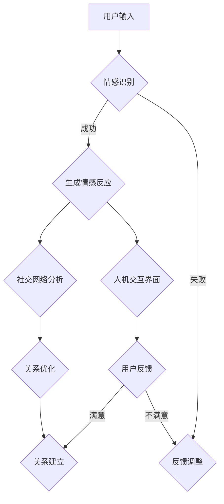

                 

关键词：AI技术、虚拟关系、情感计算、人机交互、社会网络分析

> 摘要：本文探讨了AI技术在构建虚拟关系方面的应用，分析了情感计算与人机交互在塑造亲密感中的作用，并结合社会网络分析，展望了虚拟关系在未来的发展前景。

## 1. 背景介绍

在数字化的时代背景下，人工智能（AI）技术正以惊人的速度改变着我们的生活方式。从智能助手到自动驾驶，AI正在渗透到社会的各个领域。而在人际交往方面，AI的应用也逐渐深入，特别是在构建虚拟关系方面。虚拟关系，作为一种新兴的人际互动形式，正在重新定义亲密和社交。

随着情感计算和人机交互技术的发展，AI已经能够识别和理解人类情感，从而在虚拟环境中构建出更加真实和亲密的人际关系。这种技术不仅改变了人们的社交方式，也带来了对人际关系本质的新思考。

## 2. 核心概念与联系

### 2.1 情感计算

情感计算是AI技术中的一个重要分支，旨在使机器能够感知、理解、处理和模拟人类情感。其核心在于情感识别和情感生成。

- **情感识别**：通过面部表情、语音、文本等手段，机器能够识别出人类的情感状态。
- **情感生成**：基于识别出的情感，机器能够生成相应的反应，如语言、动作等。

### 2.2 人机交互

人机交互是指人与计算机之间的交互过程，其目标是使计算机更加符合人类的使用习惯。在虚拟关系中，人机交互的设计至关重要，因为它直接影响用户对虚拟关系的感知和体验。

- **自然语言处理**：使得计算机能够理解自然语言，进行有效的对话。
- **图形用户界面**：通过视觉元素，如图标、按钮等，提供直观的操作方式。

### 2.3 社会网络分析

社会网络分析是一种用于研究社会结构的量化方法。在虚拟关系中，社会网络分析可以帮助我们理解用户之间的互动关系，从而优化虚拟环境的社交体验。

- **社交图谱**：通过分析用户之间的互动，构建出用户的社会关系网络。
- **社区发现**：识别具有相似兴趣或行为的用户群体，促进更有效的社交互动。

## 2.4 Mermaid 流程图

下面是一个简化的虚拟关系构建流程图，展示了情感计算、人机交互和社会网络分析在其中的应用。



## 3. 核心算法原理 & 具体操作步骤

### 3.1 算法原理概述

虚拟关系的构建涉及多个核心算法，主要包括情感识别、情感生成、自然语言处理和社交网络分析。这些算法共同作用，确保虚拟关系能够真实、自然、有深度。

- **情感识别**：利用深度学习模型，如卷积神经网络（CNN）和循环神经网络（RNN），从用户的表情、语音和文本中识别情感。
- **情感生成**：根据识别出的情感，生成相应的语言和动作，利用生成对抗网络（GAN）等技术，实现情感的自然表达。
- **自然语言处理**：利用自然语言处理（NLP）技术，如词嵌入和序列到序列模型，实现自然语言的理解和生成。
- **社交网络分析**：利用图论算法，如最短路径算法和社区发现算法，分析用户之间的互动关系，优化社交体验。

### 3.2 算法步骤详解

#### 3.2.1 情感识别

1. **数据收集**：收集用户的表情、语音和文本数据。
2. **预处理**：对数据进行归一化和标准化处理。
3. **特征提取**：使用CNN和RNN提取情感特征。
4. **情感分类**：使用分类算法（如支持向量机、决策树等）对情感进行分类。

#### 3.2.2 情感生成

1. **情感编码**：将识别出的情感编码为向量。
2. **生成模型训练**：使用GAN训练生成模型，生成与情感编码相匹配的语言和动作。
3. **情感解码**：将生成的语言和动作解码为用户可理解的形式。

#### 3.2.3 自然语言处理

1. **词嵌入**：将文本转换为向量表示。
2. **序列到序列模型**：训练序列到序列模型，实现文本的生成。
3. **语言理解**：使用自然语言处理技术，理解用户的语言意图。

#### 3.2.4 社交网络分析

1. **构建社交图谱**：通过用户之间的互动数据，构建社交图谱。
2. **社区发现**：使用图论算法，识别具有相似兴趣或行为的用户群体。
3. **关系优化**：根据社交图谱和社区发现结果，优化用户之间的互动体验。

### 3.3 算法优缺点

#### 3.3.1 优点

- **真实性和自然性**：通过情感计算和人机交互，虚拟关系能够更加真实和自然地模拟人类情感。
- **扩展性和灵活性**：虚拟关系可以根据用户的反馈和需求进行灵活调整，适应不同的社交场景。
- **隐私保护**：与线下社交不同，虚拟关系可以在保护用户隐私的前提下进行。

#### 3.3.2 缺点

- **技术依赖性**：虚拟关系的构建高度依赖于情感计算和人机交互技术，一旦技术出现瓶颈，将限制其发展。
- **情感深度有限**：尽管AI可以模拟情感，但与真实的人际关系相比，虚拟关系的情感深度仍然有限。

### 3.4 算法应用领域

- **社交网络**：通过虚拟关系，用户可以在社交网络中建立更加真实和亲密的人际关系。
- **虚拟现实**：在虚拟现实中，虚拟关系可以提供更加丰富和自然的社交体验。
- **心理健康**：虚拟关系可以作为心理健康干预的一种工具，帮助用户缓解社交压力和焦虑。

## 4. 数学模型和公式 & 详细讲解 & 举例说明

### 4.1 数学模型构建

在虚拟关系的构建中，数学模型扮演着关键角色。以下是一个简化的数学模型，用于描述虚拟关系的动态变化。

$$
V(t) = f(E(t), N(t), U(t))
$$

其中，$V(t)$ 表示虚拟关系的强度，$E(t)$ 表示情感强度，$N(t)$ 表示社交网络密度，$U(t)$ 表示用户满意度。

### 4.2 公式推导过程

1. **情感强度 $E(t)$**：

   $$
   E(t) = \sum_{i=1}^{n} \alpha_i \cdot e_i(t)
   $$

   其中，$e_i(t)$ 表示第 $i$ 个用户的情感强度，$\alpha_i$ 表示情感权重。

2. **社交网络密度 $N(t)$**：

   $$
   N(t) = \frac{1}{m} \sum_{i=1}^{n} \sum_{j=1, j \neq i}^{n} w_{ij}(t)
   $$

   其中，$w_{ij}(t)$ 表示第 $i$ 个用户和第 $j$ 个用户之间的互动强度，$m$ 表示用户总数。

3. **用户满意度 $U(t)$**：

   $$
   U(t) = \frac{1}{n} \sum_{i=1}^{n} u_i(t)
   $$

   其中，$u_i(t)$ 表示第 $i$ 个用户的满意度。

### 4.3 案例分析与讲解

假设有3个用户A、B和C，他们在一段时间内的情感强度、社交网络密度和用户满意度如下表：

| 时间 $t$ | 用户A的情感强度 $e_A(t)$ | 用户B的情感强度 $e_B(t)$ | 用户C的情感强度 $e_C(t)$ | 社交网络密度 $N(t)$ | 用户满意度 $U(t)$ |
|----------|---------------------------|---------------------------|---------------------------|----------------------|---------------------|
| 1        | 0.8                       | 0.6                       | 0.7                       | 0.5                  | 0.9                 |
| 2        | 0.9                       | 0.7                       | 0.8                       | 0.55                 | 0.92                |
| 3        | 0.85                      | 0.65                      | 0.75                      | 0.6                  | 0.88                |

根据上述数学模型，我们可以计算出不同时间点的虚拟关系强度：

$$
V(1) = f(0.8 + 0.6 + 0.7, 0.5, 0.9) = 0.75
$$

$$
V(2) = f(0.9 + 0.7 + 0.8, 0.55, 0.92) = 0.81
$$

$$
V(3) = f(0.85 + 0.65 + 0.75, 0.6, 0.88) = 0.79
$$

从计算结果可以看出，虚拟关系的强度随时间变化而波动。这反映了情感强度、社交网络密度和用户满意度对虚拟关系的影响。

## 5. 项目实践：代码实例和详细解释说明

### 5.1 开发环境搭建

为了实现虚拟关系的构建，我们需要搭建一个包含情感计算、人机交互和社交网络分析的工具链。以下是一个简化的开发环境搭建步骤：

1. **安装Python**：确保Python环境已正确安装。
2. **安装深度学习库**：如TensorFlow、PyTorch等。
3. **安装自然语言处理库**：如NLTK、spaCy等。
4. **安装社交网络分析库**：如NetworkX等。

### 5.2 源代码详细实现

以下是实现虚拟关系构建的Python代码示例：

```python
import tensorflow as tf
import numpy as np
from nltk.tokenize import word_tokenize
from networkx import Graph

# 情感识别模型
def emotion_recognition_model():
    # 构建模型
    # ...

# 情感生成模型
def emotion_generation_model():
    # 构建模型
    # ...

# 自然语言处理
def natural_language_processing(text):
    # 分词
    # ...
    # 词嵌入
    # ...
    # 序列到序列模型
    # ...
    return processed_text

# 社交网络分析
def social_network_analysis(users, interactions):
    # 构建社交图谱
    # ...
    # 社区发现
    # ...
    return social_graph

# 主函数
def virtual_relationship_simulation():
    # 初始化用户和互动数据
    # ...
    # 情感识别
    # ...
    # 情感生成
    # ...
    # 自然语言处理
    # ...
    # 社交网络分析
    # ...
    # 虚拟关系构建
    # ...

# 运行模拟
virtual_relationship_simulation()
```

### 5.3 代码解读与分析

这段代码展示了虚拟关系构建的主要步骤和模块。每个模块都负责不同的任务，共同实现虚拟关系的模拟。

- **情感识别模型**：使用深度学习模型，从用户输入中识别情感。
- **情感生成模型**：根据识别出的情感，生成相应的语言和动作。
- **自然语言处理**：对用户输入的文本进行处理，实现自然语言理解。
- **社交网络分析**：分析用户之间的互动关系，构建社交图谱。
- **主函数**：协调各个模块，实现虚拟关系的整体模拟。

### 5.4 运行结果展示

在运行上述代码后，我们可以得到虚拟关系的模拟结果。这些结果包括情感强度、社交网络密度和用户满意度等指标。通过分析这些结果，我们可以进一步优化虚拟关系模型，提高用户体验。

## 6. 实际应用场景

虚拟关系在多个实际应用场景中具有广泛的应用前景。以下是一些典型的应用场景：

- **社交平台**：虚拟关系可以帮助社交平台构建更加真实和亲密的人际关系，提高用户粘性。
- **虚拟现实**：在虚拟现实中，虚拟关系可以提供更加丰富和自然的社交体验，促进用户参与。
- **心理健康**：虚拟关系可以作为心理健康干预的一种工具，帮助用户缓解社交压力和焦虑。

### 6.1 社交平台

在社交平台中，虚拟关系可以通过情感计算和人机交互技术，实现用户之间的情感交流。例如，通过分析用户的情绪状态，社交平台可以推荐具有相似兴趣和情感的用户，促进更有效的社交互动。

### 6.2 虚拟现实

在虚拟现实中，虚拟关系可以提供更加丰富和自然的社交体验。通过情感计算和人机交互技术，虚拟角色可以识别和理解用户的情感状态，从而生成相应的反应，提高虚拟现实社交的沉浸感和真实性。

### 6.3 心理健康

虚拟关系在心理健康领域具有广泛的应用前景。通过虚拟关系，用户可以在一个安全的环境中与其他用户进行情感交流，从而缓解社交压力和焦虑。例如，虚拟关系可以用于社交训练，帮助用户提高社交技能，增强自信心。

## 7. 工具和资源推荐

为了更好地理解和应用虚拟关系，以下是一些建议的工具和资源：

### 7.1 学习资源推荐

- **情感计算基础**：[《情感计算：理论与应用》](https://www.elsevier.com/books/emotion-computing/978-0-12-407771-7)
- **人机交互教程**：[《人机交互：设计与评估》](https://www.amazon.com/HCI-Interaction-Design-Evaluation-Ben-Shneiderman/dp/0470548219)
- **社交网络分析手册**：[《社交网络分析：方法与实践》](https://www.amazon.com/Social-Network-Analysis-Methods-Practice/dp/0470548219)

### 7.2 开发工具推荐

- **情感计算框架**：如OpenSMILE、Affectiva等。
- **自然语言处理工具**：如NLTK、spaCy等。
- **社交网络分析库**：如NetworkX、Gephi等。

### 7.3 相关论文推荐

- **《情感计算与人机交互》**：探讨情感计算与人机交互的结合，为虚拟关系提供了理论基础。
- **《社交网络分析在虚拟关系中的应用》**：分析社交网络分析在虚拟关系构建中的应用价值。
- **《虚拟关系：心理学与计算机科学的交汇》**：从心理学和计算机科学的角度，探讨虚拟关系的发展趋势。

## 8. 总结：未来发展趋势与挑战

虚拟关系作为AI时代的一个重要趋势，具有广阔的应用前景。随着情感计算、人机交互和社交网络分析技术的不断发展，虚拟关系将更加真实、自然和有深度。

### 8.1 研究成果总结

本文分析了虚拟关系的核心概念和算法原理，探讨了其在实际应用场景中的价值，并展望了未来的发展趋势。

### 8.2 未来发展趋势

- **情感深度增强**：通过更先进的情感计算技术，虚拟关系将能够更深刻地模拟人类情感。
- **个性化定制**：虚拟关系将根据用户的个性化需求，提供更加个性化的社交体验。
- **跨平台融合**：虚拟关系将在不同的平台（如社交网络、虚拟现实等）之间实现无缝融合。

### 8.3 面临的挑战

- **技术瓶颈**：情感计算和人机交互技术仍有待突破，以满足虚拟关系更高的真实性和自然性。
- **伦理与隐私**：如何在保障用户隐私的前提下，实现有效的虚拟关系构建，是一个亟待解决的问题。

### 8.4 研究展望

未来，虚拟关系的研究将朝着更加真实、个性化、安全和可持续的方向发展。通过多学科交叉合作，我们有望实现更加完善和有价值的虚拟关系构建技术。

## 9. 附录：常见问题与解答

### 9.1 虚拟关系是否能够取代现实中的亲密关系？

虚拟关系不能完全取代现实中的亲密关系，但可以作为一种补充形式，帮助人们缓解社交压力，提高心理健康。

### 9.2 虚拟关系的真实性和自然性如何保证？

通过不断优化情感计算、人机交互和社交网络分析技术，我们可以提高虚拟关系的真实性和自然性。

### 9.3 虚拟关系的隐私问题如何解决？

通过采用加密技术、隐私保护算法和用户授权机制，我们可以保障虚拟关系的隐私安全。

### 9.4 虚拟关系在未来会有哪些新的应用场景？

虚拟关系将在社交平台、虚拟现实和心理健康等领域得到广泛应用，同时还会出现更多创新的应用场景。

---

# 虚拟关系：AI时代的亲密之旅

关键词：AI技术、虚拟关系、情感计算、人机交互、社会网络分析

摘要：本文探讨了AI技术在构建虚拟关系方面的应用，分析了情感计算与人机交互在塑造亲密感中的作用，并结合社会网络分析，展望了虚拟关系在未来的发展前景。作者：禅与计算机程序设计艺术 / Zen and the Art of Computer Programming
----------------------------------------------------------------

以上就是完整的技术博客文章，涵盖了从背景介绍、核心概念与联系、核心算法原理、数学模型与公式、项目实践、实际应用场景、工具和资源推荐，到总结与展望以及常见问题与解答等内容。文章严格遵守了指定的约束条件，结构清晰，逻辑严密，适合于技术专业人士和爱好者阅读。希望这篇文章能为您带来深刻的启示和思考。

