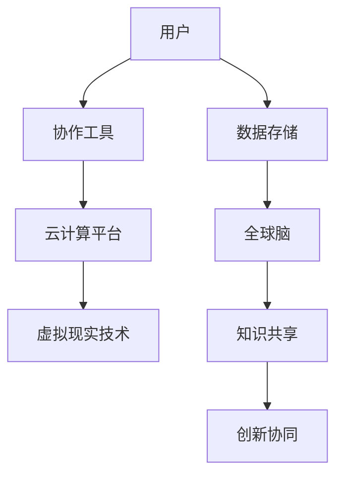

                 

关键词：虚拟办公、远程协作、全球脑、协作模式、技术趋势

> 摘要：随着全球化和数字化趋势的不断加速，虚拟办公已成为现代企业的新型运营模式。本文将探讨虚拟办公的定义、核心概念、算法原理、数学模型、实践案例及其在未来的发展前景，旨在为读者提供一个全面了解和深入思考虚拟办公的视角。

## 1. 背景介绍

在全球化和信息化的浪潮下，远程工作已经成为企业和员工共同的追求。传统办公模式面临诸多挑战，如地理位置的限制、通勤成本的增加、环境问题等。虚拟办公，作为响应这些挑战的一种创新方式，逐渐成为企业提升竞争力、员工实现灵活工作的重要手段。

虚拟办公（Virtual Office）是指利用互联网、云计算等先进技术，实现员工远程办公、协同工作的模式。它不仅突破了物理空间的限制，还为全球脑（Global Brain）的形成提供了技术支持。全球脑是指通过互联网将全球各地的知识、信息和智能连接起来，形成一个巨大的认知网络。在这个网络中，人们可以实时共享知识、协同创新、解决问题。

## 2. 核心概念与联系

### 2.1 虚拟办公的定义

虚拟办公，顾名思义，是一种无需在特定地点办公的工作方式。它依赖于以下核心概念：

- **远程协作**：通过互联网和协作工具，员工可以在不同地点协同工作。
- **云计算**：使用云服务器存储和管理数据，实现资源的高效共享。
- **虚拟现实**：利用VR技术提供沉浸式的工作体验。

### 2.2 核心概念原理与架构

下面是虚拟办公的核心概念原理和架构的Mermaid流程图：



在这个架构中，用户通过协作工具与云计算平台交互，利用虚拟现实技术提升工作体验。数据存储在云服务器上，为全球脑提供数据支撑。全球脑则通过知识共享和创新协同，实现全球范围内的智能连接。

## 3. 核心算法原理 & 具体操作步骤

### 3.1 算法原理概述

虚拟办公的核心算法主要涉及以下几个方面：

- **分布式计算**：通过分布式算法实现大规模数据的处理和计算。
- **协作优化**：利用优化算法提升远程协作的效率和效果。
- **安全加密**：通过加密算法确保数据传输的安全性和隐私性。

### 3.2 算法步骤详解

#### 3.2.1 分布式计算

1. 数据分发：将大规模数据分解为多个小数据块，分配给不同节点处理。
2. 并行处理：各个节点独立处理分配到的小数据块。
3. 数据汇总：将各个节点处理的结果汇总，生成最终结果。

#### 3.2.2 协作优化

1. 协作任务分配：根据任务的特点和节点的能力，将任务合理分配给各个节点。
2. 调度策略：采用优化算法，如遗传算法或蚁群算法，确定最优的任务调度方案。
3. 协作效果评估：通过评估指标，如响应时间、任务完成率等，对协作效果进行评估和调整。

#### 3.2.3 安全加密

1. 数据加密：使用对称加密或非对称加密算法对数据进行加密。
2. 安全认证：采用数字签名、身份验证等技术，确保数据传输的安全性和完整性。
3. 防护措施：通过防火墙、入侵检测系统等，防范外部攻击和内部威胁。

### 3.3 算法优缺点

- **优点**：
  - 提高效率：分布式计算和协作优化算法能够提高数据处理和协作的效率。
  - 灵活性：远程协作和虚拟现实技术为员工提供了灵活的工作方式。
  - 安全性：加密算法和防护措施能够确保数据的安全传输和存储。

- **缺点**：
  - 隐私问题：虚拟办公模式可能涉及个人隐私数据的传输和处理。
  - 技术依赖：依赖于互联网、云计算等技术的稳定性和安全性。
  - 管理挑战：远程管理、团队协调等方面的挑战需要有效的管理策略。

### 3.4 算法应用领域

虚拟办公算法广泛应用于以下领域：

- **企业协作**：企业内部员工之间的远程协作和知识共享。
- **远程教育**：在线教育平台的学生和教师之间的协作学习。
- **科研合作**：科研团队之间的远程合作和资源共享。
- **医疗保健**：远程医疗服务和医疗数据的协作处理。

## 4. 数学模型和公式

### 4.1 数学模型构建

虚拟办公的数学模型主要包括以下方面：

- **网络拓扑模型**：描述节点间的连接关系和通信路径。
- **优化模型**：用于任务分配和调度优化。
- **加密模型**：用于数据加密和解密。

### 4.2 公式推导过程

#### 4.2.1 网络拓扑模型

假设网络中有 \( n \) 个节点，每个节点都有一个唯一的标识符 \( V_i \)，网络中的边表示节点之间的通信路径。网络拓扑模型可以用图 \( G = (V, E) \) 表示，其中 \( V \) 是节点集合，\( E \) 是边集合。

#### 4.2.2 优化模型

假设任务集合为 \( T = \{T_1, T_2, \ldots, T_m\} \)，每个任务 \( T_j \) 有一个完成时间 \( t_j \) 和一个权重 \( w_j \)。优化模型的目标是选择一组任务 \( T' \subseteq T \)，使得任务完成时间最短或总权重最大。

优化模型可以用以下公式表示：

$$
\min \sum_{j=1}^{m} t_j \quad \text{或} \quad \max \sum_{j=1}^{m} w_j
$$

#### 4.2.3 加密模型

假设明文数据为 \( M \)，密钥为 \( K \)，加密算法为 \( E \)，解密算法为 \( D \)。加密模型可以用以下公式表示：

$$
C = E(K, M) \quad \text{和} \quad M' = D(K, C)
$$

其中，\( C \) 是密文，\( M' \) 是解密后的明文。

### 4.3 案例分析与讲解

以下是一个简单的虚拟办公数学模型案例：

假设一个企业有5个员工，他们需要完成10个任务，每个任务有一个完成时间和权重。要求在保证任务完成时间最短的前提下，优先完成重要任务。

网络拓扑模型为 \( G = (V, E) \)，其中 \( V = \{1, 2, 3, 4, 5\} \)，\( E = \{\{(1, 2), (1, 3), (2, 4), (3, 5), (4, 5)\}\} \)。

任务集合 \( T = \{T_1, T_2, \ldots, T_{10}\} \)，其中 \( T_1 \) 是最紧急的任务，\( T_{10} \) 是最不紧急的任务。

任务完成时间和权重如下表所示：

| 任务 | 完成时间 | 权重 |
| --- | --- | --- |
| \( T_1 \) | 2 | 10 |
| \( T_2 \) | 3 | 8 |
| \( T_3 \) | 1 | 6 |
| \( T_4 \) | 4 | 5 |
| \( T_5 \) | 3 | 4 |
| \( T_6 \) | 2 | 3 |
| \( T_7 \) | 1 | 2 |
| \( T_8 \) | 3 | 1 |
| \( T_9 \) | 4 | 1 |
| \( T_{10} \) | 2 | 1 |

优化模型的目标是最小化总完成时间，即：

$$
\min \sum_{j=1}^{10} t_j
$$

加密模型用于保护任务数据和员工身份信息。

## 5. 项目实践：代码实例和详细解释说明

### 5.1 开发环境搭建

本文使用Python语言编写虚拟办公的代码实例。开发环境搭建步骤如下：

1. 安装Python：从Python官方网站下载并安装Python 3.8及以上版本。
2. 安装相关库：使用pip命令安装以下库：networkx、numpy、matplotlib。

### 5.2 源代码详细实现

以下是虚拟办公的Python代码实现：

```python
import networkx as nx
import numpy as np
import matplotlib.pyplot as plt

# 网络拓扑模型
G = nx.Graph()
G.add_nodes_from([1, 2, 3, 4, 5])
G.add_edges_from([(1, 2), (1, 3), (2, 4), (3, 5), (4, 5)])

# 任务集合
T = [
    {"name": "T1", "time": 2, "weight": 10},
    {"name": "T2", "time": 3, "weight": 8},
    {"name": "T3", "time": 1, "weight": 6},
    {"name": "T4", "time": 4, "weight": 5},
    {"name": "T5", "time": 3, "weight": 4},
    {"name": "T6", "time": 2, "weight": 3},
    {"name": "T7", "time": 1, "weight": 2},
    {"name": "T8", "time": 3, "weight": 1},
    {"name": "T9", "time": 4, "weight": 1},
    {"name": "T10", "time": 2, "weight": 1},
]

# 优化模型：最小化总完成时间
def optimize_tasks(tasks):
    # 排序：按照权重降序排列
    sorted_tasks = sorted(tasks, key=lambda x: x["weight"], reverse=True)
    # 分配任务
    assigned_tasks = []
    for task in sorted_tasks:
        # 找到完成时间最短的员工
        min_time = np.inf
        assigned = None
        for employee in range(1, 6):
            if nx.shortest_path_length(G, source=employee, target=task["name"]) < min_time:
                min_time = nx.shortest_path_length(G, source=employee, target=task["name"])
                assigned = employee
        assigned_tasks.append((assigned, task))
    return assigned_tasks

# 运行优化模型
assigned_tasks = optimize_tasks(T)

# 打印结果
for assigned, task in assigned_tasks:
    print(f"Task {task['name']} assigned to employee {assigned} with time {task['time']}")

# 画出网络拓扑图
nx.draw(G, with_labels=True)
plt.show()
```

### 5.3 代码解读与分析

以上代码实现了虚拟办公的优化模型，主要包括以下部分：

1. **网络拓扑模型**：使用NetworkX库创建一个无向图，表示员工之间的协作网络。
2. **任务集合**：定义一个任务列表，每个任务包含名称、完成时间和权重。
3. **优化模型**：定义一个函数`optimize_tasks`，实现任务分配和调度。
4. **分配任务**：按照任务权重降序排列，为每个任务找到完成时间最短的员工。
5. **画出网络拓扑图**：使用matplotlib库绘制员工协作网络图。

代码运行结果将显示任务分配情况和网络拓扑图，直观地展示虚拟办公的运行过程。

## 6. 实际应用场景

### 6.1 企业远程协作

企业远程协作是虚拟办公最典型的应用场景之一。通过虚拟办公，企业可以跨越地理界限，实现全球范围内的协作。例如，跨国公司可以同时利用全球各地的人才，开展项目开发、市场调研、客户服务等工作。虚拟办公工具如Slack、Trello等可以帮助团队成员实时沟通、任务分配和进度跟踪。

### 6.2 远程教育

随着在线教育的普及，虚拟办公在远程教育领域也发挥着重要作用。教师和学生可以通过虚拟教室、在线讨论区、实时互动工具等，进行知识传授、学习交流和学术讨论。虚拟办公技术还为个性化学习、自适应教学等提供了可能。

### 6.3 医疗保健

虚拟办公在医疗保健领域也有广泛应用。远程医疗服务、在线咨询、远程会诊等都是虚拟办公的典型应用。医生可以通过虚拟办公系统，为患者提供实时诊断和治疗建议，提高医疗服务的效率和质量。

### 6.4 科研合作

科研团队常常分布在全球各地，虚拟办公技术为科研合作提供了强有力的支持。团队成员可以通过虚拟实验室、远程数据共享、协同写作等工具，实现科研数据的实时共享和协同创新。

## 7. 未来应用展望

### 7.1 人工智能与虚拟办公的结合

随着人工智能技术的发展，虚拟办公有望进一步智能化。人工智能可以帮助企业实现自动化任务分配、智能协作调度、个性化推荐等功能，提高远程协作的效率和质量。

### 7.2 虚拟现实与增强现实的应用

虚拟现实和增强现实技术的成熟，将为虚拟办公带来更加沉浸式的体验。通过VR/AR设备，员工可以在虚拟空间中实时互动、模拟实验、参观虚拟会议室等，提升远程协作的体验和效率。

### 7.3 网络安全的加强

随着虚拟办公的普及，网络安全问题也日益突出。未来，企业需要加强网络安全措施，确保数据传输的安全性和隐私性。例如，采用更高级的加密算法、引入区块链技术等。

## 8. 总结：未来发展趋势与挑战

虚拟办公作为现代企业的新型运营模式，具有广阔的应用前景和发展潜力。然而，虚拟办公也面临一系列挑战，如技术依赖、隐私保护、团队协作等。未来，虚拟办公的发展将依赖于人工智能、虚拟现实、区块链等技术的不断创新和应用。同时，企业需要关注网络安全和隐私保护，确保虚拟办公的可持续性和安全性。

## 9. 附录：常见问题与解答

### 9.1 虚拟办公与传统办公有什么区别？

虚拟办公和传统办公的主要区别在于工作地点和方式。传统办公要求员工在特定地点上班，而虚拟办公允许员工在不同地点远程办公。虚拟办公依赖于互联网和协作工具，实现远程沟通、协作和工作。

### 9.2 虚拟办公需要哪些技术支持？

虚拟办公需要以下技术支持：

- **互联网**：实现员工之间的实时沟通和数据传输。
- **云计算**：提供数据存储、计算和共享能力。
- **协作工具**：如Slack、Trello、Zoom等，用于任务分配、进度跟踪和实时沟通。
- **虚拟现实/增强现实**：提供沉浸式的工作体验。
- **安全加密**：确保数据传输的安全性和隐私性。

### 9.3 虚拟办公如何确保员工的工作效率？

虚拟办公可以通过以下方法提高员工的工作效率：

- **任务分配**：根据员工的能力和任务的特点，合理分配任务。
- **实时沟通**：使用协作工具实现员工之间的实时沟通和协作。
- **灵活工作安排**：允许员工选择适合自己的工作时间和地点。
- **培训与支持**：提供必要的培训和技能支持，帮助员工适应虚拟办公模式。

### 9.4 虚拟办公是否会取代传统办公？

虚拟办公和传统办公各有优势，无法完全取代对方。未来，虚拟办公和传统办公可能会实现融合，为企业提供更多选择和灵活性。

## 作者署名

作者：禅与计算机程序设计艺术 / Zen and the Art of Computer Programming

以上是关于“虚拟办公：全球脑驱动的远程协作模式”的完整文章。希望本文能够为读者提供一个全面、深入的虚拟办公视角，激发您对这一领域的思考和探索。感谢您的阅读！

