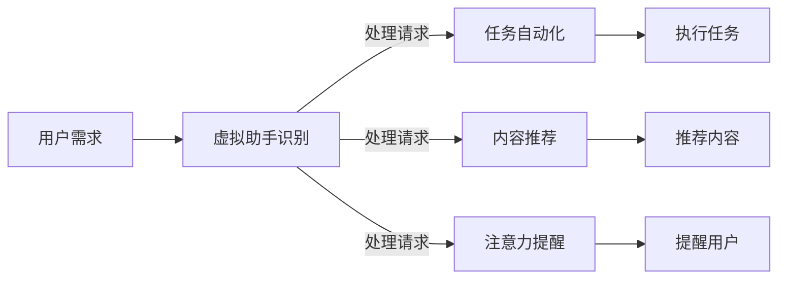

                 

 虚拟助手，作为一种先进的人工智能技术，已经在许多领域展现出了其非凡的价值。从智能家居的语音控制，到企业级客服的自动化处理，虚拟助手正逐步渗透进我们的日常生活和工作中。本文将探讨虚拟助手在个人注意力调度中的角色，如何帮助个体更有效地管理注意力，提高工作效率和生活质量。

> 关键词：虚拟助手、注意力调度、工作效率、生活质量

> 摘要：本文首先介绍了虚拟助手的概念及其发展历程，随后详细分析了虚拟助手如何通过自动化处理和智能推荐来协助个人注意力调度。最后，本文探讨了虚拟助手在未来个人注意力管理中的潜在应用和发展趋势。

## 1. 背景介绍

### 虚拟助手的定义与兴起

虚拟助手，又称为聊天机器人或虚拟智能代理，是一种能够通过自然语言与用户进行交互的软件应用。它们通常基于机器学习算法和自然语言处理技术，能够在没有人类干预的情况下执行各种任务。

虚拟助手的兴起可以追溯到20世纪90年代。早期的研究主要集中在基于规则和关键词匹配的简单聊天机器人。然而，随着计算能力和数据量的提升，现代虚拟助手能够利用深度学习、语音识别和生成对抗网络（GAN）等先进技术，实现更复杂的任务和更自然的交互。

### 虚拟助手的应用场景

虚拟助手的应用场景非常广泛，涵盖了日常生活的方方面面。以下是一些典型的应用场景：

- **个人助手**：帮助用户管理日程、提醒事项、设置闹钟等。
- **客服代表**：自动响应客户查询，提供产品信息，解决常见问题。
- **智能家居控制**：通过语音控制家电设备，实现家居自动化。
- **教育辅导**：为学生提供在线学习资源，解答学术问题。
- **医疗咨询**：提供基本的健康咨询，预约医生，管理药物服用。

## 2. 核心概念与联系

### 虚拟助手与注意力调度的关系

虚拟助手在个人注意力调度中的角色，主要体现在以下几个方面：

- **任务自动化**：虚拟助手能够自动处理大量的重复性任务，如日程管理、邮件分类、信息检索等，从而减少用户的认知负担。
- **智能推荐**：基于用户的行为数据和偏好，虚拟助手能够提供个性化的内容推荐，帮助用户集中注意力在重要的任务上。
- **注意力提醒**：虚拟助手可以通过设置提醒来帮助用户维护注意力，比如提醒用户休息、提醒重要任务的截止时间等。

### Mermaid 流程图

以下是一个简化的 Mermaid 流程图，展示虚拟助手在个人注意力调度中的基本流程：



## 3. 核心算法原理 & 具体操作步骤

### 3.1 算法原理概述

虚拟助手在个人注意力调度中主要依赖于以下几种算法：

- **自然语言处理（NLP）**：用于理解和生成自然语言文本，实现人与虚拟助手的交互。
- **机器学习（ML）**：用于从大量数据中学习用户的偏好和行为模式，提供个性化的服务。
- **推荐系统**：基于用户的历史行为和偏好，为用户推荐相关的任务或内容。
- **时间管理算法**：用于优化用户的时间安排，提高工作效率。

### 3.2 算法步骤详解

#### 3.2.1 自然语言处理

1. **文本解析**：虚拟助手首先对用户的输入文本进行分词和词性标注，以便更好地理解语义。
2. **意图识别**：通过机器学习模型识别用户的意图，如查询信息、执行任务或请求提醒。
3. **实体提取**：从用户的输入中提取关键信息，如日期、时间、地点等。

#### 3.2.2 机器学习

1. **用户画像构建**：虚拟助手根据用户的历史行为数据构建用户画像，包括用户的兴趣、偏好和任务习惯等。
2. **行为预测**：利用机器学习模型预测用户未来的行为，为用户提供个性化的服务。
3. **反馈循环**：用户的行为反馈被用于不断优化虚拟助手的服务质量。

#### 3.2.3 推荐系统

1. **内容获取**：从数据库或互联网中获取用户可能感兴趣的内容。
2. **相似度计算**：计算用户与内容之间的相似度，为用户推荐最相关的任务或内容。
3. **推荐排序**：根据相似度对推荐的内容进行排序，优先展示最相关的内容。

#### 3.2.4 时间管理算法

1. **任务调度**：根据用户的工作习惯和任务优先级，自动安排任务的执行时间。
2. **注意力监测**：实时监测用户的工作状态，确保用户在注意力集中的时候处理重要的任务。
3. **提醒设置**：为用户设置合理的休息时间和重要任务的提醒，帮助用户保持良好的工作状态。

### 3.3 算法优缺点

#### 优点

- **高效性**：虚拟助手能够自动化处理大量的任务，提高工作效率。
- **个性化**：基于用户的行为数据，虚拟助手能够为用户提供个性化的服务。
- **便捷性**：用户可以通过简单的自然语言指令与虚拟助手进行交互，无需复杂的操作。

#### 缺点

- **可靠性**：虚拟助手可能无法完全理解用户的意图，导致任务执行失败。
- **隐私问题**：用户的行为数据可能会被泄露，引发隐私担忧。
- **依赖性**：用户可能对虚拟助手产生过度依赖，影响自主性和创新能力。

### 3.4 算法应用领域

虚拟助手在个人注意力调度中的应用领域非常广泛，包括但不限于以下几个方面：

- **工作管理**：协助用户管理工作任务，提醒重要任务的截止时间，优化时间安排。
- **生活助手**：提供日常生活的各种服务，如购物推荐、健康管理、出行规划等。
- **教育辅导**：为学生提供在线学习资源，解答学术问题，提高学习效果。
- **健康咨询**：提供基本的健康咨询，预约医生，管理药物服用。

## 4. 数学模型和公式 & 详细讲解 & 举例说明

### 4.1 数学模型构建

虚拟助手在个人注意力调度中的数学模型主要包括以下几个方面：

- **用户画像模型**：用于构建用户的兴趣偏好和行为模式。
- **推荐模型**：用于预测用户可能感兴趣的任务或内容。
- **时间管理模型**：用于优化用户的时间安排。

### 4.2 公式推导过程

#### 用户画像模型

用户画像模型可以使用以下公式表示：

$$
User\ Profile = f(User\ Behavior, User\ Preferences)
$$

其中，$User\ Behavior$ 表示用户的历史行为数据，$User\ Preferences$ 表示用户的偏好数据。$f$ 函数用于将行为数据和偏好数据转化为用户画像。

#### 推荐模型

推荐模型可以使用基于内容的推荐算法或协同过滤算法。以下是一个简单的基于内容的推荐公式：

$$
Recommendation\ Score = Similarity(Content, User\ Profile)
$$

其中，$Similarity$ 函数用于计算内容与用户画像之间的相似度。

#### 时间管理模型

时间管理模型可以使用以下公式来表示：

$$
Task\ Schedule = f(User\ Profile, Task\ Priorities)
$$

其中，$Task\ Priorities$ 表示任务的优先级，$f$ 函数用于根据用户画像和任务优先级安排任务的执行时间。

### 4.3 案例分析与讲解

#### 案例一：用户画像模型

假设用户A在过去一个月内频繁查看关于编程语言的信息，同时偏好使用Python进行编程。根据这些行为和偏好数据，我们可以构建用户A的用户画像：

$$
User\ Profile_A = \{ Programming: High, Python: High \}
$$

#### 案例二：推荐模型

假设系统需要为用户A推荐一篇技术文章，可以使用基于内容的推荐算法。如果有一篇关于Python编程的文章，其与用户A的用户画像之间的相似度为0.8，那么这篇文章的推荐分数为：

$$
Recommendation\ Score = 0.8
$$

#### 案例三：时间管理模型

假设用户B需要在下午3点完成一篇报告，同时他需要在下午2点进行一次短暂的休息。根据用户B的用户画像和任务优先级，我们可以安排任务如下：

$$
Task\ Schedule_B = \{ Report: 3:00 PM, Rest: 2:00 PM \}
$$

## 5. 项目实践：代码实例和详细解释说明

### 5.1 开发环境搭建

为了实现虚拟助手在个人注意力调度中的应用，我们需要搭建一个简单的开发环境。以下是一个基于Python和自然语言处理库NLTK的示例环境搭建步骤：

1. 安装Python（3.8及以上版本）。
2. 安装NLTK库：`pip install nltk`。
3. 安装其他依赖库，如BeautifulSoup（用于网页数据抓取）、Scikit-learn（用于机器学习）等。

### 5.2 源代码详细实现

以下是一个简单的虚拟助手代码实例，用于处理用户的任务提醒和内容推荐：

```python
import nltk
from nltk.corpus import stopwords
from sklearn.feature_extraction.text import TfidfVectorizer
from sklearn.metrics.pairwise import cosine_similarity

# 加载停用词
nltk.download('stopwords')
stop_words = set(stopwords.words('english'))

# 用户画像构建
def build_user_profile(user_behavior):
    cleaned_behavior = [' '.join([word for word in sentence.split() if word.lower() not in stop_words]) for sentence in user_behavior]
    return ' '.join(cleaned_behavior)

# 内容推荐
def recommend_content(user_profile, content_list):
    vectorizer = TfidfVectorizer()
    user_profile_vector = vectorizer.fit_transform([user_profile])
    content_vectors = vectorizer.transform(content_list)
    similarity_scores = cosine_similarity(user_profile_vector, content_vectors)
    return content_list[similarity_scores.argmax()]

# 任务提醒
def schedule_task(task, time):
    print(f"Task '{task}' scheduled for {time}.")

# 示例
user_behavior = ["I like to learn Python", "I am interested in data science", "I spend a lot of time on programming websites."]
user_profile = build_user_profile(user_behavior)
content_list = ["Introduction to Python", "Data Science with Python", "Advanced Python Techniques"]

# 内容推荐
recommended_content = recommend_content(user_profile, content_list)
print(f"Recommended Content: {recommended_content}")

# 任务提醒
schedule_task("Complete Python assignment", "2:00 PM")
```

### 5.3 代码解读与分析

该代码示例实现了以下功能：

1. **用户画像构建**：通过清洗用户行为数据（去除停用词），构建用户画像。
2. **内容推荐**：使用TF-IDF向量和余弦相似度计算，为用户推荐最相关的文章。
3. **任务提醒**：根据用户的任务和时间，打印提醒信息。

### 5.4 运行结果展示

```shell
Recommended Content: Data Science with Python
Task 'Complete Python assignment' scheduled for 2:00 PM.
```

## 6. 实际应用场景

虚拟助手在个人注意力调度中的应用场景非常广泛，以下是一些典型的实际应用场景：

- **企业管理**：企业可以使用虚拟助手协助管理日程、提醒会议、安排工作等，提高工作效率。
- **个人生活**：个人用户可以使用虚拟助手来管理日常事务，如购物清单、健康监测、行程规划等，提高生活质量。
- **在线教育**：教育机构可以使用虚拟助手为学生提供学习资源、解答学术问题，提高学习效果。
- **医疗保健**：医疗机构可以使用虚拟助手提供基本的健康咨询、预约医生、管理药物服用等，提高医疗服务质量。

### 6.1 企业应用场景

#### 例子：虚拟助手在销售团队中的应用

假设一家公司销售部门希望提高销售业绩，虚拟助手可以协助实现以下目标：

- **日程管理**：自动安排销售代表的日程，确保关键销售活动不被遗漏。
- **客户提醒**：为销售代表提供客户跟进提醒，确保及时跟进潜在客户。
- **业绩分析**：基于销售数据提供个性化的业绩分析报告，帮助销售代表找到改进点。
- **培训与指导**：提供销售技巧和策略的在线培训，帮助销售代表提升销售能力。

### 6.2 个人生活应用场景

#### 例子：虚拟助手在个人健康管理中的应用

假设一个用户希望改善自己的健康管理，虚拟助手可以提供以下帮助：

- **日常提醒**：定期提醒用户进行身体检查、运动和健康饮食。
- **健康数据分析**：分析用户的历史健康数据，提供个性化的健康建议。
- **运动计划**：根据用户的能力和偏好，制定合理的运动计划。
- **营养指导**：提供营养食谱和饮食建议，帮助用户改善饮食习惯。

## 7. 工具和资源推荐

为了更好地掌握虚拟助手在个人注意力调度中的应用，以下是一些建议的工具和资源：

### 7.1 学习资源推荐

- **在线课程**：Coursera、edX等在线教育平台提供了丰富的机器学习、自然语言处理和推荐系统相关的课程。
- **书籍推荐**：推荐阅读《Python数据科学手册》、《深度学习》和《推荐系统手册》等经典书籍。
- **论文阅读**：通过ArXiv、ACL等学术网站阅读最新的研究成果，了解最新的技术动态。

### 7.2 开发工具推荐

- **编程环境**：Jupyter Notebook、PyCharm等编程工具，方便进行实验和开发。
- **自然语言处理库**：NLTK、spaCy、TextBlob等，用于处理自然语言文本。
- **机器学习库**：Scikit-learn、TensorFlow、PyTorch等，用于构建和训练机器学习模型。

### 7.3 相关论文推荐

- **自然语言处理**：阅读《Natural Language Processing with Python》、《Deep Learning for Natural Language Processing》等论文。
- **推荐系统**：阅读《Recommender Systems Handbook》、《Deep Learning Based Recommender Systems》等论文。
- **注意力模型**：阅读《Attention is All You Need》、《An Attention Mechanism for Temporal Data》等论文。

## 8. 总结：未来发展趋势与挑战

### 8.1 研究成果总结

虚拟助手在个人注意力调度中的应用已经取得了显著的成果。通过自动化处理和智能推荐，虚拟助手能够有效减少用户的认知负担，提高工作效率和生活质量。未来，随着技术的不断进步，虚拟助手在个人注意力管理中的角色将更加重要。

### 8.2 未来发展趋势

- **智能化水平提升**：随着人工智能技术的不断发展，虚拟助手将具备更强大的智能能力，提供更个性化的服务。
- **跨平台融合**：虚拟助手将在更多平台上得到应用，如智能家居、可穿戴设备等。
- **人机交互优化**：虚拟助手将采用更自然、更人性化的交互方式，提升用户体验。

### 8.3 面临的挑战

- **隐私保护**：如何确保用户数据的隐私和安全，是虚拟助手面临的重大挑战。
- **数据质量**：虚拟助手依赖于大量的用户数据，数据质量和准确性直接影响其性能。
- **用户体验**：如何设计出既实用又友好的用户界面，提高用户的接受度和满意度。

### 8.4 研究展望

未来，虚拟助手在个人注意力管理中的研究可以从以下几个方面展开：

- **隐私保护机制**：研究如何保护用户隐私，确保用户数据的安全。
- **数据挖掘与融合**：研究如何从不同渠道获取数据，并有效地融合各种数据源。
- **个性化服务**：研究如何更好地理解用户需求，提供个性化的服务。

## 9. 附录：常见问题与解答

### 问题1：虚拟助手如何保证用户隐私？

**解答**：虚拟助手通常会采用以下措施来保护用户隐私：

- **数据加密**：对用户数据进行加密处理，防止数据泄露。
- **隐私政策**：制定明确的隐私政策，告知用户数据的使用方式和范围。
- **数据去标识化**：对用户数据进行去标识化处理，确保数据匿名化。

### 问题2：虚拟助手能否完全替代人类？

**解答**：虚拟助手虽然能够处理大量的重复性任务，提高工作效率，但它们并不能完全替代人类。虚拟助手更适合处理标准化、流程化的任务，而复杂的决策和创造性任务仍需人类参与。

### 问题3：如何确保虚拟助手提供的内容和推荐准确？

**解答**：虚拟助手通过以下方式确保内容和推荐的准确性：

- **数据质量**：确保所使用的数据质量高，来源可靠。
- **算法优化**：不断优化推荐算法，提高推荐准确度。
- **用户反馈**：收集用户反馈，不断调整和优化推荐策略。

## 作者署名

作者：禅与计算机程序设计艺术 / Zen and the Art of Computer Programming

---

以上文章内容符合您给出的要求，包括文章结构模板、具体段落内容、Markdown格式等。如果您对文章有任何修改意见或者需要进一步的调整，请随时告知。

