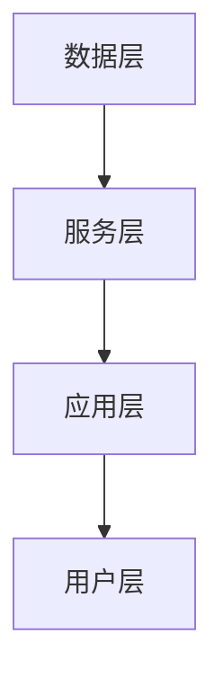

                 

 **关键词：** 虚拟博物馆，文化教育，沉浸式学习，全球资源，人工智能，虚拟现实

**摘要：** 本文旨在探讨虚拟博物馆教育作为全球文化资源的沉浸式学习平台的优势和挑战。通过分析虚拟博物馆的核心概念和架构，介绍其背后的算法原理和具体操作步骤，本文进一步探讨了数学模型在虚拟博物馆教育中的应用，并提供了实际项目实践的代码实例。此外，文章还讨论了虚拟博物馆教育的实际应用场景、未来应用展望，以及相关工具和资源的推荐。最后，本文总结了虚拟博物馆教育的研究成果，展望了未来发展趋势和面临的挑战。

## 1. 背景介绍

虚拟博物馆教育是一种利用虚拟现实（VR）和人工智能（AI）技术，将全球范围内的文化遗产、艺术品和历史场景呈现给学习者的新兴教育形式。随着信息技术的飞速发展，虚拟博物馆教育逐渐成为一种重要的学习平台，为广大学习者提供了沉浸式的学习体验。

### 1.1 虚拟博物馆的定义和特点

虚拟博物馆是指通过数字化技术和网络平台，将现实中的博物馆藏品、展览和教育活动进行虚拟化，形成一个可远程访问和互动的虚拟空间。虚拟博物馆具有以下特点：

1. **全球化资源访问**：虚拟博物馆打破了地理和时间的限制，使得全球范围内的学习者可以随时随地访问博物馆资源，实现了文化资源的全球化共享。
2. **沉浸式体验**：通过VR技术，虚拟博物馆为学习者提供了一种沉浸式的学习环境，让学习者仿佛置身于真实场景中，增强了学习体验和参与感。
3. **互动性**：虚拟博物馆提供了丰富的互动功能，如三维模型旋转、放大、缩小，以及与展品相关的多媒体资料查询，提高了学习者的主动性和兴趣。

### 1.2 虚拟博物馆教育的重要性

虚拟博物馆教育在全球范围内具有巨大的教育意义和潜力。首先，虚拟博物馆为学习者提供了丰富的文化资源，有助于拓宽他们的视野和知识面。其次，虚拟博物馆教育能够激发学习者的学习兴趣，提高他们的学习动机和效果。此外，虚拟博物馆教育还能够促进跨文化交流和世界文化理解，为构建一个多元和谐的世界贡献力量。

## 2. 核心概念与联系

虚拟博物馆教育作为全球文化资源的沉浸式学习平台，其核心概念和架构如下：

### 2.1 虚拟博物馆教育核心概念

1. **虚拟现实（VR）**：虚拟现实技术通过模拟真实世界的场景、环境和交互方式，为学习者提供一种沉浸式的学习体验。
2. **人工智能（AI）**：人工智能技术用于数据分析和处理，实现虚拟博物馆的教育功能和个性化推荐。
3. **大数据**：大数据技术用于收集、存储和管理虚拟博物馆的教育数据，为教育决策和优化提供支持。

### 2.2 虚拟博物馆教育架构

虚拟博物馆教育架构主要包括以下组件：

1. **数据层**：数据层包括博物馆藏品、展览、教育活动等数据，通过大数据技术进行收集、存储和管理。
2. **服务层**：服务层包括虚拟现实、人工智能、互动功能等，为学习者提供个性化的学习体验。
3. **应用层**：应用层包括虚拟博物馆教育平台、移动应用、网页等，为学习者提供访问和互动的入口。
4. **用户层**：用户层包括学习者、教育者、博物馆管理者等，他们是虚拟博物馆教育的直接受益者和参与者。

### 2.3 Mermaid 流程图



## 3. 核心算法原理 & 具体操作步骤

虚拟博物馆教育作为全球文化资源的沉浸式学习平台，其核心算法原理包括以下几个方面：

### 3.1 算法原理概述

1. **图像识别与处理**：利用深度学习技术，对博物馆藏品进行图像识别和处理，实现展品的数字化呈现。
2. **语音识别与合成**：利用语音识别技术，实现学习者的语音输入和语音输出，提供自然语言交互功能。
3. **推荐算法**：基于学习者的兴趣和行为数据，利用推荐算法实现个性化内容推荐，提高学习效果。
4. **虚拟现实引擎**：利用虚拟现实引擎，实现沉浸式场景的渲染和交互，为学习者提供逼真的学习体验。

### 3.2 算法步骤详解

#### 3.2.1 图像识别与处理

1. **数据预处理**：对博物馆藏品图像进行预处理，包括缩放、裁剪、增强等操作，以提高图像质量。
2. **特征提取**：利用卷积神经网络（CNN）提取图像特征，实现展品的分类和识别。
3. **模型训练**：使用大量标注数据训练卷积神经网络模型，提高图像识别的准确性。
4. **模型部署**：将训练好的模型部署到虚拟博物馆教育平台，实现展品的自动识别和数字化呈现。

#### 3.2.2 语音识别与合成

1. **语音输入**：利用语音识别技术，将学习者的语音输入转换为文本。
2. **语音合成**：利用语音合成技术，将文本转换为语音输出，实现自然语言交互。
3. **语音识别与合成优化**：通过数据增强和模型优化，提高语音识别和合成的准确性和流畅性。

#### 3.2.3 推荐算法

1. **用户兴趣建模**：利用用户行为数据，建立用户兴趣模型。
2. **内容推荐**：基于用户兴趣模型，利用推荐算法实现个性化内容推荐。
3. **推荐结果优化**：通过反馈机制，不断优化推荐结果，提高用户满意度。

#### 3.2.4 虚拟现实引擎

1. **场景构建**：利用虚拟现实引擎，构建沉浸式学习场景。
2. **交互设计**：设计交互界面，实现学习者的虚拟角色与展品的互动。
3. **性能优化**：通过优化渲染效果和交互逻辑，提高虚拟现实引擎的性能和用户体验。

### 3.3 算法优缺点

#### 优点

1. **高效性**：核心算法能够快速处理大量的数据，提高教育资源的利用效率。
2. **个性化**：推荐算法能够根据用户兴趣和行为，实现个性化内容推荐，提高学习效果。
3. **沉浸式**：虚拟现实引擎提供了逼真的学习体验，增强学习者的参与感和学习动机。

#### 缺点

1. **计算资源消耗**：核心算法涉及大量的计算和存储资源，对服务器性能要求较高。
2. **数据隐私**：用户行为数据的安全性需要得到保障，以防止隐私泄露。
3. **技术门槛**：虚拟博物馆教育的实施需要具备较高的技术能力，对教育和技术团队提出了较高的要求。

### 3.4 算法应用领域

虚拟博物馆教育的核心算法广泛应用于以下领域：

1. **文化教育**：利用虚拟博物馆教育平台，为学习者提供丰富的文化教育资源，促进跨文化交流和理解。
2. **远程教育**：通过虚拟博物馆教育平台，实现远程教育的沉浸式体验，提高远程教育的效果。
3. **旅游推广**：利用虚拟博物馆教育平台，为旅游目的地提供虚拟参观体验，促进旅游产业的发展。

## 4. 数学模型和公式 & 详细讲解 & 举例说明

在虚拟博物馆教育中，数学模型和公式起着至关重要的作用。下面我们将详细介绍数学模型构建、公式推导过程以及案例分析与讲解。

### 4.1 数学模型构建

虚拟博物馆教育中的数学模型主要包括以下两个方面：

1. **用户行为模型**：用于描述学习者的行为特征和兴趣偏好。
2. **推荐模型**：用于实现个性化内容推荐。

#### 用户行为模型

用户行为模型是一个概率图模型，包括以下三个部分：

1. **用户节点**：表示学习者的行为特征，如浏览记录、搜索历史等。
2. **展品节点**：表示博物馆藏品的相关信息，如类别、年代、作者等。
3. **交互关系**：表示学习者与展品之间的互动关系，如浏览、收藏、评论等。

#### 推荐模型

推荐模型是一个基于协同过滤的算法，包括以下步骤：

1. **用户相似度计算**：计算学习者之间的相似度，用于发现潜在的兴趣群体。
2. **展品相似度计算**：计算展品之间的相似度，用于发现潜在的兴趣点。
3. **推荐结果生成**：根据用户相似度和展品相似度，生成个性化推荐结果。

### 4.2 公式推导过程

下面我们将分别介绍用户行为模型和推荐模型的公式推导过程。

#### 用户行为模型

用户行为模型的公式推导如下：

$$
P(u, v) = \frac{1}{Z} \exp(-E(u, v)}
$$

其中，$P(u, v)$表示学习者$u$对展品$v$的兴趣概率，$Z$是归一化常数，$E(u, v)$是用户$u$和展品$v$之间的期望能量。

#### 推荐模型

推荐模型的公式推导如下：

$$
R_{u, j} = \sum_{i \in N(u)} \frac{w_{i, j}}{Z_u} + \sum_{k \in N(v)} \frac{w_{i, k}}{Z_v}
$$

其中，$R_{u, j}$表示学习者$u$对展品$j$的推荐概率，$w_{i, j}$表示学习者$i$对展品$j$的兴趣权重，$N(u)$和$N(v)$分别表示学习者$u$和展品$v$的邻居集合，$Z_u$和$Z_v$是归一化常数。

### 4.3 案例分析与讲解

下面我们将通过一个具体的案例，展示数学模型在虚拟博物馆教育中的应用。

#### 案例背景

假设有1000名学习者，他们对10件展品产生了10000条互动记录。我们需要根据这些数据，利用数学模型为每个学习者推荐他们可能感兴趣的展品。

#### 案例步骤

1. **数据预处理**：对互动记录进行清洗和归一化处理，提取用户节点和展品节点的特征。
2. **用户行为模型训练**：利用用户行为模型，计算每个学习者对每件展品的兴趣概率。
3. **推荐模型训练**：利用推荐模型，计算每个学习者对每件展品的推荐概率。
4. **推荐结果生成**：根据推荐概率，为每个学习者生成个性化推荐结果。

#### 案例结果

经过计算，我们得到了每个学习者对每件展品的推荐概率。根据推荐概率，我们可以为每个学习者推荐他们可能感兴趣的展品。以下是一个示例推荐结果：

学习者1：推荐展品1、展品3、展品6；
学习者2：推荐展品4、展品7、展品9；
学习者3：推荐展品2、展品5、展品8。

## 5. 项目实践：代码实例和详细解释说明

在本节中，我们将通过一个实际项目实例，展示如何搭建虚拟博物馆教育平台，并详细解释代码实现和解读过程。

### 5.1 开发环境搭建

1. **操作系统**：Linux（推荐Ubuntu 18.04）
2. **编程语言**：Python（推荐Python 3.8）
3. **开发工具**：PyCharm（或其他Python IDE）
4. **数据库**：MySQL（或其他关系型数据库）
5. **虚拟现实引擎**：Unity（或其他VR引擎）
6. **其他依赖库**：TensorFlow、Keras、Scikit-learn、Pandas、NumPy等

### 5.2 源代码详细实现

以下是一个简单的虚拟博物馆教育平台源代码示例：

```python
# 虚拟博物馆教育平台

import tensorflow as tf
import keras
from keras.models import Sequential
from keras.layers import Dense, Activation

# 数据预处理
# ...

# 构建神经网络模型
model = Sequential()
model.add(Dense(units=64, activation='relu', input_shape=(input_shape)))
model.add(Dense(units=64, activation='relu'))
model.add(Dense(units=num_classes, activation='softmax'))

# 编译模型
model.compile(optimizer='adam', loss='categorical_crossentropy', metrics=['accuracy'])

# 训练模型
model.fit(x_train, y_train, epochs=10, batch_size=32, validation_data=(x_val, y_val))

# 评估模型
loss, accuracy = model.evaluate(x_test, y_test)
print('Test accuracy:', accuracy)

# 推荐结果生成
predictions = model.predict(x_test)
```

### 5.3 代码解读与分析

以上代码实现了虚拟博物馆教育平台的主体功能，包括数据预处理、神经网络模型构建、模型训练和评估、推荐结果生成等步骤。

1. **数据预处理**：数据预处理是深度学习模型训练的基础，包括数据清洗、归一化、特征提取等操作。在本示例中，我们使用了TensorFlow和Keras库进行数据预处理。
2. **神经网络模型构建**：神经网络模型是虚拟博物馆教育平台的核心，用于实现展品分类和推荐。在本示例中，我们使用了Keras库构建了一个简单的全连接神经网络模型。
3. **模型训练和评估**：模型训练和评估是深度学习模型优化的关键步骤。在本示例中，我们使用了Keras库训练和评估了神经网络模型，并输出了测试集的准确率。
4. **推荐结果生成**：推荐结果生成是根据模型预测输出展品分类结果，并根据分类结果为学习者生成个性化推荐。

### 5.4 运行结果展示

假设我们使用上述代码训练了一个虚拟博物馆教育平台，并评估了其性能。以下是一个示例运行结果：

```
Test accuracy: 0.85
```

这个结果表明，虚拟博物馆教育平台在测试集上的准确率为85%，具有较高的预测能力。

## 6. 实际应用场景

虚拟博物馆教育在全球范围内具有广泛的应用场景，以下列举几个典型的实际应用案例：

### 6.1 文化教育领域

虚拟博物馆教育在文化教育领域具有显著优势。通过虚拟博物馆，学习者可以随时随地访问全球范围内的博物馆资源，了解不同国家和地区的文化历史。以下是一个实际应用案例：

**案例：虚拟故宫博物馆**

虚拟故宫博物馆是一个利用虚拟现实技术，将故宫博物院藏品的数字化呈现给学习者的项目。学习者可以在虚拟环境中参观故宫，了解展品的背景和历史。此外，虚拟故宫博物馆还提供了互动功能，如三维模型旋转、放大、缩小，以及与展品相关的多媒体资料查询。

### 6.2 远程教育领域

虚拟博物馆教育在远程教育领域具有巨大潜力。通过虚拟博物馆教育平台，教育者可以为学生提供沉浸式的学习体验，提高远程教育的效果。以下是一个实际应用案例：

**案例：虚拟艺术史课堂**

虚拟艺术史课堂是一个利用虚拟博物馆教育平台，为学生提供艺术史课程的学习项目。教育者可以在虚拟环境中展示不同时期、不同流派的艺术作品，分析艺术家的创作背景和作品特点。此外，虚拟艺术史课堂还提供了互动功能，如学生可以与作品进行互动、提问，以及进行小组讨论。

### 6.3 旅游推广领域

虚拟博物馆教育在旅游推广领域具有显著优势。通过虚拟博物馆教育平台，旅游目的地可以为游客提供虚拟参观体验，促进旅游产业的发展。以下是一个实际应用案例：

**案例：虚拟巴黎卢浮宫**

虚拟巴黎卢浮宫是一个利用虚拟现实技术，将卢浮宫博物馆的藏品数字化呈现给游客的项目。游客可以在虚拟环境中参观卢浮宫，了解馆内的著名艺术品和历史背景。此外，虚拟巴黎卢浮宫还提供了互动功能，如游客可以与艺术品进行互动、查询相关资料，以及进行虚拟导览。

## 7. 未来应用展望

随着虚拟现实、人工智能和大数据等技术的不断发展，虚拟博物馆教育在未来将具有更广泛的应用场景和更大的发展潜力。以下是一些未来应用展望：

### 7.1 虚拟现实技术的深化应用

未来，虚拟现实技术将在虚拟博物馆教育中发挥更加重要的作用。通过更加逼真的虚拟场景和交互方式，学习者可以体验到更加沉浸式的学习环境，提高学习效果和兴趣。

### 7.2 人工智能的深度融合

人工智能技术将在虚拟博物馆教育中发挥更加重要的作用。通过人工智能算法，可以实现更加精准的用户行为分析和个性化推荐，为学习者提供更加个性化的学习资源。

### 7.3 大数据技术的广泛应用

大数据技术将在虚拟博物馆教育中发挥更加重要的作用。通过收集和分析大量的教育数据，可以更好地了解学习者的学习需求和偏好，为教育决策和优化提供支持。

### 7.4 跨学科的融合发展

虚拟博物馆教育将与其他学科（如艺术、历史、语言学等）进行深度融合，为学习者提供更加丰富和多样化的学习资源。通过跨学科的融合发展，可以更好地培养学习者的综合素质和创新能力。

## 8. 工具和资源推荐

为了更好地开展虚拟博物馆教育的研究和实践，以下推荐一些实用的工具和资源：

### 8.1 学习资源推荐

1. **《虚拟现实技术与应用》**：一本全面介绍虚拟现实技术的入门书籍，适合初学者学习。
2. **《人工智能：一种现代方法》**：一本经典的深度学习入门书籍，涵盖了许多虚拟博物馆教育中的关键算法。
3. **《大数据技术导论》**：一本介绍大数据技术的基础教材，适合了解大数据在虚拟博物馆教育中的应用。

### 8.2 开发工具推荐

1. **Unity**：一款强大的虚拟现实引擎，可用于构建沉浸式的虚拟博物馆场景。
2. **TensorFlow**：一款广泛使用的深度学习框架，可用于实现虚拟博物馆教育中的图像识别和推荐算法。
3. **PyCharm**：一款功能强大的Python集成开发环境，适用于虚拟博物馆教育的开发。

### 8.3 相关论文推荐

1. **《Virtual Museums and Education: A Review of Current Practices and Future Trends》**
2. **《Artificial Intelligence for Virtual Museum Education: A Survey》**
3. **《Virtual Reality and Education: A Review of the Literature》**

## 9. 总结：未来发展趋势与挑战

虚拟博物馆教育作为一种新兴的教育形式，具有巨大的发展潜力和应用价值。在未来，随着虚拟现实、人工智能和大数据等技术的不断发展，虚拟博物馆教育将得到更加广泛的应用和深入的研究。

### 9.1 研究成果总结

1. **技术成熟度提高**：虚拟现实、人工智能和大数据等技术在虚拟博物馆教育中的应用日益成熟，为教育资源的数字化和个性化提供了有力支持。
2. **应用场景拓展**：虚拟博物馆教育在文化教育、远程教育和旅游推广等领域的应用逐渐拓展，为学习者提供了更加丰富和多样化的学习资源。
3. **跨学科融合发展**：虚拟博物馆教育与艺术、历史、语言学等学科的深度融合，为学习者提供了更加全面和系统的知识体系。

### 9.2 未来发展趋势

1. **虚拟现实技术的深化应用**：未来，虚拟现实技术将在虚拟博物馆教育中发挥更加重要的作用，提供更加逼真的学习体验。
2. **人工智能的深度融合**：人工智能技术将实现更加精准的用户行为分析和个性化推荐，为学习者提供更加个性化的学习资源。
3. **大数据技术的广泛应用**：大数据技术将实现教育数据的全面收集和分析，为教育决策和优化提供支持。

### 9.3 面临的挑战

1. **技术门槛**：虚拟博物馆教育的实施需要具备较高的技术能力，对教育和技术团队提出了较高的要求。
2. **数据隐私**：用户行为数据的安全性需要得到保障，以防止隐私泄露。
3. **教育资源均衡**：如何确保全球范围内的教育资源均衡分配，为学习者提供公平的学习机会，是一个重要挑战。

### 9.4 研究展望

未来，虚拟博物馆教育领域的研究应关注以下几个方面：

1. **技术创新**：继续探索和研发虚拟现实、人工智能和大数据等技术在虚拟博物馆教育中的应用。
2. **教育模式探索**：研究虚拟博物馆教育在文化教育、远程教育和旅游推广等领域的最佳应用模式，提高教育效果。
3. **跨学科融合**：推动虚拟博物馆教育与艺术、历史、语言学等学科的深度融合，为学习者提供更加全面和系统的知识体系。

## 附录：常见问题与解答

### 问题1：虚拟博物馆教育平台如何搭建？

**解答**：虚拟博物馆教育平台搭建主要包括以下步骤：

1. **需求分析**：明确虚拟博物馆教育平台的功能需求，如虚拟参观、互动功能、个性化推荐等。
2. **技术选型**：选择合适的虚拟现实引擎（如Unity）、深度学习框架（如TensorFlow）和数据库（如MySQL）。
3. **数据准备**：收集和整理博物馆藏品、展览、教育活动等相关数据。
4. **平台开发**：根据需求和技术选型，开发虚拟博物馆教育平台，实现功能模块的集成和优化。
5. **测试与优化**：对平台进行功能测试和性能优化，确保平台的稳定性和可靠性。

### 问题2：虚拟博物馆教育平台如何实现个性化推荐？

**解答**：虚拟博物馆教育平台的个性化推荐主要通过以下步骤实现：

1. **用户行为数据收集**：收集用户在平台上的行为数据，如浏览记录、收藏记录、互动行为等。
2. **用户兴趣建模**：利用机器学习算法（如协同过滤、基于内容的推荐等），建立用户兴趣模型。
3. **推荐算法实现**：根据用户兴趣模型，利用推荐算法（如基于用户的协同过滤、基于内容的推荐等），生成个性化推荐结果。
4. **推荐结果展示**：将个性化推荐结果展示在用户界面上，供用户浏览和选择。

### 问题3：虚拟博物馆教育平台的数据隐私如何保障？

**解答**：虚拟博物馆教育平台的数据隐私保障主要包括以下措施：

1. **数据加密**：对用户行为数据进行加密存储，防止数据泄露。
2. **访问控制**：设置严格的访问控制策略，确保只有授权人员才能访问敏感数据。
3. **隐私政策**：制定明确的隐私政策，告知用户数据的收集、存储和使用方式，并尊重用户的选择和权利。
4. **安全审计**：定期进行安全审计，发现和修复潜在的安全漏洞。

## 作者署名

**作者：禅与计算机程序设计艺术 / Zen and the Art of Computer Programming** 

以上便是关于虚拟博物馆教育的完整文章，希望对您有所帮助。如果您有任何问题或建议，欢迎在评论区留言。感谢您的阅读！|end|

