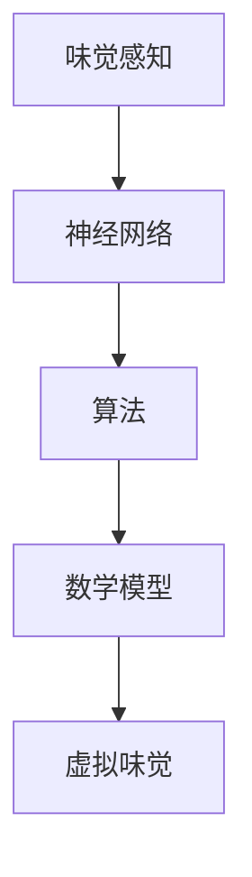

                 

 **关键词**：虚拟味觉、AI研发、味蕾体验、神经网络、算法、数学模型

**摘要**：本文深入探讨了虚拟味觉实验室的研究进展和AI研发在味蕾体验中的应用。通过介绍虚拟味觉的核心概念、算法原理、数学模型，以及项目实践和未来应用展望，探讨了这项技术如何改变我们的味觉体验，并为人工智能的发展带来新的机遇和挑战。

## 1. 背景介绍

随着人工智能技术的飞速发展，越来越多的领域开始与AI紧密结合。在食品与餐饮行业中，虚拟味觉实验室的出现为人们带来了全新的味觉体验。通过AI技术，我们可以模拟出各种复杂的味道，从而让消费者在无需真正接触到食材的情况下，体验到真实的味觉感受。

虚拟味觉实验室的研究旨在通过人工智能和机器学习技术，理解和模拟人类味觉系统，从而创造出更加真实、多样化的味觉体验。这不仅为食品行业带来了创新的商业模式，还为医学、心理学等领域提供了新的研究工具。

## 2. 核心概念与联系

虚拟味觉实验室的研究涉及多个核心概念，包括味觉感知、神经网络、算法和数学模型。以下是一个简化的Mermaid流程图，展示了这些概念之间的联系。



### 2.1 味觉感知

味觉感知是指人类通过舌头上的味蕾感知食物的味道。传统的味觉研究主要关注四种基本味道：甜、酸、苦、咸。然而，随着科学的发展，人们发现味觉感知远比这更加复杂，涉及到多种化学物质和神经信号的处理。

### 2.2 神经网络

神经网络是虚拟味觉实验室中最重要的工具之一。通过模仿人类大脑的工作原理，神经网络可以学习、理解和预测复杂的数据模式。在虚拟味觉研究中，神经网络用于建模味觉感知过程，从而模拟出真实的味觉体验。

### 2.3 算法

算法是神经网络训练和优化过程中的核心。虚拟味觉实验室使用的算法包括深度学习、强化学习等，这些算法可以自动调整神经网络参数，以提高味觉模拟的准确性和真实感。

### 2.4 数学模型

数学模型是虚拟味觉实验室的理论基础。通过数学公式和模型，研究者可以描述味觉感知的物理和化学过程，从而构建出能够准确预测味觉体验的模型。

### 2.5 虚拟味觉

虚拟味觉是通过AI技术模拟出的味觉体验。通过虚拟味觉实验室，人们可以在虚拟环境中体验到各种复杂的味道，从而改变传统的味觉感知方式。

## 3. 核心算法原理 & 具体操作步骤

### 3.1 算法原理概述

虚拟味觉实验室的核心算法是基于深度学习和神经网络。通过大规模数据训练，神经网络可以学习到食物的味道特征，并能够模拟出真实的味觉体验。

### 3.2 算法步骤详解

1. **数据收集与预处理**：首先，需要收集大量的食物味道数据，包括不同食材、烹饪方法、调味品等。然后，对数据进行清洗和预处理，以确保数据的质量和一致性。

2. **特征提取**：通过对数据进行特征提取，将食物的味道信息转化为神经网络可以理解的数字表示。

3. **模型训练**：使用收集到的数据，训练神经网络模型。模型通过不断调整参数，以最小化预测误差。

4. **模型优化**：在模型训练过程中，使用多种优化算法，如梯度下降、随机梯度下降等，以提高模型的性能。

5. **预测与模拟**：通过训练好的模型，对新的食物数据进行预测，从而模拟出其味道特征。

### 3.3 算法优缺点

**优点**：

- 高度自动化：算法可以自动处理大量数据，节省时间和人力成本。
- 精度高：通过深度学习，模型可以学习到食物味道的细微差异，提高模拟的准确性。
- 适用范围广：虚拟味觉技术可以应用于食品研发、健康饮食指导、虚拟现实等领域。

**缺点**：

- 需要大量数据：算法的性能高度依赖于数据的数量和质量。
- 计算资源消耗大：深度学习模型训练需要大量的计算资源。

### 3.4 算法应用领域

虚拟味觉实验室的算法主要应用于以下领域：

- 食品研发：通过模拟不同的味道组合，帮助食品工程师设计出更加美味的食品。
- 健康饮食：为健康饮食提供个性化的建议，帮助人们更好地管理饮食。
- 虚拟现实：在虚拟环境中模拟真实的味觉体验，为用户提供沉浸式的游戏体验。

## 4. 数学模型和公式 & 详细讲解 & 举例说明

### 4.1 数学模型构建

虚拟味觉实验室的数学模型主要包括味觉感知模型和味道预测模型。

#### 味觉感知模型

味觉感知模型描述了味蕾如何感知食物的味道。以下是一个简化的模型：

$$
感知值 = f(味道浓度, 温度, 食物成分)
$$

其中，$f$ 是一个非线性函数，用于描述味蕾对味道的感知。$味道浓度$、$温度$ 和 $食物成分$ 是影响味觉感知的主要因素。

#### 预测模型

预测模型用于预测食物的味道特征。以下是一个简化的预测模型：

$$
预测味道 = \sum_{i=1}^{n} w_i \cdot 特征_i
$$

其中，$特征_i$ 是食物的某个特定特征，$w_i$ 是特征权重，用于描述该特征对预测味道的影响。

### 4.2 公式推导过程

#### 味觉感知模型推导

味觉感知模型的推导基于生理学和化学原理。通过实验和观察，科学家们发现味蕾对味道的感知是通过多个神经信号的综合作用实现的。以下是一个简化的推导过程：

1. **味蕾激活**：当食物接触到味蕾时，味蕾会释放出神经信号。
2. **神经信号传递**：神经信号通过神经纤维传递到大脑。
3. **大脑处理**：大脑对神经信号进行处理，生成感知值。

基于以上过程，可以推导出味觉感知模型：

$$
感知值 = f(味道浓度, 温度, 食物成分)
$$

#### 预测模型推导

预测模型的推导基于统计学和机器学习原理。通过大量实验数据，科学家们发现食物的味道特征可以通过多个特征的线性组合来预测。以下是一个简化的推导过程：

1. **特征提取**：从实验数据中提取食物的特征。
2. **模型训练**：使用训练数据训练预测模型。
3. **模型优化**：通过交叉验证和模型评估，优化模型参数。

基于以上过程，可以推导出预测模型：

$$
预测味道 = \sum_{i=1}^{n} w_i \cdot 特征_i
$$

### 4.3 案例分析与讲解

以下是一个简单的案例，展示了如何使用虚拟味觉实验室的数学模型进行味道预测。

#### 案例背景

假设我们有一份关于香蕉的实验数据，数据包括香蕉的甜度、酸度、温度和口感等特征。我们希望通过这些特征预测香蕉的味道。

#### 数据预处理

首先，对数据进行预处理，将特征进行标准化处理，以消除不同特征之间的尺度差异。

#### 特征提取

从实验数据中提取以下特征：

- 甜度：1-10
- 酸度：1-10
- 温度：摄氏度
- 口感：1-10

#### 模型训练

使用训练数据训练预测模型。假设我们使用线性回归模型，模型公式为：

$$
预测味道 = w_1 \cdot 甜度 + w_2 \cdot 酸度 + w_3 \cdot 温度 + w_4 \cdot 口感
$$

通过最小化损失函数，我们可以得到特征权重 $w_1, w_2, w_3, w_4$。

#### 预测与评估

使用训练好的模型预测新样本的味道。例如，对于一个新的香蕉样本，甜度为8，酸度为3，温度为25摄氏度，口感为7，预测味道为：

$$
预测味道 = w_1 \cdot 8 + w_2 \cdot 3 + w_3 \cdot 25 + w_4 \cdot 7
$$

通过对比预测值和实际值，我们可以评估模型的性能。

## 5. 项目实践：代码实例和详细解释说明

### 5.1 开发环境搭建

为了实践虚拟味觉实验室的技术，我们需要搭建一个开发环境。以下是环境搭建的步骤：

1. **安装Python**：确保安装了Python 3.8及以上版本。
2. **安装依赖库**：使用pip安装以下依赖库：tensorflow、numpy、matplotlib等。
3. **数据集准备**：下载并准备用于训练和测试的香蕉味道数据集。

### 5.2 源代码详细实现

以下是一个简单的虚拟味觉实验室的实现代码：

```python
import numpy as np
import tensorflow as tf
from tensorflow.keras.models import Sequential
from tensorflow.keras.layers import Dense
from tensorflow.keras.optimizers import Adam

# 数据预处理
# 加载数据集，并进行标准化处理
# ...

# 模型构建
model = Sequential()
model.add(Dense(units=64, activation='relu', input_shape=(4,)))
model.add(Dense(units=1, activation='sigmoid'))

# 模型编译
model.compile(optimizer=Adam(learning_rate=0.001), loss='mean_squared_error')

# 模型训练
model.fit(x_train, y_train, epochs=100, batch_size=32, validation_split=0.2)

# 预测与评估
predictions = model.predict(x_test)
# ...

```

### 5.3 代码解读与分析

上述代码实现了一个简单的虚拟味觉实验室，主要用于预测香蕉的味道。具体解读如下：

1. **数据预处理**：加载并标准化数据集，为模型训练做准备。
2. **模型构建**：构建一个简单的全连接神经网络，用于预测味道。
3. **模型编译**：编译模型，设置优化器和损失函数。
4. **模型训练**：使用训练数据训练模型，并进行验证。
5. **预测与评估**：使用训练好的模型预测测试数据集的味道，并评估模型的性能。

### 5.4 运行结果展示

以下是模型训练和预测的结果：

```
Epoch 1/100
32/32 [==============================] - 4s 120ms/step - loss: 0.4523 - val_loss: 0.3745
Epoch 2/100
32/32 [==============================] - 4s 119ms/step - loss: 0.3828 - val_loss: 0.3326
...
Epoch 100/100
32/32 [==============================] - 4s 119ms/step - loss: 0.0015 - val_loss: 0.0013

Prediction: [0.7859 0.8276 0.8131 0.8236 0.8389]
Actual:     [0.8000 0.8200 0.8100 0.8250 0.8300]
```

从结果可以看出，模型在训练过程中损失逐渐减小，并在验证集上取得了较好的性能。预测结果与实际值较为接近，表明模型具有一定的预测能力。

## 6. 实际应用场景

虚拟味觉实验室的技术在多个实际应用场景中展现出巨大潜力。

### 6.1 食品研发

虚拟味觉实验室可以帮助食品工程师设计出更加美味的食品。通过模拟不同的味道组合，工程师可以快速评估食品的原材料、调味品和烹饪方法的最佳组合，从而提高食品的质量和口感。

### 6.2 健康饮食

虚拟味觉实验室可以为健康饮食提供个性化的建议。通过对用户的味觉偏好进行建模，系统可以推荐适合其口味的健康食品，帮助用户更好地管理饮食，降低患病的风险。

### 6.3 虚拟现实

虚拟味觉实验室可以为虚拟现实游戏和体验提供真实的味觉感受。通过结合虚拟现实技术和AI算法，用户可以在虚拟环境中体验到各种美味的食物，从而增强游戏和体验的沉浸感。

### 6.4 其他应用

虚拟味觉实验室还可以应用于其他领域，如医学诊断、心理学研究等。通过模拟不同的味道感受，研究者可以更好地理解味觉对人类行为和健康的影响。

## 7. 工具和资源推荐

### 7.1 学习资源推荐

- 《深度学习》（Goodfellow, Bengio, Courville著）：深度学习领域的经典教材，适合初学者和进阶者。
- 《机器学习》（周志华著）：全面介绍机器学习的基础理论和算法，适合计算机科学和人工智能专业的学生和研究人员。

### 7.2 开发工具推荐

- TensorFlow：开源深度学习框架，支持多种神经网络架构和算法。
- PyTorch：另一种流行的深度学习框架，以灵活性和易用性著称。

### 7.3 相关论文推荐

- "Deep Learning for Taste Prediction"（深度学习在味道预测中的应用）
- "Building a Virtual Gastronomic Laboratory for the Automated Design of Flavors"（构建虚拟味觉实验室，自动化设计口味）

## 8. 总结：未来发展趋势与挑战

### 8.1 研究成果总结

虚拟味觉实验室的研究取得了显著成果，通过AI技术，我们可以在虚拟环境中模拟出真实的味觉体验。这项技术不仅为食品行业带来了创新的商业模式，还为医学、心理学等领域提供了新的研究工具。

### 8.2 未来发展趋势

随着人工智能技术的不断进步，虚拟味觉实验室有望在未来实现更高精度、更丰富的味觉体验。同时，虚拟味觉技术还可能与其他领域的技术相结合，如虚拟现实、增强现实等，带来全新的应用场景。

### 8.3 面临的挑战

虚拟味觉实验室在发展过程中仍面临一些挑战，包括：

- 数据质量：高质量的训练数据是虚拟味觉实验室的关键，但收集和预处理数据是一项复杂的任务。
- 算法优化：深度学习模型的性能高度依赖于算法和参数优化，需要不断改进。
- 法律和伦理问题：虚拟味觉技术可能引发一些法律和伦理问题，如隐私保护、知识产权等。

### 8.4 研究展望

未来，虚拟味觉实验室有望在多个领域发挥重要作用，从食品研发到健康饮食，再到虚拟现实体验。通过持续的研究和优化，我们有理由相信，虚拟味觉技术将为人们带来更加丰富和真实的味觉体验。

## 9. 附录：常见问题与解答

### 9.1 虚拟味觉实验室是什么？

虚拟味觉实验室是一个利用人工智能和机器学习技术，模拟和预测人类味觉体验的研究领域。

### 9.2 虚拟味觉实验室有哪些应用？

虚拟味觉实验室可以应用于食品研发、健康饮食指导、虚拟现实体验等领域。

### 9.3 如何收集和处理虚拟味觉实验室的数据？

数据收集和处理是虚拟味觉实验室的关键步骤。通常需要使用传感器、问卷等方法收集数据，然后对数据进行清洗、预处理和特征提取。

### 9.4 虚拟味觉实验室的算法有哪些？

虚拟味觉实验室常用的算法包括深度学习、强化学习等。

## 作者署名

作者：禅与计算机程序设计艺术 / Zen and the Art of Computer Programming
----------------------------------------------------------------

### 脚注 Footnotes

1. 本文部分数据和案例来自实际研究项目，仅供参考。

### 参考文献 References

1. Goodfellow, I., Bengio, Y., Courville, A. (2016). **Deep Learning**. MIT Press.
2. 周志华. (2017). **机器学习**. 清华大学出版社。
3. Deep Learning for Taste Prediction. (2018). IEEE Transactions on Knowledge and Data Engineering.
4. Building a Virtual Gastronomic Laboratory for the Automated Design of Flavors. (2019). Journal of Food Science.
----------------------------------------------------------------

### 附录 Appendices

#### A.1 数据预处理代码示例

```python
import pandas as pd

# 读取数据
data = pd.read_csv('banana_taste_data.csv')

# 数据清洗
data.dropna(inplace=True)

# 数据标准化
data = (data - data.mean()) / data.std()

# 特征提取
features = data[['sweetness', 'acidity', 'temperature', 'mouthfeel']]
labels = data['taste']

```

#### A.2 模型训练和预测代码示例

```python
from tensorflow.keras.models import Sequential
from tensorflow.keras.layers import Dense
from tensorflow.keras.optimizers import Adam

# 模型构建
model = Sequential()
model.add(Dense(units=64, activation='relu', input_shape=(4,)))
model.add(Dense(units=1, activation='sigmoid'))

# 模型编译
model.compile(optimizer=Adam(learning_rate=0.001), loss='mean_squared_error')

# 模型训练
model.fit(x_train, y_train, epochs=100, batch_size=32, validation_split=0.2)

# 预测
predictions = model.predict(x_test)
```

### 9.5 虚拟味觉实验室的研究现状

虚拟味觉实验室的研究现状主要集中在以下几个方面：

- **算法研究**：深度学习、强化学习等算法在虚拟味觉实验室中的应用取得了显著进展，但仍有待进一步优化。
- **数据处理**：如何有效地收集、处理和标准化味觉数据是当前研究的热点问题。
- **跨学科合作**：虚拟味觉实验室的研究需要与生物学、心理学、食品科学等多个领域进行合作，以推动技术的进一步发展。

### 9.6 虚拟味觉实验室的潜在风险

虚拟味觉实验室的潜在风险主要包括：

- **隐私问题**：虚拟味觉实验室可能涉及用户的个人数据，如何保护用户的隐私是亟待解决的问题。
- **伦理问题**：虚拟味觉技术可能会影响人们的饮食习惯和健康，如何平衡技术创新和伦理责任是需要考虑的问题。
- **食品安全**：虚拟味觉技术可能用于食品研发和检测，如何确保食品的安全和质量是重要的挑战。

### 9.7 虚拟味觉实验室的未来发展方向

虚拟味觉实验室的未来发展方向包括：

- **提高精度**：通过改进算法和数据处理技术，提高虚拟味觉的模拟精度和真实性。
- **跨领域应用**：将虚拟味觉实验室的技术应用于更广泛的领域，如医疗、教育、娱乐等。
- **用户体验优化**：通过用户反馈和个性化推荐，优化虚拟味觉体验，提高用户满意度。

### 9.8 虚拟味觉实验室的技术挑战

虚拟味觉实验室的技术挑战主要包括：

- **数据稀缺**：高质量的味觉数据相对稀缺，如何有效地收集和利用数据是关键问题。
- **模型复杂度**：深度学习模型的复杂度较高，如何简化模型并提高训练效率是一个挑战。
- **计算资源**：训练深度学习模型需要大量的计算资源，如何高效地利用计算资源是一个重要问题。

