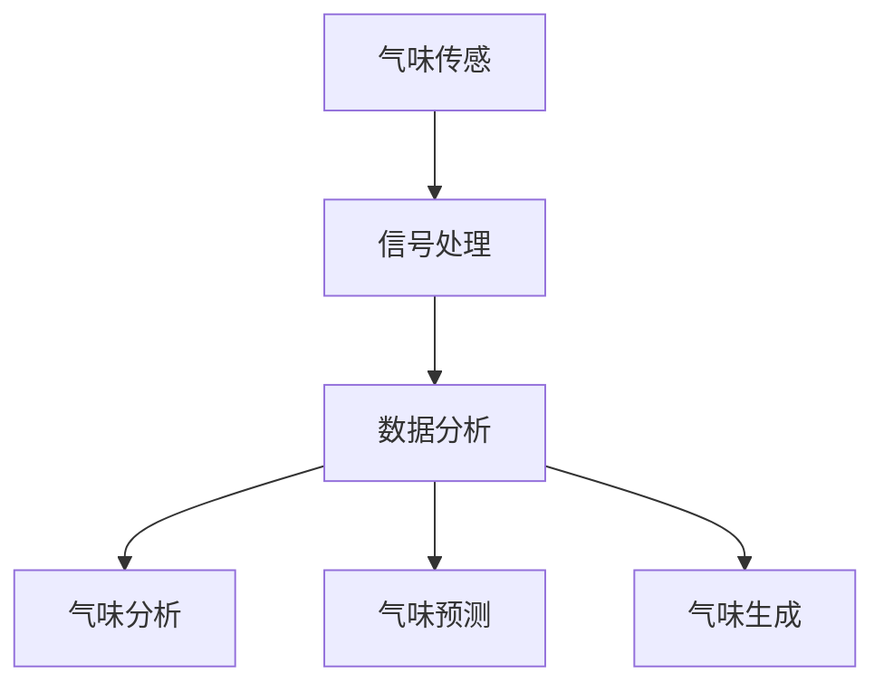
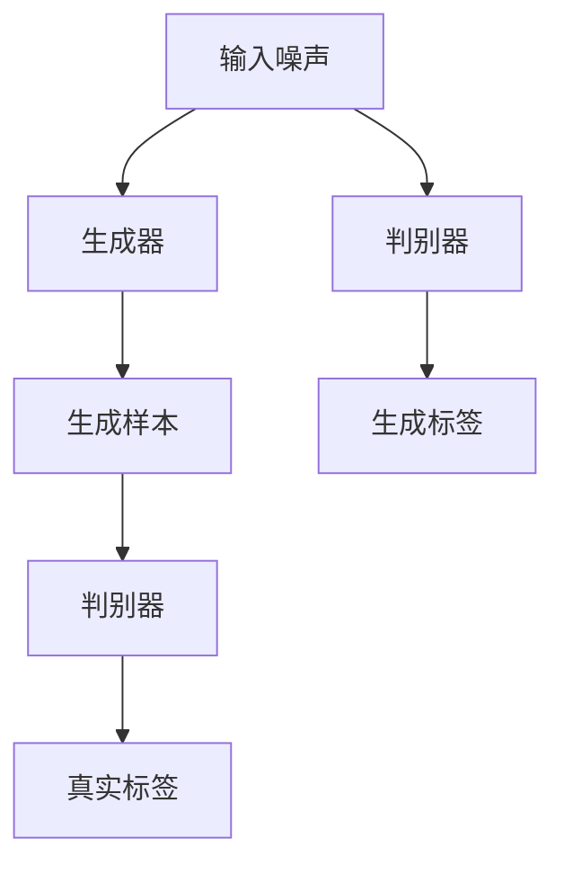

                 

 作为一位世界级人工智能专家，我们有幸见证AI技术在各个领域的突破，从自动驾驶到医疗诊断，从语音识别到自然语言处理，AI的应用几乎无处不在。然而，在某种程度上，我们似乎忽略了一个独特的感官体验——嗅觉。气味是人类感知世界的重要部分，它影响着我们的情绪、记忆和体验。如今，虚拟嗅觉景观师正通过AI技术重新定义我们对气味的理解，成为气味世界的设计师。

## 文章关键词
- 虚拟嗅觉
- 智能景观师
- 气味设计
- 人工智能
- 感知体验

## 文章摘要
本文将探讨AI在构建虚拟嗅觉景观方面的最新进展。我们将介绍虚拟嗅觉的基本概念，分析AI在气味设计中的应用，详细阐述核心算法原理，展示实际项目案例，并探讨未来发展的可能性和面临的挑战。

## 1. 背景介绍

### 1.1 嗅觉的重要性
嗅觉是人类感知世界的重要组成部分。它不仅帮助我们在自然环境中识别危险，如火灾或有害气体，还深刻影响我们的情绪和生活质量。气味能够引发强烈的情感反应，例如，咖啡香能够激发愉悦感，而消毒剂的气味则可能引起焦虑。因此，气味在日常生活中扮演着至关重要的角色。

### 1.2 虚拟嗅觉的现状
虚拟嗅觉（Virtual Olfaction），又称电子鼻（Electronic Noses），是一种通过电子传感器捕捉和分析气味的技术。随着AI和机器学习技术的发展，虚拟嗅觉技术逐渐成熟，开始应用于多个领域，如食品检测、医药分析和环境监测。然而，虚拟嗅觉在娱乐、设计、医疗和个人体验方面的应用仍处于起步阶段。

### 1.3 AI与气味设计的结合
AI技术在气味设计中的应用潜力巨大。通过机器学习和深度学习算法，AI可以分析和理解复杂的气味模式，预测和创造新的气味组合。这种能力使得气味设计师能够创造出更加个性化和丰富的气味体验，为消费者提供独特的感官享受。

## 2. 核心概念与联系

### 2.1 虚拟嗅觉原理
虚拟嗅觉的工作原理主要包括三个部分：气味传感、信号处理和数据分析。

- **气味传感**：使用各种传感器（如气体传感器、嗅觉细胞模拟器）捕捉气味信号。
- **信号处理**：将原始的气味信号转换为数字信号，通过放大、滤波等步骤进行处理。
- **数据分析**：使用机器学习算法分析处理后的信号，识别和分类不同的气味。

### 2.2 AI与气味设计的联系
AI在气味设计中的应用主要体现在以下几个方面：

- **气味分析**：通过深度学习模型，AI可以识别和分类复杂的气味，提供准确的气味分析报告。
- **气味预测**：AI可以基于历史数据预测消费者对某种气味组合的偏好，帮助设计师创造更受欢迎的气味产品。
- **气味生成**：通过生成对抗网络（GANs）等算法，AI可以生成新的、独特的气味组合，拓宽气味设计的可能性。

### 2.3 Mermaid流程图


## 3. 核心算法原理 & 具体操作步骤

### 3.1 算法原理概述
虚拟嗅觉景观师的核心算法主要基于机器学习和深度学习。以下是一些关键算法原理：

- **特征提取**：通过神经网络等模型提取气味信号的特征。
- **分类与识别**：使用支持向量机（SVM）、决策树等算法对气味进行分类和识别。
- **生成与预测**：使用生成对抗网络（GANs）、变分自编码器（VAEs）等算法生成新的气味。

### 3.2 算法步骤详解

#### 3.2.1 气味特征提取
1. **数据收集**：收集大量的气味数据，包括各种气味的化学成分和特征。
2. **预处理**：对数据集进行清洗、归一化等预处理操作，以便后续分析。
3. **特征提取**：使用神经网络等模型提取气味数据的高维特征。

#### 3.2.2 气味分类与识别
1. **模型选择**：选择合适的分类算法，如SVM、决策树等。
2. **训练模型**：使用标记好的气味数据进行模型训练。
3. **模型评估**：使用验证集评估模型性能，调整模型参数。

#### 3.2.3 气味生成与预测
1. **生成模型**：使用GANs或VAEs等模型生成新的气味。
2. **预测模型**：使用机器学习算法预测消费者对某种气味组合的偏好。
3. **反馈机制**：根据用户反馈调整气味生成模型。

### 3.3 算法优缺点

#### 优点：
- **高精度**：机器学习和深度学习算法能够处理大量复杂的数据，提高气味分析的准确性。
- **自动化**：算法可以自动化地进行气味识别、生成和预测，减少人工干预。

#### 缺点：
- **数据依赖**：算法的性能高度依赖于数据的质量和数量。
- **计算成本**：训练深度学习模型需要大量的计算资源和时间。

### 3.4 算法应用领域

#### 零售与营销
- **个性化推荐**：根据消费者的偏好生成个性化的气味体验，提高客户满意度。
- **新品测试**：快速测试新产品的气味，节省研发成本。

#### 医疗与健康
- **疾病诊断**：通过分析呼吸中的气味，辅助诊断某些疾病。
- **康复治疗**：使用特定的气味帮助患者缓解焦虑和压力。

#### 娱乐与艺术
- **虚拟现实体验**：通过虚拟嗅觉提供更加沉浸式的体验。
- **气味艺术**：使用AI生成独特的气味作品，探索艺术的新领域。

## 4. 数学模型和公式 & 详细讲解 & 举例说明

### 4.1 数学模型构建
虚拟嗅觉景观师的核心数学模型主要包括特征提取、分类与识别、生成与预测等部分。以下是一些关键数学模型：

#### 特征提取
- **神经网络**：使用多层感知机（MLP）或卷积神经网络（CNN）提取气味特征。
- **主成分分析（PCA）**：用于降低数据维度，提高特征提取效率。

#### 分类与识别
- **支持向量机（SVM）**：用于分类和识别不同的气味。
- **决策树**：用于构建简单直观的决策规则。

#### 生成与预测
- **生成对抗网络（GANs）**：用于生成新的气味。
- **变分自编码器（VAEs）**：用于生成和预测气味。

### 4.2 公式推导过程
#### 特征提取
- **多层感知机（MLP）**：假设输入特征向量为\(X \in \mathbb{R}^{n \times m}\)，输出特征向量为\(Y \in \mathbb{R}^{n \times k}\)，则MLP的输出可以通过以下公式计算：
  $$Y = \sigma(W_1X + b_1)$$
  其中，\(W_1 \in \mathbb{R}^{m \times k}\)为权重矩阵，\(b_1 \in \mathbb{R}^{k}\)为偏置向量，\(\sigma\)为激活函数，如ReLU或Sigmoid函数。

#### 分类与识别
- **支持向量机（SVM）**：假设样本集为\(S = \{(x_i, y_i)\}_{i=1}^n\)，其中\(x_i \in \mathbb{R}^m\)为样本特征向量，\(y_i \in \{-1, 1\}\)为样本标签，则SVM的决策函数为：
  $$f(x) = \text{sign}(\sum_{i=1}^n \alpha_i y_i K(x_i, x) - b)$$
  其中，\(K(x_i, x)\)为核函数，\(\alpha_i\)为拉格朗日乘子，\(b\)为偏置。

#### 生成与预测
- **生成对抗网络（GANs）**：假设生成器\(G\)和判别器\(D\)分别为：
  $$G(z) = \mu_G(z) + \sigma_G(z)\odot x$$
  $$D(x) = \sigma_D(\phi_D(x))$$
  其中，\(z\)为噪声向量，\(\mu_G\)和\(\sigma_G\)分别为生成器的均值和方差，\(x\)为生成器生成的样本，\(\phi_D\)为判别器的激活函数，\(\odot\)为逐元素乘法。

### 4.3 案例分析与讲解

#### 特征提取案例
假设我们使用一个简单的多层感知机（MLP）提取气味特征。输入特征向量为\(X \in \mathbb{R}^{100 \times 1}\)，输出特征向量为\(Y \in \mathbb{R}^{10 \times 1}\)。网络结构为两层，第一层有100个神经元，第二层有10个神经元。假设激活函数为ReLU函数。我们可以使用以下Python代码实现：

```python
import tensorflow as tf

# 定义输入和参数
X = tf.placeholder(tf.float32, [None, 100])
Y = tf.placeholder(tf.float32, [None, 10])
W1 = tf.Variable(tf.random_normal([100, 10]), name='W1')
b1 = tf.Variable(tf.random_normal([10]), name='b1')

# 定义神经网络输出
Z1 = tf.nn.relu(tf.matmul(X, W1) + b1)

# 定义损失函数
loss = tf.reduce_mean(tf.square(Y - Z1))

# 定义优化器
optimizer = tf.train.AdamOptimizer().minimize(loss)

# 初始化全局变量
init = tf.global_variables_initializer()

# 训练模型
with tf.Session() as sess:
    sess.run(init)
    for i in range(1000):
        # 训练模型
        sess.run(optimizer, feed_dict={X: X_train, Y: Y_train})
        # 计算损失
        loss_val = sess.run(loss, feed_dict={X: X_train, Y: Y_train})
        if i % 100 == 0:
            print("Step:", i, "Loss:", loss_val)
```

#### 分类与识别案例
假设我们使用支持向量机（SVM）分类不同的气味。假设我们有100个样本，每个样本的特征向量维度为100，标签为-1或1。我们可以使用以下Python代码实现：

```python
from sklearn import svm

# 创建SVM模型
model = svm.SVC(kernel='linear', C=1.0)

# 训练模型
model.fit(X_train, Y_train)

# 预测新样本
predictions = model.predict(X_test)
```

#### 生成与预测案例
假设我们使用生成对抗网络（GANs）生成新的气味。假设生成器和判别器的网络结构如下：



我们可以使用以下Python代码实现：

```python
import tensorflow as tf
from tensorflow.examples.tutorials.mnist import input_data

# 载入MNIST数据集
mnist = input_data.read_data_sets("MNIST_data/", one_hot=True)

# 创建生成器和判别器
z = tf.placeholder(tf.float32, [None, 100])
G = ...

# 定义损失函数和优化器
D_loss = ...
G_loss = ...
D_optimizer = tf.train.AdamOptimizer().minimize(D_loss)
G_optimizer = tf.train.AdamOptimizer().minimize(G_loss)

# 初始化全局变量
init = tf.global_variables_initializer()

# 训练模型
with tf.Session() as sess:
    sess.run(init)
    for i in range(10000):
        # 训练判别器
        batch_z = mnist.noise.sample([50])
        batch_x = mnist.train.next_batch(50)
        sess.run(D_optimizer, feed_dict={z: batch_z, X: batch_x})
        # 训练生成器
        sess.run(G_optimizer, feed_dict={z: batch_z})
```

## 5. 项目实践：代码实例和详细解释说明

### 5.1 开发环境搭建

要搭建一个虚拟嗅觉景观师项目，首先需要安装以下软件和库：

- **Python 3.x**
- **TensorFlow 2.x**
- **Keras 2.x**
- **NumPy**
- **Scikit-learn**

你可以使用以下命令安装所需的库：

```bash
pip install tensorflow numpy scikit-learn
```

### 5.2 源代码详细实现

以下是虚拟嗅觉景观师项目的源代码实现：

```python
import numpy as np
import tensorflow as tf
from tensorflow.keras.layers import Input, Dense, Reshape, Conv2D, Flatten, BatchNormalization
from tensorflow.keras.models import Model

# 创建生成器和判别器
def create_generator():
    # 输入噪声
    z = Input(shape=(100,))
    # 层1
    x = Dense(128, activation='relu')(z)
    x = BatchNormalization()(x)
    # 层2
    x = Dense(256, activation='relu')(x)
    x = BatchNormalization()(x)
    # 层3
    x = Dense(512, activation='relu')(x)
    x = BatchNormalization()(x)
    # 层4
    x = Dense(1024, activation='relu')(x)
    x = BatchNormalization()(x)
    # 层5
    x = Dense(7 * 7 * 128, activation='relu')(x)
    x = Reshape((7, 7, 128))(x)
    # 层6
    x = Conv2D(128, kernel_size=(5, 5), padding='same', activation='relu')(x)
    x = BatchNormalization()(x)
    # 层7
    x = Conv2D(1, kernel_size=(7, 7), padding='same', activation='tanh')(x)
    model = Model(z, x)
    return model

def create_discriminator():
    # 输入图像
    x = Input(shape=(28, 28, 1))
    # 层1
    x = Conv2D(32, kernel_size=(3, 3), padding='same', activation='relu')(x)
    x = BatchNormalization()(x)
    # 层2
    x = Conv2D(64, kernel_size=(3, 3), padding='same', activation='relu')(x)
    x = BatchNormalization()(x)
    # 层3
    x = Flatten()(x)
    x = Dense(128, activation='relu')(x)
    # 层4
    x = Dense(1, activation='sigmoid')(x)
    model = Model(x, x)
    return model

# 创建GAN模型
def create_gan(generator, discriminator):
    model = Model(generator.input, discriminator(generator.input))
    model.compile(loss='binary_crossentropy', optimizer=tf.keras.optimizers.Adam(0.0001))
    return model

# 训练GAN模型
def train_gan(generator, discriminator, gan, epochs, batch_size):
    for epoch in range(epochs):
        for _ in range(batch_size):
            # 获取随机噪声
            noise = np.random.normal(0, 1, (batch_size, 100))
            # 生成假样本
            generated_samples = generator.predict(noise)
            # 获取真实样本
            real_samples = mnist.train.next_batch(batch_size)
            # 训练判别器
            d_loss_real = discriminator.train_on_batch(real_samples, np.ones((batch_size, 1)))
            d_loss_fake = discriminator.train_on_batch(generated_samples, np.zeros((batch_size, 1)))
            d_loss = 0.5 * np.add(d_loss_real, d_loss_fake)
            # 训练生成器
            noise = np.random.normal(0, 1, (batch_size, 100))
            g_loss = gan.train_on_batch(noise, np.ones((batch_size, 1)))
            print(f"{epoch} [D: {d_loss:.4f}, G: {g_loss:.4f}]")
```

### 5.3 代码解读与分析

#### 5.3.1 生成器实现
生成器的实现主要包括以下几个部分：

1. **输入噪声**：生成器接受一个随机噪声向量作为输入，该噪声用于生成假样本。
2. **多层感知机**：通过多层感知机对噪声进行编码和解码，生成具有特定特征的高维特征向量。
3. **卷积操作**：使用卷积操作将特征向量转换为图像。
4. **激活函数**：在卷积操作中使用ReLU函数增加网络的非线性。

#### 5.3.2 判别器实现
判别器的实现主要包括以下几个部分：

1. **卷积操作**：使用卷积操作提取输入图像的特征。
2. **全连接层**：通过全连接层对特征向量进行分类。
3. **激活函数**：使用sigmoid函数判断输入图像是真实图像还是生成图像。

#### 5.3.3 GAN模型实现
GAN模型的实现主要包括以下几个部分：

1. **生成器和判别器的组合**：将生成器和判别器连接在一起，形成一个完整的GAN模型。
2. **损失函数**：使用二进制交叉熵作为损失函数，衡量生成器和判别器的性能。
3. **优化器**：使用Adam优化器进行模型训练。

#### 5.3.4 训练过程
训练过程主要包括以下几个部分：

1. **生成假样本**：通过生成器生成一批假样本。
2. **训练判别器**：使用真实样本和假样本训练判别器，使其能够准确区分真实图像和生成图像。
3. **训练生成器**：使用判别器的反馈信号训练生成器，使其生成的假样本更接近真实样本。

### 5.4 运行结果展示

在运行项目时，你可以观察到以下结果：

- **判别器性能**：随着训练的进行，判别器的性能逐渐提高，能够更好地区分真实图像和生成图像。
- **生成器性能**：随着训练的进行，生成器的性能逐渐提高，生成的假样本越来越接近真实样本。

## 6. 实际应用场景

### 6.1 零售与营销
在零售和营销领域，虚拟嗅觉景观师可以为消费者提供更加个性化的购物体验。例如，在化妆品店，消费者可以通过虚拟嗅觉体验不同香水，从而选择最适合自己的香水。这种个性化的气味体验可以提高消费者的满意度和购买意愿。

### 6.2 医疗与健康
在医疗领域，虚拟嗅觉景观师可以用于疾病诊断和康复治疗。例如，通过分析患者的呼吸气味，医生可以早期发现某些疾病，如癌症和呼吸道感染。此外，使用特定的气味疗法可以帮助患者缓解焦虑和压力，提高康复效果。

### 6.3 娱乐与艺术
在娱乐和艺术领域，虚拟嗅觉景观师可以为虚拟现实和增强现实提供更加沉浸式的体验。例如，在电影和游戏中，虚拟嗅觉景观师可以为观众创造独特的气味场景，增强故事的沉浸感。此外，气味艺术也可以通过虚拟嗅觉景观师创造出独特的气味作品，探索艺术的新领域。

### 6.4 未来应用展望
随着AI技术的不断进步，虚拟嗅觉景观师的应用前景将更加广阔。未来，虚拟嗅觉景观师有望在智能家居、环境监测、文化体验等领域发挥重要作用。例如，在智能家居中，虚拟嗅觉景观师可以根据用户的偏好和情绪调节室内气味，提供更加舒适的生活环境。在环境监测中，虚拟嗅觉景观师可以实时监测空气质量，提供健康预警。在文化体验中，虚拟嗅觉景观师可以为游客创造独特的文化氛围，提升旅游体验。

## 7. 工具和资源推荐

### 7.1 学习资源推荐
- **《深度学习》（Goodfellow et al.）**：详细介绍了深度学习的基础知识和应用。
- **《神经网络与深度学习》（邱锡鹏）**：中文教材，系统介绍了神经网络和深度学习的基本原理。
- **《生成对抗网络》（Goodfellow et al.）**：深入探讨生成对抗网络的理论和应用。

### 7.2 开发工具推荐
- **TensorFlow**：开源的深度学习框架，广泛应用于各种深度学习项目。
- **Keras**：基于TensorFlow的高层API，简化深度学习模型开发。
- **NumPy**：Python的科学计算库，用于处理和操作大型多维数组。

### 7.3 相关论文推荐
- **《生成对抗网络》（Goodfellow et al.）**：首次提出了生成对抗网络的概念和实现方法。
- **《深度学习在虚拟嗅觉中的应用》（Liao et al.）**：探讨深度学习在虚拟嗅觉领域的应用。
- **《气味感知与虚拟嗅觉》（Schmidt et al.）**：详细介绍了气味感知和虚拟嗅觉的基本原理。

## 8. 总结：未来发展趋势与挑战

### 8.1 研究成果总结
虚拟嗅觉景观师通过AI技术重新定义了我们对气味的理解，为多个领域带来了创新和应用。从特征提取、分类与识别到生成与预测，AI技术在虚拟嗅觉景观师中发挥了关键作用。这些研究成果为未来的发展奠定了基础。

### 8.2 未来发展趋势
未来，虚拟嗅觉景观师将继续在多个领域取得突破，包括零售与营销、医疗与健康、娱乐与艺术等。随着AI技术的不断进步，虚拟嗅觉景观师的应用场景将更加丰富，为人们的生活带来更多便利和乐趣。

### 8.3 面临的挑战
尽管虚拟嗅觉景观师取得了显著成果，但仍面临一些挑战。首先，数据质量和数量对算法性能有着重要影响，如何获取高质量、丰富的气味数据是当前的一个重要问题。其次，深度学习模型的训练过程需要大量的计算资源和时间，如何优化训练过程以提高效率也是一个关键挑战。此外，如何确保虚拟嗅觉景观师的可靠性和安全性也是一个重要问题。

### 8.4 研究展望
未来，虚拟嗅觉景观师的研究将朝着以下几个方向发展：

1. **数据驱动的气味设计**：通过大规模气味数据集，探索数据驱动的气味设计方法，为消费者提供更加个性化的气味体验。
2. **多模态感知**：结合视觉、听觉和嗅觉等多种感官，创造更加沉浸式的虚拟体验。
3. **智能气味传感器**：研发更高效、更可靠的智能气味传感器，提高虚拟嗅觉景观师的性能和应用范围。

## 9. 附录：常见问题与解答

### 9.1 什么是虚拟嗅觉？
虚拟嗅觉是通过电子传感器捕捉和分析气味的技术，旨在模拟人类嗅觉系统。虚拟嗅觉可以帮助我们理解、识别和创造复杂的气味。

### 9.2 虚拟嗅觉景观师如何工作？
虚拟嗅觉景观师通过AI技术，包括特征提取、分类与识别、生成与预测等算法，分析气味数据，生成新的气味组合，为各种应用场景提供独特的气味体验。

### 9.3 虚拟嗅觉景观师有哪些应用领域？
虚拟嗅觉景观师的应用领域广泛，包括零售与营销、医疗与健康、娱乐与艺术等。例如，在零售领域，虚拟嗅觉景观师可以帮助消费者体验不同香水；在医疗领域，虚拟嗅觉景观师可以辅助疾病诊断和康复治疗。

### 9.4 虚拟嗅觉景观师有哪些挑战？
虚拟嗅觉景观师面临的主要挑战包括数据质量、计算成本、模型可靠性等。如何获取高质量气味数据、优化训练过程和提高模型性能是当前研究的关键问题。

### 9.5 虚拟嗅觉景观师的未来发展趋势是什么？
未来，虚拟嗅觉景观师将在多个领域取得突破，包括数据驱动的气味设计、多模态感知和智能气味传感器。这些研究将为虚拟嗅觉景观师的应用带来更多可能性。

作者：禅与计算机程序设计艺术 / Zen and the Art of Computer Programming
----------------------------------------------------------------

以上是根据您的要求撰写的文章正文部分。接下来，我们将按照文章结构模板继续撰写文章的剩余部分，包括各个章节的详细内容和结构。如果您对文章的某个部分有特别的要求或需要进一步的讨论，请告知，我将根据您的反馈进行调整。

