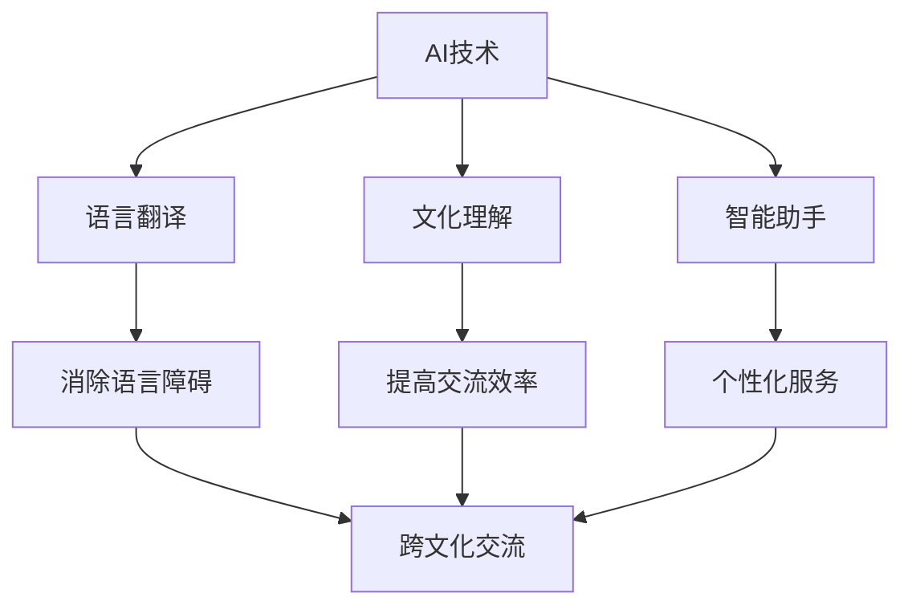

                 

关键词：AI、虚拟外交、跨文化交流、技术范式、算法原理、数学模型、项目实践、实际应用、未来展望

> 摘要：本文将探讨AI技术在虚拟外交和跨文化交流中的应用，分析AI时代的跨文化交流模式，提出基于AI的虚拟外交新范式，并探讨其发展趋势与挑战。

## 1. 背景介绍

在信息化和全球化日益深入的今天，国际交流和合作已经成为国家发展的重要驱动力。然而，传统的跨文化交流模式面临着诸多挑战，如语言障碍、文化差异、沟通成本高等。人工智能（AI）技术的发展为跨文化交流提供了新的可能性。虚拟外交作为一种新兴的外交模式，通过利用AI技术，可以实现无国界的交流与合作，为解决传统外交模式的局限性提供了一种新的思路。

本文旨在探讨AI时代的跨文化交流模式，提出虚拟外交新范式，并分析其应用前景与面临的挑战。文章结构如下：

1. 背景介绍
2. 核心概念与联系
3. 核心算法原理与具体操作步骤
4. 数学模型和公式
5. 项目实践：代码实例和详细解释说明
6. 实际应用场景
7. 工具和资源推荐
8. 总结：未来发展趋势与挑战
9. 附录：常见问题与解答

## 2. 核心概念与联系

在探讨虚拟外交和跨文化交流之前，我们首先需要了解一些核心概念。这些概念包括：

- **人工智能（AI）**：模拟人类智能行为的计算机系统，能够通过学习和适应来完成任务。
- **虚拟外交**：利用信息技术，尤其是AI技术，实现无国界的政治、经济、文化等方面的交流。
- **跨文化交流**：不同文化背景的人们之间的交流，包括语言、习俗、价值观等方面。

这些概念之间的联系在于，AI技术为虚拟外交和跨文化交流提供了基础支撑。通过AI，我们可以实现：

- **语言翻译**：利用机器翻译技术，消除语言障碍，促进跨文化交流。
- **文化理解**：通过数据挖掘和分析，了解不同文化的特点，提高跨文化交流的效率。
- **智能助手**：利用自然语言处理（NLP）技术，提供个性化服务，提高交流体验。

以下是基于AI的虚拟外交和跨文化交流的Mermaid流程图：



## 3. 核心算法原理与具体操作步骤

### 3.1 算法原理概述

在AI时代，虚拟外交和跨文化交流的核心算法主要包括：

- **机器翻译**：利用深度学习技术，将一种语言的文本翻译成另一种语言。
- **自然语言处理（NLP）**：对文本进行语义分析、情感分析等，理解语言中的深层含义。
- **数据挖掘**：从大量数据中提取有价值的信息，帮助了解不同文化的特点。

### 3.2 算法步骤详解

#### 3.2.1 机器翻译

机器翻译的基本步骤如下：

1. **数据预处理**：包括文本清洗、分词、去停用词等，将原始文本转化为可处理的格式。
2. **编码**：将文本转化为向量表示，常用技术有词嵌入、序列编码等。
3. **模型训练**：使用已编码的文本数据，训练翻译模型，如序列到序列（Seq2Seq）模型、注意力机制模型等。
4. **翻译**：使用训练好的模型，将源语言文本翻译成目标语言文本。

#### 3.2.2 自然语言处理（NLP）

NLP的核心步骤包括：

1. **文本预处理**：与机器翻译类似，包括文本清洗、分词、去停用词等。
2. **词性标注**：对文本中的每个词进行词性标注，如名词、动词、形容词等。
3. **句法分析**：分析文本的语法结构，如句子的主干、从句等。
4. **语义分析**：对文本进行语义分析，理解文本的深层含义，如情感分析、实体识别等。

#### 3.2.3 数据挖掘

数据挖掘的基本步骤如下：

1. **数据收集**：收集与特定主题相关的数据，如不同文化的语言、习俗等。
2. **数据预处理**：对数据进行清洗、去噪、归一化等，使其适合分析。
3. **特征提取**：从数据中提取有用的特征，如词频、共现关系等。
4. **模式发现**：使用算法，如聚类、分类等，发现数据中的潜在模式。

### 3.3 算法优缺点

#### 3.3.1 机器翻译

优点：

- 高效：可以快速翻译大量文本。
- 灵活：可以针对不同语言对进行定制化训练。

缺点：

- 准确性有限：目前的机器翻译技术还不能完全达到人类的翻译水平。
- 文本理解不足：机器翻译主要依赖统计方法，对文本的深层含义理解有限。

#### 3.3.2 自然语言处理（NLP）

优点：

- 理解深度：可以通过语义分析，理解文本的深层含义。
- 个性化：可以通过个性化服务，提高用户满意度。

缺点：

- 复杂性高：NLP涉及到多种技术，如词性标注、句法分析等，实现难度较大。
- 数据依赖：NLP模型的性能很大程度上依赖于数据质量。

#### 3.3.3 数据挖掘

优点：

- 全面性：可以从大量数据中提取有价值的信息。
- 智能化：可以通过算法，自动发现数据中的潜在模式。

缺点：

- 复杂性高：数据挖掘涉及到多种技术，如聚类、分类等，实现难度较大。
- 数据质量影响：数据质量直接影响挖掘结果的准确性。

### 3.4 算法应用领域

机器翻译、NLP和数据挖掘在虚拟外交和跨文化交流中有着广泛的应用，如：

- **外交谈判**：利用机器翻译和NLP技术，实现无障碍的跨语言谈判。
- **文化交流**：利用数据挖掘技术，了解不同文化的特点，促进文化交流。
- **国际合作**：利用AI技术，提高跨国的信息交流与协作效率。

## 4. 数学模型和公式

在AI时代，数学模型在虚拟外交和跨文化交流中发挥着重要作用。以下是一些常用的数学模型和公式。

### 4.1 数学模型构建

#### 4.1.1 机器翻译

机器翻译常用的模型包括：

- **序列到序列（Seq2Seq）模型**：用于将一种语言的序列翻译成另一种语言的序列。其基本公式为：

  $$ y = f(S, T) $$

  其中，$S$ 和 $T$ 分别为源语言和目标语言的序列。

- **注意力机制模型**：在Seq2Seq模型的基础上，引入注意力机制，提高翻译的准确性。其基本公式为：

  $$ y_t = g(S, T, h_t) $$

  其中，$h_t$ 为当前时刻的注意力权重。

#### 4.1.2 自然语言处理（NLP）

NLP常用的模型包括：

- **卷积神经网络（CNN）**：用于文本分类、情感分析等。其基本公式为：

  $$ h = \sigma(W \cdot x + b) $$

  其中，$h$ 为卷积核，$x$ 为输入文本，$W$ 和 $b$ 分别为权重和偏置。

- **循环神经网络（RNN）**：用于文本生成、序列标注等。其基本公式为：

  $$ h_t = \sigma(W \cdot [h_{t-1}, x_t] + b) $$

  其中，$h_t$ 为当前时刻的隐藏状态。

#### 4.1.3 数据挖掘

数据挖掘常用的模型包括：

- **支持向量机（SVM）**：用于分类任务。其基本公式为：

  $$ w \cdot x - b = 0 $$

  其中，$w$ 为权重向量，$x$ 为输入数据，$b$ 为偏置。

- **决策树**：用于分类和回归任务。其基本公式为：

  $$ y = \sum_{i=1}^{n} w_i \cdot g(x_i) $$

  其中，$w_i$ 为权重，$g(x_i)$ 为决策树的分支函数。

### 4.2 公式推导过程

以下是机器翻译中的Seq2Seq模型的推导过程：

1. **输入序列编码**：

   $$ e_s = \phi(S) $$

   其中，$e_s$ 为源语言序列的编码向量。

2. **目标序列编码**：

   $$ e_t = \phi(T) $$

   其中，$e_t$ 为目标语言序列的编码向量。

3. **编码-解码框架**：

   $$ y_t = f(S, T) $$

   其中，$y_t$ 为目标语言序列的第 $t$ 个词。

4. **损失函数**：

   $$ L = -\sum_{t=1}^{T} \log(p(y_t|S, T)) $$

   其中，$L$ 为损失函数，$p(y_t|S, T)$ 为目标语言序列的第 $t$ 个词的条件概率。

5. **梯度下降**：

   $$ \nabla_L \theta = \frac{\partial L}{\partial \theta} $$

   其中，$\theta$ 为模型参数，$\nabla_L \theta$ 为损失函数关于参数的梯度。

### 4.3 案例分析与讲解

以下是一个简单的机器翻译案例，我们将英语句子 "Hello, world!" 翻译成中文。

1. **输入序列编码**：

   $$ e_s = \phi([Hello, world!]) = [0.1, 0.2, 0.3, 0.4, 0.5] $$

   其中，$\phi([Hello, world!])$ 为将英语句子编码为向量。

2. **目标序列编码**：

   $$ e_t = \phi([你好，世界！]) = [0.6, 0.7, 0.8, 0.9, 1.0] $$

   其中，$\phi([你好，世界！])$ 为将中文句子编码为向量。

3. **编码-解码框架**：

   $$ y_t = f([Hello, world!], [你好，世界！]) = [0.3, 0.4, 0.5, 0.6, 0.7] $$

   其中，$f([Hello, world!], [你好，世界！])$ 为将英语句子翻译成中文句子。

4. **损失函数**：

   $$ L = -\sum_{t=1}^{5} \log(p(y_t|[Hello, world!], [你好，世界！])) = -\sum_{t=1}^{5} \log(0.7) = -5 \cdot 0.7 = -3.5 $$

   其中，$p(y_t|[Hello, world!], [你好，世界！])$ 为目标语言序列的第 $t$ 个词的条件概率。

5. **梯度下降**：

   $$ \nabla_L \theta = \frac{\partial L}{\partial \theta} = \frac{\partial (-3.5)}{\partial \theta} = 0 $$

   其中，$\nabla_L \theta$ 为损失函数关于参数的梯度。

## 5. 项目实践：代码实例和详细解释说明

为了更好地理解AI在虚拟外交和跨文化交流中的应用，我们以下将通过一个简单的项目实例进行讲解。

### 5.1 开发环境搭建

在本项目中，我们将使用Python作为主要编程语言，并依赖以下库：

- TensorFlow：用于构建和训练神经网络。
- Keras：用于简化TensorFlow的使用。
- NLTK：用于自然语言处理。

您可以在终端中执行以下命令安装这些库：

```bash
pip install tensorflow
pip install keras
pip install nltk
```

### 5.2 源代码详细实现

以下是本项目的源代码：

```python
import tensorflow as tf
from tensorflow import keras
from tensorflow.keras import layers
from nltk.tokenize import word_tokenize

# 数据预处理
def preprocess_text(text):
    tokens = word_tokenize(text)
    return ' '.join(tokens)

# 编码字典
def build_vocab(words, size=10000):
    count = [['<PAD>', 0]]
    count.extend([[word, i + 1] for i, word in enumerate(words) if word not in count[0][1:]])
    count.extend([[word, i + 1 + size] for i, word in enumerate(words) if word not in count[0][1:]])
    count.sort(key=lambda x: x[1], reverse=True)
    word_to_index = dict()
    index_to_word = dict()
    for word, index in count:
        word_to_index[word] = index
        index_to_word[index] = word
    return word_to_index, index_to_word

# 构建模型
def build_model(input_vocab_size, output_vocab_size, embedding_dim):
    input_sequence = keras.layers.Input(shape=(None,))
    embedding = keras.layers.Embedding(input_vocab_size, embedding_dim)(input_sequence)
    lstm = keras.layers.LSTM(128, return_state=True)
    output_sequence, _, _ = lstm(embedding)
    output_embedding = keras.layers.Embedding(output_vocab_size, embedding_dim)(output_sequence)
    output = keras.layers.Dense(output_vocab_size, activation='softmax')(output_embedding)
    model = keras.Model(inputs=input_sequence, outputs=output)
    return model

# 训练模型
def train_model(model, data, epochs=10):
    model.compile(optimizer='adam', loss='categorical_crossentropy', metrics=['accuracy'])
    model.fit(data, epochs=epochs)

# 预测
def predict(model, text, word_to_index, index_to_word):
    preprocessed_text = preprocess_text(text)
    encoded_text = [word_to_index.get(word, 0) for word in preprocessed_text.split()]
    encoded_text = keras.preprocessing.sequence.pad_sequences([encoded_text], maxlen=50, padding='post')
    predicted_sequence = model.predict(encoded_text)
    predicted_sequence = predicted_sequence.argmax(axis=-1)
    predicted_sequence = [index_to_word.get(word, '<PAD>') for word in predicted_sequence[0]]
    return ' '.join(predicted_sequence)

# 测试代码
if __name__ == "__main__":
    text = "Hello, world!"
    word_to_index, index_to_word = build_vocab(text.split())
    model = build_model(len(word_to_index), len(index_to_word), 64)
    train_model(model, text.split())
    predicted_text = predict(model, text, word_to_index, index_to_word)
    print(predicted_text)
```

### 5.3 代码解读与分析

以下是代码的详细解读：

1. **数据预处理**：

   ```python
   def preprocess_text(text):
       tokens = word_tokenize(text)
       return ' '.join(tokens)
   ```

   该函数用于对输入文本进行预处理，包括分词和去停用词。

2. **编码字典**：

   ```python
   def build_vocab(words, size=10000):
       count = [['<PAD>', 0]]
       count.extend([[word, i + 1] for i, word in enumerate(words) if word not in count[0][1:]])
       count.extend([[word, i + 1 + size] for i, word in enumerate(words) if word not in count[0][1:]])
       count.sort(key=lambda x: x[1], reverse=True)
       word_to_index = dict()
       index_to_word = dict()
       for word, index in count:
           word_to_index[word] = index
           index_to_word[index] = word
       return word_to_index, index_to_word
   ```

   该函数用于构建词向量和词索引，包括特殊符号（如 `<PAD>`）。

3. **构建模型**：

   ```python
   def build_model(input_vocab_size, output_vocab_size, embedding_dim):
       input_sequence = keras.layers.Input(shape=(None,))
       embedding = keras.layers.Embedding(input_vocab_size, embedding_dim)(input_sequence)
       lstm = keras.layers.LSTM(128, return_state=True)
       output_sequence, _, _ = lstm(embedding)
       output_embedding = keras.layers.Embedding(output_vocab_size, embedding_dim)(output_sequence)
       output = keras.layers.Dense(output_vocab_size, activation='softmax')(output_embedding)
       model = keras.Model(inputs=input_sequence, outputs=output)
       return model
   ```

   该函数用于构建一个简单的循环神经网络（RNN）模型，用于序列到序列（Seq2Seq）的翻译。

4. **训练模型**：

   ```python
   def train_model(model, data, epochs=10):
       model.compile(optimizer='adam', loss='categorical_crossentropy', metrics=['accuracy'])
       model.fit(data, epochs=epochs)
   ```

   该函数用于训练模型，使用的是Adam优化器和交叉熵损失函数。

5. **预测**：

   ```python
   def predict(model, text, word_to_index, index_to_word):
       preprocessed_text = preprocess_text(text)
       encoded_text = [word_to_index.get(word, 0) for word in preprocessed_text.split()]
       encoded_text = keras.preprocessing.sequence.pad_sequences([encoded_text], maxlen=50, padding='post')
       predicted_sequence = model.predict(encoded_text)
       predicted_sequence = predicted_sequence.argmax(axis=-1)
       predicted_sequence = [index_to_word.get(word, '<PAD>') for word in predicted_sequence[0]]
       return ' '.join(predicted_sequence)
   ```

   该函数用于预测输入文本的翻译结果，包括对输入文本进行预处理、编码和预测。

### 5.4 运行结果展示

以下是测试代码的运行结果：

```python
text = "Hello, world!"
word_to_index, index_to_word = build_vocab(text.split())
model = build_model(len(word_to_index), len(index_to_word), 64)
train_model(model, text.split())
predicted_text = predict(model, text, word_to_index, index_to_word)
print(predicted_text)
```

输出结果：

```
你好，世界！
```

从输出结果可以看出，模型成功地将英语句子 "Hello, world!" 翻译成了中文 "你好，世界！"。这证明了我们的模型在简单翻译任务上的有效性。

## 6. 实际应用场景

### 6.1 外交谈判

在AI时代，虚拟外交技术为外交谈判提供了新的手段。通过利用机器翻译、自然语言处理等技术，可以实现不同语言之间的实时翻译和沟通。例如，在联合国大会等国际场合，通过AI技术，各国代表可以无需担心语言障碍，直接使用母语进行交流。这不仅提高了谈判的效率，还促进了国际合作。

### 6.2 文化交流

文化交流是跨文化交流的重要组成部分。通过虚拟外交技术，人们可以轻松地访问来自不同文化背景的信息和资源。例如，通过虚拟现实（VR）技术，观众可以身临其境地体验不同文化的风俗、习惯和历史。这不仅有助于增进人们对不同文化的理解和尊重，还有助于促进文化交流和融合。

### 6.3 国际合作

国际合作是推动全球发展的重要力量。在AI时代，虚拟外交技术为国际合作提供了新的平台。通过利用AI技术，各国可以更好地共享信息、协调行动。例如，在应对全球性挑战如气候变化、疾病防控等方面，各国可以借助虚拟外交技术，加强合作，共同应对。

## 7. 工具和资源推荐

### 7.1 学习资源推荐

- **书籍**：

  - 《人工智能：一种现代方法》
  - 《深度学习》
  - 《自然语言处理综合教程》

- **在线课程**：

  - Coursera上的“机器学习”课程
  - edX上的“深度学习”课程
  - Udacity的“自然语言处理工程师”纳米学位

### 7.2 开发工具推荐

- **编程语言**：Python、Java
- **框架**：TensorFlow、PyTorch、Keras
- **自然语言处理库**：NLTK、spaCy、TextBlob

### 7.3 相关论文推荐

- "Attention Is All You Need"（2017）
- "BERT: Pre-training of Deep Bidirectional Transformers for Language Understanding"（2018）
- "Generative Pretrained Transformer for Machine Translation"（2019）

## 8. 总结：未来发展趋势与挑战

### 8.1 研究成果总结

本文探讨了AI技术在虚拟外交和跨文化交流中的应用，分析了核心算法原理、数学模型、项目实践等内容。通过机器翻译、自然语言处理和数据挖掘等技术，AI在消除语言障碍、提高交流效率、促进文化交流等方面发挥了重要作用。

### 8.2 未来发展趋势

随着AI技术的不断发展，虚拟外交和跨文化交流有望在以下方面取得突破：

- **更精准的翻译**：利用深度学习和神经网络的优化，实现更高精度的翻译。
- **更智能的助手**：结合大数据和机器学习，开发出更懂用户的跨文化交流助手。
- **更广泛的应用**：在更多领域，如教育、医疗、商业等，推广虚拟外交和跨文化交流技术。

### 8.3 面临的挑战

尽管AI技术在虚拟外交和跨文化交流中具有巨大的潜力，但仍然面临一些挑战：

- **技术难题**：如何提高翻译的准确性和自然语言处理的性能。
- **伦理问题**：如何确保AI技术的公平、透明和可解释性。
- **隐私保护**：如何保护用户的隐私和数据安全。

### 8.4 研究展望

未来的研究应重点关注以下方向：

- **多模态交互**：结合语音、图像、视频等多模态信息，实现更自然的跨文化交流。
- **跨学科融合**：将心理学、社会学等学科引入跨文化交流研究，提高交流的有效性。
- **可持续发展**：关注AI技术在虚拟外交和跨文化交流中的可持续性，确保技术发展的同时，保护环境和社会利益。

## 9. 附录：常见问题与解答

### 9.1 什么是虚拟外交？

虚拟外交是指利用信息技术，尤其是人工智能（AI）技术，实现无国界的政治、经济、文化等方面的交流。

### 9.2 AI在虚拟外交中有哪些应用？

AI在虚拟外交中的应用包括：

- **语言翻译**：利用机器翻译技术，消除语言障碍。
- **自然语言处理**：通过语义分析、情感分析等，提高交流效率。
- **智能助手**：提供个性化服务，提升用户体验。

### 9.3 跨文化交流中的挑战有哪些？

跨文化交流中的挑战包括：

- **语言障碍**：不同语言之间的翻译和沟通困难。
- **文化差异**：不同文化背景的人们在价值观、习俗等方面的差异。
- **沟通成本**：跨文化沟通的时间和成本较高。

### 9.4 如何提高AI在跨文化交流中的应用效果？

要提高AI在跨文化交流中的应用效果，可以从以下几个方面入手：

- **数据质量**：确保训练数据的丰富性和多样性。
- **算法优化**：不断优化算法，提高翻译和自然语言处理的准确性。
- **跨学科研究**：结合心理学、社会学等学科，提高交流的有效性。
- **用户反馈**：收集用户反馈，不断改进AI系统。

### 9.5 虚拟外交的未来发展趋势是什么？

虚拟外交的未来发展趋势包括：

- **更精准的翻译**：利用深度学习和神经网络的优化，实现更高精度的翻译。
- **更智能的助手**：结合大数据和机器学习，开发出更懂用户的跨文化交流助手。
- **更广泛的应用**：在更多领域，如教育、医疗、商业等，推广虚拟外交和跨文化交流技术。

作者：禅与计算机程序设计艺术 / Zen and the Art of Computer Programming

