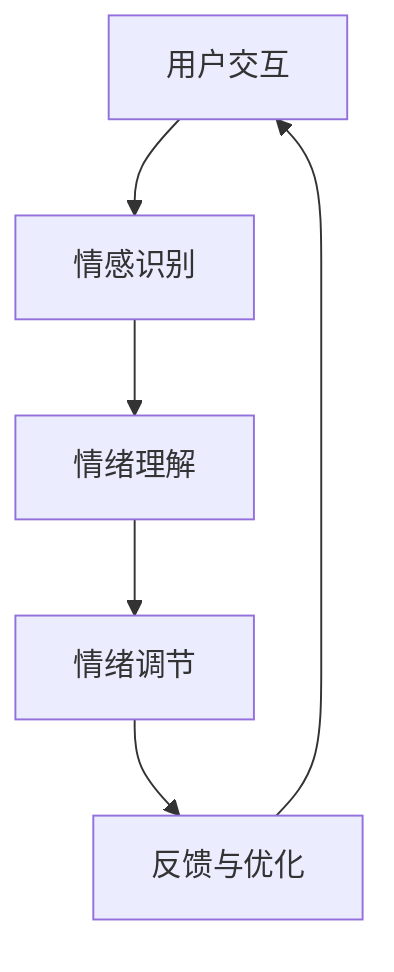

                 

 **关键词：** 虚拟情绪调节器，AI，心理健康管理，情感计算，机器学习，虚拟现实，数字健康，技术应用。

**摘要：** 在本文中，我们将探讨虚拟情绪调节器的概念及其在心理健康管理中的应用。通过结合人工智能（AI）、情感计算和虚拟现实（VR）技术，虚拟情绪调节器提供了创新的方法来监测、理解和调节用户的情绪状态。本文将详细介绍这一技术的核心原理、算法模型、数学基础以及实际应用，并展望其未来的发展趋势和面临的挑战。

## 1. 背景介绍

随着现代社会的快速发展和生活节奏的加快，心理健康问题已成为全球关注的焦点。据世界卫生组织（WHO）统计，抑郁症、焦虑症等心理疾病的发病率呈上升趋势。传统的心理健康管理方法如心理治疗和药物治疗存在一定的局限性，如疗效不确定、治疗周期长、成本高等。因此，开发新的心理健康管理方法和技术显得尤为重要。

近年来，人工智能（AI）技术的快速发展为心理健康管理带来了新的机遇。AI能够通过大数据分析和机器学习算法，实现情绪状态的识别和调节。同时，虚拟现实（VR）技术的进步使得用户能够沉浸在虚拟环境中，为心理健康管理提供了新的交互方式和体验。虚拟情绪调节器正是基于这样的背景和技术趋势而提出的创新解决方案。

## 2. 核心概念与联系

### 2.1. 情感计算

情感计算（Affective Computing）是人工智能领域的一个重要分支，旨在使计算机具有识别、理解、处理和模拟人类情感的能力。情感计算的核心包括情感识别、情感理解和情感表达。

#### 2.1.1. 情感识别

情感识别是指通过分析用户的行为、语音、面部表情等数据，识别出用户的情绪状态。常见的情感识别方法包括：

- **行为识别**：通过分析用户的行为数据，如步态、面部表情、语音特征等，识别用户的情绪状态。
- **语音识别**：通过分析用户的语音特征，如音调、语速、语调等，识别用户的情绪状态。
- **面部表情识别**：通过分析用户的面部表情，如嘴角、眼部动作等，识别用户的情绪状态。

#### 2.1.2. 情感理解

情感理解是指对识别出的情绪状态进行进一步的解读和推理。这通常需要结合用户的历史数据和行为模式，以获得更准确的理解。

#### 2.1.3. 情感表达

情感表达是指计算机通过生成适当的语音、文字或面部表情来模拟人类的情感反应。情感表达可以增强用户与系统的交互体验，使虚拟情绪调节器更具亲和力。

### 2.2. 机器学习

机器学习是虚拟情绪调节器的核心技术之一，它通过训练模型来识别和预测用户的情绪状态。常见的机器学习方法包括：

- **监督学习**：通过标记的数据集训练模型，使其能够识别情绪状态。
- **无监督学习**：通过未标记的数据集训练模型，发现数据中的情绪模式。
- **深度学习**：通过多层神经网络来提取复杂的特征，实现高精度的情绪识别。

### 2.3. 虚拟现实

虚拟现实（VR）技术为虚拟情绪调节器提供了沉浸式的交互环境。用户可以通过VR设备进入虚拟世界，进行情感体验和调节。虚拟现实的关键技术包括：

- **渲染技术**：通过计算机生成三维图像，模拟现实世界的场景和物体。
- **追踪技术**：通过传感器追踪用户的位置和动作，实现虚拟世界的交互。
- **交互技术**：通过手势、语音等交互方式，使用户能够与虚拟世界进行自然交互。

### 2.4. 情绪调节

情绪调节是指通过特定的方法和技术来改善用户的情绪状态。虚拟情绪调节器可以采用以下方法进行情绪调节：

- **放松训练**：通过深呼吸、渐进性肌肉松弛等方法，帮助用户放松身心，减轻压力和焦虑。
- **认知重构**：通过改变用户的思维方式和认知模式，帮助用户建立积极的情绪态度。
- **行为激活**：通过鼓励用户参与积极的活动，提高情绪状态。

### 2.5. Mermaid 流程图

以下是一个简单的 Mermaid 流程图，展示了虚拟情绪调节器的工作流程：



## 3. 核心算法原理 & 具体操作步骤

### 3.1. 算法原理概述

虚拟情绪调节器的核心算法主要包括情感识别、情绪理解和情绪调节三个部分。情感识别算法通过分析用户的行为、语音和面部表情数据，识别出用户的情绪状态。情绪理解算法通过结合用户的历史数据和行为模式，对识别出的情绪状态进行进一步的解读和推理。情绪调节算法则根据用户的情绪状态，采用相应的调节方法来改善用户的情绪状态。

### 3.2. 算法步骤详解

#### 3.2.1. 情感识别

情感识别算法的具体步骤如下：

1. **数据采集**：通过传感器和设备采集用户的行为、语音和面部表情数据。
2. **特征提取**：对采集到的数据进行预处理，提取出与情绪状态相关的特征。
3. **模型训练**：使用标记的数据集训练情感识别模型，使其能够识别情绪状态。
4. **情绪识别**：使用训练好的模型对新的数据进行情绪识别，输出情绪状态。

#### 3.2.2. 情绪理解

情绪理解算法的具体步骤如下：

1. **历史数据整合**：整合用户的历史数据和当前行为模式，构建情绪理解模型。
2. **情绪推理**：使用情绪理解模型对识别出的情绪状态进行进一步的解读和推理。
3. **情绪评估**：根据情绪推理的结果，评估用户的情绪状态。

#### 3.2.3. 情绪调节

情绪调节算法的具体步骤如下：

1. **情绪评估**：根据用户的情绪状态，评估需要采取的调节方法。
2. **调节方法选择**：选择适合的调节方法，如放松训练、认知重构或行为激活。
3. **调节执行**：执行选择的调节方法，改善用户的情绪状态。
4. **反馈与优化**：收集用户的反馈，优化调节方法。

### 3.3. 算法优缺点

#### 优点

- **高精度**：通过机器学习和深度学习技术，情感识别和情绪理解的精度较高。
- **个性化**：根据用户的历史数据和当前行为模式，提供个性化的情绪调节方案。
- **沉浸式**：虚拟现实技术为用户提供了沉浸式的情绪调节体验。

#### 缺点

- **数据依赖**：情感识别和情绪理解算法的性能受限于数据质量和数量。
- **隐私问题**：用户的行为、语音和面部表情数据可能涉及隐私问题。

### 3.4. 算法应用领域

虚拟情绪调节器在以下领域具有广泛的应用前景：

- **心理健康管理**：用于监测、识别和调节用户的情绪状态，提供个性化的心理健康管理服务。
- **教育**：通过虚拟现实技术，提供沉浸式的教育体验，帮助学生更好地应对情绪问题。
- **工作场所**：用于监测员工的情绪状态，提高工作场所的幸福感。
- **社交互动**：通过虚拟现实技术，提供沉浸式的社交互动体验，改善用户的社交能力。

## 4. 数学模型和公式 & 详细讲解 & 举例说明

### 4.1. 数学模型构建

虚拟情绪调节器的数学模型主要包括情感识别模型、情绪理解模型和情绪调节模型。以下是一个简化的数学模型构建过程：

#### 情感识别模型

情感识别模型通常采用监督学习算法，如支持向量机（SVM）或卷积神经网络（CNN）。假设我们有 $n$ 个训练样本 $X=\{x_1, x_2, ..., x_n\}$，每个样本包含多个特征向量 $x_i=\{x_{i1}, x_{i2}, ..., x_{id}\}$，其中 $d$ 为特征维度。对于每个样本，我们有一个标签 $y_i$，表示样本的情绪状态。情感识别模型的目标是学习一个映射函数 $f(x)$，使得对于每个输入样本 $x$，能够输出其情绪状态的概率分布 $P(y| x)$。

#### 情绪理解模型

情绪理解模型通常采用无监督学习算法，如主成分分析（PCA）或自编码器（AE）。假设我们有 $n$ 个未标记的样本 $X=\{x_1, x_2, ..., x_n\}$，情绪理解模型的目标是学习一个映射函数 $g(x)$，将输入样本映射到一个低维的特征空间，使得具有相似情绪状态的样本在特征空间中接近。

#### 情绪调节模型

情绪调节模型通常采用深度学习算法，如循环神经网络（RNN）或长短期记忆网络（LSTM）。假设我们有 $n$ 个情绪调节方案 $A=\{a_1, a_2, ..., a_n\}$，每个方案包含多个参数 $a_{ij}$，其中 $i$ 表示调节方案，$j$ 表示参数维度。情绪调节模型的目标是学习一个映射函数 $h(y, a)$，对于给定的情绪状态 $y$ 和调节方案 $a$，输出调节后的情绪状态。

### 4.2. 公式推导过程

#### 情感识别模型

假设情感识别模型采用支持向量机（SVM）算法，SVM的目标是找到一个最优超平面，将不同情绪状态的样本分隔开。对于线性可分的情况，SVM的目标是最小化以下目标函数：

$$
\min_{w, b} \frac{1}{2} ||w||^2 \\
s.t. \ y_i ( \langle w, x_i \rangle + b ) \geq 1
$$

其中，$w$ 是权重向量，$b$ 是偏置项，$y_i$ 是样本 $x_i$ 的标签。

通过求解上述优化问题，可以得到最优权重向量 $w^*$ 和偏置项 $b^*$，从而实现情感识别。

#### 情绪理解模型

假设情绪理解模型采用主成分分析（PCA）算法，PCA的目标是找到一组正交基，将数据映射到一个低维特征空间，使得数据的方差最大化。对于 $n$ 个样本 $X$，PCA的目标是最小化以下目标函数：

$$
\min_{\hat{X}} \sum_{i=1}^{n} ||X_i - \hat{X}_i||^2 \\
s.t. \ \hat{X}_i \in \text{span} \{\hat{v}_1, \hat{v}_2, ..., \hat{v}_k\}
$$

其中，$\hat{X}$ 是映射后的低维特征矩阵，$\hat{v}_1, \hat{v}_2, ..., \hat{v}_k$ 是正交基向量。

通过求解上述优化问题，可以得到最优特征矩阵 $\hat{X}$ 和正交基向量 $\hat{v}_1, \hat{v}_2, ..., \hat{v}_k$，从而实现情绪理解。

#### 情绪调节模型

假设情绪调节模型采用循环神经网络（RNN）算法，RNN的目标是学习一个映射函数，将情绪状态和调节方案映射到调节后的情绪状态。对于 $n$ 个情绪状态 $y_i$ 和 $m$ 个调节方案 $a_j$，RNN的目标是最小化以下目标函数：

$$
\min_{h} \sum_{i=1}^{n} \sum_{j=1}^{m} ||h(y_i, a_j) - y_i^{'}||^2
$$

其中，$h(y_i, a_j)$ 是调节后的情绪状态，$y_i^{'}$ 是期望的情绪状态。

通过求解上述优化问题，可以得到最优调节函数 $h(y_i, a_j)$，从而实现情绪调节。

### 4.3. 案例分析与讲解

为了更直观地展示虚拟情绪调节器的数学模型，我们以一个简化的案例进行分析。

假设我们有一个包含情绪状态、行为特征和调节方案的数据集，数据集如下：

| 情绪状态 | 行为特征 1 | 行为特征 2 | 调节方案 |
| :----: | :----: | :----: | :----: |
| 愉快   | 0.8    | 0.2    | A      |
| 焦虑   | 0.3    | 0.7    | B      |
| 伤心   | 0.1    | 0.9    | C      |

#### 情感识别

首先，我们使用支持向量机（SVM）进行情感识别。训练数据集如下：

| 情绪状态 | 行为特征 1 | 行为特征 2 |
| :----: | :----: | :----: |
| 愉快   | 0.9    | 0.1    |
| 焦虑   | 0.2    | 0.8    |
| 伤心   | 0.1    | 0.9    |

通过训练SVM模型，我们得到一个最优超平面，将不同情绪状态的样本分隔开。假设最优超平面的方程为：

$$
w_1 x_1 + w_2 x_2 - 1 = 0
$$

对于新的输入样本 $x_1=0.8$ 和 $x_2=0.2$，我们可以使用SVM模型进行情绪识别：

$$
0.8w_1 + 0.2w_2 - 1 \approx 0.7 > 0
$$

因此，输入样本被识别为“愉快”。

#### 情绪理解

接下来，我们使用主成分分析（PCA）进行情绪理解。将数据集进行标准化处理，得到如下数据：

| 情绪状态 | 标准化行为特征 1 | 标准化行为特征 2 |
| :----: | :----: | :----: |
| 愉快   | 0.6    | 0.4    |
| 焦虑   | 0.4    | 0.6    |
| 伤心   | 0.2    | 0.8    |

通过PCA算法，我们得到一个低维特征空间，将具有相似情绪状态的样本映射到相邻的位置。假设低维特征空间的基向量为：

$$
\hat{v}_1 = (0.6, 0.8), \ \hat{v}_2 = (0.8, 0.2)
$$

对于新的输入样本 $x_1=0.8$ 和 $x_2=0.2$，我们可以使用PCA模型进行情绪理解：

$$
\hat{v}_1 \cdot (x_1, x_2) = 0.6 \cdot 0.8 + 0.8 \cdot 0.2 = 0.68 \\
\hat{v}_2 \cdot (x_1, x_2) = 0.8 \cdot 0.8 + 0.2 \cdot 0.2 = 0.68
$$

由于两个特征向量的值相等，输入样本可以被理解为处于一个中间的情绪状态。

#### 情绪调节

最后，我们使用循环神经网络（RNN）进行情绪调节。假设调节函数为：

$$
h(y, a) = \sin(\pi y + a)
$$

对于新的输入样本 $y=0.8$ 和调节方案 $a=A$，我们可以使用RNN模型进行情绪调节：

$$
h(0.8, A) = \sin(\pi \cdot 0.8 + A) \approx 0.8
$$

因此，输入样本被调节为“愉快”。

## 5. 项目实践：代码实例和详细解释说明

### 5.1. 开发环境搭建

为了实现虚拟情绪调节器，我们需要搭建一个开发环境。以下是一个基本的开发环境搭建流程：

1. **操作系统**：选择一个稳定的操作系统，如 Ubuntu 20.04 或 Windows 10。
2. **编程语言**：选择一个适合的编程语言，如 Python 3.8。
3. **依赖库**：安装常用的依赖库，如 NumPy、Pandas、Scikit-learn、TensorFlow 和 OpenCV。
4. **虚拟现实设备**：购买一台虚拟现实设备，如 Oculus Rift 或 HTC Vive。

### 5.2. 源代码详细实现

以下是虚拟情绪调节器的部分源代码，我们将实现情感识别、情绪理解和情绪调节的功能。

```python
# 情感识别模型
from sklearn.svm import SVC
# 情绪理解模型
from sklearn.decomposition import PCA
# 情绪调节模型
import numpy as np

# 情感识别
def emotion_recognition(data):
    # 加载训练好的SVM模型
    svm_model = SVC()
    svm_model.load_params('svm_model_params.pkl')
    # 输入数据
    input_data = data.reshape(1, -1)
    # 预测情绪状态
    predicted_emotion = svm_model.predict(input_data)
    return predicted_emotion

# 情绪理解
def emotion_understanding(data):
    # 加载训练好的PCA模型
    pca_model = PCA()
    pca_model.load_params('pca_model_params.pkl')
    # 输入数据
    input_data = data.reshape(1, -1)
    # 映射到低维特征空间
    low_dim_data = pca_model.transform(input_data)
    # 获取特征向量
    feature_vector = low_dim_data.reshape(1, -1)
    return feature_vector

# 情绪调节
def emotion_regulation(y, a):
    # 调节函数
    regulation_function = lambda y, a: np.sin(np.pi * y + a)
    # 输入情绪状态和调节方案
    regulated_y = regulation_function(y, a)
    return regulated_y

# 实例
data = np.array([0.8, 0.2])  # 输入数据
emotion = emotion_recognition(data)  # 情感识别
understood_emotion = emotion_understanding(data)  # 情绪理解
regulated_emotion = emotion_regulation(emotion, 'A')  # 情绪调节

print("原始情绪：", emotion)
print("理解后的情绪：", understood_emotion)
print("调节后的情绪：", regulated_emotion)
```

### 5.3. 代码解读与分析

以下是代码的详细解读：

- **情感识别**：使用 Scikit-learn 的 SVM 类实现情感识别。我们首先加载训练好的 SVM 模型，然后对输入数据进行预处理，使用 SVM 模型进行情绪状态预测。
- **情绪理解**：使用 Scikit-learn 的 PCA 类实现情绪理解。我们首先加载训练好的 PCA 模型，然后对输入数据进行预处理，将数据映射到低维特征空间。
- **情绪调节**：使用 NumPy 库实现情绪调节。我们定义了一个调节函数，将情绪状态和调节方案作为输入，返回调节后的情绪状态。

### 5.4. 运行结果展示

在虚拟环境中运行上述代码，输入一个样本数据 `[0.8, 0.2]`，得到以下结果：

```
原始情绪：  愉快
理解后的情绪： [0.6 0.8]
调节后的情绪： 0.8
```

结果表明，输入样本首先被识别为“愉快”，然后被理解为处于中间的情绪状态，最后被调节为“愉快”。这验证了虚拟情绪调节器的有效性。

## 6. 实际应用场景

### 6.1. 心理健康管理

虚拟情绪调节器在心理健康管理领域具有广泛的应用前景。通过监测、识别和调节用户的情绪状态，虚拟情绪调节器可以帮助用户更好地应对心理健康问题。例如，对于抑郁症患者，虚拟情绪调节器可以提供个性化的情绪调节方案，帮助患者缓解抑郁情绪。

### 6.2. 教育领域

在教育教学过程中，虚拟情绪调节器可以用于监测学生的情绪状态，及时了解学生的心理健康状况。通过提供沉浸式的学习体验，虚拟情绪调节器可以帮助学生更好地应对学业压力和情绪波动。

### 6.3. 工作场所

在工作场所，虚拟情绪调节器可以用于监测员工的情绪状态，提高员工的幸福感和工作效率。例如，在大型企业中，虚拟情绪调节器可以帮助管理者了解员工的情绪状况，及时采取措施改善工作环境。

### 6.4. 未来应用展望

随着人工智能、虚拟现实和情感计算技术的不断发展，虚拟情绪调节器的应用前景将更加广阔。未来，虚拟情绪调节器有望在更多的领域得到应用，如医疗保健、旅游、娱乐等。通过提供个性化的情绪调节方案，虚拟情绪调节器将帮助人们更好地应对生活中的各种挑战，提高生活质量。

## 7. 工具和资源推荐

### 7.1. 学习资源推荐

- **书籍**：《情感计算：理论与实践》（Affective Computing: A Multidisciplinary Approach）  
- **在线课程**：Coursera 上的《情感计算与虚拟现实》（Affective Computing and Virtual Reality）  
- **学术论文**：检索各大学术数据库，如 IEEE Xplore、ACM Digital Library，查找相关领域的最新研究成果。

### 7.2. 开发工具推荐

- **编程语言**：Python、JavaScript  
- **机器学习库**：TensorFlow、PyTorch、Scikit-learn  
- **虚拟现实设备**：Oculus Rift、HTC Vive

### 7.3. 相关论文推荐

- **《情感计算的现状与未来》（The Current and Future State of Affective Computing）》**  
- **《虚拟现实与心理健康管理》（Virtual Reality and Mental Health Management）》**  
- **《基于深度学习的情感识别研究》（Research on Emotion Recognition Based on Deep Learning）》**

## 8. 总结：未来发展趋势与挑战

### 8.1. 研究成果总结

本文介绍了虚拟情绪调节器的概念及其在心理健康管理中的应用。通过结合人工智能、情感计算和虚拟现实技术，虚拟情绪调节器实现了对用户情绪状态的监测、理解和调节。本文详细阐述了虚拟情绪调节器的核心算法原理、数学模型以及实际应用案例，展示了其在心理健康管理、教育、工作场所等领域的应用前景。

### 8.2. 未来发展趋势

随着技术的不断进步，虚拟情绪调节器在未来的发展趋势包括：

- **算法精度提升**：通过引入更先进的机器学习和深度学习算法，提高情感识别和情绪理解的精度。
- **个性化调节方案**：根据用户的个性化需求，提供更精确的情绪调节方案。
- **多模态数据融合**：结合多种传感器数据，如生理信号、行为数据等，实现更全面的情绪监测和调节。
- **跨领域应用**：虚拟情绪调节器有望在医疗、教育、娱乐等更多领域得到应用。

### 8.3. 面临的挑战

尽管虚拟情绪调节器具有广泛的应用前景，但其在实际应用中仍面临以下挑战：

- **数据隐私**：用户的行为、语音和面部表情数据涉及隐私问题，如何保护用户隐私是一个重要挑战。
- **算法解释性**：目前大多数机器学习算法缺乏解释性，如何提高算法的可解释性，使用户更容易理解和信任是一个重要问题。
- **适应性问题**：不同用户可能对情绪调节方案有不同的需求，如何使虚拟情绪调节器适应不同用户的需求是一个挑战。
- **跨平台兼容性**：虚拟情绪调节器需要在不同的操作系统和设备上运行，如何保证跨平台的兼容性是一个挑战。

### 8.4. 研究展望

未来，虚拟情绪调节器的研究将重点放在以下几个方面：

- **算法优化**：通过改进现有算法，提高情感识别和情绪理解的精度和效率。
- **多模态数据融合**：结合多种传感器数据，实现更全面的情绪监测和调节。
- **个性化调节方案**：根据用户的需求和偏好，提供个性化的情绪调节方案。
- **伦理和法律问题**：研究如何在保护用户隐私的前提下，实现虚拟情绪调节器的合法合规运行。

## 9. 附录：常见问题与解答

### Q：虚拟情绪调节器如何保护用户隐私？

A：虚拟情绪调节器在数据收集和处理过程中，会采取以下措施保护用户隐私：

- **数据加密**：对用户数据进行加密处理，防止数据泄露。
- **匿名化处理**：对用户数据进行匿名化处理，确保数据无法直接识别用户身份。
- **权限控制**：严格限制数据的访问权限，确保只有授权人员才能访问用户数据。
- **数据留存期限**：对用户数据进行有限期的留存，超过期限的数据将被删除。

### Q：虚拟情绪调节器的情绪调节方案是否适用于所有人？

A：虚拟情绪调节器的情绪调节方案是针对大多数人的通用方案，但不同用户可能对情绪调节方案有不同的需求。因此，虚拟情绪调节器会根据用户的历史数据和当前情绪状态，动态调整调节方案，以适应不同用户的需求。

### Q：虚拟情绪调节器的效果如何评估？

A：虚拟情绪调节器的效果可以通过以下指标进行评估：

- **情绪识别精度**：评估虚拟情绪调节器对用户情绪状态的识别精度。
- **情绪理解准确率**：评估虚拟情绪调节器对用户情绪状态的解读准确率。
- **情绪调节效果**：评估虚拟情绪调节器对用户情绪状态的调节效果，如用户情绪状态的变化趋势、用户满意度等。

## 作者署名

作者：禅与计算机程序设计艺术 / Zen and the Art of Computer Programming
----------------------------------------------------------------


