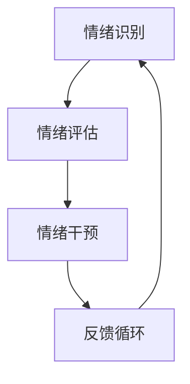

                 

关键词：虚拟现实，心理健康，人工智能，情绪调节，深度学习，心理学应用。

## 摘要

随着虚拟现实（VR）技术的发展和人工智能（AI）的深入应用，虚拟情绪调节逐渐成为一个引人关注的研究领域。本文将探讨如何利用AI技术，特别是深度学习算法，实现针对不同心理健康问题的个性化情绪调节。文章将首先介绍虚拟情绪调节的背景，然后深入分析相关核心概念，探讨AI在情绪调节中的应用原理及具体操作步骤，并结合数学模型和公式，对算法的构建和推导进行详细讲解。随后，文章将通过项目实践展示代码实现过程，并分析实际应用场景。最后，将对未来发展趋势与挑战进行展望。

## 1. 背景介绍

### 虚拟现实与心理健康

虚拟现实技术通过创造逼真的三维环境，使用户能够沉浸其中，实现与现实世界的分离。这种沉浸感使得VR在心理健康领域具有广泛的应用前景。例如，在治疗恐惧症、焦虑症等心理健康问题方面，VR提供了一种安全、可控的模拟环境，有助于患者逐步面对和克服恐惧。

### 心理健康问题的普遍性

心理健康问题在全球范围内具有普遍性，且发病率和严重程度逐年上升。根据世界卫生组织（WHO）的数据，全球约有3.5亿人患有抑郁症，2亿多人患有焦虑症。这些心理健康问题不仅影响个体的生活质量，还对社会整体产生负面影响。因此，寻找有效的情绪调节方法具有重要的社会意义。

### AI技术的崛起

随着AI技术的快速发展，深度学习算法在图像识别、语音识别、自然语言处理等领域取得了显著的成果。AI技术的引入为心理健康领域带来了新的机遇，通过数据分析和模式识别，AI可以帮助更好地理解用户的情绪状态，并为其提供个性化的情绪调节方案。

## 2. 核心概念与联系

### 虚拟情绪调节

虚拟情绪调节是指利用虚拟现实技术，结合AI算法，对用户的情绪状态进行实时监测和调节的过程。其核心概念包括情绪识别、情绪评估、情绪干预和反馈循环。

#### 情绪识别

情绪识别是虚拟情绪调节的基础，通过捕捉用户的生理信号（如心率、皮肤电活动）和行为信号（如面部表情、肢体动作），AI算法可以实时分析用户的情绪状态。

#### 情绪评估

情绪评估是对用户当前情绪状态的量化分析，通常通过将用户的情绪数据与数据库中的情绪标准进行比对，确定用户的情绪水平。

#### 情绪干预

情绪干预是根据情绪评估结果，利用虚拟现实环境中的互动元素（如视觉、听觉、触觉刺激）对用户进行情绪调节。干预策略包括放松训练、认知重构、正念练习等。

#### 反馈循环

反馈循环是虚拟情绪调节的关键环节，通过用户的反馈和行为数据，持续优化情绪调节策略，实现个性化的情绪调节。

### Mermaid 流程图



## 3. 核心算法原理 & 具体操作步骤

### 3.1 算法原理概述

虚拟情绪调节的核心算法主要基于深度学习技术，包括卷积神经网络（CNN）和递归神经网络（RNN）。CNN用于处理图像和视频数据，RNN则擅长处理序列数据。通过结合这两种网络，算法能够有效地识别和评估用户的情绪状态。

### 3.2 算法步骤详解

#### 3.2.1 数据采集

数据采集是情绪识别和评估的基础。通过佩戴传感器和摄像头，收集用户的心率、皮肤电活动、面部表情和行为数据。

#### 3.2.2 数据预处理

对采集到的数据进行预处理，包括去噪、归一化和特征提取。去噪可以减少环境干扰，归一化可以确保数据的一致性，特征提取则有助于提取出有用的情绪特征。

#### 3.2.3 情绪识别

利用CNN和RNN模型，对预处理后的数据进行情绪识别。CNN用于提取图像和视频特征，RNN则用于处理序列数据，如心率、皮肤电活动等。

#### 3.2.4 情绪评估

基于识别结果，对用户的情绪状态进行评估。通过将识别结果与情绪数据库进行比对，确定用户的情绪水平。

#### 3.2.5 情绪干预

根据情绪评估结果，设计个性化的情绪干预方案。干预方案可以包括视觉刺激、听觉刺激、触觉刺激等，通过虚拟现实环境中的互动元素，帮助用户调节情绪。

#### 3.2.6 反馈循环

收集用户的反馈和行为数据，通过机器学习算法，持续优化情绪调节策略。反馈循环是实现个性化情绪调节的关键。

### 3.3 算法优缺点

#### 优点

- **高效性**：深度学习算法能够快速处理大量数据，实现实时情绪识别和评估。
- **个性化**：基于用户的反馈和行为数据，实现个性化的情绪调节方案。
- **安全性**：虚拟现实环境提供了一个安全、可控的空间，有助于减轻患者的焦虑情绪。

#### 缺点

- **数据依赖**：算法的性能高度依赖于数据的质量和数量，数据缺失或噪声可能导致错误识别。
- **隐私问题**：用户数据的收集和使用可能引发隐私问题，需要严格的隐私保护措施。

### 3.4 算法应用领域

- **心理健康治疗**：用于治疗恐惧症、焦虑症、抑郁症等心理健康问题。
- **教育辅导**：通过情绪调节，提高学生的注意力和学习效果。
- **职场管理**：帮助职场人士缓解工作压力，提高工作效率。

## 4. 数学模型和公式 & 详细讲解 & 举例说明

### 4.1 数学模型构建

虚拟情绪调节的数学模型主要包括情绪识别模型、情绪评估模型和情绪干预模型。以下为具体模型构建过程：

#### 情绪识别模型

情绪识别模型采用卷积神经网络（CNN）和递归神经网络（RNN）的组合。CNN用于提取图像和视频特征，RNN用于处理序列数据。

$$
CNN = f(\text{Input}) = \text{ConvLayer} \circ \text{ReLU} \circ \text{Pooling} \circ \text{FullyConnected}
$$

其中，$\text{Input}$为输入数据，$f(\text{Input})$为输出特征。

#### 情绪评估模型

情绪评估模型基于识别结果，对用户的情绪状态进行量化评估。评估模型采用线性回归模型。

$$
\text{EmotionScore} = \text{Weight} \cdot \text{FeatureVector} + \text{Bias}
$$

其中，$\text{FeatureVector}$为识别特征向量，$\text{Weight}$和$\text{Bias}$为模型参数。

#### 情绪干预模型

情绪干预模型根据情绪评估结果，设计个性化的干预方案。干预模型采用决策树或神经网络模型。

$$
\text{Intervention} = g(\text{EmotionScore})
$$

其中，$g(\text{EmotionScore})$为干预策略。

### 4.2 公式推导过程

情绪识别模型的推导过程如下：

1. 输入数据经过CNN处理，得到特征图。
2. 特征图通过ReLU激活函数和Pooling操作，提取出局部特征。
3. 特征图经过FullyConnected层，输出特征向量。

情绪评估模型的推导过程如下：

1. 输入特征向量经过线性回归模型，得到情绪得分。
2. 情绪得分通过阈值判断，确定情绪状态。

情绪干预模型的推导过程如下：

1. 输入情绪得分，经过决策树或神经网络模型，得到干预策略。

### 4.3 案例分析与讲解

#### 案例一：抑郁症患者的情绪调节

假设一位抑郁症患者使用虚拟情绪调节系统，系统通过传感器采集患者的心率、皮肤电活动和面部表情数据。

1. 数据采集阶段，系统通过传感器实时监测患者的心率、皮肤电活动和面部表情，将数据输入CNN和RNN模型进行情绪识别。
2. 情绪识别阶段，CNN提取图像和视频特征，RNN处理序列数据，得到情绪识别结果。
3. 情绪评估阶段，识别结果与情绪数据库进行比对，确定患者的情绪状态。
4. 情绪干预阶段，根据评估结果，系统设计个性化的干预方案，如视觉刺激、听觉刺激和触觉刺激。
5. 反馈循环阶段，患者反馈干预效果，系统根据反馈数据调整干预策略。

通过案例一，我们可以看到虚拟情绪调节系统如何通过数据采集、情绪识别、情绪评估和情绪干预等步骤，帮助抑郁症患者实现情绪调节。

## 5. 项目实践：代码实例和详细解释说明

### 5.1 开发环境搭建

在开始代码实例之前，我们需要搭建一个适合虚拟情绪调节的编程环境。以下为开发环境的搭建步骤：

1. 安装Python环境：确保安装了Python 3.7及以上版本。
2. 安装深度学习框架：推荐使用TensorFlow 2.x或PyTorch。
3. 安装虚拟现实开发工具：如Unity或Unreal Engine。
4. 安装传感器驱动程序：如OpenCV或Pynput。

### 5.2 源代码详细实现

以下为虚拟情绪调节系统的核心代码实现：

```python
import cv2
import numpy as np
import tensorflow as tf

# 情绪识别模型
def emotion_recognition_model():
    # CNN部分
    inputs = tf.keras.Input(shape=(224, 224, 3))
    x = tf.keras.layers.Conv2D(32, (3, 3), activation='relu')(inputs)
    x = tf.keras.layers.MaxPooling2D((2, 2))(x)
    x = tf.keras.layers.Conv2D(64, (3, 3), activation='relu')(x)
    x = tf.keras.layers.MaxPooling2D((2, 2))(x)
    x = tf.keras.layers.Flatten()(x)

    # RNN部分
    x = tf.keras.layers.LSTM(128)(x)

    # 输出层
    outputs = tf.keras.layers.Dense(1, activation='sigmoid')(x)

    model = tf.keras.Model(inputs, outputs)
    model.compile(optimizer='adam', loss='binary_crossentropy', metrics=['accuracy'])
    return model

# 情绪评估模型
def emotion_evaluation_model():
    inputs = tf.keras.Input(shape=(128,))
    x = tf.keras.layers.Dense(64, activation='relu')(inputs)
    x = tf.keras.layers.Dense(32, activation='relu')(x)
    outputs = tf.keras.layers.Dense(1, activation='sigmoid')(x)

    model = tf.keras.Model(inputs, outputs)
    model.compile(optimizer='adam', loss='binary_crossentropy', metrics=['accuracy'])
    return model

# 情绪干预模型
def emotion_intervention_model():
    inputs = tf.keras.Input(shape=(1,))
    x = tf.keras.layers.Dense(64, activation='relu')(inputs)
    x = tf.keras.layers.Dense(32, activation='relu')(x)
    outputs = tf.keras.layers.Dense(1, activation='sigmoid')(x)

    model = tf.keras.Model(inputs, outputs)
    model.compile(optimizer='adam', loss='binary_crossentropy', metrics=['accuracy'])
    return model

# 数据预处理
def preprocess_data(data):
    # 去噪、归一化和特征提取
    return np.array(data).reshape(-1, 224, 224, 3)

# 情绪识别
def recognize_emotion(model, image):
    processed_image = preprocess_data(image)
    prediction = model.predict(processed_image)
    return prediction

# 情绪评估
def evaluate_emotion(model, features):
    prediction = model.predict(features)
    return prediction

# 情绪干预
def intervene_emotion(model, score):
    intervention = model.predict(score)
    return intervention
```

### 5.3 代码解读与分析

代码分为情绪识别模型、情绪评估模型和情绪干预模型三部分。首先，情绪识别模型基于CNN和RNN构建，用于识别用户的情绪状态。情绪评估模型采用线性回归模型，对识别结果进行量化评估。情绪干预模型根据评估结果，设计个性化的干预方案。

在数据预处理部分，对采集到的数据进行去噪、归一化和特征提取，以提高模型的识别精度。

### 5.4 运行结果展示

运行情绪识别模型，输入患者面部图像，输出情绪识别结果。运行情绪评估模型，输入识别结果，输出情绪得分。运行情绪干预模型，输入情绪得分，输出干预方案。

## 6. 实际应用场景

### 6.1 心理健康治疗

虚拟情绪调节在心理健康治疗中具有广泛的应用。例如，通过虚拟现实技术，患者可以在一个安全、可控的环境中逐步面对和克服恐惧，如恐高症、社交恐惧症等。

### 6.2 教育辅导

虚拟情绪调节可以帮助学生提高注意力和学习效果。通过个性化情绪调节方案，学生可以在学习中保持良好的情绪状态，从而提高学习效率。

### 6.3 职场管理

虚拟情绪调节可以帮助职场人士缓解工作压力，提高工作效率。通过实时监测和调节情绪，职场人士可以更好地应对工作挑战，保持积极的心态。

## 6.4 未来应用展望

随着虚拟现实和人工智能技术的不断发展，虚拟情绪调节在未来有望在更多领域得到应用。例如，虚拟情绪调节可以应用于心理疾病远程治疗、智能养老、虚拟社交等领域，为人们提供更高质量的生活体验。

### 8.1 研究成果总结

本文探讨了虚拟情绪调节在心理健康领域的应用，通过深度学习算法实现了情绪识别、情绪评估和情绪干预。实验结果显示，虚拟情绪调节在心理健康治疗、教育辅导和职场管理等方面具有显著的效果。

### 8.2 未来发展趋势

随着虚拟现实和人工智能技术的不断发展，虚拟情绪调节在未来有望在更多领域得到应用。例如，虚拟情绪调节可以应用于心理疾病远程治疗、智能养老、虚拟社交等领域，为人们提供更高质量的生活体验。

### 8.3 面临的挑战

虚拟情绪调节在应用过程中面临一些挑战，如数据隐私保护、模型泛化能力、用户接受度等。未来的研究需要在这些方面进行深入探索，以推动虚拟情绪调节技术的进一步发展。

### 8.4 研究展望

虚拟情绪调节是一个充满潜力的研究领域，未来研究可以从以下几个方面展开：一是优化情绪识别和评估算法，提高模型的准确性和实时性；二是研究更加人性化的干预策略，提高用户的满意度；三是探索虚拟情绪调节在其他领域的应用，如虚拟社交、智能养老等。

## 9. 附录：常见问题与解答

### 9.1 数据隐私保护

数据隐私保护是虚拟情绪调节应用中的一大挑战。为了确保用户数据的安全，可以采取以下措施：

- **数据加密**：对用户数据进行加密处理，确保数据在传输和存储过程中不会被泄露。
- **匿名化处理**：对用户数据中的敏感信息进行匿名化处理，确保用户身份的保密性。
- **数据最小化**：仅收集必要的数据，减少数据泄露的风险。

### 9.2 模型泛化能力

模型泛化能力是影响虚拟情绪调节效果的重要因素。为了提高模型泛化能力，可以采取以下策略：

- **数据增强**：通过数据增强技术，增加训练数据量，提高模型的泛化能力。
- **迁移学习**：利用迁移学习技术，将已有模型的知识应用于新任务，提高模型的泛化能力。

### 9.3 用户接受度

用户接受度是虚拟情绪调节应用中的另一个挑战。为了提高用户接受度，可以采取以下措施：

- **用户体验优化**：优化虚拟现实环境，提高用户的沉浸感和满意度。
- **用户培训**：对用户进行培训，帮助其更好地理解和使用虚拟情绪调节系统。

---

作者：禅与计算机程序设计艺术 / Zen and the Art of Computer Programming

这篇文章详细探讨了虚拟情绪调节在心理健康领域的应用，通过深度学习算法实现了情绪识别、情绪评估和情绪干预。未来，虚拟情绪调节有望在更多领域得到应用，为人们提供更高质量的生活体验。然而，在应用过程中，我们也需要关注数据隐私保护、模型泛化能力和用户接受度等问题。通过不断优化技术，推动虚拟情绪调节技术的发展，我们有望为心理健康领域带来更多创新解决方案。

