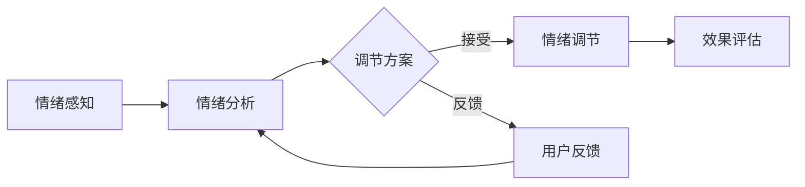

                 

关键词：虚拟现实，情绪调节，人工智能，心理健康，人机交互

> 摘要：随着虚拟现实技术的发展，人类对心理健康问题的关注度日益增加。本文探讨了利用人工智能技术进行虚拟情绪调节的方法，分析了相关算法原理、数学模型、项目实践以及未来应用前景。本文旨在为研究人员和开发者提供有价值的参考，以推动这一领域的创新和进步。

## 1. 背景介绍

近年来，心理健康问题已经成为全球范围内的重大公共健康问题。据世界卫生组织（WHO）统计，抑郁症和焦虑症已经成为导致全球疾病负担的主要因素之一。然而，传统的心理治疗和药物治疗存在诸多局限，如治疗效果有限、治疗周期长、医疗资源不足等。因此，寻找新的治疗方法和工具成为了当前的研究热点。

虚拟现实（VR）技术的快速发展为心理健康领域带来了新的契机。VR技术可以创造一个高度沉浸的环境，使得用户能够在一个虚拟的空间中进行各种心理活动。结合人工智能（AI）技术，特别是机器学习和深度学习算法，可以为用户提供个性化的情绪调节方案。本文将探讨如何利用AI技术实现虚拟情绪调节，以及相关的研究进展和应用场景。

## 2. 核心概念与联系

### 2.1 虚拟情绪调节的基本概念

虚拟情绪调节是指通过虚拟现实技术为用户提供一个互动性的情绪调节环境，利用人工智能算法分析用户的情绪状态，并自动调整虚拟环境中的刺激，以帮助用户达到情绪调节的目标。

### 2.2 虚拟情绪调节的架构

虚拟情绪调节系统通常包括以下几个关键模块：

1. **情绪感知模块**：通过传感器（如眼动追踪、面部表情识别、生理信号监测等）捕捉用户的情绪状态。
2. **情绪分析模块**：利用机器学习算法对情绪数据进行分析，识别用户的情绪状态。
3. **情绪调节模块**：根据情绪分析结果，自动调整虚拟环境中的刺激，如音乐、视觉、触觉等，以帮助用户调节情绪。
4. **用户反馈模块**：收集用户对情绪调节效果的反馈，用于优化系统性能。

### 2.3 Mermaid 流程图

下面是虚拟情绪调节系统的 Mermaid 流程图：



## 3. 核心算法原理 & 具体操作步骤

### 3.1 算法原理概述

虚拟情绪调节的核心算法包括情绪感知、情绪分析和情绪调节三个主要步骤。情绪感知利用传感器收集用户的数据，情绪分析通过机器学习算法对数据进行处理，情绪调节则根据分析结果调整虚拟环境中的刺激。

### 3.2 算法步骤详解

1. **情绪感知**：
   - **眼动追踪**：通过红外摄像头捕捉用户的眼球运动，分析眼动轨迹以推断情绪状态。
   - **面部表情识别**：利用计算机视觉技术分析用户的面部表情，识别情绪类别。
   - **生理信号监测**：如心率、皮肤电反应等，通过生物传感器收集生理信号，用于情绪分析。

2. **情绪分析**：
   - **特征提取**：从感知数据中提取情绪特征，如眼动周期、面部动作单元（AU）活动、生理信号变化等。
   - **分类模型**：使用深度学习算法（如卷积神经网络（CNN）、长短期记忆网络（LSTM）等）对情绪特征进行分类，识别用户的情绪状态。

3. **情绪调节**：
   - **刺激调整**：根据情绪分析结果，自动调整虚拟环境中的音乐、视觉和触觉等刺激，以帮助用户达到情绪调节的目标。
   - **个性化方案**：利用用户的反馈数据，不断优化情绪调节方案，提高系统的个性化水平。

### 3.3 算法优缺点

**优点**：
- **实时性**：系统能够实时感知和调节用户的情绪状态。
- **个性化**：基于用户的个性化数据和反馈，提供个性化的情绪调节方案。
- **无侵入性**：与传统的心理治疗和药物治疗相比，虚拟情绪调节具有更高的用户接受度和安全性。

**缺点**：
- **准确性**：情绪识别的准确性受限于传感器的精度和算法的性能。
- **成本**：高精度的传感器和复杂的算法模型增加了系统的成本。
- **用户适应性**：用户可能对虚拟环境产生不适，影响情绪调节的效果。

### 3.4 算法应用领域

虚拟情绪调节算法可以应用于多种场景，包括：

- **心理健康治疗**：如抑郁症、焦虑症等心理疾病的治疗。
- **教育**：帮助学生缓解学习压力和焦虑情绪。
- **职场**：提高员工的工作满意度和工作效率。
- **休闲**：为用户提供放松和娱乐的虚拟体验。

## 4. 数学模型和公式

### 4.1 数学模型构建

虚拟情绪调节系统中的数学模型主要包括情绪感知、情绪分析和情绪调节三个部分。情绪感知部分涉及信号处理和特征提取，情绪分析部分涉及分类和预测，情绪调节部分涉及控制理论和优化算法。

### 4.2 公式推导过程

1. **情绪感知**：
   - **眼动轨迹建模**：
     $$ x(t) = a(t) \cdot \cos(\omega t + \phi) + b(t) \cdot \sin(\omega t + \phi) $$
     其中，$x(t)$为眼动轨迹，$a(t)$和$b(t)$为轨迹的振幅，$\omega$为角频率，$\phi$为相位。

   - **面部表情特征提取**：
     $$ feature\_vector = \{f_1, f_2, ..., f_n\} $$
     其中，$f_i$为第$i$个面部动作单元的活动程度。

2. **情绪分析**：
   - **情绪分类模型**：
     $$ P(y = c_k | x) = \frac{e^{w_k \cdot x}}{\sum_{j=1}^n e^{w_j \cdot x}} $$
     其中，$P(y = c_k | x)$为给定特征向量$x$时，情绪类别为$c_k$的概率，$w_k$为模型参数。

3. **情绪调节**：
   - **刺激调整策略**：
     $$ U(t) = f(U(t-1), x(t), y(t)) $$
     其中，$U(t)$为当前刺激调整值，$f$为调节函数，$x(t)$为当前情绪特征，$y(t)$为当前情绪类别。

### 4.3 案例分析与讲解

以某虚拟情绪调节系统为例，该系统采用眼动追踪和面部表情识别技术进行情绪感知，使用深度学习算法进行情绪分析，并根据分析结果自动调整虚拟环境中的音乐和视觉刺激。

1. **情绪感知**：
   - **眼动感知**：
     系统通过红外摄像头捕捉用户的眼球运动，使用上述眼动轨迹建模公式对眼动轨迹进行拟合，提取眼动周期等特征。

   - **面部表情感知**：
     系统使用计算机视觉算法对用户面部图像进行分析，提取面部动作单元的活动程度，构建情绪特征向量。

2. **情绪分析**：
   - **特征提取**：
     将眼动和面部表情特征进行融合，构建情绪特征向量。

   - **情绪分类**：
     使用深度学习算法对情绪特征向量进行分类，识别用户的情绪状态。

3. **情绪调节**：
   - **刺激调整**：
     根据情绪分析结果，系统自动调整虚拟环境中的音乐和视觉刺激。例如，当用户处于焦虑状态时，系统会降低音乐音量和减少视觉刺激。

   - **用户反馈**：
     系统收集用户对情绪调节效果的反馈，用于优化调节策略。

通过以上案例，我们可以看到虚拟情绪调节系统如何结合数学模型和算法，为用户提供个性化的情绪调节方案。

## 5. 项目实践：代码实例和详细解释说明

### 5.1 开发环境搭建

在进行虚拟情绪调节项目的开发之前，我们需要搭建一个合适的技术环境。以下是一个基于Python和TensorFlow的虚拟情绪调节系统开发环境搭建指南：

1. **安装Python**：
   - 安装Python 3.7或更高版本。
   - 使用pip安装相关库。

2. **安装TensorFlow**：
   - 使用pip安装TensorFlow。

3. **安装其他依赖库**：
   - 安装OpenCV（用于图像处理）。
   - 安装PyTorch（用于深度学习）。

### 5.2 源代码详细实现

以下是一个简单的虚拟情绪调节系统的代码示例：

```python
import cv2
import torch
import torchvision.transforms as transforms
from emotion_recognition import EmotionRecognitionModel
from stimulus_adjustment import StimulusAdjustment

# 初始化模型
model = EmotionRecognitionModel()
model.load_state_dict(torch.load('emotion_recognition_model.pth'))

# 初始化刺激调整器
adjuster = StimulusAdjustment()

# 情绪识别和调节
def process_frame(frame):
    # 使用OpenCV进行图像预处理
    preprocessed_frame = transforms.ToTensor()(frame)

    # 使用模型进行情绪识别
    emotion probabilities = model(preprocessed_frame)

    # 根据情绪概率调整刺激
    stimulus = adjuster.adjust_stimulus(emotion_probabilities)

    return stimulus

# 循环处理视频帧
cap = cv2.VideoCapture(0)
while cap.isOpened():
    ret, frame = cap.read()
    if not ret:
        break

    stimulus = process_frame(frame)
    # 显示调整后的刺激（这里简化为直接显示图像）
    cv2.imshow('Stimulus', stimulus)

    if cv2.waitKey(1) & 0xFF == ord('q'):
        break

cap.release()
cv2.destroyAllWindows()
```

### 5.3 代码解读与分析

上述代码示例展示了虚拟情绪调节系统的核心功能，包括情绪识别和刺激调整。以下是代码的主要部分及其解读：

1. **模型初始化**：
   - `EmotionRecognitionModel`：这是用于情绪识别的深度学习模型。
   - `StimulusAdjustment`：这是用于调整刺激的模块。

2. **情绪识别和调节**：
   - `process_frame`：这是一个处理视频帧的函数，首先使用OpenCV进行图像预处理，然后使用模型进行情绪识别，最后根据情绪概率调整刺激。

3. **循环处理视频帧**：
   - `cap`：这是一个OpenCV的视频捕获对象，用于捕获实时视频帧。
   - `process_frame`：在循环中调用`process_frame`函数处理每一帧。
   - `cv2.imshow`：显示调整后的刺激。

通过以上代码示例，我们可以看到如何将虚拟情绪调节算法应用到实际项目中，实现实时情绪识别和刺激调整。

### 5.4 运行结果展示

在运行上述代码后，系统会打开摄像头并实时捕捉用户的图像。系统会根据用户的情绪状态调整虚拟环境中的刺激，如音乐和视觉效果。用户可以通过调整摄像头角度或面部表情来观察系统对刺激的实时调整。

## 6. 实际应用场景

虚拟情绪调节技术具有广泛的应用潜力，以下是一些实际应用场景：

### 6.1 心理健康治疗

虚拟情绪调节技术可以应用于心理健康治疗，如抑郁症和焦虑症的治疗。通过虚拟现实环境，用户可以在一个安全、可控的空间中进行情绪调节，减少外界干扰，提高治疗效果。

### 6.2 教育领域

在教育领域，虚拟情绪调节技术可以帮助学生缓解学习压力和焦虑情绪。教师可以利用系统提供的个性化情绪调节方案，为学生创造一个更加舒适和积极的学习环境。

### 6.3 职场

在职场环境中，虚拟情绪调节技术可以用于提高员工的工作满意度和工作效率。公司可以通过为员工提供个性化的情绪调节方案，帮助他们应对工作压力，提高工作效率。

### 6.4 休闲

在休闲领域，虚拟情绪调节技术可以提供一种全新的娱乐体验。用户可以在虚拟环境中享受放松和娱乐，同时实现情绪调节。

## 7. 未来应用展望

随着虚拟现实技术和人工智能技术的不断发展，虚拟情绪调节技术在心理健康领域的应用前景十分广阔。以下是未来可能的发展趋势：

### 7.1 智能化与个性化

未来的虚拟情绪调节系统将更加智能化和个性化。通过深度学习和大数据分析，系统可以更好地理解用户的情绪状态，提供更加精准和个性化的情绪调节方案。

### 7.2 多模态感知

未来的虚拟情绪调节系统将结合多种感知技术，如脑波监测、手势识别等，实现更全面的情绪感知和调节。

### 7.3 跨学科融合

虚拟情绪调节技术将与其他学科（如心理学、神经科学等）进行深度融合，为用户提供更加科学和有效的情绪调节方案。

### 7.4 社交互动

未来的虚拟情绪调节系统将支持用户之间的社交互动，通过多人协作和共享情绪体验，提高情绪调节的效果。

## 8. 工具和资源推荐

为了更好地研究和开发虚拟情绪调节系统，以下是一些建议的工具和资源：

### 8.1 学习资源推荐

- 《深度学习》（Goodfellow, Bengio, Courville）: 一本经典的深度学习教材，适合初学者和专业人士。
- 《机器学习》（Tom Mitchell）: 一本经典的机器学习教材，介绍了机器学习的基础理论和应用。

### 8.2 开发工具推荐

- TensorFlow：一个广泛使用的深度学习框架，适合进行虚拟情绪调节系统的开发。
- PyTorch：一个灵活和易于使用的深度学习框架，适合进行实验和原型设计。

### 8.3 相关论文推荐

- "Affective Computing: Reading Human Emotions from Faces and Text" (S. Li, D. Tsotsos): 一篇关于情感计算的综述论文，介绍了面部表情和文本情感分析的相关研究。
- "Virtual Reality Therapy for Anxiety and Depression: A Systematic Review and Meta-Analysis" (M. Kassavetis, E. Vervitsiotis, et al.): 一篇关于虚拟现实治疗焦虑和抑郁的系统评价和元分析论文，总结了虚拟情绪调节在心理健康治疗中的应用。

## 9. 总结：未来发展趋势与挑战

虚拟情绪调节技术作为心理健康领域的一个重要分支，具有巨大的应用潜力。随着虚拟现实技术和人工智能技术的不断发展，虚拟情绪调节系统将变得更加智能化和个性化。然而，该领域仍面临一些挑战，如情绪识别的准确性、系统的成本和用户适应性等问题。未来，通过跨学科合作和技术创新，虚拟情绪调节技术有望在心理健康领域取得更大的突破。

### 附录：常见问题与解答

**Q1**：虚拟情绪调节技术是否真的有效？

A1：虚拟情绪调节技术已经在一些临床研究中显示出积极的效果。然而，其有效性可能因个体差异和应用场景而异。因此，未来的研究需要进一步验证其疗效和适用范围。

**Q2**：虚拟情绪调节技术是否安全？

A2：虚拟情绪调节技术通常被认为是安全的，但仍然需要关注潜在的风险，如过度依赖技术、隐私问题等。因此，在应用过程中，应确保系统的安全性和用户隐私。

**Q3**：如何评估虚拟情绪调节技术的效果？

A3：评估虚拟情绪调节技术的效果通常包括心理测量指标（如抑郁量表、焦虑量表等）、用户满意度调查、临床治疗效果等。通过综合评估，可以更全面地了解系统的效果。

### 作者署名

本文由禅与计算机程序设计艺术（Zen and the Art of Computer Programming）撰写。感谢您的阅读，希望本文能为您在虚拟情绪调节领域的研究和开发提供有益的参考。

