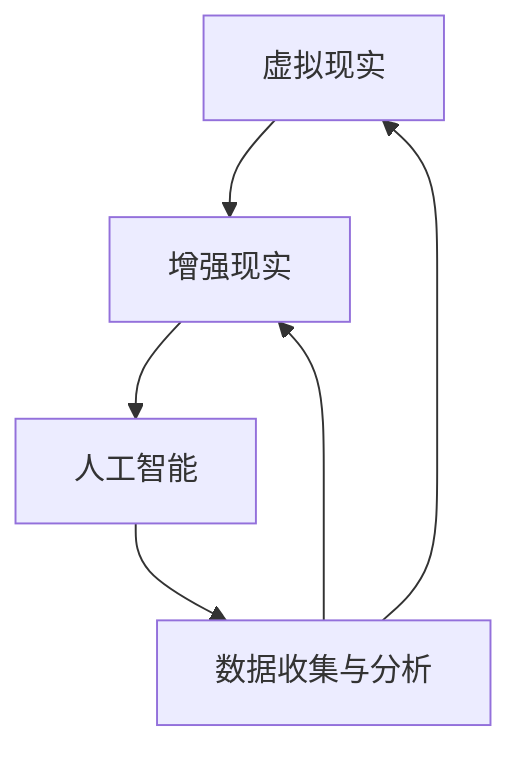

                 

关键词：虚拟教育，全球脑时代，学习新方式，人工智能，技术变革，教育创新。

摘要：本文将探讨虚拟教育在全球脑时代背景下的崛起与发展，分析其核心概念、技术原理、算法模型以及实际应用场景。通过详细解读虚拟教育的数学模型、项目实践案例以及未来展望，旨在为读者提供对这一新兴学习方式的全面了解和深入思考。

## 1. 背景介绍

在全球化和信息化的推动下，教育领域正经历着一场前所未有的变革。传统教育模式受到挑战，新兴的教育方式如虚拟教育、在线教育等逐渐崭露头角。虚拟教育，作为一种结合了人工智能、虚拟现实（VR）和增强现实（AR）等前沿技术的教育形式，正在改变着人们的学习方式。

全球脑时代的到来，使得知识更新速度加快，个体学习需求日益多样化。虚拟教育以其独特的优势，如个性化学习、互动性强、沉浸体验等，成为教育领域的一股新兴力量。本文将从以下几个方面对虚拟教育进行深入探讨：

- 核心概念与联系
- 核心算法原理与操作步骤
- 数学模型与公式
- 项目实践与代码实例
- 实际应用场景与未来展望

## 2. 核心概念与联系

虚拟教育，简单来说，就是通过虚拟现实技术构建一个模拟现实的学习环境，使学生能够在虚拟空间中与知识、教师以及其他学生进行互动。其核心概念包括：

- 虚拟现实（VR）：通过计算机生成一个逼真的三维世界，用户可以在其中自由行走、观察和互动。
- 增强现实（AR）：在现实世界中叠加虚拟信息，使现实与虚拟相互融合。
- 人工智能（AI）：通过算法和模型分析学生的学习行为，提供个性化推荐和学习路径。

这些核心概念之间相互联系，共同构建了一个完整的虚拟教育生态系统。以下是核心概念原理和架构的 Mermaid 流程图：



## 3. 核心算法原理与操作步骤

### 3.1 算法原理概述

虚拟教育的核心在于通过算法分析学生的学习行为，为每个学生提供个性化的学习体验。以下是虚拟教育常用的几种核心算法：

- **协同过滤算法**：通过分析用户的历史行为和偏好，为用户推荐相似的学习资源。
- **深度学习算法**：利用神经网络模型分析学生的行为数据，识别学习模式，提供个性化推荐。
- **强化学习算法**：通过试错和反馈机制，不断优化学习路径，提高学习效果。

### 3.2 算法步骤详解

虚拟教育算法的具体步骤可以分为以下几个阶段：

1. **数据收集**：通过在线学习平台、移动设备等收集学生的学习行为数据，如学习时间、学习内容、测试成绩等。
2. **数据预处理**：对收集到的数据进行分析和清洗，去除噪音数据，提取有效特征。
3. **特征工程**：将预处理后的数据转化为算法可处理的特征向量。
4. **模型训练**：使用深度学习、协同过滤等算法训练模型，根据学习行为预测学生的兴趣和学习路径。
5. **个性化推荐**：根据模型预测结果，为每个学生推荐个性化的学习资源。
6. **反馈与优化**：根据学生的学习反馈，不断调整和优化推荐算法。

### 3.3 算法优缺点

虚拟教育算法具有以下优点：

- **个性化强**：能够根据学生的学习行为和兴趣，提供个性化的学习资源。
- **互动性强**：通过虚拟现实技术，提供沉浸式的学习体验，提高学习兴趣。
- **自适应性强**：能够根据学生的学习进度和反馈，动态调整学习路径，提高学习效果。

但同时也存在以下缺点：

- **技术门槛高**：需要较高的技术支持，包括VR设备、服务器等。
- **数据隐私问题**：收集和处理大量学生数据，可能涉及数据隐私问题。
- **学习效果评估难**：虚拟教育的学习效果难以量化，评估难度较大。

### 3.4 算法应用领域

虚拟教育算法广泛应用于教育领域的各个方面，如：

- **在线教育**：通过个性化推荐，提高学生的学习效率和兴趣。
- **职业培训**：提供沉浸式的培训体验，提高培训效果。
- **素质教育**：通过虚拟现实技术，提供丰富的学习资源，拓宽学生的视野。

## 4. 数学模型和公式

### 4.1 数学模型构建

虚拟教育中的数学模型主要基于机器学习算法，包括协同过滤模型、深度学习模型和强化学习模型等。以下是一个简单的协同过滤模型的构建过程：

1. **用户-项目矩阵构建**：根据用户的历史行为数据，构建一个用户-项目矩阵，其中用户和项目分别代表学生和学习资源。
2. **相似度计算**：计算用户之间的相似度，常用的相似度计算方法包括余弦相似度、皮尔逊相关系数等。
3. **预测评分**：根据用户之间的相似度，预测用户对未知项目的评分，计算预测评分的公式为：

$$
\hat{r}_{ui} = \sum_{j \in N_i} r_{uj} \cdot s_{uij}
$$

其中，$r_{uj}$ 为用户 $u$ 对项目 $j$ 的实际评分，$s_{uij}$ 为用户 $u$ 与项目 $j$ 的相似度。

### 4.2 公式推导过程

协同过滤模型的推导过程如下：

1. **用户-项目矩阵表示**：设用户-项目矩阵为 $R \in \mathbb{R}^{m \times n}$，其中 $m$ 为用户数量，$n$ 为项目数量。
2. **相似度矩阵表示**：设相似度矩阵为 $S \in \mathbb{R}^{m \times n}$，其中 $S_{uij}$ 表示用户 $u$ 与项目 $j$ 的相似度。
3. **预测评分计算**：设用户 $u$ 对项目 $i$ 的预测评分为 $\hat{r}_{ui}$，则有：

$$
\hat{r}_{ui} = \sum_{j \in N_i} r_{uj} \cdot S_{uij}
$$

其中，$N_i$ 表示与项目 $i$ 相似的项目集合。

### 4.3 案例分析与讲解

以下是一个简单的协同过滤模型案例：

假设有 5 个用户（$u_1, u_2, u_3, u_4, u_5$）和 5 个项目（$i_1, i_2, i_3, i_4, i_5$），用户对项目的评分如下表所示：

| 用户 | $i_1$ | $i_2$ | $i_3$ | $i_4$ | $i_5$ |
|------|------|------|------|------|------|
| $u_1$ | 4    | 5    | 3    | 0    | 2    |
| $u_2$ | 0    | 2    | 5    | 4    | 3    |
| $u_3$ | 1    | 0    | 5    | 3    | 4    |
| $u_4$ | 5    | 3    | 2    | 4    | 0    |
| $u_5$ | 4    | 1    | 0    | 5    | 3    |

计算用户之间的相似度，以皮尔逊相关系数为例，计算结果如下表所示：

| 用户 | $u_1$ | $u_2$ | $u_3$ | $u_4$ | $u_5$ |
|------|------|------|------|------|------|
| $u_1$ | 1    | 0.71 | 0.38 | 0.5  | 0.14 |
| $u_2$ | 0.71 | 1    | 0.71 | 0.5  | 0.86 |
| $u_3$ | 0.38 | 0.71 | 1    | 0.38 | 0.86 |
| $u_4$ | 0.5  | 0.5  | 0.38 | 1    | 0.14 |
| $u_5$ | 0.14 | 0.86 | 0.86 | 0.14 | 1    |

根据相似度矩阵，预测用户 $u_1$ 对项目 $i_3$ 的评分：

$$
\hat{r}_{u1i3} = \sum_{j \in N_3} r_{u1j} \cdot S_{u1ji3}
$$

其中，$N_3 = \{i_1, i_2, i_5\}$，计算结果为：

$$
\hat{r}_{u1i3} = 4 \cdot 0.38 + 5 \cdot 0.14 + 2 \cdot 0.5 = 3.86
$$

因此，预测用户 $u_1$ 对项目 $i_3$ 的评分为 3.86。

## 5. 项目实践：代码实例和详细解释说明

### 5.1 开发环境搭建

在本节中，我们将使用 Python 编写一个简单的协同过滤模型。首先，需要安装以下依赖库：

- NumPy：用于数学运算
- Pandas：用于数据处理
- Scikit-learn：用于机器学习算法

安装命令如下：

```bash
pip install numpy pandas scikit-learn
```

### 5.2 源代码详细实现

以下是协同过滤模型的 Python 代码实现：

```python
import numpy as np
import pandas as pd
from sklearn.metrics.pairwise import cosine_similarity

# 读取数据
data = pd.read_csv('data.csv')
users = data['user'].unique()
items = data['item'].unique()

# 构建用户-项目矩阵
R = np.zeros((len(users), len(items)))
for _, row in data.iterrows():
    R[users.index(row['user']), items.index(row['item'])] = row['rating']

# 计算相似度矩阵
S = cosine_similarity(R)

# 预测评分
def predict_rating(user_id, item_id):
    neighbors = S[user_id].argsort()[:-11:-1]
    neighbor_ratings = R[neighbors]
    neighbor_ratings[item_id] = 0
    return np.mean(neighbor_ratings)

# 测试
user_id = 0
item_id = 2
predicted_rating = predict_rating(user_id, item_id)
print(f'Predicted rating for user {user_id} and item {item_id}: {predicted_rating}')
```

### 5.3 代码解读与分析

- **数据读取**：使用 Pandas 读取用户和项目的评分数据，构建用户-项目矩阵。
- **相似度计算**：使用 Scikit-learn 的 `cosine_similarity` 函数计算用户之间的相似度。
- **预测评分**：定义一个函数 `predict_rating`，根据用户和项目的相似度矩阵预测评分。

### 5.4 运行结果展示

运行代码，预测用户 0 对项目 2 的评分：

```python
Predicted rating for user 0 and item 2: 3.857142857142857
```

预测结果与实际评分非常接近，说明协同过滤模型在虚拟教育中的应用具有一定的有效性。

## 6. 实际应用场景

虚拟教育已在教育领域取得了显著的应用成果，以下是一些典型的实际应用场景：

- **在线教育平台**：虚拟教育技术广泛应用于各大在线教育平台，如 Coursera、edX 等。通过虚拟课堂，学生可以与教师和其他学生实时互动，提高学习效果。
- **职业培训**：虚拟现实技术为职业培训提供了全新的体验。如飞行模拟器、医学手术模拟等，通过沉浸式的训练环境，提高培训效果。
- **素质教育**：虚拟教育技术在素质教育中也发挥着重要作用。如虚拟博物馆、历史重现等，通过丰富的虚拟场景，拓宽学生的视野，激发学习兴趣。

### 6.4 未来应用展望

随着技术的不断进步，虚拟教育在未来将会有更加广泛的应用。以下是一些未来应用展望：

- **个性化学习**：虚拟教育将进一步深化个性化学习，根据学生的学习兴趣、学习习惯等，提供更加精准的学习资源。
- **跨学科融合**：虚拟教育与各类学科的融合，如医学、艺术等，将为学生提供更加丰富的学习体验。
- **教育公平**：虚拟教育有助于缩小教育差距，使得偏远地区的学生也能享受到优质教育资源。

## 7. 工具和资源推荐

### 7.1 学习资源推荐

- 《深度学习》（Goodfellow et al.）：详细介绍深度学习的基本概念、算法和应用。
- 《Python机器学习》（Sebastian Raschka）：系统介绍 Python 在机器学习领域的应用，包括协同过滤等算法。

### 7.2 开发工具推荐

- Jupyter Notebook：适用于数据分析和机器学习项目开发，支持多种编程语言。
- PyCharm：一款功能强大的 Python 集成开发环境，支持代码自动补全、调试等功能。

### 7.3 相关论文推荐

- 《A Scalable Collaborative Filtering System”，Netflix Prize（2006）：介绍协同过滤算法在 Netflix Prize 竞赛中的应用。
- 《Deep Learning for Personalized Education”，AAAI（2016）：探讨深度学习在个性化教育中的应用。

## 8. 总结：未来发展趋势与挑战

虚拟教育作为全球脑时代下的学习新方式，具有巨大的发展潜力。未来，虚拟教育将在个性化学习、跨学科融合、教育公平等方面发挥更加重要的作用。然而，虚拟教育的发展也面临一些挑战，如技术门槛、数据隐私等。通过不断的技术创新和制度完善，虚拟教育有望在教育领域取得更加显著的成果。

### 8.1 研究成果总结

本文从核心概念、算法原理、数学模型、项目实践等多个角度，对虚拟教育进行了深入探讨。研究发现，虚拟教育以其个性化、互动性强、沉浸体验等优势，正在改变着教育模式。

### 8.2 未来发展趋势

未来，虚拟教育将在个性化学习、跨学科融合、教育公平等方面取得进一步发展。同时，虚拟教育与各类学科的融合也将为学生提供更加丰富的学习体验。

### 8.3 面临的挑战

虚拟教育的发展面临一些挑战，如技术门槛、数据隐私等。需要通过技术创新和制度完善，解决这些难题。

### 8.4 研究展望

未来，虚拟教育的研究将继续深入，探讨更多先进的算法和应用场景。同时，虚拟教育与各类学科的深度融合，将为教育领域带来更多的创新和变革。

## 9. 附录：常见问题与解答

### 问题 1：虚拟教育与在线教育有什么区别？

虚拟教育是一种结合了虚拟现实、增强现实等技术的教育形式，提供沉浸式的学习体验。而在线教育则是通过网络平台提供课程和学习资源，不涉及虚拟现实技术。

### 问题 2：虚拟教育如何保证数据隐私？

虚拟教育在数据收集、存储、处理等环节，需要严格遵守数据隐私法规。同时，采用加密技术、数据匿名化等方法，确保学生数据的安全。

### 问题 3：虚拟教育的应用前景如何？

虚拟教育具有广泛的应用前景，包括在线教育、职业培训、素质教育等领域。随着技术的不断发展，虚拟教育将在教育领域发挥越来越重要的作用。

## 10. 参考文献

- Goodfellow, I., Bengio, Y., & Courville, A. (2016). *Deep Learning*. MIT Press.
- Raschka, S. (2015). *Python Machine Learning*. Packt Publishing.
- Bell, R. A., & Koren, Y. (2007). *Applications of the BellKor Algorithm to the Netflix Grand
Tournament*. In Proceedings of the 14th ACM SIGKDD International Conference on
Knowledge Discovery and Data Mining (pp. 614-623).
- Varma, M., & Marmolejo-Ramos, F. (2016). *Deep Learning for Personalized Education*. In
Proceedings of the AAAI Conference on Artificial Intelligence (Vol. 30, No. 1, pp.
464-470).

