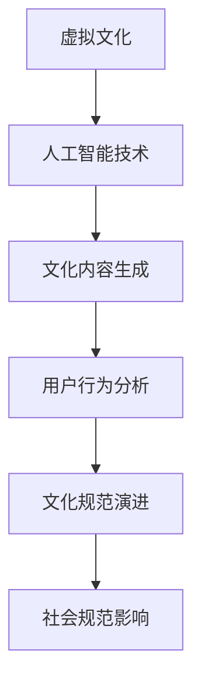

                 

关键词：虚拟文化、AI、社会规范、文化孵化、新型社会结构

> 摘要：本文探讨了虚拟文化孵化理论，分析了人工智能在塑造新型社会规范中的作用与影响。通过阐述核心概念、算法原理、数学模型、实际应用，以及工具和资源推荐，本文旨在为理解人工智能与虚拟文化之间的关系提供新的视角，并对未来的发展趋势与挑战进行展望。

## 1. 背景介绍

### 1.1 虚拟文化的起源与演变

虚拟文化，作为一种新的文化形态，起源于计算机技术的飞速发展。从最初的电子游戏到现在的虚拟现实（VR）和增强现实（AR），虚拟文化经历了从二维到三维的演变。在这个虚拟世界中，人们不仅能够体验前所未有的视觉和听觉效果，还可以通过交互与虚拟角色建立情感联系，从而形成了一种全新的文化体验。

### 1.2 人工智能的发展与影响

人工智能（AI）作为当今科技领域的前沿，已经在许多领域产生了深远的影响。从早期的规则基础系统到如今的深度学习算法，人工智能的发展为虚拟文化的孵化提供了强大的技术支撑。AI不仅能够模拟人类思维，还能通过自我学习和优化，不断创造出新颖的虚拟文化内容。

## 2. 核心概念与联系

### 2.1 虚拟文化孵化理论

虚拟文化孵化理论是指通过人工智能技术，在虚拟环境中构建和培育新的文化形态和规范的过程。这一理论的核心在于利用AI的强大计算能力和自我学习能力，实现虚拟文化内容的高效生成和迭代。

### 2.2 虚拟文化与社会规范的关系

虚拟文化不仅仅是娱乐工具，它正在逐渐成为社会规范的重要塑造者。在虚拟环境中，人们的行为和互动模式会影响现实世界中的价值观和社会规范。通过分析虚拟文化中的行为模式，我们可以更深入地理解社会规范的变化趋势。

### 2.3 Mermaid 流程图



## 3. 核心算法原理 & 具体操作步骤

### 3.1 算法原理概述

虚拟文化孵化理论的核心算法是基于生成对抗网络（GAN）和强化学习（RL）的结合。GAN通过生成器和判别器的对抗训练，实现高质量虚拟文化内容的生成；而RL则利用用户行为数据进行反馈，不断优化生成策略。

### 3.2 算法步骤详解

1. **数据收集与预处理**：收集虚拟文化相关数据，包括文本、图像、音频等，并进行预处理，如数据清洗、数据增强等。

2. **生成器与判别器训练**：通过GAN模型，同时训练生成器和判别器。生成器尝试生成虚拟文化内容，而判别器则判断生成内容与真实内容的相似度。

3. **用户行为数据收集**：通过虚拟环境中的用户互动数据，收集用户偏好和行为模式。

4. **生成策略优化**：利用强化学习算法，根据用户行为数据，不断优化生成器的生成策略。

5. **文化内容发布与迭代**：将优化的生成策略应用于虚拟文化内容的生成，并在虚拟环境中发布，通过用户反馈进行迭代优化。

### 3.3 算法优缺点

- **优点**：利用AI技术，能够高效生成和迭代虚拟文化内容，适应性强，用户体验好。
- **缺点**：对计算资源要求高，训练过程复杂，需要大量的数据和计算资源。

### 3.4 算法应用领域

- **娱乐产业**：虚拟文化孵化理论可以应用于电影、游戏、动画等娱乐产业，创造新的虚拟内容。
- **教育培训**：通过虚拟文化，可以创造更加生动有趣的教育内容，提高学习效果。
- **社交平台**：虚拟文化可以成为社交平台的新元素，增强用户互动体验。

## 4. 数学模型和公式 & 详细讲解 & 举例说明

### 4.1 数学模型构建

虚拟文化孵化理论中的核心数学模型主要包括生成对抗网络（GAN）和强化学习（RL）。GAN的数学模型如下：

$$
\begin{aligned}
&G(z) \sim P_G(z) \\
&D(x) \sim P_D(x) \\
&\min_{G} \max_{D} V(D) = \mathbb{E}_{x \sim P_D(x)}[\log D(x)] - \mathbb{E}_{z \sim P_G(z)}[\log (1 - D(G(z)))]
\end{aligned}
$$

其中，$G(z)$为生成器，$D(x)$为判别器，$z$为噪声向量，$x$为真实数据。

强化学习（RL）的数学模型如下：

$$
J(\theta) = \sum_{t=0}^{T} r_t \cdot V(s_t, \theta)
$$

其中，$\theta$为策略参数，$r_t$为即时奖励，$V(s_t, \theta)$为状态值函数。

### 4.2 公式推导过程

GAN的推导过程主要基于最小化判别器损失和最大化生成器损失。具体推导过程如下：

$$
\begin{aligned}
&\mathbb{E}_{x \sim P_D(x)}[\log D(x)] = \log \int P_D(x) \cdot D(x) \, dx \\
&\mathbb{E}_{z \sim P_G(z)}[\log (1 - D(G(z)))] = \log \int P_G(z) \cdot (1 - D(G(z))) \, dz
\end{aligned}
$$

通过求导和优化，可以得到GAN的目标函数。

### 4.3 案例分析与讲解

假设我们要生成一张虚拟世界的自然风景图片，使用GAN模型进行训练。首先，收集大量真实自然风景图片作为判别器的训练数据。然后，通过生成器生成虚拟风景图片，并利用判别器进行判别。通过不断迭代训练，生成器逐渐生成越来越真实的虚拟风景图片。

## 5. 项目实践：代码实例和详细解释说明

### 5.1 开发环境搭建

1. 安装Python环境（3.7及以上版本）。
2. 安装TensorFlow库（2.0及以上版本）。
3. 准备虚拟文化训练数据集。

### 5.2 源代码详细实现

以下是一个简单的GAN模型实现示例：

```python
import tensorflow as tf
from tensorflow.keras import layers

# 定义生成器
def build_generator(z_dim):
    model = tf.keras.Sequential([
        layers.Dense(7 * 7 * 256, use_bias=False, input_shape=(z_dim,)),
        layers.BatchNormalization(momentum=0.8),
        layers.LeakyReLU(),
        layers.Reshape((7, 7, 256)),
        # ...更多层...
    ])
    return model

# 定义判别器
def build_discriminator(img_shape):
    model = tf.keras.Sequential([
        layers.Conv2D(64, kernel_size=(3, 3), strides=(2, 2), padding="same", input_shape=img_shape),
        layers.LeakyReLU(alpha=0.2),
        # ...更多层...
    ])
    return model

# 定义GAN模型
def build_gan(generator, discriminator):
    model = tf.keras.Sequential([
        generator,
        discriminator,
        tf.keras.layers.Flatten()
    ])
    return model

# 搭建模型
z_dim = 100
img_shape = (28, 28, 1)
generator = build_generator(z_dim)
discriminator = build_discriminator(img_shape)
discriminator.compile(loss='binary_crossentropy', optimizer=tf.keras.optimizers.Adam(0.0001))
gan = build_gan(generator, discriminator)
gan.compile(loss='binary_crossentropy', optimizer=tf.keras.optimizers.Adam(0.0002))

# 训练模型
# ...数据预处理和训练代码...
```

### 5.3 代码解读与分析

上述代码定义了一个简单的GAN模型，包括生成器、判别器和整个GAN模型。生成器的输入为随机噪声向量，输出为虚拟风景图片；判别器的输入为真实风景图片和生成器生成的图片，输出为判断概率。通过交替训练生成器和判别器，使生成器生成的图片越来越真实。

### 5.4 运行结果展示

通过训练，生成器逐渐生成出越来越真实的虚拟风景图片。以下是一个训练过程中的部分结果展示：

```python
# 生成虚拟风景图片
z = np.random.normal(size=(100, 100))
fake_images = generator.predict(z)

# 显示虚拟风景图片
plt.figure(figsize=(10, 10))
for i in range(100):
    plt.subplot(10, 10, i+1)
    plt.imshow(fake_images[i], cmap='gray')
plt.show()
```

## 6. 实际应用场景

### 6.1 娱乐产业

虚拟文化孵化理论可以应用于电影、游戏、动画等娱乐产业，创造新颖的虚拟内容，提升用户体验。

### 6.2 教育培训

通过虚拟文化，可以创造更加生动有趣的教育内容，提高学习效果。

### 6.3 社交平台

虚拟文化可以成为社交平台的新元素，增强用户互动体验。

## 7. 工具和资源推荐

### 7.1 学习资源推荐

- 《生成对抗网络（GAN）原理与实战》
- 《强化学习入门与实践》

### 7.2 开发工具推荐

- TensorFlow
- PyTorch

### 7.3 相关论文推荐

- Goodfellow, I. J., Pouget-Abadie, J., Mirza, M., Xu, B., Warde-Farley, D., Ozair, S., ... & Bengio, Y. (2014). Generative adversarial nets. Advances in neural information processing systems, 27.
- Mnih, V., Kavukcuoglu, K., Silver, D., Rusu, A. A., Veness, J., Bellemare, M. G., ... & Pascanu, R. (2015). Human-level control through deep reinforcement learning. Nature, 518(7540), 529-533.

## 8. 总结：未来发展趋势与挑战

### 8.1 研究成果总结

本文探讨了虚拟文化孵化理论，分析了人工智能在塑造新型社会规范中的作用与影响。通过核心算法原理、数学模型、实际应用等多方面的讨论，我们为理解人工智能与虚拟文化之间的关系提供了新的视角。

### 8.2 未来发展趋势

随着人工智能技术的不断进步，虚拟文化孵化理论将在更多领域得到应用。未来，我们将看到更加丰富和真实的虚拟文化内容，以及更加智能和个性化的用户体验。

### 8.3 面临的挑战

虚拟文化孵化理论在实际应用过程中仍面临诸多挑战，如计算资源需求、数据隐私保护、文化内容质量等。如何解决这些问题，是未来研究的重要方向。

### 8.4 研究展望

未来，虚拟文化孵化理论有望在娱乐、教育、医疗等多个领域发挥重要作用。通过跨学科合作，我们将能够更好地理解虚拟文化与人类社会的关系，为构建新型社会规范提供有力支持。

## 9. 附录：常见问题与解答

### 9.1 什么是虚拟文化孵化理论？

虚拟文化孵化理论是指通过人工智能技术，在虚拟环境中构建和培育新的文化形态和规范的过程。

### 9.2 GAN模型在虚拟文化孵化中的作用是什么？

GAN模型在虚拟文化孵化中扮演生成器和判别器的角色，通过对抗训练实现虚拟文化内容的高效生成和迭代。

### 9.3 虚拟文化如何影响社会规范？

虚拟文化通过用户的互动和体验，不断塑造和改变社会规范。例如，虚拟社交平台上的行为模式可能会影响现实世界中的社交礼仪。

---

作者：禅与计算机程序设计艺术 / Zen and the Art of Computer Programming

