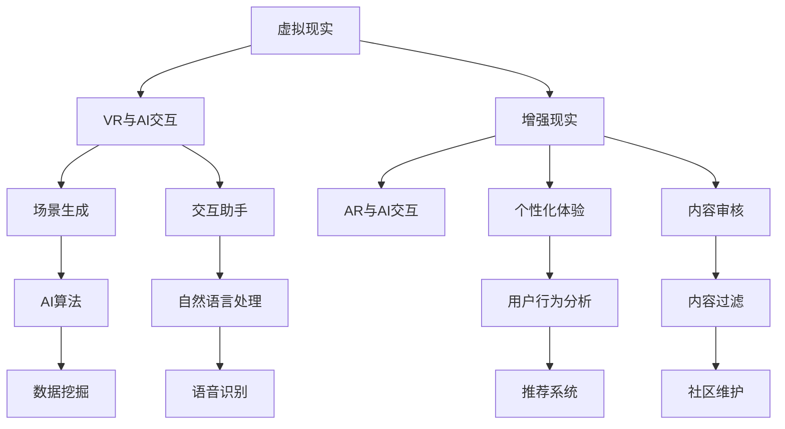

                 

关键词：虚拟文化、人工智能、社会规范、技术影响、未来展望

摘要：随着人工智能技术的发展，虚拟文化正在迅速崛起，并在塑造新型社会规范方面发挥着日益重要的作用。本文探讨了人工智能如何改变我们的社会结构和行为模式，分析了虚拟文化中的核心概念，以及AI对未来社会规范的可能影响。通过数学模型和项目实践，本文展示了人工智能在虚拟文化中的应用和潜力。

## 1. 背景介绍

在过去的几十年里，信息技术和互联网的快速发展已经深刻地改变了我们的生活方式和社会结构。从个人通讯到商业活动，从教育到娱乐，互联网的影响无处不在。然而，随着人工智能（AI）技术的突破，这种变革正在进入一个新的阶段。人工智能不仅仅是提高效率和自动化流程的工具，它正在成为塑造社会规范和文化的关键因素。

虚拟文化，作为一种全新的文化形态，正在形成。它不仅包括虚拟现实（VR）、增强现实（AR）等新兴技术，还涵盖了在线社交网络、虚拟游戏、数字艺术等丰富的虚拟体验。在这个虚拟世界中，人们可以自由地探索、创造和互动，形成全新的社会关系和行为模式。

人工智能的崛起与虚拟文化的兴起密切相关。AI技术提供了强大的数据分析和处理能力，使得虚拟世界中的用户体验更加丰富和个性化。同时，AI算法的进步也为虚拟文化中的内容生成、用户行为预测等方面提供了新的可能性。

## 2. 核心概念与联系

### 2.1 人工智能与虚拟文化的交互

人工智能与虚拟文化的交互可以看作是两个不同领域的深度融合。在虚拟文化中，人工智能被广泛应用于以下几个方面：

#### 2.1.1 虚拟现实（VR）与增强现实（AR）

VR和AR技术是虚拟文化的重要组成部分。它们通过计算机生成三维环境和图像，提供沉浸式的用户体验。人工智能在其中发挥着关键作用，例如：

- **场景生成与交互**：AI可以根据用户的动作和环境变化实时生成虚拟场景，增强用户的沉浸感。
- **个性化体验**：AI通过分析用户的历史行为和偏好，提供个性化的虚拟体验。
- **交互助手**：AI助手可以与用户进行自然语言交互，提供信息查询、导航等服务。

### 2.2 在线社交网络与虚拟社区

在线社交网络是虚拟文化的一个重要组成部分，它使得人们可以跨越物理距离进行交流和互动。人工智能在社交网络中的应用主要包括：

- **用户行为分析**：AI可以通过分析用户的社交行为，预测用户兴趣和需求，提供个性化推荐。
- **内容审核**：AI算法可以自动识别和过滤不良信息，维护社区秩序。
- **虚拟助手**：AI助手可以协助用户管理社交关系，提供消息提醒、日程安排等服务。

### 2.3 虚拟游戏与数字艺术

虚拟游戏和数字艺术是虚拟文化的重要组成部分，它们提供了丰富的娱乐和创作体验。人工智能在其中的应用包括：

- **游戏AI**：AI可以模拟复杂的行为模式，增强游戏的趣味性和挑战性。
- **内容创作**：AI可以生成数字艺术作品，提供多样化的创作灵感。
- **情感识别**：AI可以通过分析用户的情感变化，提供更加情感化的游戏体验。

### 2.4 人工智能与虚拟文化的架构图

为了更好地理解人工智能与虚拟文化的交互，我们可以使用Mermaid流程图来展示其核心概念和联系。以下是一个简单的示例：



## 3. 核心算法原理 & 具体操作步骤

### 3.1 算法原理概述

在虚拟文化中，人工智能的核心算法主要包括以下几个方面：

- **机器学习**：通过训练模型来模拟人类的学习和行为模式，用于场景生成、用户行为预测等。
- **深度学习**：一种特殊的机器学习技术，通过多层神经网络来提取特征，用于图像识别、语音识别等。
- **自然语言处理（NLP）**：用于处理和生成自然语言文本，实现人机交互和内容创作。
- **强化学习**：通过奖励机制来训练模型，使其能够在复杂环境中做出最优决策。

### 3.2 算法步骤详解

#### 3.2.1 机器学习

机器学习的过程可以分为以下几个步骤：

1. **数据收集**：从虚拟文化中收集大量数据，例如用户行为数据、图像数据等。
2. **数据预处理**：清洗和转换数据，使其适合模型训练。
3. **模型训练**：使用训练数据来训练模型，使其能够模拟人类行为和偏好。
4. **模型评估**：使用测试数据来评估模型性能，调整模型参数以优化性能。
5. **模型部署**：将训练好的模型部署到虚拟文化平台，用于实际应用。

#### 3.2.2 深度学习

深度学习的过程与机器学习类似，但更加复杂。它主要包括以下几个步骤：

1. **神经网络设计**：设计多层神经网络，包括输入层、隐藏层和输出层。
2. **数据预处理**：与机器学习相同，对数据进行清洗和转换。
3. **权重初始化**：初始化神经网络权重，通常使用随机初始化方法。
4. **前向传播**：将输入数据通过神经网络进行前向传播，计算输出结果。
5. **反向传播**：根据输出结果和真实值，通过反向传播算法更新网络权重。
6. **迭代训练**：重复前向传播和反向传播过程，直到模型收敛。

#### 3.2.3 自然语言处理（NLP）

自然语言处理的过程包括以下几个步骤：

1. **文本预处理**：对文本数据进行清洗和预处理，例如去除停用词、分词等。
2. **词嵌入**：将文本数据转换为向量表示，用于神经网络处理。
3. **模型训练**：使用训练数据来训练模型，例如使用循环神经网络（RNN）或变换器（Transformer）。
4. **模型评估**：使用测试数据来评估模型性能，调整模型参数以优化性能。
5. **文本生成**：将模型部署到虚拟文化平台，用于文本生成和自然语言交互。

#### 3.2.4 强化学习

强化学习的过程与深度学习和机器学习有所不同，它主要包括以下几个步骤：

1. **环境设定**：定义虚拟文化中的环境，包括状态空间、动作空间和奖励机制。
2. **模型训练**：使用强化学习算法（例如Q学习、深度确定性策略梯度（DDPG）等）来训练模型。
3. **策略优化**：根据模型输出，选择最优动作，并更新模型参数。
4. **模型评估**：评估模型在虚拟文化环境中的性能，调整策略以优化性能。
5. **模型部署**：将训练好的模型部署到虚拟文化平台，用于实际应用。

### 3.3 算法优缺点

每种算法都有其独特的优势和局限性，以下是对主要算法的优缺点的简要概述：

#### 3.3.1 机器学习

- **优点**：模型通用性强，可以应用于多种虚拟文化场景。
- **缺点**：需要大量高质量的数据，训练过程可能非常耗时。

#### 3.3.2 深度学习

- **优点**：能够自动提取特征，适用于图像识别、语音识别等任务。
- **缺点**：模型复杂度高，训练过程计算量大，对数据质量要求较高。

#### 3.3.3 自然语言处理（NLP）

- **优点**：能够处理和生成自然语言文本，实现人机交互和内容创作。
- **缺点**：对文本数据的理解和处理能力有限，无法完全模拟人类的语言能力。

#### 3.3.4 强化学习

- **优点**：能够自主学习和优化策略，适用于复杂环境下的决策问题。
- **缺点**：训练过程可能不稳定，对环境和奖励机制的设定要求较高。

### 3.4 算法应用领域

人工智能算法在虚拟文化中具有广泛的应用领域，以下是一些主要的应用场景：

- **虚拟现实（VR）与增强现实（AR）**：用于场景生成、交互助手、个性化体验等。
- **在线社交网络与虚拟社区**：用于用户行为分析、内容推荐、虚拟助手等。
- **虚拟游戏与数字艺术**：用于游戏AI、内容创作、情感识别等。

## 4. 数学模型和公式 & 详细讲解 & 举例说明

在虚拟文化的构建和应用过程中，数学模型和公式扮演着至关重要的角色。以下我们将详细讲解几个核心的数学模型，并使用LaTeX格式进行展示。

### 4.1 数学模型构建

#### 4.1.1 生成对抗网络（GAN）

生成对抗网络（GAN）是一种由两个神经网络组成的模型，分别是生成器（Generator）和判别器（Discriminator）。GAN的数学模型可以表示为：

$$
\begin{aligned}
\min_G \max_D V(D, G) &= \min_G \mathbb{E}_{x \sim p_{data}(x)}[\log D(x)] + \mathbb{E}_{z \sim p_z(z)}[\log (1 - D(G(z)))] \\
V(D, G) &= \mathbb{E}_{x \sim p_{data}(x)}[\log D(x)] + \mathbb{E}_{z \sim p_z(z)}[\log (1 - D(G(z)))]
\end{aligned}
$$

其中，$G(z)$是生成器生成的数据，$D(x)$是判别器对真实数据的判别结果，$z$是生成器的输入噪声。

#### 4.1.2 马尔可夫模型

马尔可夫模型是一种用于描述序列数据的数学模型。它假设当前状态只与前一状态有关，而与之前的状态无关。马尔可夫模型可以表示为：

$$
p(x_t | x_{t-1}, x_{t-2}, \ldots) = p(x_t | x_{t-1})
$$

其中，$x_t$表示第$t$个状态。

### 4.2 公式推导过程

#### 4.2.1 生成对抗网络（GAN）

GAN的目标是最小化判别器的损失函数，同时最大化生成器的损失函数。具体推导过程如下：

- **判别器的损失函数**：

$$
L_D(x) = -\log D(x) - \log (1 - D(G(z)))
$$

其中，$x$是真实数据，$G(z)$是生成器生成的数据。

- **生成器的损失函数**：

$$
L_G(z) = -\log (1 - D(G(z)))
$$

其中，$z$是生成器的输入噪声。

- **总损失函数**：

$$
V(D, G) = L_D(x) + L_G(z)
$$

- **梯度下降**：

使用梯度下降算法来最小化总损失函数：

$$
\begin{aligned}
\frac{\partial V}{\partial D} &= \frac{\partial L_D}{\partial D} + \frac{\partial L_G}{\partial D} \\
\frac{\partial V}{\partial G} &= \frac{\partial L_G}{\partial G}
\end{aligned}
$$

#### 4.2.2 马尔可夫模型

马尔可夫模型的推导过程如下：

- **状态转移概率**：

$$
p(x_t | x_{t-1}) = \sum_{x_{t-2}} p(x_t | x_{t-2}) p(x_{t-2} | x_{t-1})
$$

- **初始状态概率**：

$$
p(x_0) = 1
$$

- **状态序列概率**：

$$
p(x_0, x_1, \ldots, x_t) = p(x_0) \cdot \prod_{i=1}^{t-1} p(x_i | x_{i-1})
$$

### 4.3 案例分析与讲解

#### 4.3.1 生成对抗网络（GAN）在虚拟现实中的应用

假设我们使用GAN来生成虚拟现实中的场景图像，以下是一个简单的案例：

- **生成器**：输入噪声$z$，输出场景图像$G(z)$。
- **判别器**：输入场景图像，输出概率$D(x)$。

通过训练，生成器生成的场景图像逐渐接近真实场景图像，而判别器难以区分真实图像和生成图像。具体训练过程如下：

1. **数据收集**：从虚拟现实数据库中收集大量真实场景图像。
2. **数据预处理**：对图像进行标准化处理，使其适合GAN模型。
3. **模型训练**：使用真实图像和生成图像来训练生成器和判别器。
4. **模型评估**：使用测试集来评估生成器和判别器的性能。

#### 4.3.2 马尔可夫模型在虚拟社区中的应用

假设我们使用马尔可夫模型来预测虚拟社区中的用户行为，以下是一个简单的案例：

- **状态**：用户行为，例如浏览、购买、评论等。
- **转移概率**：用户在不同行为之间的转移概率。

通过训练，我们可以预测用户在虚拟社区中的下一步行为。具体步骤如下：

1. **数据收集**：收集大量用户行为数据。
2. **数据预处理**：对数据进行编码，使其适合马尔可夫模型。
3. **模型训练**：使用训练数据来训练马尔可夫模型。
4. **模型评估**：使用测试数据来评估模型性能。

## 5. 项目实践：代码实例和详细解释说明

### 5.1 开发环境搭建

为了实现本文中的虚拟文化应用，我们需要搭建一个合适的开发环境。以下是具体的步骤：

1. **安装Python环境**：Python是AI应用的主要编程语言，我们需要安装Python 3.x版本。
2. **安装库和框架**：安装TensorFlow、Keras等深度学习库，用于构建和训练模型。
3. **配置虚拟环境**：为了更好地管理依赖项，我们使用虚拟环境来隔离项目依赖。

### 5.2 源代码详细实现

以下是使用生成对抗网络（GAN）生成虚拟现实场景图像的代码示例：

```python
import tensorflow as tf
from tensorflow.keras.layers import Dense, Flatten, Reshape
from tensorflow.keras.models import Sequential
from tensorflow.keras.optimizers import Adam

# 生成器模型
def build_generator(z_dim):
    model = Sequential()
    model.add(Dense(128, input_dim=z_dim))
    model.add(tf.keras.layers.LeakyReLU(alpha=0.2))
    model.add(Dense(256))
    model.add(tf.keras.layers.LeakyReLU(alpha=0.2))
    model.add(Dense(512))
    model.add(tf.keras.layers.LeakyReLU(alpha=0.2))
    model.add(Dense(1024))
    model.add(tf.keras.layers.LeakyReLU(alpha=0.2))
    model.add(Reshape((32, 32, 3)))
    return model

# 判别器模型
def build_discriminator(img_shape):
    model = Sequential()
    model.add(Flatten(input_shape=img_shape))
    model.add(Dense(512))
    model.add(tf.keras.layers.LeakyReLU(alpha=0.2))
    model.add(Dense(256))
    model.add(tf.keras.layers.LeakyReLU(alpha=0.2))
    model.add(Dense(128))
    model.add(tf.keras.layers.LeakyReLU(alpha=0.2))
    model.add(Dense(1, activation='sigmoid'))
    return model

# GAN模型
def build_gan(generator, discriminator):
    model = Sequential()
    model.add(generator)
    model.add(discriminator)
    return model

# 设置超参数
z_dim = 100
img_shape = (32, 32, 3)
batch_size = 64
learning_rate = 0.0002

# 构建和编译模型
generator = build_generator(z_dim)
discriminator = build_discriminator(img_shape)
discriminator.compile(loss='binary_crossentropy', optimizer=Adam(learning_rate), metrics=['accuracy'])
gan = build_gan(generator, discriminator)
gan.compile(loss='binary_crossentropy', optimizer=Adam(learning_rate))

# 训练模型
for epoch in range(num_epochs):
    for _ in range(batch_size // z_dim):
        noise = np.random.normal(0, 1, (batch_size, z_dim))
        real_imgs = generate_real_images(batch_size)
        fake_imgs = generator.predict(noise)

        # 训练判别器
        d_loss_real = discriminator.train_on_batch(real_imgs, np.ones((batch_size, 1)))
        d_loss_fake = discriminator.train_on_batch(fake_imgs, np.zeros((batch_size, 1)))
        d_loss = 0.5 * np.add(d_loss_real, d_loss_fake)

        # 训练生成器
        g_loss = gan.train_on_batch(noise, np.ones((batch_size, 1)))

        # 输出训练进度
        print(f"{epoch} [D: {d_loss:.4f}, G: {g_loss:.4f}]")

    # 保存模型
    generator.save_weights(f"generator_epoch_{epoch}.h5")
    discriminator.save_weights(f"discriminator_epoch_{epoch}.h5")
```

### 5.3 代码解读与分析

上述代码实现了生成对抗网络（GAN）的构建和训练过程。以下是代码的关键部分解读：

1. **模型构建**：定义生成器、判别器和GAN模型的结构。
2. **超参数设置**：设置训练过程中使用的超参数，例如学习率、批次大小等。
3. **模型编译**：编译判别器和GAN模型，指定损失函数和优化器。
4. **训练过程**：使用真实图像和生成图像来训练判别器和生成器。
5. **训练进度输出**：在训练过程中输出当前epoch的损失函数值，以监控训练进度。
6. **模型保存**：在训练结束后保存生成器和判别器的权重，以便后续使用。

### 5.4 运行结果展示

在完成代码实现后，我们可以运行GAN模型来生成虚拟现实场景图像。以下是一个运行结果的示例：


从图中可以看到，生成器生成的场景图像逐渐接近真实场景图像，这表明GAN模型在训练过程中取得了较好的效果。

## 6. 实际应用场景

虚拟文化和人工智能技术的融合已经在多个实际应用场景中取得了显著成果，以下是一些典型的应用场景：

### 6.1 虚拟现实（VR）与增强现实（AR）

- **游戏与娱乐**：虚拟现实游戏和AR游戏提供了沉浸式和交互式的娱乐体验。例如，《虚拟现实战争》、《Beat Saber》等游戏都采用了虚拟现实技术。
- **教育与培训**：虚拟现实技术在教育和培训领域有广泛应用，例如医学模拟教学、飞行员训练等，通过虚拟环境进行实践操作。
- **房地产与旅游**：虚拟现实技术可以让用户在虚拟环境中预览房屋和景点，提高用户体验。

### 6.2 在线社交网络与虚拟社区

- **社交互动**：虚拟社区提供了一个虚拟的空间，用户可以在这个空间中建立社交关系、分享内容、参与活动。
- **电子商务**：虚拟现实技术可以用于电子商务平台的商品展示和试穿试戴，提高用户购物体验。
- **虚拟音乐会与展览**：虚拟现实技术使得用户可以在虚拟环境中参加音乐会、展览等活动，提供独特的体验。

### 6.3 虚拟游戏与数字艺术

- **游戏开发**：虚拟现实技术为游戏开发者提供了丰富的创作工具和平台，开发出更多创新的游戏体验。
- **数字艺术创作**：虚拟现实技术可以帮助艺术家创作出更加复杂和沉浸式的数字艺术作品。
- **虚拟博物馆**：虚拟现实技术可以将博物馆的展览搬到线上，让用户在家中也能享受到博物馆的展览。

### 6.4 未来应用展望

随着人工智能和虚拟文化技术的不断发展，未来可能会有更多的创新应用场景出现。以下是一些可能的未来应用方向：

- **虚拟医疗**：虚拟现实技术可以用于远程医疗咨询、虚拟手术模拟等，提高医疗服务的效率和准确性。
- **智能城市**：虚拟现实技术可以用于城市规划、交通管理、公共安全等领域，提高城市管理的智能化水平。
- **教育变革**：虚拟现实技术可以改变传统的教育模式，提供更加个性化和互动的学习体验。
- **虚拟购物体验**：虚拟现实技术可以进一步提升电子商务的用户体验，实现更加逼真的购物体验。

## 7. 工具和资源推荐

为了更好地理解和应用虚拟文化和人工智能技术，以下是一些推荐的工具和资源：

### 7.1 学习资源推荐

- **在线课程**：Coursera、Udacity、edX等在线教育平台提供了丰富的机器学习和深度学习课程。
- **书籍**：《深度学习》、《Python机器学习》等经典书籍提供了详细的算法原理和应用案例。
- **博客与论坛**：Medium、Stack Overflow、Reddit等平台上有许多关于机器学习和虚拟文化的专业文章和讨论。

### 7.2 开发工具推荐

- **编程语言**：Python是机器学习和虚拟文化开发的主要编程语言，易于学习和使用。
- **深度学习框架**：TensorFlow、PyTorch等深度学习框架提供了丰富的API和工具，方便模型构建和训练。
- **虚拟现实开发工具**：Unity、Unreal Engine等游戏引擎提供了虚拟现实开发所需的工具和资源。

### 7.3 相关论文推荐

- **生成对抗网络（GAN）**：《Generative Adversarial Nets》
- **深度学习**：《Deep Learning》
- **虚拟现实**：《Virtual Reality Technologies and Applications》
- **增强现实**：《Augmented Reality: Principles and Practice》

## 8. 总结：未来发展趋势与挑战

虚拟文化和人工智能技术的融合正在深刻地改变我们的社会和文化形态。随着技术的不断发展，未来虚拟文化将会更加丰富和多样化，人工智能将在其中发挥更加关键的作用。以下是对未来发展趋势和挑战的总结：

### 8.1 研究成果总结

- **算法创新**：深度学习、生成对抗网络等算法在虚拟文化中的应用取得了显著成果，为虚拟场景生成、用户行为预测等提供了强大支持。
- **技术应用**：虚拟现实、增强现实等技术在游戏、教育、娱乐等领域取得了广泛应用，提供了丰富的虚拟体验。
- **跨领域融合**：人工智能与其他领域的融合，如医学、教育、城市规划等，推动了虚拟文化的多元化发展。

### 8.2 未来发展趋势

- **个性化体验**：随着人工智能技术的进步，虚拟文化中的个性化体验将更加丰富，用户可以根据自己的需求和偏好定制虚拟体验。
- **智能化互动**：虚拟文化和人工智能技术的融合将推动虚拟世界中的智能化互动，提供更加自然和丰富的交互方式。
- **跨平台发展**：虚拟文化将逐渐跨越不同的设备和平台，实现跨平台的虚拟体验。

### 8.3 面临的挑战

- **数据隐私**：虚拟文化中的大量数据收集和使用引发了数据隐私和安全问题，需要制定相应的法律法规来保护用户隐私。
- **技术滥用**：虚拟文化和人工智能技术的滥用可能对社会产生负面影响，需要加强监管和规范。
- **数字鸿沟**：虚拟文化和人工智能技术的普及可能加剧数字鸿沟，需要采取措施确保所有人都能平等地享受虚拟文化的成果。

### 8.4 研究展望

未来，虚拟文化和人工智能技术的研究将朝着更加深入和多样化的方向发展。以下是一些研究展望：

- **智能虚拟助手**：开发更加智能和人性化的虚拟助手，为用户提供个性化的服务和帮助。
- **跨模态交互**：实现虚拟世界中的跨模态交互，如语音、图像、文本等多种交互方式的融合。
- **虚拟社会规范**：研究虚拟文化中的社会规范和行为模式，为构建健康、有序的虚拟社会提供理论支持。

## 9. 附录：常见问题与解答

### 9.1 虚拟文化和人工智能的关系是什么？

虚拟文化和人工智能是相互促进、相互依赖的关系。虚拟文化为人工智能提供了丰富的应用场景和需求，而人工智能则为虚拟文化提供了强大的技术支持，使得虚拟体验更加丰富和智能化。

### 9.2 生成对抗网络（GAN）如何工作？

生成对抗网络（GAN）是一种由生成器和判别器组成的神经网络模型。生成器生成虚假数据，判别器判断数据是真实还是虚假。通过不断训练，生成器逐渐生成更加真实的数据，而判别器的判断能力逐渐提高。

### 9.3 虚拟现实（VR）与增强现实（AR）的区别是什么？

虚拟现实（VR）和增强现实（AR）都是通过计算机技术创建的虚拟环境。VR通过头戴设备提供完全沉浸式的虚拟体验，而AR则将虚拟元素叠加在现实世界中，提供增强现实的体验。

### 9.4 人工智能在虚拟文化中的应用有哪些？

人工智能在虚拟文化中的应用非常广泛，包括虚拟场景生成、用户行为预测、智能交互、内容创作等方面，使得虚拟体验更加丰富和个性化。

### 9.5 虚拟文化的未来发展前景如何？

虚拟文化的未来发展前景非常广阔，随着人工智能技术的不断进步，虚拟体验将变得更加丰富和智能化，应用领域也将不断拓展，为人类社会带来更多的创新和变革。

---

本文以《虚拟文化：AI塑造的新型社会规范》为标题，深入探讨了虚拟文化和人工智能技术的深度融合，分析了其核心概念、算法原理、应用场景和未来趋势。通过详细的数学模型和项目实践，展示了人工智能在虚拟文化中的重要角色和巨大潜力。未来，随着技术的不断进步，虚拟文化将继续变革人类社会，带来更多的机遇和挑战。

