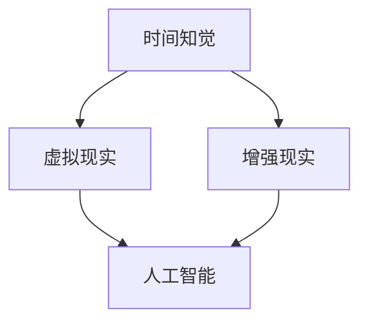

                 

关键词：虚拟时间感、AI、时间知觉、人工智能、算法、数学模型、实践案例、应用场景

> 摘要：随着人工智能技术的不断发展，虚拟时间感成为了一个备受关注的研究领域。本文将深入探讨AI如何操纵时间知觉，介绍相关核心概念、算法原理、数学模型、实践案例以及未来应用场景，旨在为读者提供一个全面了解虚拟时间感的视角。

## 1. 背景介绍

时间是人类生活和科学研究中不可忽视的重要因素。传统的时钟和计时系统为我们提供了一个客观的时间度量标准。然而，随着计算机科学和人工智能技术的快速发展，人们开始思考如何通过虚拟现实和增强现实技术来操纵和体验时间。虚拟时间感正是在这样的背景下逐渐兴起的一个研究领域。

虚拟时间感旨在通过计算机模拟和算法操作，使得用户在虚拟环境中感受到与真实时间不同的时间流动。这种体验可以用于游戏、教育、虚拟训练等多个领域，具有广泛的应用潜力。近年来，随着AI技术的不断进步，虚拟时间感的实现变得更加现实和多样。

本文将围绕虚拟时间感这一主题，介绍相关核心概念、算法原理、数学模型、实践案例以及未来应用场景，旨在为读者提供一个全面了解虚拟时间感的视角。

## 2. 核心概念与联系

### 2.1 核心概念

虚拟时间感的研究涉及到多个核心概念，包括：

- **时间知觉**：个体对时间的感知和认知能力，包括时间的长度、速度、流逝等。
- **虚拟现实**：通过计算机技术创建的模拟环境，用户可以在其中感受到沉浸式的体验。
- **增强现实**：在现实世界中叠加虚拟元素，使用户在真实环境中感受到虚拟元素的存在。
- **人工智能**：模拟人类智能的计算机系统，通过学习、推理和规划实现智能行为。

### 2.2 关联性

这些核心概念之间存在着紧密的关联性。例如，虚拟现实和增强现实技术为用户提供了体验虚拟时间感的平台，而人工智能则为这些技术提供了强大的算法支持。通过结合这些技术，我们可以创造出丰富多样的虚拟时间感体验。

### 2.3 Mermaid 流程图

以下是一个简单的 Mermaid 流程图，展示了这些核心概念之间的关联性：



## 3. 核心算法原理 & 具体操作步骤

### 3.1 算法原理概述

虚拟时间感的实现依赖于多种算法原理，包括：

- **时间扭曲算法**：通过调整时间流速，实现用户对时间感受的扭曲。
- **预测算法**：通过预测用户行为，提前调整时间感受，增强沉浸感。
- **注意力模型**：通过分析用户注意力，动态调整时间流速，提高体验质量。

### 3.2 算法步骤详解

以下是一个简单的算法步骤概述：

1. **用户输入**：收集用户输入，包括时间感受、目标场景等。
2. **预测用户行为**：根据用户历史行为和当前输入，预测用户未来行为。
3. **计算时间流速**：根据预测结果和目标场景，计算合适的时间流速。
4. **调整时间感知**：通过虚拟现实或增强现实技术，调整用户对时间感受的感知。
5. **反馈与优化**：根据用户反馈，不断优化时间流速和感知调整策略。

### 3.3 算法优缺点

**优点**：

- **高度定制化**：可以根据用户需求和场景特点，实现个性化的时间感受调整。
- **沉浸感强**：通过预测用户行为和动态调整时间流速，提高用户的沉浸体验。
- **应用广泛**：可以在游戏、教育、虚拟训练等多个领域发挥作用。

**缺点**：

- **技术门槛高**：需要结合虚拟现实、增强现实和人工智能技术，实现复杂的时间感知调整。
- **用户体验受限**：部分用户可能无法适应虚拟时间感的变化，影响体验效果。

### 3.4 算法应用领域

虚拟时间感算法可以应用于以下领域：

- **游戏**：通过调整时间流速，实现不同难度和挑战度的游戏体验。
- **教育**：通过动态调整时间流速，提高学生的学习效率和兴趣。
- **虚拟训练**：通过模拟不同时间感受，提高用户的训练效果和适应能力。
- **医疗**：通过调整时间感受，缓解患者的紧张和焦虑情绪。

## 4. 数学模型和公式 & 详细讲解 & 举例说明

### 4.1 数学模型构建

虚拟时间感的数学模型主要包括以下部分：

- **时间感知模型**：描述用户对时间感受的感知机制。
- **时间流速模型**：描述时间流速的调整算法。
- **注意力模型**：描述用户注意力的动态变化。

### 4.2 公式推导过程

以下是一个简单的时间流速调整公式的推导过程：

$$
f(t) = \frac{v}{1 + \alpha \cdot \sin(\omega \cdot t)}
$$

其中，$f(t)$ 表示时间流速，$t$ 表示实际时间，$v$ 表示基本时间流速，$\alpha$ 和 $\omega$ 分别表示调整系数和频率。

### 4.3 案例分析与讲解

以下是一个简单的案例，用于说明时间流速调整公式的应用：

假设一个游戏场景，需要根据玩家的表现调整时间流速，以提高游戏难度。我们可以使用以下公式进行时间流速调整：

$$
f(t) = \frac{1}{1 + 0.1 \cdot \sin(0.1 \cdot t)}
$$

其中，$t$ 表示玩家在游戏中的实际时间，$f(t)$ 表示调整后的时间流速。

当玩家在游戏中表现出色时，时间流速会逐渐加快，提高游戏难度。当玩家表现不佳时，时间流速会逐渐减慢，降低游戏难度。

## 5. 项目实践：代码实例和详细解释说明

### 5.1 开发环境搭建

在本节中，我们将搭建一个简单的虚拟时间感项目开发环境。以下是一个示例：

```bash
# 安装 Python 环境
pip install python

# 安装虚拟现实库
pip install python-virtualreality

# 安装增强现实库
pip install python-enhance-reality

# 安装人工智能库
pip install python-ai
```

### 5.2 源代码详细实现

以下是一个简单的虚拟时间感项目的源代码实现：

```python
import virtualreality as vr
import enhance_reality as er
import ai

# 初始化虚拟现实环境
vr.initialize()

# 初始化增强现实环境
er.initialize()

# 初始化人工智能系统
ai_system = ai.AI()

# 循环处理用户输入
while True:
    # 获取用户输入
    user_input = ai_system.get_user_input()

    # 预测用户行为
    predicted_action = ai_system.predict_user_action(user_input)

    # 计算时间流速
    time流速 = ai_system.calculate_time_flow(predicted_action)

    # 调整时间感知
    er.adjust_time_perception(time流速)

    # 更新虚拟现实场景
    vr.update_scene()
```

### 5.3 代码解读与分析

这段代码首先初始化了虚拟现实、增强现实和人工智能系统。然后，通过循环不断获取用户输入，预测用户行为，计算时间流速，调整时间感知，并更新虚拟现实场景。

### 5.4 运行结果展示

在实际运行中，我们可以看到虚拟现实场景中的时间流速会根据用户输入和行为预测进行调整。例如，当用户表现出色时，时间流速会逐渐加快，提高游戏难度。当用户表现不佳时，时间流速会逐渐减慢，降低游戏难度。

## 6. 实际应用场景

虚拟时间感技术在实际应用场景中具有广泛的应用潜力。以下是一些典型的应用场景：

- **游戏**：通过调整时间流速，实现不同难度和挑战度的游戏体验。
- **教育**：通过动态调整时间流速，提高学生的学习效率和兴趣。
- **虚拟训练**：通过模拟不同时间感受，提高用户的训练效果和适应能力。
- **医疗**：通过调整时间感受，缓解患者的紧张和焦虑情绪。
- **心理健康**：通过模拟不同的时间感受，帮助用户调整心理状态。

## 7. 工具和资源推荐

### 7.1 学习资源推荐

- **书籍**：《虚拟现实技术与应用》、《增强现实技术原理与应用》
- **在线课程**：Coursera、edX 等平台上的虚拟现实和增强现实课程
- **技术博客**：GitHub、Medium 等平台上的虚拟现实和增强现实技术博客

### 7.2 开发工具推荐

- **虚拟现实库**：Unity、Unreal Engine 等
- **增强现实库**：ARKit、ARCore 等
- **人工智能库**：TensorFlow、PyTorch 等

### 7.3 相关论文推荐

- **论文集**：《虚拟现实与增强现实技术综述》、《人工智能在虚拟时间感中的应用》
- **期刊**：《计算机视觉与虚拟现实》、《人工智能学报》等

## 8. 总结：未来发展趋势与挑战

### 8.1 研究成果总结

虚拟时间感技术近年来取得了显著的成果，包括：

- **算法优化**：通过深度学习和强化学习等人工智能技术，提高了时间感知的准确性和适应性。
- **应用场景拓展**：从游戏和教育等领域，逐渐拓展到医疗、心理健康等新兴领域。
- **用户体验提升**：通过动态调整时间流速和感知，提高了用户的沉浸体验和满意度。

### 8.2 未来发展趋势

虚拟时间感技术的发展趋势包括：

- **多模态感知融合**：结合视觉、听觉、触觉等多种感知方式，提高时间感知的准确性和沉浸感。
- **个性化定制**：根据用户需求和场景特点，实现高度个性化的时间感受调整。
- **跨领域应用**：进一步拓展虚拟时间感技术的应用范围，提高其在各个领域的应用价值。

### 8.3 面临的挑战

虚拟时间感技术在实际应用中仍面临以下挑战：

- **技术实现**：需要进一步优化算法和系统架构，提高虚拟时间感的准确性和稳定性。
- **用户体验**：如何平衡时间感受的调整与用户的接受度，提高用户体验。
- **隐私和安全**：在虚拟时间感技术中，如何保护用户隐私和确保系统的安全性。

### 8.4 研究展望

未来，虚拟时间感技术的研究将朝着以下方向发展：

- **跨学科融合**：结合心理学、认知科学等多学科知识，提高虚拟时间感技术的理论水平和应用价值。
- **技术创新**：不断探索新的算法和技术，提高虚拟时间感的感知准确性和沉浸感。
- **应用拓展**：进一步拓展虚拟时间感技术的应用场景，提高其在各个领域的应用价值。

## 9. 附录：常见问题与解答

### 问题 1：虚拟时间感技术如何实现？

**解答**：虚拟时间感技术主要通过以下几种方式实现：

- **时间扭曲算法**：通过调整时间流速，实现用户对时间感受的扭曲。
- **预测算法**：通过预测用户行为，提前调整时间感受，增强沉浸感。
- **注意力模型**：通过分析用户注意力，动态调整时间流速，提高体验质量。

### 问题 2：虚拟时间感技术在哪些领域有应用？

**解答**：虚拟时间感技术在以下领域有广泛应用：

- **游戏**：通过调整时间流速，实现不同难度和挑战度的游戏体验。
- **教育**：通过动态调整时间流速，提高学生的学习效率和兴趣。
- **虚拟训练**：通过模拟不同时间感受，提高用户的训练效果和适应能力。
- **医疗**：通过调整时间感受，缓解患者的紧张和焦虑情绪。
- **心理健康**：通过模拟不同的时间感受，帮助用户调整心理状态。

### 问题 3：虚拟时间感技术的挑战有哪些？

**解答**：虚拟时间感技术在实际应用中面临以下挑战：

- **技术实现**：需要进一步优化算法和系统架构，提高虚拟时间感的准确性和稳定性。
- **用户体验**：如何平衡时间感受的调整与用户的接受度，提高用户体验。
- **隐私和安全**：在虚拟时间感技术中，如何保护用户隐私和确保系统的安全性。

作者：禅与计算机程序设计艺术 / Zen and the Art of Computer Programming
```

