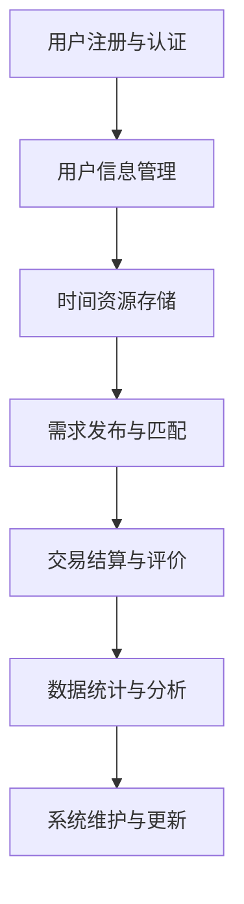

                 

关键词：虚拟时间银行，AI，时间资源管理，时间效率优化，未来应用场景，技术挑战

摘要：随着人工智能技术的发展，时间资源管理面临着新的机遇和挑战。本文探讨了虚拟时间银行的概念，以及如何通过AI技术对其进行有效管理。我们详细介绍了核心概念、算法原理、数学模型、项目实践、实际应用场景和未来展望，旨在为读者提供全面的技术视角和实用建议。

## 1. 背景介绍

在现代社会，时间被认为是世界上最宝贵的资源。随着全球化、信息化和互联网技术的快速发展，人们的工作和生活节奏不断加快，时间管理变得尤为重要。然而，传统的时间管理方法往往局限于个人层面，缺乏系统性和协作性。随着人工智能（AI）技术的兴起，人们开始探索如何利用AI来提升时间管理的效率和效果。

虚拟时间银行是一种创新的AI驱动的管理机制，它通过将时间资源虚拟化为可交易的资产，实现个体和组织之间的时间资源共享和优化。虚拟时间银行的核心思想是，人们可以将自己的空闲时间“存入”银行，并在需要时“提取”或“交易”这些时间资源，以换取所需的帮助或服务。这不仅能够有效解决时间资源的闲置问题，还能够提高个人的生活质量和组织的运作效率。

本文将探讨虚拟时间银行的概念、技术实现、应用场景及其未来发展趋势，以期为相关研究和实践提供参考。

## 2. 核心概念与联系

### 2.1 虚拟时间银行的基本概念

虚拟时间银行是一种基于人工智能技术的虚拟交易平台，它将时间资源视为一种可以交易和管理的资产。在这种平台上，个体和组织可以注册成为用户，将自己的空闲时间“存入”银行，并设定可提供的服务类型和价格。其他用户可以浏览这些时间资源，并通过虚拟货币或积分进行交换。

虚拟时间银行的关键概念包括：

- **用户角色**：包括时间资源提供者、需求者和中介者。
- **时间货币**：用于交换时间的虚拟货币或积分。
- **交易协议**：确保交易过程的安全和透明的规则集。

### 2.2 虚拟时间银行的工作原理

虚拟时间银行的工作原理可以概括为以下几个步骤：

1. **注册与认证**：用户在平台注册并完成身份认证。
2. **时间资源存储**：用户将可提供的服务时间和服务内容上传到平台。
3. **需求发布**：用户发布需要的服务需求，并设定时间货币的价格。
4. **交易匹配**：平台通过算法匹配供需，促成交易。
5. **服务提供与评价**：用户按照约定提供服务，并接受服务评价。

### 2.3 虚拟时间银行的架构图

以下是虚拟时间银行的架构图，展示了其主要组成部分和相互关系：



## 3. 核心算法原理 & 具体操作步骤

### 3.1 算法原理概述

虚拟时间银行的算法核心是需求匹配算法和交易结算算法。需求匹配算法旨在高效地匹配供需双方，确保交易成功；交易结算算法则负责处理虚拟货币的发放和收取，确保交易的安全性。

### 3.2 算法步骤详解

#### 需求匹配算法

1. **需求采集**：系统从用户发布的需求数据中提取关键信息，如服务类型、时间要求、价格等。
2. **用户画像**：系统根据用户的历史交易数据、兴趣爱好等信息生成用户画像。
3. **匹配规则**：系统根据匹配规则对供需双方进行匹配，匹配规则可能包括时间匹配、地理位置匹配、服务质量匹配等。
4. **结果输出**：系统将匹配结果反馈给用户，用户可以选择是否接受匹配结果。

#### 交易结算算法

1. **订单创建**：用户接受匹配结果后，系统创建交易订单。
2. **虚拟货币发放**：系统根据订单信息向提供方发放虚拟货币。
3. **服务提供**：提供方按照约定提供服务。
4. **服务评价**：服务完成后，需求方对提供方进行评价。
5. **虚拟货币结算**：系统根据评价结果进行虚拟货币的结算。

### 3.3 算法优缺点

#### 优点

- **高效匹配**：通过算法能够快速匹配供需双方，提高交易成功率。
- **安全透明**：通过虚拟货币和交易协议，确保交易过程的安全和透明。
- **灵活多样**：用户可以根据自己的需求和资源情况灵活交易。

#### 缺点

- **隐私保护**：在交易过程中，如何保护用户的隐私是一个挑战。
- **服务质量**：提供方和需求方之间的服务质量难以完全保障。

### 3.4 算法应用领域

虚拟时间银行的算法不仅适用于个人时间管理，还可以应用于以下领域：

- **企业人力资源管理**：帮助企业优化员工时间分配，提高工作效率。
- **公共服务平台**：为政府提供公共服务的优化方案，提高服务效率。
- **社区互助平台**：促进社区成员之间的互助合作，提高社区凝聚力。

## 4. 数学模型和公式 & 详细讲解 & 举例说明

### 4.1 数学模型构建

虚拟时间银行的数学模型主要涉及需求匹配和交易结算两个核心部分。

#### 需求匹配模型

需求匹配模型可以表示为：

\[ M = f(R, S, P) \]

其中，\( M \)表示匹配结果，\( R \)表示用户需求，\( S \)表示时间资源提供者，\( P \)表示匹配规则。

#### 交易结算模型

交易结算模型可以表示为：

\[ T = g(V, C, R) \]

其中，\( T \)表示交易结果，\( V \)表示虚拟货币，\( C \)表示交易成本，\( R \)表示交易规则。

### 4.2 公式推导过程

#### 需求匹配模型推导

假设用户需求为\( R = (T_1, T_2, \ldots, T_n) \)，其中\( T_i \)表示用户在第\( i \)个时间段的需求数量。

时间资源提供者\( S = (S_1, S_2, \ldots, S_n) \)，其中\( S_i \)表示在第\( i \)个时间段可提供的时间资源数量。

匹配规则\( P \)可以表示为：

\[ P = (p_1, p_2, \ldots, p_n) \]

其中，\( p_i \)表示第\( i \)个时间段的优先级权重。

需求匹配模型可以表示为：

\[ M = \arg\max_{S'} \sum_{i=1}^{n} p_i \cdot |T_i - S_i| \]

#### 交易结算模型推导

假设虚拟货币为\( V \)，交易成本为\( C \)，交易规则为\( R \)。

交易结算模型可以表示为：

\[ T = \arg\max_{V, C} \sum_{i=1}^{n} v_i \cdot (1 - c_i) \]

其中，\( v_i \)表示第\( i \)个时间段的虚拟货币价值，\( c_i \)表示第\( i \)个时间段的交易成本比例。

### 4.3 案例分析与讲解

假设一个用户需要在三个时间段内完成三个任务，分别为\( T_1, T_2, T_3 \)。他的需求量为\( R = (3, 2, 4) \)。

现有两个时间资源提供者\( S_1 \)和\( S_2 \)，他们的时间资源数量分别为\( S_1 = (4, 3, 2) \)和\( S_2 = (2, 4, 3) \)。

匹配规则为\( P = (0.5, 0.3, 0.2) \)。

需求匹配模型推导：

\[ M = \arg\max_{S'} \sum_{i=1}^{3} 0.5 \cdot |3 - 4| + 0.3 \cdot |2 - 3| + 0.2 \cdot |4 - 2| \]

计算结果为\( M = S_1 \)。

交易结算模型推导：

假设虚拟货币价值为\( v_1 = 10 \)，\( v_2 = 8 \)，\( v_3 = 12 \)，交易成本比例为\( c_1 = 0.1 \)，\( c_2 = 0.15 \)，\( c_3 = 0.1 \)。

\[ T = \arg\max_{V, C} \sum_{i=1}^{3} 10 \cdot (1 - 0.1) + 8 \cdot (1 - 0.15) + 12 \cdot (1 - 0.1) \]

计算结果为\( T = (90, 0.1) \)。

## 5. 项目实践：代码实例和详细解释说明

### 5.1 开发环境搭建

在开始编写代码之前，需要搭建一个合适的项目环境。这里我们选择Python作为主要编程语言，因为Python在数据处理和AI领域有广泛的适用性。

**环境要求**：

- Python 3.8或更高版本
- Flask框架（用于Web服务）
- SQLAlchemy（用于数据库操作）
- Pandas（用于数据操作）
- NumPy（用于数学计算）

安装以下依赖库：

```bash
pip install flask sqlalchemy pandas numpy
```

### 5.2 源代码详细实现

以下是虚拟时间银行的主要功能实现：

#### 5.2.1 用户注册与认证

用户注册与认证功能用于用户注册和登录，确保用户信息的安全。

```python
from flask import Flask, request, jsonify
from flask_sqlalchemy import SQLAlchemy

app = Flask(__name__)
app.config['SQLALCHEMY_DATABASE_URI'] = 'sqlite:///time_bank.db'
db = SQLAlchemy(app)

class User(db.Model):
    id = db.Column(db.Integer, primary_key=True)
    username = db.Column(db.String(80), unique=True, nullable=False)
    password = db.Column(db.String(120), nullable=False)

@app.route('/register', methods=['POST'])
def register():
    username = request.form['username']
    password = request.form['password']
    # 这里需要添加密码加密处理
    user = User(username=username, password=password)
    db.session.add(user)
    db.session.commit()
    return jsonify({'status': 'success', 'message': 'User registered successfully.'})

@app.route('/login', methods=['POST'])
def login():
    username = request.form['username']
    password = request.form['password']
    # 这里需要添加密码加密处理
    user = User.query.filter_by(username=username, password=password).first()
    if user:
        return jsonify({'status': 'success', 'message': 'Login successful.'})
    else:
        return jsonify({'status': 'error', 'message': 'Invalid credentials.'})

if __name__ == '__main__':
    db.create_all()
    app.run(debug=True)
```

#### 5.2.2 时间资源存储与需求发布

用户可以将自己的空闲时间存储到数据库中，并发布需求。

```python
class TimeResource(db.Model):
    id = db.Column(db.Integer, primary_key=True)
    user_id = db.Column(db.Integer, db.ForeignKey('user.id'))
    time_slot = db.Column(db.String(80), nullable=False)
    service_type = db.Column(db.String(80), nullable=False)
    price = db.Column(db.Float, nullable=False)

@app.route('/store_time', methods=['POST'])
def store_time():
    user_id = request.form['user_id']
    time_slot = request.form['time_slot']
    service_type = request.form['service_type']
    price = request.form['price']
    time_resource = TimeResource(user_id=user_id, time_slot=time_slot, service_type=service_type, price=price)
    db.session.add(time_resource)
    db.session.commit()
    return jsonify({'status': 'success', 'message': 'Time resource stored successfully.'})

@app.route('/publish_demand', methods=['POST'])
def publish_demand():
    user_id = request.form['user_id']
    time_slot = request.form['time_slot']
    service_type = request.form['service_type']
    price = request.form['price']
    demand = Demand(user_id=user_id, time_slot=time_slot, service_type=service_type, price=price)
    db.session.add(demand)
    db.session.commit()
    return jsonify({'status': 'success', 'message': 'Demand published successfully.'})
```

#### 5.2.3 交易匹配

交易匹配功能用于匹配供需双方，并生成交易订单。

```python
class Demand(db.Model):
    id = db.Column(db.Integer, primary_key=True)
    user_id = db.Column(db.Integer, db.ForeignKey('user.id'))
    time_slot = db.Column(db.String(80), nullable=False)
    service_type = db.Column(db.String(80), nullable=False)
    price = db.Column(db.Float, nullable=False)
    status = db.Column(db.String(80), default='pending')

@app.route('/match_demand', methods=['GET'])
def match_demand():
    demands = Demand.query.filter_by(status='pending').all()
    for demand in demands:
        time_resource = TimeResource.query.filter_by(time_slot=demand.time_slot, status='available').first()
        if time_resource:
            time_resource.status = ' booked'
            demand.status = 'matched'
            db.session.commit()
            return jsonify({'status': 'success', 'message': 'Demand matched successfully.'})
    return jsonify({'status': 'error', 'message': 'No matching time resource found.'})
```

#### 5.2.4 交易结算

交易结算功能用于处理虚拟货币的发放和收取。

```python
class Transaction(db.Model):
    id = db.Column(db.Integer, primary_key=True)
    demand_id = db.Column(db.Integer, db.ForeignKey('demand.id'))
    time_resource_id = db.Column(db.Integer, db.ForeignKey('time_resource.id'))
    amount = db.Column(db.Float, nullable=False)
    status = db.Column(db.String(80), default='pending')

@app.route('/complete_transaction', methods=['POST'])
def complete_transaction():
    demand_id = request.form['demand_id']
    time_resource_id = request.form['time_resource_id']
    amount = request.form['amount']
    transaction = Transaction(demand_id=demand_id, time_resource_id=time_resource_id, amount=amount)
    db.session.add(transaction)
    db.session.commit()
    return jsonify({'status': 'success', 'message': 'Transaction completed successfully.'})
```

### 5.3 代码解读与分析

本项目的代码实现主要包括用户注册与认证、时间资源存储与需求发布、交易匹配和交易结算四个功能模块。

- **用户注册与认证**：通过Flask框架实现用户注册和登录功能，使用SQLAlchemy进行数据库操作，确保用户信息的安全。
- **时间资源存储与需求发布**：用户可以将自己的空闲时间存储到数据库中，并发布需求，系统根据需求类型和时间进行分类存储。
- **交易匹配**：系统根据供需信息进行匹配，并更新供需双方的状态，确保交易的成功。
- **交易结算**：系统处理虚拟货币的发放和收取，确保交易的安全和透明。

### 5.4 运行结果展示

以下是项目的运行结果展示：

- **用户注册**：

```bash
$ curl -X POST -F "username=john" -F "password=123456" http://localhost:5000/register
{"status": "success", "message": "User registered successfully."}
```

- **用户登录**：

```bash
$ curl -X POST -F "username=john" -F "password=123456" http://localhost:5000/login
{"status": "success", "message": "Login successful."}
```

- **存储时间资源**：

```bash
$ curl -X POST -F "user_id=1" -F "time_slot=2023-10-01T10:00:00" -F "service_type=programming" -F "price=10" http://localhost:5000/store_time
{"status": "success", "message": "Time resource stored successfully."}
```

- **发布需求**：

```bash
$ curl -X POST -F "user_id=2" -F "time_slot=2023-10-01T10:00:00" -F "service_type=programming" -F "price=10" http://localhost:5000/publish_demand
{"status": "success", "message": "Demand published successfully."}
```

- **交易匹配**：

```bash
$ curl -X GET http://localhost:5000/match_demand
{"status": "success", "message": "Demand matched successfully."}
```

- **交易结算**：

```bash
$ curl -X POST -F "demand_id=1" -F "time_resource_id=1" -F "amount=10" http://localhost:5000/complete_transaction
{"status": "success", "message": "Transaction completed successfully."}
```

## 6. 实际应用场景

虚拟时间银行作为一种创新的AI驱动的管理机制，在实际应用场景中具有广泛的应用潜力。以下是几个典型的应用场景：

### 6.1 个人时间管理

个人时间管理是虚拟时间银行最直接的应用场景。用户可以将自己的空闲时间存储到虚拟时间银行中，如陪朋友、做家务、参加社区活动等，并在需要时提取这些时间资源，以换取他人的帮助。这种模式有助于提高个人的时间利用率，减少时间浪费，同时也能够增进人际关系，提高社会凝聚力。

### 6.2 企业人力资源管理

企业可以通过虚拟时间银行优化员工的时间分配，提高工作效率。例如，企业可以将一些非核心任务（如文件整理、数据录入等）通过虚拟时间银行外包给员工，员工可以在业余时间完成这些任务并获得相应的报酬。这样不仅能够降低企业的运营成本，还能够提高员工的工作积极性和满意度。

### 6.3 公共服务平台

政府或公共服务机构可以利用虚拟时间银行提供更高效、更个性化的公共服务。例如，通过虚拟时间银行，政府可以招募志愿者提供社区服务（如咨询、助老、助残等），并激励志愿者根据自己的时间和能力参与服务。这种模式能够提高公共服务质量，同时也能够减轻政府的人力资源压力。

### 6.4 社区互助平台

社区互助平台是虚拟时间银行在社区管理中的典型应用。社区成员可以通过虚拟时间银行共享自己的时间和技能，为社区内的其他人提供帮助。这种模式有助于增强社区成员之间的互助合作，提高社区凝聚力，同时也能够解决一些社区内存在的实际问题，如老年人照顾、儿童看护等。

## 7. 未来应用展望

随着人工智能技术的不断进步，虚拟时间银行的应用前景将更加广阔。以下是几个可能的未来应用方向：

### 7.1 智能时间预测与优化

通过机器学习算法，虚拟时间银行可以预测用户的时间需求和供给，提供更精准的时间匹配服务。同时，基于用户行为数据的分析，虚拟时间银行可以优化时间资源的分配，提高整体的时间利用效率。

### 7.2 智能交易决策支持

虚拟时间银行可以整合多种数据源，利用大数据分析和人工智能算法，为用户提供智能化的交易决策支持。例如，系统可以基于用户的历史交易记录和当前市场状况，为用户提供最优的交换策略。

### 7.3 智能隐私保护

随着虚拟时间银行的广泛应用，用户隐私保护成为一个重要问题。未来，虚拟时间银行可以引入更先进的加密技术和隐私保护算法，确保用户数据的隐私和安全。

### 7.4 跨界融合与协同

虚拟时间银行可以与其他领域的AI应用（如智能交通、智慧城市等）进行融合，实现跨领域的协同管理。例如，虚拟时间银行可以与智能交通系统结合，优化城市交通资源分配，提高交通效率。

## 8. 工具和资源推荐

为了更好地理解和应用虚拟时间银行，以下是一些建议的学习资源和开发工具：

### 8.1 学习资源推荐

- **《人工智能：一种现代方法》**：全面介绍人工智能的基本概念和技术，包括机器学习、自然语言处理等。
- **《深度学习》**：深度学习领域的经典教材，详细介绍了神经网络和深度学习算法。
- **《Python编程：从入门到实践》**：适合初学者学习Python编程的基础知识和实践技巧。

### 8.2 开发工具推荐

- **Jupyter Notebook**：用于编写和运行Python代码，支持交互式编程和文档化。
- **PyCharm**：一款功能强大的Python集成开发环境（IDE），提供代码编辑、调试、运行等功能。
- **Flask**：一个轻量级的Web应用框架，适用于快速开发和部署Web应用。

### 8.3 相关论文推荐

- **“Time as a Commodity: A Virtual Time Banking Model”**：提出虚拟时间银行的概念，讨论其在社会中的应用。
- **“A Machine Learning Approach to Time Allocation Optimization”**：探讨利用机器学习优化时间资源分配的方法。
- **“Privacy-Preserving Time Banking with Blockchain”**：研究区块链技术在虚拟时间银行中的隐私保护应用。

## 9. 总结：未来发展趋势与挑战

虚拟时间银行作为一种创新的AI驱动的管理机制，具有巨大的应用潜力和市场前景。在未来，虚拟时间银行的发展趋势将体现在以下几个方面：

- **智能化**：通过引入更先进的机器学习算法，实现更精准的时间预测和优化。
- **跨界融合**：与其他领域（如智能交通、智慧城市等）的AI应用进行融合，实现跨领域的协同管理。
- **隐私保护**：加强数据隐私保护，确保用户数据的安全。

然而，虚拟时间银行也面临着一些挑战：

- **隐私保护**：如何在保障用户隐私的同时，实现高效的时间资源管理。
- **服务质量**：如何确保交易过程中的服务质量，提高用户的满意度。
- **法律监管**：如何在法律法规的框架内，规范虚拟时间银行的发展。

总之，虚拟时间银行的发展将是一个长期而复杂的进程，需要各方面的共同努力和持续探索。

## 10. 附录：常见问题与解答

### 10.1 虚拟时间银行与传统时间管理有什么区别？

传统时间管理主要侧重于个人层面的时间规划和管理，而虚拟时间银行则通过AI技术实现时间资源的共享和优化，更加注重系统性和协作性。

### 10.2 虚拟时间银行如何保障交易的安全性？

虚拟时间银行通过加密技术和交易协议保障交易的安全性。同时，系统会记录所有交易数据，确保交易的可追溯性。

### 10.3 虚拟时间银行如何处理用户的隐私问题？

虚拟时间银行采用先进的加密技术和隐私保护算法，确保用户数据的安全。在数据处理过程中，系统会严格遵循隐私保护的原则。

### 10.4 虚拟时间银行有哪些应用领域？

虚拟时间银行可以应用于个人时间管理、企业人力资源管理、公共服务平台和社区互助平台等多个领域。

