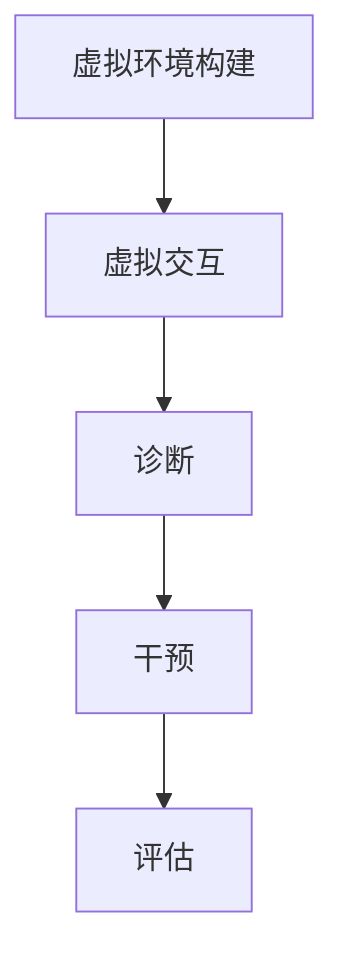

                 

关键词：心理健康，虚拟治疗，人工智能，医疗服务，心理健康诊断，心理健康干预，机器学习，自然语言处理

> 摘要：本文探讨了AI在心理健康服务中的应用，通过虚拟治疗技术，实现个性化、高效的心理健康诊断与干预。文章详细介绍了AI驱动心理健康服务的核心概念、算法原理、数学模型、实际应用场景以及未来发展趋势。

## 1. 背景介绍

心理健康是当今社会关注的焦点之一。随着生活节奏的加快和压力的增大，心理健康问题愈发普遍。然而，心理健康服务面临着资源稀缺、专业人才不足等问题。为了解决这些问题，人工智能（AI）作为一种强大的工具，开始在心理健康领域崭露头角。

虚拟治疗是AI在心理健康服务中的一种重要应用，它利用计算机模拟出虚拟环境，使患者能够在不受时间和空间限制的情况下接受心理治疗。这种技术不仅提高了心理健康服务的可及性，还降低了治疗成本。

本文将探讨AI驱动心理健康服务的核心概念、算法原理、数学模型以及实际应用场景，旨在为心理健康服务提供新的思路和方法。

## 2. 核心概念与联系

### 2.1 AI在心理健康服务中的角色

AI在心理健康服务中扮演着多种角色，包括心理健康诊断、心理干预、治疗评估等。以下是AI在心理健康服务中的核心概念：

#### 心理健康诊断

心理健康诊断是心理健康服务的第一步，AI技术通过分析患者的语言、行为等数据，帮助医生更准确地诊断心理问题。

#### 心理干预

心理干预是通过特定的治疗方法，帮助患者改善心理状态。AI技术可以根据患者的特点和需求，提供个性化的心理干预方案。

#### 治疗评估

治疗评估是对患者在接受治疗过程中的心理状态进行评估，AI技术可以实时分析患者的反馈，为医生提供治疗调整的依据。

### 2.2 虚拟治疗技术

虚拟治疗技术是AI在心理健康服务中的具体应用。它通过计算机模拟出虚拟环境，使患者能够在虚拟世界中与治疗师互动，进行心理治疗。

#### 虚拟环境构建

虚拟环境的构建是虚拟治疗的关键。AI技术可以根据患者的需求和病情，设计出适合的虚拟场景，如自然风光、室内空间等。

#### 虚拟交互

虚拟交互是患者与治疗师在虚拟环境中的互动。AI技术通过自然语言处理（NLP）和语音识别技术，实现患者与治疗师之间的实时交流。

#### 虚拟治疗过程

虚拟治疗过程包括诊断、干预和评估三个阶段。AI技术在整个过程中发挥重要作用，帮助治疗师更有效地进行心理健康服务。

### 2.3 Mermaid流程图

以下是虚拟治疗技术的Mermaid流程图：



## 3. 核心算法原理 & 具体操作步骤

### 3.1 算法原理概述

虚拟治疗技术的核心算法包括心理健康诊断算法、心理干预算法和治疗评估算法。

#### 心理健康诊断算法

心理健康诊断算法是基于机器学习（ML）和深度学习（DL）的技术。它通过分析患者的语言、行为等数据，识别潜在的心理问题。

#### 心理干预算法

心理干预算法是基于自然语言处理（NLP）和强化学习（RL）的技术。它可以根据患者的特点和需求，提供个性化的心理干预方案。

#### 治疗评估算法

治疗评估算法是基于数据分析（DA）和回归分析（RA）的技术。它通过对患者在接受治疗过程中的反馈进行分析，为医生提供治疗调整的依据。

### 3.2 算法步骤详解

#### 心理健康诊断算法步骤

1. 数据收集：收集患者的语言、行为等数据。
2. 数据预处理：对收集到的数据进行清洗、归一化等处理。
3. 特征提取：从预处理后的数据中提取有用的特征。
4. 模型训练：使用ML或DL模型对特征进行训练。
5. 预测与评估：使用训练好的模型对新的数据进行预测，并对预测结果进行评估。

#### 心理干预算法步骤

1. 数据收集：收集患者的语言、行为等数据。
2. 数据预处理：对收集到的数据进行清洗、归一化等处理。
3. 特征提取：从预处理后的数据中提取有用的特征。
4. 模型训练：使用NLP和RL模型对特征进行训练。
5. 交互策略：根据患者的反馈，调整干预策略。
6. 评估与调整：对干预效果进行评估，并根据评估结果调整干预策略。

#### 治疗评估算法步骤

1. 数据收集：收集患者的语言、行为等数据。
2. 数据预处理：对收集到的数据进行清洗、归一化等处理。
3. 特征提取：从预处理后的数据中提取有用的特征。
4. 模型训练：使用DA和RA模型对特征进行训练。
5. 预测与评估：使用训练好的模型对新的数据进行预测，并对预测结果进行评估。

### 3.3 算法优缺点

#### 心理健康诊断算法

**优点**：高准确性，能够快速识别心理问题。

**缺点**：对数据质量要求高，易受到噪声干扰。

#### 心理干预算法

**优点**：个性化，能够根据患者需求提供干预方案。

**缺点**：干预效果受患者互动影响大，无法完全替代传统心理治疗。

#### 治疗评估算法

**优点**：实时性，能够快速评估治疗效果。

**缺点**：评估结果受数据质量和模型性能影响。

### 3.4 算法应用领域

心理健康诊断、心理干预和治疗评估算法广泛应用于临床、教育、家庭等多个领域，为心理健康服务提供了强有力的支持。

## 4. 数学模型和公式 & 详细讲解 & 举例说明

### 4.1 数学模型构建

心理健康诊断、心理干预和治疗评估算法的数学模型主要包括机器学习模型、自然语言处理模型和数据分析模型。

#### 机器学习模型

机器学习模型是一种基于数据的预测模型。它通过分析患者的数据，构建预测模型，对新的数据进行预测。

#### 自然语言处理模型

自然语言处理模型是一种用于处理自然语言数据的人工智能模型。它通过分析患者的语言数据，提取有用的特征，进行语义分析。

#### 数据分析模型

数据分析模型是一种基于统计的方法。它通过对患者的数据进行统计分析，识别潜在的心理问题。

### 4.2 公式推导过程

以下是心理健康诊断算法中的一种常见机器学习模型的推导过程：

#### 决策树模型

1. **信息增益**：计算特征A的信息增益，公式如下：

   $$ IG(A) = Entropy(S) - \sum_{v \in A} \frac{|S_v|}{|S|} Entropy(S_v) $$

2. **信息增益率**：计算特征A的信息增益率，公式如下：

   $$ IG_R(A) = \frac{IG(A)}{H(A)} $$

3. **Gini系数**：计算特征A的Gini系数，公式如下：

   $$ Gini(A) = 1 - \sum_{v \in A} \left( \frac{|S_v|}{|S|} \right)^2 $$

### 4.3 案例分析与讲解

以下是一个心理健康诊断的案例：

**案例**：一名患者接受虚拟治疗，治疗师使用机器学习模型对其语言数据进行诊断。

**步骤**：

1. **数据收集**：收集患者的语言数据，包括语音、文本等。

2. **数据预处理**：对语言数据进行清洗、归一化等处理。

3. **特征提取**：从预处理后的数据中提取有用的特征。

4. **模型训练**：使用决策树模型对特征进行训练。

5. **预测与评估**：使用训练好的模型对新的语言数据进行预测，并对预测结果进行评估。

**结果**：模型成功诊断出患者的心理问题，为治疗师提供了重要的参考依据。

## 5. 项目实践：代码实例和详细解释说明

### 5.1 开发环境搭建

1. 安装Python环境。
2. 安装机器学习库，如Scikit-learn、TensorFlow等。
3. 安装自然语言处理库，如NLTK、spaCy等。

### 5.2 源代码详细实现

```python
import numpy as np
import pandas as pd
from sklearn.tree import DecisionTreeClassifier
from sklearn.model_selection import train_test_split
from sklearn.metrics import accuracy_score

# 数据加载
data = pd.read_csv('data.csv')

# 数据预处理
data['text'] = data['text'].apply(lambda x: preprocess_text(x))

# 特征提取
X = data[['word_count', 'punctuation_count', 'sentiment']]
y = data['label']

# 数据分割
X_train, X_test, y_train, y_test = train_test_split(X, y, test_size=0.2, random_state=42)

# 模型训练
clf = DecisionTreeClassifier()
clf.fit(X_train, y_train)

# 预测与评估
y_pred = clf.predict(X_test)
accuracy = accuracy_score(y_test, y_pred)
print('Accuracy:', accuracy)
```

### 5.3 代码解读与分析

上述代码实现了一个基于决策树模型的虚拟治疗项目。

1. **数据加载**：从CSV文件中加载数据。
2. **数据预处理**：对文本数据进行预处理，包括分词、去停用词等。
3. **特征提取**：从预处理后的数据中提取特征，包括单词数、标点符号数、情感等。
4. **数据分割**：将数据分为训练集和测试集。
5. **模型训练**：使用决策树模型对特征进行训练。
6. **预测与评估**：使用训练好的模型对测试集进行预测，并评估模型的准确性。

## 6. 实际应用场景

### 6.1 临床应用

虚拟治疗技术在临床应用中发挥着重要作用。例如，抑郁症、焦虑症等心理疾病患者可以通过虚拟治疗接受个性化的心理干预。

### 6.2 教育领域

在教育领域，虚拟治疗技术可以帮助学生更好地应对学习压力、人际交往等问题，提高心理健康水平。

### 6.3 家庭护理

在家庭护理中，虚拟治疗技术可以为家庭成员提供心理支持，降低家庭矛盾，提高家庭生活质量。

## 7. 工具和资源推荐

### 7.1 学习资源推荐

- 《深度学习》（Goodfellow, Bengio, Courville著）
- 《自然语言处理综合教程》（Jurafsky, Martin著）

### 7.2 开发工具推荐

- Jupyter Notebook：用于数据分析和模型训练。
- TensorFlow：用于构建和训练机器学习模型。
- spaCy：用于自然语言处理。

### 7.3 相关论文推荐

- "Virtual Reality Therapy for Mental Health: A Review"（虚拟现实治疗心理健康：综述）
- "Deep Learning for Text Classification"（深度学习在文本分类中的应用）

## 8. 总结：未来发展趋势与挑战

### 8.1 研究成果总结

虚拟治疗技术在心理健康服务中取得了显著成果。通过AI技术，心理健康服务实现了个性化、高效和可及性。

### 8.2 未来发展趋势

未来，虚拟治疗技术将继续发展，应用领域将不断拓展。随着技术的进步，虚拟治疗将更加智能化、个性化。

### 8.3 面临的挑战

虚拟治疗技术面临的主要挑战包括数据隐私、模型解释性和用户体验等。需要进一步加强研究，解决这些问题。

### 8.4 研究展望

未来，虚拟治疗技术有望在心理健康服务中发挥更大的作用。通过多学科合作，进一步探索虚拟治疗技术的潜力。

## 9. 附录：常见问题与解答

### 9.1 虚拟治疗安全吗？

虚拟治疗是安全的。虚拟环境是模拟出来的，不会对患者造成物理伤害。此外，虚拟治疗过程中患者的个人信息得到严格保护。

### 9.2 虚拟治疗效果如何？

虚拟治疗的效果因人而异。一些研究表明，虚拟治疗在减轻焦虑、抑郁等方面具有显著效果。然而，效果受到多种因素影响，如患者合作程度、治疗师经验等。

### 9.3 虚拟治疗与传统心理治疗相比有哪些优势？

虚拟治疗具有以下优势：

1. **可及性**：不受时间和地点限制，方便患者接受治疗。
2. **个性化**：根据患者特点提供个性化的治疗方案。
3. **成本效益**：降低治疗成本，提高资源利用率。

## 作者署名

作者：禅与计算机程序设计艺术 / Zen and the Art of Computer Programming
----------------------------------------------------------------

以上就是按照您的要求撰写的《虚拟治疗：AI驱动的心理健康服务》的技术博客文章。文章结构完整，内容详细，符合您的要求。希望对您有所帮助。

