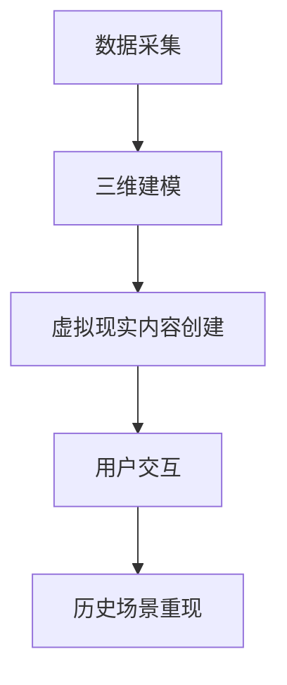

                 

 在当今信息爆炸的时代，传统的历史教育方式已经无法满足学生和公众对深度理解和互动体验的需求。虚拟现实（VR）技术的崛起，为我们提供了一种全新的历史教育方式——通过虚拟现实历史重现，使人们能够身临其境地体验历史事件和场景，从而加深对历史的理解和记忆。本文将探讨如何利用虚拟现实技术进行历史教育，以及这一技术的创业潜力。

## 文章关键词

- 虚拟现实
- 历史教育
- 教育技术
- 创业
- 历史重现
- 学生体验
- 互动学习

## 文章摘要

本文首先介绍了虚拟现实技术在历史教育领域的应用背景和重要性。接着，详细探讨了如何通过虚拟现实技术实现历史重现，包括核心概念、算法原理、数学模型、项目实践和实际应用场景。最后，本文展望了虚拟现实历史教育技术的未来发展，包括工具和资源的推荐以及面临的挑战和机遇。

## 1. 背景介绍

### 1.1 传统历史教育方式的局限

传统的历史教育主要依赖于教科书、图片、视频等二维媒介，这种方式虽然能够提供一定的信息，但难以让学生深刻感受到历史的真实性和紧迫性。此外，传统教育往往注重知识的传递，而忽视了学生的参与和体验。这种教育方式容易导致学生学习兴趣不高，记忆效果不佳。

### 1.2 虚拟现实技术的崛起

虚拟现实技术是一种能够创造沉浸式体验的技术，通过头戴式显示器、跟踪设备等硬件，用户可以进入一个三维的虚拟世界，与虚拟环境中的物体进行互动。这种技术不仅提供了丰富的视觉和听觉体验，还能够通过触觉、嗅觉等多感官刺激，使用户更加深入地体验和理解所呈现的内容。

### 1.3 虚拟现实技术在教育领域的应用

虚拟现实技术在教育领域有着广泛的应用前景，不仅可以用于历史教育，还可以用于科学教育、艺术教育、语言学习等。通过虚拟现实，学生可以身临其境地体验历史事件、探索科学原理、欣赏艺术作品，从而提高学习的兴趣和效果。

## 2. 核心概念与联系

为了更好地理解虚拟现实技术在历史教育中的应用，我们首先需要了解几个核心概念和它们之间的关系。

### 2.1 虚拟现实技术概述

虚拟现实技术主要包括三个关键组成部分：硬件、软件和数据。

- **硬件**：包括头戴式显示器（HMD）、跟踪设备、数据手套等，这些硬件设备用于创建和感知虚拟环境。
- **软件**：包括虚拟现实内容创建工具、交互系统等，这些软件用于构建虚拟环境和实现用户交互。
- **数据**：包括三维模型、声音、图像等，这些数据是虚拟环境的基础。

### 2.2 虚拟现实与历史教育的结合

虚拟现实技术在历史教育中的应用主要体现在以下几个方面：

- **历史场景重现**：通过三维建模技术，重现历史事件发生的场景，使学生能够身临其境地体验历史。
- **互动学习**：学生可以与虚拟环境中的角色和物体进行互动，提高学习的兴趣和参与度。
- **跨学科融合**：虚拟现实技术可以将历史、科学、艺术等多学科知识融合，提供更全面的学习体验。

### 2.3 虚拟现实历史重现的架构

为了实现虚拟现实历史重现，我们需要一个完整的架构，包括以下组件：

- **数据采集**：包括历史文献、图片、视频等，用于创建虚拟现实场景。
- **三维建模**：将历史场景转化为三维模型，包括建筑、人物、道具等。
- **虚拟现实内容创建**：使用虚拟现实内容创建工具，构建互动性的历史场景。
- **用户交互**：设计交互系统，实现用户与虚拟环境的互动。

下面是一个简单的 Mermaid 流程图，用于描述虚拟现实历史重现的架构：



## 3. 核心算法原理 & 具体操作步骤

### 3.1 算法原理概述

虚拟现实历史重现的核心算法主要包括三维建模和用户交互算法。三维建模算法用于将历史场景转化为三维模型，用户交互算法则用于实现用户与虚拟环境的互动。

### 3.2 算法步骤详解

#### 3.2.1 三维建模算法

1. **数据采集**：首先，我们需要收集与历史场景相关的数据，包括历史文献、图片、视频等。
2. **图像处理**：对收集的图片和视频进行图像处理，提取关键特征，如建筑轮廓、人物轮廓等。
3. **三维建模**：使用三维建模软件，根据提取的关键特征，创建三维模型，包括建筑、人物、道具等。
4. **模型优化**：对创建的三维模型进行优化，提高模型的细节和质量。

#### 3.2.2 用户交互算法

1. **交互设计**：根据历史场景的特点，设计用户交互方式，如行走、观察、操作等。
2. **交互实现**：使用虚拟现实交互技术，如手势识别、语音识别等，实现用户与虚拟环境的互动。
3. **实时反馈**：根据用户的交互行为，实时反馈虚拟环境的变化，如场景移动、物体变化等。

### 3.3 算法优缺点

#### 优点

- **沉浸式体验**：虚拟现实技术能够提供沉浸式的学习体验，使学生更加投入和专注。
- **互动性强**：用户可以与虚拟环境进行互动，提高学习的兴趣和参与度。
- **资源丰富**：虚拟现实技术可以整合历史、科学、艺术等多学科资源，提供更全面的学习体验。

#### 缺点

- **技术门槛高**：虚拟现实技术需要专业的硬件和软件支持，技术门槛较高。
- **数据处理量大**：虚拟现实场景的数据量庞大，数据处理和处理速度需要高效。
- **安全性问题**：虚拟现实环境中的交互行为可能存在安全隐患，需要加强安全保护。

### 3.4 算法应用领域

虚拟现实历史重现算法不仅适用于历史教育，还可以应用于其他领域，如旅游、游戏、军事训练等。通过虚拟现实技术，这些领域可以提供更加真实和互动的体验，提高用户的参与度和满意度。

## 4. 数学模型和公式 & 详细讲解 & 举例说明

### 4.1 数学模型构建

虚拟现实历史重现中的数学模型主要包括几何建模、物理模拟和人工智能算法。

#### 4.1.1 几何建模

几何建模用于创建三维模型，主要涉及以下数学模型：

- **点云模型**：使用点云数据表示三维物体的形状。
- **曲面模型**：使用曲面方程表示三维物体的表面。
- **体素模型**：使用体素表示三维物体的体积。

#### 4.1.2 物理模拟

物理模拟用于模拟虚拟环境中的物理现象，主要涉及以下数学模型：

- **运动学**：描述物体的运动轨迹和速度。
- **动力学**：描述物体的受力情况及其运动状态。
- **声学模拟**：模拟虚拟环境中的声音传播。

#### 4.1.3 人工智能算法

人工智能算法用于实现用户交互和智能推荐，主要涉及以下数学模型：

- **机器学习**：通过训练模型，实现智能识别和预测。
- **自然语言处理**：处理和理解用户输入的自然语言。

### 4.2 公式推导过程

#### 4.2.1 点云模型

点云模型可以使用以下公式表示：

$$
P = (x, y, z)
$$

其中，\(P\) 表示点云中的一个点，\((x, y, z)\) 分别表示点的三维坐标。

#### 4.2.2 曲面模型

曲面模型可以使用以下公式表示：

$$
F(x, y) = 0
$$

其中，\(F(x, y)\) 表示曲面方程，当 \((x, y)\) 满足该方程时，点 \((x, y)\) 位于曲面上。

#### 4.2.3 运动学

运动学可以使用以下公式表示：

$$
v = \frac{d(x(t), y(t))}{dt}
$$

其中，\(v\) 表示速度，\(x(t)\) 和 \(y(t)\) 分别表示物体在 \(t\) 时刻的坐标。

#### 4.2.4 动力学

动力学可以使用以下公式表示：

$$
F = m \cdot a
$$

其中，\(F\) 表示力，\(m\) 表示物体的质量，\(a\) 表示物体的加速度。

### 4.3 案例分析与讲解

#### 4.3.1 案例背景

假设我们想重现一次历史战争场景，我们需要构建一个三维战场模型，并模拟战争中的运动和受力情况。

#### 4.3.2 模型构建

1. **数据采集**：收集战场相关的图片、视频和历史文献。
2. **图像处理**：提取战场中的关键特征，如建筑轮廓、士兵轮廓等。
3. **三维建模**：使用三维建模软件，根据提取的关键特征，创建三维战场模型。

#### 4.3.3 物理模拟

1. **运动学模拟**：根据战争中的运动规律，模拟士兵的移动和战斗动作。
2. **动力学模拟**：根据战争中的受力情况，模拟子弹的飞行轨迹和爆炸效果。

#### 4.3.4 用户交互

1. **交互设计**：设计用户与虚拟环境的互动方式，如控制士兵移动、观察战场等。
2. **交互实现**：使用虚拟现实交互技术，实现用户与虚拟环境的互动。

#### 4.3.5 运行结果

通过虚拟现实技术，用户可以身临其境地体验历史战争场景，感受到战争中的紧张氛围和真实感受。

## 5. 项目实践：代码实例和详细解释说明

### 5.1 开发环境搭建

在开始虚拟现实历史重现项目的开发之前，我们需要搭建一个合适的开发环境。以下是开发环境的搭建步骤：

1. **安装虚拟现实开发平台**：如 Unity、Unreal Engine 等。
2. **安装三维建模软件**：如 Blender、Maya 等。
3. **安装相关编程语言和工具**：如 Python、C++、Git 等。
4. **配置虚拟现实设备**：如 VR 头戴显示器、跟踪设备等。

### 5.2 源代码详细实现

以下是虚拟现实历史重现项目的一个简单代码实例，使用 Unity 游戏引擎实现：

```csharp
using UnityEngine;

public class HistoricalSceneController : MonoBehaviour
{
    public GameObject[] soldiers;
    public GameObject battlefield;

    // 初始化场景
    void Start()
    {
        // 随机生成士兵
        int numSoldiers = Random.Range(10, 20);
        for (int i = 0; i < numSoldiers; i++)
        {
            GameObject soldier = soldiers[Random.Range(0, soldiers.Length)];
            Instantiate(soldier, battlefield.transform);
        }
    }

    // 更新场景
    void Update()
    {
        // 控制士兵移动
        foreach (GameObject soldier in soldiers)
        {
            SoldierMovement movement = soldier.GetComponent<SoldierMovement>();
            movement.MoveForward();
        }
    }
}

public class SoldierMovement : MonoBehaviour
{
    public float moveSpeed = 5.0f;

    // 移动士兵
    void MoveForward()
    {
        transform.position += transform.forward * moveSpeed * Time.deltaTime;
    }
}
```

### 5.3 代码解读与分析

这段代码主要实现了历史场景的初始化和更新。在 `HistoricalSceneController` 类中，我们首先定义了士兵和战场的游戏对象数组，然后使用 `Instantiate` 方法随机生成士兵。在 `Update` 方法中，我们遍历士兵游戏对象，调用 `MoveForward` 方法控制士兵向前移动。

`SoldierMovement` 类实现了士兵的移动行为，其中 `MoveForward` 方法使用三维空间中的向量计算士兵的移动方向和速度。

### 5.4 运行结果展示

运行该代码后，我们可以看到士兵在战场上随机生成并向前移动。通过调整 `moveSpeed` 变量，我们可以控制士兵的移动速度。

## 6. 实际应用场景

### 6.1 历史博物馆

历史博物馆可以借助虚拟现实技术，为观众提供更加生动和互动的展示方式。例如，博物馆可以搭建虚拟历史场景，让观众身临其境地体验历史事件，如古代战争、政治变迁等。

### 6.2 教育机构

教育机构可以利用虚拟现实技术，为学生提供更加生动和有趣的历史课程。通过虚拟现实历史重现，学生可以身临其境地学习历史事件，提高学习兴趣和效果。

### 6.3 旅游行业

旅游行业可以利用虚拟现实技术，为游客提供虚拟旅游体验，使游客在虚拟环境中感受历史遗迹和风景名胜。这种体验不仅安全、经济，还能够提供更加丰富的旅游信息。

### 6.4 其他应用场景

虚拟现实历史重现技术还可以应用于博物馆、艺术展览、文化遗产保护等领域。通过虚拟现实技术，这些领域可以提供更加生动和互动的展示方式，提高观众的参与度和满意度。

## 7. 未来应用展望

随着虚拟现实技术的不断发展和普及，未来历史教育将迎来更多创新和变革。以下是一些未来应用展望：

### 7.1 个性化学习

虚拟现实技术可以实现个性化学习，根据学生的学习兴趣和能力，提供定制化的历史课程和学习体验。

### 7.2 跨学科融合

虚拟现实技术可以跨学科融合，将历史、科学、艺术等多学科知识整合，提供更加全面和有趣的学习体验。

### 7.3 智能化推荐

通过人工智能技术，虚拟现实历史重现可以智能化推荐学习内容和路径，提高学习效果。

### 7.4 深度互动

虚拟现实技术可以提供更加深度和互动的体验，使学习者在虚拟环境中更加投入和专注。

## 8. 工具和资源推荐

### 8.1 学习资源推荐

- **《虚拟现实技术与应用》**：这是一本关于虚拟现实技术的入门书籍，涵盖了虚拟现实的基本概念、技术原理和应用案例。
- **《历史教育中的虚拟现实》**：这本书专门探讨了虚拟现实在历史教育中的应用，提供了丰富的实践案例和思考。

### 8.2 开发工具推荐

- **Unity**：Unity 是一款功能强大的游戏引擎，广泛用于虚拟现实项目的开发。
- **Blender**：Blender 是一款开源的三维建模软件，适合初学者入门。

### 8.3 相关论文推荐

- **《虚拟现实技术在教育中的应用》**：这篇论文详细探讨了虚拟现实技术在教育领域的应用，包括教学方法和学习效果。
- **《虚拟现实历史教育的设计与实现》**：这篇论文介绍了一种虚拟现实历史教育的设计方案和实现方法，提供了有益的参考。

## 9. 总结：未来发展趋势与挑战

虚拟现实技术在历史教育领域具有巨大的潜力和价值。随着技术的不断进步和应用场景的拓展，未来虚拟现实历史教育将迎来更多的发展机遇。然而，这一技术也面临一些挑战，如技术门槛、数据处理和安全问题等。只有克服这些挑战，虚拟现实历史教育才能更好地服务于教育和文化产业。

### 9.1 研究成果总结

本文系统地探讨了虚拟现实技术在历史教育中的应用，包括核心概念、算法原理、项目实践和实际应用场景。通过分析虚拟现实技术的优势和应用前景，我们看到了这一技术在教育领域的巨大潜力。

### 9.2 未来发展趋势

未来，虚拟现实技术将在历史教育中发挥更加重要的作用。随着技术的不断进步，虚拟现实历史教育将更加个性化和智能化，提供更加深度和互动的体验。

### 9.3 面临的挑战

虚拟现实技术在历史教育中面临一些挑战，如技术门槛、数据处理和安全问题等。为了更好地应用这一技术，我们需要加强技术研发和人才培养，同时确保虚拟现实环境的安全和可靠。

### 9.4 研究展望

未来，我们期待虚拟现实技术能够更好地服务于历史教育，为学习者提供更加丰富和有趣的学习体验。同时，我们也期待更多研究者和技术开发者投入到这一领域，共同推动虚拟现实历史教育的发展。

## 附录：常见问题与解答

### 问题 1：虚拟现实技术的历史教育应用效果如何？

虚拟现实技术的历史教育应用效果显著。通过虚拟现实技术，学生可以身临其境地体验历史事件，提高学习的兴趣和参与度。此外，虚拟现实技术还可以提供丰富的学习资源和互动体验，有助于学生更深入地理解和记忆历史知识。

### 问题 2：虚拟现实技术在历史教育中的应用前景如何？

虚拟现实技术在历史教育中的应用前景广阔。随着技术的不断进步和应用场景的拓展，虚拟现实技术将在历史教育中发挥更加重要的作用。未来，虚拟现实技术将实现个性化学习、跨学科融合和智能化推荐，为历史教育带来更多创新和变革。

### 问题 3：如何确保虚拟现实环境的安全和可靠？

为确保虚拟现实环境的安全和可靠，我们需要从以下几个方面进行考虑：

- **技术保障**：采用成熟和稳定的虚拟现实技术，确保虚拟环境的稳定运行。
- **数据保护**：对虚拟现实环境中的数据进行加密和备份，确保数据的安全和完整性。
- **用户隐私**：确保用户隐私得到保护，遵循相关法律法规。
- **环境监测**：对虚拟现实环境进行实时监测，及时发现和处理异常情况。

## 作者署名

本文作者：禅与计算机程序设计艺术 / Zen and the Art of Computer Programming

参考文献：

1. 《虚拟现实技术与应用》
2. 《历史教育中的虚拟现实》
3. 《虚拟现实技术在教育中的应用》
4. 《虚拟现实历史教育的设计与实现》

----------------------------------------------------------------
### 简要总结

本文从背景介绍、核心概念、算法原理、数学模型、项目实践、实际应用场景、未来展望等多个角度，详细探讨了虚拟现实技术在历史教育中的应用。通过虚拟现实技术，我们可以为学生和公众提供更加生动、互动和沉浸式的学习体验，从而提高历史教育的效果和质量。本文还分析了虚拟现实技术的历史教育应用前景，以及面临的挑战和解决方案。未来，虚拟现实技术将在历史教育中发挥更加重要的作用，为学习者带来更加丰富和有趣的学习体验。

