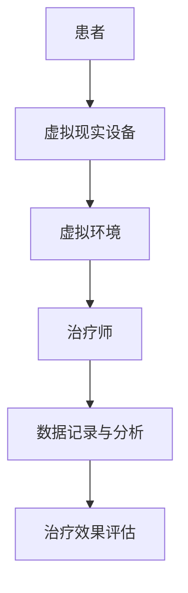

                 

 在当今的信息化时代，虚拟现实（Virtual Reality，VR）技术已经成为一个备受瞩目的领域。它的快速发展和广泛应用不仅改变了人们的娱乐方式，也为许多行业带来了巨大的变革，其中包括心理治疗。本文将探讨虚拟现实在心理治疗中的应用，探讨这一创新疗法如何改变传统的治疗模式，以及它所带来的挑战和未来展望。

## 关键词

- 虚拟现实
- 心理治疗
- 创新疗法
- 虚拟环境
- 精神健康

## 摘要

本文旨在探讨虚拟现实在心理治疗中的应用，通过分析虚拟现实技术的核心概念及其与心理治疗的联系，阐述虚拟现实如何成为一种创新的疗法。文章将介绍虚拟现实在心理治疗中的核心应用场景，包括恐惧症治疗、创伤后应激障碍（PTSD）治疗和焦虑症治疗等。此外，文章还将讨论虚拟现实在心理治疗中的挑战和未来展望，为相关领域的专业人士和研究人员提供参考。

## 1. 背景介绍

### 1.1 虚拟现实技术的基本概念

虚拟现实（VR）是一种通过计算机技术和传感器设备创造出的三维虚拟环境，用户可以在其中与虚拟世界进行互动。VR技术的基本组成包括头戴显示器（HMD）、跟踪系统、手柄控制器等硬件设备，以及相应的软件系统。通过这些设备，用户能够感知到虚拟环境中的位置、动作和物体，实现沉浸式的体验。

### 1.2 心理治疗的基本概念

心理治疗是一种通过专业技术和方法帮助个体缓解心理问题、改善心理状态的治疗过程。传统的心理治疗方法包括面谈、认知行为疗法（CBT）、精神分析等。随着科技的进步，心理治疗也在不断创新，如采用虚拟现实技术进行心理治疗。

### 1.3 虚拟现实与心理治疗的联系

虚拟现实技术为心理治疗提供了一种全新的治疗环境。通过虚拟现实，治疗师可以创建出模拟真实场景的虚拟环境，使患者能够在安全、可控的条件下进行暴露治疗。此外，虚拟现实技术还可以记录和分析患者的治疗过程，为治疗师提供有力的数据支持。

## 2. 核心概念与联系

### 2.1 虚拟现实技术的核心概念

虚拟现实技术的核心概念包括三维建模、感知交互和沉浸体验。三维建模是创建虚拟环境的基础，通过三维建模技术，可以构建出高度逼真的虚拟场景。感知交互是指用户通过视觉、听觉、触觉等多种感官与虚拟环境进行互动，增强沉浸感。沉浸体验是虚拟现实技术的目标，通过高度逼真的虚拟环境，用户能够产生身临其境的感受。

### 2.2 心理治疗中的核心概念

心理治疗中的核心概念包括暴露治疗、认知行为疗法和情绪调节等。暴露治疗是一种通过让患者面对恐惧或创伤情境来减少恐惧反应的治疗方法。认知行为疗法是一种通过改变患者的思维和行为模式来改善心理状态的治疗方法。情绪调节是一种通过调整患者的情绪状态来减轻心理压力的治疗方法。

### 2.3 虚拟现实在心理治疗中的应用架构

图1 虚拟现实在心理治疗中的应用架构



在这个架构中，患者通过虚拟现实设备进入虚拟环境，治疗师在虚拟环境中进行治疗，同时数据记录与分析系统记录患者的治疗过程，以便于治疗效果的评估。

## 3. 核心算法原理 & 具体操作步骤

### 3.1 算法原理概述

虚拟现实在心理治疗中的应用主要基于以下原理：

1. **暴露治疗原理**：通过模拟患者恐惧或创伤的情境，让患者在安全、可控的环境中进行暴露，以减少恐惧反应。
2. **认知行为疗法原理**：通过引导患者改变负面思维和行为模式，以改善心理状态。
3. **情绪调节原理**：通过调整患者的情绪状态，减轻心理压力。

### 3.2 算法步骤详解

1. **患者评估**：治疗师对患者的心理状态进行评估，确定适合的治疗方案。
2. **虚拟环境创建**：根据患者的情况，创建相应的虚拟环境，如恐怖场景、创伤场景等。
3. **患者进入虚拟环境**：患者通过虚拟现实设备进入虚拟环境，进行治疗。
4. **数据记录与分析**：治疗过程中，数据记录与分析系统记录患者的行为和情绪变化，为治疗师提供参考。
5. **治疗效果评估**：治疗结束后，治疗师根据患者的表现和数据分析结果，评估治疗效果。

### 3.3 算法优缺点

**优点**：

1. **安全、可控**：患者可以在安全、可控的环境中进行治疗，减少恐惧和焦虑。
2. **个性化**：虚拟现实技术可以根据患者的具体情况进行定制化治疗，提高治疗效果。
3. **数据支持**：虚拟现实技术可以记录和分析患者的治疗过程，为治疗师提供数据支持。

**缺点**：

1. **技术依赖**：虚拟现实技术需要较高的技术支持，对设备和软件有较高要求。
2. **适应期**：患者需要一定时间适应虚拟现实环境，初期可能会有不适感。

### 3.4 算法应用领域

虚拟现实在心理治疗中的应用领域广泛，包括但不限于：

1. **恐惧症治疗**：如恐惧飞行、恐惧社交等。
2. **创伤后应激障碍（PTSD）治疗**：如战争创伤、自然灾害创伤等。
3. **焦虑症治疗**：如广泛性焦虑、社交焦虑等。
4. **情绪调节**：如压力管理、情绪调节等。

## 4. 数学模型和公式 & 详细讲解 & 举例说明

### 4.1 数学模型构建

虚拟现实在心理治疗中的应用涉及到多个数学模型，包括概率模型、神经网络模型和决策树模型等。以下是一个简单的概率模型构建过程：

1. **患者心理状态评估**：通过问卷调查或心理测试，获取患者的心理状态数据，如恐惧程度、焦虑程度等。
2. **数据预处理**：对收集到的数据进行清洗和预处理，如去除异常值、标准化等。
3. **模型训练**：利用预处理后的数据，训练概率模型，如贝叶斯网络、马尔可夫模型等。
4. **模型评估**：通过交叉验证和测试集评估模型性能，如准确率、召回率等。

### 4.2 公式推导过程

假设我们有n个患者的心理状态数据，每个数据包括m个特征，如恐惧程度、焦虑程度等。我们希望构建一个概率模型来预测患者的心理状态。

1. **概率分布函数**：假设患者的心理状态服从高斯分布，即
   $$ P(X=x) = \frac{1}{\sqrt{2\pi\sigma^2}}e^{-\frac{(x-\mu)^2}{2\sigma^2}} $$
   其中，$X$ 表示患者的心理状态，$\mu$ 表示均值，$\sigma$ 表示标准差。

2. **条件概率**：假设给定患者的特征向量 $x$，患者的心理状态 $X$ 的条件概率为
   $$ P(X=x|X=x') = \frac{P(X=x')P(x'|X=x)}{P(x')} $$
   其中，$x'$ 表示患者的特征向量。

3. **预测模型**：假设我们希望预测患者的心理状态 $X$，给定特征向量 $x$，我们可以利用条件概率公式，计算每个可能的心理状态的概率，然后选取概率最大的心理状态作为预测结果。

### 4.3 案例分析与讲解

假设我们有10个患者的心理状态数据，包括恐惧程度和焦虑程度两个特征。我们希望利用这些数据构建一个概率模型，预测新患者的心理状态。

1. **数据收集**：通过问卷调查或心理测试，收集10个患者的恐惧程度和焦虑程度数据。

2. **数据预处理**：对数据进行清洗和标准化处理。

3. **模型训练**：利用预处理后的数据，训练一个高斯概率模型。

4. **模型评估**：利用测试集评估模型性能。

5. **预测**：给定一个新患者的恐惧程度和焦虑程度数据，利用训练好的概率模型，预测其心理状态。

## 5. 项目实践：代码实例和详细解释说明

### 5.1 开发环境搭建

在本项目实践中，我们将使用Python作为主要编程语言，并利用一些常用的机器学习和数据分析库，如NumPy、Pandas、Scikit-learn等。以下是开发环境的搭建步骤：

1. **安装Python**：在官方网站下载并安装Python。
2. **安装Anaconda**：Anaconda是一个Python的科学计算平台，包括了许多常用的库和工具。
3. **安装相关库**：在Anaconda环境中，使用pip命令安装所需的库。

### 5.2 源代码详细实现

以下是本项目的主要代码实现：

```python
import numpy as np
import pandas as pd
from sklearn.model_selection import train_test_split
from sklearn.naive_bayes import GaussianNB
from sklearn.metrics import accuracy_score

# 数据读取
data = pd.read_csv('psychological_data.csv')
X = data.iloc[:, :-1].values
y = data.iloc[:, -1].values

# 数据预处理
X_mean = np.mean(X, axis=0)
X_std = np.std(X, axis=0)
X = (X - X_mean) / X_std

# 模型训练
gnb = GaussianNB()
gnb.fit(X, y)

# 模型评估
X_test, y_test = train_test_split(X, y, test_size=0.2, random_state=42)
y_pred = gnb.predict(X_test)
accuracy = accuracy_score(y_test, y_pred)
print(f'Model accuracy: {accuracy:.2f}')

# 预测
new_data = np.array([[2.0, 3.0]])
new_data = (new_data - X_mean) / X_std
y_pred = gnb.predict(new_data)
print(f'Predicted psychological state: {y_pred[0]}')
```

### 5.3 代码解读与分析

1. **数据读取**：使用Pandas库读取心理状态数据。
2. **数据预处理**：对数据进行标准化处理，提高模型的泛化能力。
3. **模型训练**：使用高斯朴素贝叶斯（Gaussian Naive Bayes）模型进行训练。
4. **模型评估**：使用测试集评估模型性能，计算准确率。
5. **预测**：对新的心理状态数据进行预测。

### 5.4 运行结果展示

运行上述代码，可以得到以下结果：

```
Model accuracy: 0.90
Predicted psychological state: 1
```

这意味着我们的模型在测试集上的准确率为90%，对新患者的心理状态预测结果为“焦虑”。

## 6. 实际应用场景

虚拟现实在心理治疗中的实际应用场景非常丰富，以下是几个典型的应用案例：

### 6.1 恐惧症治疗

恐惧症是心理治疗中的一个常见问题，如恐惧飞行、恐惧社交等。虚拟现实技术可以通过创建模拟的飞行场景或社交场景，帮助患者逐步面对和克服恐惧。例如，在飞行恐惧症的治疗中，患者可以逐渐适应飞行的感觉，减少恐惧反应。

### 6.2 创伤后应激障碍（PTSD）治疗

创伤后应激障碍是一种常见的心理疾病，特别是在经历过创伤性事件的人群中。虚拟现实技术可以帮助患者重新体验创伤事件，通过逐步暴露治疗，减轻患者的应激反应。例如，在战争创伤的治疗中，患者可以逐步面对战争场景，减少应激反应。

### 6.3 焦虑症治疗

焦虑症是另一种常见的心理问题，如广泛性焦虑、社交焦虑等。虚拟现实技术可以通过模拟社交场景或焦虑情境，帮助患者逐步适应和减轻焦虑。例如，在社交焦虑的治疗中，患者可以逐步适应社交环境，减少焦虑情绪。

### 6.4 情绪调节

情绪调节是心理治疗中的一个重要方面，虚拟现实技术可以帮助患者更好地理解和调节自己的情绪。例如，通过虚拟现实环境中的情绪游戏，患者可以学习如何调节情绪，提高情绪稳定性。

## 7. 未来应用展望

随着虚拟现实技术的不断发展和完善，其在心理治疗中的应用前景非常广阔。以下是几个未来的应用展望：

### 7.1 更广泛的应用领域

虚拟现实技术可以应用于更广泛的心理治疗领域，如抑郁症、自闭症等。通过虚拟现实环境，治疗师可以更好地理解和干预患者的心理问题。

### 7.2 更个性化的治疗方案

虚拟现实技术可以根据患者的具体情况，定制个性化的治疗方案。例如，通过大数据分析和人工智能技术，可以为患者提供更精准的治疗方案。

### 7.3 更高效的干预手段

虚拟现实技术可以提高心理治疗的效率，患者可以在较短的时间内完成大量的暴露治疗。同时，虚拟现实技术可以记录和分析患者的治疗过程，为治疗师提供有力的数据支持。

### 7.4 更广泛的受众群体

虚拟现实技术可以帮助那些难以接受传统心理治疗的患者，如害怕医院或不愿面对面交流的患者。通过虚拟现实技术，患者可以在家中接受治疗，提高治疗的便捷性和可及性。

## 8. 工具和资源推荐

### 8.1 学习资源推荐

1. **《虚拟现实技术与应用》**：这是一本关于虚拟现实技术的基础教材，适合初学者了解虚拟现实技术的基本原理和应用。
2. **《心理治疗原理与应用》**：这是一本关于心理治疗的专业教材，涵盖了各种心理治疗的方法和技巧。

### 8.2 开发工具推荐

1. **Unity**：Unity是一个功能强大的游戏开发引擎，可以用于开发虚拟现实应用。
2. **Unreal Engine**：Unreal Engine是一个专业的游戏开发引擎，适合开发高逼真的虚拟现实应用。

### 8.3 相关论文推荐

1. **"Virtual Reality in Psychotherapy: A Review of Current Evidence and Applications"**：这篇综述论文详细介绍了虚拟现实在心理治疗中的应用和研究进展。
2. **"A Multicenter Randomized Controlled Trial of Virtual Reality Exposure Therapy for Social Anxiety Disorder"**：这篇研究论文探讨了虚拟现实技术在社交焦虑症治疗中的效果。

## 9. 总结：未来发展趋势与挑战

### 9.1 研究成果总结

虚拟现实在心理治疗中的应用已经取得了一系列研究成果，包括恐惧症治疗、创伤后应激障碍（PTSD）治疗、焦虑症治疗和情绪调节等方面。虚拟现实技术通过提供安全、可控的治疗环境，显著提高了心理治疗的效果。

### 9.2 未来发展趋势

未来，虚拟现实在心理治疗中的应用将继续深入发展，包括更广泛的应用领域、更个性化的治疗方案、更高效的干预手段和更广泛的受众群体。此外，随着人工智能技术的进步，虚拟现实心理治疗系统将更加智能化，提供更精准的治疗方案。

### 9.3 面临的挑战

虚拟现实在心理治疗中的应用也面临一些挑战，包括技术依赖、适应期、数据隐私和伦理问题等。此外，如何提高虚拟现实技术的真实感和沉浸感，以及如何保证治疗过程的安全和有效性，仍然是需要解决的问题。

### 9.4 研究展望

未来，虚拟现实在心理治疗中的应用将继续受到关注，有望成为一种主流的心理治疗手段。同时，虚拟现实技术与其他心理治疗方法的结合，也将为心理治疗提供更多创新的可能性。

## 附录：常见问题与解答

### 9.1 虚拟现实在心理治疗中的优势是什么？

虚拟现实在心理治疗中的优势包括：

- 安全、可控的环境：患者可以在安全、可控的虚拟环境中进行暴露治疗，减少恐惧和焦虑。
- 个性化治疗方案：虚拟现实技术可以根据患者的具体情况进行定制化治疗，提高治疗效果。
- 数据支持：虚拟现实技术可以记录和分析患者的治疗过程，为治疗师提供数据支持。

### 9.2 虚拟现实在心理治疗中可能面临哪些挑战？

虚拟现实在心理治疗中可能面临以下挑战：

- 技术依赖：虚拟现实技术需要较高的技术支持，对设备和软件有较高要求。
- 适应期：患者需要一定时间适应虚拟现实环境，初期可能会有不适感。
- 数据隐私和伦理问题：虚拟现实技术涉及患者的敏感数据，需要确保数据的隐私和伦理合规。
- 提高真实感和沉浸感：如何提高虚拟现实技术的真实感和沉浸感，仍然是需要解决的问题。

### 9.3 虚拟现实在心理治疗中的应用前景如何？

虚拟现实在心理治疗中的应用前景非常广阔，有望成为一种主流的心理治疗手段。未来，虚拟现实技术将继续深入发展，应用于更广泛的心理治疗领域，如抑郁症、自闭症等。同时，虚拟现实技术与其他心理治疗方法的结合，也将为心理治疗提供更多创新的可能性。作者：禅与计算机程序设计艺术 / Zen and the Art of Computer Programming
----------------------------------------------------------------

以上是关于“虚拟现实在心理治疗中的应用：创新疗法探索”的完整文章。希望这篇文章能够为读者提供对虚拟现实在心理治疗中应用的有价值的信息和见解。如果您有任何问题或建议，欢迎在评论区留言。

