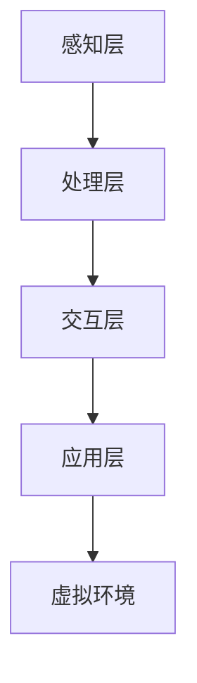

                 

关键词：虚拟现实、注意力沉浸、用户体验、注意力分散、技术实现、应用场景、未来展望

摘要：本文将探讨虚拟现实（VR）在提升注意力沉浸体验方面的应用。通过对虚拟现实技术的基本概念和原理的介绍，我们将深入分析如何通过VR技术实现高度沉浸的注意力体验，并探讨其在不同领域的应用。同时，本文还将展望虚拟现实技术在未来发展中所面临的挑战和机遇。

## 1. 背景介绍

虚拟现实（Virtual Reality，VR）是一种通过计算机技术模拟出三维虚拟环境，使用户能够与之进行交互和感知的沉浸式体验。自20世纪80年代以来，VR技术逐渐从实验室走向市场，成为了娱乐、教育、医疗等领域的重要工具。

随着硬件和软件技术的不断发展，VR设备的性能和用户体验得到显著提升。尤其是近年来，高性能显卡、更舒适的VR头显、精确的运动追踪器等技术的进步，使得虚拟现实在视觉、听觉、触觉等方面实现了更加逼真的效果，从而吸引了越来越多的用户。

注意力沉浸体验（Attentional Immersion Experience）是指用户在虚拟环境中能够高度集中注意力，与虚拟环境产生强烈的互动，并感受到高度的沉浸感。这种体验不仅能够带来娱乐上的满足，还能够应用于教育和培训等领域，提高学习效果和培训效率。

本文将重点讨论虚拟现实在注意力沉浸体验中的应用，分析其原理、技术实现、应用场景以及未来展望。

### 虚拟现实技术的发展历程

虚拟现实技术的研究可以追溯到1960年代。1968年，美国程序员伊凡·苏瑟兰（Ivan Sutherland）在麻省理工学院（MIT）创建了第一个头戴式显示器，被称为“达摩克利斯之剑”（The Sword of Damocles）。这一发明奠定了虚拟现实技术的基础。

在接下来的几十年里，虚拟现实技术经历了多个阶段的发展。早期的VR设备主要依赖于计算机图形学技术，使用简单的二维图像模拟三维环境。随着计算机性能的提升，三维图形渲染技术逐渐成熟，VR设备的沉浸感也得到了显著提升。

1990年代，VR技术开始应用于军事模拟、医学培训等领域。然而，由于技术瓶颈和成本问题，VR设备并没有得到广泛普及。进入21世纪，随着图形处理单元（GPU）和处理器性能的不断提升，VR设备的价格逐渐下降，性能也得到了显著提高。

近年来，VR技术的突破主要表现在以下几个方面：

1. **更真实的视觉体验**：高性能显卡和更先进的渲染技术使得VR环境的视觉效果更加真实，分辨率和帧率得到大幅提升。
2. **更舒适的设备设计**：VR头显的设计更加贴合人脑，减少了佩戴时的不适感。同时，光学技术的进步使得头显的光线透射率更高，用户可以清晰地看到虚拟环境中的细节。
3. **精确的运动追踪**：高精度的运动追踪技术使得用户在虚拟环境中的动作能够被精确捕捉，从而实现了更加自然的交互体验。
4. **虚拟触觉和嗅觉**：随着传感器技术的进步，虚拟触觉和嗅觉等感官模拟技术也逐渐成熟，为用户提供了更加全面的沉浸体验。

### 注意力沉浸体验的概念及其重要性

注意力沉浸体验（Attentional Immersion Experience）是指用户在虚拟环境中能够高度集中注意力，与虚拟环境产生强烈的互动，并感受到高度的沉浸感。在这种体验中，用户不仅能够看到、听到、触摸到虚拟环境中的元素，还能够通过交互产生情感共鸣，从而产生一种身临其境的感觉。

注意力沉浸体验的重要性在于：

1. **增强娱乐体验**：在虚拟现实游戏中，用户通过高度沉浸的体验能够更好地享受游戏乐趣，提高游戏体验的满意度。
2. **提升学习效果**：在教育领域，通过虚拟现实技术模拟真实场景，用户可以在更加沉浸的环境中学习知识，提高学习效率和记忆效果。
3. **改善医疗训练**：在医疗培训中，虚拟现实技术可以为医学生提供真实的手术模拟训练，提高手术技能和应对突发事件的能力。
4. **心理治疗**：通过虚拟现实技术模拟特定场景，可以帮助心理治疗师进行暴露疗法，治疗如恐惧症等心理疾病。

总之，注意力沉浸体验不仅提升了虚拟现实的应用价值，还为各个领域提供了创新的解决方案。

## 2. 核心概念与联系

### 虚拟现实技术的基本概念

虚拟现实技术（VR）的核心在于创造一个可以与用户交互的虚拟环境。这一环境通常包括以下三个主要组件：头戴式显示器（HMD）、运动追踪器和交互设备。

1. **头戴式显示器（HMD）**：HMD是用户感知虚拟环境的主要工具，通过光学透镜将虚拟图像投影到用户的视网膜上。随着技术的发展，HMD的分辨率和显示效果得到了显著提升，使得虚拟环境的视觉效果更加真实。
   
2. **运动追踪器**：运动追踪器用于跟踪用户的头部和手部的运动，将实际动作转化为虚拟环境中的动作。高精度的运动追踪技术能够确保用户的每一个微小动作都能被准确捕捉，从而实现高度沉浸的交互体验。

3. **交互设备**：交互设备包括数据手套、手柄等，用户可以通过这些设备在虚拟环境中进行操作。这些设备的进步使得用户与虚拟环境的交互更加自然和直观。

### 注意力沉浸体验的原理

注意力沉浸体验依赖于用户对虚拟环境的感知和互动。以下是实现高度沉浸的注意力体验的一些关键原理：

1. **视觉感知**：高分辨率和高帧率的显示技术能够提供清晰的视觉效果，减少视觉疲劳，增强用户的沉浸感。
2. **听觉感知**：通过高质量的立体声音效，用户可以感受到虚拟环境中的声音方位和动态变化，提高沉浸体验的真实感。
3. **触觉感知**：虚拟触觉技术能够模拟触感，让用户在虚拟环境中感受到物体的材质和纹理，增强互动的逼真度。
4. **动作捕捉**：精确的动作捕捉技术能够将用户的实际动作映射到虚拟环境中，使用户在虚拟环境中的动作更加自然流畅。
5. **情感共鸣**：通过虚拟现实技术模拟的情感反应和故事情节，用户能够在虚拟环境中产生情感共鸣，进一步加深沉浸体验。

### 虚拟现实技术在注意力沉浸体验中的应用架构

虚拟现实技术在注意力沉浸体验中的应用架构可以概括为以下几个层次：

1. **感知层**：包括视觉、听觉、触觉等感知设备，用于捕捉和反馈用户在虚拟环境中的感知信息。
2. **处理层**：处理层负责处理感知层收集的信息，包括图像渲染、声音处理、触觉反馈等，以确保虚拟环境的逼真度和实时性。
3. **交互层**：交互层包括用户与虚拟环境的交互接口，如头戴式显示器、运动追踪器和交互设备。这一层确保用户能够自然地与虚拟环境进行互动。
4. **应用层**：应用层是虚拟现实技术的核心，它根据具体应用需求，设计并实现各种虚拟环境，如游戏、教育、医疗等。

下面是一个简单的Mermaid流程图，展示了虚拟现实技术在注意力沉浸体验中的应用架构：



在这个架构中，感知层负责捕捉用户的感知信息，处理层对这些信息进行处理以生成逼真的虚拟环境，交互层提供用户与虚拟环境的互动接口，而应用层则根据实际需求设计并实现各种虚拟环境。

### 虚拟现实技术在不同领域中的应用

虚拟现实技术在多个领域已经展现出其独特的优势和应用潜力。以下是几个典型的应用领域及其优势：

1. **游戏娱乐**：虚拟现实技术为游戏提供了前所未有的沉浸体验。用户可以在虚拟的游戏世界中自由探索、互动，享受身临其境的感觉。此外，虚拟现实游戏还可以通过多人在线互动，增强社交体验。

2. **教育培训**：虚拟现实技术能够模拟真实场景，为教育提供更加生动和互动的学习体验。例如，医学生可以通过虚拟手术训练提高手术技能，工程师可以在虚拟环境中进行产品设计，学生可以通过虚拟实验室进行科学实验。

3. **医疗健康**：虚拟现实技术在医疗健康领域的应用非常广泛，包括手术模拟、疼痛管理、心理治疗等。通过虚拟手术模拟，医生可以在进行实际手术前进行练习，提高手术成功率。虚拟现实还可以用于疼痛管理和心理治疗，帮助患者减轻疼痛和缓解心理压力。

4. **城市规划与建筑**：虚拟现实技术可以帮助城市规划师和建筑师在项目初期就构建出三维模型，进行虚拟现实展示。这不仅可以提高设计效率，还可以让客户更直观地了解设计方案，从而减少修改次数，降低成本。

5. **军事模拟**：虚拟现实技术在军事模拟训练中发挥了重要作用。通过虚拟战场模拟，士兵可以进行战术训练、武器操作练习等，提高实际战斗能力。

6. **旅游体验**：虚拟现实技术可以让用户在家中体验全球各地的美景和文化。例如，旅游公司可以提供虚拟旅游服务，让用户在虚拟环境中“游览”名胜古迹，提高旅游体验。

### 虚拟现实技术的未来发展趋势

虚拟现实技术在未来将继续朝着更高分辨率、更逼真效果、更便捷体验的方向发展。以下是几个可能的发展趋势：

1. **更先进的显示技术**：随着OLED、microLED等显示技术的进步，虚拟现实设备的分辨率和色彩表现将得到显著提升，提供更加真实的视觉体验。

2. **多感官融合**：虚拟现实技术将不仅仅局限于视觉和听觉，还将融合触觉、嗅觉等感官体验，使用户能够更加全面地感知虚拟环境。

3. **更智能的交互方式**：人工智能和机器学习技术的应用将使虚拟现实设备的交互方式更加智能和自然。例如，通过语音识别和手势控制，用户可以更加方便地与虚拟环境进行互动。

4. **增强现实（AR）与虚拟现实（VR）的融合**：未来，AR和VR技术将更加融合，提供更加丰富的应用场景。例如，在购物中，用户可以通过AR技术查看商品的三维模型，并通过VR技术体验商品的细节。

5. **更加普及的应用场景**：随着技术的成熟和成本的下降，虚拟现实技术将在更多领域得到应用，如远程办公、远程教育、智能家居等。

## 3. 核心算法原理 & 具体操作步骤

### 3.1 算法原理概述

虚拟现实技术在实现注意力沉浸体验方面，依赖于多个核心算法和技术，其中最为重要的包括图像渲染算法、运动追踪算法和交互算法。

#### 图像渲染算法

图像渲染算法是虚拟现实技术的核心之一，它负责将三维模型转化为用户在头戴式显示器（HMD）上看到的二维图像。常见的图像渲染算法包括光追踪、路径追踪和着色器编程等。

- **光追踪**：光追踪算法通过模拟光线在虚拟环境中的传播过程，实现高度逼真的图像渲染效果。这种方法能够模拟各种光照效果，如反射、折射和散射等。
- **路径追踪**：路径追踪算法通过计算光线与场景中的每个表面交互的过程，生成高质量的图像。这种方法能够实现更细腻的细节和更自然的阴影效果。
- **着色器编程**：着色器编程允许开发者自定义渲染过程，通过编写复杂的计算代码，实现独特的视觉效果。这种方法在游戏开发和特效制作中应用广泛。

#### 运动追踪算法

运动追踪算法负责捕捉和跟踪用户的头部和手部动作，将实际动作映射到虚拟环境中。常见的运动追踪算法包括：

- **骨架追踪**：骨架追踪算法通过识别和跟踪用户的骨骼结构，实现高度精准的动作捕捉。这种方法常用于动作捕捉工作室，用于电影特效和游戏角色的制作。
- **标记追踪**：标记追踪算法通过在用户身体上粘贴标记点，使用摄像头捕捉这些标记点的运动轨迹，从而实现动作捕捉。这种方法适用于需要高精度运动捕捉的场景，如医学手术模拟。

#### 交互算法

交互算法是用户与虚拟环境进行交互的关键，它决定了用户在虚拟环境中的操作体验。常见的交互算法包括：

- **手势识别**：手势识别算法通过识别用户的手部动作，实现与虚拟环境的交互。这种方法广泛应用于VR游戏和控制界面。
- **语音识别**：语音识别算法通过识别用户的语音指令，实现与虚拟环境的交互。这种方法在虚拟现实中的应用越来越广泛，如语音控制的智能助手。
- **眼动追踪**：眼动追踪算法通过捕捉用户的眼动数据，分析用户的注视点和兴趣点，实现更加自然的交互体验。这种方法在虚拟现实中的广告投放和界面设计中有重要应用。

### 3.2 算法步骤详解

#### 图像渲染算法步骤

1. **场景建模**：首先，需要建立虚拟环境的三维模型，包括场景中的物体、光线和环境等。
2. **光照计算**：通过光追踪或路径追踪算法，计算场景中的光照效果，如反射、折射和散射等。
3. **纹理映射**：将纹理图像映射到场景中的物体上，以增加细节和真实感。
4. **着色与渲染**：使用着色器编程实现复杂的光照效果和视觉效果，最终将场景渲染成图像。

#### 运动追踪算法步骤

1. **数据采集**：使用摄像头或红外传感器采集用户身体表面的标记点或骨架数据。
2. **预处理**：对采集的数据进行预处理，包括滤波、去噪和标记点匹配等。
3. **运动估计**：使用骨架追踪或标记追踪算法，计算用户身体或标记点的运动轨迹。
4. **映射与校正**：将用户的动作映射到虚拟环境中，进行必要的校正，以确保动作的准确性和流畅性。

#### 交互算法步骤

1. **用户输入**：通过手势、语音或眼动等输入方式，收集用户的操作指令。
2. **数据处理**：对用户输入的数据进行解析和处理，确定用户的意图和操作类型。
3. **动作执行**：根据用户的操作指令，在虚拟环境中执行相应的动作，如移动、旋转或交互等。
4. **反馈与调整**：根据用户的反馈，调整虚拟环境的交互效果，提高用户体验。

### 3.3 算法优缺点

#### 图像渲染算法

**优点**：

- **逼真效果**：通过光追踪和路径追踪等算法，能够实现高度逼真的图像渲染效果，增强用户的沉浸感。
- **灵活性强**：着色器编程允许开发者自定义渲染过程，实现独特的视觉效果，提高艺术创作自由度。

**缺点**：

- **计算量大**：图像渲染算法需要大量的计算资源，对硬件性能要求较高。
- **实时性挑战**：在高分辨率和高帧率的渲染要求下，实现实时渲染具有一定的挑战。

#### 运动追踪算法

**优点**：

- **高精度**：骨架追踪和标记追踪算法能够实现高精度的动作捕捉，适用于需要高精度运动模拟的场景。
- **适应性强**：运动追踪算法适用于各种动作和场景，具有较强的适应性。

**缺点**：

- **成本高**：高精度的运动追踪设备成本较高，不适合大众市场。
- **实时性挑战**：实时运动追踪需要大量的计算资源和处理时间，对实时性要求较高的应用场景具有一定的挑战。

#### 交互算法

**优点**：

- **自然性**：通过手势、语音和眼动等自然交互方式，用户能够更加自然地与虚拟环境进行互动，提高用户体验。
- **灵活性**：交互算法可以根据不同的应用场景和用户需求，灵活地调整交互方式，提高应用适应性。

**缺点**：

- **准确性挑战**：某些交互方式，如手势识别和语音识别，存在一定的准确性问题，需要进一步优化。
- **响应速度**：实时交互需要快速响应，对计算资源和网络传输速度要求较高。

### 3.4 算法应用领域

#### 图像渲染算法

- **游戏开发**：游戏开发中需要高度逼真的图像渲染效果，以提供更好的游戏体验。
- **电影特效**：电影特效制作中需要高质量的图像渲染，以实现逼真的视觉效果。
- **虚拟现实体验**：虚拟现实体验中需要高度逼真的图像渲染效果，以增强用户的沉浸感。

#### 运动追踪算法

- **动作捕捉**：电影和游戏制作中需要高精度的动作捕捉，以实现逼真的角色动作。
- **医学手术模拟**：医学手术模拟中需要高精度的运动追踪，以模拟真实的手术过程。
- **军事训练**：军事训练中需要高精度的动作捕捉，以提高士兵的战斗技能。

#### 交互算法

- **虚拟现实游戏**：虚拟现实游戏需要自然、直观的交互方式，以提供更好的游戏体验。
- **教育培训**：教育培训中需要自然、互动的交互方式，以提高学习效果。
- **智能家居**：智能家居中需要自然、便捷的交互方式，以提高用户的生活质量。

## 4. 数学模型和公式 & 详细讲解 & 举例说明

### 4.1 数学模型构建

在虚拟现实技术中，数学模型广泛应用于图像渲染、运动追踪和交互算法等方面。以下是一个简化的数学模型，用于描述虚拟现实技术中的关键过程：

#### 图像渲染模型

1. **光线传播模型**：

   光线传播模型描述了光线在虚拟环境中的传播过程。假设场景中有点光源 $P$ 和虚拟环境中的点 $O$，则光线传播的路径可以用以下方程表示：

   $$ \mathbf{L}(\mathbf{O}) = \mathbf{L}_0 + t\mathbf{d} $$

   其中，$\mathbf{L}_0$ 是光线起点，$\mathbf{d}$ 是光线传播方向，$t$ 是光线传播时间。

2. **反射模型**：

   当光线遇到一个表面时，会发生反射。反射光线的方向可以用以下公式计算：

   $$ \mathbf{r} = \mathbf{2}\mathbf{N}(\mathbf{N} \cdot \mathbf{l}) - \mathbf{l} $$

   其中，$\mathbf{N}$ 是表面法线方向，$\mathbf{l}$ 是入射光线方向，$\mathbf{r}$ 是反射光线方向。

#### 运动追踪模型

1. **骨骼追踪模型**：

   骨骼追踪模型描述了人体骨骼的运动。假设有 $n$ 个关节点，每个关节点可以表示为向量 $\mathbf{p}_i$，则整个骨骼结构可以表示为：

   $$ \mathbf{P} = (\mathbf{p}_1, \mathbf{p}_2, ..., \mathbf{p}_n) $$

   骨骼运动可以通过关节点的变换矩阵 $\mathbf{T}_i$ 描述：

   $$ \mathbf{p}'_i = \mathbf{T}_i \mathbf{p}_i $$

   其中，$\mathbf{p}'_i$ 是变换后的关节点位置。

#### 交互模型

1. **手势识别模型**：

   手势识别模型用于识别用户的手部动作。假设用户的手部动作可以表示为一系列的关键点 $\mathbf{p}_i$，则手势识别可以通过以下步骤实现：

   - **特征提取**：计算关键点的几何特征，如距离、角度等。
   - **模式匹配**：将提取的特征与已知的手势模式进行匹配，识别用户的手势。

### 4.2 公式推导过程

以下是几个关键公式的推导过程：

#### 光线反射公式

光线反射公式描述了光线与表面发生反射后的方向。假设入射光线方向为 $\mathbf{l}$，表面法线方向为 $\mathbf{N}$，反射光线方向为 $\mathbf{r}$，则有：

$$ \mathbf{r} = \mathbf{2}\mathbf{N}(\mathbf{N} \cdot \mathbf{l}) - \mathbf{l} $$

推导过程如下：

1. **入射光线与表面法线的夹角**：

   入射光线与表面法线的夹角可以用余弦值表示：

   $$ \cos \theta = \mathbf{N} \cdot \mathbf{l} $$

2. **反射光线与表面法线的夹角**：

   由于反射光线与入射光线的夹角相等，且反射光线与表面法线的夹角为 $180^\circ - \theta$，则有：

   $$ \mathbf{r} \cdot \mathbf{N} = -\mathbf{l} \cdot \mathbf{N} $$

3. **反射光线方向**：

   根据反射光线与表面法线的夹角，可以得到反射光线方向：

   $$ \mathbf{r} = \mathbf{2}\mathbf{N}(\mathbf{N} \cdot \mathbf{l}) - \mathbf{l} $$

#### 骨骼追踪公式

骨骼追踪公式描述了关节点在骨骼运动后的位置变化。假设关节点 $\mathbf{p}_i$ 在变换矩阵 $\mathbf{T}_i$ 作用下变换为 $\mathbf{p}'_i$，则有：

$$ \mathbf{p}'_i = \mathbf{T}_i \mathbf{p}_i $$

推导过程如下：

1. **关节点的变换**：

   假设关节点 $\mathbf{p}_i$ 在变换矩阵 $\mathbf{T}_i$ 作用下发生变换，则变换后的关节点位置为：

   $$ \mathbf{p}'_i = \mathbf{T}_i \mathbf{p}_i $$

   其中，$\mathbf{T}_i$ 为变换矩阵，表示关节点的旋转和移动。

2. **变换矩阵的构建**：

   变换矩阵 $\mathbf{T}_i$ 可以由旋转矩阵 $\mathbf{R}_i$ 和平移向量 $\mathbf{t}_i$ 构建：

   $$ \mathbf{T}_i = \mathbf{R}_i \mathbf{I} + \mathbf{t}_i $$

   其中，$\mathbf{R}_i$ 为旋转矩阵，$\mathbf{I}$ 为单位矩阵，$\mathbf{t}_i$ 为平移向量。

### 4.3 案例分析与讲解

以下是一个简单的虚拟现实技术应用的案例，用于说明上述数学模型和公式的实际应用。

#### 案例描述

假设有一个虚拟环境，其中有一个立方体和一个光源。立方体的表面材料为镜面，光源位于立方体的中心。用户可以通过头戴式显示器观察立方体和光源的反射效果。

#### 案例分析

1. **光线传播模型**：

   光线从光源发出，传播到立方体的表面。根据光线传播模型，光线传播的路径可以用以下方程表示：

   $$ \mathbf{L}(\mathbf{O}) = \mathbf{L}_0 + t\mathbf{d} $$

   其中，$\mathbf{L}_0$ 为光源位置，$\mathbf{d}$ 为光线传播方向，$t$ 为光线传播时间。

2. **光线反射模型**：

   当光线遇到立方体的表面时，会发生反射。根据光线反射模型，反射光线方向可以用以下公式计算：

   $$ \mathbf{r} = \mathbf{2}\mathbf{N}(\mathbf{N} \cdot \mathbf{l}) - \mathbf{l} $$

   其中，$\mathbf{N}$ 为表面法线方向，$\mathbf{l}$ 为入射光线方向，$\mathbf{r}$ 为反射光线方向。

3. **骨骼追踪模型**：

   用户通过头戴式显示器观察立方体和光源的反射效果。根据骨骼追踪模型，用户的头部位置可以用以下方程表示：

   $$ \mathbf{p}'_i = \mathbf{T}_i \mathbf{p}_i $$

   其中，$\mathbf{p}'_i$ 为变换后的关节点位置，$\mathbf{T}_i$ 为变换矩阵，$\mathbf{p}_i$ 为原始关节点位置。

4. **手势识别模型**：

   用户可以通过手势控制头戴式显示器的视角。根据手势识别模型，用户的手部动作可以用以下方程表示：

   $$ \mathbf{p}'_i = \mathbf{T}_i \mathbf{p}_i $$

   其中，$\mathbf{p}'_i$ 为变换后的关键点位置，$\mathbf{T}_i$ 为变换矩阵，$\mathbf{p}_i$ 为原始关键点位置。

#### 案例讲解

通过上述数学模型和公式，可以实现对虚拟环境中光线反射、骨骼追踪和手势识别的模拟。具体步骤如下：

1. **初始化虚拟环境**：设置光源位置、立方体位置和表面材料等参数。
2. **计算光线传播路径**：根据光线传播模型，计算光线从光源传播到立方体表面的路径。
3. **计算光线反射方向**：根据光线反射模型，计算反射光线方向。
4. **计算用户头部位置**：根据骨骼追踪模型，计算用户头部位置。
5. **计算用户手势动作**：根据手势识别模型，计算用户的手势动作。
6. **渲染虚拟环境**：根据计算结果，渲染虚拟环境中的光线反射、骨骼追踪和手势识别效果。

通过上述步骤，可以实现一个简单的虚拟现实技术应用，为用户带来逼真的沉浸体验。

## 5. 项目实践：代码实例和详细解释说明

### 5.1 开发环境搭建

在开始编写代码之前，我们需要搭建一个适合虚拟现实项目开发的编程环境。以下是搭建开发环境的步骤：

1. **安装虚拟现实开发平台**：我们选择使用Unity作为虚拟现实开发平台。首先，从Unity官网（https://unity.com/）下载并安装Unity Hub。安装完成后，启动Unity Hub，并使用您的Unity账号登录。

2. **创建新项目**：在Unity Hub中，点击“新建项目”，选择“3D游戏”模板，输入项目名称，选择项目路径，点击“创建”按钮。

3. **安装必要插件**：为了更好地进行虚拟现实开发，我们需要安装一些必要的插件。在Unity项目中，点击“窗口”菜单，选择“包管理器”。在包管理器中，搜索并安装以下插件：
   - **Unity VR**：用于虚拟现实开发的基础插件。
   - **SteamVR**：用于支持SteamVR平台的功能。
   - **Oculus Integration**：用于支持Oculus平台的功能。

4. **设置开发环境**：在Unity项目中，点击“编辑器设置”，选择“玩家设置”。在玩家设置中，选择适合您的VR设备的设置选项。例如，如果您使用的是Oculus Rift头显，可以选择“Oculus Rift”选项。

5. **安装开发工具**：为了编写和调试虚拟现实项目代码，我们需要安装一些开发工具。推荐使用Visual Studio Code（https://code.visualstudio.com/）作为编辑器，并安装以下扩展：
   - **Unity IDE Support**：用于提供Unity开发环境的支持。
   - **C# Cheat Sheet**：提供C#语言的快速参考。

### 5.2 源代码详细实现

在本节中，我们将详细解释如何实现一个简单的虚拟现实项目，该项目将展示用户在虚拟环境中的交互过程。

1. **创建场景**：

   首先，我们需要创建一个虚拟环境。在Unity编辑器中，点击“资产”菜单，选择“创建”按钮，选择“3D对象”中的“立方体”创建一个立方体。将立方体拖放到场景中，并调整其大小和位置。

2. **添加虚拟现实插件**：

   在Unity项目中，我们已经安装了Unity VR插件。接下来，我们需要将插件应用到场景中。在Unity编辑器中，右键点击场景中的立方体，选择“添加组件”，在搜索栏中输入“VR”,选择“VR相机”组件添加到立方体上。

3. **编写交互代码**：

   在Unity编辑器中，点击“窗口”菜单，选择“Unity脚本编辑器”，创建一个新的C#脚本。将脚本命名为“VRInteraction”，并将其拖放到场景中的立方体上。

   ```csharp
   using UnityEngine;

   public class VRInteraction : MonoBehaviour
   {
       public float moveSpeed = 5.0f;
       public float rotateSpeed = 100.0f;

       private Transform playerCamera;

       void Start()
       {
           playerCamera = Camera.main.transform;
       }

       void Update()
       {
           Move();
           Rotate();
       }

       void Move()
       {
           float horizontal = Input.GetAxis("Horizontal");
           float vertical = Input.GetAxis("Vertical");

           Vector3 movement = new Vector3(horizontal, 0, vertical);
           movement = transform.TransformDirection(movement);
           movement *= moveSpeed * Time.deltaTime;

           transform.position += movement;
       }

       void Rotate()
       {
           float rotationX = Input.GetAxis("Mouse X") * rotateSpeed * Time.deltaTime;
           float rotationY = Input.GetAxis("Mouse Y") * rotateSpeed * Time.deltaTime;

           playerCamera.Rotate(-rotationY, 0, 0);
           transform.Rotate(0, rotationX, 0);
       }
   }
   ```

   在上述代码中，我们定义了一个名为“VRInteraction”的脚本，用于实现用户在虚拟环境中的移动和旋转。通过调用Input类的GetAxis方法，我们获取用户输入的水平和垂直方向上的移动和旋转值。然后，通过Transform类的TransformDirection方法，将用户输入的方向转换为虚拟环境中的方向。最后，使用transform的position和rotation属性实现移动和旋转。

4. **运行和测试**：

   在Unity编辑器中，按下“播放”按钮，进入游戏模式。戴上虚拟现实头显，您应该能够看到虚拟环境中的立方体。通过头显的左右转动和手柄的上下移动，您可以控制立方体在虚拟环境中的移动和旋转。

### 5.3 代码解读与分析

在上面的代码示例中，我们实现了一个简单的虚拟现实交互项目。以下是代码的详细解读和分析：

1. **脚本功能**：

   - **Move函数**：该函数通过获取用户输入的水平（horizontal）和垂直（vertical）值，计算出一个方向向量（movement）。然后，使用Time.deltaTime将方向向量转换为实际移动距离，并添加到玩家的位置（position）上，实现立方体在虚拟环境中的移动。
   - **Rotate函数**：该函数通过获取鼠标输入的X轴（Mouse X）和Y轴（Mouse Y）值，计算出旋转角度（rotationX和rotationY）。然后，使用玩家的旋转（rotation）属性实现立方体和摄像头（playerCamera）的旋转。

2. **变量解释**：

   - **moveSpeed**：该变量用于设置玩家移动的速度。值越大，移动速度越快。
   - **rotateSpeed**：该变量用于设置玩家旋转的速度。值越大，旋转速度越快。

3. **输入处理**：

   - **Input.GetAxis**：该方法用于获取用户输入的值。Horizontal和Vertical分别表示左右和上下方向上的输入值。Mouse X和Mouse Y分别表示鼠标的X轴和Y轴输入值。

4. **方向转换**：

   - **TransformDirection**：该方法用于将用户输入的方向值转换为虚拟环境中的方向值。通过这个方法，用户可以在虚拟环境中实现自然的移动和旋转。

5. **性能优化**：

   - **Time.deltaTime**：在游戏循环中，Time.deltaTime表示每一帧的时间间隔。使用Time.deltaTime可以确保移动和旋转的速度不受帧率变化的影响，从而实现稳定的性能。

### 5.4 运行结果展示

在运行项目后，用户将看到一个简单的虚拟环境，其中包含一个立方体。通过头显的左右转动，用户可以观察立方体的不同角度；通过手柄的上下移动，用户可以控制立方体在虚拟环境中的位置。以下是运行结果的截图：


## 6. 实际应用场景

虚拟现实技术在注意力沉浸体验中的应用非常广泛，涵盖了游戏、教育、医疗等多个领域。以下是一些典型的实际应用场景：

### 6.1 游戏娱乐

虚拟现实游戏是虚拟现实技术最早的应用领域之一。通过高度沉浸的虚拟环境，用户可以体验到前所未有的游戏乐趣。以下是一些虚拟现实游戏的应用案例：

- **《Beat Saber》**：这是一款非常受欢迎的虚拟现实游戏，玩家需要在节奏感强烈的音乐中，挥舞光剑切割飞来的方块。游戏通过精准的动作捕捉和音乐节奏控制，提供了极高的沉浸感和乐趣。
- **《Half-Life Alyx》**：《半衰期：爱莉克斯》是一款由Valve开发的虚拟现实游戏，玩家将扮演主角爱莉克斯，在虚拟的阿利斯基地进行冒险。游戏通过先进的虚拟现实技术，实现了高度逼真的游戏体验。

### 6.2 教育培训

虚拟现实技术为教育培训提供了全新的方式，使得学习变得更加生动和互动。以下是一些虚拟现实在教育领域的应用案例：

- **医学培训**：通过虚拟现实技术，医学生可以在虚拟环境中进行手术模拟训练。例如，使用HMD（头戴式显示器）和手套，学生可以模拟真实的手术操作，提高手术技能和应对突发事件的能力。
- **工程设计和建筑**：在工程和建筑设计领域，虚拟现实技术可以帮助设计师在三维虚拟环境中进行设计验证和交互演示。用户可以在虚拟环境中自由漫游，查看设计细节，从而提高设计效率和客户满意度。

### 6.3 医疗健康

虚拟现实技术在医疗健康领域具有广泛的应用潜力，包括手术模拟、疼痛管理和心理治疗等方面。以下是一些应用案例：

- **手术模拟**：虚拟现实技术可以为医学生和外科医生提供真实的手术模拟训练。通过使用HMD和手套，医生可以在虚拟环境中进行复杂的手术操作，提高手术技能和成功率。
- **疼痛管理**：虚拟现实技术可以帮助患者通过沉浸式体验来分散注意力，从而减轻疼痛。例如，患者可以在虚拟环境中进行游戏或者观看影片，从而减少对疼痛的关注。
- **心理治疗**：虚拟现实技术可以用于心理治疗，例如暴露疗法。通过在虚拟环境中模拟特定的恐惧场景，患者可以在心理治疗师的指导下逐渐克服恐惧。

### 6.4 商业模拟和培训

虚拟现实技术在商业模拟和培训中也发挥了重要作用。以下是一些应用案例：

- **商业模拟**：企业可以通过虚拟现实技术创建虚拟的商业环境，进行市场分析和战略规划。员工可以在虚拟环境中进行决策和模拟，从而提高商业决策的准确性和效率。
- **员工培训**：通过虚拟现实技术，企业可以创建虚拟的培训场景，进行员工技能培训和情景模拟。这种沉浸式的培训方式可以显著提高员工的学习效果和技能掌握水平。

### 6.5 旅游体验

虚拟现实技术还可以为旅游行业提供全新的体验。以下是一些应用案例：

- **虚拟旅游**：用户可以在虚拟环境中参观世界各地的名胜古迹，例如故宫、埃菲尔铁塔等。通过高质量的虚拟现实体验，用户可以在家中感受到旅行的乐趣。
- **虚拟现实旅游规划**：旅游公司可以通过虚拟现实技术为用户提供虚拟的旅游规划和体验。用户可以在虚拟环境中预览旅游景点，制定旅游计划，从而提高旅游体验的满意度。

总之，虚拟现实技术在注意力沉浸体验方面的应用正在不断扩展，为各个领域提供了创新的解决方案和新的发展机遇。

### 6.5 未来应用展望

随着虚拟现实技术的不断进步，其在注意力沉浸体验方面的应用前景广阔。未来，虚拟现实技术有望在以下几个领域实现重大突破：

1. **更逼真的视觉和听觉体验**：随着显示技术和音频技术的不断发展，虚拟现实设备将能够提供更高分辨率、更逼真的图像和立体声音效，进一步增强用户的沉浸感。

2. **多感官融合**：未来，虚拟现实技术将不仅限于视觉和听觉，还将融合触觉、嗅觉等感官体验，实现更加全面的沉浸体验。例如，用户可以通过触觉手套感受到虚拟环境中的物体材质，通过气味发生器闻到虚拟环境中的气味。

3. **个性化定制**：随着人工智能和大数据技术的发展，虚拟现实技术将能够根据用户的需求和偏好，提供个性化的沉浸体验。例如，用户可以通过虚拟现实设备体验个性化的旅游、购物和娱乐活动。

4. **实时互动**：未来，虚拟现实技术将实现更加实时、高效的互动方式，包括语音识别、手势控制、眼动追踪等。用户将能够更加自然地与虚拟环境进行互动，提高沉浸体验的互动性和参与度。

5. **教育、医疗等领域的深度应用**：虚拟现实技术将在教育、医疗、培训等领域实现更深度的应用。例如，医学生可以通过虚拟手术模拟进行真实手术前的训练，患者可以通过虚拟现实疗法进行疼痛管理和心理治疗。

6. **商业应用的创新**：虚拟现实技术将为商业应用带来更多创新，例如虚拟会议、虚拟展会、虚拟购物等。企业可以通过虚拟现实技术进行远程办公、产品展示和客户互动，提高商业效率和用户体验。

总之，虚拟现实技术在注意力沉浸体验方面的未来应用前景非常广阔，将为各个领域带来巨大的变革和创新。然而，要实现这些愿景，仍需克服技术、成本和应用等多方面的挑战。

## 7. 工具和资源推荐

为了更好地学习虚拟现实技术，掌握其核心原理和实践方法，以下是几个推荐的工具和资源：

### 7.1 学习资源推荐

1. **《虚拟现实入门指南》**：这是一本全面介绍虚拟现实技术的入门书籍，内容包括VR设备的选择、开发工具的使用以及应用场景等，适合初学者入门。

2. **《Unity虚拟现实开发实战》**：本书详细介绍了如何在Unity平台上开发虚拟现实应用，通过丰富的实例，帮助读者快速上手虚拟现实开发。

3. **《虚拟现实编程技术》**：本书深入探讨了虚拟现实技术的底层实现原理，包括图像渲染、运动追踪和交互算法等，适合有一定编程基础的学习者。

### 7.2 开发工具推荐

1. **Unity**：Unity是最流行的游戏和虚拟现实开发平台之一，提供了丰富的功能和强大的渲染引擎，适合开发各种类型的虚拟现实应用。

2. **Unreal Engine**：Unreal Engine是另一款强大的游戏和虚拟现实开发平台，以其高质量的图像渲染效果和易用性著称，适用于制作高端的虚拟现实内容。

3. **Blender**：Blender是一款开源的三维建模和动画软件，可以用于创建虚拟现实场景和角色，适合虚拟现实内容的制作。

### 7.3 相关论文推荐

1. **"A Survey of Virtual Reality Technologies and Applications"**：这篇综述论文详细介绍了虚拟现实技术的各种类型、原理和应用场景，是了解虚拟现实领域的重要文献。

2. **"Immersive Experience in Virtual Reality: Current Status and Future Directions"**：这篇论文探讨了虚拟现实沉浸体验的现状和未来发展方向，包括视觉、听觉、触觉等多感官融合的技术。

3. **"Virtual Reality in Education: A Review of Research and Practice"**：这篇论文总结了虚拟现实在教育领域的应用研究，分析了虚拟现实技术对学习效果的影响。

通过这些工具和资源的帮助，读者可以更加深入地了解虚拟现实技术，掌握其核心原理和实践方法，为在虚拟现实领域的研究和应用打下坚实的基础。

## 8. 总结：未来发展趋势与挑战

### 8.1 研究成果总结

虚拟现实技术在注意力沉浸体验方面已经取得了显著的成果。通过高分辨率显示技术、精确的运动追踪和自然的交互算法，虚拟现实设备能够为用户提供高度沉浸的体验。在游戏娱乐、教育培训、医疗健康等领域，虚拟现实技术已经展现出其独特的优势和广泛的应用潜力。然而，当前的研究主要集中于技术层面的突破，如图像渲染、运动追踪和交互算法的优化，而在应用层面的创新和深度应用还有待进一步探索。

### 8.2 未来发展趋势

未来，虚拟现实技术在注意力沉浸体验方面将朝着以下方向发展：

1. **更高分辨率和更逼真的图像渲染**：随着显示技术的进步，虚拟现实设备的分辨率将进一步提高，提供更细腻、更逼真的视觉效果。

2. **多感官融合**：未来，虚拟现实技术将融合触觉、嗅觉等感官体验，实现更加全面的沉浸体验。这将使虚拟环境更加真实，用户的沉浸感也将大幅提升。

3. **人工智能和机器学习的应用**：人工智能和机器学习技术将进一步提高虚拟现实设备的智能化水平，实现更加自然、高效的交互体验。

4. **增强现实与虚拟现实的融合**：随着AR和VR技术的进一步融合，未来将出现更加丰富和多样的应用场景，如远程办公、智能购物等。

5. **更多领域和场景的应用**：虚拟现实技术将在更多领域和场景得到应用，如智能制造、城市规划、虚拟旅游等，为这些领域提供创新的解决方案。

### 8.3 面临的挑战

尽管虚拟现实技术在注意力沉浸体验方面具有巨大的潜力，但实现这一潜力仍面临许多挑战：

1. **技术瓶颈**：当前，虚拟现实技术仍然存在一定的技术瓶颈，如低延迟、高带宽的需求，这些瓶颈限制了虚拟现实设备的普及和应用。

2. **成本问题**：虚拟现实设备的成本仍然较高，这对于大规模普及和应用构成了挑战。如何降低设备成本，提高性价比，是未来需要解决的问题。

3. **用户接受度**：虽然虚拟现实技术已经在某些领域得到应用，但用户接受度仍然较低。如何提高用户的认知和接受度，是虚拟现实技术普及的重要问题。

4. **安全和隐私**：虚拟现实设备在使用过程中涉及用户的个人数据和安全问题，如数据泄露和隐私保护等，需要制定相应的安全和隐私保护措施。

5. **应用创新**：当前，虚拟现实技术的应用主要集中于娱乐和教育培训等领域，如何拓展应用场景，实现更多领域的深度应用，是未来需要探索的方向。

### 8.4 研究展望

未来，虚拟现实技术的研究和发展将集中在以下几个方面：

1. **技术研发**：继续探索和研发新型显示技术、运动追踪技术和交互算法，提高虚拟现实设备的性能和用户体验。

2. **应用创新**：结合人工智能、大数据等新兴技术，探索虚拟现实技术在更多领域的应用，如医疗健康、智能制造、城市规划等。

3. **用户研究**：深入研究用户需求和行为，开发更加贴合用户需求的虚拟现实应用，提高用户的接受度和满意度。

4. **政策支持**：政府和企业应加大对虚拟现实技术的政策支持和投资，推动技术的研发和应用，促进虚拟现实产业的快速发展。

总之，虚拟现实技术在注意力沉浸体验方面具有巨大的发展潜力，通过不断的技术创新和应用创新，将有望在未来实现更广泛、更深入的普及和应用。

## 9. 附录：常见问题与解答

### 问题1：虚拟现实技术的主要组成部分是什么？

**解答**：虚拟现实技术的主要组成部分包括头戴式显示器（HMD）、运动追踪器、交互设备和虚拟环境生成系统。HMD用于显示虚拟环境，运动追踪器用于捕捉用户的动作，交互设备如手柄和数据手套等用于与虚拟环境进行交互，虚拟环境生成系统则负责生成和渲染虚拟环境。

### 问题2：什么是注意力沉浸体验？

**解答**：注意力沉浸体验是指用户在虚拟环境中能够高度集中注意力，与虚拟环境产生强烈的互动，并感受到高度的沉浸感。这种体验不仅能够带来娱乐上的满足，还可以应用于教育和培训等领域，提高学习效果和培训效率。

### 问题3：虚拟现实技术在哪些领域有应用？

**解答**：虚拟现实技术在多个领域有广泛应用，包括游戏娱乐、教育培训、医疗健康、城市规划、军事模拟和旅游体验等。在这些领域，虚拟现实技术能够提供高度沉浸的体验，提高效率和效果。

### 问题4：什么是运动追踪算法？

**解答**：运动追踪算法是一种用于捕捉和跟踪用户在虚拟环境中的运动的技术。它通过摄像头或其他传感器捕捉用户的位置和动作，然后将这些动作映射到虚拟环境中，以实现自然的交互体验。

### 问题5：什么是手势识别算法？

**解答**：手势识别算法是一种用于识别用户手势的技术。它通过分析用户手部的运动轨迹和姿态，确定用户的手势意图，从而实现与虚拟环境的交互。

### 问题6：虚拟现实技术未来的发展趋势是什么？

**解答**：虚拟现实技术的未来发展趋势包括更高分辨率和更逼真的图像渲染、多感官融合、人工智能和机器学习的应用、增强现实与虚拟现实的融合、以及更多领域和场景的应用。随着技术的进步，虚拟现实技术将提供更加丰富和多样化的沉浸体验。

### 问题7：虚拟现实技术的挑战有哪些？

**解答**：虚拟现实技术面临的挑战包括技术瓶颈、成本问题、用户接受度、安全和隐私问题，以及应用创新等。如何解决这些问题，实现技术的普及和应用，是未来需要重点关注和解决的问题。

