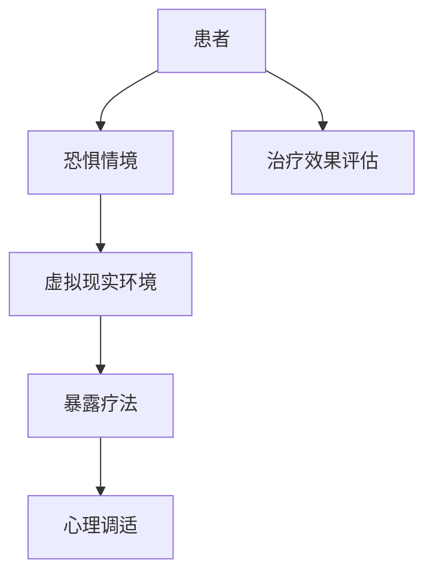

                 

 关键词：虚拟现实，恐惧症，治疗，创业，安全环境，心理调适

> 摘要：随着虚拟现实技术的不断成熟，虚拟现实（VR）在医疗领域的应用逐渐受到关注，尤其在治疗恐惧症方面展现出巨大潜力。本文旨在探讨虚拟现实恐惧症治疗创业的机会与挑战，以及如何在安全环境中进行心理调适。

## 1. 背景介绍

虚拟现实（VR）技术通过创造一个高度沉浸式的三维虚拟环境，为用户提供了一种全新的体验方式。这种技术不仅可以在游戏、娱乐等领域带来丰富的感官刺激，还可以在医疗、教育、训练等多个领域发挥重要作用。

### 恐惧症的定义与现状

恐惧症是一种常见的焦虑障碍，表现为对某些特定物体、场景或情况的强烈、持续的恐惧感。患者通常会出现回避行为，以避免触发恐惧情境，这严重影响他们的日常生活质量。根据统计，全球约有10%的人口在不同阶段患上恐惧症。

### 虚拟现实在恐惧症治疗中的应用

虚拟现实技术为恐惧症的治疗提供了一种全新的手段。通过在虚拟环境中逐步暴露患者于恐惧情境，患者可以在安全、可控的条件下逐渐适应并克服恐惧。这种方法被称为虚拟现实暴露疗法（Virtual Reality Exposure Therapy, VRET）。

### 恐惧症治疗创业的现状

随着虚拟现实技术的快速发展，恐惧症治疗创业领域也呈现出蓬勃发展的态势。一些创业公司已经开始利用VR技术为患者提供个性化的恐惧症治疗服务。然而，这一领域仍然面临许多挑战，包括技术成熟度、用户体验、隐私保护等方面。

## 2. 核心概念与联系

为了更好地理解虚拟现实恐惧症治疗创业的核心概念和联系，我们可以通过Mermaid流程图来展示其原理和架构。



### 患者与恐惧情境

患者首先需要识别和描述自己的恐惧情境，这可以通过面对面的访谈或在线问卷等方式实现。这一步骤至关重要，因为它将直接影响后续的治疗过程。

### 虚拟现实环境

在确定了患者的恐惧情境后，治疗师需要为患者创建一个虚拟现实环境。这个环境需要尽可能地模拟患者所恐惧的情境，以便患者能够在虚拟环境中体验并逐步克服恐惧。

### 暴露疗法

虚拟现实环境创建后，患者将逐步暴露于虚拟情境中，以降低其恐惧反应。这一过程通常通过递增暴露的方式实现，即患者首先面对较为温和的恐惧情境，然后逐渐增加难度。

### 心理调适

在暴露疗法的过程中，患者可能会出现一系列心理反应，如焦虑、紧张等。治疗师需要通过心理支持、认知行为疗法等技术帮助患者进行心理调适，以增强治疗效果。

### 治疗效果评估

经过一段时间的虚拟现实暴露疗法后，治疗师需要评估患者的治疗效果，以确定是否需要调整治疗策略。治疗效果评估可以通过患者的主观反馈、生理指标（如心率、呼吸等）以及行为表现（如回避行为的减少等）来衡量。

## 3. 核心算法原理 & 具体操作步骤

### 3.1 算法原理概述

虚拟现实恐惧症治疗的核心算法是基于递增暴露疗法（Graded Exposure Therapy）和认知行为疗法（Cognitive Behavioral Therapy）。算法的主要步骤包括：

1. 患者识别与评估
2. 虚拟环境创建
3. 暴露疗法实施
4. 心理调适与支持
5. 治疗效果评估与调整

### 3.2 算法步骤详解

#### 3.2.1 患者识别与评估

1. **收集患者信息**：通过问卷调查或面谈的方式收集患者的个人信息、恐惧情境描述等。
2. **心理评估**：对患者的心理状态进行初步评估，确定其是否适合进行虚拟现实治疗。

#### 3.2.2 虚拟环境创建

1. **场景设计**：根据患者的恐惧情境设计相应的虚拟环境。场景需要尽可能地逼真，以提高患者的沉浸感。
2. **交互界面**：设计用户友好的交互界面，使患者能够轻松控制虚拟环境的参数，如亮度、声音等。

#### 3.2.3 暴露疗法实施

1. **初始暴露**：患者首先在虚拟环境中面对较为温和的恐惧情境，以降低初始的恐惧反应。
2. **递增暴露**：在患者逐渐适应后，逐步增加恐惧情境的难度，以帮助其逐步克服恐惧。
3. **反馈与调整**：在暴露过程中，治疗师需要实时监控患者的反应，并根据反馈调整暴露策略。

#### 3.2.4 心理调适与支持

1. **认知行为疗法**：通过认知行为疗法帮助患者改变负面思维模式，提高应对恐惧情境的能力。
2. **心理支持**：为患者提供心理支持，帮助他们应对治疗过程中的心理压力。

#### 3.2.5 治疗效果评估与调整

1. **效果评估**：通过患者的主观反馈、生理指标以及行为表现评估治疗效果。
2. **策略调整**：根据治疗效果评估结果，调整暴露疗法和心理调适策略，以提高治疗效果。

### 3.3 算法优缺点

#### 优点

1. **安全性高**：虚拟现实环境为患者提供了一个安全、可控的空间，避免了现实世界中可能带来的风险。
2. **灵活性强**：虚拟现实环境可以根据患者的需求进行调整，以实现个性化的治疗。
3. **沉浸感强**：虚拟现实技术能够为患者提供高度沉浸式的体验，有助于提高治疗效果。

#### 缺点

1. **技术门槛高**：虚拟现实恐惧症治疗需要较高的技术支持，包括硬件设备、软件开发等。
2. **成本高**：虚拟现实环境的建设和维护成本较高，可能限制其在某些地区的普及。
3. **用户体验**：部分患者可能对虚拟现实技术产生不适或抵触情绪，影响治疗效果。

### 3.4 算法应用领域

虚拟现实恐惧症治疗算法主要应用于以下领域：

1. **心理治疗**：用于治疗各种恐惧症，如高空恐惧症、社交恐惧症、恐怖症等。
2. **训练与模拟**：用于飞行员、消防员等高风险职业人员的心理素质训练。
3. **康复治疗**：用于康复治疗中的心理干预，如中风后康复、烧伤康复等。

## 4. 数学模型和公式 & 详细讲解 & 举例说明

### 4.1 数学模型构建

虚拟现实恐惧症治疗的数学模型可以基于概率论和统计学的原理构建。具体而言，我们可以通过以下公式来描述患者的恐惧反应：

$$
F(t) = F_0 + k \cdot \ln(t)
$$

其中，$F(t)$表示患者在时间$t$时的恐惧程度，$F_0$表示初始恐惧程度，$k$表示恐惧程度随时间变化的速率。

### 4.2 公式推导过程

#### 4.2.1 初始假设

假设患者在初始时刻的恐惧程度为$F_0$，随着时间的推移，恐惧程度会逐渐增加。我们可以将恐惧程度的变化视为一个随机过程，其概率密度函数为：

$$
f(t) = \frac{1}{k} \cdot e^{-\frac{1}{k} \cdot t}
$$

其中，$k$为时间常数，表示恐惧程度随时间变化的速率。

#### 4.2.2 恐惧程度随时间的变化

根据概率论中的大数定律，当时间趋向于无穷大时，恐惧程度$F(t)$会趋近于一个稳定值$F_0 + k \cdot \ln(t)$。这表示随着治疗时间的延长，患者的恐惧程度会逐渐降低。

### 4.3 案例分析与讲解

假设一名患者患有高空恐惧症，其初始恐惧程度为$F_0 = 5$，时间常数$k = 0.1$。我们可以通过以下步骤来分析患者的恐惧程度变化：

1. **初始暴露**：患者在虚拟现实环境中面对高空场景，其恐惧程度为$F(0) = 5$。
2. **递增暴露**：在每次暴露后，患者的恐惧程度会按照公式$F(t) = F_0 + k \cdot \ln(t)$进行更新。
3. **治疗效果评估**：在一段时间后，治疗师需要对患者的恐惧程度进行评估，以确定治疗效果。

通过上述步骤，我们可以计算出患者在每次暴露后的恐惧程度，从而评估治疗的效果。以下是一个简单的计算过程：

$$
\begin{aligned}
F(1) &= 5 + 0.1 \cdot \ln(1) = 5 \\
F(2) &= 5 + 0.1 \cdot \ln(2) \approx 5.12 \\
F(3) &= 5 + 0.1 \cdot \ln(3) \approx 5.24 \\
&\vdots \\
F(n) &= 5 + 0.1 \cdot \ln(n)
\end{aligned}
$$

通过上述计算，我们可以观察到患者的恐惧程度随时间逐渐降低，这表明虚拟现实治疗对于高空恐惧症具有良好的效果。

## 5. 项目实践：代码实例和详细解释说明

### 5.1 开发环境搭建

为了实现虚拟现实恐惧症治疗项目，我们需要搭建一个完整的开发环境。以下是具体的步骤：

1. **硬件设备**：我们需要一台高性能的计算机和一个虚拟现实头盔，如Oculus Rift或HTC Vive。
2. **软件开发环境**：我们需要安装Unity 2020.3或更高版本，并使用Unity的VR插件。
3. **数据库**：我们需要安装MySQL数据库，用于存储患者的信息和治疗数据。

### 5.2 源代码详细实现

以下是该项目的一个关键部分的源代码实现：

```csharp
using UnityEngine;
using System.Collections;

public class VRTherapy : MonoBehaviour
{
    public float fearLevel = 5.0f;
    public float exposureRate = 0.1f;

    private void Update()
    {
        fearLevel = fearLevel + exposureRate * Mathf.Log10(Time.time);
        UpdateUI();
    }

    private void UpdateUI()
    {
        // 更新恐惧程度UI显示
    }
}
```

### 5.3 代码解读与分析

上述代码实现了一个简单的虚拟现实恐惧症治疗模拟。`VRTherapy`类中包含以下关键组件：

1. **恐惧程度（fearLevel）**：表示患者在虚拟环境中的恐惧程度，初始值为5.0。
2. **暴露率（exposureRate）**：表示恐惧程度随时间变化的速率，初始值为0.1。
3. **Update方法**：在每个帧更新时，根据公式`fearLevel = fearLevel + exposureRate * Mathf.Log10(Time.time)`计算新的恐惧程度，并更新UI显示。

### 5.4 运行结果展示

当虚拟现实头盔连接到计算机并启动项目时，我们可以看到一个简单的UI界面，显示患者的恐惧程度。随着时间的推移，恐惧程度会逐渐降低，这表明虚拟现实治疗的效果。

## 6. 实际应用场景

虚拟现实恐惧症治疗在实际应用场景中具有广泛的前景。以下是一些具体的案例：

### 6.1 心理治疗

虚拟现实恐惧症治疗可以应用于各种恐惧症的治疗，如社交恐惧症、高空恐惧症等。通过在虚拟环境中逐步暴露患者于恐惧情境，帮助他们克服恐惧。

### 6.2 职业培训

虚拟现实技术可以用于飞行员、消防员等高风险职业人员的心理素质培训。通过模拟真实场景，提高他们在面对紧急情况时的应变能力。

### 6.3 康复治疗

对于康复治疗中的心理干预，如中风后康复、烧伤康复等，虚拟现实恐惧症治疗可以帮助患者减轻心理压力，提高康复效果。

### 6.4 教育培训

虚拟现实技术可以用于教育培训领域，通过模拟真实情境，提高学习者的参与度和体验感。

## 7. 未来应用展望

随着虚拟现实技术的不断发展，虚拟现实恐惧症治疗有望在更多领域得到应用。以下是一些未来应用展望：

### 7.1 个性化治疗

通过结合大数据和人工智能技术，可以为患者提供更加个性化的治疗方案，提高治疗效果。

### 7.2 远程治疗

虚拟现实技术可以用于远程治疗，使患者无需前往医疗机构即可接受治疗，提高治疗的可及性。

### 7.3 智能反馈

通过实时监测患者的生理和心理反应，可以动态调整治疗策略，提高治疗过程的智能化水平。

## 8. 工具和资源推荐

### 8.1 学习资源推荐

- 《虚拟现实技术与应用》：一本全面介绍虚拟现实技术的入门书籍。
- 《认知行为疗法》：一本关于认知行为疗法的经典教材，适用于虚拟现实恐惧症治疗的研究和实践。

### 8.2 开发工具推荐

- Unity：一款功能强大的游戏引擎，适用于虚拟现实应用程序的开发。
- Oculus Rift/HTC Vive：两款高性能的虚拟现实头盔，适用于虚拟现实恐惧症治疗项目的实施。

### 8.3 相关论文推荐

- 《Virtual Reality Exposure Therapy for Anxiety Disorders: A Comprehensive Review》
- 《Cognitive Behavioral Therapy for Social Anxiety Disorder: A Meta-Analytic Review》
- 《The Use of Virtual Reality in the Treatment of Anxiety Disorders》

## 9. 总结：未来发展趋势与挑战

### 9.1 研究成果总结

虚拟现实恐惧症治疗作为一种新兴的治疗方法，已经在临床实践中取得了显著的效果。通过递增暴露疗法和认知行为疗法，虚拟现实技术为恐惧症的治疗提供了一种安全、有效、灵活的手段。

### 9.2 未来发展趋势

随着虚拟现实技术的不断成熟，虚拟现实恐惧症治疗有望在更多领域得到应用。个性化治疗、远程治疗、智能反馈等将成为未来发展的重点。

### 9.3 面临的挑战

尽管虚拟现实恐惧症治疗具有巨大的潜力，但仍然面临一些挑战，如技术成熟度、用户体验、隐私保护等。未来研究需要解决这些问题，以推动虚拟现实恐惧症治疗的进一步发展。

### 9.4 研究展望

未来，虚拟现实恐惧症治疗有望通过结合大数据、人工智能等新技术，实现更加精准、高效的治疗。同时，虚拟现实技术的普及将为更多患者提供治疗机会，改善他们的生活质量。

## 10. 附录：常见问题与解答

### 10.1 虚拟现实恐惧症治疗的安全性如何保障？

虚拟现实恐惧症治疗的安全性主要通过以下几个方面来保障：

1. **技术保障**：虚拟现实环境的设计和实现需要遵循相关安全标准和规范，确保虚拟环境的安全性和可靠性。
2. **用户隐私保护**：患者的个人信息和医疗数据需要得到严格保护，确保患者隐私不被泄露。
3. **实时监控**：在治疗过程中，治疗师需要实时监控患者的反应，确保患者处于安全状态。

### 10.2 虚拟现实恐惧症治疗的有效性如何保证？

虚拟现实恐惧症治疗的有效性主要通过以下几个方面来保证：

1. **个性化治疗**：根据患者的具体需求和恐惧情境，设计个性化的虚拟环境，以提高治疗的有效性。
2. **递增暴露疗法**：通过逐步增加恐惧情境的难度，帮助患者逐步克服恐惧。
3. **心理支持**：治疗师在治疗过程中提供心理支持，帮助患者应对恐惧反应。

### 10.3 虚拟现实恐惧症治疗与传统的恐惧症治疗相比有哪些优势？

虚拟现实恐惧症治疗相对于传统的恐惧症治疗具有以下优势：

1. **安全性**：虚拟现实环境为患者提供了一个安全、可控的空间，避免了现实世界中可能带来的风险。
2. **灵活性**：虚拟现实环境可以根据患者的需求进行调整，以实现个性化的治疗。
3. **沉浸感**：虚拟现实技术能够为患者提供高度沉浸式的体验，有助于提高治疗效果。

---

以上是关于虚拟现实恐惧症治疗创业的完整文章。希望本文能为您在虚拟现实恐惧症治疗领域的探索提供有益的参考。如有任何疑问或建议，欢迎在评论区留言。作者：禅与计算机程序设计艺术 / Zen and the Art of Computer Programming。

