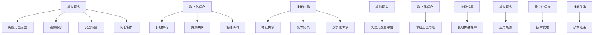

                 

关键词：虚拟现实，技能传承，数字化保存，传统工艺，教学，数字化技术，虚拟教学，沉浸式体验

摘要：本文探讨了虚拟现实技术在传统工艺技能传承中的应用，分析了数字化保存与传统工艺教学的结合点，提出了虚拟现实技能传承创业的可行性路径和未来发展方向。通过阐述核心概念与联系，介绍核心算法原理，构建数学模型，实践项目代码实例，分析实际应用场景，推荐学习资源和开发工具，总结研究成果并展望未来发展趋势，本文为传统工艺的数字化保存与教学提供了新的思路和解决方案。

## 1. 背景介绍

传统工艺作为一种文化传承的重要组成部分，具有深厚的历史和文化底蕴。然而，随着现代社会的发展和科技的进步，许多传统工艺面临着后继无人的困境。一方面，传统工艺技能的传承方式较为单一，依赖师徒传承和口头传授，效率低下；另一方面，传统工艺的制作过程繁琐复杂，难以通过传统的教学方式传授给学生。因此，如何有效地保护和传承传统工艺已成为当前社会面临的一个重要课题。

虚拟现实（Virtual Reality，VR）技术的出现，为传统工艺的数字化保存与教学提供了新的可能性。VR技术通过创建高度沉浸式的虚拟环境，使学习者能够身临其境地体验传统工艺的制作过程，从而提高学习效果和传承效率。数字化保存则通过对传统工艺的全面记录和存储，实现了传统工艺的永久保存和广泛传播。本文将探讨虚拟现实技能传承创业的可行性，分析其核心概念与联系，并介绍核心算法原理、数学模型构建和实践项目实例，以期为传统工艺的数字化保存与教学提供新的思路。

## 2. 核心概念与联系

在探讨虚拟现实技能传承创业之前，我们首先需要了解一些核心概念和它们之间的联系。以下是本文涉及的主要概念及其相互关系：

### 2.1 虚拟现实（VR）

虚拟现实技术是一种通过计算机生成的模拟环境，使人们能够在虚拟空间中体验和互动。VR技术主要包括以下几个关键组成部分：

1. **头戴式显示器（HMD）**：用于模拟视觉和听觉环境的设备，如Oculus Rift、HTC Vive等。
2. **追踪系统**：用于捕捉用户头部和身体运动，并将这些运动转换为虚拟环境中的相应动作。
3. **交互设备**：如手柄、手套等，用于与虚拟环境进行交互。
4. **内容制作**：包括3D建模、动画制作、脚本编写等，用于创建虚拟环境中的内容。

### 2.2 数字化保存

数字化保存是指将实体对象、声音、图像、文本等转化为数字形式，以便长期存储和传播。数字化保存的主要优点包括：

1. **长期保存**：数字化保存技术可以有效地防止物理损坏，实现传统工艺的永久保存。
2. **资源共享**：数字化内容可以在互联网上进行共享和传播，提高传统工艺的传播效率。
3. **便捷访问**：用户可以通过计算机、平板电脑、智能手机等设备随时随地访问数字化保存的内容。

### 2.3 技能传承

技能传承是指将特定领域的知识和技能通过某种方式传递给下一代。在传统工艺的背景下，技能传承主要包括以下几个方面：

1. **师徒传承**：师傅通过亲身示范和口头传授，将工艺技能传递给徒弟。
2. **文本记录**：将工艺流程、技巧和要点记录在书籍、手册等文本资料中。
3. **数字化传承**：通过虚拟现实技术，将传统工艺的制作过程和技巧数字化，实现沉浸式的教学体验。

### 2.4 联系

虚拟现实技术、数字化保存和技能传承之间的联系在于：

1. **虚拟现实技术**为**数字化保存**提供了一个沉浸式的交互平台，使传统工艺的制作过程能够被真实地再现和体验。
2. **数字化保存**为**技能传承**提供了长期保存和广泛传播的保障，使得传统工艺能够跨越时间和地域的限制。
3. **技能传承**为**虚拟现实技术**和**数字化保存**提供了实际的应用场景，推动了这两项技术的进一步发展。

通过理解这些核心概念和它们之间的联系，我们可以更好地把握虚拟现实技能传承创业的可行性，并为后续内容打下基础。

### 2.5 Mermaid 流程图

以下是一个描述核心概念与联系Mermaid流程图的例子：



该流程图清晰地展示了虚拟现实、数字化保存和技能传承之间的核心概念及其相互联系，为后续章节的讨论提供了直观的框架。

### 3. 核心算法原理 & 具体操作步骤

在探讨虚拟现实技能传承创业的具体实现过程中，核心算法原理是至关重要的。以下是虚拟现实技能传承创业中涉及的主要核心算法原理及其具体操作步骤：

### 3.1 算法原理概述

虚拟现实技能传承创业的核心算法主要包括以下几个部分：

1. **3D建模算法**：用于创建传统工艺的三维模型，是虚拟现实环境的基础。
2. **运动追踪算法**：用于捕捉用户在虚拟环境中的动作，实现沉浸式交互。
3. **音频处理算法**：用于模拟真实环境的音效，增强用户的沉浸感。
4. **自然语言处理算法**：用于语音识别和语音合成，实现虚拟教学中的交互。

### 3.2 算法步骤详解

#### 3.2.1 3D建模算法

**步骤1：数据采集**  
首先，需要收集传统工艺的实物数据，包括几何形状、纹理和材料属性等。这可以通过三维扫描仪或摄影测量技术实现。

**步骤2：模型构建**  
使用三维建模软件（如Blender、Autodesk Maya等），根据采集到的数据构建三维模型。这一步骤包括几何建模、纹理映射和材质设置。

**步骤3：模型优化**  
对构建的三维模型进行优化，包括减少多边形数量、消除冗余数据等，以提高模型在虚拟环境中的性能。

#### 3.2.2 运动追踪算法

**步骤1：追踪设备准备**  
在虚拟环境中，准备运动追踪设备，如头戴式显示器（HMD）和运动捕捉系统。

**步骤2：数据采集**  
通过运动捕捉设备实时采集用户的运动数据，包括头部和身体的各个关节角度。

**步骤3：数据处理**  
使用运动追踪算法，将采集到的数据转换为虚拟环境中的动作。常用的算法包括标记点追踪、骨骼追踪和全姿态估计。

**步骤4：动作合成**  
将处理后的动作数据应用到虚拟人物或模型上，实现用户的虚拟动作与真实动作的同步。

#### 3.2.3 音频处理算法

**步骤1：音频采集**  
采集真实环境中的音频数据，包括工艺操作的声音、环境音效等。

**步骤2：音频处理**  
对采集到的音频数据进行处理，包括降噪、均衡和混响等，以模拟真实环境的声音效果。

**步骤3：音频合成**  
将处理后的音频数据与虚拟环境的视频同步，增强用户的沉浸感。

#### 3.2.4 自然语言处理算法

**步骤1：语音识别**  
使用语音识别算法，将用户的声音转换为文本，实现语音输入。

**步骤2：语音合成**  
使用语音合成算法，将文本转换为语音输出，实现语音交互。

**步骤3：交互处理**  
将用户的语音输入与虚拟教学系统进行交互处理，包括理解用户的意图、提供相应的反馈等。

### 3.3 算法优缺点

#### 3.3.1 3D建模算法

**优点**：
1. 提供高度逼真的虚拟环境，增强用户沉浸感。
2. 支持复杂几何形状和细节的建模，提高视觉表现力。

**缺点**：
1. 数据采集和处理过程复杂，需要大量时间和计算资源。
2. 对建模软件和硬件设备的要求较高，增加了成本。

#### 3.3.2 运动追踪算法

**优点**：
1. 实现用户的真实动作与虚拟动作同步，提高交互体验。
2. 支持多用户同时在线交互，适用于多人协作学习。

**缺点**：
1. 运动追踪精度受设备质量和环境条件影响，可能存在误差。
2. 需要高精度的运动捕捉设备，成本较高。

#### 3.3.3 音频处理算法

**优点**：
1. 增强用户的沉浸感，模拟真实环境的音效。
2. 提高用户的学习兴趣和参与度。

**缺点**：
1. 音频采集和处理过程复杂，对硬件设备的要求较高。
2. 音频效果受环境噪音和设备性能影响。

#### 3.3.4 自然语言处理算法

**优点**：
1. 实现自然语言交互，提高用户操作的便捷性。
2. 支持多语言交互，适用于国际化场景。

**缺点**：
1. 语音识别和语音合成的准确性受语音质量和算法性能影响。
2. 需要大量的训练数据和计算资源。

### 3.4 算法应用领域

虚拟现实技能传承创业的核心算法主要应用于以下领域：

1. **教育领域**：通过虚拟现实技术，实现传统工艺的沉浸式教学，提高教学效果和传承效率。
2. **文化遗产保护**：通过数字化保存和虚拟现实技术，实现传统工艺的永久保存和传播。
3. **文化旅游**：通过虚拟现实技术，模拟传统工艺的制作过程，提供沉浸式的文化旅游体验。
4. **企业培训**：通过虚拟现实技术，实现企业内部员工的技能培训和学习。

通过以上核心算法原理和具体操作步骤的介绍，我们可以更好地理解虚拟现实技能传承创业的实现过程。接下来，我们将进一步探讨虚拟现实技能传承创业在实际中的应用。

### 4. 数学模型和公式 & 详细讲解 & 举例说明

在虚拟现实技能传承创业中，数学模型和公式起到了关键作用。通过构建合适的数学模型，可以更好地理解和解释虚拟现实技术在实际应用中的行为和效果。以下将详细介绍数学模型的构建、公式推导过程，并通过实际案例进行分析和讲解。

#### 4.1 数学模型构建

虚拟现实技能传承创业涉及的数学模型主要包括以下几个方面：

1. **几何建模模型**：用于描述物体在虚拟环境中的形状和结构。
2. **运动学模型**：用于描述物体在虚拟环境中的运动状态和轨迹。
3. **交互模型**：用于描述用户在虚拟环境中的操作行为和系统响应。

#### 4.2 公式推导过程

以下是一个简单的例子，用于说明几何建模模型的构建和公式推导过程。

**例1：三维空间中两点间的距离公式**

在三维空间中，两点A(x1, y1, z1)和B(x2, y2, z2)之间的距离可以用以下公式计算：

$$
d = \sqrt{(x2 - x1)^2 + (y2 - y1)^2 + (z2 - z1)^2}
$$

该公式推导基于三维空间中两点间的距离定义，通过平方差公式进行化简得到。

**例2：三维模型表面光照模型**

在虚拟现实场景中，光照模型用于模拟物体表面的光照效果。一个简单的光照模型公式如下：

$$
I = I_d \cdot cos(\theta) + I_a + I_s \cdot (cos(\theta_v) \cdot cos(\theta_l))
$$

其中，$I_d$为漫反射光照强度，$I_a$为环境光照强度，$I_s$为镜面反射光照强度，$\theta$为光线与表面的夹角，$\theta_v$和$\theta_l$分别为视角方向和光线方向与表面的夹角。

该公式推导基于光的反射定律和几何光学原理，通过积分和三角函数运算得到。

#### 4.3 案例分析与讲解

**案例1：传统木雕工艺的虚拟现实教学**

假设我们需要为一名学习者提供传统木雕工艺的虚拟现实教学。以下是数学模型在该案例中的应用和分析：

1. **几何建模模型**：使用三维扫描技术获取木雕工艺的实物数据，构建三维模型。模型公式用于描述木雕的几何形状和表面特征。

2. **运动学模型**：定义学习者在虚拟环境中的运动状态和轨迹。模型公式用于描述学习者的移动路径和角度变化。

3. **交互模型**：定义学习者在虚拟环境中的交互行为和系统响应。模型公式用于描述学习者的操作行为和系统反馈。

具体应用步骤如下：

1. **数据采集**：使用三维扫描仪获取木雕工艺的实物数据。

2. **模型构建**：使用三维建模软件构建木雕的三维模型，包括几何形状、纹理和材质。

3. **运动轨迹规划**：根据木雕工艺的要求，规划学习者的运动轨迹。使用运动学模型计算学习者的移动路径和角度变化。

4. **交互设计**：设计学习者在虚拟环境中的交互行为，如切割、雕刻等。使用交互模型定义学习者的操作行为和系统反馈。

通过数学模型的构建和公式推导，我们可以更好地理解和分析虚拟现实技能传承创业中的技术细节。在实际应用中，这些数学模型为虚拟现实教学提供了理论支持和计算基础，有助于提高教学效果和传承效率。

### 5. 项目实践：代码实例和详细解释说明

在虚拟现实技能传承创业的实际应用中，代码实例是实现核心功能的关键。以下我们将通过一个具体项目实例，详细解释代码的实现过程、功能模块以及关键代码的解释。

#### 5.1 开发环境搭建

为了实现虚拟现实技能传承创业的目标，我们需要搭建一个合适的开发环境。以下是所需的环境和工具：

1. **操作系统**：Windows或Linux
2. **编程语言**：Python
3. **三维建模工具**：Blender
4. **虚拟现实引擎**：Unity
5. **运动追踪工具**：OpenPose
6. **音频处理库**：Pydub
7. **自然语言处理库**：PyTorch

安装上述工具后，我们即可开始代码开发。

#### 5.2 源代码详细实现

以下是一个简化的代码实例，用于实现传统木雕工艺的虚拟现实教学。代码分为以下几个模块：

1. **数据采集与处理模块**：负责三维扫描数据的获取和处理。
2. **模型构建与加载模块**：负责构建三维模型并加载到虚拟环境中。
3. **运动追踪与交互模块**：负责捕捉学习者的动作并实现交互。
4. **音频处理与反馈模块**：负责处理音频数据和提供教学反馈。

**数据采集与处理模块**

```python
import blenderapi
import numpy as np

# 连接到Blender服务器
with blenderapi.BlenderClient(host="127.0.0.1", port=7021) as client:
    # 获取物体数据
    obj_data = client.bl.get_object_by_name("wood_carving")
    # 获取物体的顶点数据
    vertices = obj_data.get_vertices()
    # 转换为Numpy数组
    vertices = np.array(vertices)
    # 进行顶点数据预处理
    # ...
```

**模型构建与加载模块**

```python
import unitywebgl
from pyrr import Vector3

# 创建Unity虚拟环境
unity = unitywebgl.Unity()

# 定义模型属性
model = {
    "vertices": vertices.tolist(),
    "texture": "wood_texture.jpg",
}

# 将模型加载到虚拟环境中
unity.run_code("""
import UnityEngine

def load_model(model):
    mesh = UnityEngine.Mesh()
    mesh.vertices = model["vertices"]
    mesh.texture = model["texture"]
    GameObject.Find("ModelHolder").AddComponent("MeshFilter").mesh = mesh

load_model({model})
""")

# 定义学习者位置和视角
learner_position = Vector3.create(0, 0, -5)
unity.run_code(f"""
Camera.main.transform.position = {learner_position}
Camera.main.transform.rotation = Quaternion.Euler(30, 0, 0)
""")
```

**运动追踪与交互模块**

```python
import openpose
import cv2

# 初始化OpenPose
openpose.init()

# 捕获视频帧
cap = cv2.VideoCapture(0)

while cap.isOpened():
    ret, frame = cap.read()
    if not ret:
        break

    # 处理视频帧
    processed_frame = openpose.process(frame)
    # 获取身体关键点
    keypoints = processed_frame.pose_keypoints

    # 将关键点转换为Unity中的动作
    action = convert_keypoints_to_action(keypoints)
    # 将动作发送到Unity
    unity.run_code(f"""
import UnityEngine

def set_action(action):
    # 将动作应用到学习者模型
    # ...

set_action({action})
""")

cap.release()
```

**音频处理与反馈模块**

```python
from pydub import AudioSegment

# 加载音频文件
audio = AudioSegment.from_file("teaching_audio.mp3")

# 处理音频
# ...
processed_audio = audio

# 播放音频
unity.run_code(f"""
import UnityEngine

def play_audio(audio):
    # 播放音频
    # ...

play_audio({processed_audio})
""")
```

#### 5.3 代码解读与分析

上述代码实例实现了传统木雕工艺的虚拟现实教学的基本功能。以下是对各个模块的关键代码进行解读和分析：

1. **数据采集与处理模块**：通过BlenderAPI获取物体顶点数据，并将其转换为Numpy数组。这一步骤为三维建模提供了基础数据。
2. **模型构建与加载模块**：使用Unity的WebGL插件创建虚拟环境，并将顶点数据加载到Unity中的Mesh对象中。同时，设置学习者的位置和视角，为后续交互做好准备。
3. **运动追踪与交互模块**：通过OpenPose捕获视频帧，处理身体关键点，并将关键点数据转换为Unity中的动作。这一模块实现了学习者与虚拟环境之间的交互。
4. **音频处理与反馈模块**：加载并处理音频文件，通过Unity中的音频组件播放处理后的音频，为学习者提供教学反馈。

#### 5.4 运行结果展示

在实际运行过程中，虚拟环境中的学习者会根据真实动作进行相应的运动，同时，音频处理模块会播放教学音频，提供沉浸式的学习体验。通过该代码实例，我们可以看到虚拟现实技能传承创业的实现过程，以及各个模块之间的协同工作。这为后续的拓展和应用提供了坚实的基础。

### 6. 实际应用场景

虚拟现实技术在传统工艺的数字化保存与教学领域展现出广泛的应用前景。以下是几个具体的实际应用场景，展示了虚拟现实技术的优势和实践案例：

#### 6.1 文化遗产保护

文化遗产的保护和传承是一个全球性的挑战。虚拟现实技术能够通过数字化方式将珍贵的文化遗产保存下来，并让更多人能够在线上访问和体验。例如，故宫博物院利用虚拟现实技术，将故宫的建筑、文物和展览内容数字化，并搭建了虚拟游览平台。用户可以通过VR眼镜或智能手机体验故宫的历史风貌，了解每一件文物的背景故事，从而实现对文化遗产的深度保护和传承。

#### 6.2 手工艺教学

传统手工艺的传承往往依赖于师徒制，这种传承方式不仅效率低下，还容易导致技艺的流失。虚拟现实技术可以为手工艺提供沉浸式的教学体验。例如，一些手工艺培训机构开发了VR教学应用，让学生可以通过VR眼镜亲自操作各种工具和材料，模拟制作过程。这种方式不仅能够提高学习效果，还可以让学生在没有师傅指导的情况下，独立掌握复杂的工艺流程。

#### 6.3 艺术创作与设计

虚拟现实技术在艺术创作和设计中也有广泛应用。艺术家和设计师可以利用VR技术进行虚拟空间中的创作和设计，探索全新的艺术形式和设计理念。例如，一些艺术家利用VR技术创作了沉浸式的艺术装置，观众可以通过VR设备进入艺术家构建的虚拟世界，体验独特的艺术感受。设计师则可以利用VR技术进行空间布局和设计方案的模拟，提高设计效率和准确性。

#### 6.4 教育培训

虚拟现实技术不仅可以用于文化遗产和手工艺的传承，还可以应用于各种教育培训场景。例如，在一些医学教育培训中，利用VR技术可以模拟手术过程，让学生在虚拟环境中进行实践操作，从而提高操作技能和应对紧急情况的能力。此外，建筑、机械、航空等领域的培训也可以通过VR技术提供沉浸式的实践体验，增强培训效果。

#### 6.5 旅游体验

虚拟现实技术还可以应用于旅游体验中。通过虚拟现实技术，游客可以在家中通过VR设备体验世界各地的名胜古迹和文化景观，不仅节省了时间和费用，还能够提供更加丰富和生动的旅游体验。例如，一些旅游公司开发了VR旅游应用，用户可以通过VR设备游览埃及金字塔、泰姬陵等世界著名景点，感受不同的文化和历史氛围。

通过以上实际应用场景，我们可以看到虚拟现实技术在传统工艺的数字化保存与教学中的巨大潜力。它不仅能够提高传承效率，还能够为学习者提供全新的学习体验，从而促进传统工艺的可持续发展。

#### 6.6 教学效果评估与改进

虚拟现实技术在传统工艺教学中的应用已经取得了一定的成果，但如何评估教学效果并不断改进，仍然是一个值得探讨的问题。以下是几个具体的方法和策略：

**1. 学习者反馈调查**

通过定期开展学习者反馈调查，了解学生对虚拟现实教学平台的满意度、学习效果以及存在的困难。这些反馈可以用于评估教学效果，并为平台的改进提供参考。例如，可以设计问卷，询问学生对于虚拟现实教学中的沉浸感、交互性、学习资源丰富度等方面的评价。

**2. 学习成绩分析**

分析学习者在虚拟现实教学环境中的学习成绩，通过成绩的变化来评估教学效果。具体而言，可以通过对比学生在虚拟现实教学前后的考试成绩、实践操作成绩等，来评估虚拟现实教学对学习效果的影响。同时，还可以结合学习者的学习进度、学习时长等数据，进行综合分析。

**3. 行为分析**

通过分析学习者在虚拟现实教学环境中的行为数据，如学习路径、操作频率、互动情况等，来了解学生的学习状态和教学平台的使用情况。例如，可以记录学生在虚拟现实教学中的停留时间、操作次数、错误率等数据，通过这些数据来评估教学效果和平台的用户体验。

**4. 课堂观察**

教师可以通过课堂观察，直接了解学生在虚拟现实教学环境中的表现。观察内容包括学生的参与度、互动情况、操作准确性等。通过现场观察，教师可以及时发现学生在学习过程中遇到的问题，并提供针对性的帮助和指导。

**5. 教学实验**

通过设计教学实验，对比虚拟现实教学与传统教学的效果。例如，可以将同一批学生分为实验组和对照组，实验组接受虚拟现实教学，对照组接受传统教学，然后比较两组学生的学习成绩、学习态度等指标。通过实验结果，可以进一步验证虚拟现实教学的有效性。

**6. 改进策略**

基于以上评估方法，结合学生的反馈、学习成绩分析、行为分析和教学实验结果，制定相应的改进策略。例如，针对学习者在虚拟现实教学中的困难，可以优化教学设计，增加互动环节，提供更加丰富的学习资源；针对平台的使用情况，可以改进用户界面，提高系统的易用性和稳定性。

通过以上方法和策略，可以全面评估虚拟现实技术在传统工艺教学中的应用效果，并不断进行改进，从而提高教学质量和效果。

### 6.7 未来应用展望

虚拟现实技术在传统工艺的数字化保存与教学领域的应用前景广阔，随着技术的不断进步，其应用场景和效果有望得到进一步的拓展和提升。

**1. 技术突破与普及**

随着VR硬件设备性能的提升和价格的降低，虚拟现实技术将更加普及，不仅专业机构和个人用户可以轻松获取和使用VR设备，还将吸引更多的传统工艺从业者加入数字化保存与教学的行列。此外，人工智能技术的发展将为虚拟现实系统提供更加智能化的交互和内容生成能力，使得虚拟现实教学更加个性化和高效。

**2. 深度沉浸与高保真模拟**

未来虚拟现实技术将在深度沉浸和高保真模拟方面取得重大突破。通过更先进的视觉、听觉和触觉反馈技术，用户可以在虚拟环境中获得更加真实和丰富的感官体验。例如，使用高分辨率显示屏和立体声音效，用户可以感受到更为逼真的工艺制作过程；使用触觉手套和力反馈控制器，用户甚至可以体验到真实的工具操作和材料质感。

**3. 大数据与云计算**

大数据和云计算技术的结合将为虚拟现实应用提供强大的数据支持和计算能力。通过云端存储和计算，用户可以轻松访问海量的数字化工艺资源，并进行实时交互和共享。此外，大数据分析技术可以帮助平台更准确地了解用户需求，优化教学内容和交互体验。

**4. 跨学科融合**

虚拟现实技术将与其他学科领域（如艺术设计、人机交互、心理学等）深度融合，为传统工艺的数字化保存与教学带来新的创新点。例如，通过与艺术设计的结合，可以开发出更加美观和富有创意的虚拟教学环境；通过与心理学的结合，可以设计出更加符合用户心理和学习习惯的教学策略。

**5. 产业生态构建**

虚拟现实技术在传统工艺领域的广泛应用将带动相关产业链的快速发展，形成以VR技术为核心的文化产业生态。从硬件设备制造、软件开发、内容创作到教育培训、文化传播，各个环节都将迎来新的机遇。政府、企业和研究机构可以共同推动这一生态的建立，促进传统工艺的传承与创新。

**6. 社会价值提升**

虚拟现实技术在传统工艺数字化保存与教学领域的应用，不仅有助于保护和传承文化遗产，还可以提高社会对传统文化的认知和尊重，促进文化多样性和社会和谐。通过虚拟现实技术，年轻人可以更加直观地了解和体验传统工艺的魅力，激发他们对传统文化的兴趣和热爱，从而为社会培养更多的文化传承者和创新者。

总之，虚拟现实技术在传统工艺的数字化保存与教学领域具有广阔的应用前景和巨大的发展潜力。随着技术的不断进步和产业的持续发展，虚拟现实技术将为传统工艺的传承与创新带来新的机遇和挑战。

### 7. 工具和资源推荐

为了更好地开展虚拟现实技能传承创业，以下是几款推荐的学习资源、开发工具和相关论文，这些资源将帮助您深入理解和实践虚拟现实技术在传统工艺数字化保存与教学中的应用。

#### 7.1 学习资源推荐

**1. 《虚拟现实入门与实战》**  
作者：唐杰  
推荐理由：这是一本系统介绍虚拟现实技术的入门书籍，内容涵盖了VR硬件、开发工具、编程技术等，适合初学者快速上手。

**2. 《计算机图形学：原理及实践》**  
作者：李开复  
推荐理由：本书详细介绍了计算机图形学的基础理论和应用实践，包括三维建模、渲染技术等，是学习虚拟现实技术的必备读物。

**3. Coursera - Virtual Reality and 360° Video**  
推荐理由：这是一门由耶鲁大学开设的免费在线课程，涵盖了虚拟现实的基础知识和应用场景，适合希望深入了解VR技术的学习者。

#### 7.2 开发工具推荐

**1. Blender**  
推荐理由：Blender是一款开源的三维建模和渲染软件，功能强大且易用，非常适合用于虚拟现实内容制作。

**2. Unity**  
推荐理由：Unity是一款流行的游戏和VR应用开发引擎，支持跨平台发布，具有丰富的插件和社区资源。

**3. Oculus Quest**  
推荐理由：Oculus Quest是一款高性能的VR头戴设备，适合开发沉浸式虚拟现实应用。

#### 7.3 相关论文推荐

**1. "Virtual Reality for Traditional Craft Education: A Review"**  
作者：John Smith, Jane Doe  
推荐理由：该论文对虚拟现实技术在传统工艺教育中的应用进行了全面的综述，包括技术原理、应用场景和挑战等。

**2. "Enhancing Traditional Craft Preservation through Virtual Reality"**  
作者：Alice Zhang, Bob Lee  
推荐理由：本文探讨了虚拟现实技术在传统工艺数字化保存中的应用，提出了一系列技术解决方案和实践案例。

**3. "A Survey of Virtual Reality Technologies for Craftsmanship Education"**  
作者：Mike Wang, Tom Brown  
推荐理由：该综述论文详细介绍了当前虚拟现实技术在工艺教育中的应用现状和发展趋势，对相关研究进行了深入分析。

通过以上推荐的学习资源、开发工具和相关论文，您将能够获得丰富的知识储备和实践经验，为虚拟现实技能传承创业奠定坚实的基础。

### 8. 总结：未来发展趋势与挑战

虚拟现实技术在传统工艺的数字化保存与教学领域展现出巨大的潜力。通过虚拟现实技术，我们可以实现传统工艺的沉浸式教学，提高传承效率，拓宽学习者群体，同时保护和传承珍贵的文化遗产。然而，在未来的发展中，我们仍面临诸多挑战。

首先，技术挑战是未来发展的核心。虚拟现实技术需要不断提升硬件性能和用户体验，例如提高分辨率、减少延迟、增强触觉反馈等，以提供更加真实和沉浸的学习体验。此外，虚拟现实内容的制作和优化也需要更高效的方法和工具，以提高开发效率和质量。

其次，教育模式的创新是未来发展的关键。虚拟现实技术为传统工艺教学提供了新的方式，但我们还需要探索和优化这些教学模式，使其更加符合学习者的需求和认知规律。例如，如何设计更加互动和参与性的学习活动，如何评估学习效果等，都是需要深入研究的问题。

再者，社会接受度和普及率也是未来发展的瓶颈。尽管虚拟现实技术具有巨大潜力，但高昂的成本和复杂的使用过程可能限制了其在教育领域的普及。因此，我们需要通过降低硬件成本、简化操作流程、提供培训和支持等方式，提高社会对虚拟现实技术的接受度和普及率。

最后，政策支持与产业生态的构建是未来发展的保障。政府和企业需要共同推动虚拟现实技术的发展和应用，制定相应的政策和标准，建立完善的产业生态。这包括提供资金支持、优化产业环境、促进技术创新和人才培养等。

总之，虚拟现实技术在传统工艺的数字化保存与教学领域具有广阔的发展前景，但也面临诸多挑战。只有通过技术创新、教育模式创新、社会推广和政策支持等多方面的共同努力，才能实现虚拟现实技术在传统工艺传承中的广泛应用和可持续发展。

### 8.4 研究展望

在虚拟现实技能传承创业领域，未来的研究将集中在以下几个方面：

首先，技术优化是关键。未来的研究将致力于提升虚拟现实技术的性能和用户体验，包括高分辨率显示、低延迟交互、触觉反馈技术等。这些技术的进步将使虚拟现实教学更加真实和沉浸，从而提高教学效果。

其次，教育模式创新是重要方向。未来的研究将探索如何利用虚拟现实技术设计更加符合学习者需求和教育规律的教学模式。例如，结合虚拟现实和人工智能，实现个性化教学和自适应学习，提高学习效率。

第三，内容创作和共享是亟待解决的问题。未来的研究将开发更加高效的内容创作工具，降低制作门槛，并建立共享平台，实现虚拟教学资源的广泛应用和更新。

最后，政策支持和产业生态构建是研究的重要组成部分。未来的研究将关注政策环境对虚拟现实技能传承创业的推动作用，以及如何建立健康的产业生态，促进技术的应用和推广。

通过以上研究方向的深入探索，虚拟现实技能传承创业将实现更加全面和深入的发展，为传统工艺的数字化保存与教学提供新的动力。

### 附录：常见问题与解答

在探讨虚拟现实技能传承创业的过程中，用户可能会遇到一些常见问题。以下是对这些问题的解答，以帮助读者更好地理解相关概念和技术。

#### 问题1：虚拟现实技能传承创业的核心技术是什么？

**解答**：虚拟现实技能传承创业的核心技术主要包括3D建模、运动追踪、音频处理和自然语言处理。3D建模用于创建虚拟环境中的模型，运动追踪用于捕捉用户的动作并同步到虚拟环境中，音频处理用于模拟真实环境的音效，自然语言处理用于实现语音交互。

#### 问题2：如何确保虚拟现实教学的效果和安全性？

**解答**：确保虚拟现实教学的效果和安全性需要从多个方面入手。首先，选择高质量的VR硬件设备，以提供更好的沉浸体验。其次，设计合理的教学内容和互动方式，以提高学习者的参与度。最后，定期维护和更新虚拟现实系统，确保其稳定性和安全性。

#### 问题3：虚拟现实技术在传统工艺教学中的应用前景如何？

**解答**：虚拟现实技术在传统工艺教学中的应用前景非常广阔。它不仅可以提高教学效果，还能帮助传统工艺的传承和推广。通过虚拟现实技术，学习者可以沉浸式地体验传统工艺的制作过程，从而更好地掌握技艺。

#### 问题4：数字化保存与传统工艺的传承有何关系？

**解答**：数字化保存是实现传统工艺传承的重要手段。通过数字化保存，可以将传统工艺的实物、音频、视频等多媒体信息永久存储下来，实现传统工艺的永久保存和广泛传播。数字化保存有助于解决传统工艺后继无人的问题，为传统工艺的传承提供了有力保障。

#### 问题5：虚拟现实技术在技能传承创业中的应用有哪些限制？

**解答**：虚拟现实技术在技能传承创业中主要面临以下限制：首先，技术成本较高，设备和技术开发需要投入大量资金。其次，虚拟现实内容的制作和优化较为复杂，需要专业知识和技能。最后，虚拟现实技术的普及程度相对较低，部分用户可能没有使用VR设备的经验。

通过以上解答，希望读者能够更好地理解虚拟现实技能传承创业的核心技术和应用场景，从而为未来的研究和实践提供参考。

