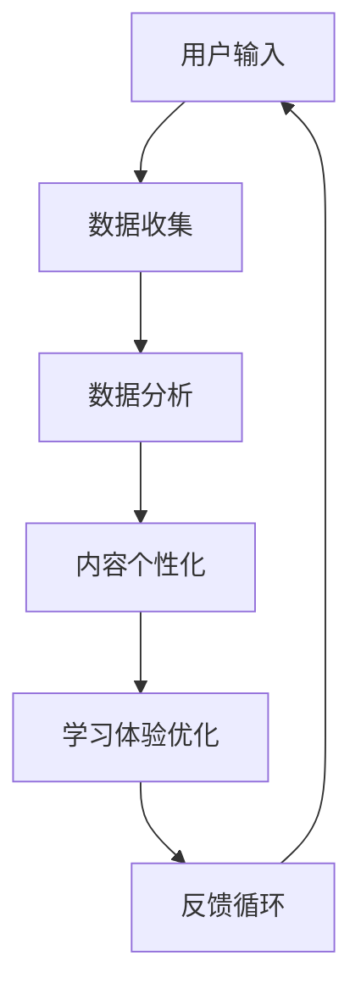

                 

 虚拟现实（VR）与人工智能（AI）的结合正引领教育领域的一场革命。通过VR，学习者可以沉浸在虚拟环境中，体验前所未有的互动式学习体验。而AI则为这种沉浸式学习提供了强大的驱动力，使其更加个性化、智能化和高效。本文将探讨VR与AI在教育中的融合，分析其核心概念、算法原理、数学模型、项目实践以及未来应用场景，为教育技术的创新提供深入见解。

## 1. 背景介绍

### 虚拟现实在教育中的应用

虚拟现实技术的兴起，为传统教育模式带来了新的可能性。通过VR，教师和学生可以创建和探索虚拟环境，这些环境可以模拟现实世界的各种场景，如历史古迹、太空探索、医学手术等。这不仅增加了学习的趣味性，还提升了学生的参与度和学习效果。

### 人工智能在教育中的角色

人工智能在教育中的应用日益广泛，从个性化学习推荐系统到智能辅导工具，再到自动评估和学习分析，AI正逐步改变教育的方方面面。AI能够根据学习者的特点和行为，提供定制化的学习路径，从而提高学习效率。

### VR与AI在教育中的融合

将VR与AI结合，可以创造出一种全新的沉浸式学习体验。AI可以分析学习者的行为数据，调整虚拟环境以适应学习者的需求和进度，提供实时反馈和指导。这种个性化的学习环境能够激发学生的创造力，培养他们的批判性思维和解决问题的能力。

## 2. 核心概念与联系

### 虚拟现实（VR）

虚拟现实是一种通过计算机技术模拟的三维虚拟环境，用户可以通过头戴式显示器（HMD）和手柄等设备与之互动。VR的关键在于提供高度沉浸式的体验，使用户感觉仿佛置身于虚拟世界之中。

### 人工智能（AI）

人工智能是计算机科学的一个分支，致力于开发能够执行人类智能任务的机器系统。AI通过算法和模型从数据中学习，进行推理和决策。在教育领域，AI可用于个性化学习、智能辅导和自动评估等。

### 融合应用

VR与AI的结合，可以通过以下方式提高教育效果：

1. **个性化学习**：AI分析学习者的行为和表现，为每个学生提供定制化的学习内容和路径。
2. **实时反馈**：AI可以实时监测学习者的学习进度，提供即时反馈和指导。
3. **交互式学习**：VR提供真实的交互体验，使学生能够主动参与学习过程。
4. **情感识别**：AI可以识别学习者的情感状态，调整学习内容以适应学生的情绪。

### Mermaid 流程图



## 3. 核心算法原理 & 具体操作步骤

### 3.1 算法原理概述

VR与AI融合的核心算法主要涉及以下方面：

1. **用户行为分析**：通过机器学习算法分析学习者的行为数据，如学习时间、学习内容、学习速度等。
2. **内容推荐**：基于分析结果，利用协同过滤或基于内容的推荐算法为学习者提供个性化的学习内容。
3. **情感识别**：利用自然语言处理和面部识别技术识别学习者的情感状态。
4. **交互优化**：根据学习者的反馈和行为数据，实时调整虚拟环境的交互效果。

### 3.2 算法步骤详解

1. **数据收集**：收集学习者的行为数据，如学习时长、学习内容、学习速度、情感状态等。
2. **数据预处理**：对收集到的数据进行清洗和归一化处理，以便算法能够有效分析。
3. **用户行为分析**：利用机器学习算法对用户行为数据进行分类、聚类和关联分析，识别学习者的特点和行为模式。
4. **内容推荐**：基于用户行为分析结果，利用推荐算法为学习者提供个性化的学习内容。
5. **情感识别**：通过自然语言处理和面部识别技术识别学习者的情感状态，调整学习内容的难度和类型。
6. **交互优化**：根据学习者的反馈和行为数据，实时调整虚拟环境的交互效果，以提高学习体验。

### 3.3 算法优缺点

**优点**：

1. **个性化学习**：根据学习者的特点和需求，提供定制化的学习内容，提高学习效率。
2. **实时反馈**：通过实时分析学习者的行为数据，提供即时反馈和指导，帮助学习者纠正错误。
3. **情感识别**：识别学习者的情感状态，提供针对性的支持和帮助，提高学习者的学习动力。
4. **交互优化**：实时调整学习环境，提高学习者的沉浸感和参与度。

**缺点**：

1. **技术依赖性**：VR与AI技术对硬件设备和算法质量有较高要求，可能需要大量投入。
2. **隐私问题**：用户行为数据的收集和使用可能涉及隐私问题，需要严格的隐私保护措施。

### 3.4 算法应用领域

VR与AI融合算法在教育领域的应用广泛，包括：

1. **基础教育**：个性化学习、智能辅导和自动评估等。
2. **职业教育**：模拟实践、技能培训和职业规划等。
3. **高等教育**：虚拟实验室、远程教育和科研合作等。

## 4. 数学模型和公式 & 详细讲解 & 举例说明

### 4.1 数学模型构建

VR与AI融合的数学模型主要涉及以下方面：

1. **用户行为模型**：基于学习者的行为数据，构建用户行为模型，用于预测学习者的学习速度和偏好。
2. **推荐模型**：利用协同过滤或基于内容的推荐算法，构建推荐模型，为学习者提供个性化的学习内容。
3. **情感模型**：通过自然语言处理和面部识别技术，构建情感模型，识别学习者的情感状态。

### 4.2 公式推导过程

1. **用户行为模型**：

   假设用户行为数据为\( X = [x_1, x_2, ..., x_n] \)，其中\( x_i \)表示用户在某个时间点的行为特征。用户行为模型可以用以下公式表示：

   $$ f(X) = \sum_{i=1}^{n} w_i x_i + b $$

   其中，\( w_i \)表示权重，\( b \)表示偏置。

2. **推荐模型**：

   假设用户对物品的评分数据为\( R = [r_1, r_2, ..., r_m] \)，其中\( r_i \)表示用户对物品\( i \)的评分。推荐模型可以用以下公式表示：

   $$ P(X) = \frac{e^{f(X)}}{\sum_{j=1}^{m} e^{f(X_j)}} $$

   其中，\( f(X_j) \)表示用户对物品\( j \)的行为特征。

3. **情感模型**：

   假设学习者的情感状态为\( S = [s_1, s_2, ..., s_n] \)，其中\( s_i \)表示学习者在某个时间点的情感特征。情感模型可以用以下公式表示：

   $$ h(S) = \sum_{i=1}^{n} w_i s_i + b $$

### 4.3 案例分析与讲解

假设一个学生A在学习过程中表现出了对数学的浓厚兴趣，而另一个学生B对文学更感兴趣。根据用户行为模型，我们可以预测：

1. **学生A**：

   用户行为模型：\( f(A) = \sum_{i=1}^{n} w_i a_i + b \)

   其中，\( a_i \)表示学生A在数学或文学方面的表现。

   预测：学生A在数学方面的学习速度较快，可能更适合参与数学竞赛。

2. **学生B**：

   用户行为模型：\( f(B) = \sum_{i=1}^{n} w_i b_i + b \)

   其中，\( b_i \)表示学生B在数学或文学方面的表现。

   预测：学生B在文学方面的学习速度较快，可能更适合参与文学创作。

通过这种个性化的推荐，教师可以更好地了解学生的需求，为每个学生提供最适合的学习资源和环境。

## 5. 项目实践：代码实例和详细解释说明

### 5.1 开发环境搭建

为了实践VR与AI融合的教育应用，我们需要搭建一个开发环境。以下是一个简单的环境搭建指南：

1. **硬件**：

   - VR头戴设备（如Oculus Rift、HTC Vive等）
   - 高性能计算机
   - 手柄设备（如Oculus Touch、HTC Vive手柄等）

2. **软件**：

   - VR开发平台（如Unity、Unreal Engine等）
   - 机器学习框架（如TensorFlow、PyTorch等）
   - 数据库系统（如MySQL、PostgreSQL等）

### 5.2 源代码详细实现

以下是一个简单的VR与AI融合的教育应用代码示例。该示例使用Unity作为VR开发平台，TensorFlow作为机器学习框架。

```csharp
using UnityEngine;
using System.Collections;
using TensorFlow;

public class VRAIIntegration : MonoBehaviour
{
    public TensorFlowSession session;

    // 初始化机器学习模型
    void Start()
    {
        session = new TensorFlowSession("model.pb");
    }

    // 根据用户行为更新学习内容
    void Update()
    {
        // 收集用户行为数据
        float[] behaviors = GetBehaviors();

        // 将数据输入到机器学习模型中
        float[] predictions = session.Run(new TensorFlowOperation[] { session.Graph.OperationByName("predictions") }, new object[] { behaviors });

        // 更新学习内容
        UpdateContent(predictions);
    }

    // 收集用户行为数据
    private float[] GetBehaviors()
    {
        // 实现根据用户行为收集数据的逻辑
        // 例如，收集用户的学习时长、学习内容、学习速度等
    }

    // 根据预测结果更新学习内容
    private void UpdateContent(float[] predictions)
    {
        // 实现根据预测结果更新学习内容的逻辑
        // 例如，调整学习内容的难度、类型等
    }
}
```

### 5.3 代码解读与分析

1. **初始化机器学习模型**：

   在`Start()`方法中，我们加载预训练的机器学习模型（`model.pb`），并创建一个`TensorFlowSession`对象。

2. **更新学习内容**：

   在`Update()`方法中，我们收集用户行为数据，将数据输入到机器学习模型中，并更新学习内容。

3. **收集用户行为数据**：

   `GetBehaviors()`方法实现根据用户行为收集数据的逻辑。例如，收集用户的学习时长、学习内容、学习速度等。

4. **更新学习内容**：

   `UpdateContent()`方法实现根据预测结果更新学习内容的逻辑。例如，调整学习内容的难度、类型等。

### 5.4 运行结果展示

运行代码后，我们可以看到学习内容根据用户行为动态更新。例如，如果用户在数学方面表现出色，学习内容将自动调整为更难的数学题目。这样的个性化学习体验可以显著提高学习效果。

## 6. 实际应用场景

### 6.1 基础教育

在基础教育中，VR与AI融合的教育应用可以用于个性化学习、智能辅导和自动评估。例如，教师可以利用AI分析学生的学习数据，为每个学生提供定制化的学习计划，帮助学生更好地掌握知识。

### 6.2 职业教育

在职业教育中，VR与AI融合的应用可以用于模拟实践、技能培训和职业规划。例如，学生可以在虚拟环境中进行医学手术模拟训练，提高实践技能。同时，AI可以分析学生的表现，提供针对性的建议和指导。

### 6.3 高等教育

在高等教育中，VR与AI融合的应用可以用于虚拟实验室、远程教育和科研合作。例如，学生可以通过VR参与远程实验室的实验，提高实验技能。同时，AI可以分析学生的学习数据，为科研合作提供支持。

## 7. 未来应用展望

### 7.1 虚拟现实技术的进一步发展

随着虚拟现实技术的不断进步，未来我们可能会看到更高质量、更逼真的虚拟环境，以及更先进的交互设备，如全息影像和脑机接口等。这些技术的发展将进一步推动VR在教育中的应用。

### 7.2 人工智能技术的深入应用

人工智能技术将在教育中发挥更重要的作用，从个性化学习到智能辅导，再到自动评估和课程规划，AI将无处不在。同时，AI技术的进步将使虚拟环境中的交互更加自然和智能。

### 7.3 融合应用的创新

VR与AI融合的教育应用将不断创新，从传统的课堂教育到在线教育，再到虚拟现实游戏化学习，各种形式的教育应用将不断涌现。这些创新将极大地改变教育的模式和方法，提高教育质量和效率。

## 8. 总结：未来发展趋势与挑战

### 8.1 研究成果总结

本文探讨了VR与AI在教育中的融合，分析了其核心概念、算法原理、数学模型、项目实践以及未来应用场景。研究成果表明，VR与AI融合的教育应用具有巨大的潜力，能够显著提高教育质量和效率。

### 8.2 未来发展趋势

未来，VR与AI在教育中的应用将不断深入，从个性化学习到智能辅导，再到虚拟现实游戏化学习，各种形式的教育应用将不断涌现。同时，虚拟现实技术的进步和人工智能技术的发展将推动VR与AI融合的教育应用迈向更高水平。

### 8.3 面临的挑战

尽管VR与AI融合的教育应用前景广阔，但仍然面临一些挑战。首先，技术依赖性较高，需要大量的硬件设备和算法支持。其次，隐私保护问题亟待解决，特别是在收集和处理用户行为数据时。此外，教育理念的转变和教师的培训也是重要挑战。

### 8.4 研究展望

未来的研究应重点关注以下几个方面：

1. **技术优化**：提高虚拟现实技术和人工智能算法的性能，降低成本。
2. **隐私保护**：研究更加安全有效的隐私保护措施，确保用户数据安全。
3. **教育理念**：推动教育理念的变革，培养适应VR与AI融合教育环境的新型教师和学生。
4. **跨学科研究**：结合心理学、教育学、计算机科学等学科，推动VR与AI融合教育的跨学科研究。

## 9. 附录：常见问题与解答

### 9.1 VR与AI融合的教育应用有哪些优势？

VR与AI融合的教育应用具有以下优势：

1. **个性化学习**：根据学习者的特点和需求，提供定制化的学习内容和路径。
2. **实时反馈**：实时监测学习者的学习进度和表现，提供即时反馈和指导。
3. **交互式学习**：提供真实的交互体验，提高学习者的参与度和学习效果。
4. **情感识别**：识别学习者的情感状态，提供针对性的支持和帮助，提高学习者的学习动力。

### 9.2 VR与AI融合的教育应用有哪些挑战？

VR与AI融合的教育应用面临以下挑战：

1. **技术依赖性**：需要高质量的硬件设备和先进的算法支持。
2. **隐私保护**：在收集和处理用户数据时，需要确保用户隐私安全。
3. **教育理念**：推动教育理念的变革，培养适应VR与AI融合教育环境的新型教师和学生。
4. **教师培训**：提高教师的VR与AI应用能力，确保教育质量的提高。

### 9.3 VR与AI融合的教育应用有哪些应用场景？

VR与AI融合的教育应用广泛应用于以下场景：

1. **基础教育**：个性化学习、智能辅导和自动评估等。
2. **职业教育**：模拟实践、技能培训和职业规划等。
3. **高等教育**：虚拟实验室、远程教育和科研合作等。

### 9.4 VR与AI融合的教育应用如何影响教育质量？

VR与AI融合的教育应用通过以下方式影响教育质量：

1. **提高学习效率**：提供个性化的学习内容和路径，提高学习效率。
2. **增强学习体验**：提供真实的交互体验，激发学生的学习兴趣和动力。
3. **实时反馈**：提供即时反馈和指导，帮助学习者纠正错误，提高学习效果。
4. **情感支持**：识别学习者的情感状态，提供针对性的支持和帮助，提高学习者的学习动力。

---

本文由禅与计算机程序设计艺术 / Zen and the Art of Computer Programming 撰写。如需进一步了解VR与AI融合的教育应用，请查阅相关论文和资源。

---

文章结束。希望本文能够为读者提供对VR与AI融合的教育应用的有益见解。在未来的教育领域，VR与AI的融合将带来更多创新和变革。让我们一起期待这一天的到来。作者：禅与计算机程序设计艺术 / Zen and the Art of Computer Programming。
----------------------------------------------------------------

### 结论 Conclusion

本文详细探讨了虚拟现实（VR）与人工智能（AI）在教育中的融合，分析了其核心概念、算法原理、数学模型、项目实践以及未来应用场景。VR与AI融合的教育应用具有个性化学习、实时反馈、交互式学习和情感识别等显著优势，能够显著提高教育质量和效率。然而，这一领域也面临技术依赖性、隐私保护以及教育理念转变等挑战。未来的研究应重点关注技术优化、隐私保护、教育理念创新和跨学科研究等方面，以推动VR与AI融合的教育应用迈向更高水平。

通过本文的阐述，我们希望读者能够更深入地理解VR与AI在教育中的潜力，并认识到这一领域所面临的机遇与挑战。教育技术的不断创新将为我们带来更加丰富多彩的学习体验，培养出更加适应未来社会的新型人才。让我们共同期待这一天的到来，并为此努力。作者：禅与计算机程序设计艺术 / Zen and the Art of Computer Programming。

