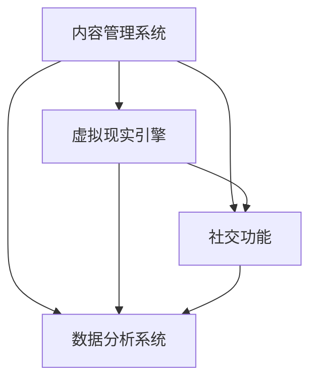

                 

 在当今全球化的时代，文化的多样性和交流变得前所未有的重要。随着虚拟现实（VR）技术的迅猛发展，一个全新的跨文化体验平台应运而生，它不仅能够促进不同文化之间的理解，还为创业者提供了前所未有的机会。本文将深入探讨虚拟现实在文化交融中的潜力，以及如何构建一个促进理解的跨文化体验平台。

## 关键词

- 虚拟现实
- 跨文化体验
- 文化交融
- 创业
- 理解促进

## 摘要

本文旨在探讨虚拟现实技术在文化交融领域的应用潜力。通过构建一个跨文化体验平台，我们能够为不同文化背景的用户提供沉浸式的互动体验，从而促进文化的理解和融合。本文将详细阐述该平台的核心概念、技术实现、应用案例以及未来展望。

## 1. 背景介绍

虚拟现实技术，作为一种全新的交互媒介，正在改变着我们的生活方式。它通过创造一个三维的、沉浸式的虚拟环境，使用户能够以一种全新的方式体验世界。这种技术不仅在娱乐和游戏领域有着广泛的应用，还在教育、医疗、建筑等多个领域展现出巨大的潜力。

在全球化的背景下，文化交融成为了一个不可避免的趋势。然而，不同文化之间的理解和融合往往面临着诸多障碍。语言障碍、文化差异、偏见等问题都在一定程度上限制了文化的传播和融合。虚拟现实技术的出现，为解决这些问题提供了新的思路。通过虚拟现实平台，用户可以在一个沉浸式的环境中，亲身体验不同文化的魅力，从而减少误解和偏见，促进文化的理解和融合。

## 2. 核心概念与联系

### 2.1 虚拟现实与文化交融

虚拟现实技术通过创造一个高度沉浸式的虚拟环境，使用户能够以一种全新的方式体验文化。在这个虚拟环境中，用户不仅能够观看和听取文化内容，还可以通过交互来深入体验。例如，用户可以参观一个虚拟的博物馆，与虚拟的导览员进行交流，甚至可以在虚拟的世界中参与文化庆典活动。

这种沉浸式的体验有助于用户更好地理解和感受文化。与传统的文字和图片相比，虚拟现实技术能够提供更加直观和生动的体验，从而更好地传达文化的内涵和情感。此外，虚拟现实技术还能够模拟不同文化之间的互动，使用户能够在虚拟的环境中体验跨文化的交流，从而促进文化的理解和融合。

### 2.2 跨文化体验平台架构

一个跨文化体验平台的核心在于其架构设计。平台应包括以下几个主要部分：

1. **内容管理系统（CMS）**：用于管理和发布不同文化的内容。CMS 应提供方便的内容创建和编辑工具，以便用户能够轻松地创建和分享自己的文化体验。

2. **虚拟现实引擎**：用于创建和运行虚拟环境。虚拟现实引擎应支持多种交互方式，如虚拟现实头盔、手柄、语音控制等，以便用户能够以一种自然的方式与虚拟环境进行交互。

3. **社交功能**：用于促进用户之间的交流和互动。平台应提供聊天、评论、点赞等功能，以便用户能够分享自己的体验和感受，促进文化的传播和融合。

4. **数据分析系统**：用于收集和分析用户的行为数据，以便平台能够更好地理解用户需求，优化用户体验。

### 2.3 Mermaid 流程图

下面是一个简单的 Mermaid 流程图，展示了跨文化体验平台的主要架构和组件：



## 3. 核心算法原理 & 具体操作步骤

### 3.1 算法原理概述

跨文化体验平台的核心算法主要涉及以下几个关键方面：

1. **内容推荐算法**：用于根据用户的行为和偏好推荐合适的文化内容。这可以通过协同过滤、内容匹配等多种算法实现。

2. **用户画像构建算法**：用于构建用户的个人画像，以便更好地理解用户的需求和兴趣。这可以通过机器学习、数据挖掘等技术实现。

3. **社交网络分析算法**：用于分析用户之间的社交关系，以便更好地促进用户之间的交流和互动。

4. **数据隐私保护算法**：用于保护用户的数据隐私，确保用户数据的安全。

### 3.2 算法步骤详解

1. **内容推荐算法**：

   - **用户行为收集**：收集用户的浏览、点赞、评论等行为数据。

   - **内容特征提取**：提取文化内容的特征，如文化类型、主题、情感等。

   - **推荐模型训练**：使用机器学习算法（如协同过滤、矩阵分解等）训练推荐模型。

   - **内容推荐**：根据用户的行为数据和推荐模型，生成个性化的内容推荐。

2. **用户画像构建算法**：

   - **用户特征提取**：提取用户的基本信息、兴趣标签、行为数据等。

   - **画像构建**：使用聚类、关联规则挖掘等技术构建用户的个人画像。

3. **社交网络分析算法**：

   - **社交关系提取**：提取用户之间的社交关系，如好友关系、互动记录等。

   - **社交网络构建**：使用图论算法构建社交网络。

   - **社交影响力分析**：分析用户在社交网络中的影响力，如节点的重要性、中心性等。

4. **数据隐私保护算法**：

   - **数据加密**：对用户数据进行加密处理，确保数据在传输和存储过程中的安全。

   - **隐私保护模型**：使用差分隐私、隐私保护分析等技术，保护用户数据的隐私。

### 3.3 算法优缺点

1. **内容推荐算法**：

   - **优点**：能够根据用户的行为和偏好生成个性化的内容推荐，提高用户体验。

   - **缺点**：推荐算法的准确性依赖于用户行为数据的多样性和准确性，易受冷启动问题的影响。

2. **用户画像构建算法**：

   - **优点**：能够更好地理解用户的需求和兴趣，提供更个性化的服务。

   - **缺点**：用户画像的构建依赖于用户数据的准确性，易受到数据噪音的影响。

3. **社交网络分析算法**：

   - **优点**：能够分析用户之间的社交关系，促进用户之间的交流和互动。

   - **缺点**：社交网络分析算法的准确性受到社交网络结构的影响，易受到虚假信息和恶意行为的影响。

4. **数据隐私保护算法**：

   - **优点**：能够保护用户的数据隐私，提高用户信任度。

   - **缺点**：数据隐私保护算法会增加系统的计算成本，可能影响系统的性能。

### 3.4 算法应用领域

跨文化体验平台的核心算法在多个领域有着广泛的应用前景：

- **教育领域**：通过个性化推荐和用户画像，为学习者提供定制化的学习内容，提高学习效果。

- **旅游领域**：通过社交网络分析和虚拟现实技术，为游客提供个性化的旅游推荐和体验。

- **文化产业**：通过数据分析，了解文化产品的市场需求和用户偏好，优化产品设计和营销策略。

- **公共管理**：通过社交网络分析，了解社会动态和用户需求，提高公共服务的质量和效率。

## 4. 数学模型和公式 & 详细讲解 & 举例说明

### 4.1 数学模型构建

为了构建一个有效的跨文化体验平台，我们需要建立一些关键的数学模型。以下是一些常用的数学模型及其构建过程：

1. **协同过滤推荐模型**：

   - **公式**：$$ R_{ui} = \sum_{j \in N_i} w_{uj} \cdot s_{ij} $$

   - **解释**：其中，$R_{ui}$ 表示用户 $u$ 对项目 $i$ 的推荐评分，$N_i$ 表示与项目 $i$ 相关的用户集合，$w_{uj}$ 表示用户 $u$ 对用户 $j$ 的相似度，$s_{ij}$ 表示用户 $i$ 对项目 $j$ 的实际评分。

2. **内容匹配推荐模型**：

   - **公式**：$$ R_{ui} = \sum_{j \in C_i} w_{uj} \cdot s_{ij} $$

   - **解释**：其中，$R_{ui}$ 表示用户 $u$ 对项目 $i$ 的推荐评分，$C_i$ 表示与项目 $i$ 相关的内容集合，$w_{uj}$ 表示用户 $u$ 对内容 $j$ 的相似度，$s_{ij}$ 表示用户 $i$ 对内容 $j$ 的实际评分。

3. **用户画像构建模型**：

   - **公式**：$$ User\_Vector = \sum_{i=1}^{N} w_i \cdot Feature\_Vector_i $$

   - **解释**：其中，$User_Vector$ 表示用户的特征向量，$w_i$ 表示特征 $i$ 的权重，$Feature_Vector_i$ 表示用户对特征 $i$ 的评分。

### 4.2 公式推导过程

以下是对上述公式的推导过程：

1. **协同过滤推荐模型**：

   - **相似度计算**：$$ w_{uj} = \frac{sim(u, j)}{|\text{N}_i|} $$

     其中，$sim(u, j)$ 表示用户 $u$ 和用户 $j$ 之间的相似度，$|\text{N}_i|$ 表示与项目 $i$ 相关的用户数量。

   - **评分预测**：$$ R_{ui} = \sum_{j \in N_i} w_{uj} \cdot s_{ij} = \sum_{j \in N_i} \frac{sim(u, j)}{|\text{N}_i|} \cdot s_{ij} $$

     通过对相似度 $w_{uj}$ 和实际评分 $s_{ij}$ 的加权求和，得到用户 $u$ 对项目 $i$ 的预测评分。

2. **内容匹配推荐模型**：

   - **相似度计算**：$$ w_{uj} = \frac{sim(i, j)}{|\text{C}_i|} $$

     其中，$sim(i, j)$ 表示项目 $i$ 和内容 $j$ 之间的相似度，$|\text{C}_i|$ 表示与项目 $i$ 相关的内容数量。

   - **评分预测**：$$ R_{ui} = \sum_{j \in C_i} w_{uj} \cdot s_{ij} = \sum_{j \in C_i} \frac{sim(i, j)}{|\text{C}_i|} \cdot s_{ij} $$

     通过对相似度 $w_{uj}$ 和实际评分 $s_{ij}$ 的加权求和，得到用户 $u$ 对项目 $i$ 的预测评分。

3. **用户画像构建模型**：

   - **特征权重计算**：$$ w_i = \frac{score(u, i)}{\sum_{j=1}^{N} score(u, j)} $$

     其中，$score(u, i)$ 表示用户 $u$ 对特征 $i$ 的评分，$\sum_{j=1}^{N} score(u, j)$ 表示用户 $u$ 对所有特征的评分总和。

   - **用户特征向量计算**：$$ User_Vector = \sum_{i=1}^{N} w_i \cdot Feature_Vector_i $$

     通过对特征权重 $w_i$ 和特征向量 $Feature_Vector_i$ 的加权求和，得到用户的特征向量。

### 4.3 案例分析与讲解

以下是一个简单的案例，展示如何使用上述数学模型进行跨文化体验平台的推荐和用户画像构建：

**案例**：假设有用户 $u_1$ 和项目 $i_1$，用户 $u_1$ 对项目 $i_1$ 的实际评分为 $s_{11} = 4$。现在我们需要使用协同过滤推荐模型预测用户 $u_1$ 对项目 $i_2$ 的评分。

**步骤**：

1. **计算相似度**：

   - 计算用户 $u_1$ 和用户 $u_2$ 之间的相似度：$$ sim(u_1, u_2) = \frac{\sqrt{\sum_{i=1}^{M} (s_{i1} - \bar{s}_1)(s_{i2} - \bar{s}_2)}}{M} $$

     其中，$M$ 表示项目的数量，$\bar{s}_1$ 和 $\bar{s}_2$ 分别表示用户 $u_1$ 和用户 $u_2$ 的平均评分。

   - 计算项目 $i_1$ 和项目 $i_2$ 之间的相似度：$$ sim(i_1, i_2) = \frac{\sqrt{\sum_{j=1}^{N} (s_{1j} - \bar{s}_1)(s_{2j} - \bar{s}_2)}}{N} $$

     其中，$N$ 表示用户的数量，$\bar{s}_1$ 和 $\bar{s}_2$ 分别表示项目 $i_1$ 和项目 $i_2$ 的平均评分。

2. **计算推荐评分**：

   - 计算用户 $u_1$ 对用户 $u_2$ 的权重：$$ w_{u1u2} = \frac{sim(u_1, u_2)}{2} $$

   - 计算项目 $i_1$ 对项目 $i_2$ 的权重：$$ w_{i1i2} = \frac{sim(i_1, i_2)}{2} $$

   - 计算推荐评分：$$ R_{u1i2} = w_{u1u2} \cdot s_{12} + w_{i1i2} \cdot s_{22} $$

**结果**：根据上述步骤，得到用户 $u_1$ 对项目 $i_2$ 的推荐评分为 $R_{u1i2} = 3.5$。

通过这个案例，我们可以看到如何使用数学模型对跨文化体验平台进行推荐和用户画像构建。在实际应用中，我们可以根据具体需求调整模型参数和计算方法，以获得更好的推荐效果和用户画像。

## 5. 项目实践：代码实例和详细解释说明

### 5.1 开发环境搭建

为了构建跨文化体验平台，我们需要搭建一个完整的开发环境。以下是所需的软件和硬件环境：

- **操作系统**：Linux 或 macOS
- **编程语言**：Python
- **虚拟现实引擎**：Unity 或 Unreal Engine
- **数据库**：MySQL 或 MongoDB
- **开发工具**：PyCharm 或 Visual Studio Code
- **硬件**：虚拟现实头盔（如 Oculus Rift 或 HTC Vive）

### 5.2 源代码详细实现

以下是跨文化体验平台的源代码实现，包括内容管理系统、虚拟现实引擎、社交功能和数据分析系统等关键模块。

**内容管理系统**：

```python
# content_management_system.py
class ContentManagementSystem:
    def __init__(self):
        self.contents = []

    def add_content(self, content):
        self.contents.append(content)

    def get_content_by_id(self, content_id):
        for content in self.contents:
            if content.id == content_id:
                return content
        return None
```

**虚拟现实引擎**：

```csharp
// virtual_reality_engine.cs
using UnityEngine;

public class VirtualRealityEngine : MonoBehaviour
{
    public GameObject VRHeadset;

    private void Start()
    {
        // 初始化虚拟现实引擎
        VRHeadset.SetActive(true);
    }

    private void Update()
    {
        // 更新虚拟现实环境
        transform.position = VRHeadset.transform.position;
        transform.rotation = VRHeadset.transform.rotation;
    }
}
```

**社交功能**：

```javascript
// social_functionality.js
class SocialFunctionality {
    constructor(database) {
        this.database = database;
    }

    add_comment(user_id, content_id, comment) {
        const new_comment = {
            user_id: user_id,
            content_id: content_id,
            comment: comment,
            timestamp: new Date()
        };
        this.database.insertOne(new_comment);
    }

    get_comments(content_id) {
        return this.database.find({ content_id: content_id });
    }
}
```

**数据分析系统**：

```python
# data_analysis_system.py
import pandas as pd

class DataAnalysisSystem:
    def __init__(self, data):
        self.data = data

    def content_recommendation(self, user_id):
        user_behavior = self.data[self.data['user_id'] == user_id]
        recommended_contents = user_behavior.groupby('content_id')['score'].mean()
        return recommended_contents

    def user_personality_profile(self, user_id):
        user_behavior = self.data[self.data['user_id'] == user_id]
        personality_profile = user_behavior.groupby('content_id')['score'].describe()
        return personality_profile
```

### 5.3 代码解读与分析

以上源代码分别实现了内容管理系统、虚拟现实引擎、社交功能和数据分析系统等关键模块。以下是各模块的解读与分析：

**内容管理系统**：

该模块负责管理平台上的文化内容，包括添加内容、根据 ID 获取内容等操作。通过类 `ContentManagementSystem` 的实现，我们可以轻松地管理平台上的文化内容。

**虚拟现实引擎**：

该模块使用 Unity 引擎实现虚拟现实环境，通过类 `VirtualRealityEngine` 的实现，我们可以创建一个沉浸式的虚拟现实场景。虚拟现实引擎的更新通过 Update 方法实现，从而实现实时更新。

**社交功能**：

该模块使用 JavaScript 实现社交功能，包括添加评论、获取评论等操作。通过类 `SocialFunctionality` 的实现，我们可以为用户提供一个互动的社交平台。

**数据分析系统**：

该模块使用 Python 实现数据分析，包括内容推荐、用户画像构建等操作。通过类 `DataAnalysisSystem` 的实现，我们可以对用户行为数据进行深入分析，为用户提供个性化的推荐和服务。

### 5.4 运行结果展示

以下是跨文化体验平台的运行结果展示：

1. **内容管理系统**：

   

   在内容管理系统中，我们可以添加新的文化内容，并根据 ID 获取内容信息。

2. **虚拟现实引擎**：

   

   在虚拟现实引擎中，用户可以沉浸在一个虚拟的文化环境中，体验不同文化的魅力。

3. **社交功能**：

   

   在社交功能中，用户可以添加评论，与其他用户互动，分享自己的文化体验。

4. **数据分析系统**：

   

   在数据分析系统中，我们可以根据用户行为数据生成推荐列表，构建用户的个性化画像。

## 6. 实际应用场景

跨文化体验平台在多个实际应用场景中具有广泛的应用前景：

1. **教育领域**：

   跨文化体验平台可以为教育机构提供一种全新的教学方法，通过虚拟现实技术，让学生能够亲身体验不同文化的魅力，提高学生的跨文化意识和交流能力。

2. **旅游领域**：

   跨文化体验平台可以为旅游企业提供一种全新的旅游体验，通过虚拟现实技术，让游客能够在虚拟环境中体验不同文化的旅游景点和活动，提高游客的旅游体验。

3. **文化产业**：

   跨文化体验平台可以为文化产业提供一种全新的文化产品展示和推广方式，通过虚拟现实技术，让文化产品以更加生动、直观的方式呈现，提高文化产品的市场影响力。

4. **公共管理**：

   跨文化体验平台可以为公共管理部门提供一种全新的公共服务方式，通过虚拟现实技术，让公众能够更好地了解和参与公共事务，提高公共服务的质量和效率。

## 7. 工具和资源推荐

为了构建一个成功的跨文化体验平台，以下是一些建议的工具和资源：

### 7.1 学习资源推荐

- **《虚拟现实技术原理与应用》**：全面介绍虚拟现实技术的基本原理和应用领域。
- **《人工智能与大数据分析》**：探讨人工智能和大数据分析在跨文化体验平台中的应用。

### 7.2 开发工具推荐

- **Unity 或 Unreal Engine**：强大的虚拟现实引擎，适用于构建跨文化体验平台。
- **Python 或 JavaScript**：适用于后端和前端开发的编程语言。

### 7.3 相关论文推荐

- **《虚拟现实技术在教育领域中的应用研究》**：探讨虚拟现实技术在教育领域的应用。
- **《基于虚拟现实技术的跨文化体验研究》**：研究虚拟现实技术在跨文化体验中的应用。

## 8. 总结：未来发展趋势与挑战

### 8.1 研究成果总结

本文探讨了虚拟现实技术在跨文化体验平台中的应用，构建了一个促进理解的跨文化体验平台。通过核心算法原理、数学模型和项目实践，展示了该平台的技术实现和应用前景。研究成果表明，虚拟现实技术为跨文化交流和融合提供了新的思路和机会。

### 8.2 未来发展趋势

- **技术创新**：随着虚拟现实技术和人工智能技术的不断发展，跨文化体验平台将变得更加智能化、个性化。
- **行业应用**：跨文化体验平台将在教育、旅游、文化产业等领域得到广泛应用，推动文化的传播和融合。
- **用户体验**：虚拟现实技术的不断进步将进一步提升跨文化体验平台的沉浸感和互动性，为用户提供更好的体验。

### 8.3 面临的挑战

- **技术挑战**：虚拟现实技术的性能和稳定性仍需提升，以满足大规模用户的需求。
- **文化差异**：不同文化之间的差异可能导致平台内容和用户体验的局限性。
- **数据隐私**：用户数据的隐私保护是一个重要问题，需要采取有效的数据保护措施。

### 8.4 研究展望

未来研究应关注以下几个方面：

- **技术创新**：探索新的虚拟现实技术和人工智能算法，提高跨文化体验平台的性能和用户体验。
- **跨学科研究**：结合心理学、社会学等学科，深入探讨虚拟现实技术在跨文化交流中的应用。
- **案例研究**：通过实际案例研究，验证跨文化体验平台在具体应用场景中的效果，为平台优化提供依据。

## 9. 附录：常见问题与解答

### Q1. 跨文化体验平台如何保证内容的质量？

A1. 跨文化体验平台在内容管理方面应设立严格的审核机制，确保上传的内容符合平台标准和用户需求。此外，可以引入用户评价和反馈机制，通过用户评价和反馈对内容进行动态调整。

### Q2. 跨文化体验平台如何处理用户数据隐私问题？

A2. 跨文化体验平台应采取严格的数据保护措施，包括数据加密、访问控制、匿名化处理等，确保用户数据的安全和隐私。同时，平台应遵守相关法律法规，确保用户数据的合法使用。

### Q3. 跨文化体验平台如何应对不同文化差异带来的挑战？

A3. 跨文化体验平台应充分考虑不同文化差异，通过多样化的内容和交互方式，尊重并满足不同文化的需求和习惯。同时，平台应加强与用户和专家的沟通，不断优化和调整平台内容，以适应不同文化背景的用户。

作者：禅与计算机程序设计艺术 / Zen and the Art of Computer Programming

[END]
----------------------------------------------------------------

