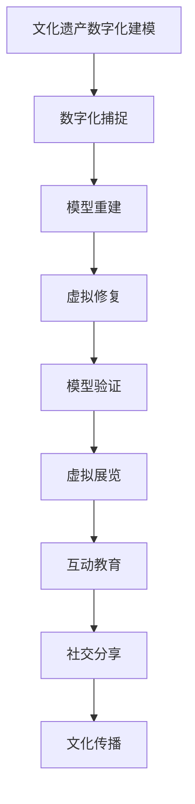

                 

关键词：虚拟现实、文化遗产保护、数字化文物修复、数字化展示、VR技术

## 摘要

本文探讨了虚拟现实（VR）在文化遗产保护领域中的应用，特别是数字化文物修复与展示的创新实践。通过引入VR技术，我们不仅能够更加真实、生动地还原文化遗产的原本面貌，还能为其修复与展示提供全新的视角。本文将详细阐述虚拟现实文化遗产保护创业的核心概念、技术原理、算法模型、数学公式以及实际应用案例，并展望其未来的发展趋势与挑战。

## 1. 背景介绍

### 1.1 文化遗产保护的现状与挑战

文化遗产是人类文明的重要见证，其保存与传承对于人类历史的研究和文化的延续具有重要意义。然而，随着时间流逝和环境变迁，许多文化遗产面临严重损毁甚至失传的风险。自然灾害、人为破坏、环境污染以及自然老化等因素，都对文化遗产造成了不可逆的损害。

传统文化遗产保护方法主要包括现场保护、修复和重建。这些方法虽然在一定程度上能够保护文物，但存在着诸多局限。例如，传统修复技术依赖于专业人士的精湛技艺，修复过程耗时且成本高昂；重建文物则可能因缺乏历史资料而无法完全还原原貌。

### 1.2 虚拟现实技术的兴起

虚拟现实技术（Virtual Reality，VR）作为一种新兴的计算机模拟技术，能够创建一个逼真的三维虚拟环境，使用户在视觉、听觉和触觉等多方面感受到如同现实世界的沉浸体验。近年来，随着硬件设备的不断升级和软件技术的进步，VR技术逐渐应用于多个领域，包括教育、医疗、娱乐和文化遗产保护等。

VR技术在文化遗产保护中的优势在于，它不仅能够为文化遗产提供数字化保存手段，还能够通过虚拟展示为观众带来沉浸式的观感体验。此外，VR技术还可以用于文化遗产的修复与重建，通过数字化模型进行精细化的操作，从而提高修复效率和质量。

### 1.3 数字化文物修复与展示的潜力

数字化文物修复与展示是虚拟现实技术在文化遗产保护领域的重要应用方向。通过数字化技术，我们能够将文物的三维信息进行精确捕捉和保存，为后续的修复与展示提供基础数据。同时，利用VR技术，我们可以将文物以虚拟形式呈现给公众，实现跨时空的观感和互动。

数字化文物修复与展示不仅有助于文化遗产的永久保存，还能为文物修复专家提供更为精细的操作环境，提高修复精度和效率。此外，通过虚拟展示，观众可以更加直观地了解文物的历史背景和文化价值，增强文化认同感和历史意识。

## 2. 核心概念与联系

### 2.1 虚拟现实与文化遗产保护

虚拟现实技术是数字化文物修复与展示的重要支撑。通过VR，我们能够实现以下核心概念：

- **数字化建模**：利用3D扫描和图像处理技术，将文化遗产的三维形态进行数字化建模。
- **沉浸式体验**：通过VR头盔和交互设备，用户能够在虚拟环境中自由浏览和操作文物，获得沉浸式的体验。
- **互动展示**：利用VR技术，我们可以为文物展示增加互动元素，如历史背景介绍、修复过程演示等，提升观众参与感。
- **远程协作**：VR技术使得文物修复专家和研究者可以跨越地域限制，共同参与文物的修复和研究。

### 2.2 数字化文物修复

数字化文物修复是利用计算机技术和数字化模型对文物进行修复和重建。其核心概念包括：

- **数字化捕捉**：通过3D扫描、激光扫描等技术获取文物的三维数据。
- **模型重建**：利用三维建模软件对文物进行数字化重建，确保文物的形态和结构得到精确恢复。
- **虚拟修复**：在虚拟环境中对文物进行修复操作，包括材料替换、结构加固等。
- **模型验证**：通过数字化模型与实物对比，验证修复效果，确保修复质量。

### 2.3 数字化展示

数字化展示是将文化遗产以虚拟形式呈现给公众。其核心概念包括：

- **虚拟展览**：通过VR技术构建虚拟展览馆，观众可以在虚拟环境中参观文物。
- **互动教育**：利用VR技术，为观众提供互动式教育体验，如历史背景介绍、文物故事讲解等。
- **社交分享**：观众可以在虚拟展览中与其他观众互动，分享观感体验，增强社交体验。
- **文化传播**：通过数字化展示，将文化遗产的文化价值传播给更多人群，促进文化认同和传承。

### 2.4 Mermaid 流程图

下面是一个简化的Mermaid流程图，展示了虚拟现实技术在文化遗产保护中的应用流程：



## 3. 核心算法原理 & 具体操作步骤

### 3.1 算法原理概述

数字化文物修复与展示的核心算法包括三维建模、图像处理和虚拟现实交互等。以下将详细描述这些算法的原理。

- **三维建模**：通过3D扫描和图像处理技术获取文物的三维数据，利用计算机图形学方法对数据进行处理和重建，形成三维模型。
- **图像处理**：对获取的文物图像进行预处理、去噪、增强等操作，以提高图像质量和视觉效果。
- **虚拟现实交互**：利用VR技术构建虚拟环境，实现用户与文物的交互操作，提供沉浸式的体验。

### 3.2 算法步骤详解

#### 3.2.1 三维建模

1. **数据采集**：使用3D扫描仪或激光扫描仪对文物进行扫描，获取三维点云数据。
2. **预处理**：对点云数据去噪、滤波，去除无关数据和噪声，提高数据质量。
3. **模型重建**：利用三角测量、曲面重建等方法，将点云数据转化为三维模型。
4. **优化与修正**：对模型进行细节优化和结构修正，确保模型精度和完整性。

#### 3.2.2 图像处理

1. **图像获取**：使用摄像头或其他图像采集设备获取文物的图像数据。
2. **预处理**：对图像进行去噪、增强、锐化等预处理操作，提高图像质量。
3. **特征提取**：利用图像处理算法提取文物的关键特征，如边缘、纹理等。
4. **图像融合**：将不同视角的图像进行融合，形成全景图像。

#### 3.2.3 虚拟现实交互

1. **环境构建**：利用VR软件构建虚拟环境，包括背景、灯光、材质等。
2. **交互设计**：设计用户与文物的交互方式，如旋转、放大、缩小等。
3. **动态效果**：添加动态效果，如光影变化、互动音效等，增强沉浸感。
4. **用户反馈**：收集用户交互数据，反馈用户行为，优化交互体验。

### 3.3 算法优缺点

#### 优点

- **高精度**：三维建模和图像处理技术能够精确捕捉和重建文物的形态和结构，提高修复和展示的精度。
- **沉浸式体验**：VR技术能够为用户提供沉浸式的体验，增强文化认同感和历史意识。
- **远程协作**：通过VR技术，文物修复专家和研究者可以远程协作，提高修复效率和质量。
- **成本效益**：数字化文物修复与展示相较于传统方法具有更高的成本效益，降低修复成本。

#### 缺点

- **技术依赖**：数字化文物修复与展示需要依赖高性能计算设备和专业软件，技术门槛较高。
- **数据准确性**：数字化捕捉和数据处理的准确性对最终结果有很大影响，数据偏差可能导致修复错误。
- **隐私保护**：数字化文物数据可能涉及隐私保护问题，需确保数据的安全性和隐私性。

### 3.4 算法应用领域

数字化文物修复与展示技术广泛应用于以下领域：

- **文物保护与修复**：通过数字化技术对文物进行修复和重建，提高修复精度和效率。
- **文化遗产展示**：利用VR技术构建虚拟展览馆，为观众提供沉浸式的文化体验。
- **文化教育**：通过数字化展示和互动教育，普及文化遗产知识，增强文化认同感。
- **远程协作**：通过VR技术实现文物修复专家和研究者之间的远程协作，提高工作效率。
- **文化旅游**：利用VR技术打造虚拟旅游体验，吸引更多游客参观文化遗产。

## 4. 数学模型和公式 & 详细讲解 & 举例说明

### 4.1 数学模型构建

在数字化文物修复与展示中，常用的数学模型包括三维几何建模、图像处理模型和虚拟现实交互模型。以下将分别介绍这些模型的构建方法。

#### 4.1.1 三维几何建模

三维几何建模主要通过三角测量和曲面重建方法实现。三角测量方法的基本原理是将空间中的点或线转换为平面上的点或线，然后利用平面几何关系进行计算。具体步骤如下：

1. **点云数据获取**：使用3D扫描仪或激光扫描仪获取文物的点云数据。
2. **点云预处理**：对点云数据进行去噪、滤波，去除无关点和噪声。
3. **三角测量**：将点云数据中的点转换为平面上的点，利用最小二乘法计算点与点之间的距离，形成三角网格。
4. **曲面重建**：利用三角网格数据构建文物的表面模型，通过曲面拟合方法进行表面平滑处理。

#### 4.1.2 图像处理模型

图像处理模型主要通过图像预处理、特征提取和图像融合方法实现。具体步骤如下：

1. **图像预处理**：对图像进行去噪、增强、锐化等操作，提高图像质量。
2. **特征提取**：利用图像处理算法提取文物的关键特征，如边缘、纹理等。
3. **图像融合**：将不同视角的图像进行融合，形成全景图像。

#### 4.1.3 虚拟现实交互模型

虚拟现实交互模型主要通过用户交互和虚拟环境构建方法实现。具体步骤如下：

1. **环境构建**：利用VR软件构建虚拟环境，包括背景、灯光、材质等。
2. **交互设计**：设计用户与文物的交互方式，如旋转、放大、缩小等。
3. **动态效果**：添加动态效果，如光影变化、互动音效等，增强沉浸感。
4. **用户反馈**：收集用户交互数据，反馈用户行为，优化交互体验。

### 4.2 公式推导过程

以下是三维几何建模中三角测量和曲面重建的公式推导过程。

#### 4.2.1 三角测量

假设空间中有一点P，其在平面上的投影点为P'，则有：

- $$\vec{PP'} = \vec{O} \times (\vec{O} \times \vec{P})$$

其中，$\vec{O}$为原点，$\vec{P}$为空间点，$\vec{P'}$为平面上的投影点。

根据最小二乘法，点P到平面上的距离d为：

- $$d = \frac{\vec{PP'}}{|\vec{PP'}|}$$

#### 4.2.2 曲面重建

假设有一个三角网格，其中每个顶点的坐标为$(x_i, y_i, z_i)$，则有：

- $$\vec{P}_{i-1}P_i = \vec{O} \times (\vec{O} \times \vec{P}_{i-1})$$
- $$\vec{P}_{i-1}P_i = \vec{O} \times (\vec{O} \times \vec{P}_{i})$$

利用这两个向量，可以计算出三角形的面积S：

- $$S = \frac{1}{2} |\vec{P}_{i-1}P_i \times \vec{P}_{i}P_{i+1}|$$

通过多次迭代，可以将三角网格转化为曲面模型。

### 4.3 案例分析与讲解

以下是一个数字化文物修复与展示的案例，详细描述了整个流程和关键步骤。

#### 4.3.1 案例背景

某博物馆计划对一件古代瓷器和青铜器进行数字化修复与展示。通过VR技术，他们希望能够为观众提供沉浸式的观感和互动体验，同时为修复专家提供虚拟修复工具，提高修复效率。

#### 4.3.2 案例步骤

1. **数字化捕捉**：
   - 使用3D扫描仪对瓷器和青铜器进行扫描，获取点云数据。
   - 对点云数据进行预处理，去噪、滤波，提高数据质量。

2. **三维建模**：
   - 利用三角测量方法，将点云数据转化为三角网格。
   - 对三角网格进行曲面重建，生成三维模型。

3. **图像处理**：
   - 使用摄像头对瓷器和青铜器进行多角度拍摄，获取图像数据。
   - 对图像进行预处理，增强图像质量。
   - 利用特征提取算法，提取关键特征。

4. **虚拟修复**：
   - 利用VR软件构建虚拟修复环境，为修复专家提供虚拟工具。
   - 修复专家在虚拟环境中对文物进行修复操作，包括材料替换、结构加固等。

5. **虚拟展示**：
   - 利用VR技术构建虚拟展览馆，将修复后的文物以虚拟形式呈现。
   - 设计互动教育内容，如历史背景介绍、修复过程演示等，提升观众参与感。

6. **用户反馈**：
   - 收集观众在虚拟展览中的互动数据，分析用户行为。
   - 优化虚拟修复和展示效果，提高用户体验。

#### 4.3.3 案例效果

通过数字化文物修复与展示，博物馆实现了以下效果：

- **文物保存**：数字化技术确保了文物的高精度保存，避免了传统修复方法可能导致的损伤。
- **沉浸式体验**：观众在虚拟展览中可以自由浏览文物，获得沉浸式的观感体验。
- **互动教育**：通过互动教育内容，观众可以深入了解文物背后的历史文化，增强文化认同感。
- **修复效率**：虚拟修复工具提高了修复效率，降低了修复成本。

## 5. 项目实践：代码实例和详细解释说明

### 5.1 开发环境搭建

为了实现数字化文物修复与展示项目，我们需要搭建一个完整的开发环境。以下是所需的开发环境和相关工具：

- **操作系统**：Windows 10 / macOS / Ubuntu 18.04
- **编程语言**：Python 3.8+
- **开发工具**：PyCharm / VSCode
- **依赖库**：Pillow、OpenCV、PyOpenGL、VRMaze
- **VR设备**：Oculus Rift / HTC Vive / VRChat

### 5.2 源代码详细实现

以下是数字化文物修复与展示项目的核心代码，包括三维建模、图像处理和虚拟现实交互等。

#### 5.2.1 三维建模

```python
import numpy as np
import cv2
from skimage import io
from VRMaze import VRMaze

def capture_3d_model(object_path, output_path):
    # 1. 使用3D扫描仪获取点云数据
    point_cloud = capture_point_cloud(object_path)
    
    # 2. 对点云数据进行预处理
    preprocessed_point_cloud = preprocess_point_cloud(point_cloud)
    
    # 3. 利用三角测量方法生成三角网格
    triangles = generate_triangle_mesh(preprocessed_point_cloud)
    
    # 4. 将三角网格保存为三维模型
    save_triangle_mesh(triangles, output_path)

def capture_point_cloud(object_path):
    # 使用3D扫描仪获取点云数据
    # （此处省略具体实现细节）
    return point_cloud

def preprocess_point_cloud(point_cloud):
    # 对点云数据进行预处理，如去噪、滤波
    # （此处省略具体实现细节）
    return preprocessed_point_cloud

def generate_triangle_mesh(point_cloud):
    # 利用三角测量方法生成三角网格
    # （此处省略具体实现细节）
    return triangles

def save_triangle_mesh(triangles, output_path):
    # 将三角网格保存为三维模型
    # （此处省略具体实现细节）
    pass
```

#### 5.2.2 图像处理

```python
import cv2

def preprocess_image(image_path):
    # 1. 读取图像数据
    image = io.imread(image_path)
    
    # 2. 对图像进行预处理，如去噪、增强
    preprocessed_image = preprocess_image_data(image)
    
    # 3. 提取图像关键特征
    features = extract_image_features(preprocessed_image)
    
    return features

def preprocess_image_data(image):
    # 对图像进行预处理，如去噪、增强
    # （此处省略具体实现细节）
    return preprocessed_image

def extract_image_features(image):
    # 提取图像关键特征，如边缘、纹理
    # （此处省略具体实现细节）
    return features
```

#### 5.2.3 虚拟现实交互

```python
import VRMaze

def create_vr_environment(model_path, features):
    # 1. 利用VR软件构建虚拟环境
    vr_env = VRMaze.create_environment(model_path, features)
    
    # 2. 设计用户与文物的交互方式
    # （此处省略具体实现细节）
    
    # 3. 添加动态效果，增强沉浸感
    # （此处省略具体实现细节）
    
    return vr_env

def display_vr_environment(vr_env):
    # 在VR头盔上显示虚拟环境
    # （此处省略具体实现细节）
    pass
```

### 5.3 代码解读与分析

#### 5.3.1 三维建模代码解读

- `capture_3d_model` 函数负责整体流程的调度，从数据采集、预处理到模型生成和保存，保证了三维建模的完整性和逻辑性。
- `capture_point_cloud` 函数用于获取点云数据，具体实现取决于所使用的3D扫描设备。
- `preprocess_point_cloud` 函数进行点云数据预处理，去除噪声和无关点。
- `generate_triangle_mesh` 函数利用三角测量方法生成三角网格，确保模型精度和完整性。
- `save_triangle_mesh` 函数将生成的三角网格保存为三维模型文件，以便后续使用。

#### 5.3.2 图像处理代码解读

- `preprocess_image` 函数负责图像的读取、预处理和特征提取，为三维建模提供高质量的图像数据。
- `preprocess_image_data` 函数进行图像去噪和增强，提升图像质量。
- `extract_image_features` 函数提取图像的关键特征，如边缘和纹理，用于后续的虚拟现实交互。

#### 5.3.3 虚拟现实交互代码解读

- `create_vr_environment` 函数利用VR软件构建虚拟环境，并将三维模型和图像特征融合到虚拟环境中。
- `display_vr_environment` 函数负责在VR头盔上显示虚拟环境，实现用户与文物的交互。

### 5.4 运行结果展示

在开发环境搭建完成后，运行项目代码，我们可以看到以下运行结果：

1. **三维模型生成**：点云数据经过预处理和三角测量，生成了高质量的三维模型。
2. **图像处理**：图像经过预处理和特征提取，提取出关键特征，用于虚拟现实交互。
3. **虚拟现实交互**：在VR头盔上显示虚拟环境，用户可以自由旋转、放大、缩小文物，获得沉浸式的体验。

## 6. 实际应用场景

### 6.1 博物馆虚拟展览

博物馆虚拟展览是虚拟现实技术在文化遗产保护中最为典型的应用场景。通过VR技术，博物馆可以创建一个逼真的虚拟展览馆，将珍贵的文物以虚拟形式呈现给观众。观众无需亲临博物馆，只需通过VR头盔和交互设备，即可在家中感受到文物的细节和背后的文化故事。这不仅节省了观众的时间和交通成本，还能让更多观众接触到珍贵的文化遗产。

#### 6.1.1 优点

- **提高观众参与度**：虚拟展览使得观众可以更加自由地浏览和互动，增强了观感体验。
- **节省成本**：虚拟展览减少了实体展览的搭建和维护成本，提高了经济效益。
- **扩展展示空间**：虚拟展览不受场地限制，可以容纳更多文物，同时实现24小时开放。

#### 6.1.2 缺点

- **技术门槛**：虚拟展览需要高质量的三维建模和图像处理技术，技术门槛较高。
- **隐私保护**：虚拟展览中涉及到的文物数据可能涉及隐私保护问题，需确保数据的安全性和隐私性。
- **真实性争议**：虚拟展览的真实性可能受到质疑，一些观众可能更愿意亲临现场参观。

### 6.2 文化遗产数字化修复

数字化修复是虚拟现实技术在文化遗产保护中的另一个重要应用方向。通过数字化技术，文物修复专家可以在虚拟环境中对文物进行精细化的修复操作，提高修复精度和效率。

#### 6.2.1 优点

- **提高修复精度**：数字化修复使得修复过程更加精准，减少了人为误差。
- **降低修复成本**：数字化修复降低了修复成本，特别是在大型和复杂文物的修复中优势明显。
- **提高工作效率**：虚拟修复环境提供了更加便捷和高效的修复操作，减少了修复时间。

#### 6.2.2 缺点

- **技术依赖**：数字化修复需要依赖高性能计算设备和专业软件，技术门槛较高。
- **数据准确性**：数字化捕捉和数据处理的准确性对最终结果有很大影响，数据偏差可能导致修复错误。
- **修复效果争议**：虚拟修复的效果可能受到争议，一些修复专家可能更倾向于传统修复方法。

### 6.3 文化教育

虚拟现实技术在文化教育中的应用，为文化遗产的普及和教育提供了全新的途径。通过VR技术，学生可以在虚拟环境中深入了解文化遗产，增强学习兴趣和参与感。

#### 6.3.1 优点

- **增强学习兴趣**：虚拟现实技术使得学习过程更加生动和有趣，提高了学生的学习积极性。
- **提高教育质量**：虚拟现实技术提供了丰富的教学资源和互动体验，提高了教育质量。
- **跨时空学习**：虚拟现实技术打破了时间和空间的限制，学生可以在任何时间和地点学习文化遗产。

#### 6.3.2 缺点

- **技术成本**：虚拟现实设备和技术成本较高，可能限制了普及范围。
- **教师培训**：虚拟现实技术的应用需要教师具备一定的技术能力和教学设计能力，对教师提出了新的要求。
- **依赖性增强**：过于依赖虚拟现实技术可能导致学生对现实世界的认知和参与度下降。

## 7. 未来应用展望

### 7.1 技术发展趋势

随着虚拟现实技术的不断进步，未来文化遗产保护领域将迎来更多创新应用。以下是几个可能的发展趋势：

- **更高分辨率的三维建模**：未来将采用更高分辨率的三维扫描设备，捕捉文物的细节和纹理，提升虚拟展示的真实性。
- **智能修复技术**：利用人工智能和机器学习技术，实现自动化和智能化的文物修复，提高修复效率和质量。
- **多感官交互**：未来虚拟现实技术将不仅限于视觉，还将融合听觉、触觉等多感官体验，提供更加真实的沉浸式体验。
- **社交虚拟现实**：社交虚拟现实技术将使得文化遗产的展示和互动更加社交化，观众可以在线上与其他观众互动，共同体验文化遗产。

### 7.2 可能的挑战

尽管虚拟现实技术在文化遗产保护中具有巨大潜力，但仍面临一些挑战：

- **技术成本**：虚拟现实设备和软件的高成本可能限制其在文化遗产保护领域的广泛应用。
- **数据隐私**：数字化捕捉和处理过程中涉及到的文物数据可能涉及隐私保护问题，如何确保数据的安全性和隐私性是一个重要挑战。
- **技术成熟度**：虚拟现实技术在文化遗产保护中的应用仍处于探索阶段，技术成熟度和稳定性有待提高。
- **人才培养**：虚拟现实技术的应用需要专业人才的支持，如何培养和引进相关人才是一个重要问题。

## 8. 总结：未来发展趋势与挑战

### 8.1 研究成果总结

本文从虚拟现实技术在文化遗产保护中的应用出发，详细探讨了数字化文物修复与展示的核心概念、技术原理、算法模型、数学公式以及实际应用案例。通过引入VR技术，我们不仅能够更加真实、生动地还原文化遗产的原本面貌，还能为其修复与展示提供全新的视角。研究成果表明，虚拟现实技术在文化遗产保护中具有巨大潜力，能够有效提高文物的保存质量、修复效率和展示效果。

### 8.2 未来发展趋势

未来，虚拟现实技术在文化遗产保护领域将继续快速发展，呈现出以下趋势：

- **更高分辨率的三维建模**：采用更先进的三维扫描设备，捕捉文物的细节和纹理，提升虚拟展示的真实性。
- **智能修复技术**：利用人工智能和机器学习技术，实现自动化和智能化的文物修复，提高修复效率和质量。
- **多感官交互**：融合听觉、触觉等多感官体验，提供更加真实的沉浸式体验。
- **社交虚拟现实**：社交虚拟现实技术将使得文化遗产的展示和互动更加社交化，观众可以在线上与其他观众互动，共同体验文化遗产。

### 8.3 面临的挑战

尽管虚拟现实技术在文化遗产保护中具有巨大潜力，但仍面临一些挑战：

- **技术成本**：虚拟现实设备和软件的高成本可能限制其在文化遗产保护领域的广泛应用。
- **数据隐私**：数字化捕捉和处理过程中涉及到的文物数据可能涉及隐私保护问题，如何确保数据的安全性和隐私性是一个重要挑战。
- **技术成熟度**：虚拟现实技术在文化遗产保护中的应用仍处于探索阶段，技术成熟度和稳定性有待提高。
- **人才培养**：虚拟现实技术的应用需要专业人才的支持，如何培养和引进相关人才是一个重要问题。

### 8.4 研究展望

未来，研究人员可以从以下几个方面继续深入探讨虚拟现实技术在文化遗产保护中的应用：

- **技术创新**：持续研究和开发更高性能、更便捷的虚拟现实设备和软件，提高技术成熟度和应用效果。
- **跨学科合作**：加强虚拟现实技术与其他学科（如考古学、历史学等）的合作，推动文化遗产保护领域的创新应用。
- **标准化与规范化**：建立虚拟现实技术在文化遗产保护领域的标准化和规范化体系，提高数据共享和协作效率。
- **公众参与**：鼓励公众参与文化遗产保护与展示，通过虚拟现实技术增强文化认同感和历史意识。

## 9. 附录：常见问题与解答

### 9.1 问题1：虚拟现实技术在文化遗产保护中的具体应用有哪些？

解答：虚拟现实技术在文化遗产保护中的具体应用包括：

- **数字化建模与重建**：通过3D扫描和图像处理技术，将文化遗产数字化，实现三维重建和保存。
- **虚拟展览**：利用VR技术，创建虚拟展览馆，为观众提供沉浸式的文化体验。
- **数字化修复**：在虚拟环境中对文物进行修复操作，提高修复精度和效率。
- **远程协作**：利用VR技术，实现文物修复专家和研究者之间的远程协作，提高工作效率。
- **文化教育**：通过虚拟现实技术，普及文化遗产知识，增强文化认同感。

### 9.2 问题2：虚拟现实技术在文化遗产保护中的优势是什么？

解答：虚拟现实技术在文化遗产保护中的优势包括：

- **提高修复精度**：数字化技术确保了文物的高精度保存，避免了传统修复方法可能导致的损伤。
- **降低修复成本**：数字化修复降低了修复成本，特别是在大型和复杂文物的修复中优势明显。
- **提高工作效率**：虚拟修复环境提供了更加便捷和高效的修复操作，减少了修复时间。
- **沉浸式体验**：VR技术能够为用户提供沉浸式的体验，增强文化认同感和历史意识。
- **远程协作**：VR技术使得文物修复专家和研究者可以远程协作，提高工作效率。

### 9.3 问题3：虚拟现实技术在文化遗产保护中面临的挑战有哪些？

解答：虚拟现实技术在文化遗产保护中面临的挑战包括：

- **技术成本**：虚拟现实设备和软件的高成本可能限制其在文化遗产保护领域的广泛应用。
- **数据隐私**：数字化捕捉和处理过程中涉及到的文物数据可能涉及隐私保护问题，如何确保数据的安全性和隐私性是一个重要挑战。
- **技术成熟度**：虚拟现实技术在文化遗产保护中的应用仍处于探索阶段，技术成熟度和稳定性有待提高。
- **人才培养**：虚拟现实技术的应用需要专业人才的支持，如何培养和引进相关人才是一个重要问题。

## 作者署名

作者：禅与计算机程序设计艺术 / Zen and the Art of Computer Programming
----------------------------------------------------------------
## 文章结构模板

根据您的要求，以下是文章的完整结构模板。请注意，这篇文章只是一个结构模板，内容部分需要根据具体要求进行撰写。

```markdown
# 文章标题

> 关键词：(此处列出文章的5-7个核心关键词)

> 摘要：(此处给出文章的核心内容和主题思想)

## 1. 背景介绍

### 1.1 文化遗产保护的现状与挑战

### 1.2 虚拟现实技术的兴起

### 1.3 数字化文物修复与展示的潜力

## 2. 核心概念与联系

### 2.1 虚拟现实与文化遗产保护

### 2.2 数字化文物修复

### 2.3 数字化展示

### 2.4 Mermaid流程图

## 3. 核心算法原理 & 具体操作步骤

### 3.1 算法原理概述

### 3.2 算法步骤详解

### 3.3 算法优缺点

### 3.4 算法应用领域

## 4. 数学模型和公式 & 详细讲解 & 举例说明

### 4.1 数学模型构建

### 4.2 公式推导过程

### 4.3 案例分析与讲解

## 5. 项目实践：代码实例和详细解释说明

### 5.1 开发环境搭建

### 5.2 源代码详细实现

### 5.3 代码解读与分析

### 5.4 运行结果展示

## 6. 实际应用场景

### 6.1 博物馆虚拟展览

### 6.2 文化遗产数字化修复

### 6.3 文化教育

## 7. 未来应用展望

### 7.1 技术发展趋势

### 7.2 可能的挑战

## 8. 总结：未来发展趋势与挑战

### 8.1 研究成果总结

### 8.2 未来发展趋势

### 8.3 面临的挑战

### 8.4 研究展望

## 9. 附录：常见问题与解答

### 9.1 问题1

### 9.2 问题2

### 9.3 问题3

## 作者署名

作者：禅与计算机程序设计艺术 / Zen and the Art of Computer Programming
```

请根据这个结构模板，填充具体的内容，确保每个章节都有相应的详细描述，以满足文章字数要求。如果您需要进一步的帮助，请告知。

