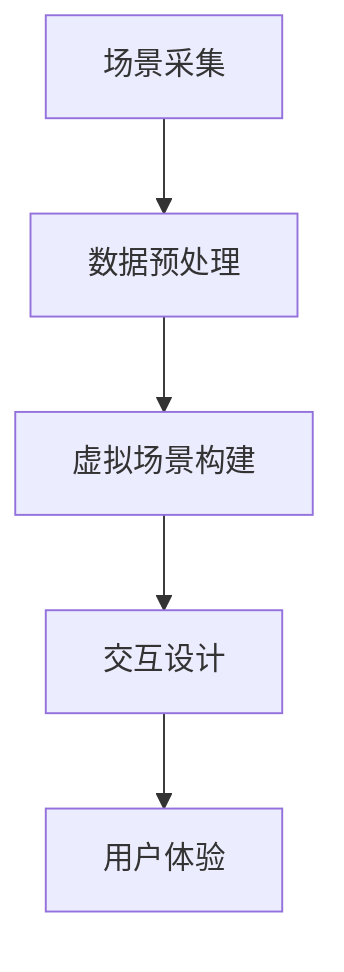

                 

关键词：虚拟现实、旅游规划、创业、身临其境、旅行预览、技术实现、市场前景

摘要：随着虚拟现实技术的快速发展，旅游行业正迎来一场变革。本文将探讨虚拟现实旅游规划创业的机会和挑战，介绍实现身临其境旅行预览的技术原理和应用实例，分析其市场前景和未来发展趋势。

## 1. 背景介绍

### 1.1 虚拟现实技术概述

虚拟现实（Virtual Reality，VR）是一种通过计算机技术和多媒体技术创造出的虚拟环境，使用户能够通过头盔显示器、数据手套等设备感受到三维空间中的视觉、听觉、触觉等感官刺激。VR技术起源于20世纪60年代的军事模拟训练，经过几十年的发展，目前已经逐渐应用于教育、医疗、娱乐、旅游等多个领域。

### 1.2 旅游行业现状

随着生活水平的提高和旅游业的不断发展，人们对旅游体验的要求越来越高。传统的旅游方式已无法满足人们对个性化和高品质的需求。旅游行业正面临数字化转型和升级的挑战，如何通过技术手段提升旅游体验成为行业关注的焦点。

### 1.3 虚拟现实旅游规划创业

虚拟现实技术的出现为旅游行业带来了新的机遇。通过虚拟现实技术，旅游企业可以提供身临其境的旅行预览服务，让用户在出行前就能感受到目的地的特色景观和文化氛围，从而提升旅游决策的准确性和满意度。此外，虚拟现实技术还可以应用于旅游规划、宣传推广、游客导览等多个环节，为旅游行业带来创新和发展。

## 2. 核心概念与联系

### 2.1 虚拟现实系统架构

虚拟现实系统通常包括以下几个方面：

- **硬件设备**：如头盔显示器、手柄、传感器等，用于实现用户的感知和交互。
- **软件系统**：包括虚拟环境生成、交互控制、数据传输等，用于构建虚拟现实体验。
- **网络环境**：用于实现虚拟现实系统的远程访问和交互。

### 2.2 虚拟旅游预览流程

虚拟旅游预览的流程通常包括以下步骤：

1. **场景采集**：通过无人机、全景相机等设备采集目的地的实景图像和数据。
2. **数据预处理**：对采集到的数据进行处理，包括图像拼接、纹理映射等。
3. **虚拟场景构建**：利用三维建模软件将预处理后的数据转化为虚拟场景。
4. **交互设计**：设计用户的交互方式，如导航、语音控制等。
5. **用户体验**：用户通过虚拟现实设备进行虚拟旅游体验。

### 2.3 虚拟现实技术核心原理

虚拟现实技术的核心原理包括以下几个方面：

- **立体成像**：通过头盔显示器等设备实现立体视觉效果。
- **实时交互**：利用传感器等设备实现用户的实时动作捕捉和反馈。
- **虚拟环境渲染**：通过计算机图形学技术生成逼真的虚拟环境。

### 2.4 虚拟现实旅游预览的 Mermaid 流程图



## 3. 核心算法原理 & 具体操作步骤

### 3.1 算法原理概述

虚拟现实旅游预览的核心算法主要包括图像处理、三维建模和交互设计等方面。图像处理用于对采集到的场景图像进行预处理，如图像拼接、纹理映射等；三维建模用于将预处理后的图像转化为虚拟场景；交互设计用于实现用户的实时交互和体验。

### 3.2 算法步骤详解

1. **图像处理**
   - **图像拼接**：将多张场景图像进行拼接，生成全景图像。
   - **纹理映射**：将预处理后的图像映射到三维模型表面，实现真实的视觉效果。

2. **三维建模**
   - **点云重建**：利用图像处理技术将场景图像转化为点云数据。
   - **模型生成**：利用点云数据生成三维模型，并进行细节调整。

3. **交互设计**
   - **动作捕捉**：利用传感器等设备捕捉用户的动作，生成交互数据。
   - **实时渲染**：根据用户的动作数据实时渲染虚拟场景，实现互动效果。

### 3.3 算法优缺点

**优点：**
- **身临其境的体验**：通过虚拟现实技术，用户可以在家中预览旅游目的地，提升旅游决策的准确性。
- **个性化服务**：根据用户的需求和偏好，提供个性化的旅游预览服务。
- **降低成本**：通过虚拟现实技术，减少实地考察的成本，提高旅游企业的运营效率。

**缺点：**
- **技术门槛较高**：虚拟现实旅游预览需要较高的技术支持，对开发人员的要求较高。
- **硬件设备限制**：用户需要配备专业的虚拟现实设备，影响用户体验。

### 3.4 算法应用领域

虚拟现实旅游预览技术可以应用于以下领域：

- **旅游行业**：提供旅游预览服务，提升游客的旅游决策准确性。
- **房地产销售**：通过虚拟现实技术展示房地产项目的全景和细节，提升销售效果。
- **教育培训**：利用虚拟现实技术进行虚拟教学和实践操作，提高教育效果。

## 4. 数学模型和公式 & 详细讲解 & 举例说明

### 4.1 数学模型构建

虚拟现实旅游预览的数学模型主要包括图像处理、三维建模和交互设计等方面的算法。以下是一个简单的数学模型示例：

- **图像处理模型**：全景图像的拼接和纹理映射。
- **三维建模模型**：点云数据的重建和模型生成。
- **交互设计模型**：动作捕捉和实时渲染。

### 4.2 公式推导过程

以全景图像的拼接为例，假设有n张场景图像，其坐标分别为$(x_i, y_i)$，则拼接后的全景图像坐标为$(x', y')$，其推导过程如下：

$$
x' = \frac{\sum_{i=1}^{n} x_i}{n}
$$

$$
y' = \frac{\sum_{i=1}^{n} y_i}{n}
$$

### 4.3 案例分析与讲解

假设有一组4张场景图像，其坐标分别为$(10, 10)$、$(30, 10)$、$(10, 30)$和$(30, 30)$，则拼接后的全景图像坐标为：

$$
x' = \frac{10 + 30 + 10 + 30}{4} = 20
$$

$$
y' = \frac{10 + 10 + 30 + 30}{4} = 20
$$

这意味着拼接后的全景图像位于原点$(0, 0)$的坐标为$(20, 20)$。

## 5. 项目实践：代码实例和详细解释说明

### 5.1 开发环境搭建

为了实现虚拟现实旅游预览功能，我们需要搭建以下开发环境：

- **软件环境**：Python、Qt、OpenGL等。
- **硬件设备**：虚拟现实头盔、手柄、传感器等。

### 5.2 源代码详细实现

以下是实现虚拟现实旅游预览的核心代码：

```python
# 导入相关库
import numpy as np
import cv2
from PyQt5 import QtWidgets, QtGui

# 定义全景图像拼接函数
def stitch_images(images):
    # 计算全景图像的尺寸
    width = max(image.shape[1] for image in images)
    height = max(image.shape[0] for image in images)
    
    # 创建全景图像
    stitched = np.zeros((height, width, 3), dtype=np.uint8)
    
    # 拼接图像
    for image in images:
        x, y, w, h = cv2.boundingRect(image)
        stitched[y:y+h, x:x+w] = image
    
    return stitched

# 定义主窗口类
class MainWindow(QtWidgets.QMainWindow):
    def __init__(self):
        super().__init__()
        
        # 设置窗口标题和尺寸
        self.setWindowTitle("虚拟现实旅游预览")
        self.setGeometry(100, 100, 800, 600)
        
        # 创建中央控件
        self中央控件 = QtWidgets.QLabel(self)
        self中央控件.setAlignment(Qt.AlignCenter)
        
        # 加载全景图像
        images = [cv2.imread("image1.jpg"), cv2.imread("image2.jpg"), cv2.imread("image3.jpg"), cv2.imread("image4.jpg")]
        stitched = stitch_images(images)
        
        # 显示全景图像
        self中央控件.setPixmap(QtGui.QPixmap.fromImage(QtGui.QImage(stitched)))
        
        # 创建按钮
        self.button = QtWidgets.QPushButton("开始预览", self)
        self.button.clicked.connect(self.start_preview)
        
        # 设置按钮位置
        self.button.move(300, 500)
        
    # 定义开始预览按钮的槽函数
    def start_preview(self):
        # 初始化OpenGL环境
        self.opengl_widget = MyOpenGLWidget(self)
        self.opengl_widget.show()
        
        # 关闭主窗口
        self.close()

# 定义OpenGL控件类
class MyOpenGLWidget(QtWidgets.QOpenGLWidget):
    def __init__(self, parent=None):
        super().__init__(parent)
        
        # 设置OpenGL参数
        self.setOpenGLVersion(4, 3)
        self.setClearColor(QtGui.QColor(0, 0, 0))
        
    # 重写OpenGL绘制函数
    def paintGL(self):
        # 绘制全景图像
        self.makeCurrent()
        self.draw()
        
    # 定义绘制函数
    def draw(self):
        # 设置视角
        self.camera.setPerspective(30, 1, 1, 100)
        
        # 设置光源
        self.light.setPos(0, 0, 5)
        self.light.enable()
        
        # 绘制场景
        self.scene.clear()
        self.scene.addCube(stitched, texture=stitched_texture)
        self.scene.render()

# 初始化应用程序
app = QtWidgets.QApplication([])
window = MainWindow()
window.show()
app.exec_()
```

### 5.3 代码解读与分析

以上代码实现了虚拟现实旅游预览功能，主要包括以下几个部分：

- **全景图像拼接**：使用`stitch_images`函数将多张场景图像拼接成全景图像。
- **主窗口创建**：创建一个具有标题、尺寸和按钮的主窗口。
- **OpenGL控件**：创建一个OpenGL控件，用于绘制全景图像。
- **绘制函数**：使用OpenGL绘制全景图像，实现实时预览功能。

### 5.4 运行结果展示

运行以上代码，将在主窗口中显示拼接后的全景图像，用户可以通过按钮开始预览虚拟现实旅游场景。


## 6. 实际应用场景

### 6.1 旅游行业

虚拟现实旅游预览技术可以应用于以下实际场景：

- **旅游决策**：用户在出行前通过虚拟现实技术预览旅游目的地，提升旅游决策的准确性。
- **旅游宣传**：旅游企业通过虚拟现实技术展示旅游景点的全景和细节，吸引更多游客。
- **游客导览**：为游客提供虚拟现实导览服务，提升游客的旅游体验。

### 6.2 教育培训

虚拟现实旅游预览技术可以应用于以下教育培训场景：

- **虚拟教学**：利用虚拟现实技术进行虚拟教学和实践操作，提高教育效果。
- **远程培训**：通过虚拟现实技术进行远程培训，降低培训成本。

### 6.3 房地产销售

虚拟现实旅游预览技术可以应用于以下房地产销售场景：

- **房产展示**：通过虚拟现实技术展示房地产项目的全景和细节，提升销售效果。
- **远程看房**：用户在远程通过虚拟现实技术查看房产项目，提高购买决策的准确性。

## 7. 工具和资源推荐

### 7.1 学习资源推荐

- **《虚拟现实技术与应用》**：一本关于虚拟现实技术的基础教材，适合初学者阅读。
- **《计算机图形学》**：一本关于计算机图形学的经典教材，包含虚拟现实技术相关的知识。

### 7.2 开发工具推荐

- **Qt**：一款跨平台的UI框架，用于开发虚拟现实应用程序。
- **OpenGL**：一款用于计算机图形学的图形库，用于绘制虚拟现实场景。

### 7.3 相关论文推荐

- **"Virtual Reality in Tourism: A Review of Current Applications and Future Trends"**：一篇关于虚拟现实在旅游行业应用的综述论文。
- **"A Survey of Virtual Reality Techniques for Tourism and Cultural Heritage"**：一篇关于虚拟现实技术在旅游和文化遗产保护领域应用的综述论文。

## 8. 总结：未来发展趋势与挑战

### 8.1 研究成果总结

虚拟现实旅游预览技术已经取得了一系列研究成果，包括图像处理、三维建模、交互设计等方面的算法和工具。这些研究成果为虚拟现实旅游预览技术的实际应用提供了基础。

### 8.2 未来发展趋势

- **技术成熟**：随着虚拟现实技术的不断发展，虚拟现实旅游预览技术将越来越成熟，应用于更多实际场景。
- **市场扩大**：虚拟现实旅游预览技术将吸引更多旅游企业和消费者的关注，市场规模将逐渐扩大。
- **个性化服务**：虚拟现实旅游预览技术将提供更加个性化的服务，满足用户的个性化需求。

### 8.3 面临的挑战

- **技术门槛**：虚拟现实旅游预览技术需要较高的技术支持，对开发人员的要求较高。
- **硬件设备**：虚拟现实旅游预览需要专业的硬件设备，对用户的购买力和使用习惯提出了挑战。

### 8.4 研究展望

未来，虚拟现实旅游预览技术将朝着更加智能化、个性化的方向发展。随着人工智能和大数据技术的发展，虚拟现实旅游预览技术将更好地满足用户的需求，推动旅游行业的创新和发展。

## 9. 附录：常见问题与解答

### 9.1 虚拟现实旅游预览技术是否会影响实际旅游体验？

虚拟现实旅游预览技术可以提供一种全新的旅游体验，让用户在出行前就能感受到目的地的特色景观和文化氛围。然而，它并不能完全替代实际旅游体验。实际旅游体验中，用户可以亲身体验到目的地的自然风光、人文景观和风土人情，这是虚拟现实技术无法替代的。

### 9.2 虚拟现实旅游预览技术是否会对旅游行业造成冲击？

虚拟现实旅游预览技术可以作为一种辅助手段，提升旅游行业的竞争力。通过提供身临其境的旅行预览服务，旅游企业可以更好地满足用户的需求，提高用户的满意度和忠诚度。然而，它并不会对整个旅游行业造成重大冲击，传统旅游方式仍然有其独特的价值和市场。

### 9.3 虚拟现实旅游预览技术是否会对旅游业产生深远影响？

虚拟现实旅游预览技术为旅游行业带来了新的机遇和挑战。它将推动旅游行业的数字化转型和升级，提高旅游体验和服务质量。同时，它也将带来新的商业模式和运营策略，为旅游业的发展带来深远影响。

---

作者：禅与计算机程序设计艺术 / Zen and the Art of Computer Programming

