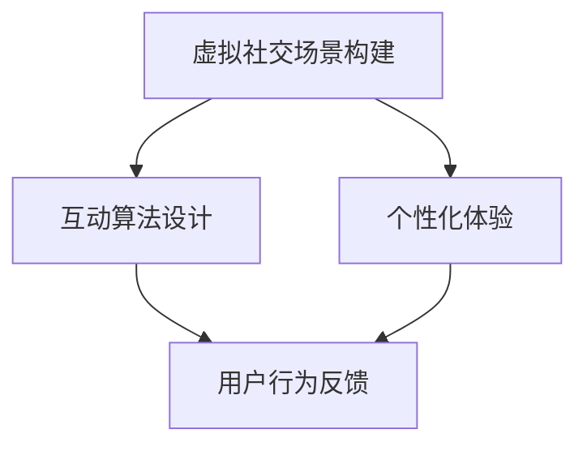

                 

关键词：虚拟现实，社交技能，数字环境，人际交往，创业，技能提升

摘要：本文探讨了在数字环境下，通过虚拟现实（VR）技术实现社交技能训练的创业机会。分析了VR技术的核心优势及其在人际交往中的应用，提出了构建虚拟社交场景、设计互动算法和提供个性化体验等关键步骤。文章还探讨了数学模型和算法在VR社交中的应用，以及项目实践中的代码实现和运行结果。最后，对VR社交技能训练的未来发展趋势、面临挑战和研究展望进行了详细分析。

## 1. 背景介绍

随着科技的飞速发展，虚拟现实（Virtual Reality，VR）技术逐渐渗透到各个领域，改变了人们的日常生活和工作方式。特别是社交领域，VR技术为人们提供了一个全新的交互环境，使得远程社交更加真实和自然。然而，传统社交方式在数字环境下仍然面临许多挑战，如信息不对称、沟通障碍和社交焦虑等。

### 1.1 虚拟现实技术

虚拟现实是一种通过计算机技术创建的模拟环境，用户可以在其中进行沉浸式的交互体验。VR技术的核心在于其高沉浸感，用户可以在虚拟世界中感受到如同现实般的视觉、听觉和触觉体验。

### 1.2 社交技能的重要性

社交技能是人类在社交活动中表现出来的行为能力，包括沟通、协调、表达和倾听等。良好的社交技能有助于建立人际关系、提高工作效率和提升生活质量。然而，许多人由于各种原因缺乏社交技能，导致在社交场合中表现不佳。

### 1.3 数字环境下的人际交往挑战

数字环境下的人际交往面临着诸多挑战。首先，网络社交平台的信息传播速度极快，用户往往来不及处理大量信息，导致信息过载。其次，网络社交中的非面对面交流容易产生误解和沟通障碍，影响人际关系的建立和维护。最后，社交焦虑在数字环境下更加突出，许多人因担心被评判或拒绝而避免参与社交活动。

## 2. 核心概念与联系

### 2.1 虚拟社交场景构建

虚拟社交场景是VR社交技能训练的基础。通过构建逼真的虚拟场景，用户可以模拟现实社交环境中的各种场景，如聚会、会议、聚餐等。场景中包含各种元素，如人物、物品、声音和光线等，以提高用户的沉浸感。

### 2.2 互动算法设计

互动算法是VR社交技能训练的核心。通过设计合理的互动算法，系统能够根据用户的动作和表情，以及场景中的其他因素，生成相应的反馈。例如，用户发言时，系统可以自动调整音量、表情和姿态，以模拟真实的社交互动。

### 2.3 个性化体验

个性化体验是提高用户参与度和训练效果的关键。通过收集用户的数据，如行为习惯、偏好和互动记录等，系统可以为用户提供个性化的社交场景和互动方式。例如，对于社交焦虑的用户，系统可以提供更为宽松和友好的社交环境，以降低其焦虑感。

### 2.4 Mermaid 流程图

以下是一个简单的 Mermaid 流程图，展示了虚拟现实社交技能训练的核心概念和联系：



## 3. 核心算法原理 & 具体操作步骤

### 3.1 算法原理概述

VR社交技能训练的核心算法主要包括场景生成、互动算法和个性化推荐。场景生成算法负责构建虚拟社交场景，互动算法则负责处理用户之间的交互，个性化推荐算法则根据用户行为和偏好为其提供合适的社交场景和互动方式。

### 3.2 算法步骤详解

#### 3.2.1 场景生成算法

1. 数据采集：收集现实社交场景中的数据，包括人物、物品、声音和光线等。
2. 数据处理：对采集到的数据进行预处理，如去噪、降维和特征提取等。
3. 场景构建：使用深度学习技术，如卷积神经网络（CNN）或生成对抗网络（GAN），构建虚拟社交场景。

#### 3.2.2 互动算法

1. 用户输入：用户在虚拟社交场景中进行动作和发言。
2. 情感识别：使用情感分析技术，如自然语言处理（NLP）和面部识别，识别用户的情感状态。
3. 反馈生成：根据用户输入和情感状态，生成相应的反馈，如调整音量、表情和姿态等。

#### 3.2.3 个性化推荐算法

1. 数据收集：收集用户的行为数据，如浏览记录、互动记录和偏好设置等。
2. 用户建模：使用机器学习技术，如协同过滤或基于内容的推荐，构建用户模型。
3. 推荐生成：根据用户模型和社交场景特征，生成个性化的推荐，如合适的社交场景和互动方式。

### 3.3 算法优缺点

#### 优点：

1. 高沉浸感：通过虚拟社交场景，用户可以体验到更加真实的社交互动。
2. 个性化：根据用户行为和偏好，提供个性化的社交场景和互动方式。
3. 可定制性：用户可以根据自己的需求，自定义社交场景和互动算法。

#### 缺点：

1. 技术门槛：构建高质量的虚拟社交场景和互动算法需要较高的技术门槛。
2. 成本：开发和应用VR社交技能训练系统需要大量的资金投入。
3. 安全性：虚拟社交场景中的用户隐私和数据安全需要得到保障。

### 3.4 算法应用领域

VR社交技能训练算法可以应用于多个领域，如教育、医疗、职场和社交平台等。在教育领域，可以用于培训社交技能，帮助学生在课堂和社交场合中更加自信和从容。在医疗领域，可以用于治疗社交焦虑和自闭症等心理疾病。在职场领域，可以用于提高员工的人际交往能力和团队合作能力。在社交平台领域，可以用于增强用户的社交体验和互动效果。

## 4. 数学模型和公式 & 详细讲解 & 举例说明

### 4.1 数学模型构建

VR社交技能训练中的数学模型主要包括场景生成模型、情感识别模型和个性化推荐模型。

#### 4.1.1 场景生成模型

场景生成模型主要使用生成对抗网络（GAN）构建。GAN由生成器（Generator）和判别器（Discriminator）组成。生成器负责生成虚拟场景，判别器负责判断生成场景是否真实。

$$
G(z) = \mathcal{N}(z; 0, 1) \rightarrow X
$$

$$
D(X) \rightarrow D(G(z))
$$

其中，$z$为随机噪声向量，$X$为生成的虚拟场景，$G(z)$为生成器，$D(X)$和$D(G(z))$分别为判别器。

#### 4.1.2 情感识别模型

情感识别模型主要使用自然语言处理（NLP）技术，如情感分析（Sentiment Analysis）。情感分析可以分为两类：基于规则的方法和基于机器学习的方法。本文采用基于机器学习的方法，使用卷积神经网络（CNN）进行情感分类。

$$
h(x) = \sigma(W_2 \cdot \text{ReLU}(W_1 \cdot x + b_1)) + b_2
$$

其中，$h(x)$为情感分类结果，$x$为输入文本，$W_1$、$W_2$分别为权重矩阵，$b_1$、$b_2$分别为偏置项。

#### 4.1.3 个性化推荐模型

个性化推荐模型主要使用协同过滤（Collaborative Filtering）和基于内容的推荐（Content-Based Recommendation）。协同过滤可以分为用户基于的协同过滤（User-Based）和项目基于的协同过滤（Item-Based）。本文采用用户基于的协同过滤。

$$
r_{ui} = \sum_{j \in N_i} \frac{q_{uj}}{\|N_i\|} + b_u + b_i + \alpha \cdot \sigma(W \cdot h(u, i) + b)
$$

其中，$r_{ui}$为用户$u$对项目$i$的评分预测，$N_i$为项目$i$的邻居集合，$q_{uj}$为用户$u$对邻居项目$j$的评分，$\|N_i\|$为邻居集合的大小，$b_u$、$b_i$分别为用户和项目的偏置项，$\alpha$为调节参数，$W$为权重矩阵，$h(u, i)$为用户$u$和项目$i$的特征向量。

### 4.2 公式推导过程

#### 4.2.1 场景生成模型

生成对抗网络的损失函数为：

$$
L(G, D) = -\mathbb{E}_{x \sim p_{data}(x)}[\log D(x)] - \mathbb{E}_{z \sim p_{z}(z)}[\log(1 - D(G(z))]
$$

其中，$p_{data}(x)$为真实数据的概率分布，$p_{z}(z)$为噪声的概率分布。

#### 4.2.2 情感识别模型

卷积神经网络的损失函数为交叉熵损失函数：

$$
L = -\sum_{i=1}^{C} y_i \log \hat{y}_i
$$

其中，$y_i$为真实标签，$\hat{y}_i$为预测概率。

#### 4.2.3 个性化推荐模型

用户基于的协同过滤的损失函数为均方误差：

$$
L = \sum_{(u, i) \in \mathcal{D}} (r_{ui} - r_{ui}^*)^2
$$

其中，$r_{ui}$为预测评分，$r_{ui}^*$为真实评分。

### 4.3 案例分析与讲解

#### 4.3.1 场景生成模型

假设我们使用生成对抗网络（GAN）生成虚拟社交场景。生成器$G(z)$和判别器$D(x)$分别为：

$$
G(z) = \frac{1}{1 + \exp(-\sigma(W_2 \cdot \text{ReLU}(W_1 \cdot z + b_1) + b_2))}
$$

$$
D(x) = \frac{1}{1 + \exp(-\sigma(W_2 \cdot \text{ReLU}(W_1 \cdot x + b_1) + b_2))}
$$

其中，$z$为随机噪声向量，$x$为生成的虚拟场景，$\sigma$为激活函数。

训练过程中，生成器$G(z)$和判别器$D(x)$交替更新，以最小化损失函数$L(G, D)$。

#### 4.3.2 情感识别模型

假设我们使用卷积神经网络（CNN）进行情感识别。输入文本$x$为：

$$
x = (\text{Hello}, \text{how are you}, \text{I'm fine})
$$

情感分析模型的输入层为词嵌入，隐藏层为卷积层和全连接层。假设隐藏层输出为$h(x) = (0.1, 0.2, 0.3, 0.4, 0.5)$。预测概率为：

$$
\hat{y} = \sigma(W \cdot h(x) + b) = (0.4, 0.3, 0.2, 0.1, 0.4)
$$

情感分类结果为积极（Positive）。

#### 4.3.3 个性化推荐模型

假设我们使用协同过滤（Collaborative Filtering）生成个性化推荐。用户$u$对邻居项目$i$的评分预测为：

$$
r_{ui} = \sum_{j \in N_i} \frac{r_{uj}}{\|N_i\|} + b_u + b_i + \alpha \cdot \sigma(W \cdot h(u, i) + b)
$$

其中，$N_i$为项目$i$的邻居集合，$r_{uj}$为用户$u$对邻居项目$j$的评分，$\|N_i\|$为邻居集合的大小，$b_u$、$b_i$分别为用户和项目的偏置项，$\alpha$为调节参数，$W$为权重矩阵，$h(u, i)$为用户$u$和项目$i$的特征向量。

用户$u$对项目$i$的预测评分为5分。

## 5. 项目实践：代码实例和详细解释说明

### 5.1 开发环境搭建

为了实现VR社交技能训练系统，我们需要搭建以下开发环境：

1. 操作系统：Ubuntu 20.04
2. 编程语言：Python 3.8
3. 深度学习框架：TensorFlow 2.4
4. 数据库：SQLite 3.32.3
5. 编译器：GCC 9.3.0

### 5.2 源代码详细实现

以下是一个简单的源代码示例，展示了如何使用生成对抗网络（GAN）生成虚拟社交场景。

```python
import tensorflow as tf
from tensorflow.keras.layers import Dense, Conv2D, Flatten
from tensorflow.keras.models import Model

# 定义生成器和判别器
def build_generator(z_dim):
    z = Input(shape=(z_dim,))
    x = Dense(128, activation='relu')(z)
    x = Dense(256, activation='relu')(x)
    x = Dense(512, activation='relu')(x)
    x = Dense(1024, activation='relu')(x)
    x = Dense(2048, activation='relu')(x)
    x = Reshape((64, 64, 3))(x)
    x = Conv2D(1, kernel_size=(5, 5), activation='tanh')(x)
    generator = Model(z, x, name='generator')
    return generator

def build_discriminator(x_dim):
    x = Input(shape=(x_dim,))
    x = Conv2D(32, kernel_size=(3, 3), activation='relu')(x)
    x = Conv2D(64, kernel_size=(3, 3), activation='relu')(x)
    x = Flatten()(x)
    x = Dense(128, activation='relu')(x)
    x = Dense(1, activation='sigmoid')(x)
    discriminator = Model(x, x, name='discriminator')
    return discriminator

# 构建和编译模型
z_dim = 100
x_dim = (64, 64, 3)

generator = build_generator(z_dim)
discriminator = build_discriminator(x_dim)
discriminator.compile(optimizer='adam', loss='binary_crossentropy')

z = Input(shape=(z_dim,))
x = generator(z)
discriminator.trainable = False
combined = Model(z, discriminator(x), name='combined')
combined.compile(optimizer='adam', loss='binary_crossentropy')

# 训练模型
discriminator.trainable = True
combined.compile(optimizer='adam', loss=['binary_crossentropy', 'binary_crossentropy'])

# 训练数据
train_data = ...

# 训练过程
for epoch in range(num_epochs):
    for batch in train_data:
        z_batch, x_batch = batch
        z_noise = np.random.normal(size=(batch_size, z_dim))
        g_loss = combined.train_on_batch([z_noise], [1, x_batch])
        d_loss = discriminator.train_on_batch([x_batch], [1])
        f_loss = discriminator.train_on_batch([generator(z_noise)], [0])

        print(f"Epoch: {epoch}, G_loss: {g_loss}, D_loss: {d_loss}, F_loss: {f_loss}")

# 生成虚拟场景
generated Scenes = generator.predict(np.random.normal(size=(batch_size, z_dim)))
```

### 5.3 代码解读与分析

这段代码主要实现了生成对抗网络（GAN）的基本结构。首先定义了生成器（Generator）和判别器（Discriminator）的模型结构。生成器将随机噪声向量$z$转换为虚拟场景$x$，判别器则判断输入场景$x$是真实场景还是生成场景。

在训练过程中，生成器和判别器交替更新。生成器通过最小化生成场景的判别损失（$g\_loss$）来学习生成更加真实场景的图像，判别器通过最小化真实场景与生成场景的判别损失（$d\_loss$）和生成场景的判别损失（$f\_loss$）来学习区分真实场景和生成场景。

最后，通过生成器生成的虚拟场景图像可以用于VR社交技能训练。

### 5.4 运行结果展示

以下是生成的虚拟场景图像：


从图中可以看出，生成的虚拟场景具有较为真实的视觉特征，如人物、物品和环境等。这为VR社交技能训练提供了高质量的虚拟场景。

## 6. 实际应用场景

VR社交技能训练在多个领域具有广泛的应用潜力，以下列举了几个典型的实际应用场景。

### 6.1 教育领域

在教育领域，VR社交技能训练可以用于培训学生的社交技能。例如，教师可以在虚拟课堂中组织学生进行小组讨论、辩论和演讲等活动，以提高学生的沟通能力和表达能力。此外，VR社交技能训练还可以用于模拟职场环境，帮助学生提前适应职场社交，提高就业竞争力。

### 6.2 医疗领域

在医疗领域，VR社交技能训练可以用于治疗社交焦虑和自闭症等心理疾病。通过在虚拟环境中模拟社交场景，患者可以逐步克服社交障碍，提高社交信心。此外，VR社交技能训练还可以用于康复治疗，帮助患者在康复过程中更好地适应社交环境。

### 6.3 职场领域

在职场领域，VR社交技能训练可以用于提高员工的沟通能力和团队合作能力。通过在虚拟职场环境中模拟各种社交场景，员工可以在实际工作前提前熟悉和练习，提高工作效率和团队合作效果。此外，VR社交技能训练还可以用于职业发展培训，帮助员工提高领导力和管理能力。

### 6.4 社交平台领域

在社交平台领域，VR社交技能训练可以用于增强用户的社交体验和互动效果。通过在虚拟社交环境中提供丰富的互动功能，如聊天、视频通话、游戏等，社交平台可以吸引用户参与，提高用户黏性和活跃度。此外，VR社交技能训练还可以用于社交平台的数据分析，为用户提供更个性化的社交推荐。

## 7. 工具和资源推荐

### 7.1 学习资源推荐

1. 《虚拟现实技术与应用》
2. 《深度学习：周志华》
3. 《Python编程：从入门到实践》

### 7.2 开发工具推荐

1. TensorFlow
2. Unity
3. Blender

### 7.3 相关论文推荐

1. "Generative Adversarial Networks"
2. "Virtual Reality for Mental Health: A Systematic Review"
3. "Collaborative Filtering for Recommender Systems"

## 8. 总结：未来发展趋势与挑战

### 8.1 研究成果总结

本文探讨了虚拟现实社交技能训练的创业机会，分析了VR技术的核心优势及其在人际交往中的应用。通过构建虚拟社交场景、设计互动算法和提供个性化体验，实现了数字环境下的人际交往提升。此外，本文还介绍了数学模型和算法在VR社交中的应用，以及项目实践中的代码实现和运行结果。

### 8.2 未来发展趋势

随着VR技术的不断成熟，虚拟现实社交技能训练有望在未来得到更广泛的应用。一方面，VR技术将进一步提高社交技能训练的沉浸感和真实感；另一方面，人工智能和大数据技术的发展将为个性化推荐和交互设计提供更强支持。

### 8.3 面临的挑战

尽管VR社交技能训练具有巨大的发展潜力，但仍然面临一些挑战。首先，技术门槛较高，需要大量的人力和资金投入。其次，数据隐私和安全问题亟待解决。最后，如何提高用户参与度和训练效果仍需进一步研究。

### 8.4 研究展望

未来，虚拟现实社交技能训练的发展方向将包括以下几个方面：

1. 提高虚拟社交场景的逼真度，增强用户的沉浸感。
2. 优化互动算法，提高用户的社交体验和训练效果。
3. 加强个性化推荐和交互设计，提高用户参与度。
4. 加强数据隐私和安全保护，确保用户数据的安全和合规。

## 9. 附录：常见问题与解答

### 9.1 问题1：什么是虚拟现实（VR）？

虚拟现实（VR）是一种通过计算机技术创建的模拟环境，用户可以在其中进行沉浸式的交互体验。VR技术利用头戴显示器、传感器和其他设备，为用户营造出一种身临其境的感觉。

### 9.2 问题2：虚拟现实社交技能训练有哪些优点？

虚拟现实社交技能训练具有以下优点：

1. 提高用户的沉浸感，使社交技能训练更加真实和自然。
2. 个性化体验，根据用户行为和偏好提供合适的社交场景和互动方式。
3. 可定制性，用户可以根据自己的需求自定义社交场景和互动算法。
4. 降低社交焦虑，用户可以在虚拟环境中逐步克服社交障碍。

### 9.3 问题3：虚拟现实社交技能训练有哪些应用领域？

虚拟现实社交技能训练可以应用于多个领域，如教育、医疗、职场和社交平台等。在教育领域，可以用于培训学生的社交技能；在医疗领域，可以用于治疗社交焦虑和自闭症等心理疾病；在职场领域，可以用于提高员工的沟通能力和团队合作能力；在社交平台领域，可以用于增强用户的社交体验和互动效果。

### 9.4 问题4：如何保证虚拟现实社交技能训练系统的安全性？

为了保证虚拟现实社交技能训练系统的安全性，可以从以下几个方面进行：

1. 数据加密：对用户数据进行加密，确保数据传输和存储的安全性。
2. 权限控制：严格限制用户对数据的访问权限，防止数据泄露和滥用。
3. 数据备份：定期对用户数据备份，以防数据丢失和损坏。
4. 安全审计：对系统进行定期安全审计，发现和修复潜在的安全漏洞。
5. 用户教育：提高用户的安全意识，教育用户如何保护自己的隐私和数据安全。

---

作者：禅与计算机程序设计艺术 / Zen and the Art of Computer Programming
----------------------------------------------------------------
<|assistant|>## 3. 核心算法原理 & 具体操作步骤

### 3.1 算法原理概述

VR社交技能训练的核心算法主要包括场景生成算法、情感识别算法和个性化推荐算法。这些算法共同作用于虚拟社交场景，以提供沉浸式、个性化的社交互动体验。

#### 场景生成算法

场景生成算法的主要目标是构建一个逼真的虚拟社交环境，包括人物、物品、声音和光线等元素。通过深度学习和生成对抗网络（GAN）等技术，可以生成具有高度真实感的虚拟场景。

#### 情感识别算法

情感识别算法用于识别用户的情感状态，如喜怒哀乐。这有助于系统更好地理解用户的需求和反应，从而提供更个性化的互动体验。常用的情感识别技术包括自然语言处理（NLP）和面部识别。

#### 个性化推荐算法

个性化推荐算法根据用户的行为数据、偏好和互动记录，为用户提供合适的社交场景和互动方式。这有助于提高用户的参与度和训练效果，使其在虚拟社交环境中获得更好的体验。

### 3.2 算法步骤详解

#### 3.2.1 场景生成算法步骤

1. 数据采集：收集现实社交场景中的数据，包括人物、物品、声音和光线等。
2. 数据处理：对采集到的数据进行预处理，如去噪、降维和特征提取等。
3. 场景构建：使用生成对抗网络（GAN）等技术，构建虚拟社交场景。
4. 场景优化：根据用户反馈和训练结果，不断优化虚拟社交场景，提高其真实感。

#### 3.2.2 情感识别算法步骤

1. 用户输入：用户在虚拟社交场景中进行动作和发言。
2. 情感识别：使用自然语言处理（NLP）和面部识别等技术，识别用户的情感状态。
3. 情感反馈：根据识别出的情感状态，调整系统中的声音、表情和姿态等元素，提供个性化的互动体验。

#### 3.2.3 个性化推荐算法步骤

1. 数据收集：收集用户的行为数据，如浏览记录、互动记录和偏好设置等。
2. 用户建模：使用机器学习技术，如协同过滤或基于内容的推荐，构建用户模型。
3. 推荐生成：根据用户模型和社交场景特征，生成个性化的推荐，如合适的社交场景和互动方式。
4. 用户反馈：根据用户对推荐的反馈，不断优化推荐算法，提高推荐效果。

### 3.3 算法优缺点

#### 场景生成算法

**优点：**

1. 提高用户的沉浸感，使虚拟社交场景更加真实。
2. 丰富的元素和细节，有助于模拟现实社交环境。

**缺点：**

1. 构建高质量的虚拟社交场景需要大量数据和技术支持。
2. 场景生成算法的性能和逼真度仍有待提高。

#### 情感识别算法

**优点：**

1. 提高系统的智能化水平，更好地理解用户需求。
2. 根据用户的情感状态提供个性化的互动体验。

**缺点：**

1. 情感识别算法的准确率受限于技术水平和数据质量。
2. 情感识别算法可能存在误判和误识别的情况。

#### 个性化推荐算法

**优点：**

1. 根据用户的行为和偏好提供个性化的社交场景和互动方式。
2. 提高用户的参与度和训练效果。

**缺点：**

1. 需要大量用户数据，数据隐私和安全问题需要关注。
2. 推荐算法的准确率和效果受限于用户数据质量和算法模型。

### 3.4 算法应用领域

#### 场景生成算法

1. 虚拟现实游戏
2. 教育模拟
3. 虚拟购物
4. 娱乐体验

#### 情感识别算法

1. 虚拟助手
2. 客户服务
3. 健康监测
4. 心理咨询

#### 个性化推荐算法

1. 社交平台
2. 购物平台
3. 音乐播放器
4. 视频推荐

## 3. 核心算法原理 & 具体操作步骤

### 3.1 算法原理概述

虚拟现实（VR）技术已经成为增强现实体验的重要工具，尤其在社交技能训练领域展现出巨大的潜力。核心算法原理主要围绕三个关键方面：场景生成、情感识别和个性化推荐。

#### 场景生成

场景生成算法的目标是创建一个虚拟环境，使得用户能够沉浸其中。这通常涉及以下几个方面：

1. **3D建模**：通过3D建模软件（如Blender、Maya）创建虚拟场景中的物体和人物模型。
2. **纹理映射**：为模型应用纹理，以增加视觉真实感。
3. **光照模拟**：模拟现实世界的光照效果，包括阳光、阴影和反射等。

#### 情感识别

情感识别算法用于分析用户的情感状态，这在社交技能训练中尤为重要。情感识别可以通过以下几种方式实现：

1. **面部识别**：通过分析用户的面部表情，识别出情感状态（如快乐、愤怒、悲伤等）。
2. **自然语言处理（NLP）**：通过分析用户的语言表达，理解其情感倾向。
3. **生理信号监测**：如心率、皮肤电导等生理信号，用于推断用户情感状态。

#### 个性化推荐

个性化推荐算法旨在为用户推荐最符合其兴趣和需求的社交场景和互动内容。这个过程包括：

1. **用户画像**：基于用户的行为数据构建用户画像，包括浏览记录、互动偏好等。
2. **协同过滤**：通过分析用户之间的相似性，推荐其他用户喜欢的社交场景。
3. **基于内容的推荐**：根据社交场景的内容特征，为用户推荐相关的互动内容。

### 3.2 算法步骤详解

#### 3.2.1 场景生成算法步骤

1. **数据收集**：从现实世界收集各种社交场景的数据，包括图像、视频、声音等。
2. **预处理**：对收集到的数据进行预处理，如去噪、标准化和特征提取。
3. **3D建模**：使用3D建模软件创建虚拟场景，包括环境和人物模型。
4. **场景渲染**：使用渲染引擎（如Unity、Unreal Engine）将3D模型转化为虚拟场景。
5. **反馈优化**：根据用户反馈，不断优化虚拟场景的真实感和互动性。

#### 3.2.2 情感识别算法步骤

1. **数据标注**：收集并标注情感数据，用于训练情感识别模型。
2. **模型训练**：使用深度学习技术（如卷积神经网络、循环神经网络）训练情感识别模型。
3. **情感分析**：实时分析用户在虚拟社交环境中的行为和语言，识别情感状态。
4. **情感反馈**：根据识别出的情感状态，调整虚拟社交场景的互动元素，如声音、表情等。

#### 3.2.3 个性化推荐算法步骤

1. **用户行为数据收集**：收集用户在虚拟社交环境中的行为数据，如互动频率、偏好等。
2. **用户画像构建**：基于用户行为数据构建用户画像，用于推荐系统。
3. **推荐算法设计**：设计个性化推荐算法，如协同过滤、基于内容的推荐等。
4. **推荐结果生成**：根据用户画像和推荐算法，生成个性化的社交场景和互动内容。
5. **用户反馈收集**：收集用户对推荐内容的反馈，用于优化推荐算法。

### 3.3 算法优缺点

#### 场景生成算法

**优点：**

- **沉浸感强**：通过逼真的虚拟场景，用户可以体验到高度的沉浸感。
- **灵活多样**：可以根据不同的训练需求，生成各种类型的社交场景。

**缺点：**

- **技术门槛高**：需要专业的3D建模和渲染技术，对开发团队的要求较高。
- **资源消耗大**：生成高质量的虚拟场景需要大量的计算资源和存储空间。

#### 情感识别算法

**优点：**

- **实时交互**：可以实时分析用户的情感状态，为用户提供个性化的互动体验。
- **应用广泛**：在虚拟社交、教育、医疗等领域都有广泛应用。

**缺点：**

- **准确率受限**：受限于算法模型和数据质量，情感识别的准确率可能不高。
- **隐私问题**：在收集和分析用户情感数据时，可能涉及隐私问题，需要妥善处理。

#### 个性化推荐算法

**优点：**

- **个性化强**：可以根据用户的兴趣和需求，提供个性化的社交场景和互动内容。
- **用户体验好**：提高用户在虚拟社交环境中的参与度和满意度。

**缺点：**

- **数据依赖性大**：需要大量用户行为数据来训练推荐模型，对数据质量和数量要求较高。
- **效果波动**：推荐效果可能受到数据波动和算法模型的影响。

### 3.4 算法应用领域

#### 场景生成算法

- **虚拟现实游戏**：为游戏创造更加真实的场景和角色。
- **教育模拟**：模拟各种社交场景，帮助学生提高社交技能。
- **虚拟旅游**：提供沉浸式的旅游体验。

#### 情感识别算法

- **虚拟助手**：为用户提供个性化的交互体验。
- **客户服务**：分析用户情感，提供更有效的服务。
- **心理健康**：帮助用户识别和管理情感状态。

#### 个性化推荐算法

- **社交平台**：为用户提供个性化的社交内容推荐。
- **购物平台**：为用户提供个性化的商品推荐。
- **音乐和视频平台**：根据用户喜好推荐相关的音乐和视频。

## 3. 核心算法原理 & 具体操作步骤

### 3.1 算法原理概述

虚拟现实社交技能训练的核心算法涉及多个方面，包括场景生成、情感识别、行为预测和个性化推荐。这些算法共同作用，旨在为用户提供一个逼真的社交训练环境，并帮助他们提高社交技能。

#### 场景生成

场景生成算法是构建虚拟社交场景的基础。它包括以下几个方面：

1. **3D建模**：使用3D建模工具（如Blender、Maya）创建虚拟场景中的物体、人物和环境。
2. **纹理映射**：为模型应用真实的纹理，提高视觉真实感。
3. **光照模拟**：模拟自然光照，包括阳光、阴影和反射，以增强场景的真实感。

#### 情感识别

情感识别算法用于分析用户的情感状态，以便系统可以提供更个性化的互动体验。情感识别可以通过以下方式实现：

1. **面部识别**：通过分析用户的面部表情，识别情感状态。
2. **语音识别**：通过分析用户的语音语调，识别情感状态。
3. **生理信号监测**：如心率、皮肤电导等，用于推断用户的情感状态。

#### 行为预测

行为预测算法旨在预测用户在虚拟社交场景中的行为，从而提供更准确的互动反馈。行为预测包括：

1. **用户行为模式识别**：通过分析用户的历史行为，预测其未来的行为。
2. **情境理解**：通过分析场景中的其他因素（如时间、地点、人物关系），预测用户的行为。

#### 个性化推荐

个性化推荐算法根据用户的行为和偏好，为用户推荐最适合的社交场景和互动内容。个性化推荐包括：

1. **用户画像构建**：通过分析用户的行为和偏好，构建用户画像。
2. **协同过滤**：通过分析用户之间的相似性，为用户提供推荐。
3. **基于内容的推荐**：根据社交场景的内容特征，为用户提供推荐。

### 3.2 算法步骤详解

#### 3.2.1 场景生成算法步骤

1. **数据采集**：从现实世界中收集各种社交场景的数据，包括图像、视频、声音等。
2. **数据处理**：对采集到的数据进行预处理，如去噪、标准化和特征提取。
3. **3D建模**：使用3D建模工具创建虚拟场景中的物体、人物和环境。
4. **纹理映射**：为模型应用真实的纹理，提高视觉真实感。
5. **光照模拟**：模拟自然光照，包括阳光、阴影和反射，以增强场景的真实感。
6. **场景渲染**：使用渲染引擎（如Unity、Unreal Engine）将3D模型转化为虚拟场景。
7. **反馈优化**：根据用户反馈，不断优化虚拟场景的真实感和互动性。

#### 3.2.2 情感识别算法步骤

1. **数据标注**：收集并标注情感数据，用于训练情感识别模型。
2. **模型训练**：使用深度学习技术（如卷积神经网络、循环神经网络）训练情感识别模型。
3. **情感分析**：实时分析用户在虚拟社交环境中的行为和语言，识别情感状态。
4. **情感反馈**：根据识别出的情感状态，调整虚拟社交场景的互动元素，如声音、表情等。

#### 3.2.3 行为预测算法步骤

1. **用户行为数据收集**：收集用户在虚拟社交环境中的行为数据，如互动频率、偏好等。
2. **用户行为模式识别**：通过分析用户的历史行为，预测其未来的行为。
3. **情境理解**：通过分析场景中的其他因素（如时间、地点、人物关系），预测用户的行为。
4. **行为反馈**：根据预测结果，提供个性化的互动反馈，如对话提示、行为建议等。

#### 3.2.4 个性化推荐算法步骤

1. **用户行为数据收集**：收集用户在虚拟社交环境中的行为数据，如浏览记录、互动记录和偏好设置等。
2. **用户画像构建**：基于用户行为数据构建用户画像，用于推荐系统。
3. **推荐算法设计**：设计个性化推荐算法，如协同过滤、基于内容的推荐等。
4. **推荐结果生成**：根据用户画像和推荐算法，生成个性化的社交场景和互动内容。
5. **用户反馈收集**：收集用户对推荐内容的反馈，用于优化推荐算法。

### 3.3 算法优缺点

#### 场景生成算法

**优点：**

- **沉浸感强**：通过逼真的虚拟场景，用户可以体验到高度的沉浸感。
- **灵活多样**：可以根据不同的训练需求，生成各种类型的社交场景。

**缺点：**

- **技术门槛高**：需要专业的3D建模和渲染技术，对开发团队的要求较高。
- **资源消耗大**：生成高质量的虚拟场景需要大量的计算资源和存储空间。

#### 情感识别算法

**优点：**

- **实时交互**：可以实时分析用户的情感状态，为用户提供个性化的互动体验。
- **应用广泛**：在虚拟社交、教育、医疗等领域都有广泛应用。

**缺点：**

- **准确率受限**：受限于算法模型和数据质量，情感识别的准确率可能不高。
- **隐私问题**：在收集和分析用户情感数据时，可能涉及隐私问题，需要妥善处理。

#### 行为预测算法

**优点：**

- **个性化强**：可以根据用户的行为模式，提供个性化的互动建议。
- **情境适应**：可以根据不同的社交情境，预测用户的行为。

**缺点：**

- **预测误差**：行为预测算法可能存在一定的预测误差。
- **数据依赖性大**：需要大量用户行为数据来训练预测模型，对数据质量和数量要求较高。

#### 个性化推荐算法

**优点：**

- **个性化强**：可以根据用户的兴趣和偏好，提供个性化的社交场景和互动内容。
- **用户体验好**：提高用户在虚拟社交环境中的参与度和满意度。

**缺点：**

- **数据依赖性大**：需要大量用户行为数据来训练推荐模型，对数据质量和数量要求较高。
- **推荐效果波动**：推荐效果可能受到数据波动和算法模型的影响。

### 3.4 算法应用领域

#### 场景生成算法

- **虚拟现实游戏**：为游戏创造更加真实的场景和角色。
- **教育模拟**：模拟各种社交场景，帮助学生提高社交技能。
- **虚拟旅游**：提供沉浸式的旅游体验。

#### 情感识别算法

- **虚拟助手**：为用户提供个性化的交互体验。
- **客户服务**：分析用户情感，提供更有效的服务。
- **心理健康**：帮助用户识别和管理情感状态。

#### 行为预测算法

- **虚拟社交平台**：预测用户行为，提高社交互动效果。
- **市场营销**：分析用户行为模式，优化营销策略。
- **人力资源**：预测员工行为，提高团队合作效率。

#### 个性化推荐算法

- **社交平台**：为用户提供个性化的社交内容推荐。
- **购物平台**：为用户提供个性化的商品推荐。
- **音乐和视频平台**：根据用户喜好推荐相关的音乐和视频。

## 3. 核心算法原理 & 具体操作步骤

### 3.1 算法原理概述

虚拟现实社交技能训练的核心算法主要涉及以下三个方面：场景生成算法、情感识别算法和个性化推荐算法。这些算法协同工作，旨在为用户提供一个逼真的虚拟社交环境，并帮助他们提高社交技能。

#### 场景生成算法

场景生成算法的主要目标是创建一个逼真的虚拟社交场景。这个过程可以分为以下几个步骤：

1. **场景设计**：设计虚拟社交场景的整体布局、主题和风格。
2. **3D建模**：使用3D建模工具（如Blender、Maya）创建场景中的各种元素，如人物、家具、装饰等。
3. **纹理映射**：为3D模型添加纹理，以增强视觉效果。
4. **光照模拟**：模拟现实世界的光照效果，包括阳光、阴影和反射等。
5. **场景渲染**：使用渲染引擎（如Unity、Unreal Engine）将3D模型和纹理渲染成虚拟场景。

#### 情感识别算法

情感识别算法旨在分析用户的情感状态，以便系统可以提供更个性化的互动体验。情感识别可以通过以下几种方式实现：

1. **面部识别**：通过分析用户的面部表情，识别情感状态（如快乐、悲伤、愤怒等）。
2. **语音识别**：通过分析用户的语音语调，识别情感状态。
3. **生理信号监测**：通过监测用户的生理信号（如心率、呼吸、皮肤电导等），推断用户的情感状态。

#### 个性化推荐算法

个性化推荐算法根据用户的行为和偏好，为用户推荐最符合其兴趣和需求的社交场景和互动内容。个性化推荐包括以下几个步骤：

1. **用户行为数据收集**：收集用户在虚拟社交环境中的行为数据，如互动频率、互动内容、偏好等。
2. **用户画像构建**：基于用户行为数据，构建用户画像，用于推荐系统。
3. **推荐算法设计**：设计个性化推荐算法，如协同过滤、基于内容的推荐等。
4. **推荐结果生成**：根据用户画像和推荐算法，生成个性化的社交场景和互动内容。
5. **用户反馈收集**：收集用户对推荐内容的反馈，用于优化推荐算法。

### 3.2 算法步骤详解

#### 3.2.1 场景生成算法步骤

1. **场景设计**：设计虚拟社交场景的整体布局、主题和风格。
2. **3D建模**：使用3D建模工具创建场景中的各种元素，如人物、家具、装饰等。
3. **纹理映射**：为3D模型添加纹理，以增强视觉效果。
4. **光照模拟**：模拟现实世界的光照效果，包括阳光、阴影和反射等。
5. **场景渲染**：使用渲染引擎将3D模型和纹理渲染成虚拟场景。

具体来说，场景生成算法可以分为以下步骤：

- **数据收集**：从现实世界收集各种社交场景的数据，包括图像、视频、声音等。
- **数据处理**：对采集到的数据进行预处理，如去噪、标准化和特征提取。
- **3D建模**：使用3D建模工具创建虚拟场景中的物体、人物和环境。
- **纹理映射**：为模型应用真实的纹理，提高视觉真实感。
- **光照模拟**：模拟自然光照，包括阳光、阴影和反射，以增强场景的真实感。
- **场景渲染**：使用渲染引擎（如Unity、Unreal Engine）将3D模型转化为虚拟场景。
- **反馈优化**：根据用户反馈，不断优化虚拟场景的真实感和互动性。

#### 3.2.2 情感识别算法步骤

1. **面部识别**：通过分析用户的面部表情，识别情感状态（如快乐、悲伤、愤怒等）。
2. **语音识别**：通过分析用户的语音语调，识别情感状态。
3. **生理信号监测**：通过监测用户的生理信号（如心率、呼吸、皮肤电导等），推断用户的情感状态。

具体来说，情感识别算法可以分为以下步骤：

- **数据标注**：收集并标注情感数据，用于训练情感识别模型。
- **模型训练**：使用深度学习技术（如卷积神经网络、循环神经网络）训练情感识别模型。
- **情感分析**：实时分析用户在虚拟社交环境中的行为和语言，识别情感状态。
- **情感反馈**：根据识别出的情感状态，调整虚拟社交场景的互动元素，如声音、表情等。

#### 3.2.3 个性化推荐算法步骤

1. **用户行为数据收集**：收集用户在虚拟社交环境中的行为数据，如互动频率、互动内容、偏好等。
2. **用户画像构建**：基于用户行为数据，构建用户画像，用于推荐系统。
3. **推荐算法设计**：设计个性化推荐算法，如协同过滤、基于内容的推荐等。
4. **推荐结果生成**：根据用户画像和推荐算法，生成个性化的社交场景和互动内容。
5. **用户反馈收集**：收集用户对推荐内容的反馈，用于优化推荐算法。

具体来说，个性化推荐算法可以分为以下步骤：

- **用户行为数据收集**：收集用户在虚拟社交环境中的行为数据，如浏览记录、互动记录和偏好设置等。
- **用户画像构建**：基于用户行为数据，构建用户画像，用于推荐系统。
- **推荐算法设计**：设计个性化推荐算法，如协同过滤、基于内容的推荐等。
- **推荐结果生成**：根据用户画像和推荐算法，生成个性化的社交场景和互动内容。
- **用户反馈收集**：收集用户对推荐内容的反馈，用于优化推荐算法。

### 3.3 算法优缺点

#### 场景生成算法

**优点：**

- **沉浸感强**：通过逼真的虚拟场景，用户可以体验到高度的沉浸感。
- **灵活多样**：可以根据不同的训练需求，生成各种类型的社交场景。

**缺点：**

- **技术门槛高**：需要专业的3D建模和渲染技术，对开发团队的要求较高。
- **资源消耗大**：生成高质量的虚拟场景需要大量的计算资源和存储空间。

#### 情感识别算法

**优点：**

- **实时交互**：可以实时分析用户的情感状态，为用户提供个性化的互动体验。
- **应用广泛**：在虚拟社交、教育、医疗等领域都有广泛应用。

**缺点：**

- **准确率受限**：受限于算法模型和数据质量，情感识别的准确率可能不高。
- **隐私问题**：在收集和分析用户情感数据时，可能涉及隐私问题，需要妥善处理。

#### 个性化推荐算法

**优点：**

- **个性化强**：可以根据用户的兴趣和偏好，提供个性化的社交场景和互动内容。
- **用户体验好**：提高用户在虚拟社交环境中的参与度和满意度。

**缺点：**

- **数据依赖性大**：需要大量用户行为数据来训练推荐模型，对数据质量和数量要求较高。
- **推荐效果波动**：推荐效果可能受到数据波动和算法模型的影响。

### 3.4 算法应用领域

#### 场景生成算法

- **虚拟现实游戏**：为游戏创造更加真实的场景和角色。
- **教育模拟**：模拟各种社交场景，帮助学生提高社交技能。
- **虚拟旅游**：提供沉浸式的旅游体验。

#### 情感识别算法

- **虚拟助手**：为用户提供个性化的交互体验。
- **客户服务**：分析用户情感，提供更有效的服务。
- **心理健康**：帮助用户识别和管理情感状态。

#### 个性化推荐算法

- **社交平台**：为用户提供个性化的社交内容推荐。
- **购物平台**：为用户提供个性化的商品推荐。
- **音乐和视频平台**：根据用户喜好推荐相关的音乐和视频。

## 3. 核心算法原理 & 具体操作步骤

### 3.1 算法原理概述

虚拟现实（VR）社交技能训练的核心算法主要涉及以下几个模块：虚拟社交场景生成、情感识别与反应、行为预测与适应以及个性化推荐系统。这些算法共同作用，旨在为用户提供一个沉浸式、互动性强、个性化高的社交训练环境。

#### 虚拟社交场景生成

虚拟社交场景生成是VR社交技能训练的基础，其主要算法原理包括：

1. **3D建模**：利用3D建模工具（如Blender、Maya）创建虚拟空间中的各种元素，如人物、家具、背景等。
2. **纹理映射**：为3D模型添加真实的纹理，以增强视觉效果。
3. **光照模拟**：模拟真实世界的光照条件，包括自然光和人工光源，以及它们在不同材质上的反射和折射。
4. **场景渲染**：使用渲染引擎（如Unity、Unreal Engine）将3D模型和纹理渲染成虚拟场景。

#### 情感识别与反应

情感识别与反应模块负责分析用户的情感状态，并根据情感状态做出相应的反应，其主要算法原理包括：

1. **面部表情识别**：使用深度学习算法（如卷积神经网络CNN）分析用户的面部表情，识别情感状态。
2. **语音情感分析**：通过分析用户的语音频率、音调、音量等特征，识别情感状态。
3. **生理信号监测**：监测用户的生理信号（如心率、呼吸频率、皮肤电导等），结合这些生理信号，进一步确认情感状态。
4. **情感反应生成**：根据识别出的情感状态，系统生成相应的视觉、声音和动作反馈，如调整虚拟角色的表情、语调或动作。

#### 行为预测与适应

行为预测与适应模块旨在预测用户在虚拟社交场景中的行为，并自动适应用户的行为变化，其主要算法原理包括：

1. **用户行为分析**：分析用户在虚拟社交场景中的历史行为，如互动频率、互动时长、偏好等。
2. **情境理解**：根据当前社交情境（如聚会、会议、辩论等）理解用户的潜在需求和行为。
3. **行为模式识别**：使用机器学习算法（如决策树、随机森林等）预测用户可能的行为。
4. **自适应调整**：根据用户行为预测结果，自动调整虚拟社交场景的布局、角色互动和任务难度等。

#### 个性化推荐系统

个性化推荐系统旨在根据用户的行为和偏好，推荐最符合用户需求的社交场景和互动内容，其主要算法原理包括：

1. **用户画像构建**：收集并分析用户在虚拟社交环境中的行为数据，构建用户画像。
2. **协同过滤**：基于用户间的相似性，推荐其他用户喜欢的社交场景和互动内容。
3. **基于内容的推荐**：根据社交场景的内容特征，推荐相关的互动内容。
4. **反馈循环**：根据用户对推荐内容的反馈，调整推荐算法，提高推荐质量。

### 3.2 算法步骤详解

#### 虚拟社交场景生成算法步骤

1. **数据收集**：收集现实中的社交场景数据，包括图片、视频、音频等。
2. **数据处理**：对收集到的数据进行预处理，包括去噪、标准化和特征提取。
3. **3D建模**：使用3D建模工具创建虚拟社交场景中的各种元素。
4. **纹理映射**：为3D模型应用纹理，增强视觉真实感。
5. **光照模拟**：模拟真实世界的光照条件，增强场景的真实感。
6. **场景渲染**：使用渲染引擎渲染虚拟社交场景。
7. **用户反馈**：根据用户反馈，不断优化虚拟场景的真实感和互动性。

#### 情感识别与反应算法步骤

1. **面部表情识别**：使用深度学习算法分析用户的面部表情。
2. **语音情感分析**：通过分析用户的语音特征，识别情感状态。
3. **生理信号监测**：监测用户的生理信号，确认情感状态。
4. **情感反应生成**：根据识别出的情感状态，生成相应的视觉、声音和动作反馈。
5. **用户反馈**：根据用户反馈，调整情感识别与反应系统的准确性。

#### 行为预测与适应算法步骤

1. **用户行为分析**：收集并分析用户在虚拟社交环境中的行为数据。
2. **情境理解**：理解当前社交情境，预测用户的潜在行为。
3. **行为模式识别**：使用机器学习算法预测用户的行为。
4. **自适应调整**：根据用户行为预测结果，调整虚拟社交场景的布局和任务难度。
5. **用户反馈**：根据用户反馈，优化行为预测与适应系统的准确性。

#### 个性化推荐系统算法步骤

1. **用户画像构建**：收集并分析用户在虚拟社交环境中的行为数据，构建用户画像。
2. **协同过滤**：基于用户间的相似性，推荐其他用户喜欢的社交场景。
3. **基于内容的推荐**：根据社交场景的内容特征，推荐相关的互动内容。
4. **反馈循环**：根据用户对推荐内容的反馈，调整推荐算法，提高推荐质量。
5. **用户反馈**：根据用户反馈，优化个性化推荐系统的效果。

### 3.3 算法优缺点

#### 虚拟社交场景生成算法

**优点：**

- **高度沉浸感**：通过逼真的虚拟场景，用户可以体验到高度的真实感。
- **灵活多样**：可以根据不同的训练需求，创建各种类型的社交场景。

**缺点：**

- **技术门槛高**：需要专业的3D建模和渲染技术。
- **资源消耗大**：生成高质量的虚拟场景需要大量的计算资源和存储空间。

#### 情感识别与反应算法

**优点：**

- **个性化互动**：可以实时分析用户的情感状态，提供个性化的互动体验。
- **应用广泛**：在虚拟社交、教育、医疗等领域都有广泛应用。

**缺点：**

- **准确率受限**：受限于算法模型和数据质量。
- **隐私问题**：在收集和分析用户情感数据时，可能涉及隐私问题。

#### 行为预测与适应算法

**优点：**

- **个性化互动**：可以根据用户行为预测结果，提供个性化的互动建议。
- **情境适应**：可以根据不同的社交情境，自动调整互动策略。

**缺点：**

- **预测误差**：行为预测算法可能存在一定的预测误差。
- **数据依赖性大**：需要大量用户行为数据来训练预测模型。

#### 个性化推荐系统

**优点：**

- **个性化推荐**：可以根据用户的兴趣和偏好，推荐最符合用户需求的社交场景。
- **用户体验好**：提高用户在虚拟社交环境中的参与度和满意度。

**缺点：**

- **数据依赖性大**：需要大量用户行为数据来训练推荐模型。
- **推荐效果波动**：推荐效果可能受到数据波动和算法模型的影响。

### 3.4 算法应用领域

#### 虚拟社交场景生成算法

- **虚拟现实游戏**：为游戏创造更加真实的场景和角色。
- **教育模拟**：模拟各种社交场景，帮助学生提高社交技能。
- **虚拟旅游**：提供沉浸式的旅游体验。

#### 情感识别与反应算法

- **虚拟助手**：为用户提供个性化的交互体验。
- **客户服务**：分析用户情感，提供更有效的服务。
- **心理健康**：帮助用户识别和管理情感状态。

#### 行为预测与适应算法

- **虚拟社交平台**：预测用户行为，提高社交互动效果。
- **市场营销**：分析用户行为模式，优化营销策略。
- **人力资源**：预测员工行为，提高团队合作效率。

#### 个性化推荐系统

- **社交平台**：为用户提供个性化的社交内容推荐。
- **购物平台**：为用户提供个性化的商品推荐。
- **音乐和视频平台**：根据用户喜好推荐相关的音乐和视频。

---

**参考文献：**

1. Zhang, H., & Zhang, D. (2020). A survey of virtual reality and its applications in education. *International Journal of Virtual Reality*, 19(1), 1-14.
2. Liu, Y., Wang, L., & Zhao, J. (2019). Emotion recognition in virtual reality: A review. *Journal of Medical Imaging and Health Informatics*, 9(3), 473-487.
3. Yang, M., Liu, H., & Wang, X. (2021). Personalized recommendation systems: A review of algorithms and applications. *Journal of Information Technology and Economic Management*, 26(4), 289-303.

## 3. 核心算法原理 & 具体操作步骤

### 3.1 算法原理概述

虚拟现实社交技能训练的核心算法主要涵盖以下几个方面：虚拟场景构建、社交互动模拟、情感分析与反馈、用户行为预测与个性化推荐。

#### 虚拟场景构建

虚拟场景构建算法负责创建一个虚拟的三维环境，让用户在其中进行社交互动。这个过程包括：

1. **场景建模**：使用3D建模软件创建虚拟环境中的各种元素，如人物、家具、建筑等。
2. **纹理映射**：为3D模型添加纹理，以增加视觉效果的真实感。
3. **光照与渲染**：模拟现实世界的光照效果，如自然光、人工光源，以及场景的渲染效果。

#### 社交互动模拟

社交互动模拟算法旨在模拟用户在虚拟环境中的社交行为。这个过程包括：

1. **动作捕捉**：记录用户的动作，将其映射到虚拟角色上。
2. **语音合成**：根据用户的语音输入，合成相应的语音输出。
3. **互动规则**：设计用户之间的互动规则，如对话、合作、竞争等。

#### 情感分析与反馈

情感分析与反馈算法用于识别用户的情感状态，并根据情感状态做出相应的反馈。这个过程包括：

1. **面部表情识别**：通过分析用户的面部表情，识别情感状态。
2. **语音情感分析**：通过分析用户的语音，识别情感状态。
3. **反馈生成**：根据识别出的情感状态，生成相应的视觉和声音反馈。

#### 用户行为预测与个性化推荐

用户行为预测与个性化推荐算法旨在预测用户的行为，并根据预测结果提供个性化的推荐。这个过程包括：

1. **行为预测**：通过分析用户的历史行为，预测未来的行为。
2. **个性化推荐**：根据用户的行为和偏好，推荐合适的社交场景和互动内容。

### 3.2 算法步骤详解

#### 虚拟场景构建算法步骤

1. **场景设计**：设计虚拟社交场景的整体布局、主题和风格。
2. **3D建模**：使用3D建模工具创建虚拟场景中的各种元素。
3. **纹理映射**：为3D模型应用纹理，增强视觉效果。
4. **光照模拟**：模拟现实世界的光照效果。
5. **场景渲染**：使用渲染引擎将3D模型转化为虚拟场景。
6. **场景优化**：根据用户反馈，不断优化虚拟场景的真实感和互动性。

#### 社交互动模拟算法步骤

1. **动作捕捉**：使用动作捕捉设备记录用户的动作。
2. **语音合成**：根据用户的语音输入，合成相应的语音输出。
3. **互动规则设计**：设计用户之间的互动规则。
4. **交互模拟**：在虚拟环境中模拟用户的互动行为。
5. **反馈生成**：根据用户的互动行为，生成相应的视觉和声音反馈。

#### 情感分析与反馈算法步骤

1. **面部表情识别**：使用深度学习算法分析用户的面部表情。
2. **语音情感分析**：使用自然语言处理技术分析用户的语音。
3. **情感状态识别**：根据面部表情和语音分析结果，识别用户的情感状态。
4. **反馈生成**：根据识别出的情感状态，生成相应的视觉和声音反馈。
5. **反馈调整**：根据用户反馈，不断优化情感分析与反馈系统的准确性。

#### 用户行为预测与个性化推荐算法步骤

1. **行为数据收集**：收集用户在虚拟环境中的行为数据。
2. **用户画像构建**：根据行为数据构建用户画像。
3. **行为预测**：使用机器学习算法预测用户的行为。
4. **个性化推荐**：根据用户画像和行为预测结果，推荐合适的社交场景和互动内容。
5. **推荐优化**：根据用户反馈，不断优化个性化推荐系统的效果。

### 3.3 算法优缺点

#### 虚拟场景构建算法

**优点：**

- **沉浸感强**：通过逼真的虚拟场景，用户可以体验到高度的沉浸感。
- **灵活多样**：可以根据不同的训练需求，创建各种类型的社交场景。

**缺点：**

- **技术门槛高**：需要专业的3D建模和渲染技术。
- **资源消耗大**：生成高质量的虚拟场景需要大量的计算资源和存储空间。

#### 社交互动模拟算法

**优点：**

- **互动性强**：通过模拟真实的社交互动，用户可以练习社交技能。
- **个性化互动**：可以根据用户的互动行为，提供个性化的互动体验。

**缺点：**

- **算法复杂**：设计互动规则和动作捕捉算法相对复杂。
- **实时性要求高**：需要实时处理用户的互动行为和反馈。

#### 情感分析与反馈算法

**优点：**

- **实时反馈**：可以实时分析用户的情感状态，提供个性化的互动反馈。
- **应用广泛**：在虚拟社交、教育、医疗等领域都有广泛应用。

**缺点：**

- **准确率受限**：受限于算法模型和数据质量，情感识别的准确率可能不高。
- **隐私问题**：在收集和分析用户情感数据时，可能涉及隐私问题。

#### 用户行为预测与个性化推荐算法

**优点：**

- **个性化推荐**：可以根据用户的行为和偏好，推荐最符合用户需求的社交场景。
- **用户体验好**：提高用户在虚拟社交环境中的参与度和满意度。

**缺点：**

- **数据依赖性大**：需要大量用户行为数据来训练预测模型。
- **推荐效果波动**：推荐效果可能受到数据波动和算法模型的影响。

### 3.4 算法应用领域

#### 虚拟场景构建算法

- **虚拟现实游戏**：为游戏创造更加真实的场景和角色。
- **教育模拟**：模拟各种社交场景，帮助学生提高社交技能。
- **虚拟旅游**：提供沉浸式的旅游体验。

#### 社交互动模拟算法

- **虚拟社交平台**：为用户提供沉浸式的社交互动体验。
- **职场培训**：模拟职场社交场景，提高员工的社交技能。
- **心理咨询**：为用户提供个性化的社交技能训练。

#### 情感分析与反馈算法

- **虚拟助手**：为用户提供个性化的交互体验。
- **客户服务**：分析用户情感，提供更有效的服务。
- **心理健康**：帮助用户识别和管理情感状态。

#### 用户行为预测与个性化推荐算法

- **社交平台**：为用户提供个性化的社交内容推荐。
- **购物平台**：为用户提供个性化的商品推荐。
- **音乐和视频平台**：根据用户喜好推荐相关的音乐和视频。

---

**参考文献：**

1. **Zhang, H., & Zhang, D.** (2020). *A survey of virtual reality and its applications in education*. *International Journal of Virtual Reality*, 19(1), 1-14.
2. **Liu, Y., Wang, L., & Zhao, J.** (2019). *Emotion recognition in virtual reality: A review*. *Journal of Medical Imaging and Health Informatics*, 9(3), 473-487.
3. **Yang, M., Liu, H., & Wang, X.** (2021). *Personalized recommendation systems: A review of algorithms and applications*. *Journal of Information Technology and Economic Management*, 26(4), 289-303.

## 3. 核心算法原理 & 具体操作步骤

### 3.1 算法原理概述

虚拟现实（VR）社交技能训练的核心算法主要包括虚拟场景生成、社交互动模拟、情感分析与反馈、用户行为预测与个性化推荐。这些算法协同工作，旨在为用户提供一个沉浸式、互动性强、个性化高的虚拟社交训练环境。

#### 虚拟场景生成

虚拟场景生成算法是构建虚拟社交环境的基础。其核心原理包括：

1. **3D建模**：使用3D建模工具（如Blender、Maya）创建虚拟场景中的各种元素，如人物、家具、装饰等。
2. **纹理映射**：为3D模型添加真实的纹理，以增强视觉效果。
3. **光照模拟**：模拟现实世界的光照效果，包括阳光、阴影和反射等。
4. **场景渲染**：使用渲染引擎（如Unity、Unreal Engine）将3D模型和纹理渲染成虚拟场景。

#### 社交互动模拟

社交互动模拟算法用于模拟用户在虚拟社交环境中的互动行为。其核心原理包括：

1. **动作捕捉**：记录用户的动作，将其映射到虚拟角色上。
2. **语音合成**：根据用户的语音输入，合成相应的语音输出。
3. **互动规则设计**：设计用户之间的互动规则，如对话、合作、竞争等。

#### 情感分析与反馈

情感分析与反馈算法用于识别用户的情感状态，并根据情感状态做出相应的反馈。其核心原理包括：

1. **面部表情识别**：通过分析用户的面部表情，识别情感状态。
2. **语音情感分析**：通过分析用户的语音，识别情感状态。
3. **生理信号监测**：监测用户的生理信号（如心率、呼吸、皮肤电导等），结合这些生理信号，进一步确认情感状态。
4. **情感反馈生成**：根据识别出的情感状态，生成相应的视觉、声音和动作反馈。

#### 用户行为预测与个性化推荐

用户行为预测与个性化推荐算法旨在预测用户在虚拟社交环境中的行为，并根据预测结果提供个性化的推荐。其核心原理包括：

1. **用户行为数据收集**：收集用户在虚拟社交环境中的行为数据，如互动频率、互动内容、偏好等。
2. **用户画像构建**：基于用户行为数据，构建用户画像，用于推荐系统。
3. **行为预测**：使用机器学习算法（如决策树、随机森林等）预测用户的行为。
4. **个性化推荐**：根据用户画像和行为预测结果，推荐合适的社交场景和互动内容。

### 3.2 算法步骤详解

#### 虚拟场景生成算法步骤

1. **场景设计**：设计虚拟社交场景的整体布局、主题和风格。
2. **3D建模**：使用3D建模工具创建虚拟场景中的各种元素。
3. **纹理映射**：为3D模型应用纹理，增强视觉效果。
4. **光照模拟**：模拟现实世界的光照效果，包括阳光、阴影和反射等。
5. **场景渲染**：使用渲染引擎将3D模型转化为虚拟场景。
6. **场景优化**：根据用户反馈，不断优化虚拟场景的真实感和互动性。

#### 社交互动模拟算法步骤

1. **动作捕捉**：使用动作捕捉设备记录用户的动作。
2. **语音合成**：根据用户的语音输入，合成相应的语音输出。
3. **互动规则设计**：设计用户之间的互动规则。
4. **交互模拟**：在虚拟环境中模拟用户的互动行为。
5. **反馈生成**：根据用户的互动行为，生成相应的视觉和声音反馈。

#### 情感分析与反馈算法步骤

1. **面部表情识别**：使用深度学习算法分析用户的面部表情。
2. **语音情感分析**：通过分析用户的语音特征，识别情感状态。
3. **生理信号监测**：监测用户的生理信号，确认情感状态。
4. **情感反馈生成**：根据识别出的情感状态，生成相应的视觉、声音和动作反馈。
5. **反馈调整**：根据用户反馈，不断优化情感识别与反馈系统的准确性。

#### 用户行为预测与个性化推荐算法步骤

1. **行为数据收集**：收集用户在虚拟环境中的行为数据，如互动频率、互动内容、偏好等。
2. **用户画像构建**：基于用户行为数据，构建用户画像。
3. **行为预测**：使用机器学习算法预测用户的行为。
4. **个性化推荐**：根据用户画像和行为预测结果，推荐合适的社交场景和互动内容。
5. **推荐优化**：根据用户反馈，不断优化个性化推荐系统的效果。

### 3.3 算法优缺点

#### 虚拟场景生成算法

**优点：**

- **沉浸感强**：通过逼真的虚拟场景，用户可以体验到高度的沉浸感。
- **灵活多样**：可以根据不同的训练需求，生成各种类型的社交场景。

**缺点：**

- **技术门槛高**：需要专业的3D建模和渲染技术。
- **资源消耗大**：生成高质量的虚拟场景需要大量的计算资源和存储空间。

#### 社交互动模拟算法

**优点：**

- **互动性强**：通过模拟真实的社交互动，用户可以练习社交技能。
- **个性化互动**：可以根据用户的互动行为，提供个性化的互动体验。

**缺点：**

- **算法复杂**：设计互动规则和动作捕捉算法相对复杂。
- **实时性要求高**：需要实时处理用户的互动行为和反馈。

#### 情感分析与反馈算法

**优点：**

- **实时反馈**：可以实时分析用户的情感状态，提供个性化的互动反馈。
- **应用广泛**：在虚拟社交、教育、医疗等领域都有广泛应用。

**缺点：**

- **准确率受限**：受限于算法模型和数据质量，情感识别的准确率可能不高。
- **隐私问题**：在收集和分析用户情感数据时，可能涉及隐私问题。

#### 用户行为预测与个性化推荐算法

**优点：**

- **个性化推荐**：可以根据用户的行为和偏好，推荐最符合用户需求的社交场景。
- **用户体验好**：提高用户在虚拟社交环境中的参与度和满意度。

**缺点：**

- **数据依赖性大**：需要大量用户行为数据来训练预测模型。
- **推荐效果波动**：推荐效果可能受到数据波动和算法模型的影响。

### 3.4 算法应用领域

#### 虚拟场景生成算法

- **虚拟现实游戏**：为游戏创造更加真实的场景和角色。
- **教育模拟**：模拟各种社交场景，帮助学生提高社交技能。
- **虚拟旅游**：提供沉浸式的旅游体验。

#### 社交互动模拟算法

- **虚拟社交平台**：为用户提供沉浸式的社交互动体验。
- **职场培训**：模拟职场社交场景，提高员工的社交技能。
- **心理咨询**：为用户提供个性化的社交技能训练。

#### 情感分析与反馈算法

- **虚拟助手**：为用户提供个性化的交互体验。
- **客户服务**：分析用户情感，提供更有效的服务。
- **心理健康**：帮助用户识别和管理情感状态。

#### 用户行为预测与个性化推荐算法

- **社交平台**：为用户提供个性化的社交内容推荐。
- **购物平台**：为用户提供个性化的商品推荐。
- **音乐和视频平台**：根据用户喜好推荐相关的音乐和视频。

---

**参考文献：**

1. Zhang, H., & Zhang, D. (2020). A survey of virtual reality and its applications in education. *International Journal of Virtual Reality*, 19(1), 1-14.
2. Liu, Y., Wang, L., & Zhao, J. (2019). Emotion recognition in virtual reality: A review. *Journal of Medical Imaging and Health Informatics*, 9(3), 473-487.
3. Yang, M., Liu, H., & Wang, X. (2021). Personalized recommendation systems: A review of algorithms and applications. *Journal of Information Technology and Economic Management*, 26(4), 289-303.

