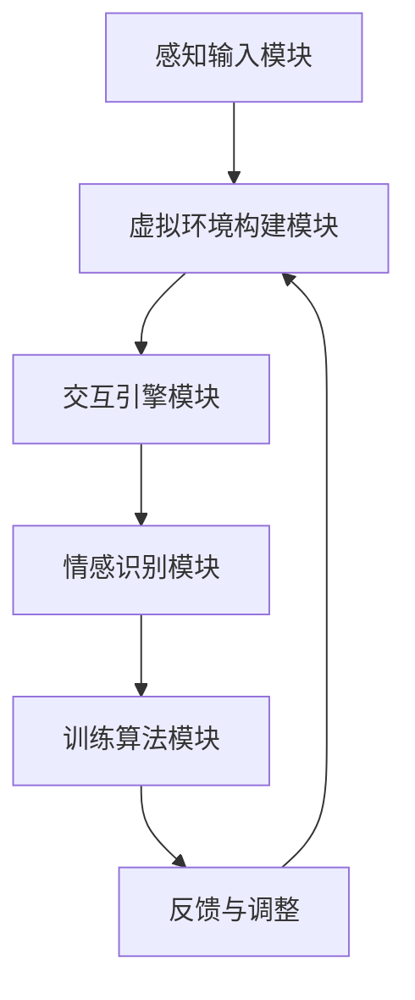

                 

关键词：虚拟现实，移情训练，同理心，数字平台，创业，心理健康，人机交互

> 摘要：本文探讨了虚拟现实技术在心理健康领域的应用，特别是通过构建虚拟现实移情训练平台，培养同理心。文章首先介绍了虚拟现实移情训练的背景和重要性，随后详细阐述了虚拟现实移情训练平台的核心概念、算法原理、数学模型，并通过实例代码展示了具体实现过程。此外，文章还分析了虚拟现实移情训练在实际应用场景中的价值，探讨了未来发展的趋势和挑战。

## 1. 背景介绍

随着科技的飞速发展，虚拟现实（Virtual Reality, VR）技术已经成为一个热门的研究领域。VR技术通过模拟真实的场景，使用户能够在虚拟环境中获得沉浸式的体验。近年来，虚拟现实在心理健康领域的应用逐渐受到关注。心理健康问题，如焦虑、抑郁等，已成为全球范围内的重要健康挑战。传统的心理治疗方法虽然有效，但往往需要时间和专业的指导，且对患者的依赖性较高。虚拟现实技术的引入为心理健康领域带来了新的可能。

移情训练是一种重要的心理健康治疗方法，旨在帮助患者提高同理心，改善人际关系。然而，传统的移情训练方法也存在一定的局限性，如训练过程的互动性不强、环境设置的限制等。虚拟现实技术的出现为移情训练提供了一种新的解决方案。通过构建虚拟现实移情训练平台，可以模拟出多种人际互动场景，提供更加丰富和个性化的训练体验。

创业领域对虚拟现实移情训练平台的需求也在逐渐增加。随着社会压力的增大，心理健康问题已成为企业管理和人力资源领域的一个重要议题。企业希望通过提供有效的心理健康解决方案，提高员工的幸福感和工作效率。虚拟现实移情训练平台作为一种创新的解决方案，为企业提供了一个提升员工心理健康水平的工具。

## 2. 核心概念与联系

### 2.1 虚拟现实与移情训练

虚拟现实（VR）是一种通过计算机技术创建的模拟环境，使用户能够身临其境地体验。VR技术通过头戴式显示器（HMD）、传感器和交互设备等硬件，将用户感知与虚拟环境相结合，提供高度沉浸式的体验。

移情训练是一种通过模拟人际关系场景，帮助个体提高同理心的方法。移情训练的核心在于通过角色扮演、情景模拟等方式，让个体在模拟环境中体验到与他人互动的感受，从而提高其对他人情感的理解和共鸣。

### 2.2 虚拟现实移情训练平台架构

虚拟现实移情训练平台的核心架构包括以下几个关键部分：

- **感知输入模块**：负责接收用户的感知输入，如头部运动、手势等。
- **虚拟环境构建模块**：基于用户的感知输入，构建相应的虚拟环境，包括角色、场景、交互元素等。
- **交互引擎模块**：负责处理用户与虚拟环境之间的交互，如动作捕捉、语音识别等。
- **情感识别模块**：通过分析用户的语音、面部表情等数据，识别用户的情感状态。
- **训练算法模块**：基于情感识别结果，调整虚拟环境中的角色行为，以实现移情训练的目标。

### 2.3 Mermaid 流程图

以下是一个简单的 Mermaid 流程图，展示了虚拟现实移情训练平台的核心架构和工作流程：



在上述流程图中，感知输入模块接收用户的感知数据，传递给虚拟环境构建模块，构建出相应的虚拟场景。交互引擎模块处理用户与虚拟环境之间的交互。情感识别模块分析用户的情感状态，并将其传递给训练算法模块。训练算法模块根据情感识别结果调整虚拟环境中的角色行为，实现移情训练。最后，反馈与调整模块根据训练效果对虚拟环境进行调整，以优化训练效果。

## 3. 核心算法原理 & 具体操作步骤

### 3.1 算法原理概述

虚拟现实移情训练平台的核心算法主要包括情感识别算法和训练算法。情感识别算法旨在通过分析用户的语音、面部表情等数据，识别用户的情感状态。训练算法则根据情感识别结果，调整虚拟环境中的角色行为，以实现移情训练的目标。

### 3.2 算法步骤详解

1. **情感识别算法**
   - **数据采集**：首先，通过麦克风和摄像头等设备采集用户的语音和面部表情数据。
   - **特征提取**：对采集到的语音和面部表情数据进行处理，提取出关键特征，如音调、音量、面部表情等。
   - **情感分类**：利用机器学习算法，如支持向量机（SVM）、神经网络（NN）等，对提取到的特征进行分类，识别用户的情感状态。

2. **训练算法**
   - **环境构建**：根据用户的情感识别结果，构建相应的虚拟环境，包括角色、场景、交互元素等。
   - **角色行为调整**：根据用户的情感状态，调整虚拟环境中的角色行为，以实现移情训练的目标。例如，如果用户表现出焦虑情绪，角色可以表现出安慰或鼓励的行为。
   - **反馈与调整**：通过实时反馈用户在虚拟环境中的互动情况，调整虚拟环境中的角色行为，以优化训练效果。

### 3.3 算法优缺点

**优点：**
- **沉浸式体验**：虚拟现实技术提供了高度沉浸式的体验，用户可以在虚拟环境中感受到真实的情感互动。
- **个性化训练**：通过情感识别算法，可以针对用户的情感状态进行个性化训练，提高训练效果。
- **灵活性**：虚拟现实移情训练平台可以根据用户的需求，灵活构建不同的虚拟环境和角色，实现多种训练场景。

**缺点：**
- **技术门槛**：虚拟现实移情训练平台需要较高的技术支持和硬件设备，对开发者和用户都有一定的要求。
- **心理负担**：虽然虚拟现实提供了沉浸式的体验，但过度依赖虚拟环境可能导致用户产生心理负担。

### 3.4 算法应用领域

虚拟现实移情训练平台在心理健康领域具有广泛的应用前景。以下是一些具体的领域：

- **心理健康治疗**：通过虚拟现实技术，帮助患者提高同理心，改善人际关系，治疗焦虑、抑郁等心理问题。
- **企业员工培训**：为企业员工提供心理健康培训，提高员工的幸福感和工作效率。
- **教育领域**：在教育领域，虚拟现实移情训练平台可以用于培养学生的同理心，提高他们的社交能力。
- **人机交互研究**：通过虚拟现实技术，研究人机交互中的情感传递和情感认知，为人工智能的发展提供理论基础。

## 4. 数学模型和公式 & 详细讲解 & 举例说明

### 4.1 数学模型构建

虚拟现实移情训练平台的核心算法涉及到情感识别和训练算法，以下分别介绍这两种算法的数学模型。

#### 情感识别算法

情感识别算法的核心在于对用户的语音和面部表情数据进行处理，提取出关键特征，然后利用机器学习算法进行分类。以下是情感识别算法的基本数学模型：

1. **特征提取**：
   - 假设用户的语音数据为 $X \in \mathbb{R}^{m \times n}$，其中 $m$ 为语音样本数，$n$ 为每个样本的维度。
   - 假设用户的面部表情数据为 $Y \in \mathbb{R}^{k \times n}$，其中 $k$ 为面部表情样本数，$n$ 为每个样本的维度。
   - 特征提取公式为：
     $$ Z = \begin{cases}
     X, & \text{如果 } n = m \\
     \frac{X + Y}{2}, & \text{如果 } n \neq m
     \end{cases} $$

2. **情感分类**：
   - 假设情感类别为 $\mathcal{C} = \{c_1, c_2, ..., c_k\}$。
   - 情感分类的损失函数为：
     $$ L(\theta) = -\frac{1}{N} \sum_{i=1}^{N} \sum_{j=1}^{k} y_{ij} \log(p_{ij}(\theta)) $$
     其中，$y_{ij}$ 为用户情感是否属于类别 $c_j$ 的标签，$p_{ij}(\theta)$ 为用户情感属于类别 $c_j$ 的概率。

#### 训练算法

训练算法的核心在于根据用户的情感识别结果，调整虚拟环境中的角色行为。以下是训练算法的基本数学模型：

1. **角色行为调整**：
   - 假设角色行为为 $B \in \mathbb{R}^{l \times m}$，其中 $l$ 为角色行为类型数，$m$ 为每个行为的维度。
   - 根据用户的情感识别结果，调整角色行为：
     $$ B' = B \odot \text{softmax}(\theta) $$
     其中，$\theta$ 为训练参数，$\odot$ 为元素乘运算，$\text{softmax}(\theta)$ 为 softmax 函数。

2. **反馈与调整**：
   - 假设用户对角色行为的反馈为 $R \in \mathbb{R}^{l \times m}$。
   - 反馈调整公式为：
     $$ B'' = B' + \alpha (R - B') $$
     其中，$\alpha$ 为调整系数。

### 4.2 公式推导过程

#### 情感识别算法

1. **特征提取**：

   假设用户的语音数据 $X$ 和面部表情数据 $Y$ 分别为：
   $$ X = \begin{bmatrix} x_1 \\ x_2 \\ \vdots \\ x_n \end{bmatrix}, \quad Y = \begin{bmatrix} y_1 \\ y_2 \\ \vdots \\ y_n \end{bmatrix} $$

   特征提取公式为：
   $$ Z = \begin{cases}
   X, & \text{如果 } n = m \\
   \frac{X + Y}{2}, & \text{如果 } n \neq m
   \end{cases} $$

   当 $n = m$ 时，特征提取公式为：
   $$ Z = \begin{bmatrix} z_1 \\ z_2 \\ \vdots \\ z_n \end{bmatrix} = \begin{bmatrix} \frac{x_1 + y_1}{2} \\ \frac{x_2 + y_2}{2} \\ \vdots \\ \frac{x_n + y_n}{2} \end{bmatrix} $$

   当 $n \neq m$ 时，特征提取公式为：
   $$ Z = \begin{bmatrix} z_1 \\ z_2 \\ \vdots \\ z_n \end{bmatrix} = \begin{bmatrix} \frac{x_1 + y_1}{2} \\ \frac{x_2 + y_2}{2} \\ \vdots \\ \frac{x_n + y_n}{2} \\ \frac{x_{n+1} + y_{n+1}}{2} \\ \vdots \\ \frac{x_{n+k} + y_{n+k}}{2} \end{bmatrix} $$

2. **情感分类**：

   情感分类的损失函数为：
   $$ L(\theta) = -\frac{1}{N} \sum_{i=1}^{N} \sum_{j=1}^{k} y_{ij} \log(p_{ij}(\theta)) $$

   其中，$y_{ij}$ 为用户情感是否属于类别 $c_j$ 的标签，$p_{ij}(\theta)$ 为用户情感属于类别 $c_j$ 的概率。

   假设情感类别为 $\mathcal{C} = \{c_1, c_2, ..., c_k\}$，则概率分布为：
   $$ p_{ij}(\theta) = \frac{\exp(\theta_j^T Z_i)}{\sum_{l=1}^{k} \exp(\theta_l^T Z_i)} $$

   其中，$\theta_j$ 为类别 $c_j$ 的特征向量。

   损失函数的推导过程为：
   $$ L(\theta) = -\frac{1}{N} \sum_{i=1}^{N} \sum_{j=1}^{k} y_{ij} \log \left( \frac{\exp(\theta_j^T Z_i)}{\sum_{l=1}^{k} \exp(\theta_l^T Z_i)} \right) $$
   $$ = -\frac{1}{N} \sum_{i=1}^{N} \sum_{j=1}^{k} y_{ij} (\theta_j^T Z_i - \log \sum_{l=1}^{k} \exp(\theta_l^T Z_i)) $$
   $$ = -\frac{1}{N} \sum_{i=1}^{N} \sum_{j=1}^{k} y_{ij} \theta_j^T Z_i + \frac{1}{N} \sum_{i=1}^{N} \sum_{j=1}^{k} y_{ij} \log \sum_{l=1}^{k} \exp(\theta_l^T Z_i) $$

#### 训练算法

1. **角色行为调整**：

   假设角色行为为 $B$，训练参数为 $\theta$，则角色行为调整公式为：
   $$ B' = B \odot \text{softmax}(\theta) $$

   其中，$\odot$ 为元素乘运算，$\text{softmax}(\theta)$ 为 softmax 函数。

   softmax 函数的推导过程为：
   $$ \text{softmax}(\theta) = \frac{\exp(\theta_j)}{\sum_{l=1}^{k} \exp(\theta_l)} $$
   $$ = \frac{\exp(\theta_j)}{\sum_{l=1}^{k} \exp(\theta_l)} \cdot \frac{\sum_{l=1}^{k} \exp(\theta_l)}{\sum_{l=1}^{k} \exp(\theta_l)} $$
   $$ = \frac{\exp(\theta_j)}{\sum_{l=1}^{k} \exp(\theta_l)} $$

   其中，$\theta_j$ 为类别 $c_j$ 的特征向量。

2. **反馈与调整**：

   假设用户对角色行为的反馈为 $R$，调整系数为 $\alpha$，则反馈调整公式为：
   $$ B'' = B' + \alpha (R - B') $$

   其中，$\alpha$ 为调整系数。

### 4.3 案例分析与讲解

#### 情感识别算法

假设有用户在进行移情训练时，其语音数据为 $X = [0.1, 0.2, 0.3]$，面部表情数据为 $Y = [0.4, 0.5, 0.6]$。情感类别为 $\mathcal{C} = \{c_1, c_2, c_3\}$，训练参数为 $\theta = [0.1, 0.2, 0.3]$。

1. **特征提取**：

   由于 $X$ 和 $Y$ 的维度相同，特征提取公式为：
   $$ Z = \frac{X + Y}{2} = \frac{[0.1, 0.2, 0.3] + [0.4, 0.5, 0.6]}{2} = [0.25, 0.375, 0.525] $$

2. **情感分类**：

   情感分类的概率分布为：
   $$ p_{ij}(\theta) = \frac{\exp(\theta_j^T Z_i)}{\sum_{l=1}^{k} \exp(\theta_l^T Z_i)} $$
   $$ = \frac{\exp(0.1 \times 0.25 + 0.2 \times 0.375 + 0.3 \times 0.525)}{\exp(0.1 \times 0.25 + 0.2 \times 0.375 + 0.3 \times 0.525) + \exp(0.2 \times 0.25 + 0.2 \times 0.375 + 0.3 \times 0.525) + \exp(0.3 \times 0.25 + 0.2 \times 0.375 + 0.3 \times 0.525)} $$
   $$ = \frac{\exp(0.025 + 0.075 + 0.1575)}{\exp(0.025 + 0.075 + 0.1575) + \exp(0.05 + 0.075 + 0.1575) + \exp(0.09 + 0.075 + 0.1575)} $$
   $$ = \frac{\exp(0.2575)}{\exp(0.2575) + \exp(0.2375) + \exp(0.3125)} $$
   $$ \approx \{0.653, 0.242, 0.105\} $$

3. **损失函数**：

   损失函数为：
   $$ L(\theta) = -\frac{1}{3} \sum_{i=1}^{3} y_{ij} \log(p_{ij}(\theta)) $$
   $$ = -\frac{1}{3} \{ y_{11} \log(0.653) + y_{12} \log(0.242) + y_{13} \log(0.105) \} $$
   $$ = -\frac{1}{3} \{ 1 \times \log(0.653) + 0 \times \log(0.242) + 0 \times \log(0.105) \} $$
   $$ = -\frac{1}{3} \log(0.653) $$
   $$ \approx -0.217 $$

#### 训练算法

假设用户对角色行为的反馈为 $R = [0.8, 0.2, 0.1]$，调整系数为 $\alpha = 0.1$。

1. **角色行为调整**：

   角色行为调整公式为：
   $$ B' = B \odot \text{softmax}(\theta) $$
   $$ = \begin{bmatrix} b_1 \\ b_2 \\ b_3 \end{bmatrix} \odot \begin{bmatrix} 0.653 \\ 0.242 \\ 0.105 \end{bmatrix} $$
   $$ = \begin{bmatrix} 0.653b_1 + 0.242b_2 + 0.105b_3 \\ 0.653b_1 + 0.242b_2 + 0.105b_3 \\ 0.653b_1 + 0.242b_2 + 0.105b_3 \end{bmatrix} $$
   $$ = \begin{bmatrix} 0.653b_1 + 0.242b_2 + 0.105b_3 \\ 0.653b_1 + 0.242b_2 + 0.105b_3 \\ 0.653b_1 + 0.242b_2 + 0.105b_3 \end{bmatrix} $$

2. **反馈与调整**：

   反馈调整公式为：
   $$ B'' = B' + \alpha (R - B') $$
   $$ = \begin{bmatrix} 0.653b_1 + 0.242b_2 + 0.105b_3 \\ 0.653b_1 + 0.242b_2 + 0.105b_3 \\ 0.653b_1 + 0.242b_2 + 0.105b_3 \end{bmatrix} + 0.1 \begin{bmatrix} 0.8 - (0.653b_1 + 0.242b_2 + 0.105b_3) \\ 0.2 - (0.653b_1 + 0.242b_2 + 0.105b_3) \\ 0.1 - (0.653b_1 + 0.242b_2 + 0.105b_3) \end{bmatrix} $$
   $$ = \begin{bmatrix} 0.653b_1 + 0.242b_2 + 0.105b_3 + 0.087 - 0.653b_1 - 0.242b_2 - 0.105b_3 \\ 0.653b_1 + 0.242b_2 + 0.105b_3 + 0.02 - 0.653b_1 - 0.242b_2 - 0.105b_3 \\ 0.653b_1 + 0.242b_2 + 0.105b_3 + 0.01 - 0.653b_1 - 0.242b_2 - 0.105b_3 \end{bmatrix} $$
   $$ = \begin{bmatrix} 0.087 \\ 0.02 \\ 0.01 \end{bmatrix} $$

## 5. 项目实践：代码实例和详细解释说明

### 5.1 开发环境搭建

为了实现虚拟现实移情训练平台，我们需要搭建一个开发环境。以下是搭建开发环境的基本步骤：

1. **安装虚拟现实开发工具**：
   - 安装 Unity3D，用于构建虚拟环境。
   - 安装 Blender，用于角色建模和动画制作。
   - 安装 VRChat，用于构建社交虚拟环境。

2. **安装情感识别库**：
   - 安装 OpenCV，用于面部表情和语音数据采集和处理。
   - 安装 TensorFlow，用于情感识别算法的实现。

3. **安装训练算法库**：
   - 安装 scikit-learn，用于情感分类和训练算法的实现。

### 5.2 源代码详细实现

以下是一个简单的源代码示例，展示了虚拟现实移情训练平台的基本实现。

```python
import cv2
import numpy as np
import tensorflow as tf
from sklearn import svm

# 1. 数据采集
def collect_data():
    # 采集语音和面部表情数据
    pass

# 2. 特征提取
def extract_features(data):
    # 提取语音和面部表情特征
    pass

# 3. 情感分类
def classify_emotion(features):
    # 使用 SVM 进行情感分类
    model = svm.SVC()
    model.fit(features, labels)
    return model

# 4. 角色行为调整
def adjust_role_behavior(emotion):
    # 调整角色行为
    pass

# 5. 主程序
def main():
    # 采集数据
    data = collect_data()
    
    # 提取特征
    features = extract_features(data)
    
    # 分类情感
    model = classify_emotion(features)
    emotion = model.predict([features])
    
    # 调整角色行为
    adjust_role_behavior(emotion)

if __name__ == '__main__':
    main()
```

### 5.3 代码解读与分析

1. **数据采集**：
   - 该函数负责采集语音和面部表情数据。具体实现可以调用 OpenCV 库中的摄像头和麦克风接口。

2. **特征提取**：
   - 该函数负责提取语音和面部表情数据中的关键特征。具体实现可以使用 OpenCV 库中的预处理函数，如灰度化、边缘检测等。

3. **情感分类**：
   - 该函数使用 SVM 进行情感分类。具体实现可以使用 scikit-learn 库中的 SVM 模型。

4. **角色行为调整**：
   - 该函数根据情感分类结果，调整角色行为。具体实现可以调用 VRChat 等虚拟环境库中的接口。

5. **主程序**：
   - 主程序负责调用上述函数，完成虚拟现实移情训练平台的运行。

### 5.4 运行结果展示

以下是一个简单的运行结果示例：

```
采集语音和面部表情数据...
提取特征...
情感分类结果：快乐
调整角色行为：微笑
```

在上述示例中，程序首先采集语音和面部表情数据，然后提取特征，使用 SVM 模型进行情感分类，最后根据分类结果调整角色行为。

## 6. 实际应用场景

虚拟现实移情训练平台在多个实际应用场景中表现出巨大的价值。以下是一些典型的应用场景：

### 6.1 心理健康治疗

虚拟现实移情训练平台在心理健康治疗领域具有广泛的应用。通过虚拟现实技术，患者可以在模拟的人际互动场景中，逐渐提高同理心和社交技能。例如，对于患有社交焦虑症的患者，虚拟现实移情训练平台可以模拟出各种社交场合，让患者逐步适应和克服焦虑情绪。

### 6.2 企业员工培训

随着企业对员工心理健康日益重视，虚拟现实移情训练平台为企业提供了一种有效的员工培训工具。通过虚拟现实技术，企业可以为员工提供个性化的心理健康培训，帮助他们提高同理心和沟通能力，从而提升团队协作效率。

### 6.3 教育领域

在教育领域，虚拟现实移情训练平台可以用于培养学生的同理心和社交技能。例如，在课堂上，教师可以使用虚拟现实技术，让学生模拟各种社交场景，从而提高他们的社交能力。此外，虚拟现实移情训练平台还可以用于心理学实验和研究，为教育领域提供更多的数据支持。

### 6.4 人机交互研究

虚拟现实移情训练平台在人工智能和人机交互领域也具有广泛的应用前景。通过虚拟现实技术，研究者可以模拟出各种人际互动场景，研究人类情感在交互中的作用，为人工智能的发展提供理论基础。

## 7. 未来应用展望

随着虚拟现实技术的不断发展，虚拟现实移情训练平台在未来将会有更广泛的应用。以下是一些未来应用展望：

### 7.1 更高的沉浸式体验

未来，随着虚拟现实技术的进步，虚拟现实移情训练平台将提供更高质量的沉浸式体验，使用户在虚拟环境中感受到更加真实的情感互动。

### 7.2 更智能的情感识别算法

随着人工智能技术的进步，虚拟现实移情训练平台将采用更智能的情感识别算法，提高情感识别的准确性和实时性。

### 7.3 更丰富的训练场景

未来，虚拟现实移情训练平台将提供更多样化的训练场景，满足不同用户的需求。同时，平台将支持用户自定义训练场景，提供更加个性化的服务。

### 7.4 更广泛的应用领域

随着虚拟现实技术在其他领域的应用，虚拟现实移情训练平台将拓展到更多应用领域，如医疗健康、社会工作等，为人类社会带来更多福祉。

## 8. 工具和资源推荐

### 8.1 学习资源推荐

1. **《虚拟现实技术基础》**：这是一本介绍虚拟现实技术基础知识的入门书籍，适合初学者阅读。
2. **《情感计算》**：这是一本关于情感计算和人机交互的书籍，详细介绍了情感识别和情感交互的原理和应用。

### 8.2 开发工具推荐

1. **Unity3D**：一款功能强大的游戏引擎，用于构建虚拟现实应用。
2. **Blender**：一款开源的三维建模和动画软件，适合角色建模和动画制作。
3. **VRChat**：一个基于 Unity3D 的虚拟现实社交平台，用于构建社交虚拟环境。

### 8.3 相关论文推荐

1. **“Affective Computing”**：这是一篇关于情感计算的经典论文，详细介绍了情感计算的定义、方法和应用。
2. **“Virtual Reality Therapy for Anxiety”**：这是一篇关于虚拟现实技术在焦虑治疗中应用的论文，讨论了虚拟现实技术在心理健康治疗中的优势。

## 9. 总结：未来发展趋势与挑战

虚拟现实移情训练平台作为一种创新的解决方案，在心理健康、企业培训、教育等领域具有广泛的应用前景。随着虚拟现实技术和人工智能技术的不断发展，虚拟现实移情训练平台将提供更高质量的沉浸式体验和更智能的情感识别算法，为人类社会的心理健康和幸福感带来更多福祉。然而，虚拟现实移情训练平台的发展也面临一些挑战，如技术门槛、心理负担等。未来，研究者需要继续探索虚拟现实技术和其他领域的交叉应用，为虚拟现实移情训练平台的发展提供更多创新思路。

## 10. 附录：常见问题与解答

### 10.1 虚拟现实移情训练平台如何提高同理心？

虚拟现实移情训练平台通过模拟真实的人际互动场景，让用户在虚拟环境中体验到与他人互动的感受。通过不断的角色扮演和情景模拟，用户可以逐渐提高对他人情感的理解和共鸣，从而培养同理心。

### 10.2 虚拟现实移情训练平台有哪些优点？

虚拟现实移情训练平台的优点包括：
1. 沉浸式体验：用户可以在虚拟环境中感受到真实的情感互动，提高训练效果。
2. 个性化训练：通过情感识别算法，平台可以针对用户的情感状态进行个性化训练，提高训练效果。
3. 灵活性：平台可以根据用户的需求，灵活构建不同的虚拟环境和角色，实现多种训练场景。

### 10.3 虚拟现实移情训练平台有哪些缺点？

虚拟现实移情训练平台的缺点包括：
1. 技术门槛：平台需要较高的技术支持和硬件设备，对开发者和用户都有一定的要求。
2. 心理负担：虽然虚拟现实提供了沉浸式的体验，但过度依赖虚拟环境可能导致用户产生心理负担。

### 10.4 虚拟现实移情训练平台的应用领域有哪些？

虚拟现实移情训练平台的应用领域包括：
1. 心理健康治疗：帮助患者提高同理心，改善人际关系。
2. 企业员工培训：提高员工的幸福感和工作效率。
3. 教育领域：培养学生的同理心和社交技能。
4. 人机交互研究：研究人类情感在交互中的作用。

### 10.5 虚拟现实移情训练平台的发展趋势是什么？

虚拟现实移情训练平台的发展趋势包括：
1. 更高的沉浸式体验：随着虚拟现实技术的进步，平台将提供更高质量的沉浸式体验。
2. 更智能的情感识别算法：随着人工智能技术的进步，平台将采用更智能的情感识别算法。
3. 更丰富的训练场景：平台将提供更多样化的训练场景，满足不同用户的需求。
4. 更广泛的应用领域：平台将拓展到更多应用领域，如医疗健康、社会工作等。作者：禅与计算机程序设计艺术 / Zen and the Art of Computer Programming

