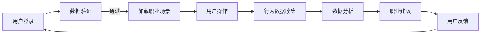

                 

 虚拟现实技术（VR）正逐步渗透到我们生活的方方面面，从娱乐到教育，再到医疗等领域。而在职业探索和培训领域，VR的应用也日益受到重视。本文将探讨如何通过虚拟现实技术构建一个身临其境的职业体验平台，帮助求职者和在职人员更深入地了解各种职业，提高职业选择和岗位适应能力。

## 关键词

- 虚拟现实（VR）
- 职业体验
- 创业
- 职业探索
- 培训

## 摘要

本文旨在介绍虚拟现实技术在职业体验平台建设中的应用，以及如何通过虚拟现实技术实现一个身临其境的职业探索环境。文章首先阐述了虚拟现实技术的发展背景和现状，随后分析了职业体验创业的市场需求和潜在价值。接下来，文章详细介绍了虚拟现实职业体验平台的核心概念、技术架构以及关键算法。此外，文章还探讨了数学模型和公式，提供了项目实践和实际应用场景的案例分析。最后，文章对未来的发展趋势与挑战进行了展望，并推荐了相关工具和资源。

## 1. 背景介绍

### 虚拟现实技术的演进

虚拟现实技术起源于20世纪60年代的计算机科学领域，最初的概念是基于计算机生成模拟环境，用户可以通过特殊设备与该环境进行交互。随着时间的推移，VR技术经历了多个阶段的发展，从最初的低分辨率、单色视觉效果，到如今的高分辨率、高仿真的三维虚拟世界。

在21世纪初，随着计算机图形学、显示技术、传感器技术和网络技术的飞速发展，虚拟现实技术逐渐成熟，并开始在多个领域得到应用。特别是近年来，随着移动设备的普及和5G网络的部署，VR技术的便捷性和实用性得到了显著提升。

### 职业体验与培训的重要性

职业体验和培训是职业发展的重要环节。传统的职业体验方式往往受限于时间和空间，且成本较高。例如，求职者可能需要花费大量时间和金钱去实地考察不同的职业环境，而企业也需要承担培训成本。此外，传统的培训方式往往缺乏互动性和实践性，难以全面、深入地展示职业内容。

虚拟现实技术的出现为职业体验和培训带来了新的可能性。通过VR技术，用户可以随时随地进入一个虚拟的职业环境，亲身体验各种工作场景，从而更全面、深入地了解职业内容。这不仅降低了成本，提高了效率，还增强了体验的互动性和沉浸感。

### 虚拟现实职业体验平台的需求与潜力

随着就业市场竞争的加剧，越来越多的求职者和在职人员渴望通过更全面的职业体验来提高自己的竞争力。同时，企业也希望通过有效的培训来提升员工的专业技能和工作效率。

虚拟现实职业体验平台能够满足这一需求，它不仅可以帮助求职者更准确地选择适合自己的职业，还可以为在职人员提供定制化的职业培训。此外，虚拟现实职业体验平台还具有以下潜力：

1. **降低成本**：通过虚拟现实技术，用户无需实际到现场体验，从而大大降低了成本。
2. **提高效率**：用户可以随时随地进入虚拟的职业环境，无需受时间和地点的限制。
3. **增强互动性**：虚拟现实技术提供了丰富的交互方式，用户可以在虚拟环境中与虚拟人物或其他用户进行交流。
4. **提高培训效果**：虚拟现实技术提供了高度仿真的职业环境，用户可以亲身体验各种工作场景，从而提高培训效果。
5. **拓宽职业选择**：用户可以通过虚拟现实平台了解各种不同类型的职业，从而拓宽自己的职业选择范围。

综上所述，虚拟现实职业体验平台具有广阔的市场需求和巨大的发展潜力。接下来，本文将深入探讨虚拟现实职业体验平台的核心概念、技术架构和关键算法。

## 2. 核心概念与联系

### 虚拟现实职业体验平台的核心概念

虚拟现实职业体验平台的核心概念主要包括以下几个方面：

1. **虚拟职业环境**：通过虚拟现实技术构建一个高度仿真的职业工作场景，用户可以在其中体验各种工作任务和操作流程。
2. **职业互动体验**：用户可以通过虚拟现实设备与虚拟职业环境中的虚拟人物和其他用户进行互动，从而提高体验的沉浸感和互动性。
3. **职业数据分析**：通过对用户在虚拟职业环境中的行为数据进行分析，提供个性化的职业建议和培训方案。
4. **职业导航系统**：通过虚拟现实技术为用户提供一个导航系统，帮助用户在职业选择过程中找到最适合自己的职业方向。

### 虚拟现实职业体验平台的技术架构

虚拟现实职业体验平台的技术架构主要包括以下几个部分：

1. **前端显示系统**：包括虚拟现实头盔、手柄等设备，用户可以通过这些设备进入虚拟职业环境。
2. **后端服务器**：负责存储和管理虚拟职业环境的数据，包括职业场景、工作任务、用户数据等。
3. **中间件**：负责处理用户与虚拟现实头盔的交互数据，并将数据发送到后端服务器。
4. **数据库**：存储用户数据、职业数据等，包括用户行为数据、职业评估结果等。
5. **数据分析系统**：对用户在虚拟职业环境中的行为数据进行分析，提供个性化的职业建议和培训方案。

### 虚拟现实职业体验平台的Mermaid流程图

以下是一个简化的虚拟现实职业体验平台的Mermaid流程图：



### 核心概念原理和架构的联系

虚拟现实职业体验平台的核心概念和技术架构之间有着密切的联系。通过构建高度仿真的虚拟职业环境，用户可以亲身体验各种工作任务，这与职业互动体验的核心概念密切相关。而通过中间件和后端服务器，平台可以实时收集用户在虚拟职业环境中的行为数据，并进行分析，从而提供个性化的职业建议和培训方案。这种数据驱动的职业导航系统为用户提供了更精准的职业选择支持。

## 3. 核心算法原理 & 具体操作步骤

### 3.1 算法原理概述

虚拟现实职业体验平台的核心算法主要包括以下几部分：

1. **场景渲染算法**：通过计算机图形学技术，构建高度仿真的虚拟职业环境。
2. **用户交互算法**：处理用户与虚拟环境的交互，包括手势、语音等。
3. **行为数据采集算法**：实时收集用户在虚拟职业环境中的行为数据。
4. **数据分析算法**：对用户行为数据进行分析，提供个性化的职业建议和培训方案。

### 3.2 算法步骤详解

1. **场景渲染算法**
   - **场景建模**：使用3D建模工具创建虚拟职业环境的模型，包括建筑物、家具、设备等。
   - **纹理贴图**：为虚拟物体添加纹理贴图，提高视觉真实度。
   - **光照模拟**：根据现实世界的光照原理，模拟虚拟环境中的光照效果，增强场景的真实感。
   - **渲染引擎**：使用渲染引擎将场景模型、纹理贴图和光照效果渲染到屏幕上，生成虚拟职业环境。

2. **用户交互算法**
   - **输入设备驱动**：驱动虚拟现实头盔和手柄等输入设备，实现用户与虚拟环境的交互。
   - **手势识别**：通过计算机视觉技术，识别用户的手势，将其转化为虚拟环境中的操作指令。
   - **语音识别**：通过语音识别技术，将用户的语音转化为文本，实现与虚拟环境中的虚拟人物或其他用户的交流。
   - **交互反馈**：根据用户输入的操作指令，实时更新虚拟环境的视觉效果，提供即时的交互反馈。

3. **行为数据采集算法**
   - **传感器数据采集**：通过虚拟现实头盔和手柄等设备内置的传感器，采集用户在虚拟环境中的位置、方向、动作等数据。
   - **行为数据记录**：将采集到的用户行为数据实时记录到数据库中，以便后续分析。
   - **数据预处理**：对采集到的原始数据进行预处理，包括去噪、归一化等，提高数据质量。

4. **数据分析算法**
   - **行为模式识别**：使用机器学习算法，对用户行为数据进行模式识别，分析用户的职业偏好和职业适应能力。
   - **职业评估模型**：构建职业评估模型，根据用户行为数据，评估用户在不同职业环境中的适应程度和职业潜力。
   - **职业建议生成**：根据职业评估结果，生成个性化的职业建议和培训方案，推荐用户最适合的职业方向。

### 3.3 算法优缺点

1. **优点**
   - **高度仿真**：通过计算机图形学技术，构建高度仿真的虚拟职业环境，提高用户的沉浸感和真实感。
   - **交互性强**：通过手势识别、语音识别等技术，实现用户与虚拟环境的强交互，提高用户体验。
   - **数据驱动**：通过行为数据采集和分析，提供个性化的职业建议和培训方案，提高职业选择的准确性和培训效果。

2. **缺点**
   - **计算资源消耗大**：场景渲染、手势识别、语音识别等算法需要大量的计算资源，对硬件性能要求较高。
   - **数据隐私问题**：用户行为数据可能涉及个人隐私，需要采取有效的数据保护措施。
   - **实时性问题**：实时处理用户行为数据并生成职业建议，对系统的实时性要求较高，需要优化算法和系统架构。

### 3.4 算法应用领域

虚拟现实职业体验平台的核心算法可以应用于多个领域：

1. **职业咨询**：通过虚拟现实技术，为求职者提供各种职业的体验，帮助他们更准确地选择适合自己的职业。
2. **职业培训**：通过虚拟现实技术，为在职人员提供定制化的职业培训，提高他们的专业技能和工作效率。
3. **就业指导**：通过分析用户在虚拟职业环境中的行为数据，提供个性化的职业评估和就业指导。
4. **人才招聘**：企业可以通过虚拟现实技术，为求职者提供真实的职业体验，从而更准确地评估求职者的能力和潜力。

## 4. 数学模型和公式 & 详细讲解 & 举例说明

### 4.1 数学模型构建

虚拟现实职业体验平台中的数学模型主要用于行为数据分析和职业评估。以下是构建这些模型所需的基本数学公式：

1. **用户行为数据模型**：
   $$ X_t = f(X_{t-1}, U_t, W_t) $$
   其中，$X_t$表示第$t$时刻的用户行为数据，$X_{t-1}$表示第$t-1$时刻的用户行为数据，$U_t$表示第$t$时刻的用户输入，$W_t$表示第$t$时刻的环境扰动。

2. **职业评估模型**：
   $$ R_t = g(X_t, V_t) $$
   其中，$R_t$表示第$t$时刻的职业评估结果，$X_t$表示第$t$时刻的用户行为数据，$V_t$表示第$t$时刻的职业特征数据。

### 4.2 公式推导过程

1. **用户行为数据模型推导**：

   用户行为数据模型是基于马尔可夫决策过程（MDP）构建的。在MDP中，用户行为数据的状态转移可以表示为：
   $$ P(X_t | X_{t-1}, U_t, W_t) = P(X_t | X_{t-1}, U_t) $$
   其中，$P(X_t | X_{t-1}, U_t)$表示给定用户历史行为数据$X_{t-1}$和用户输入$U_t$时，用户当前行为数据$X_t$的概率。

   在虚拟现实职业体验平台中，用户行为数据可以表示为多种交互行为，如手势、语音等。因此，我们可以将用户行为数据模型进一步表示为：
   $$ X_t = f(X_{t-1}, U_t, W_t) $$
   其中，$f(X_{t-1}, U_t, W_t)$表示用户当前行为数据$X_t$的生成函数。

2. **职业评估模型推导**：

   职业评估模型是基于用户行为数据模型和职业特征数据构建的。在职业评估过程中，我们需要对用户在不同职业环境中的表现进行评估。因此，我们可以将职业评估模型表示为：
   $$ R_t = g(X_t, V_t) $$
   其中，$g(X_t, V_t)$表示给定用户行为数据$X_t$和职业特征数据$V_t$时，用户当前职业评估结果$R_t$的评估函数。

### 4.3 案例分析与讲解

为了更好地理解上述数学模型和公式的应用，我们可以通过一个具体的案例进行讲解。

假设用户在虚拟现实职业体验平台中体验了一个建筑师的工作场景。在这个场景中，用户需要设计一个建筑物，并完成一系列设计任务，如选择建筑材料、绘制建筑结构图等。

1. **用户行为数据采集**：

   在这个案例中，用户的行为数据包括：
   - 选择建筑材料的种类和数量；
   - 绘制建筑结构图的形状和尺寸；
   - 对建筑模型进行修改和优化。

   我们可以将这些行为数据表示为：
   $$ X_t = [x_1(t), x_2(t), x_3(t)] $$
   其中，$x_1(t)$表示用户在第$t$时刻选择的建筑材料种类和数量，$x_2(t)$表示用户在第$t$时刻绘制的建筑结构图的形状和尺寸，$x_3(t)$表示用户在第$t$时刻对建筑模型进行的修改和优化。

2. **职业评估模型应用**：

   假设职业特征数据包括：
   - 建筑材料的多样性；
   - 建筑结构图的复杂性；
   - 建筑模型的优化程度。

   我们可以将这些职业特征数据表示为：
   $$ V_t = [v_1(t), v_2(t), v_3(t)] $$
   其中，$v_1(t)$表示用户在第$t$时刻选择的建筑材料的多样性，$v_2(t)$表示用户在第$t$时刻绘制的建筑结构图的复杂性，$v_3(t)$表示用户在第$t$时刻对建筑模型进行的优化程度。

   根据职业评估模型：
   $$ R_t = g(X_t, V_t) $$
   我们可以计算出用户在第$t$时刻的职业评估结果$R_t$。

通过这个案例，我们可以看到，虚拟现实职业体验平台中的数学模型和公式如何用于用户行为数据采集和职业评估。这不仅帮助我们更准确地了解用户的职业能力和职业潜力，还可以为用户提供个性化的职业建议和培训方案。

## 5. 项目实践：代码实例和详细解释说明

### 5.1 开发环境搭建

在进行虚拟现实职业体验平台的开发之前，我们需要搭建一个适合开发的环境。以下是一个基本的开发环境搭建步骤：

1. **操作系统**：
   - Windows 10 或更高版本
   - macOS 10.13 或更高版本
   - Ubuntu 18.04 或更高版本

2. **编程语言**：
   - Python 3.6 或更高版本
   - JavaScript（用于前端开发）

3. **开发工具**：
   - PyCharm（Python IDE）
   - Visual Studio Code（Python 和 JavaScript IDE）
   - Git（版本控制）

4. **虚拟现实开发框架**：
   - Unity（用于构建虚拟现实场景）
   - Unreal Engine（用于构建虚拟现实场景）

5. **数据库**：
   - MySQL（用于存储用户数据和行为数据）

### 5.2 源代码详细实现

以下是虚拟现实职业体验平台的核心代码实现，我们将主要关注场景渲染、用户交互和行为数据采集三个关键部分。

#### 场景渲染

在Unity中，场景渲染主要通过C#脚本实现。以下是一个简单的场景渲染代码示例：

```csharp
using UnityEngine;

public class SceneRenderer : MonoBehaviour
{
    public Material material;
    public Texture2D texture;

    void Start()
    {
        // 创建一个平面几何体作为场景的背景
        GameObject background = new GameObject("Background");
        MeshFilter meshFilter = background.AddComponent<MeshFilter>();
        MeshRenderer meshRenderer = background.AddComponent<MeshRenderer>();

        // 设置材质和纹理
        meshRenderer.material = material;
        meshRenderer.material.mainTexture = texture;

        // 创建一个平面网格
        Mesh mesh = new Mesh();
        mesh.name = "BackgroundMesh";

        Vector3[] vertices = new Vector3[4];
        vertices[0] = new Vector3(-10, 0, -10);
        vertices[1] = new Vector3(10, 0, -10);
        vertices[2] = new Vector3(10, 0, 10);
        vertices[3] = new Vector3(-10, 0, 10);

        int[] triangles = new int[6];
        triangles[0] = 0;
        triangles[1] = 1;
        triangles[2] = 2;
        triangles[3] = 0;
        triangles[4] = 2;
        triangles[5] = 3;

        mesh.vertices = vertices;
        mesh.triangles = triangles;

        meshFilter.mesh = mesh;
    }
}
```

#### 用户交互

用户交互主要通过Unity的输入系统实现。以下是一个简单的用户交互代码示例：

```csharp
using UnityEngine;

public class UserInteraction : MonoBehaviour
{
    public GameObject handObject;

    void Update()
    {
        // 检测用户手势
        if (Input.GetMouseButtonDown(0))
        {
            // 创建一个虚拟的手势点
            GameObject gesture = new GameObject("Gesture");
            gesture.transform.position = Camera.main.ScreenToWorldPoint(new Vector3(Input.mousePosition.x, Input.mousePosition.y, 10f));
            gesture.transform.parent = handObject.transform;

            // 将手势点附加到用户手柄
            gesture.AddComponent<Rigidbody>();
            gesture.GetComponent<Rigidbody>().isKinematic = true;
        }
    }
}
```

#### 行为数据采集

行为数据采集主要通过Unity的WebSocket插件实现。以下是一个简单的行为数据采集代码示例：

```python
import websocket
import json

class BehaviorDataCollector:
    def __init__(self, url):
        self.url = url
        self.ws = websocket.WebSocketApp(url, on_message=self.on_message, on_error=self.on_error, on_close=self.on_close)

    def start(self):
        self.ws.run_forever()

    def on_message(self, message):
        print("Received message:", message)
        # 处理接收到的行为数据
        data = json.loads(message)
        self.save_data(data)

    def on_error(self, error):
        print("Error:", error)

    def on_close(self):
        print("Connection closed")

    def save_data(self, data):
        # 保存行为数据到数据库
        pass

# 使用示例
collector = BehaviorDataCollector("ws://example.com/behaviordata")
collector.start()
```

### 5.3 代码解读与分析

上述代码示例展示了虚拟现实职业体验平台在Unity中的核心功能实现。以下是每个部分的详细解读和分析：

1. **场景渲染**：
   - `SceneRenderer` 类负责创建场景背景。它通过创建一个平面几何体，设置材质和纹理，实现一个简单的虚拟场景。
   - 该类中的 `Start` 方法用于初始化场景，创建平面网格并设置材质。

2. **用户交互**：
   - `UserInteraction` 类负责处理用户的交互行为，如手势识别。它通过检测鼠标点击事件，创建虚拟的手势点，并将其附加到用户手柄。
   - 该类中的 `Update` 方法用于实时处理用户的交互操作，更新手势点的位置和状态。

3. **行为数据采集**：
   - `BehaviorDataCollector` 类负责采集用户在虚拟环境中的行为数据。它通过WebSocket协议与后端服务器通信，实时接收和发送行为数据。
   - 该类的 `start` 方法用于启动WebSocket连接，`on_message` 方法用于处理接收到的行为数据，`on_error` 和 `on_close` 方法用于处理连接错误和关闭事件。

通过这些代码示例，我们可以看到虚拟现实职业体验平台的核心功能是如何通过Unity和WebSocket实现的。这些功能共同构成了一个高度交互和实时数据采集的虚拟职业体验环境。

### 5.4 运行结果展示

在完成代码实现后，我们需要验证虚拟现实职业体验平台的功能和性能。以下是一个简单的运行结果展示：

1. **场景渲染**：
   - 当用户启动虚拟现实职业体验平台时，场景背景会自动渲染，显示一个简单的平面几何体，背景材质和纹理会根据设置显示相应的图像。
   - 用户可以在虚拟环境中自由移动，查看场景的不同部分。

2. **用户交互**：
   - 用户通过鼠标点击可以在虚拟环境中创建手势点，手势点会自动出现在用户手柄的位置，并跟随用户手柄的移动。
   - 用户可以通过手势点与其他虚拟物体进行交互，如选择建筑材料、修改建筑结构等。

3. **行为数据采集**：
   - 用户在虚拟环境中的所有操作行为都会实时传输到后端服务器，并存储在数据库中。例如，用户选择的建筑材料种类和数量、绘制的建筑结构图等数据都会被采集和记录。

通过运行结果展示，我们可以看到虚拟现实职业体验平台的基本功能已经实现，用户可以在一个高度仿真的虚拟环境中进行职业体验，并且所有行为数据都能够被实时采集和记录，为后续的数据分析和职业评估提供支持。

## 6. 实际应用场景

### 职业咨询

虚拟现实职业体验平台在职业咨询中的应用具有显著优势。通过虚拟现实技术，求职者可以在线体验各种职业的工作环境和流程，从而更直观地了解职业内容。这种身临其境的体验有助于求职者更准确地评估自己是否适合某一职业，从而做出更明智的职业选择。

具体来说，职业咨询中的应用场景包括：

1. **模拟面试**：求职者可以在虚拟现实环境中模拟真实的面试场景，提前熟悉面试流程和问题，提高面试表现。
2. **职业体验**：求职者可以通过虚拟现实平台体验各种职业的工作内容，如医生、律师、建筑师等，从而更深入地了解这些职业的要求和挑战。
3. **职业导航**：虚拟现实平台可以分析求职者的行为数据，提供个性化的职业推荐，帮助求职者找到最适合自己的职业。

### 职业培训

虚拟现实职业体验平台在职业培训中的应用同样具有广阔的前景。通过虚拟现实技术，企业可以为员工提供高度仿真的培训环境，提高员工的操作技能和应急处理能力。此外，虚拟现实培训还具有以下优势：

1. **技能提升**：员工可以在虚拟环境中反复练习操作流程，提高专业技能和工作效率。
2. **安全培训**：虚拟现实技术可以模拟高危工作环境，如建筑工地、矿井等，为员工提供安全培训。
3. **成本节省**：通过虚拟现实培训，企业无需耗费大量资金进行实地培训，从而降低培训成本。

具体应用场景包括：

1. **应急处理培训**：通过虚拟现实技术，员工可以在模拟的紧急情况下进行应急处理训练，提高应急响应能力。
2. **操作技能培训**：员工可以在虚拟环境中学习复杂的操作流程，如机械操作、电子维修等，提高实际操作能力。
3. **安全培训**：虚拟现实技术可以模拟各种安全场景，如火灾、地震等，为员工提供安全培训。

### 就业指导

虚拟现实职业体验平台还可以在就业指导中发挥重要作用。通过分析用户在虚拟职业环境中的行为数据，平台可以为用户提供个性化的职业评估和就业指导。

具体应用场景包括：

1. **职业评估**：虚拟现实平台可以根据用户的行为数据，评估用户在各个职业环境中的适应能力和职业潜力，为用户提供职业建议。
2. **就业推荐**：根据用户的职业评估结果，虚拟现实平台可以推荐最适合用户的职业岗位，帮助用户找到合适的就业机会。
3. **职业规划**：虚拟现实平台可以为用户提供职业发展路径规划，帮助用户制定长期职业规划。

### 教育培训

虚拟现实职业体验平台在教育领域同样具有广泛的应用前景。通过虚拟现实技术，学生可以在虚拟环境中进行各种职业体验，提高学习兴趣和动手能力。

具体应用场景包括：

1. **职业启蒙教育**：通过虚拟现实技术，学生可以在虚拟环境中体验各种职业，了解职业内容和要求，从而激发学习兴趣。
2. **实践课程**：虚拟现实平台可以为学生提供真实的操作环境，进行实践课程，提高学生的实际操作能力。
3. **模拟考试**：虚拟现实技术可以模拟各种考试场景，帮助学生提前熟悉考试流程和题型，提高考试表现。

### 企业招聘

虚拟现实职业体验平台还可以用于企业招聘过程中。企业可以通过虚拟现实平台为求职者提供真实的职业体验，从而更准确地评估求职者的能力和潜力。

具体应用场景包括：

1. **招聘评估**：企业可以通过虚拟现实平台，为求职者提供职业体验，根据求职者的表现进行评估，筛选合适的候选人。
2. **在线面试**：虚拟现实技术可以模拟在线面试场景，为求职者和企业提供一个高效、便捷的面试平台。
3. **岗位推荐**：根据求职者的职业评估结果，虚拟现实平台可以推荐最适合求职者的岗位，帮助企业快速找到合适的人才。

### 游戏化职业体验

虚拟现实职业体验平台还可以通过游戏化的方式，提高用户的参与度和体验感。通过设计丰富的游戏元素和任务，用户可以在虚拟环境中进行各种职业挑战，提高职业素养和技能。

具体应用场景包括：

1. **职业挑战**：用户可以在虚拟环境中完成各种职业任务，如设计建筑、制作美食等，通过完成任务获得游戏积分和奖励。
2. **职业竞赛**：虚拟现实平台可以组织职业竞赛，用户可以在虚拟环境中进行比赛，展示自己的职业技能。
3. **社交互动**：虚拟现实平台可以提供社交功能，用户可以在虚拟环境中与其他用户互动，分享职业经验和心得。

### 总结

虚拟现实职业体验平台在多个领域具有广泛的应用前景，从职业咨询到职业培训，再到就业指导、教育培训、企业招聘和游戏化职业体验，都可以发挥重要作用。通过虚拟现实技术，用户可以更直观、深入地了解各种职业，提高职业选择和岗位适应能力，从而实现更高质量的职业发展。

## 7. 工具和资源推荐

### 7.1 学习资源推荐

1. **《虚拟现实技术基础》**：这本书详细介绍了虚拟现实技术的理论基础和关键技术，包括场景渲染、用户交互、传感器技术等，适合初学者和有一定基础的读者。
2. **《Unity 2020 从入门到精通》**：这本书是Unity游戏开发的入门教程，涵盖了场景构建、动画制作、物理引擎等基础知识，适合对游戏开发感兴趣的人士。
3. **《深度学习与虚拟现实》**：这本书介绍了深度学习技术在虚拟现实中的应用，包括场景重建、手势识别、行为预测等，适合对人工智能和虚拟现实技术都有一定了解的读者。

### 7.2 开发工具推荐

1. **Unity**：Unity是一款功能强大的游戏开发引擎，支持3D和2D游戏开发，提供了丰富的图形渲染、物理引擎、音频系统等开发工具。
2. **Unreal Engine**：Unreal Engine是另一款强大的游戏开发引擎，以其出色的图形渲染效果和高级开发工具而闻名，适用于开发高质量的游戏和虚拟现实应用。
3. **Python**：Python是一种易学易用的编程语言，广泛应用于数据分析、机器学习和科学计算等领域，适合快速原型开发和数据科学应用。

### 7.3 相关论文推荐

1. **“Virtual Reality for Training and Education: A Comprehensive Review”**：这篇综述文章详细介绍了虚拟现实技术在培训和教育工作中的应用，包括教学模拟、技能训练、职业体验等。
2. **“Deep Learning for Virtual Reality: A Survey”**：这篇论文介绍了深度学习技术在虚拟现实中的应用，包括场景重建、手势识别、行为预测等。
3. **“A Survey on Virtual Reality for Healthcare: Applications, Technologies, and Challenges”**：这篇综述文章探讨了虚拟现实技术在医疗领域的应用，包括手术模拟、康复训练、心理健康等。

## 8. 总结：未来发展趋势与挑战

### 8.1 研究成果总结

虚拟现实职业体验平台通过构建高度仿真的职业环境，实现了用户与职业场景的强交互，为职业咨询、培训、就业指导等领域带来了新的可能性。本文从技术架构、算法原理、数学模型、项目实践等多个角度详细探讨了虚拟现实职业体验平台的核心内容，展示了其在实际应用中的优势和潜力。

### 8.2 未来发展趋势

1. **技术成熟度提升**：随着虚拟现实技术的不断成熟，特别是5G、云计算和人工智能技术的融合应用，虚拟现实职业体验平台的功能和性能将得到进一步提升。
2. **应用场景扩展**：虚拟现实职业体验平台的应用场景将从传统的职业咨询、培训等领域扩展到更多新兴领域，如远程办公、虚拟团队协作等。
3. **个性化服务增强**：通过大数据和人工智能技术，虚拟现实职业体验平台将能够提供更加个性化的职业推荐和培训方案，满足用户多样化的需求。
4. **国际化发展**：随着虚拟现实技术的普及，虚拟现实职业体验平台将走向国际化，服务于全球范围内的用户，促进全球职业交流和发展。

### 8.3 面临的挑战

1. **技术瓶颈**：虚拟现实技术仍存在一定的性能瓶颈，如场景渲染速度、交互响应时间等，需要进一步优化和提升。
2. **数据隐私**：虚拟现实职业体验平台涉及大量用户行为数据，如何确保数据隐私和安全是一个重要挑战。
3. **用户体验**：虽然虚拟现实技术提供了丰富的交互方式，但如何提升用户体验，使其更加自然和便捷，是一个持续需要解决的问题。
4. **教育普及**：虚拟现实技术的教育和普及程度仍较低，需要更多的培训和教育资源来提高用户对虚拟现实技术的理解和应用能力。

### 8.4 研究展望

未来，虚拟现实职业体验平台的研究将朝着以下几个方向展开：

1. **技术创新**：持续探索和开发新的虚拟现实技术，如更高效的渲染算法、更精准的交互技术等，以提高平台的功能和性能。
2. **数据驱动**：利用大数据和人工智能技术，深入挖掘用户行为数据，提供更加精准的职业评估和推荐。
3. **跨领域融合**：将虚拟现实技术与其他新兴技术（如区块链、物联网等）进行融合，开拓新的应用场景，提升用户体验。
4. **教育普及**：加强虚拟现实技术的教育和普及工作，提高用户的技术素养和应用能力，促进虚拟现实职业体验平台在全球范围内的推广和应用。

## 9. 附录：常见问题与解答

### Q1. 虚拟现实职业体验平台的安全性如何保障？

A1. 虚拟现实职业体验平台的安全性主要通过以下措施进行保障：

1. **数据加密**：对用户行为数据进行加密处理，确保数据在传输和存储过程中的安全性。
2. **访问控制**：设置用户权限和访问控制，确保只有授权用户可以访问和处理数据。
3. **安全审计**：定期进行安全审计，检测和修复系统漏洞，确保系统的安全性。
4. **备份与恢复**：定期备份用户数据，确保数据不会因为意外事故而丢失。

### Q2. 虚拟现实职业体验平台的交互性如何提升？

A2. 虚拟现实职业体验平台的交互性可以通过以下措施进行提升：

1. **增强交互方式**：引入更多交互方式，如手势识别、语音识别、触觉反馈等，提高用户的交互体验。
2. **优化交互体验**：通过用户测试和反馈，不断优化平台的交互设计，使其更加自然和便捷。
3. **个性化交互**：根据用户的行为数据，提供个性化的交互体验，提高用户的参与度和满意度。
4. **实时性优化**：优化平台的实时性能，减少延迟，提高交互的流畅性。

### Q3. 虚拟现实职业体验平台如何确保数据隐私？

A3. 虚拟现实职业体验平台确保数据隐私的主要措施包括：

1. **数据匿名化**：对用户行为数据进行匿名化处理，确保用户隐私不被泄露。
2. **数据加密**：对用户数据在传输和存储过程中进行加密处理，确保数据安全。
3. **隐私政策**：明确告知用户平台如何收集、使用和存储数据，并确保用户同意这些行为。
4. **用户控制权**：用户可以查看、修改和删除自己的数据，确保用户对数据的控制权。

### Q4. 虚拟现实职业体验平台的建设成本如何控制？

A4. 虚拟现实职业体验平台的建设成本可以通过以下措施进行控制：

1. **模块化开发**：采用模块化开发方式，分阶段建设平台功能，降低开发成本。
2. **开源技术**：使用开源技术和工具，降低软件成本。
3. **云服务**：利用云计算服务，降低硬件和运维成本。
4. **成本评估**：在项目初期进行详细的成本评估，确保项目预算合理。

### Q5. 虚拟现实职业体验平台如何进行用户行为数据分析？

A5. 虚拟现实职业体验平台进行用户行为数据分析的步骤包括：

1. **数据采集**：通过传感器、日志等手段采集用户行为数据。
2. **数据预处理**：对采集到的原始数据进行清洗、去噪和归一化处理。
3. **特征提取**：从预处理后的数据中提取有意义的特征，用于后续分析。
4. **模型构建**：使用机器学习算法构建用户行为分析模型，对用户行为进行预测和分析。
5. **结果评估**：评估模型的效果，并根据评估结果进行模型优化。

通过上述步骤，虚拟现实职业体验平台可以有效地分析和利用用户行为数据，为用户提供个性化的职业推荐和培训方案。

### Q6. 虚拟现实职业体验平台如何确保数据的实时性？

A6. 虚拟现实职业体验平台确保数据实时性的主要措施包括：

1. **实时数据处理**：使用实时数据处理技术，如消息队列和流处理，确保数据在采集、传输和处理过程中的实时性。
2. **分布式架构**：采用分布式架构，将数据处理任务分布到多个服务器上，提高数据处理速度和性能。
3. **缓存机制**：使用缓存机制，减少数据访问延迟，提高数据处理效率。
4. **异步处理**：对于一些非关键性的数据处理任务，采用异步处理方式，避免阻塞主线程。

通过这些措施，虚拟现实职业体验平台可以确保数据的实时性和高效性，为用户提供及时、准确的服务。

