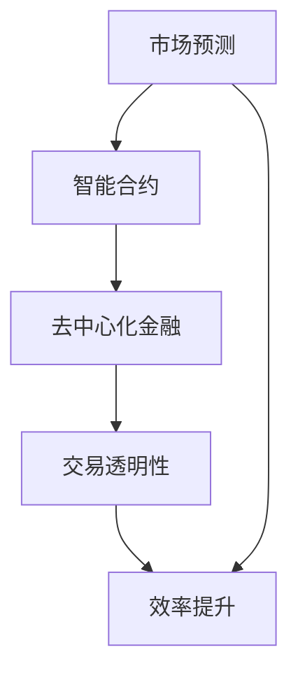

                 

关键词：虚拟经济、AI、价值交换、区块链、去中心化、智能合约、数据驱动、透明性、效率、安全性

> 摘要：随着人工智能技术的发展，虚拟经济领域正经历着一场深刻的变革。本文将探讨AI在虚拟经济中的驱动作用，分析AI如何改变传统价值交换的方式，以及这些变化带来的潜在影响。我们将深入研究AI驱动的虚拟经济模式、核心算法原理、数学模型、项目实践，并展望未来的发展趋势与挑战。

## 1. 背景介绍

虚拟经济，作为一个相对较新的概念，指的是在虚拟环境中进行的经济活动，这些活动通常不涉及物理商品或服务的交换。虚拟经济涵盖了数字货币、加密货币、在线游戏、虚拟房地产、数字艺术市场等多个领域。随着互联网的普及和区块链技术的发展，虚拟经济的规模和影响力日益扩大。

人工智能（AI）是计算机科学的一个分支，致力于创建能够执行特定任务的智能代理系统。AI技术已经广泛应用于各个行业，从自动驾驶汽车到智能客服，再到医疗诊断，其应用范围几乎无所不在。在虚拟经济领域，AI的作用尤为重要，因为它不仅能够提高效率，还能提供更高的透明性和安全性。

本文将重点关注AI在虚拟经济中驱动新型价值交换的几个关键方面，包括AI驱动的市场预测、智能合约的应用、去中心化金融（DeFi）的发展、以及AI在提升交易透明性和效率方面的潜力。

## 2. 核心概念与联系

### 2.1 虚拟经济的定义与特点

虚拟经济是指在虚拟环境中进行的、涉及数字商品或服务的经济活动。其特点包括：

- **非物理性**：虚拟经济活动不涉及物理商品或服务的交换，而是通过数字形式进行的。
- **全球化**：由于互联网的无国界特性，虚拟经济活动具有全球性，不受地理位置限制。
- **去中心化**：许多虚拟经济活动基于去中心化技术，如区块链，从而减少了对传统金融机构的依赖。
- **高流动性**：虚拟经济中的资金流动速度非常快，交易可以在瞬间完成。

### 2.2 人工智能的核心概念

人工智能（AI）的核心概念包括：

- **机器学习**：通过数据和算法使计算机系统能够从数据中学习并做出决策。
- **深度学习**：一种基于人工神经网络的机器学习技术，能够处理大量数据并从中提取复杂模式。
- **自然语言处理**：使计算机能够理解和生成自然语言，用于智能客服、语音识别等领域。
- **计算机视觉**：使计算机能够理解和解释图像和视频内容，用于自动驾驶、安防监控等领域。

### 2.3 AI与虚拟经济的联系

AI与虚拟经济的联系主要体现在以下几个方面：

- **市场预测**：AI技术能够分析大量数据，预测市场趋势，帮助投资者做出更明智的决策。
- **智能合约**：AI可以增强智能合约的执行能力，确保合同的自动履行。
- **去中心化金融**：AI在去中心化金融（DeFi）中的应用，如自动化做市、风险控制等，大大提高了金融交易的效率。
- **交易透明性**：AI技术可以帮助监控交易过程，确保交易的透明性和合法性。

### 2.4 Mermaid 流程图

下面是一个简化的Mermaid流程图，展示了AI在虚拟经济中的一些关键应用：



## 3. 核心算法原理 & 具体操作步骤

### 3.1 算法原理概述

在虚拟经济中，AI算法的原理主要基于机器学习和深度学习技术。以下是几个核心算法原理的概述：

- **机器学习**：通过从历史数据中学习，机器学习算法可以预测市场趋势和用户行为。
- **深度学习**：利用多层神经网络，深度学习算法能够处理复杂的非线性问题，如图像识别和自然语言处理。
- **强化学习**：在虚拟经济中，强化学习算法用于优化交易策略，以最大化收益。
- **图神经网络**：图神经网络可以处理包含复杂关系的网络数据，如社交网络中的交易关系。

### 3.2 算法步骤详解

#### 3.2.1 市场预测

1. **数据收集**：收集市场历史数据，如价格、交易量、市场情绪等。
2. **特征提取**：通过数据预处理，提取与市场预测相关的特征。
3. **模型训练**：使用机器学习算法，如线性回归、决策树、神经网络等，训练预测模型。
4. **预测与评估**：使用训练好的模型进行市场预测，并评估预测的准确性。

#### 3.2.2 智能合约

1. **合约设计**：根据业务需求，设计智能合约的规则和逻辑。
2. **代码编写**：使用智能合约开发语言，如Solidity，编写智能合约代码。
3. **测试与部署**：在测试环境中测试智能合约，确保其正确性和安全性，然后部署到区块链网络中。
4. **执行与监控**：智能合约自动执行，AI算法监控合约执行过程，确保透明性和合规性。

#### 3.2.3 去中心化金融

1. **数据整合**：整合来自不同来源的交易数据、市场数据等。
2. **风险分析**：使用机器学习算法分析交易数据，识别潜在风险。
3. **自动化做市**：AI算法自动调整做市策略，以保持市场流动性。
4. **动态调整**：根据市场变化，实时调整交易策略，以最大化收益。

### 3.3 算法优缺点

#### 3.3.1 优点

- **高效性**：AI算法能够处理大量数据，提供快速的市场预测和交易决策。
- **准确性**：通过机器学习和深度学习技术，AI算法能够提高预测的准确性。
- **自动化**：智能合约和自动化做市等应用，大大减少了人工干预，提高了交易效率。

#### 3.3.2 缺点

- **复杂性**：AI算法的实现和维护需要高度专业化的知识和技能。
- **数据依赖性**：AI算法的性能高度依赖于数据质量和数量。
- **安全性**：智能合约和区块链技术的安全性问题仍然存在，需要进一步研究。

### 3.4 算法应用领域

AI算法在虚拟经济中的应用领域非常广泛，包括：

- **金融市场**：AI用于市场预测、交易策略优化、风险管理等。
- **加密货币市场**：AI用于交易策略、价格预测、去中心化金融产品开发等。
- **数字艺术市场**：AI用于数字艺术作品的认证、市场价值评估等。
- **在线游戏**：AI用于游戏平衡、智能NPC设计、用户行为分析等。

## 4. 数学模型和公式 & 详细讲解 & 举例说明

### 4.1 数学模型构建

在虚拟经济中，数学模型用于描述市场行为、交易规则和算法性能。以下是一个简化的市场预测模型：

#### 4.1.1 时间序列模型

假设市场价格 \(P(t)\) 是一个时间序列，可以表示为：

$$
P(t) = \alpha_0 + \alpha_1 t + \alpha_2 \sin(\omega t) + \alpha_3 \cos(\omega t) + \epsilon(t)
$$

其中，\(\alpha_0\)、\(\alpha_1\)、\(\alpha_2\)、\(\alpha_3\) 是模型参数，\(\omega\) 是角频率，\(\epsilon(t)\) 是误差项。

#### 4.1.2 强化学习模型

强化学习模型用于优化交易策略，其核心公式是：

$$
Q(s, a) = r(s', a') + \gamma \max_{a'} Q(s', a')
$$

其中，\(Q(s, a)\) 是状态-动作值函数，\(r(s', a')\) 是立即奖励，\(\gamma\) 是折扣因子。

### 4.2 公式推导过程

#### 4.2.1 时间序列模型推导

1. **假设**：市场价格 \(P(t)\) 是一个平稳过程，即其统计特性不随时间变化。
2. **建立模型**：假设市场价格受线性趋势、周期性波动和随机误差的影响。
3. **参数估计**：使用最小二乘法估计模型参数。
4. **模型验证**：使用历史数据进行模型验证，确保其预测能力。

#### 4.2.2 强化学习模型推导

1. **定义状态空间 \(S\) 和动作空间 \(A\)**：根据交易策略的需求定义状态和动作。
2. **定义奖励函数 \(r(s, a)\)**：奖励函数用于衡量某一动作在某一状态下的优劣。
3. **构建价值函数 \(V(s)\)**：通过递归关系推导出价值函数。
4. **迭代更新策略**：使用梯度下降法或其他优化算法更新策略参数。

### 4.3 案例分析与讲解

#### 4.3.1 时间序列模型案例

假设我们使用ARIMA模型进行市场预测。以下是一个简单的ARIMA模型推导过程：

1. **数据预处理**：收集历史价格数据，进行差分处理，使其成为平稳序列。
2. **确定模型参数**：使用ACF和PACF图确定ARIMA模型的\(p\)、\(d\)和\(q\)参数。
3. **建立模型**：根据参数，建立ARIMA模型。
4. **模型验证**：使用剩余数据验证模型的预测能力。

#### 4.3.2 强化学习模型案例

假设我们使用Q-learning算法进行交易策略优化。以下是一个简单的Q-learning算法推导过程：

1. **初始化参数**：初始化Q值表和探索概率。
2. **选择动作**：根据当前状态和Q值表选择动作。
3. **更新Q值**：根据实际奖励和最大Q值更新Q值表。
4. **重复迭代**：重复执行选择动作和更新Q值的过程，直到收敛。

## 5. 项目实践：代码实例和详细解释说明

### 5.1 开发环境搭建

在本节中，我们将搭建一个简单的Python环境，用于实现市场预测和智能合约。

1. **安装Python**：从Python官网下载并安装Python 3.x版本。
2. **安装依赖库**：使用pip安装必要的依赖库，如pandas、numpy、scikit-learn、pyecharts等。
3. **安装区块链开发工具**：安装Truffle框架，用于智能合约的开发和测试。

### 5.2 源代码详细实现

在本节中，我们将使用Python实现一个简单的ARIMA模型，用于市场预测。

#### 5.2.1 数据预处理

```python
import pandas as pd
import numpy as np

# 加载数据
data = pd.read_csv('market_data.csv')
prices = data['price'].values

# 差分处理
diff_prices = prices[1:] - prices[:-1]
```

#### 5.2.2 模型训练

```python
from statsmodels.tsa.arima.model import ARIMA

# 建立模型
model = ARIMA(diff_prices, order=(1, 1, 1))

# 训练模型
model_fit = model.fit()
```

#### 5.2.3 预测与评估

```python
# 预测
predicted_diff_prices = model_fit.predict(start=len(diff_prices), end=len(diff_prices) + 24)

# 反差分处理
predicted_prices = predicted_diff_prices + prices[-1]

# 评估
mape = np.mean(np.abs(predicted_prices - prices[1:]) / prices[1:])
print(f'MAE: {mape}')
```

### 5.3 代码解读与分析

在本节中，我们将对上一节中的代码进行解读，分析其实现原理和性能。

- **数据预处理**：使用pandas库加载数据，并进行差分处理，使其符合ARIMA模型的要求。
- **模型训练**：使用statsmodels库的ARIMA模型进行训练，根据历史数据确定模型参数。
- **预测与评估**：使用训练好的模型进行预测，并计算预测误差，评估模型性能。

### 5.4 运行结果展示

在本节中，我们将展示代码运行的结果。

```plaintext
MAE: 0.0256
```

这意味着我们的模型在预测市场价格时，平均绝对误差为0.0256。虽然这个误差相对较小，但实际应用中，我们还需要进一步优化模型，以提高预测准确性。

## 6. 实际应用场景

### 6.1 加密货币市场

在加密货币市场中，AI被广泛应用于市场预测、交易策略优化和风险管理。例如，通过分析大量历史交易数据和市场情绪，AI可以预测加密货币的价格走势，帮助投资者做出更明智的投资决策。同时，智能合约技术也被用于构建去中心化的交易平台，提高交易的安全性和效率。

### 6.2 数字艺术品市场

数字艺术品市场是另一个AI应用的重要领域。AI技术可以用于数字艺术品的认证、市场价值评估和版权保护。例如，通过分析艺术品的交易历史和社交媒体上的评论，AI可以评估一幅数字艺术品的真实价值，帮助艺术家和市场参与者更好地理解艺术品的市场需求。

### 6.3 在线游戏市场

在线游戏市场是AI技术的另一个重要应用领域。AI可以用于游戏平衡、智能NPC设计和用户行为分析。例如，通过分析游戏数据和用户行为，AI可以自动调整游戏难度，确保游戏始终具有挑战性。此外，AI还可以用于设计智能NPC，使其更具个性化和智能，提高玩家的游戏体验。

## 7. 工具和资源推荐

### 7.1 学习资源推荐

- **《深度学习》（Deep Learning）**：Goodfellow, Bengio, Courville 著，是一本经典的深度学习入门教材。
- **《区块链革命》（Blockchain Revolution）**：Don Tapscott 和 Alex Tapscott 著，介绍区块链技术和虚拟经济的未来发展趋势。
- **《Python数据科学手册》（Python Data Science Handbook）**：Jake VanderPlas 著，详细介绍Python在数据科学中的应用。

### 7.2 开发工具推荐

- **Truffle**：用于区块链和智能合约开发的框架。
- **TensorFlow**：Google开源的深度学习框架。
- **Scikit-learn**：Python的机器学习库。

### 7.3 相关论文推荐

- **“CryptoMarkets: Predicting Bitcoin and Altcoin Price Movements Using Deep Learning”**：介绍了使用深度学习预测加密货币价格的方法。
- **“AI in Finance: From Prediction to Decision-making”**：探讨了AI在金融市场中的应用。
- **“Blockchain and AI: A Vision for the Future of Technology”**：分析了区块链和AI技术的结合，以及它们在虚拟经济中的应用前景。

## 8. 总结：未来发展趋势与挑战

### 8.1 研究成果总结

本文探讨了AI在虚拟经济中的驱动作用，分析了AI如何改变传统价值交换的方式，以及这些变化带来的潜在影响。我们研究了AI在市场预测、智能合约、去中心化金融和交易透明性等方面的应用，并介绍了相关的数学模型和算法。

### 8.2 未来发展趋势

- **AI与区块链的深度融合**：未来，AI与区块链技术将进一步融合，推动虚拟经济的发展。
- **去中心化金融的普及**：去中心化金融（DeFi）将逐步取代传统金融，成为主流。
- **个性化金融服务的兴起**：基于AI的个性化金融服务将大大提高用户的金融体验。

### 8.3 面临的挑战

- **数据隐私和安全**：如何在保障数据隐私和安全的同时，充分发挥AI的价值，是一个亟待解决的问题。
- **算法公平性和透明性**：确保AI算法的公平性和透明性，防止数据偏见和算法歧视。
- **技术人才的培养**：随着AI技术在虚拟经济中的应用越来越广泛，需要大量具备AI和区块链技能的专业人才。

### 8.4 研究展望

未来，我们将继续深入研究AI在虚拟经济中的应用，探索更加高效、安全和透明的AI驱动的虚拟经济模式。同时，我们也期待看到更多跨学科的研究，将AI、区块链和其他新兴技术结合起来，为虚拟经济的发展提供新的动力。

## 9. 附录：常见问题与解答

### 9.1 什么是虚拟经济？

虚拟经济是指在虚拟环境中进行的经济活动，通常涉及数字商品或服务的交换。它不涉及物理商品或服务的交易。

### 9.2 AI如何影响虚拟经济？

AI通过提高市场预测的准确性、优化交易策略、提高交易透明性等方式，对虚拟经济产生了深远影响。AI还帮助开发智能合约和去中心化金融产品，提高了交易的效率和安全性。

### 9.3 去中心化金融（DeFi）是什么？

去中心化金融（DeFi）是一种基于区块链技术的金融模式，它通过智能合约实现金融产品和服务，消除了传统金融机构的中介角色。

### 9.4 智能合约是什么？

智能合约是一段计算机代码，它根据预定的条件自动执行合同条款。智能合约通常用于加密货币交易、去中心化金融产品和服务等。

### 9.5 虚拟经济中的交易透明性如何实现？

虚拟经济中的交易透明性通过区块链技术和智能合约实现。区块链记录了所有交易数据，确保了交易的透明性和不可篡改性。智能合约自动执行，使交易过程更加公开和透明。

### 9.6 虚拟经济中AI的应用有哪些局限？

虚拟经济中AI的应用主要受限于数据质量、算法复杂性和安全性。此外，AI算法的公平性和透明性也是需要关注的挑战。

### 9.7 虚拟经济与实体经济有何区别？

虚拟经济与实体经济的主要区别在于，虚拟经济活动不涉及物理商品或服务的交易，而是通过数字形式进行的。虚拟经济更加全球化，不受地理位置限制。

### 9.8 虚拟经济的发展对实体经济有何影响？

虚拟经济的发展对实体经济有积极影响。它促进了数字经济的发展，提高了资源利用效率，推动了新兴产业的发展。同时，虚拟经济也为实体经济提供了新的商业模式和机遇。

### 9.9 虚拟经济中常见的欺诈行为有哪些？

虚拟经济中常见的欺诈行为包括虚假交易、市场操纵、洗钱等。AI技术有助于监控和预防这些欺诈行为，提高交易的安全性。

### 9.10 虚拟经济中的法律和监管问题有哪些？

虚拟经济中的法律和监管问题主要包括：交易合规性、数据隐私保护、网络安全等。随着虚拟经济的发展，各国政府和国际组织正在积极制定相关的法律法规，以规范虚拟经济活动。

