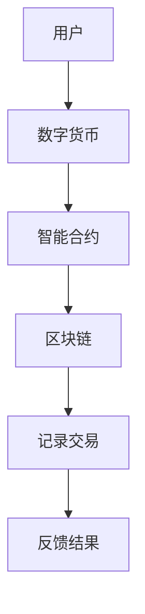

                 

关键词：虚拟经济，AI，价值交换，数字经济，智能合约

摘要：本文旨在探讨AI在虚拟经济中的应用，特别是如何通过智能合约和区块链技术驱动新型价值交换模式。文章首先介绍了虚拟经济的背景和核心概念，然后深入分析了AI技术在价值交换中的作用，以及其面临的挑战和未来发展趋势。

## 1. 背景介绍

虚拟经济是指以数字形式存在的经济活动，包括虚拟商品交易、在线支付、数字货币等。随着互联网和数字技术的快速发展，虚拟经济已经成为全球经济的重要组成部分。然而，传统的价值交换模式在虚拟经济中面临着诸多挑战，如信任问题、安全性和透明性问题等。

### 虚拟经济的核心概念

1. **虚拟商品**：在虚拟经济中，商品不再以实体形式存在，而是以数字形式进行交易。
2. **在线支付**：使用数字货币或其他在线支付方式完成交易。
3. **数字货币**：如比特币、以太币等，作为虚拟经济的交易媒介。

### 虚拟经济的挑战

1. **信任问题**：在虚拟经济中，交易双方往往无法确认对方的身份和信誉。
2. **安全性问题**：虚拟经济活动容易受到网络攻击和数据泄露的威胁。
3. **透明性问题**：交易过程和结果往往不够透明，容易导致欺诈行为。

## 2. 核心概念与联系

### 核心概念

- **AI**：人工智能，是一种模拟人类智能行为的计算机系统。
- **智能合约**：一种自动执行合同条款的计算机程序，通常运行在区块链上。
- **区块链**：一种分布式账本技术，用于记录交易数据。

### 联系

AI可以用于增强智能合约的执行能力，提高交易的安全性和透明性。同时，区块链技术为虚拟经济提供了可靠的信任基础。

### Mermaid 流程图



## 3. 核心算法原理 & 具体操作步骤

### 3.1 算法原理概述

智能合约的核心是算法，它根据预定的规则自动执行交易。算法原理主要包括：

- **条件判断**：根据输入条件自动执行相应的操作。
- **加密技术**：确保交易数据的安全性和隐私性。
- **共识算法**：区块链网络中的节点就交易数据达成一致。

### 3.2 算法步骤详解

1. **输入条件设置**：用户设定交易的条件，如价格、数量等。
2. **交易执行**：智能合约根据输入条件自动执行交易。
3. **结果反馈**：交易完成后，结果自动反馈给用户。

### 3.3 算法优缺点

#### 优点：

- **提高交易效率**：自动化执行交易，减少人工干预。
- **增强安全性**：加密技术和共识算法提高交易安全性。
- **提升透明性**：所有交易记录都在区块链上公开透明。

#### 缺点：

- **算法复杂性**：需要复杂的算法支持，对开发者和用户都有较高要求。
- **去中心化问题**：去中心化可能导致交易速度变慢。

### 3.4 算法应用领域

智能合约和区块链技术已经在金融、供应链管理、医疗等多个领域得到应用，未来将在虚拟经济中发挥更大作用。

## 4. 数学模型和公式 & 详细讲解 & 举例说明

### 4.1 数学模型构建

智能合约的数学模型主要包括：

- **条件判断模型**：使用逻辑运算符构建条件判断模型。
- **加密模型**：使用加密算法构建数据加密模型。
- **共识模型**：使用共识算法构建分布式网络模型。

### 4.2 公式推导过程

以条件判断模型为例，公式推导过程如下：

$$
f(x) =
\begin{cases}
    1 & \text{if } x \text{ meets the conditions} \\
    0 & \text{otherwise}
\end{cases}
$$

### 4.3 案例分析与讲解

以一个简单的数字货币交易为例，智能合约的执行过程如下：

1. **用户A购买数字货币**：用户A发出购买请求，输入购买价格和数量。
2. **智能合约执行**：智能合约根据输入条件自动执行交易。
3. **交易结果反馈**：交易完成后，结果自动反馈给用户A。

## 5. 项目实践：代码实例和详细解释说明

### 5.1 开发环境搭建

搭建智能合约开发环境，包括安装Node.js、Truffle框架和Ganache测试网络。

### 5.2 源代码详细实现

```solidity
pragma solidity ^0.8.0;

contract SimpleContract {
    mapping(address => uint256) public balanceOf;

    function transfer(address to, uint256 amount) public {
        require(balanceOf[msg.sender] >= amount, "Insufficient balance");
        balanceOf[msg.sender] -= amount;
        balanceOf[to] += amount;
    }
}
```

### 5.3 代码解读与分析

- `balanceOf`：记录每个用户的余额。
- `transfer`：实现转账功能。

### 5.4 运行结果展示

使用Ganache测试网络运行代码，验证智能合约的执行结果。

## 6. 实际应用场景

### 6.1 金融领域

智能合约和区块链技术在金融领域有广泛应用，如数字货币交易、跨境支付、智能投顾等。

### 6.2 供应链管理

区块链技术可以提高供应链的透明性和安全性，降低欺诈风险。

### 6.3 医疗领域

智能合约可以用于医疗数据的共享和管理，提高数据安全性。

### 6.4 未来应用展望

智能合约和区块链技术在虚拟经济中的应用前景广阔，有望推动数字经济的发展。

## 7. 工具和资源推荐

### 7.1 学习资源推荐

- 《区块链：从入门到精通》
- 《智能合约开发实战》

### 7.2 开发工具推荐

- Truffle：智能合约开发框架
- Remix：在线智能合约编辑器

### 7.3 相关论文推荐

- "Bitcoin: A Peer-to-Peer Electronic Cash System"
- "Smart Contracts: Building and Running Code across Blockchains"

## 8. 总结：未来发展趋势与挑战

### 8.1 研究成果总结

智能合约和区块链技术在虚拟经济中的应用取得了显著成果，为价值交换提供了新的解决方案。

### 8.2 未来发展趋势

随着技术的不断进步，智能合约和区块链技术将在更多领域得到应用，推动数字经济的发展。

### 8.3 面临的挑战

智能合约的安全性、可扩展性和去中心化问题仍然是未来需要解决的重要挑战。

### 8.4 研究展望

未来，AI和区块链技术的融合将为虚拟经济带来更多创新和可能性。

## 9. 附录：常见问题与解答

### Q：智能合约的安全性如何保障？

A：智能合约的安全性主要通过以下措施保障：

- **严格的代码审查**：确保智能合约代码没有漏洞。
- **测试网络测试**：在部署到主网前，在测试网络上进行充分测试。
- **安全审计**：聘请专业团队进行安全审计。

---

### 结论

虚拟经济作为一种新兴的经济模式，正不断受到AI和区块链技术的驱动。智能合约和区块链技术为虚拟经济提供了安全、透明和高效的交易方式。未来，随着技术的不断进步，虚拟经济将在全球范围内发挥更大作用，为人类社会的经济发展带来新的机遇。作者：禅与计算机程序设计艺术 / Zen and the Art of Computer Programming
```

