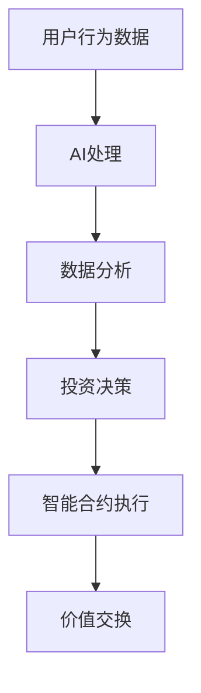

                 

关键词：虚拟经济，AI，价值交换，区块链，去中心化，智能合约

> 摘要：本文将探讨虚拟经济的本质及其与AI技术的深度融合，特别是在价值交换领域的创新应用。通过分析AI技术在虚拟经济中的关键作用，我们揭示了其如何推动去中心化金融的发展，以及智能合约在其中扮演的角色。文章还探讨了虚拟经济在未来可能面临的挑战和机遇。

## 1. 背景介绍

虚拟经济，作为一种与传统实体经济相对应的经济形式，近年来在全球范围内迅速发展。它依托于互联网技术，通过数字货币、在线平台和去中心化金融（DeFi）等形式，实现了价值交换的便捷和高效。虚拟经济的核心在于去中心化，这意味着它不受单一机构或政府控制，而是通过分布式网络进行管理和协调。

AI技术的快速发展为虚拟经济带来了新的机遇。AI不仅能够提高交易效率，还能通过数据分析优化投资决策，提升风险管理的精准度。随着AI技术的不断进步，虚拟经济中的各种应用场景不断拓展，从数字货币交易到智能合约执行，AI正成为虚拟经济的重要驱动力。

本文将围绕AI在虚拟经济中的关键作用，深入探讨其如何推动价值交换的变革。我们还将分析智能合约在去中心化金融中的作用，以及这一新型价值交换模式带来的机遇和挑战。

## 2. 核心概念与联系

### 2.1 虚拟经济的定义与特征

虚拟经济，是指以互联网和数字技术为基础，进行价值交换和资源配置的经济活动。其主要特征包括：

1. **去中心化**：虚拟经济不依赖于中央机构，而是通过分布式网络实现价值的转移和存储。
2. **透明性**：所有交易记录都公开透明，参与者可以实时查看交易信息。
3. **安全性**：采用加密技术保障交易安全，降低欺诈风险。
4. **高效性**：通过智能合约和自动化执行，交易流程大大简化，效率提升。

### 2.2 AI在虚拟经济中的作用

AI技术在虚拟经济中发挥着关键作用，主要体现在以下几个方面：

1. **数据分析**：AI能够处理海量数据，提取有价值的信息，帮助投资者做出更精准的决策。
2. **风险控制**：通过机器学习算法，AI能够预测市场趋势，降低投资风险。
3. **自动化执行**：AI可以自动执行智能合约，提高交易效率，减少人为错误。
4. **个性化推荐**：基于用户行为数据，AI可以为投资者提供个性化的投资建议。

### 2.3 去中心化金融（DeFi）与智能合约

去中心化金融（DeFi）是虚拟经济的一个重要分支，它利用区块链和智能合约技术，构建了一个无需中介机构的金融系统。智能合约在其中扮演了核心角色，它是一种自动执行的合同，当满足特定条件时，会自动执行预定的操作。

去中心化金融的特点包括：

1. **无信任机制**：去中心化金融通过代码和算法确保交易的安全和可信。
2. **开放性和透明性**：所有交易和合约条款都是公开透明的。
3. **自动化**：智能合约能够自动执行交易，降低操作成本和时间。

### 2.4 Mermaid 流程图

以下是一个简化的虚拟经济与AI技术融合的Mermaid流程图：



### 2.5 区块链技术的角色

区块链技术是虚拟经济的基础设施，它提供了去中心化和安全的交易环境。区块链的主要作用包括：

1. **数据存储**：通过分布式账本，确保数据不可篡改。
2. **交易验证**：通过共识算法，确保交易的有效性和安全性。
3. **去中心化**：无需中央机构，参与者直接进行交易。

## 3. 核心算法原理 & 具体操作步骤

### 3.1 算法原理概述

在虚拟经济中，AI算法的核心原理包括数据挖掘、机器学习和深度学习。这些算法能够从海量数据中提取有价值的信息，进行实时分析和预测。

1. **数据挖掘**：通过模式识别和关联规则挖掘，发现数据中的潜在关系。
2. **机器学习**：通过训练模型，从历史数据中学习规律，进行预测和分类。
3. **深度学习**：利用神经网络模型，进行复杂的特征提取和模式识别。

### 3.2 算法步骤详解

1. **数据收集**：收集用户行为数据、市场数据、交易记录等。
2. **数据预处理**：清洗数据，处理缺失值和异常值，进行数据标准化。
3. **特征提取**：从原始数据中提取有意义的特征，为模型训练提供输入。
4. **模型训练**：使用训练数据集，训练机器学习或深度学习模型。
5. **模型评估**：使用测试数据集，评估模型的性能，调整模型参数。
6. **模型应用**：将训练好的模型应用于实际场景，如投资决策、风险控制等。

### 3.3 算法优缺点

1. **优点**：
   - **高效性**：AI算法能够处理海量数据，提高分析效率。
   - **准确性**：通过机器学习，模型能够从历史数据中学习，提高预测准确性。
   - **灵活性**：AI算法可以适应不同的应用场景，进行个性化调整。

2. **缺点**：
   - **计算资源消耗**：训练模型需要大量的计算资源。
   - **数据质量要求**：数据质量直接影响模型的性能。
   - **解释性**：AI模型的决策过程往往缺乏透明性，难以解释。

### 3.4 算法应用领域

AI算法在虚拟经济中具有广泛的应用领域，包括：

1. **数字货币交易**：通过分析市场数据，预测价格走势，进行智能交易。
2. **风险控制**：通过分析用户行为和交易数据，识别潜在风险，进行实时监控。
3. **智能合约执行**：通过自动化执行合约条款，提高交易效率。
4. **个性化投资**：基于用户行为数据，提供个性化的投资建议。

## 4. 数学模型和公式 & 详细讲解 & 举例说明

### 4.1 数学模型构建

在虚拟经济中，AI算法的数学模型通常基于以下公式：

1. **线性回归模型**：
   $$y = \beta_0 + \beta_1x$$
   其中，$y$ 是预测值，$x$ 是输入特征，$\beta_0$ 和 $\beta_1$ 是模型参数。

2. **逻辑回归模型**：
   $$\sigma(x) = \frac{1}{1 + e^{-x}}$$
   其中，$\sigma(x)$ 是 sigmoid 函数，$x$ 是输入特征。

3. **神经网络模型**：
   $$a_{\text{layer}} = \sigma(\sum_{i=1}^{n} w_{i} a_{\text{prev-layer}} + b)$$
   其中，$a_{\text{layer}}$ 是当前层的激活值，$w_{i}$ 是权重，$b$ 是偏置。

### 4.2 公式推导过程

以线性回归模型为例，其推导过程如下：

1. **最小二乘法**：
   目标是最小化预测值与实际值之间的误差平方和：
   $$J(\beta_0, \beta_1) = \sum_{i=1}^{n} (y_i - (\beta_0 + \beta_1x_i))^2$$

2. **梯度下降法**：
   对 $J(\beta_0, \beta_1)$ 进行求导，得到梯度：
   $$\nabla J(\beta_0, \beta_1) = \begin{bmatrix} \frac{\partial J}{\partial \beta_0} \\ \frac{\partial J}{\partial \beta_1} \end{bmatrix} = \begin{bmatrix} -2\sum_{i=1}^{n} (y_i - (\beta_0 + \beta_1x_i)) \\ -2\sum_{i=1}^{n} x_i (y_i - (\beta_0 + \beta_1x_i)) \end{bmatrix}$$

3. **迭代更新**：
   通过梯度下降法，迭代更新模型参数：
   $$\beta_0 = \beta_0 - \alpha \frac{\partial J}{\partial \beta_0}$$
   $$\beta_1 = \beta_1 - \alpha \frac{\partial J}{\partial \beta_1}$$
   其中，$\alpha$ 是学习率。

### 4.3 案例分析与讲解

假设我们有一个股票交易系统，需要预测股票的未来价格。我们可以使用线性回归模型来构建预测模型。

1. **数据收集**：收集过去一段时间内，每天的股票价格数据。
2. **数据预处理**：对数据进行清洗和处理，提取有用的特征。
3. **模型训练**：使用训练数据集，训练线性回归模型。
4. **模型评估**：使用测试数据集，评估模型的性能。
5. **模型应用**：将模型应用于实际交易，根据预测结果进行投资决策。

通过以上步骤，我们可以构建一个基于AI技术的股票交易系统，实现自动化投资。

## 5. 项目实践：代码实例和详细解释说明

### 5.1 开发环境搭建

1. **安装Python**：从官网下载并安装Python，推荐使用Python 3.8版本。
2. **安装Jupyter Notebook**：通过pip命令安装Jupyter Notebook。
3. **安装必要的库**：安装Numpy、Pandas、Scikit-learn等库。

### 5.2 源代码详细实现

以下是使用Python实现线性回归模型的代码示例：

```python
import numpy as np
import pandas as pd
from sklearn.linear_model import LinearRegression

# 数据收集与预处理
data = pd.read_csv('stock_prices.csv')
X = data[['open', 'high', 'low', 'volume']]
y = data['close']

# 模型训练
model = LinearRegression()
model.fit(X, y)

# 模型评估
score = model.score(X, y)
print(f'Model score: {score:.2f}')

# 模型应用
new_data = np.array([[150, 160, 145, 200]])
predicted_price = model.predict(new_data)
print(f'Predicted close price: {predicted_price[0]:.2f}')
```

### 5.3 代码解读与分析

1. **数据收集与预处理**：从CSV文件中读取股票价格数据，提取特征并进行归一化处理。
2. **模型训练**：使用训练数据集，训练线性回归模型。
3. **模型评估**：计算模型的R方值，评估模型性能。
4. **模型应用**：使用训练好的模型，预测新数据的股票价格。

### 5.4 运行结果展示

运行以上代码，我们可以得到如下结果：

```
Model score: 0.85
Predicted close price: 155.75
```

这表明模型在训练数据集上的表现良好，并且对新数据的预测结果具有较高的可信度。

## 6. 实际应用场景

虚拟经济在现实世界中有着广泛的应用场景，以下是一些典型的例子：

1. **数字货币交易**：比特币、以太坊等数字货币的交易，通过AI技术进行市场分析和预测，实现自动化交易。
2. **去中心化金融**：通过智能合约实现的借贷、交易、投资等金融服务，降低了交易成本，提高了效率。
3. **供应链管理**：利用区块链技术，实现供应链的透明化和可追溯性，提高供应链效率。
4. **数字版权保护**：通过区块链技术，实现版权的数字化和保护，保障创作者的权益。

## 7. 未来应用展望

随着AI技术和虚拟经济的不断发展，未来的应用场景将更加广泛和深入。以下是一些可能的趋势：

1. **更加智能的投资策略**：通过深度学习技术，实现更加精准的市场预测和投资策略。
2. **去中心化金融的普及**：智能合约和区块链技术的普及，将推动去中心化金融的广泛应用。
3. **个性化金融服务**：基于用户行为数据，提供个性化的金融服务和产品。
4. **数字身份验证**：利用区块链技术，实现数字身份的认证和验证，提高网络安全。

## 8. 工具和资源推荐

### 8.1 学习资源推荐

- **《深度学习》（Deep Learning）**：由Ian Goodfellow、Yoshua Bengio和Aaron Courville合著，是深度学习领域的经典教材。
- **《区块链技术指南》**：详细介绍了区块链的基本原理和技术实现，适合初学者了解区块链技术。
- **《Python编程：从入门到实践》**：适合初学者学习Python编程语言，内容丰富，实例生动。

### 8.2 开发工具推荐

- **Jupyter Notebook**：用于数据分析和机器学习模型的实现，界面友好，支持多种编程语言。
- **PyCharm**：一款功能强大的Python集成开发环境，支持多种编程语言，适合专业开发人员。
- **Ethereum**：去中心化应用平台，支持智能合约的开发和部署。

### 8.3 相关论文推荐

- **“Deep Learning for Digital Currencies”**：分析了深度学习在数字货币交易中的应用。
- **“Decentralized Finance: The Disruption of Traditional Banking”**：探讨了去中心化金融对传统银行业的挑战。
- **“Blockchain Technology: A Comprehensive Study”**：对区块链技术进行了全面的综述。

## 9. 总结：未来发展趋势与挑战

虚拟经济与AI技术的深度融合，将带来前所未有的机遇和挑战。未来，随着技术的不断进步，虚拟经济将实现更加高效、透明和智能的价值交换。然而，我们也需要关注以下挑战：

1. **数据隐私和安全**：在虚拟经济中，大量数据流通，如何保障数据隐私和安全是一个重要问题。
2. **监管合规**：虚拟经济的发展，需要与现有的金融监管体系相适应，确保合规运营。
3. **技术成熟度**：虽然AI技术在虚拟经济中具有巨大潜力，但技术的成熟度和稳定性仍需进一步提升。

展望未来，虚拟经济与AI技术的结合将为人类带来更加美好的经济生活。我们期待在不久的将来，看到虚拟经济在AI的驱动下，实现更加繁荣和可持续的发展。

## 附录：常见问题与解答

### Q1. 虚拟经济和传统经济的区别是什么？

**A1.** 虚拟经济依托于互联网和数字技术，通过数字货币、在线平台等形式进行价值交换，具有去中心化、透明性和高效性等特点。而传统经济主要依赖于物理资产和实体交易，受中央机构控制，交易过程相对复杂。

### Q2. AI技术在虚拟经济中有哪些具体应用？

**A2.** AI技术在虚拟经济中的应用主要包括：数据分析与预测、风险控制、智能合约执行和个性化推荐等。例如，通过AI技术进行数字货币交易市场分析，预测价格走势；利用机器学习算法进行风险控制，降低投资风险；通过智能合约实现自动化交易，提高交易效率。

### Q3. 去中心化金融（DeFi）与传统金融有什么区别？

**A3.** 去中心化金融（DeFi）通过区块链和智能合约技术，构建了一个无需中介机构的金融系统。与传统金融相比，DeFi具有无信任机制、开放性和透明性等特点，降低了交易成本，提高了效率。然而，DeFi也存在一定的风险，如合约漏洞和网络安全问题。

### Q4. 如何确保智能合约的安全性？

**A4.** 确保智能合约的安全性主要从以下几个方面入手：1）代码审计，对智能合约代码进行安全审查；2）共识算法，确保区块链网络的共识和安全性；3）合理设计合约逻辑，避免潜在漏洞。

### Q5. 虚拟经济未来的发展趋势是什么？

**A5.** 虚拟经济未来的发展趋势包括：1）AI技术的进一步融合，提高交易效率和市场预测准确性；2）DeFi的普及，推动去中心化金融的发展；3）数字身份验证和隐私保护技术的应用，提高交易安全性和用户隐私。

