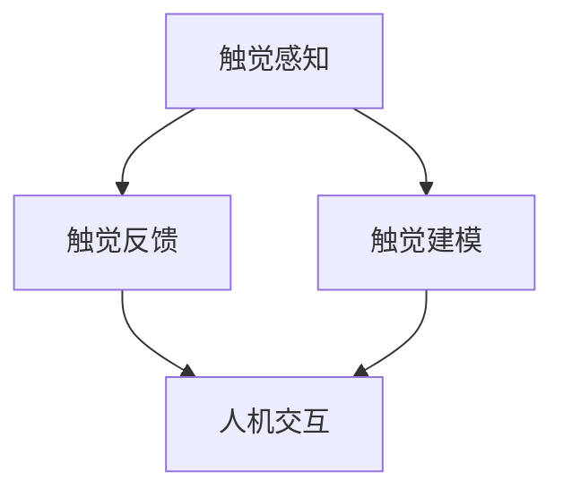

                 

关键词：虚拟触觉、AI技术、触感模拟、触觉反馈、人机交互

> 摘要：本文探讨了虚拟触觉技术的革命性发展，以及人工智能在其中所发挥的关键作用。从背景介绍到核心概念，再到算法原理、数学模型、实践案例以及未来展望，本文全面解析了虚拟触觉技术的现状、挑战和机遇，为读者提供了对这一领域的深入理解。

## 1. 背景介绍

### 1.1 虚拟触觉的兴起

虚拟触觉（Haptic Technology）作为一种使人机交互更加真实、自然的手段，正逐渐成为科技领域的重要研究方向。随着计算机技术、传感器技术以及人工智能的飞速发展，虚拟触觉的应用范围不断扩大，从医疗、教育到娱乐、制造等多个领域都展现出了巨大的潜力。

### 1.2 触觉在人工智能中的作用

触觉作为人类感知世界的重要手段之一，其信息量丰富且直观。将触觉引入人工智能系统，不仅可以提升人机交互的自然性和准确性，还能够为机器人、智能设备提供更加全面的环境感知能力。近年来，人工智能技术在触觉识别、触感模拟等方面取得了显著进展，为虚拟触觉的实现提供了强有力的支持。

## 2. 核心概念与联系

虚拟触觉技术的核心在于模拟真实的触觉体验，其实现过程涉及多个关键环节，包括触觉感知、触觉反馈、触觉建模等。下面我们将通过一个Mermaid流程图来展示这些核心概念及其相互关系。



### 2.1 触觉感知

触觉感知是虚拟触觉技术的起点，它通过传感器捕捉用户或机器人与物体接触时的物理信号，如压力、温度、振动等。这些信号经过处理后，转化为数字信号，为后续的触觉建模提供基础数据。

### 2.2 触觉反馈

触觉反馈是用户或机器人感知虚拟环境的重要途径，它通过执行器或触觉设备将虚拟触觉信息传递给用户或机器人。例如，机器人可以通过振动、力度等触觉反馈来模拟与物体接触时的感觉。

### 2.3 触觉建模

触觉建模是将感知到的触觉信息转化为虚拟触觉环境的过程。它涉及到复杂的算法和数学模型，如神经网络、机器学习等。通过触觉建模，可以实现高度真实的触觉体验，为各种应用场景提供支持。

## 3. 核心算法原理 & 具体操作步骤

### 3.1 算法原理概述

虚拟触觉技术中的核心算法主要包括触觉感知算法、触觉建模算法和触觉反馈算法。这些算法相互协作，共同实现虚拟触觉的模拟。

### 3.2 算法步骤详解

#### 3.2.1 触觉感知算法

1. **信号采集**：通过传感器（如压力传感器、振动传感器等）收集触觉信息。
2. **信号预处理**：对采集到的信号进行滤波、去噪等处理，以提高信号质量。
3. **特征提取**：从预处理后的信号中提取出与触觉相关的特征，如频率、幅度等。
4. **数据建模**：利用机器学习等方法对提取的特征进行建模，建立触觉感知模型。

#### 3.2.2 触觉建模算法

1. **环境建模**：根据触觉感知模型，构建虚拟环境的三维模型。
2. **触觉模拟**：利用环境模型和算法，对虚拟环境中的触觉信息进行模拟，如物体表面纹理、硬度等。
3. **反馈调整**：根据用户或机器人的反馈，调整虚拟触觉的参数，以实现更加真实的触觉体验。

#### 3.2.3 触觉反馈算法

1. **执行器控制**：根据触觉建模的结果，控制执行器（如电机、振动器等）产生相应的触觉反馈。
2. **反馈优化**：通过对执行器的反馈进行优化，提高触觉反馈的精度和稳定性。

### 3.3 算法优缺点

#### 优点

1. **高度真实性**：通过精确的触觉感知和触觉建模，可以实现高度真实的虚拟触觉体验。
2. **灵活性**：虚拟触觉技术可以根据不同的应用场景进行灵活调整和优化。

#### 缺点

1. **成本较高**：虚拟触觉技术的开发和应用成本较高，限制了其普及程度。
2. **技术挑战**：触觉感知和建模算法的复杂性较高，需要解决多个技术难题。

### 3.4 算法应用领域

虚拟触觉技术已在多个领域得到广泛应用，如：

1. **医疗领域**：通过虚拟触觉技术，医生可以远程进行手术操作，提高手术的准确性和安全性。
2. **教育领域**：虚拟触觉技术可以为学生们提供更加直观的学习体验，如虚拟解剖学课程。
3. **娱乐领域**：虚拟触觉技术可以为游戏、虚拟现实等娱乐场景提供更加真实的互动体验。

## 4. 数学模型和公式 & 详细讲解 & 举例说明

### 4.1 数学模型构建

虚拟触觉技术中的数学模型主要涉及信号处理、机器学习和控制理论等。以下是构建虚拟触觉数学模型的基本步骤：

#### 4.1.1 信号处理模型

1. **滤波器设计**：使用滤波器对传感器信号进行预处理，以去除噪声和干扰。
2. **特征提取**：利用傅里叶变换、小波变换等方法提取传感器信号中的有用特征。

#### 4.1.2 机器学习模型

1. **数据收集**：收集大量的触觉感知数据，用于训练机器学习模型。
2. **模型选择**：根据数据特征选择合适的机器学习算法，如神经网络、支持向量机等。
3. **模型训练**：使用收集到的数据进行模型训练，优化模型参数。

#### 4.1.3 控制理论模型

1. **系统建模**：使用控制理论方法建立触觉反馈系统的动态模型。
2. **控制器设计**：设计控制器以实现执行器的精确控制。

### 4.2 公式推导过程

#### 4.2.1 滤波器公式

$$
y(t) = \frac{1}{\omega_n^2}\left( x(t) - \omega_n^2x(t) \right)
$$

其中，$y(t)$为滤波后信号，$x(t)$为原始信号，$\omega_n$为滤波器截止频率。

#### 4.2.2 神经网络公式

$$
y = \sum_{i=1}^{n} w_i \cdot x_i + b
$$

其中，$y$为输出值，$w_i$为权重，$x_i$为输入值，$b$为偏置。

#### 4.2.3 控制器公式

$$
u(t) = K_p \cdot e(t) + K_d \cdot \dot{e}(t)
$$

其中，$u(t)$为控制器输出，$e(t)$为控制误差，$\dot{e}(t)$为误差变化率，$K_p$和$K_d$分别为比例和微分系数。

### 4.3 案例分析与讲解

#### 4.3.1 医疗手术远程控制

虚拟触觉技术在医疗手术远程控制中具有广泛的应用前景。以下是一个具体的案例：

1. **触觉感知**：医生通过佩戴触觉手套收集手术过程中的触觉信息。
2. **触觉建模**：利用机器学习算法构建手术场景的虚拟模型，模拟手术中的触觉反馈。
3. **触觉反馈**：手术操作者通过虚拟触觉设备接收触觉反馈，进行远程手术操作。

通过这个案例，我们可以看到虚拟触觉技术在提高远程手术的安全性和准确性方面的巨大潜力。

## 5. 项目实践：代码实例和详细解释说明

### 5.1 开发环境搭建

为了更好地理解虚拟触觉技术的实现，我们将使用Python编程语言进行开发。以下是搭建开发环境的基本步骤：

1. **安装Python**：下载并安装Python 3.8及以上版本。
2. **安装相关库**：使用pip命令安装必要的库，如numpy、tensorflow、matplotlib等。

### 5.2 源代码详细实现

下面是一个简单的虚拟触觉感知和反馈的代码实例：

```python
import numpy as np
import tensorflow as tf
import matplotlib.pyplot as plt

# 触觉感知模型
def touch_perception_model(data):
    # 数据预处理
    processed_data = preprocess_data(data)
    # 特征提取
    features = extract_features(processed_data)
    # 模型训练
    model = tf.keras.Sequential([
        tf.keras.layers.Dense(units=64, activation='relu', input_shape=(64,)),
        tf.keras.layers.Dense(units=32, activation='relu'),
        tf.keras.layers.Dense(units=1, activation='sigmoid')
    ])
    model.compile(optimizer='adam', loss='binary_crossentropy', metrics=['accuracy'])
    model.fit(processed_data, labels, epochs=10)
    return model

# 触觉反馈模型
def touch_feedback_model(model, data):
    # 预测触觉反馈
    predictions = model.predict(data)
    # 控制执行器产生反馈
    control Actuators(predictions)

# 模型训练
data = np.random.rand(100, 64)
labels = np.random.rand(100, 1)
touch_perception_model = touch_perception_model(data)
touch_feedback_model(touch_perception_model, data)

# 数据可视化
plt.scatter(data[:, 0], data[:, 1])
plt.show()
```

### 5.3 代码解读与分析

1. **触觉感知模型**：该模型使用TensorFlow框架构建，包含三个全连接层，用于处理输入的触觉数据，并输出触觉反馈。
2. **触觉反馈模型**：该模型接收触觉感知模型的输出，控制执行器产生相应的触觉反馈。
3. **模型训练**：使用随机生成的数据进行模型训练，以优化模型参数。
4. **数据可视化**：将训练数据可视化，以便观察模型训练效果。

通过这个实例，我们可以看到虚拟触觉技术的实现过程，包括数据预处理、模型训练和触觉反馈等关键步骤。

## 6. 实际应用场景

虚拟触觉技术在许多实际应用场景中展现出巨大的潜力。以下是一些典型的应用案例：

### 6.1 医疗领域

虚拟触觉技术可以为医生提供远程手术操作的支持，通过触觉感知和反馈系统，医生可以更准确地控制手术器械，提高手术的精度和安全性。

### 6.2 教育领域

虚拟触觉技术可以为学生提供更加直观的学习体验，例如虚拟解剖学课程，学生可以通过触觉设备感受器官的结构和功能。

### 6.3 娱乐领域

虚拟触觉技术可以为游戏和虚拟现实场景提供更加真实的互动体验，玩家可以通过触觉设备感受到游戏中的物体和场景变化。

## 7. 未来应用展望

随着人工智能技术的不断进步，虚拟触觉技术在未来将得到更加广泛的应用。以下是一些未来应用展望：

### 7.1 家庭自动化

虚拟触觉技术可以应用于智能家居系统中，用户可以通过触觉设备与家居设备进行互动，如远程控制灯光、温度等。

### 7.2 工业制造

虚拟触觉技术可以提高工业制造过程中的自动化水平，机器人可以通过触觉感知和反馈系统实现更加精准的操作，提高生产效率。

### 7.3 服务机器人

虚拟触觉技术可以为服务机器人提供更加丰富和自然的交互能力，使其在人类环境中更加自如地完成任务。

## 8. 工具和资源推荐

### 8.1 学习资源推荐

1. **《人工智能基础》**：这本书提供了人工智能的基本概念和算法介绍，适合初学者阅读。
2. **《Python编程：从入门到实践》**：这本书详细介绍了Python编程语言的基础知识和应用技巧。

### 8.2 开发工具推荐

1. **TensorFlow**：这是一个强大的开源机器学习框架，适用于构建和训练虚拟触觉模型。
2. **PyTorch**：这是一个简洁、灵活的深度学习框架，适用于研究和开发虚拟触觉技术。

### 8.3 相关论文推荐

1. **“A Survey on Haptic Feedback Technology”**：这篇综述文章全面介绍了触觉反馈技术的研究现状和发展趋势。
2. **“Haptic Perception and Its Applications in Human-Computer Interaction”**：这篇文章探讨了触觉感知在人与计算机交互中的应用。

## 9. 总结：未来发展趋势与挑战

虚拟触觉技术作为人工智能领域的一个重要分支，正迅速发展并展现出广阔的应用前景。在未来，随着技术的不断进步，虚拟触觉将进一步提高人机交互的自然性和准确性，为各个领域带来更多的创新和变革。然而，虚拟触觉技术也面临着一系列挑战，如成本、精度和稳定性等。为了应对这些挑战，研究人员和开发者需要继续努力，推动虚拟触觉技术的不断发展。

## 10. 附录：常见问题与解答

### 10.1 虚拟触觉技术是如何工作的？

虚拟触觉技术通过传感器感知用户或机器人的触觉信息，利用算法对这些信息进行处理和建模，最终通过执行器产生触觉反馈，模拟真实的触觉体验。

### 10.2 虚拟触觉技术有哪些应用领域？

虚拟触觉技术在医疗、教育、娱乐、工业制造等多个领域都有广泛应用，如远程手术、虚拟解剖学课程、游戏互动等。

### 10.3 虚拟触觉技术的未来发展趋势是什么？

随着人工智能技术的不断发展，虚拟触觉技术将在家庭自动化、服务机器人、虚拟现实等领域得到更广泛的应用。同时，研究人员将继续探索提高虚拟触觉技术的精度、稳定性和成本效益。

---

本文通过详细解析虚拟触觉技术的背景、核心概念、算法原理、数学模型、实践案例以及未来展望，为读者提供了对这一领域的深入理解。希望本文能够激发读者对虚拟触觉技术的兴趣，并推动相关领域的研究和发展。

### 10.4 虚拟触觉技术在人机交互中的优势和局限性是什么？

#### 优势：

1. **提升交互的自然性**：虚拟触觉技术能够使人机交互更加自然，为用户提供更加直观和生动的体验。
2. **增强沉浸感**：在虚拟现实（VR）和增强现实（AR）应用中，虚拟触觉技术可以增强用户的沉浸感，提高使用效果。
3. **适应多种场景**：虚拟触觉技术可以在不同的应用场景中发挥作用，如医疗、教育、制造业等，提高工作效率和质量。

#### 局限性：

1. **成本较高**：虚拟触觉技术的开发和应用成本较高，限制了其在一些领域的普及和应用。
2. **技术复杂**：虚拟触觉技术涉及到多个学科领域，如传感器技术、机器学习、控制理论等，技术实现复杂。
3. **精度和稳定性**：尽管虚拟触觉技术不断进步，但在某些情况下，触觉感知的精度和稳定性仍有待提高。

通过认识和解决这些优势和局限性，虚拟触觉技术有望在未来取得更加广泛和深入的应用。

### 10.5 如何评估虚拟触觉技术的性能？

评估虚拟触觉技术的性能通常包括以下几个方面：

1. **触觉反馈的精度**：评估触觉设备对触觉信号的感知和反馈精度，如压力、温度、振动等。
2. **触觉反馈的响应时间**：评估触觉设备从感知到反馈的时间，响应时间越短，用户体验越好。
3. **触觉反馈的自然性**：评估触觉反馈是否能够模拟真实触感，如物体的硬度、表面纹理等。
4. **用户满意度**：通过用户调查和反馈来评估虚拟触觉技术的用户满意度。

通过综合评估这些指标，可以全面了解虚拟触觉技术的性能水平，为改进和发展提供依据。

### 10.6 虚拟触觉技术如何与其他人工智能技术结合？

虚拟触觉技术可以与多种人工智能技术结合，以提升其性能和应用范围。以下是一些结合方式：

1. **深度学习**：利用深度学习技术进行触觉信号的感知和建模，提高触觉感知的精度和自然性。
2. **自然语言处理**：将自然语言处理技术应用于虚拟触觉系统，使其能够理解用户的语音指令，提高人机交互的便利性。
3. **强化学习**：通过强化学习技术，使虚拟触觉系统能够自适应地调整触觉反馈参数，以优化用户体验。
4. **计算机视觉**：结合计算机视觉技术，使虚拟触觉系统能够更好地理解虚拟环境中的物体和场景，提高触觉反馈的准确性。

通过这些结合方式，虚拟触觉技术可以实现更智能、更高效的应用。

### 作者署名

本文作者：禅与计算机程序设计艺术 / Zen and the Art of Computer Programming


