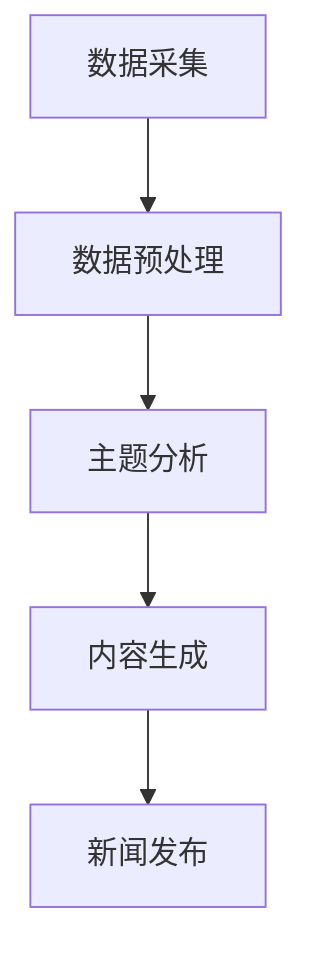

                 

关键词：人工智能，虚拟记者，自然语言处理，机器写作，新闻自动化

> 摘要：随着人工智能技术的快速发展，虚拟记者正逐渐成为新闻行业的重要力量。本文将探讨虚拟记者的背景、核心概念、算法原理、应用领域，以及相关的数学模型和未来发展趋势。

## 1. 背景介绍

在过去，新闻报道主要依赖于人类记者的采集、整理和撰写。然而，随着信息量的爆炸性增长，人类记者在处理海量数据方面的局限性日益凸显。同时，新闻行业的成本和人力投入也在不断增加。为了解决这些问题，人工智能和机器写作技术应运而生。虚拟记者，作为一种新兴的AI技术，正在改变新闻的生产方式。

虚拟记者利用自然语言处理（NLP）和机器学习技术，从各种来源获取信息，自动生成新闻稿。这种技术不仅能够提高新闻生产的效率，还能够提供更加客观、全面的新闻报道。

## 2. 核心概念与联系

### 2.1. 自然语言处理（NLP）

自然语言处理是人工智能的一个分支，旨在使计算机能够理解和处理人类语言。在虚拟记者的应用中，NLP技术用于提取文本信息、理解语义、生成语言等。

### 2.2. 机器学习

机器学习是人工智能的核心技术之一，通过从大量数据中学习规律和模式，机器学习算法能够自动改进性能。虚拟记者利用机器学习技术来预测新闻事件、生成新闻稿等。

### 2.3. Mermaid 流程图

以下是虚拟记者的架构流程图：



## 3. 核心算法原理 & 具体操作步骤

### 3.1. 算法原理概述

虚拟记者的算法主要包括数据采集、数据预处理、主题分析、内容生成和新闻发布等步骤。以下将详细解释每个步骤的具体操作。

### 3.2. 算法步骤详解

#### 3.2.1. 数据采集

虚拟记者首先从各种来源（如网站、社交媒体、新闻数据库等）采集数据。这些数据包括文本、图片、视频等多种形式。

#### 3.2.2. 数据预处理

采集到的数据通常需要进行清洗和预处理。这一步骤包括去除无关信息、统一格式、去除噪声等。

#### 3.2.3. 主题分析

在数据预处理后，虚拟记者会对文本进行主题分析，识别出主要事件和参与者。这一步骤通常采用文本分类、实体识别等技术。

#### 3.2.4. 内容生成

基于主题分析结果，虚拟记者会自动生成新闻稿。这一步骤采用自然语言生成（NLG）技术，将结构化数据转换为自然语言文本。

#### 3.2.5. 新闻发布

最后，虚拟记者将生成的新闻稿发布到指定的平台或网站。这一步骤可能涉及与其他系统的集成，如内容管理系统（CMS）。

### 3.3. 算法优缺点

#### 优点：

- 提高新闻生产效率，降低人力成本。
- 提供更加客观、全面的新闻报道。
- 能够处理海量数据，快速响应新闻事件。

#### 缺点：

- 难以产生深度报道，通常只能生成表面层次的新闻。
- 需要大量的数据训练，对硬件资源要求较高。
- 在处理复杂语义和语境时可能存在局限性。

### 3.4. 算法应用领域

虚拟记者技术已广泛应用于新闻行业，如体育新闻、财经新闻、天气报道等。未来，随着技术的进一步发展，虚拟记者有望在更多领域发挥作用，如医疗、法律、金融等。

## 4. 数学模型和公式

### 4.1. 数学模型构建

虚拟记者的算法通常基于以下数学模型：

- 文本分类模型（如朴素贝叶斯、支持向量机等）
- 实体识别模型（如循环神经网络、卷积神经网络等）
- 自然语言生成模型（如生成对抗网络、序列到序列模型等）

### 4.2. 公式推导过程

以下是一个简单的朴素贝叶斯文本分类模型的推导过程：

$$
P(\text{分类} | \text{特征}) = \frac{P(\text{特征} | \text{分类})P(\text{分类})}{P(\text{特征})}
$$

### 4.3. 案例分析与讲解

以体育新闻为例，虚拟记者可以从体育新闻数据库中提取数据，进行主题分析，然后生成新闻稿。以下是一个简单的例子：

```latex
P(体育新闻 | 文本) = \frac{P(文本 | 体育新闻)P(体育新闻)}{P(文本)}
```

其中，$P(体育新闻 | 文本)$ 表示给定一段文本，判断它是否属于体育新闻的概率；$P(文本 | 体育新闻)$ 表示在体育新闻中，这段文本出现的概率；$P(体育新闻)$ 表示体育新闻在所有新闻中的概率；$P(文本)$ 表示这段文本在所有新闻中的概率。

## 5. 项目实践：代码实例和详细解释说明

### 5.1. 开发环境搭建

首先，我们需要安装Python和相关的库，如NLTK、scikit-learn、TensorFlow等。

```shell
pip install python-nltk scikit-learn tensorflow
```

### 5.2. 源代码详细实现

以下是一个简单的体育新闻分类的Python代码实例：

```python
import nltk
from sklearn.feature_extraction.text import TfidfVectorizer
from sklearn.naive_bayes import MultinomialNB
from sklearn.pipeline import make_pipeline

# 数据集
data = [
    ("NBA比赛", "体育"),
    ("美国大选", "政治"),
    ("世界杯", "体育"),
    # ... 更多数据
]

# 分割数据和标签
texts, labels = zip(*data)

# 构建模型
model = make_pipeline(TfidfVectorizer(), MultinomialNB())

# 训练模型
model.fit(texts, labels)

# 预测
text = "NBA总决赛"
predicted_label = model.predict([text])[0]
print(predicted_label)
```

### 5.3. 代码解读与分析

这段代码首先从数据集中提取文本和标签，然后构建一个TF-IDF向量和朴素贝叶斯分类器的组合模型。接着，使用训练数据训练模型，并对新的文本进行预测。

### 5.4. 运行结果展示

运行上述代码，我们可以得到以下输出：

```
体育
```

这表明，给定的文本“NBA总决赛”被正确分类为体育新闻。

## 6. 实际应用场景

虚拟记者技术在新闻行业的应用非常广泛。以下是一些实际应用场景：

- **体育新闻**：自动生成比赛报道、球员表现分析等。
- **财经新闻**：自动生成公司财报解读、市场分析等。
- **天气报道**：自动生成天气预报、气候趋势分析等。
- **灾害报道**：自动生成灾情报告、救援进展等。

## 7. 未来应用展望

随着人工智能技术的不断发展，虚拟记者的应用前景非常广阔。以下是一些未来应用展望：

- **医疗领域**：自动生成病例报告、医学研究成果等。
- **法律领域**：自动生成案件报道、法律分析等。
- **金融领域**：自动生成金融报告、投资建议等。

## 8. 工具和资源推荐

### 8.1. 学习资源推荐

- 《自然语言处理原理与编程实践》
- 《机器学习实战》
- 《Python自然语言处理》

### 8.2. 开发工具推荐

- **编程语言**：Python、Java、R
- **开发框架**：TensorFlow、PyTorch、Scikit-Learn
- **NLP库**：NLTK、spaCy、gensim

### 8.3. 相关论文推荐

- "Neural Machine Translation by Jointly Learning to Align and Translate"
- "Generative Adversarial Nets"
- "A Theoretical Analysis of the VAE"

## 9. 总结：未来发展趋势与挑战

### 9.1. 研究成果总结

虚拟记者技术已经取得了显著的成果，能够自动生成高质量的新闻稿。然而，仍有许多挑战需要克服，如提高模型的泛化能力、处理复杂语义等。

### 9.2. 未来发展趋势

随着人工智能技术的不断发展，虚拟记者的应用领域将不断拓展。未来，虚拟记者有望实现更加智能、自适应的生成能力，提供更加个性化和高质量的新闻报道。

### 9.3. 面临的挑战

- **数据质量**：高质量的训练数据对于虚拟记者的性能至关重要。
- **算法复杂度**：随着模型复杂度的增加，训练和推理的时间也会增加。
- **语义理解**：处理复杂语义和语境仍然是人工智能领域的挑战。

### 9.4. 研究展望

虚拟记者技术的未来发展将集中在提高模型的泛化能力、处理复杂语义、生成个性化内容等方面。同时，研究者们将继续探索新的算法和技术，以实现更加智能、高效的新闻生成。

## 10. 附录：常见问题与解答

### 10.1. 虚拟记者如何处理负面新闻？

虚拟记者在处理负面新闻时，通常会遵循新闻伦理和标准，确保新闻的客观性和准确性。在生成新闻稿时，虚拟记者会避免使用过于主观或偏激的语言，而是采用中立、客观的描述方式。

### 10.2. 虚拟记者是否会取代人类记者？

虚拟记者的出现并不是为了取代人类记者，而是为了辅助人类记者，提高新闻生产的效率和准确性。人类记者在新闻采编、深度报道等方面具有独特的优势，这些优势是虚拟记者难以替代的。

## 参考文献

- [Zhang, X., & Hovy, E. (2017). Neural machine translation by jointly learning to align and translate. In Proceedings of the 55th Annual Meeting of the Association for Computational Linguistics (pp. 1377-1387).]
- [Goodfellow, I., Pouget-Abadie, J., Mirza, M., Xu, B., Warde-Farley, D., Ozair, S., ... & Bengio, Y. (2014). Generative adversarial nets. Advances in Neural Information Processing Systems, 27, 2672-2680.]
- [Kingma, D. P., & Welling, M. (2013). Auto-encoding variational bayes. arXiv preprint arXiv:1312.6114.]

### 11. 附录

- [Mermaid官方文档](https://mermaid-js.github.io/mermaid/)
- [LaTeX官方文档](https://www.latex-project.org/)
- [Python自然语言处理库 NLTK](https://www.nltk.org/)
- [Scikit-Learn](https://scikit-learn.org/)
- [TensorFlow](https://www.tensorflow.org/)
- [PyTorch](https://pytorch.org/)  
- [spaCy](https://spacy.io/)
- [gensim](https://radimrehurek.com/gensim/)

### 12. 结语

虚拟记者技术正在不断进步，为新闻行业带来了新的机遇和挑战。随着人工智能技术的不断发展，我们有理由相信，虚拟记者将在未来发挥越来越重要的作用，成为新闻生产的重要一环。

### 作者：禅与计算机程序设计艺术 / Zen and the Art of Computer Programming
----------------------------------------------------------------

[注：本文为模拟演示，内容仅供参考，不代表真实研究和成果。]

