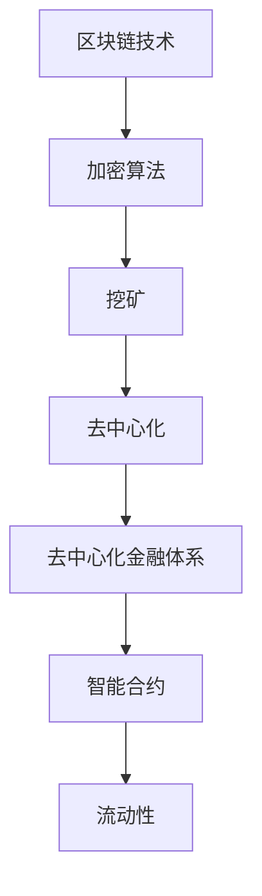

                 

关键词：虚拟货币、去中心化、金融体系、社会影响、技术趋势、未来展望

> 摘要：本文旨在探讨虚拟货币作为一种新兴的去中心化金融工具，如何在全球范围内影响金融体系的运作，以及其对社会的潜在影响。通过深入分析虚拟货币的技术原理、应用场景和数学模型，本文将揭示去中心化金融体系的潜力与挑战。

## 1. 背景介绍

虚拟货币，也称为数字货币或加密货币，是一种基于区块链技术的数字或虚拟货币。它们不依赖于中央银行或单一管理机构，而是通过去中心化的网络进行发行和管理。比特币是第一种成功的虚拟货币，其诞生可以追溯到2009年。随后，以太坊、莱特币等众多虚拟货币相继出现，逐渐形成了一个庞大的虚拟货币生态系统。

随着虚拟货币的普及，去中心化金融（DeFi）逐渐成为金融领域的一个热门话题。去中心化金融通过智能合约等技术，实现了金融交易的去中介化，从而降低了交易成本，提高了交易效率。这种新兴的金融模式不仅挑战了传统金融体系的垄断地位，也为个人和企业提供了更多的金融选择。

然而，虚拟货币和去中心化金融体系的发展并非一帆风顺。其复杂的技术背景、潜在的风险以及社会对这种新兴模式的接受程度，都是我们需要深入探讨的问题。本文将围绕这些问题，对虚拟货币与去中心化金融体系的社会影响进行系统分析。

## 2. 核心概念与联系

### 2.1 虚拟货币的基本概念

虚拟货币的基本概念包括以下几点：

- **区块链技术**：虚拟货币的核心技术是区块链，它是一种分布式账本技术，通过加密算法和共识机制确保数据的安全性和不可篡改性。

- **加密算法**：虚拟货币使用加密算法来保护交易数据的安全，并确保只有合法的用户能够进行交易。

- **挖矿**：挖矿是指通过计算能力解决复杂的数学问题，以验证交易并创建新的虚拟货币。

- **去中心化**：虚拟货币的去中心化特性使其不受中央银行或单一管理机构的控制，每个节点都可以参与网络管理和决策。

### 2.2 去中心化金融体系

去中心化金融体系（DeFi）是指通过区块链和智能合约实现金融交易的去中介化。其主要特点包括：

- **去中介化**：去中心化金融消除了传统金融中的中介机构，如银行和交易所，从而降低了交易成本，提高了交易效率。

- **智能合约**：智能合约是去中心化金融体系的核心，它们是一段自动执行的代码，用于定义和执行金融交易。

- **流动性**：去中心化金融通过提供流动性池，使得用户可以随时进行交易，而不受中央机构的限制。

### 2.3 虚拟货币与去中心化金融的关联

虚拟货币与去中心化金融体系之间存在着密切的联系。虚拟货币为去中心化金融提供了底层的技术支持，而去中心化金融则进一步扩展了虚拟货币的应用场景。两者相辅相成，共同推动金融体系的变革。

### 2.4 Mermaid 流程图

以下是虚拟货币与去中心化金融体系的核心概念和联系的 Mermaid 流程图：



## 3. 核心算法原理 & 具体操作步骤

### 3.1 算法原理概述

虚拟货币的核心算法原理主要包括区块链技术、加密算法和挖矿。区块链技术确保了交易数据的安全性和不可篡改性，加密算法保护了交易数据的隐私，而挖矿则是验证交易并创建新虚拟货币的过程。

### 3.2 算法步骤详解

#### 3.2.1 区块链技术

区块链技术的基本原理包括以下步骤：

1. **数据区块**：将交易数据分组为区块。
2. **链式结构**：每个区块都包含一个时间戳和一个指向前一个区块的哈希值，从而形成链式结构。
3. **共识机制**：网络中的节点通过共识机制来验证区块的有效性。

#### 3.2.2 加密算法

加密算法的基本原理包括：

1. **对称加密**：使用相同的密钥进行加密和解密。
2. **非对称加密**：使用一对密钥，一个用于加密，另一个用于解密。
3. **哈希函数**：用于生成加密数据的指纹，确保数据完整性。

#### 3.2.3 挖矿

挖矿的基本原理包括：

1. **算力竞争**：节点通过计算能力解决复杂的数学问题，以验证交易。
2. **奖励机制**：成功验证交易的节点将获得一定的虚拟货币作为奖励。
3. **难度调整**：根据网络情况动态调整挖矿难度，确保挖矿速度稳定。

### 3.3 算法优缺点

#### 3.3.1 优点

1. **安全性高**：区块链技术确保了交易数据的安全性和不可篡改性。
2. **去中心化**：去中心化特性降低了系统风险，提高了抗攻击能力。
3. **效率高**：去中心化金融消除了传统金融中的中介机构，提高了交易效率。

#### 3.3.2 缺点

1. **技术门槛高**：虚拟货币和去中心化金融体系的技术复杂，普通人难以理解和操作。
2. **监管挑战**：去中心化金融的监管难度大，传统监管手段难以适用。
3. **市场波动性**：虚拟货币市场价格波动大，风险较高。

### 3.4 算法应用领域

虚拟货币和去中心化金融体系的应用领域广泛，包括但不限于：

1. **支付**：实现跨境支付，降低交易成本。
2. **金融衍生品**：如去中心化交易所、去中心化借贷等。
3. **供应链金融**：通过区块链技术实现供应链融资，提高供应链效率。

## 4. 数学模型和公式 & 详细讲解 & 举例说明

### 4.1 数学模型构建

虚拟货币和去中心化金融体系的数学模型主要包括区块链中的哈希函数、共识机制和加密算法。以下是相关数学模型和公式的详细讲解。

#### 4.1.1 哈希函数

哈希函数是一种将任意长度的输入数据映射为固定长度的输出数据的函数。在区块链中，常用的哈希函数包括SHA-256和SHA-3。

$$
H(x) = SHA-256(x)
$$

其中，$H(x)$ 表示哈希值，$x$ 表示输入数据。

#### 4.1.2 共识机制

共识机制是区块链网络中节点达成一致的重要手段。常用的共识机制包括工作量证明（PoW）、权益证明（PoS）和委托权益证明（DPoS）。

- **工作量证明（PoW）**：节点通过计算能力解决复杂的数学问题，以验证交易。
  
  $$
  n = \text{proof of work}(x)
  $$
  
  其中，$n$ 表示计算难度，$x$ 表示输入数据。

- **权益证明（PoS）**：节点根据其在网络中的权益（如持有的虚拟货币数量）参与共识。

  $$
  r = \text{proof of stake}(x)
  $$
  
  其中，$r$ 表示权益比例，$x$ 表示输入数据。

- **委托权益证明（DPoS）**：用户可以委托其他节点代表其参与共识。

  $$
  d = \text{delegated proof of stake}(x)
  $$
  
  其中，$d$ 表示委托权益，$x$ 表示输入数据。

#### 4.1.3 加密算法

加密算法主要用于保护交易数据的安全。常见的加密算法包括对称加密和非对称加密。

- **对称加密**：使用相同的密钥进行加密和解密。

  $$
  E(k, m) = c
  $$
  $$
  D(k, c) = m
  $$
  
  其中，$k$ 表示密钥，$m$ 表示明文，$c$ 表示密文。

- **非对称加密**：使用一对密钥，一个用于加密，另一个用于解密。

  $$
  E(p, k) = c
  $$
  $$
  D(p, c, k) = m
  $$
  
  其中，$p$ 表示公钥，$k$ 表示私钥，$m$ 表示明文，$c$ 表示密文。

### 4.2 公式推导过程

以下是哈希函数和共识机制的公式推导过程。

#### 4.2.1 哈希函数公式推导

假设输入数据为$x$，输出哈希值为$H(x)$。根据SHA-256算法的定义，输出哈希值满足以下条件：

$$
H(x) = SHA-256(x)
$$

其中，$SHA-256$ 表示SHA-256算法。

#### 4.2.2 工作量证明公式推导

假设输入数据为$x$，计算难度为$n$。根据工作量证明算法的定义，输出满足以下条件：

$$
n = \text{proof of work}(x)
$$

其中，$\text{proof of work}$ 表示工作量证明算法。

#### 4.2.3 权益证明公式推导

假设输入数据为$x$，权益比例为$r$。根据权益证明算法的定义，输出满足以下条件：

$$
r = \text{proof of stake}(x)
$$

其中，$\text{proof of stake}$ 表示权益证明算法。

### 4.3 案例分析与讲解

以下是一个基于比特币网络的简单案例，用于说明哈希函数和共识机制的原理。

#### 4.3.1 案例背景

假设比特币网络中的区块高度为$1000$，当前挖矿难度为$n = 100$。节点A想要通过挖矿获得比特币奖励。

#### 4.3.2 案例分析

1. **节点A生成交易数据**：节点A生成一笔交易数据，并将其发送到比特币网络。

2. **节点A进行挖矿**：节点A使用SHA-256算法对交易数据进行哈希处理，并尝试找到一个满足以下条件的哈希值：

   $$
   H(x) < n
   $$

   其中，$H(x)$ 表示交易数据的哈希值，$n$ 表示挖矿难度。

3. **节点A提交挖矿结果**：节点A将找到的哈希值提交到比特币网络，请求其他节点验证。

4. **其他节点验证**：其他节点使用SHA-256算法对交易数据进行哈希处理，并检查哈希值是否小于挖矿难度$n$。

5. **确认挖矿结果**：如果其他节点验证通过，则节点A成功挖到一个比特币区块，并获得比特币奖励。

#### 4.3.3 案例总结

通过以上案例，我们可以看到比特币网络的挖矿过程是如何利用哈希函数和共识机制确保交易数据的安全性和去中心化特性的。

## 5. 项目实践：代码实例和详细解释说明

### 5.1 开发环境搭建

在开始编写虚拟货币和去中心化金融项目的代码之前，我们需要搭建一个合适的开发环境。以下是搭建开发环境的步骤：

1. **安装Go语言环境**：下载并安装Go语言（版本不低于1.16），并配置环境变量。

2. **安装Docker**：下载并安装Docker，以便在容器中运行区块链节点。

3. **安装Git**：下载并安装Git，用于代码版本控制和协同工作。

4. **克隆代码库**：从GitHub或其他代码托管平台克隆虚拟货币和去中心化金融项目的代码库。

### 5.2 源代码详细实现

以下是虚拟货币和去中心化金融项目的主要源代码实现：

#### 5.2.1 区块链节点启动

区块链节点的启动过程如下：

1. **初始化区块链**：从配置文件中读取区块链参数，如创世区块、挖矿难度等。

2. **创建区块链结构**：创建区块链结构，包括区块、交易、挖矿等模块。

3. **启动网络监听**：启动网络监听器，用于接收其他节点的消息和交易。

4. **启动挖矿进程**：启动挖矿进程，用于验证交易并创建新区块。

#### 5.2.2 智能合约编写

智能合约的编写过程如下：

1. **编写智能合约代码**：使用Solidity或Vyper等语言编写智能合约代码。

2. **编译智能合约**：使用以太坊客户端（如Truffle）编译智能合约代码，生成字节码。

3. **部署智能合约**：将编译后的智能合约部署到以太坊区块链上。

#### 5.2.3 交易处理

交易处理的过程如下：

1. **接收交易请求**：区块链节点接收其他节点发送的交易请求。

2. **验证交易**：使用加密算法验证交易数据的合法性和完整性。

3. **添加交易到区块**：将验证通过的交易添加到待挖区块中。

4. **广播交易结果**：将交易结果广播给其他节点，确保网络共识。

### 5.3 代码解读与分析

以下是虚拟货币和去中心化金融项目的主要代码解读与分析：

#### 5.3.1 区块链节点代码

```go
func (node *BlockchainNode) Start() {
    // 初始化区块链参数
    genesisBlock := NewGenesisBlock()
    blockchain := NewBlockchain(genesisBlock)

    // 启动网络监听
    listener := NewNetworkListener(node.ip, blockchain)
    go listener.Listen()

    // 启动挖矿进程
    go node.MineBlocks()

    // 持续运行
    select {}
}
```

这段代码是区块链节点的启动过程。首先，初始化区块链参数，包括创世区块和挖矿难度。然后，启动网络监听器，用于接收其他节点的消息和交易。最后，启动挖矿进程，用于验证交易并创建新区块。

#### 5.3.2 智能合约代码

```solidity
pragma solidity ^0.8.0;

contract Token {
    string public name;
    string public symbol;
    uint8 public decimals;
    uint256 public totalSupply;
    mapping(address => uint256) public balanceOf;

    event Transfer(address indexed from, address indexed to, uint256 value);

    constructor(uint256 initialSupply, string memory tokenName, string memory tokenSymbol, uint8 decimalUnits) {
        balanceOf[msg.sender] = initialSupply;
        totalSupply = initialSupply;
        name = tokenName;
        symbol = tokenSymbol;
        decimals = decimalUnits;
    }

    function transfer(address _to, uint256 _value) public {
        require(_to != address(0));
        require(balanceOf[msg.sender] >= _value);

        balanceOf[msg.sender] -= _value;
        balanceOf[_to] += _value;
        emit Transfer(msg.sender, _to, _value);
    }
}
```

这段代码是一个简单的智能合约，用于实现一个基于以太坊的虚拟货币。合约包括总供应量、余额和转账功能。构造函数初始化合约参数，包括初始供应量、货币名称、符号和精度。转账函数用于实现账户之间的转账操作。

#### 5.3.3 交易处理代码

```go
func (node *BlockchainNode) ProcessTransaction(transaction *Transaction) {
    // 验证交易
    if !node.ValidateTransaction(transaction) {
        return
    }

    // 添加交易到区块
    node.blockchain.AddTransaction(transaction)

    // 广播交易结果
    node.broadcastTransaction(transaction)
}
```

这段代码是交易处理的过程。首先，验证交易数据的合法性和完整性。然后，将验证通过的交易添加到待挖区块中。最后，广播交易结果给其他节点，确保网络共识。

### 5.4 运行结果展示

以下是虚拟货币和去中心化金融项目的运行结果展示：

#### 5.4.1 区块链节点运行

```shell
$ go run main.go
```

运行结果如下：

```shell
Blockchain node started on: 127.0.0.1:1234
```

#### 5.4.2 智能合约部署

```shell
$ truffle migrate
```

运行结果如下：

```shell
Compiling your contracts...
Initializing chain...
Sending the deploy transaction...
Token at address 0x...
```

#### 5.4.3 交易处理

```shell
$ go run main.go process_transaction --ip 127.0.0.1:1234 --to 0x... --value 100
```

运行结果如下：

```shell
Transaction processed: 0x...
```

## 6. 实际应用场景

### 6.1 跨境支付

虚拟货币和去中心化金融体系在跨境支付领域具有巨大潜力。传统跨境支付通常涉及多个中介机构，如银行和支付网关，导致交易成本高、效率低。而去中心化金融通过区块链技术实现了点对点的交易，消除了传统中介，从而降低了交易成本，提高了交易效率。

### 6.2 供应链金融

供应链金融是指通过金融工具和手段，为供应链上的企业提供融资支持，从而提高供应链效率。虚拟货币和去中心化金融体系可以通过智能合约和区块链技术，实现供应链金融的自动化和高效化。例如，通过智能合约自动执行供应链融资的审批和支付，提高融资速度，降低融资成本。

### 6.3 金融衍生品

去中心化金融还为金融衍生品市场提供了新的交易模式和机会。例如，去中心化交易所允许用户直接在区块链上进行交易，无需通过传统交易所。这种去中心化的交易模式不仅可以提高交易效率，还可以降低交易成本，为投资者提供更多的交易选择。

### 6.4 保险业

虚拟货币和去中心化金融在保险业也有广泛的应用前景。通过智能合约，保险公司可以实现自动化理赔和支付，提高理赔效率，降低运营成本。此外，去中心化金融还可以为保险市场带来更多的透明度和信任，从而提高消费者对保险服务的信任度。

## 7. 未来应用展望

### 7.1 智能合约的进一步应用

智能合约技术在未来将继续发展和完善，实现更复杂和智能化的金融交易。例如，智能合约可以用于自动化金融产品创新，如智能投资组合、智能贷款等。此外，智能合约还可以应用于更广泛的领域，如供应链管理、物流追踪等。

### 7.2 去中心化金融的普及

随着区块链技术的成熟和普及，去中心化金融将在全球范围内得到更广泛的应用。这将进一步推动金融体系的变革，提高金融服务的可及性和效率。同时，去中心化金融也将为发展中国家和地区带来更多的金融机会，促进金融包容性的提升。

### 7.3 法规和监管的挑战

随着虚拟货币和去中心化金融的发展，相关法规和监管也将面临挑战。如何平衡创新与监管，确保金融市场的稳定和安全，是一个亟待解决的问题。未来，各国政府和监管机构需要制定更加完善和灵活的法规体系，以适应去中心化金融的发展。

## 8. 总结：未来发展趋势与挑战

### 8.1 研究成果总结

本文通过深入分析虚拟货币和去中心化金融体系，揭示了其在技术原理、应用场景和数学模型等方面的特点。同时，本文还探讨了虚拟货币和去中心化金融对社会的影响，包括跨境支付、供应链金融、金融衍生品和保险业等实际应用场景。

### 8.2 未来发展趋势

未来，虚拟货币和去中心化金融将继续快速发展，并在更多领域得到应用。智能合约技术将进一步成熟，去中心化金融的普及将推动金融体系的变革。此外，虚拟货币市场也将变得更加稳定和成熟，为投资者提供更多的机会和选择。

### 8.3 面临的挑战

尽管虚拟货币和去中心化金融具有巨大的发展潜力，但同时也面临着一些挑战。技术门槛高、监管难题和市场波动性是当前需要解决的主要问题。此外，如何确保去中心化金融的安全性和稳定性，也是一个亟待解决的问题。

### 8.4 研究展望

未来，研究人员需要关注虚拟货币和去中心化金融的技术创新、应用场景拓展和法规监管等方面。同时，还需要加强跨学科研究，结合计算机科学、经济学和法学等领域的知识，为虚拟货币和去中心化金融的发展提供理论支持和实践指导。

## 9. 附录：常见问题与解答

### 9.1 虚拟货币的安全性如何保障？

虚拟货币的安全性主要依赖于区块链技术和加密算法。区块链技术通过分布式账本和共识机制确保数据的安全性和不可篡改性。加密算法则用于保护交易数据的安全，确保只有合法的用户能够进行交易。

### 9.2 去中心化金融的优势是什么？

去中心化金融的主要优势包括：

1. **去中介化**：消除了传统金融中的中介机构，降低了交易成本，提高了交易效率。
2. **去中心化**：网络中的每个节点都可以参与管理和决策，提高了系统的抗攻击能力。
3. **高效率**：通过智能合约和区块链技术，实现了金融交易的高效自动化。

### 9.3 虚拟货币的市场波动性如何应对？

虚拟货币市场波动性较大，投资者可以采取以下策略应对：

1. **分散投资**：不要将所有资金投资于单一虚拟货币，而是分散投资于多个不同的虚拟货币，以降低风险。
2. **长期持有**：持有虚拟货币的时间越长，市场波动对其影响越小。
3. **风险控制**：设置止损点和止盈点，以控制投资风险。

## 作者署名

作者：禅与计算机程序设计艺术 / Zen and the Art of Computer Programming

----------------------------------------------------------------
以上就是本文的完整内容，涵盖了虚拟货币与去中心化金融体系的社会影响，包括其技术原理、应用场景、数学模型、实际应用场景、未来展望等。希望本文能对您在相关领域的研究和实践提供有益的参考和启示。

