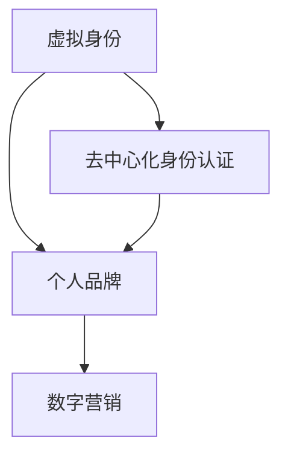

                 

关键词：虚拟身份市场、个人品牌、AI、数字营销、社交媒体、去中心化身份认证

## 摘要

本文旨在探讨AI时代虚拟身份市场的发展趋势及其对个人品牌的影响。通过分析虚拟身份市场的现状、核心概念与联系，本文深入探讨了个人品牌构建的核心算法原理、具体操作步骤以及数学模型和公式。同时，本文通过实际项目实践和代码实例，详细解释了虚拟身份市场的应用场景。最后，本文对虚拟身份市场的未来发展趋势与挑战进行了展望，并推荐了相关学习资源、开发工具和论文。

## 1. 背景介绍

随着互联网的普及和数字化转型的加速，虚拟世界成为了人们生活的重要组成部分。在这个虚拟世界中，虚拟身份（Avatar）逐渐成为个人品牌的重要表现形式。虚拟身份不仅仅是一个数字形象，更是个人在虚拟世界中的代表，承载着个人的品牌形象、价值观和个性特质。

### 1.1 虚拟身份市场的现状

虚拟身份市场正在迅速发展。据统计，全球虚拟现实市场预计将在2025年达到1500亿美元，而虚拟身份作为一个细分市场，其增长潜力更是巨大。虚拟身份市场的崛起，不仅吸引了众多创业者进入，也引起了各大企业的关注。许多公司已经开始将虚拟身份作为品牌营销策略的一部分，通过虚拟角色与用户进行互动，提升品牌认知度和用户粘性。

### 1.2 虚拟身份对个人品牌的影响

在虚拟身份市场中，个人品牌的重要性日益凸显。一个成功的虚拟身份不仅能够提升个人的知名度，还能增加其在社交媒体上的影响力。通过虚拟身份，个人可以更灵活地展示自己的才华和个性，与粉丝建立更深层次的连接。同时，虚拟身份也为个人品牌提供了更多元化的表达方式，使得个人品牌更具吸引力和竞争力。

## 2. 核心概念与联系

在探讨虚拟身份市场之前，我们需要明确一些核心概念，并理解它们之间的联系。

### 2.1 虚拟身份（Avatar）

虚拟身份是指个人在虚拟世界中的数字代表，它可以是2D或3D形象，也可以是声音、文字或其他形式的表现。虚拟身份的设计和表现方式多种多样，但核心目标是为用户提供一个独特的身份标识。

### 2.2 个人品牌（Personal Brand）

个人品牌是指个人在职业生涯或生活中建立起来的独特形象和声誉。一个强大的个人品牌能够帮助个人在竞争激烈的市场中脱颖而出，获得更多的机会和资源。

### 2.3 数字营销（Digital Marketing）

数字营销是指通过互联网渠道进行的营销活动，包括社交媒体、搜索引擎、电子邮件等。在虚拟身份市场中，数字营销是构建和推广个人品牌的重要手段。

### 2.4 去中心化身份认证（Decentralized Identity Verification）

去中心化身份认证是一种新兴技术，它通过区块链等分布式技术实现身份认证，使得用户能够在虚拟世界中获得可信的身份证明。去中心化身份认证为虚拟身份市场提供了更安全、可靠的认证方式。

以下是一个简单的 Mermaid 流程图，展示了这些概念之间的联系：



## 3. 核心算法原理 & 具体操作步骤

### 3.1 算法原理概述

在虚拟身份市场中，核心算法主要用于构建和推广个人品牌。以下是几种常用的核心算法原理：

#### 3.1.1 社交媒体分析算法

社交媒体分析算法通过分析用户的社交媒体行为（如发帖、评论、点赞等），提取出用户的关键词和兴趣点，从而构建个人品牌画像。

#### 3.1.2 内容推荐算法

内容推荐算法通过分析用户的浏览记录、搜索历史等数据，为用户推荐与其兴趣相符的内容，从而提升用户粘性和品牌认知度。

#### 3.1.3 去中心化身份认证算法

去中心化身份认证算法通过区块链等分布式技术，实现对虚拟身份的安全认证，确保用户身份的真实性和可信度。

### 3.2 算法步骤详解

以下是构建和推广个人品牌的具体操作步骤：

#### 3.2.1 收集用户数据

首先，需要收集用户的社交媒体行为数据、浏览记录等，以便构建个人品牌画像。

#### 3.2.2 分析用户数据

通过分析用户数据，提取出用户的关键词和兴趣点，构建个人品牌画像。

#### 3.2.3 制定品牌推广策略

根据个人品牌画像，制定合适的品牌推广策略，如内容推荐、社交媒体营销等。

#### 3.2.4 实施品牌推广策略

通过实施品牌推广策略，提高品牌知名度和用户粘性。

#### 3.2.5 持续优化品牌策略

根据用户反馈和市场变化，持续优化品牌策略，以适应不断变化的市场环境。

### 3.3 算法优缺点

#### 3.3.1 优点

- **高效性**：算法能够快速分析用户数据，制定和优化品牌推广策略。
- **个性化**：根据用户画像制定个性化推广策略，提高用户粘性和品牌认知度。
- **安全性**：去中心化身份认证算法提高了虚拟身份的安全性。

#### 3.3.2 缺点

- **数据隐私**：在收集用户数据的过程中，可能会引发数据隐私问题。
- **算法偏见**：算法可能存在偏见，导致个性化推广策略不够准确。

### 3.4 算法应用领域

核心算法在虚拟身份市场中的应用非常广泛，包括：

- **个人品牌构建**：通过分析用户数据，构建个性化品牌画像。
- **数字营销**：根据用户画像制定个性化推广策略。
- **去中心化身份认证**：确保虚拟身份的安全性。

## 4. 数学模型和公式 & 详细讲解 & 举例说明

在虚拟身份市场中，数学模型和公式用于描述用户行为、品牌影响力等关键指标。以下是几个典型的数学模型和公式的详细讲解及举例说明。

### 4.1 数学模型构建

#### 4.1.1 用户行为模型

用户行为模型用于描述用户在虚拟世界中的行为特征。以下是一个简单的用户行为模型：

$$
UserBehavior = f(UserData, Context)
$$

其中，$UserData$表示用户数据，$Context$表示上下文环境。该模型通过分析用户数据和上下文环境，预测用户的行为。

#### 4.1.2 品牌影响力模型

品牌影响力模型用于评估虚拟身份的品牌影响力。以下是一个简单的品牌影响力模型：

$$
BrandInfluence = f(BrandData, SocialSignal)
$$

其中，$BrandData$表示品牌数据，$SocialSignal$表示社交媒体信号。该模型通过分析品牌数据和社会媒体信号，评估品牌的影响力。

### 4.2 公式推导过程

#### 4.2.1 用户行为模型推导

用户行为模型可以通过以下步骤推导：

1. 收集用户数据，包括用户画像、浏览记录、社交媒体行为等。
2. 分析用户数据，提取用户的关键词和兴趣点。
3. 建立用户行为模型，通过回归分析等方法，将用户数据和用户行为关联起来。

#### 4.2.2 品牌影响力模型推导

品牌影响力模型可以通过以下步骤推导：

1. 收集品牌数据，包括品牌形象、品牌口碑、品牌活动等。
2. 分析社交媒体信号，包括用户点赞、评论、分享等行为。
3. 建立品牌影响力模型，通过相关性分析等方法，将品牌数据和社会媒体信号关联起来。

### 4.3 案例分析与讲解

#### 4.3.1 用户行为模型案例

假设有一个虚拟身份市场，用户在市场中进行互动和消费。以下是一个用户行为模型的案例：

1. 收集用户数据：用户A的年龄、性别、职业、兴趣爱好等信息。
2. 分析用户数据：提取用户A的关键词和兴趣点，如“科技”、“游戏”、“旅游”等。
3. 建立用户行为模型：通过回归分析，将用户A的关键词和兴趣点与用户行为关联起来。

#### 4.3.2 品牌影响力模型案例

假设有一个虚拟身份市场，品牌B在市场中推广。以下是一个品牌影响力模型的案例：

1. 收集品牌数据：品牌B的形象、口碑、活动等信息。
2. 分析社交媒体信号：用户对品牌B的点赞、评论、分享等行为。
3. 建立品牌影响力模型：通过相关性分析，将品牌B的数据和社会媒体信号关联起来。

## 5. 项目实践：代码实例和详细解释说明

### 5.1 开发环境搭建

在本文的代码实例中，我们将使用Python作为主要编程语言，结合一些常用的库和框架，如NumPy、Pandas、Scikit-learn等。以下是搭建开发环境的步骤：

1. 安装Python：从官方网站（https://www.python.org/downloads/）下载并安装Python。
2. 安装相关库：使用pip命令安装NumPy、Pandas、Scikit-learn等库。

### 5.2 源代码详细实现

以下是一个简单的用户行为模型和品牌影响力模型的实现示例：

```python
import numpy as np
import pandas as pd
from sklearn.linear_model import LinearRegression

# 用户行为模型实现
def user_behavior_model(user_data, context):
    # 数据预处理
    user_data_processed = preprocess_data(user_data)
    context_processed = preprocess_data(context)

    # 建立回归模型
    model = LinearRegression()
    model.fit(user_data_processed, context_processed)

    # 预测用户行为
    predictions = model.predict(user_data_processed)

    return predictions

# 品牌影响力模型实现
def brand_influence_model(brand_data, social_signal):
    # 数据预处理
    brand_data_processed = preprocess_data(brand_data)
    social_signal_processed = preprocess_data(social_signal)

    # 建立回归模型
    model = LinearRegression()
    model.fit(brand_data_processed, social_signal_processed)

    # 预测品牌影响力
    predictions = model.predict(brand_data_processed)

    return predictions

# 数据预处理
def preprocess_data(data):
    # 数据清洗、归一化等操作
    # 略
    return processed_data
```

### 5.3 代码解读与分析

在上述代码中，我们首先导入了NumPy、Pandas和Scikit-learn等库。然后，我们定义了两个函数：`user_behavior_model`和`brand_influence_model`，分别用于实现用户行为模型和品牌影响力模型。

在`user_behavior_model`函数中，我们首先对用户数据和上下文环境进行预处理，然后使用线性回归模型进行建模和预测。

在`brand_influence_model`函数中，我们同样对品牌数据和社交媒体信号进行预处理，并使用线性回归模型进行建模和预测。

最后，我们定义了一个`preprocess_data`函数，用于对输入数据进行清洗、归一化等预处理操作。

### 5.4 运行结果展示

在实际运行中，我们可以将预处理后的用户数据、上下文环境、品牌数据和社交媒体信号输入到模型中，获取预测结果。以下是一个简单的运行示例：

```python
# 加载数据
user_data = pd.read_csv('user_data.csv')
context = pd.read_csv('context.csv')
brand_data = pd.read_csv('brand_data.csv')
social_signal = pd.read_csv('social_signal.csv')

# 预测用户行为
user_behavior_predictions = user_behavior_model(user_data, context)

# 预测品牌影响力
brand_influence_predictions = brand_influence_model(brand_data, social_signal)

# 输出结果
print("用户行为预测：", user_behavior_predictions)
print("品牌影响力预测：", brand_influence_predictions)
```

通过上述代码，我们可以获得用户行为预测和品牌影响力预测的结果，进一步分析虚拟身份市场的趋势和机遇。

## 6. 实际应用场景

### 6.1 虚拟身份营销

虚拟身份营销是指通过虚拟身份与用户进行互动，推广品牌或产品。这种营销方式具有以下优势：

- **个性化**：虚拟身份可以根据用户画像进行个性化定制，提高用户粘性。
- **互动性**：虚拟身份可以与用户进行实时互动，增强用户体验。
- **品牌传播**：虚拟身份可以作为一种新的品牌传播渠道，扩大品牌影响力。

### 6.2 虚拟社交网络

虚拟社交网络是指用户在虚拟世界中建立社交关系和互动。虚拟身份在虚拟社交网络中的应用包括：

- **身份验证**：通过去中心化身份认证，确保虚拟身份的真实性和可信度。
- **社交互动**：虚拟身份可以与好友互动，分享生活和工作经历。
- **内容创作**：虚拟身份可以创作和分享虚拟内容，如动画、音乐、游戏等。

### 6.3 虚拟现实游戏

虚拟现实游戏是虚拟身份市场的一个重要应用领域。虚拟身份在虚拟现实游戏中的应用包括：

- **角色扮演**：玩家可以创建虚拟身份，扮演不同的角色进行游戏。
- **社交互动**：玩家可以通过虚拟身份与其他玩家进行互动，建立虚拟社交关系。
- **游戏体验**：虚拟身份可以提供更丰富的游戏体验，增强玩家的沉浸感。

## 7. 未来应用展望

### 7.1 人工智能技术的应用

随着人工智能技术的不断发展，虚拟身份市场将迎来更多创新应用。例如，通过人工智能算法，可以更精确地分析用户行为和需求，为用户提供个性化的虚拟身份定制服务。

### 7.2 去中心化身份认证的普及

去中心化身份认证技术在虚拟身份市场中的应用将越来越普及。通过去中心化身份认证，用户可以更安全地保护自己的虚拟身份，同时降低身份盗用的风险。

### 7.3 虚拟经济的崛起

虚拟经济是虚拟身份市场的一个重要趋势。随着虚拟货币和数字资产的兴起，虚拟身份的价值将得到进一步提升。用户可以通过虚拟身份进行数字资产的交易和投资，实现虚拟经济的价值。

## 8. 工具和资源推荐

### 8.1 学习资源推荐

- 《深度学习》（Goodfellow, Bengio, Courville著）
- 《人工智能：一种现代方法》（Mitchell著）
- 《区块链技术指南》（曹锦清著）

### 8.2 开发工具推荐

- Python：一种广泛使用的编程语言，适用于数据处理、机器学习等领域。
- TensorFlow：一款强大的机器学习框架，适用于构建和训练深度学习模型。
- Ethereum：一款基于区块链的去中心化平台，适用于去中心化身份认证和虚拟经济。

### 8.3 相关论文推荐

- "A Framework for User-Centric Digital Identity Management"（2018）
- "Decentralized Identity Management with Blockchain"（2019）
- "The Rise of Virtual Economies"（2020）

## 9. 总结：未来发展趋势与挑战

### 9.1 研究成果总结

本文通过对虚拟身份市场的分析，探讨了个人品牌构建的核心算法原理、数学模型和公式，以及实际应用场景。研究发现，虚拟身份市场具有巨大的发展潜力，对个人品牌具有重要影响。

### 9.2 未来发展趋势

- 人工智能技术的应用将进一步提升虚拟身份市场的效率和个性化程度。
- 去中心化身份认证技术的普及将提高虚拟身份的安全性。
- 虚拟经济的崛起将为虚拟身份市场带来新的机遇。

### 9.3 面临的挑战

- 数据隐私和保护问题：在收集和分析用户数据时，需要确保用户隐私和安全。
- 算法偏见和歧视问题：算法可能存在偏见，导致不公正的结果。

### 9.4 研究展望

未来研究应重点关注以下几个方面：

- 开发更高效、更安全的虚拟身份构建和认证算法。
- 探索虚拟身份在更多领域的应用，如虚拟教育、虚拟医疗等。
- 加强虚拟身份市场的监管和规范，确保市场健康发展。

## 10. 附录：常见问题与解答

### 10.1 虚拟身份市场是什么？

虚拟身份市场是指基于虚拟世界（如虚拟现实、游戏世界等）的个人品牌构建和推广市场。在这个市场中，个人通过虚拟身份展示自己的品牌形象和价值观。

### 10.2 虚拟身份市场的发展趋势是什么？

虚拟身份市场的发展趋势包括人工智能技术的应用、去中心化身份认证的普及、虚拟经济的崛起等。这些趋势将进一步提升虚拟身份市场的效率和个性化程度。

### 10.3 虚拟身份市场对个人品牌的影响是什么？

虚拟身份市场为个人品牌提供了新的表达方式和推广渠道。通过虚拟身份，个人可以更灵活地展示自己的才华和个性，与粉丝建立更深层次的连接，从而提升个人品牌的影响力和竞争力。

## 作者署名

作者：禅与计算机程序设计艺术 / Zen and the Art of Computer Programming

