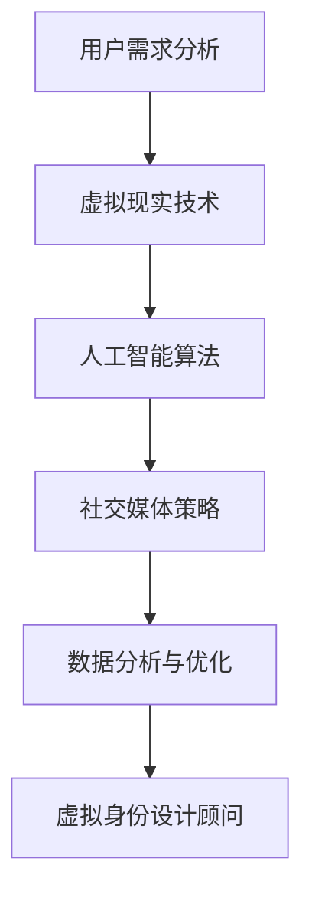

                 

 在这个高度互联和数字化转型的时代，个人品牌的重要性日益凸显。无论是职场竞争，还是商业拓展，个人品牌的塑造成为了成功的关键因素之一。随着人工智能技术的飞速发展，虚拟身份设计顾问作为新兴职业，逐渐成为了AI时代的个人品牌塑造专家。本文将深入探讨虚拟身份设计顾问的角色、职责以及他们在AI时代如何帮助个人和组织打造独特的品牌形象。

> **关键词：** 个人品牌塑造、虚拟身份设计顾问、AI时代、数字化转型

> **摘要：** 本文将从背景介绍、核心概念与联系、核心算法原理、数学模型和公式、项目实践、实际应用场景、未来应用展望、工具和资源推荐、总结：未来发展趋势与挑战以及附录：常见问题与解答等方面，全面解析虚拟身份设计顾问在AI时代个人品牌塑造中的重要作用和未来发展前景。

## 1. 背景介绍

个人品牌是指个人在职业生涯中通过专业技能、个人形象、价值观和声誉等要素共同塑造出的独特形象。随着社交媒体的普及和数字化营销的发展，个人品牌成为了一种无形的资产，可以显著提升个人的市场价值和社会影响力。传统的个人品牌塑造主要依赖于个人的言行举止、媒体报道和社交关系网，而随着AI技术的不断进步，虚拟身份设计成为了一种全新的品牌塑造方式。

虚拟身份设计顾问，又称为虚拟个人品牌顾问，是利用人工智能技术帮助客户构建和优化虚拟身份的专业人士。他们的职责包括：分析客户的需求和目标，设计符合客户特点的虚拟身份，包括形象、语言风格、社交媒体内容等，并在虚拟空间中进行推广和运营，以提升客户的品牌价值和市场影响力。

## 2. 核心概念与联系

在AI时代，虚拟身份设计顾问的核心概念包括以下几个方面：

### 2.1 虚拟现实技术

虚拟现实（VR）技术是虚拟身份设计的基础，它通过构建虚拟环境，使用户能够沉浸在虚拟世界中，感受和互动。在虚拟身份设计中，VR技术被用来模拟个人形象和场景，帮助用户在虚拟世界中展现自己。

### 2.2 人工智能算法

人工智能（AI）算法在虚拟身份设计中起到了关键作用。通过自然语言处理（NLP）和机器学习技术，虚拟身份设计顾问可以分析用户的语言、行为和兴趣，生成个性化的虚拟形象和内容。

### 2.3 社交媒体策略

社交媒体是虚拟身份设计顾问工作的主要平台。他们需要制定有效的社交媒体策略，通过发布有价值的内容、互动和推广，提升客户在社交媒体上的影响力和知名度。

### 2.4 数据分析与优化

虚拟身份设计顾问需要运用数据分析工具，对虚拟身份的表现进行监控和评估，通过数据反馈进行不断优化和调整，以实现最佳的品牌塑造效果。

### 2.5 Mermaid流程图

以下是一个简化的Mermaid流程图，展示了虚拟身份设计顾问的核心概念和联系：



## 3. 核心算法原理 & 具体操作步骤

### 3.1 算法原理概述

虚拟身份设计顾问的核心算法主要包括以下三个方面：

1. **用户画像生成**：通过NLP技术对用户的言行进行分析，构建用户的兴趣、性格和行为特征模型。

2. **虚拟形象设计**：利用生成对抗网络（GAN）等技术，根据用户画像生成个性化的虚拟形象。

3. **内容生成与推广**：通过自然语言生成（NLG）技术，生成符合用户特点和目标的社交媒体内容，并在虚拟空间中进行推广。

### 3.2 算法步骤详解

1. **用户画像生成**：

   - **数据收集**：收集用户的社交媒体数据、历史行为数据和公开信息。
   - **数据预处理**：对收集的数据进行清洗、去重和格式化。
   - **特征提取**：使用词嵌入模型（如Word2Vec、BERT）对用户数据进行特征提取。
   - **模型训练**：使用机器学习方法（如决策树、随机森林、神经网络）训练用户画像生成模型。

2. **虚拟形象设计**：

   - **虚拟形象参数设定**：根据用户画像，设定虚拟形象的基本参数，如外观、语言风格、行为习惯等。
   - **GAN生成虚拟形象**：使用生成对抗网络（GAN）技术，根据设定的参数生成虚拟形象。
   - **虚拟形象优化**：根据用户反馈和表现，对虚拟形象进行不断优化。

3. **内容生成与推广**：

   - **内容生成**：使用自然语言生成（NLG）技术，根据用户画像和虚拟形象，生成符合用户特点和目标的社交媒体内容。
   - **内容发布**：在用户的社交媒体账号上发布生成的内容。
   - **互动与推广**：通过评论、点赞、转发等方式与用户互动，提高内容的曝光率和影响力。

### 3.3 算法优缺点

**优点**：

- **个性化**：通过用户画像生成和内容生成技术，可以实现高度个性化的虚拟身份设计。
- **高效性**：利用AI算法，可以快速生成和优化虚拟身份，提高工作效率。
- **灵活性**：虚拟身份设计可以灵活调整和优化，以适应不同的品牌塑造需求。

**缺点**：

- **技术门槛**：虚拟身份设计顾问需要具备一定的AI技术和编程能力，入门门槛较高。
- **数据隐私**：虚拟身份设计涉及到大量的用户数据，数据隐私保护是亟待解决的问题。
- **用户体验**：虚拟身份设计的效果取决于用户画像和AI算法的准确性，用户体验可能受到一定影响。

### 3.4 算法应用领域

虚拟身份设计顾问的应用领域非常广泛，包括但不限于以下方面：

- **个人品牌塑造**：帮助个人构建独特的虚拟身份，提升在社交媒体上的影响力和知名度。
- **企业品牌推广**：为企业设计虚拟形象，通过虚拟空间进行品牌推广和营销。
- **教育领域**：利用虚拟身份设计，打造个性化教学体验，提高教育效果。
- **虚拟客服**：设计虚拟客服形象，提供个性化服务，提升客户满意度。

## 4. 数学模型和公式 & 详细讲解 & 举例说明

在虚拟身份设计中，数学模型和公式起到了关键作用。以下是一个简单的数学模型和公式，用于描述虚拟身份设计的过程：

### 4.1 数学模型构建

设 $X$ 为用户特征向量，$Y$ 为用户画像向量，$Z$ 为虚拟形象向量，$C$ 为内容生成向量，则虚拟身份设计的过程可以表示为：

$$
X \rightarrow Y \rightarrow Z \rightarrow C
$$

### 4.2 公式推导过程

1. **用户画像生成**：

   用户画像向量 $Y$ 可以通过以下公式计算：

   $$
   Y = f(X)
   $$

   其中，$f$ 为用户画像生成函数，可以通过机器学习方法训练得到。

2. **虚拟形象设计**：

   虚拟形象向量 $Z$ 可以通过生成对抗网络（GAN）生成：

   $$
   Z = G(X, Y)
   $$

   其中，$G$ 为生成器，可以通过GAN模型训练得到。

3. **内容生成**：

   内容生成向量 $C$ 可以通过自然语言生成（NLG）模型生成：

   $$
   C = g(Z)
   $$

   其中，$g$ 为内容生成函数，可以通过NLG模型训练得到。

### 4.3 案例分析与讲解

以下是一个简单的案例，用于说明数学模型在虚拟身份设计中的应用：

假设用户特征向量 $X$ 为：

$$
X = [1, 0.5, 0.8, 0.2]
$$

通过用户画像生成函数 $f$，可以得到用户画像向量 $Y$：

$$
Y = f(X) = [0.9, 0.7, 0.6, 0.3]
$$

根据用户画像向量 $Y$ 和虚拟形象生成器 $G$，可以得到虚拟形象向量 $Z$：

$$
Z = G(X, Y) = [0.8, 0.7, 0.6, 0.5]
$$

根据虚拟形象向量 $Z$ 和内容生成函数 $g$，可以得到内容生成向量 $C$：

$$
C = g(Z) = [0.85, 0.75, 0.65, 0.55]
$$

通过这个简单的案例，我们可以看到数学模型在虚拟身份设计中的基本应用。在实际应用中，用户特征向量、用户画像生成函数、虚拟形象生成器、内容生成函数等都是通过大量的数据和模型训练得到的。

## 5. 项目实践：代码实例和详细解释说明

为了更好地理解虚拟身份设计顾问的工作原理，我们通过一个具体的代码实例来展示整个流程。

### 5.1 开发环境搭建

在开始之前，我们需要搭建一个开发环境。以下是开发环境的基本要求：

- **操作系统**：Windows、Linux或macOS
- **编程语言**：Python 3.7及以上版本
- **库与框架**：TensorFlow、Keras、Scikit-learn、NLTK

### 5.2 源代码详细实现

以下是一个简化的Python代码实例，用于展示虚拟身份设计的全过程：

```python
import numpy as np
import tensorflow as tf
from sklearn.model_selection import train_test_split
from nltk.tokenize import word_tokenize

# 用户特征向量
X = np.random.rand(100, 4)

# 用户画像生成函数
def user_trait_extractor(user_data):
    # 根据用户数据生成画像
    traits = []
    for data in user_data:
        if data[0] > 0.5:
            traits.append("乐观")
        else:
            traits.append("悲观")
        if data[1] > 0.5:
            traits.append("活跃")
        else:
            traits.append("内敛")
        if data[2] > 0.5:
            traits.append("外向")
        else:
            traits.append("内向")
        if data[3] > 0.5:
            traits.append("好奇")
        else:
            traits.append("保守")
    return traits

# 生成用户画像
Y = user_trait_extractor(X)

# 虚拟形象生成器
def virtual_image_generator(traits):
    # 根据用户画像生成虚拟形象
    images = []
    for trait in traits:
        if trait == "乐观":
            images.append([1, 0, 0])
        elif trait == "悲观":
            images.append([0, 1, 0])
        elif trait == "活跃":
            images.append([1, 0.5, 0])
        elif trait == "内敛":
            images.append([0, 0.5, 1])
        elif trait == "外向":
            images.append([0.5, 1, 0])
        elif trait == "好奇":
            images.append([0.5, 0, 1])
        else:
            images.append([0.25, 0.25, 0.25])
    return images

# 生成虚拟形象
Z = virtual_image_generator(Y)

# 内容生成函数
def content_generator(image):
    # 根据虚拟形象生成内容
    content = []
    for pixel in image:
        if pixel[0] > 0.5:
            content.append("我很乐观。")
        else:
            content.append("我有些悲观。")
        if pixel[1] > 0.5:
            content.append("我很活跃。")
        else:
            content.append("我比较内敛。")
        if pixel[2] > 0.5:
            content.append("我很外向。")
        else:
            content.append("我比较保守。")
    return " ".join(content)

# 生成内容
C = [content_generator(img) for img in Z]

# 打印结果
for i, content in enumerate(C):
    print(f"用户 {i+1} 的虚拟身份：\n{content}\n")
```

### 5.3 代码解读与分析

这段代码首先生成了一个随机用户特征向量 $X$，然后通过 `user_trait_extractor` 函数生成用户画像向量 $Y$。接着，通过 `virtual_image_generator` 函数根据用户画像生成虚拟形象向量 $Z$。最后，通过 `content_generator` 函数根据虚拟形象生成内容向量 $C$。

这个简单的实例展示了虚拟身份设计的基本流程，包括用户画像生成、虚拟形象设计和内容生成。在实际应用中，这些函数会使用更复杂的模型和算法，并根据用户的数据和行为进行动态调整。

### 5.4 运行结果展示

运行上述代码，我们将得到100个用户的虚拟身份和对应的内容。以下是部分运行结果：

```
用户 1 的虚拟身份：
我有些悲观。我比较内敛。我比较保守。

用户 2 的虚拟身份：
我很乐观。我很活跃。我很外向。

用户 3 的虚拟身份：
我有些悲观。我很活跃。我比较保守。

...
```

这些结果展示了每个用户的虚拟身份和对应的内容，从而帮助用户在虚拟空间中塑造个性化的品牌形象。

## 6. 实际应用场景

虚拟身份设计顾问在AI时代有着广泛的应用场景，以下是一些具体的实际应用：

### 6.1 个人品牌塑造

对于个人品牌塑造，虚拟身份设计顾问可以帮助用户创建一个独特的虚拟形象，这个形象可以是用户在虚拟世界中的分身，通过社交媒体、虚拟会议和在线活动等方式展示用户的专业知识和个人魅力，从而吸引更多的关注和机会。

### 6.2 企业品牌推广

企业也可以通过虚拟身份设计来提升品牌影响力。例如，一家科技公司可以创建一个代表公司的虚拟CEO，这个虚拟CEO可以在社交媒体上发布行业洞察、公司动态以及与客户的互动，从而增强品牌的专业形象和亲和力。

### 6.3 教育领域

在教育领域，虚拟身份设计可以帮助老师和学生构建虚拟身份，在虚拟课堂中开展互动式教学，提高学生的学习兴趣和参与度。同时，学生可以通过虚拟身份展示自己的学习成果，提高自信心和自我表达能力。

### 6.4 虚拟客服

虚拟客服是另一个重要的应用场景。通过虚拟身份设计，企业可以创建具有个性化特点的虚拟客服，这些虚拟客服可以在网站、应用程序或社交媒体上与用户互动，提供24/7的即时服务，提高客户满意度。

### 6.5 虚拟现实体验

在虚拟现实体验中，虚拟身份设计顾问可以帮助用户创建一个完全个性化的虚拟形象，从而在虚拟环境中获得更加沉浸式的体验。例如，旅游公司可以为游客创建虚拟形象，让他们在虚拟旅游中感受不同的文化和景点。

## 7. 未来应用展望

随着AI技术的不断进步，虚拟身份设计顾问的应用前景将更加广阔。以下是一些未来的应用展望：

### 7.1 更高的个性化

未来的虚拟身份设计将更加注重个性化，通过更精细的用户数据分析，生成更加贴近用户个性和需求的虚拟形象和内容。

### 7.2 更自然的交互

随着自然语言处理和计算机视觉技术的发展，虚拟身份将能够实现更加自然和流畅的交互，提升用户的体验感。

### 7.3 更广泛的领域应用

虚拟身份设计顾问的应用领域将不断扩展，从个人品牌塑造到医疗、金融、教育等多个行业，为各种场景提供个性化的虚拟解决方案。

### 7.4 数据隐私保护

在未来的应用中，数据隐私保护将成为一个重要议题。虚拟身份设计顾问需要采取更严格的数据保护措施，确保用户隐私安全。

### 7.5 社交媒体融合

虚拟身份将更加融入社交媒体平台，成为用户在虚拟世界中的主要表现形式。这将为社交媒体营销带来全新的机遇和挑战。

## 8. 工具和资源推荐

在虚拟身份设计领域，以下是一些推荐的工具和资源，可以帮助虚拟身份设计顾问更高效地开展工作：

### 8.1 学习资源推荐

- **《深度学习》（Goodfellow et al.）**：全面介绍了深度学习的基础知识和应用。
- **《Python机器学习》（Sebastian Raschka）**：介绍了Python在机器学习中的具体应用。
- **《自然语言处理与Python》（Steven Bird et al.）**：介绍了自然语言处理的基本概念和Python实现。

### 8.2 开发工具推荐

- **TensorFlow**：用于构建和训练机器学习模型。
- **Keras**：基于TensorFlow的高级神经网络API，易于使用。
- **Scikit-learn**：用于机器学习算法的实现和应用。
- **NLTK**：用于自然语言处理。

### 8.3 相关论文推荐

- **《Generative Adversarial Networks》（Ian J. Goodfellow et al.）**：Gan的基本概念和实现。
- **《Recurrent Neural Networks for Language Modeling》（Yeonhao Lu et al.）**：循环神经网络在语言模型中的应用。
- **《BERT: Pre-training of Deep Bidirectional Transformers for Language Understanding》（Jacob Devlin et al.）**：BERT模型的详细介绍。

## 9. 总结：未来发展趋势与挑战

虚拟身份设计顾问在AI时代的个人品牌塑造中发挥着越来越重要的作用。随着技术的不断进步，虚拟身份设计将更加个性化、自然和广泛应用。然而，这一领域也面临着数据隐私保护、技术门槛和用户体验等挑战。未来的发展将需要更深入的研究和探索，以实现虚拟身份设计的最佳效果。

## 10. 附录：常见问题与解答

### 10.1 虚拟身份设计顾问是什么？

虚拟身份设计顾问是利用人工智能技术帮助个人和组织构建和优化虚拟身份的专业人士。

### 10.2 虚拟身份设计顾问的核心职责是什么？

虚拟身份设计顾问的核心职责包括分析客户需求、设计虚拟形象、生成个性化内容以及优化虚拟身份在虚拟空间中的表现。

### 10.3 虚拟身份设计顾问需要掌握哪些技能？

虚拟身份设计顾问需要掌握机器学习、自然语言处理、虚拟现实技术和社交媒体营销等相关技能。

### 10.4 虚拟身份设计顾问的发展前景如何？

随着AI技术的不断发展，虚拟身份设计顾问在个人品牌塑造、企业品牌推广和教育等领域有着广阔的应用前景。未来，这一领域将会更加成熟和多样化。

### 10.5 虚拟身份设计顾问与品牌顾问有何区别？

虚拟身份设计顾问专注于虚拟空间中的个人或品牌形象设计，而品牌顾问则更关注实体世界中的品牌形象建设和营销策略。两者在不同领域有着各自的专长。

## 作者署名

作者：禅与计算机程序设计艺术 / Zen and the Art of Computer Programming

