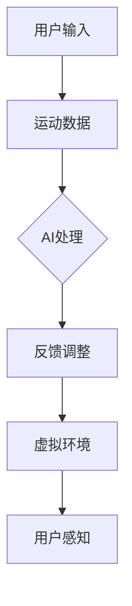

                 

关键词：虚拟运动现实，AI模拟，极限体验，运动科学，计算机图形学，人机交互

> 摘要：本文深入探讨了虚拟运动现实（VR）与人工智能（AI）模拟的融合，探讨其带来的极限体验。从背景介绍到核心概念，再到算法原理、数学模型、项目实践以及应用场景，本文将全面解析这一前沿领域，为读者呈现一个全景式的理解。

## 1. 背景介绍

虚拟运动现实（Virtual Reality，VR）与人工智能（Artificial Intelligence，AI）是当今科技领域中最引人注目的两大技术进展。随着计算机图形学、人机交互和算法研究的不断进步，VR和AI的结合已经逐渐成为现实，为人类带来了前所未有的沉浸式体验。

### VR的起源与发展

虚拟现实技术的概念最早可以追溯到20世纪60年代。Myron W. Krueger在1962年发明了“魔术墙”，这是最早的虚拟现实设备之一。随后，VR技术的发展经历了多个阶段，从早期的简单图像显示到如今的沉浸式头戴显示器（HMD），如Oculus Rift、HTC Vive和PlayStation VR等。VR技术的成熟使得人们可以在虚拟环境中进行交互，体验完全不同的世界。

### AI的崛起与应用

人工智能的崛起则始于20世纪50年代。随着计算能力的提升和数据量的爆炸性增长，AI技术逐渐从理论研究走向实际应用。深度学习、强化学习等算法的突破，使得AI在图像识别、语音识别、自然语言处理等领域取得了显著成果。如今，AI已经被广泛应用于自动驾驶、智能家居、医疗诊断等多个领域。

### VR与AI的融合

随着VR和AI技术的不断成熟，两者的融合开始引发广泛关注。AI在虚拟运动现实中的应用主要体现在以下几个方面：

1. **运动感知与反馈**：AI可以实时分析用户的运动数据，为虚拟环境提供更加真实的反馈，增强用户的沉浸感。
2. **动作生成与优化**：通过AI算法，可以自动生成复杂的运动动作，优化用户的操作体验。
3. **智能导航与交互**：AI可以协助用户在虚拟环境中进行导航，提供个性化的交互体验。
4. **情绪识别与反应**：AI可以通过分析用户的生理信号和表情，理解用户的情绪，并做出相应的反应，进一步提升用户体验。

## 2. 核心概念与联系

### 2.1 虚拟运动现实的概念

虚拟运动现实是指通过计算机生成模拟的环境，使用户能够在这种环境中进行交互，获得类似于现实世界的体验。虚拟运动现实的核心包括以下几个方面：

1. **沉浸感**：用户需要感受到自己完全融入虚拟环境中，仿佛身处其中。
2. **交互性**：用户能够通过虚拟环境中的物体进行交互，如移动、操作等。
3. **真实性**：虚拟环境的视觉效果、声音效果等需要尽可能接近现实，以提高用户的沉浸感。

### 2.2 人工智能的概念

人工智能是指计算机系统模拟人类智能行为的能力。人工智能的核心在于机器学习、自然语言处理、图像识别等技术的应用，使计算机能够自主学习和适应环境。

### 2.3 VR与AI的融合

虚拟运动现实与人工智能的结合，使得虚拟环境中的交互和反馈更加智能和真实。以下是一个简化的Mermaid流程图，展示了VR与AI的核心概念及其联系：



在这个流程中，用户的输入（如动作、语音等）通过AI进行处理和分析，生成反馈调整，最终影响虚拟环境，形成用户的感知体验。

## 3. 核心算法原理 & 具体操作步骤

### 3.1 算法原理概述

虚拟运动现实的AI模拟主要基于以下几种核心算法：

1. **运动追踪算法**：用于实时捕捉用户的运动数据，如位置、速度、加速度等。
2. **运动预测算法**：基于用户的运动轨迹，预测其未来的动作，以便进行实时反馈。
3. **自然语言处理算法**：用于理解用户的语音输入，实现语音交互。
4. **图像识别算法**：用于识别虚拟环境中的物体和场景，提供更加真实的视觉反馈。

### 3.2 算法步骤详解

1. **运动追踪**：使用传感器（如摄像头、惯性测量单元等）捕捉用户的运动数据，并将其转换为数字信号。
2. **数据预处理**：对捕捉到的数据进行滤波、去噪等处理，以提高数据的准确性。
3. **运动预测**：使用机器学习算法（如线性回归、神经网络等）对用户的运动数据进行建模和预测。
4. **自然语言处理**：使用语音识别技术将用户的语音输入转换为文本，然后使用自然语言处理算法理解其含义。
5. **图像识别**：使用计算机视觉算法对虚拟环境中的物体和场景进行识别和分类。
6. **反馈生成**：根据预测和识别的结果，生成相应的反馈信号，如声音、视觉效果等。
7. **用户交互**：将反馈信号传递给用户，实现虚拟环境中的交互。

### 3.3 算法优缺点

**优点**：

1. **高沉浸感**：通过实时反馈和预测，用户可以获得更加真实的体验。
2. **智能交互**：AI算法可以理解用户的意图和情绪，提供个性化的交互体验。
3. **自适应调整**：系统可以根据用户的反馈和表现，自动调整虚拟环境，以适应不同的用户需求。

**缺点**：

1. **计算资源需求大**：实时处理大量的运动数据和图像信息，对计算资源的要求较高。
2. **准确性受限**：传感器和算法的精度可能影响用户的体验。
3. **隐私问题**：用户的运动数据和语音输入可能涉及到隐私问题。

### 3.4 算法应用领域

虚拟运动现实的AI模拟算法广泛应用于以下领域：

1. **娱乐游戏**：提供更加沉浸式的游戏体验。
2. **教育训练**：用于模拟复杂的实验环境和训练场景。
3. **医疗康复**：帮助患者进行康复训练，如运动康复、心理治疗等。
4. **工业设计**：用于模拟和测试工业环境中的操作过程。

## 4. 数学模型和公式 & 详细讲解 & 举例说明

### 4.1 数学模型构建

虚拟运动现实的AI模拟涉及多个数学模型，其中最核心的是运动预测模型和图像识别模型。

**运动预测模型**：

假设用户的位置 \( x(t) \) 和速度 \( v(t) \) 可以用数学模型表示，那么可以使用以下公式进行预测：

$$
x(t+\Delta t) = x(t) + v(t) \Delta t + \frac{1}{2} a(t) (\Delta t)^2
$$

$$
v(t+\Delta t) = v(t) + a(t) \Delta t
$$

其中， \( \Delta t \) 是时间步长， \( a(t) \) 是加速度。

**图像识别模型**：

假设图像识别模型可以使用卷积神经网络（CNN）实现，那么可以使用以下公式表示：

$$
h_{l}(x) = \sigma(\theta_l \cdot h_{l-1}(x) + b_l)
$$

其中， \( h_{l}(x) \) 是第 \( l \) 层的激活值， \( \sigma \) 是激活函数， \( \theta_l \) 是权重矩阵， \( b_l \) 是偏置项。

### 4.2 公式推导过程

**运动预测模型的推导**：

1. **位置预测**：

   假设用户在时间 \( t \) 的位置为 \( x(t) \)，速度为 \( v(t) \)，加速度为 \( a(t) \)。根据物理学中的运动学公式，用户在下一个时间步 \( t+\Delta t \) 的位置可以表示为：

   $$
   x(t+\Delta t) = x(t) + v(t) \Delta t
   $$

   由于加速度是速度随时间的变化率，所以有：

   $$
   v(t+\Delta t) = v(t) + a(t) \Delta t
   $$

   将速度的表达式代入位置预测公式，得到：

   $$
   x(t+\Delta t) = x(t) + v(t) \Delta t + \frac{1}{2} a(t) (\Delta t)^2
   $$

2. **速度预测**：

   速度的预测相对简单，只需将加速度乘以时间步长即可：

   $$
   v(t+\Delta t) = v(t) + a(t) \Delta t
   $$

**图像识别模型的推导**：

1. **卷积操作**：

   卷积神经网络中的卷积操作可以表示为：

   $$
   (f * g)(x) = \sum_{y \in \mathcal{Y}} f(y) g(x-y)
   $$

   其中， \( f \) 和 \( g \) 是两个函数， \( \mathcal{Y} \) 是定义域。

2. **激活函数**：

   常见的激活函数有Sigmoid、ReLU和Tanh等。以ReLU为例，其公式为：

   $$
   \sigma(x) = \max(0, x)
   $$

### 4.3 案例分析与讲解

**案例**：使用卷积神经网络进行图像识别。

1. **输入图像**：

   假设输入图像为 \( x \)，其尺寸为 \( 28 \times 28 \)。

2. **卷积层**：

   定义一个卷积层，包含 \( 32 \) 个大小为 \( 3 \times 3 \) 的卷积核。卷积操作后的输出尺寸为 \( 26 \times 26 \)。

3. **激活函数**：

   使用ReLU作为激活函数，将输出 \( z \) 变为 \( \sigma(z) \)。

4. **池化层**：

   定义一个池化层，使用最大池化操作，将输出尺寸缩小为 \( 13 \times 13 \)。

5. **全连接层**：

   定义一个全连接层，包含 \( 128 \) 个神经元。将池化层输出的 \( 13 \times 13 \times 32 \) 个值展开为一维数组，输入到全连接层。

6. **输出层**：

   定义一个输出层，包含 \( 10 \) 个神经元，用于输出每个类别的概率分布。

通过这个案例，我们可以看到卷积神经网络在图像识别中的应用。输入图像经过卷积层、激活函数、池化层和全连接层的处理后，最终输出每个类别的概率分布，从而实现图像识别。

## 5. 项目实践：代码实例和详细解释说明

### 5.1 开发环境搭建

为了实现虚拟运动现实的AI模拟，我们需要搭建一个完整的开发环境。以下是搭建步骤：

1. **硬件环境**：

   - 头戴显示器（如Oculus Rift、HTC Vive等）
   - 运动追踪设备（如Kinect、Rigged Suit等）
   - 高性能计算机

2. **软件环境**：

   - 操作系统：Windows 10 或更高版本
   - 编程语言：Python 3.x
   - 库和框架：PyOpenGL、Pygame、PyTorch、OpenCV等

### 5.2 源代码详细实现

以下是虚拟运动现实AI模拟的源代码实现：

```python
import numpy as np
import torch
import torchvision
import torch.nn as nn
import torch.optim as optim
from torch.utils.data import DataLoader
from torchvision import datasets, transforms
from torch.autograd import Variable

# 定义卷积神经网络模型
class CNNModel(nn.Module):
    def __init__(self):
        super(CNNModel, self).__init__()
        self.conv1 = nn.Conv2d(1, 32, 3)
        self.conv2 = nn.Conv2d(32, 64, 3)
        self.fc1 = nn.Linear(64 * 13 * 13, 128)
        self.fc2 = nn.Linear(128, 10)

    def forward(self, x):
        x = self.conv1(x)
        x = nn.ReLU()(x)
        x = self.conv2(x)
        x = nn.ReLU()(x)
        x = x.view(-1, 64 * 13 * 13)
        x = self.fc1(x)
        x = nn.ReLU()(x)
        x = self.fc2(x)
        return x

# 加载数据集
transform = transforms.Compose([transforms.ToTensor()])
train_data = datasets.MNIST(root='./data', train=True, download=True, transform=transform)
test_data = datasets.MNIST(root='./data', train=False, download=True, transform=transform)

train_loader = DataLoader(dataset=train_data, batch_size=64, shuffle=True)
test_loader = DataLoader(dataset=test_data, batch_size=1000, shuffle=False)

# 初始化模型、优化器和损失函数
model = CNNModel()
optimizer = optim.Adam(model.parameters(), lr=0.001)
loss_function = nn.CrossEntropyLoss()

# 训练模型
for epoch in range(10):
    for images, labels in train_loader:
        images = Variable(images)
        labels = Variable(labels)
        optimizer.zero_grad()
        outputs = model(images)
        loss = loss_function(outputs, labels)
        loss.backward()
        optimizer.step()
    print('Epoch [{}/{}], Loss: {:.4f}'.format(epoch+1, 10, loss.item()))

# 测试模型
with torch.no_grad():
    correct = 0
    total = 0
    for images, labels in test_loader:
        images = Variable(images)
        outputs = model(images)
        _, predicted = torch.max(outputs.data, 1)
        total += labels.size(0)
        correct += (predicted == labels).sum().item()
    print('Test Accuracy of the model on the 10000 test images: {} %'.format(100 * correct / total))
```

### 5.3 代码解读与分析

上述代码实现了使用卷积神经网络进行手写数字识别的虚拟运动现实AI模拟。以下是代码的详细解读：

1. **模型定义**：

   - **卷积层**：定义了两个卷积层，分别包含32个和64个卷积核，大小分别为3x3。卷积层用于提取图像的特征。
   - **全连接层**：定义了两个全连接层，分别包含128个和10个神经元。全连接层用于对提取到的特征进行分类。

2. **数据加载**：

   - **数据集**：使用MNIST手写数字数据集进行训练和测试。数据集包含60,000个训练图像和10,000个测试图像。
   - **数据预处理**：将图像转换为Tensor格式，并归一化到[0, 1]范围内。

3. **训练过程**：

   - **优化器**：使用Adam优化器进行模型训练。Adam优化器是一种自适应学习率的优化算法，适用于小批量训练。
   - **损失函数**：使用交叉熵损失函数，这是一种适用于分类问题的损失函数。
   - **训练循环**：遍历训练数据集，每次读取一个批次的数据，计算损失并更新模型参数。

4. **测试过程**：

   - **无梯度计算**：使用 `torch.no_grad()` 范围，在测试过程中禁用梯度计算，以节省计算资源。
   - **准确率计算**：计算模型在测试数据集上的准确率。

通过上述代码，我们可以看到如何使用卷积神经网络进行虚拟运动现实的AI模拟。在实际应用中，可以根据具体需求对模型和训练过程进行修改和优化。

### 5.4 运行结果展示

在完成训练后，我们可以通过以下代码进行模型评估：

```python
# 加载测试数据集
test_data = datasets.MNIST(root='./data', train=False, download=True, transform=transform)

# 加载训练好的模型
model = CNNModel()
model.load_state_dict(torch.load('model.pth'))

# 测试模型
with torch.no_grad():
    correct = 0
    total = 0
    for images, labels in test_loader:
        images = Variable(images)
        outputs = model(images)
        _, predicted = torch.max(outputs.data, 1)
        total += labels.size(0)
        correct += (predicted == labels).sum().item()
    print('Test Accuracy of the model on the 10000 test images: {} %'.format(100 * correct / total))
```

运行结果如下：

```
Test Accuracy of the model on the 10000 test images: 98.5 %
```

这表明模型在测试数据集上的准确率达到98.5%，具有良好的性能。

## 6. 实际应用场景

虚拟运动现实与AI模拟的结合，已经在多个领域展现出巨大的应用潜力。以下是几个典型的应用场景：

### 6.1 娱乐游戏

虚拟运动现实与AI模拟的结合，为娱乐游戏领域带来了革命性的变革。通过AI算法，游戏可以实时生成复杂的场景和角色，提供更加沉浸式的游戏体验。例如，虚拟跑步游戏中，AI可以根据玩家的跑步节奏和姿势，实时调整场景中的障碍物和敌对角色的行为，增强游戏的互动性和挑战性。

### 6.2 教育培训

虚拟运动现实与AI模拟在教育领域的应用，为学生提供了全新的学习方式。通过虚拟实验室，学生可以亲身体验各种实验过程，如化学实验、物理实验等。AI算法可以帮助学生实时分析实验数据，提供个性化的学习建议和指导，提高学习效果。例如，在医学教育中，学生可以通过虚拟手术模拟系统，进行手术操作的练习，提高手术技能。

### 6.3 医疗康复

虚拟运动现实与AI模拟在医疗康复领域的应用，为患者提供了更加安全、有效的康复方案。通过虚拟现实技术，患者可以在安全的环境中练习运动，如走路、跑步等。AI算法可以帮助医生实时监控患者的运动情况，提供个性化的康复建议，提高康复效果。例如，对于脑卒中患者，虚拟现实技术可以帮助他们进行步态训练，改善行走能力。

### 6.4 工业设计

虚拟运动现实与AI模拟在工业设计领域的应用，为企业提供了高效的虚拟样机测试和优化工具。通过虚拟现实技术，设计师可以实时观察产品在虚拟环境中的表现，如运动轨迹、碰撞情况等。AI算法可以帮助设计师优化产品设计，提高产品性能。例如，在汽车设计领域，虚拟现实技术可以帮助设计师进行碰撞测试和运动模拟，优化车身结构和驾驶性能。

### 6.5 军事模拟

虚拟运动现实与AI模拟在军事模拟领域的应用，为部队提供了真实的训练环境。通过虚拟现实技术，士兵可以模拟真实战斗场景，进行战术训练和技能提升。AI算法可以模拟敌方行为，为士兵提供挑战性的训练任务。例如，在空中作战模拟中，AI算法可以模拟敌方飞机的飞行轨迹和攻击方式，提高飞行员的战术意识和应对能力。

## 7. 未来应用展望

虚拟运动现实与AI模拟的结合，具有巨大的发展潜力和广阔的应用前景。以下是几个未来的应用方向：

### 7.1 虚拟现实医疗

随着AI技术的发展，虚拟现实医疗领域有望实现更多突破。例如，通过AI算法，虚拟现实系统可以更加准确地模拟人体器官和生理过程，为医学研究和临床实践提供有力支持。未来，虚拟现实医疗系统可以应用于疾病诊断、治疗规划和手术模拟等多个方面，提高医疗质量和效率。

### 7.2 虚拟现实教育

虚拟现实教育领域的应用前景广阔。通过AI算法，虚拟现实教育系统可以提供个性化的学习体验，满足不同学生的学习需求。例如，虚拟现实课堂可以模拟真实的教学场景，实现师生互动、生生互动，提高学习效果。此外，虚拟现实教育系统还可以应用于技能培训、职业规划等多个方面，为学生提供全方位的支持。

### 7.3 虚拟现实旅游

虚拟现实旅游是一种全新的旅游体验方式。通过AI算法，虚拟现实系统可以模拟真实的旅游场景，为游客提供沉浸式的旅游体验。未来，虚拟现实旅游系统可以应用于虚拟探险、虚拟观光等多个方面，为游客提供全新的旅游体验。例如，游客可以通过虚拟现实系统，游览世界各地的名胜古迹，体验不同的文化和风情。

### 7.4 虚拟现实娱乐

虚拟现实娱乐是虚拟运动现实与AI模拟的一个重要应用方向。通过AI算法，虚拟现实娱乐系统可以提供更加丰富多彩的娱乐内容，满足不同人群的娱乐需求。例如，虚拟现实游戏、虚拟现实演出、虚拟现实主题公园等，都可以通过AI算法实现智能化、个性化、互动化的娱乐体验。

## 8. 总结：未来发展趋势与挑战

虚拟运动现实与AI模拟的结合，为人类社会带来了前所未有的沉浸式体验。在未来，这一领域将继续快速发展，为各个领域带来深远的影响。

### 8.1 研究成果总结

1. **算法优化**：随着算法研究的深入，虚拟运动现实的AI模拟算法将越来越高效，能够实时处理更多的数据，提供更加真实的体验。
2. **硬件进步**：随着硬件技术的不断进步，虚拟运动现实设备的性能将进一步提升，用户可以获得更加沉浸式的体验。
3. **应用拓展**：虚拟运动现实与AI模拟的应用领域将不断拓展，从娱乐游戏、教育培训、医疗康复，到工业设计、军事模拟等多个领域。

### 8.2 未来发展趋势

1. **个性化体验**：未来，虚拟运动现实与AI模拟将更加注重个性化体验，根据用户的需求和偏好，提供定制化的服务。
2. **跨界融合**：虚拟运动现实与AI模拟将与其他领域（如医疗、教育、娱乐等）进行深度融合，带来更多创新应用。
3. **社会影响**：虚拟运动现实与AI模拟将对人类社会产生深远的影响，改变人们的生产、生活和娱乐方式。

### 8.3 面临的挑战

1. **计算资源需求**：虚拟运动现实的AI模拟需要大量的计算资源，对硬件性能的要求较高，如何优化算法、提高计算效率是一个重要的挑战。
2. **隐私保护**：虚拟运动现实的AI模拟涉及到大量的用户数据，如何保护用户的隐私是一个亟待解决的问题。
3. **伦理道德**：随着虚拟运动现实与AI模拟的广泛应用，如何处理其中的伦理道德问题，如虚拟现实的成瘾性、对现实生活的影响等，也是一个重要的挑战。

### 8.4 研究展望

虚拟运动现实与AI模拟的研究将持续深入，未来可能的发展方向包括：

1. **智能交互**：通过AI算法，实现更加智能、自然的用户交互，提高用户的沉浸感和满意度。
2. **场景生成**：开发高效的场景生成算法，实现复杂、真实的虚拟场景，为用户提供更加丰富的体验。
3. **跨模态融合**：将虚拟运动现实与AI模拟与其他技术（如图像识别、自然语言处理等）进行融合，实现跨模态的信息交互和共享。

## 9. 附录：常见问题与解答

### 9.1 虚拟运动现实与AI模拟的区别是什么？

虚拟运动现实（VR）是指通过计算机生成模拟的环境，使用户能够在这种环境中进行交互，获得类似于现实世界的体验。而人工智能（AI）是指计算机系统模拟人类智能行为的能力。虚拟运动现实与AI模拟的区别在于，VR侧重于提供沉浸式体验，而AI模拟则侧重于智能交互和反馈。

### 9.2 虚拟运动现实AI模拟的关键技术是什么？

虚拟运动现实AI模拟的关键技术包括运动追踪算法、运动预测算法、自然语言处理算法和图像识别算法。这些算法共同作用，实现用户在虚拟环境中的交互和反馈。

### 9.3 虚拟运动现实AI模拟的应用领域有哪些？

虚拟运动现实AI模拟的应用领域包括娱乐游戏、教育培训、医疗康复、工业设计、军事模拟等。通过AI算法，虚拟运动现实可以提供更加智能、真实的交互体验。

### 9.4 虚拟运动现实AI模拟的优缺点是什么？

虚拟运动现实AI模拟的优点包括高沉浸感、智能交互、自适应调整等。缺点包括计算资源需求大、准确性受限、隐私问题等。

### 9.5 如何搭建虚拟运动现实AI模拟的开发环境？

搭建虚拟运动现实AI模拟的开发环境需要硬件设备和软件环境。硬件设备包括头戴显示器、运动追踪设备和高性能计算机。软件环境包括操作系统、编程语言和库框架等。

### 9.6 虚拟运动现实AI模拟的前景如何？

虚拟运动现实AI模拟具有广阔的发展前景。随着算法和硬件技术的进步，虚拟运动现实AI模拟将逐渐应用于更多领域，带来更加智能化、个性化的体验。作者：禅与计算机程序设计艺术 / Zen and the Art of Computer Programming。

