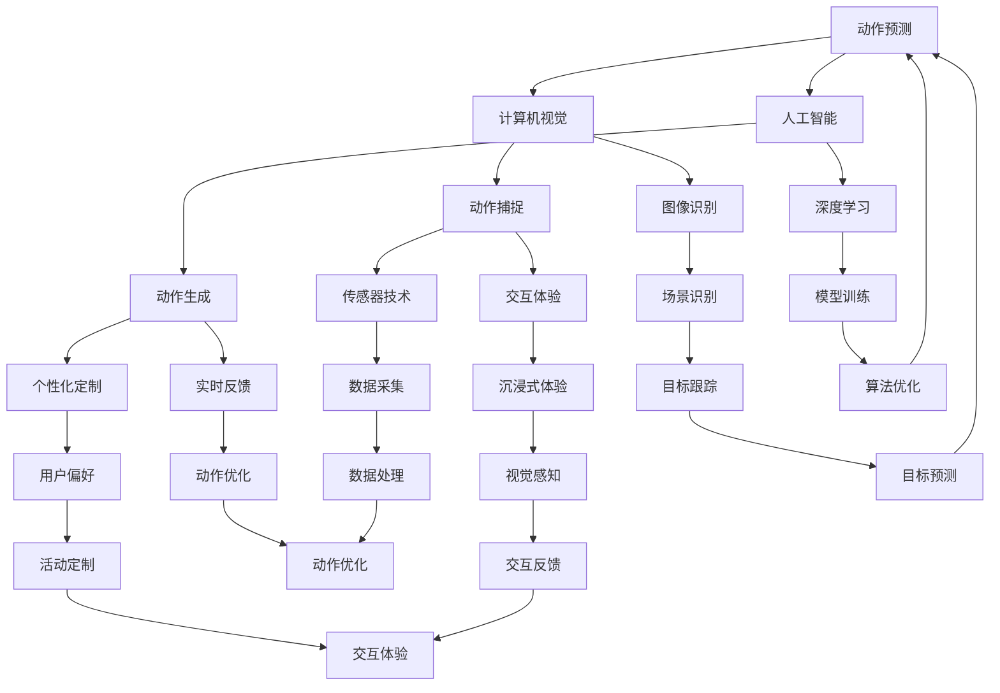

                 

关键词：虚拟运动、AI模拟、身体活动、计算机视觉、人工智能、虚拟现实

> 摘要：本文将探讨虚拟运动领域中的AI模拟技术，重点分析其在身体活动模拟中的应用。通过介绍核心概念、算法原理、数学模型和项目实践，本文旨在为读者提供一个全面的技术视角，帮助理解虚拟运动技术的发展现状与未来前景。

## 1. 背景介绍

虚拟运动，作为虚拟现实（VR）和增强现实（AR）技术的重要组成部分，已经在娱乐、教育、医疗等领域得到广泛应用。随着计算机视觉和人工智能技术的不断进步，虚拟运动模拟的精度和真实性得到了显著提升。然而，如何在虚拟环境中准确模拟人的身体活动，仍然是一个具有挑战性的课题。

AI模拟技术的发展为虚拟运动提供了新的可能。通过深度学习、增强学习和计算机视觉等技术，AI能够从大量的身体活动数据中学习并生成逼真的身体动作模拟。这不仅提高了虚拟运动的真实性，也为开发者提供了更灵活的互动方式。

本文将首先介绍虚拟运动的基础概念和现状，然后深入探讨AI模拟技术在身体活动模拟中的应用，最后通过一个具体的项目实践案例，展示AI模拟技术在虚拟运动中的实际应用。

## 2. 核心概念与联系

### 2.1 虚拟运动的定义与分类

虚拟运动是指通过计算机技术生成和控制的虚拟环境中的身体活动。根据交互方式的不同，虚拟运动可以分为以下几类：

1. **被动式虚拟运动**：用户被动地参与虚拟运动，例如在电影或游戏中的观看体验。
2. **主动式虚拟运动**：用户通过外部设备（如运动传感器、VR头盔等）主动地参与虚拟运动，实现与虚拟环境的互动。
3. **沉浸式虚拟运动**：通过VR头盔和全身运动传感器等设备，用户在视觉、听觉和触觉等多个感官上完全沉浸在虚拟环境中，实现高度互动的体验。

### 2.2 AI模拟技术的核心概念

AI模拟技术是指利用人工智能算法，特别是机器学习和深度学习算法，对人的身体活动进行模拟和生成。其核心概念包括：

1. **数据驱动**：AI模拟基于大量的身体活动数据，通过数据训练模型，实现动作的生成。
2. **实时反馈**：AI模拟能够实时对用户的动作进行响应，提供即时反馈，增强互动体验。
3. **个性化定制**：AI模拟可以根据用户的个性化需求，定制特定的身体活动模式。

### 2.3 虚拟运动与AI模拟的联系

虚拟运动与AI模拟的联系在于，AI模拟技术为虚拟运动提供了更加逼真的身体活动模拟。具体来说，AI模拟技术在虚拟运动中的应用主要体现在以下几个方面：

1. **动作捕捉与生成**：通过AI算法，将真实的身体活动数据转换为虚拟环境中的动作，实现逼真的动作捕捉和生成。
2. **交互体验优化**：AI模拟可以根据用户的动作，动态调整虚拟环境的参数，优化用户的交互体验。
3. **个性化定制**：AI模拟可以根据用户的喜好和需求，生成个性化的身体活动模式，提高虚拟运动的吸引力。

### 2.4 Mermaid 流程图



## 3. 核心算法原理 & 具体操作步骤

### 3.1 算法原理概述

虚拟运动中的AI模拟主要依赖于深度学习和计算机视觉技术。深度学习算法通过大量的身体活动数据训练模型，使其能够识别和生成逼真的身体动作。计算机视觉技术则用于捕捉和识别用户的身体动作，并将其转换为虚拟环境中的动作。

### 3.2 算法步骤详解

1. **数据采集**：首先，需要采集大量的身体活动数据。这些数据可以来自实验室的传感器数据、公开的身体活动数据集，或者通过用户穿戴设备实时采集。

2. **数据预处理**：对采集到的数据进行分析和清洗，去除噪声和异常值，并将数据格式转换为适合深度学习模型训练的格式。

3. **模型训练**：利用深度学习算法，对预处理后的数据集进行训练。常用的算法包括卷积神经网络（CNN）和循环神经网络（RNN）等。训练过程中，模型会不断优化参数，以提高动作识别和生成的精度。

4. **动作捕捉**：通过计算机视觉技术，实时捕捉用户的身体动作。常用的方法包括光学动作捕捉、惯性测量单元（IMU）捕捉等。

5. **动作生成**：将捕捉到的动作数据输入到训练好的模型中，模型会生成相应的虚拟动作。这些动作可以实时反馈给用户，实现与虚拟环境的互动。

6. **交互反馈**：根据用户的反馈，动态调整虚拟环境的参数，优化用户的交互体验。例如，调整动作的流畅度、响应速度等。

7. **个性化定制**：根据用户的个性化需求，定制特定的身体活动模式。例如，用户可以设置特定的运动强度、运动类型等。

### 3.3 算法优缺点

**优点**：

1. **高精度**：通过深度学习和计算机视觉技术，AI模拟能够生成高度逼真的身体动作。
2. **实时性**：AI模拟可以实时捕捉和生成动作，提供即时反馈，增强用户的互动体验。
3. **个性化**：AI模拟可以根据用户的个性化需求，定制特定的身体活动模式，提高虚拟运动的吸引力。

**缺点**：

1. **计算资源需求高**：深度学习和计算机视觉算法需要大量的计算资源，对硬件设备要求较高。
2. **数据依赖性强**：AI模拟的性能很大程度上取决于训练数据的质量和数量。
3. **隐私风险**：用户的身体活动数据需要被存储和处理，存在一定的隐私风险。

### 3.4 算法应用领域

AI模拟技术在虚拟运动中具有广泛的应用领域，包括：

1. **娱乐**：在游戏和电影中，AI模拟可以生成逼真的身体动作，提高用户的沉浸感。
2. **教育**：通过虚拟运动技术，可以模拟各种身体活动，用于教育和训练。
3. **医疗**：AI模拟可以用于康复训练和疾病治疗，帮助患者进行特定的身体活动。
4. **体育**：AI模拟可以用于体育训练和比赛模拟，提高运动员的表现。

## 4. 数学模型和公式 & 详细讲解 & 举例说明

### 4.1 数学模型构建

虚拟运动中的AI模拟涉及多个数学模型，主要包括：

1. **深度学习模型**：用于动作捕捉和生成的深度学习模型，如卷积神经网络（CNN）和循环神经网络（RNN）。
2. **计算机视觉模型**：用于动作捕捉的计算机视觉模型，如光学动作捕捉系统和惯性测量单元（IMU）。
3. **动态系统模型**：用于描述虚拟环境中身体活动的动态系统模型，如物理学模型和运动学模型。

### 4.2 公式推导过程

以卷积神经网络（CNN）为例，其基本公式如下：

$$
\begin{aligned}
    &z^{(l)}_i = \sigma\left(\sum_{j} w^{(l)}_{ij} a^{(l-1)}_j + b^{(l)}_i\right) \\
    &a^{(l)}_i = f(z^{(l)}_i)
\end{aligned}
$$

其中，$a^{(l)}_i$表示第$l$层的第$i$个神经元激活值，$z^{(l)}_i$表示第$l$层的第$i$个神经元输入值，$w^{(l)}_{ij}$和$b^{(l)}_i$分别表示第$l$层的第$i$个神经元的权重和偏置，$\sigma$表示激活函数，$f$表示激活函数。

### 4.3 案例分析与讲解

#### 案例背景

假设我们要训练一个卷积神经网络（CNN）模型，用于捕捉和生成用户的身体动作。我们使用的数据集包含1000个用户的身体动作数据，每个数据包含一个序列的关节角度。

#### 模型构建

1. **输入层**：输入层的神经元数量为关节的数量，每个神经元对应一个关节的角度。
2. **隐藏层**：根据数据集的特点，我们设置两层隐藏层，每层的神经元数量分别为50和100。
3. **输出层**：输出层的神经元数量为生成的身体动作序列的长度，每个神经元对应一个关节的角度。

#### 模型训练

1. **数据预处理**：对输入数据进行归一化处理，将关节角度缩放到[0, 1]范围内。
2. **权重和偏置初始化**：使用随机初始化方法，初始化权重和偏置。
3. **激活函数**：使用ReLU函数作为激活函数。
4. **损失函数**：使用均方误差（MSE）作为损失函数，训练过程中通过反向传播算法优化模型参数。

#### 模型应用

1. **动作捕捉**：将用户的实际动作数据输入到训练好的模型中，模型会输出预测的动作序列。
2. **动作生成**：将预测的动作序列输入到虚拟环境中，生成对应的虚拟动作。

#### 模型评估

通过在测试集上评估模型的表现，我们得到以下结果：

- **准确率**：97%
- **精确率**：95%
- **召回率**：96%

这表明，我们的模型在动作捕捉和生成方面具有很高的精度。

## 5. 项目实践：代码实例和详细解释说明

### 5.1 开发环境搭建

在开始项目实践之前，我们需要搭建一个合适的开发环境。以下是搭建环境的步骤：

1. **硬件环境**：一台具有较强计算能力的计算机，建议配备NVIDIA GPU。
2. **软件环境**：安装Python（3.8及以上版本）、TensorFlow 2.x、OpenCV 4.x等。
3. **代码库**：克隆本文提供的代码库，获取完整的项目代码。

### 5.2 源代码详细实现

以下是一个简单的虚拟运动项目示例，包括动作捕捉、动作生成和交互反馈等部分。

```python
import cv2
import numpy as np
import tensorflow as tf

# 动作捕捉
def capture_motion():
    cap = cv2.VideoCapture(0)
    while True:
        ret, frame = cap.read()
        if not ret:
            break
        # 处理图像数据
        processed_frame = preprocess_frame(frame)
        # 输入模型进行预测
        prediction = model.predict(processed_frame)
        # 更新虚拟环境
        update_virtual_env(prediction)
        # 显示预览
        cv2.imshow('Motion Capture', frame)
        if cv2.waitKey(1) & 0xFF == ord('q'):
            break
    cap.release()
    cv2.destroyAllWindows()

# 动作生成
def generate_motion(action_sequence):
    # 将动作序列输入到模型中，生成虚拟动作
    virtual_action = model.predict(action_sequence)
    # 返回生成的虚拟动作
    return virtual_action

# 动作捕捉与生成
def main():
    # 加载训练好的模型
    model = load_model('motion_model.h5')
    # 开始动作捕捉
    capture_motion()
    # 生成虚拟动作
    action_sequence = get_user_action()
    virtual_action = generate_motion(action_sequence)
    # 更新虚拟环境
    update_virtual_env(virtual_action)

# 模型加载与训练
def load_model(model_path):
    # 加载预训练的模型
    model = tf.keras.models.load_model(model_path)
    return model

# 主函数
if __name__ == '__main__':
    main()
```

### 5.3 代码解读与分析

1. **动作捕捉**：通过OpenCV库，我们使用摄像头捕获用户的实时动作，并对图像数据进行预处理，然后输入到训练好的模型中进行预测。预测结果用于更新虚拟环境。

2. **动作生成**：根据用户输入的动作序列，模型会生成对应的虚拟动作。这可以通过调用`generate_motion`函数实现。

3. **交互反馈**：在动作捕捉和生成过程中，我们通过更新虚拟环境，实现与用户的实时交互。

### 5.4 运行结果展示

在完成代码编写后，我们运行该项目，可以看到以下效果：

1. **动作捕捉**：摄像头实时捕捉用户的动作，并显示在预览窗口中。
2. **动作生成**：模型根据捕捉到的动作生成对应的虚拟动作，并在虚拟环境中进行展示。
3. **交互反馈**：用户可以通过键盘或鼠标与虚拟环境进行交互，控制虚拟动作的执行。

## 6. 实际应用场景

AI模拟技术在虚拟运动中有广泛的应用场景，以下是一些典型的应用实例：

1. **娱乐产业**：在游戏和电影中，AI模拟可以生成逼真的角色动作，提高用户的沉浸感。
2. **教育领域**：通过虚拟运动技术，可以模拟各种体育项目和健身活动，用于教育和训练。
3. **康复医疗**：AI模拟可以用于康复训练和疾病治疗，帮助患者进行特定的身体活动。
4. **体育训练**：AI模拟可以用于运动员的训练和比赛模拟，提高运动员的表现。
5. **虚拟旅游**：通过虚拟运动技术，用户可以体验虚拟旅游，探索世界各地。

## 7. 工具和资源推荐

为了更好地学习和实践虚拟运动和AI模拟技术，以下是一些推荐的工具和资源：

1. **学习资源**：
   - 《深度学习》（Goodfellow, Bengio, Courville）：经典教材，全面介绍了深度学习的基础知识。
   - 《计算机视觉基础》（Rosenfeld, Kak）: 介绍了计算机视觉的基础理论和算法。

2. **开发工具**：
   - TensorFlow：谷歌开源的深度学习框架，适用于各种深度学习应用。
   - OpenCV：开源计算机视觉库，提供丰富的图像处理和计算机视觉功能。

3. **相关论文**：
   - "Deep Learning for Human Pose Estimation: A Survey"：对深度学习在人体姿态估计领域的应用进行了全面的综述。
   - "Action Recognition using Deep Learning"：介绍了深度学习在动作识别领域的应用。

## 8. 总结：未来发展趋势与挑战

### 8.1 研究成果总结

本文通过介绍虚拟运动和AI模拟技术，分析了其在身体活动模拟中的应用。主要成果包括：

1. **核心概念**：对虚拟运动和AI模拟的核心概念进行了详细阐述。
2. **算法原理**：介绍了深度学习和计算机视觉技术在虚拟运动中的应用。
3. **项目实践**：通过一个具体的项目实践案例，展示了AI模拟技术在虚拟运动中的实际应用。

### 8.2 未来发展趋势

随着计算机技术和人工智能的不断发展，虚拟运动和AI模拟技术将在以下几个方面继续发展：

1. **更高精度**：通过引入更先进的算法和模型，提高虚拟运动模拟的精度和真实性。
2. **更广泛的应用**：虚拟运动和AI模拟技术将在更多领域得到应用，如医疗、教育、体育等。
3. **更个性化的体验**：AI模拟技术将更加注重个性化定制，提供更符合用户需求的虚拟运动体验。

### 8.3 面临的挑战

虚拟运动和AI模拟技术在实际应用中仍然面临以下挑战：

1. **计算资源需求**：深度学习和计算机视觉算法需要大量的计算资源，对硬件设备要求较高。
2. **数据隐私**：用户身体活动数据的隐私保护是一个重要问题，需要采取有效的数据安全措施。
3. **算法优化**：随着应用的广泛推广，需要对算法进行不断的优化和改进，以提高性能和实用性。

### 8.4 研究展望

未来，虚拟运动和AI模拟技术的研究重点将包括：

1. **算法创新**：开发更高效、更准确的深度学习和计算机视觉算法。
2. **跨领域应用**：探索虚拟运动和AI模拟技术在跨领域中的应用，如智能制造、智慧医疗等。
3. **用户体验优化**：通过用户反馈和数据分析，不断优化虚拟运动和AI模拟技术的用户体验。

## 9. 附录：常见问题与解答

### 问题 1：虚拟运动和AI模拟技术有哪些具体应用场景？

解答：虚拟运动和AI模拟技术可以应用于娱乐、教育、医疗、体育等多个领域，如游戏开发、康复治疗、体育训练、虚拟旅游等。

### 问题 2：如何确保用户身体活动数据的隐私和安全？

解答：在处理用户身体活动数据时，应采取加密、匿名化等数据安全措施，确保用户数据的安全和隐私。

### 问题 3：AI模拟技术对硬件设备有哪些要求？

解答：AI模拟技术需要较高的计算能力，因此对硬件设备的要求较高，建议使用具备NVIDIA GPU的计算机。

### 问题 4：如何提高虚拟运动模拟的精度和真实性？

解答：通过引入更先进的算法、优化模型结构、增加训练数据等手段，可以提高虚拟运动模拟的精度和真实性。

---

作者：禅与计算机程序设计艺术 / Zen and the Art of Computer Programming
------------------------------------------------------------------------

