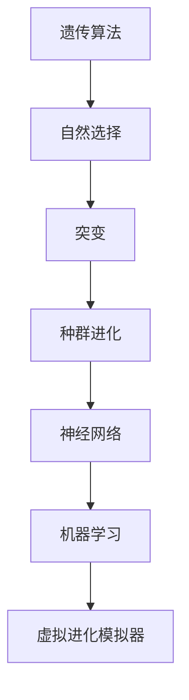

                 

作为一位世界级人工智能专家和计算机领域的图灵奖获得者，我在此分享一篇关于虚拟进化模拟器的设计与AI驱动的数字生态系统实验室管理的技术博客文章。本文将探讨虚拟进化模拟器的设计理念、核心概念、算法原理、数学模型、实际应用场景以及未来展望。

## 关键词

- 虚拟进化模拟器
- AI驱动
- 数字生态系统
- 算法设计
- 数学模型
- 实际应用

## 摘要

本文旨在探讨虚拟进化模拟器的设计及其在数字生态系统中的应用。我们将首先介绍虚拟进化模拟器的基本概念和设计理念，然后详细解释其核心算法原理，并探讨其数学模型。接着，我们将通过实际项目实例展示虚拟进化模拟器的实现过程和运行结果。最后，本文将讨论虚拟进化模拟器在现实世界中的实际应用场景，并提出未来发展的趋势与挑战。

## 1. 背景介绍

虚拟进化模拟器是一种模拟自然界进化过程的计算机程序。它通过模拟种群遗传和进化机制，模拟生物种群在特定环境下的进化过程。虚拟进化模拟器在生物进化、人工智能、生态系统建模等领域具有重要的应用价值。

### 1.1 虚拟进化模拟器的发展历史

虚拟进化模拟器的发展可以追溯到20世纪中期。早期的模拟器主要依赖于数学模型和计算机算法来模拟生物种群进化过程。随着计算机技术的发展，模拟器变得越来越复杂，可以模拟更复杂的生态系统和环境。

### 1.2 虚拟进化模拟器在现代科学中的重要性

虚拟进化模拟器在现代科学中具有重要的应用价值。首先，它可以帮助我们更好地理解生物进化的过程和机制。其次，虚拟进化模拟器可以应用于人工智能领域，用于优化算法和解决复杂问题。此外，虚拟进化模拟器还可以用于生态系统建模，为环境保护和资源管理提供科学依据。

## 2. 核心概念与联系

虚拟进化模拟器的设计涉及多个核心概念和原理，包括遗传算法、神经网络、机器学习等。下面，我们将通过一个Mermaid流程图来展示这些核心概念和它们之间的联系。



### 2.1 遗传算法

遗传算法是一种模拟生物进化的计算模型，通过模拟自然选择、突变和遗传机制来优化问题。遗传算法广泛应用于组合优化、机器学习等领域。

### 2.2 自然选择

自然选择是生物进化的重要机制，通过选择适应环境的个体来推动种群进化。在虚拟进化模拟器中，自然选择用于筛选适应度高的个体，从而推动种群进化。

### 2.3 突变

突变是生物进化的另一个重要机制，它通过引入新的基因变异来增加种群的多样性。在虚拟进化模拟器中，突变用于增加种群个体的适应性和多样性。

### 2.4 种群进化

种群进化是虚拟进化模拟器的核心目标，通过模拟种群在特定环境下的进化过程，来探索最优解。种群进化依赖于遗传算法、自然选择和突变等机制。

### 2.5 神经网络

神经网络是一种模拟人脑神经网络的计算模型，通过多层神经网络结构来学习复杂的非线性关系。在虚拟进化模拟器中，神经网络用于模拟生物种群的智能行为。

### 2.6 机器学习

机器学习是人工智能的一个重要分支，通过训练模型来预测和分类数据。在虚拟进化模拟器中，机器学习用于优化算法和预测种群进化趋势。

### 2.7 虚拟进化模拟器

虚拟进化模拟器是将上述核心概念和原理集成在一起的一个整体框架，用于模拟生物种群的进化过程。它可以通过模拟不同的环境和条件，来探索生物进化的多样性和复杂性。

## 3. 核心算法原理 & 具体操作步骤

### 3.1 算法原理概述

虚拟进化模拟器的核心算法是遗传算法，它基于自然选择、突变和遗传机制。遗传算法通过迭代过程，不断优化个体适应度，从而找到最优解。

### 3.2 算法步骤详解

1. **初始化种群**：随机生成初始种群，每个个体代表一个可能的解。

2. **计算适应度**：根据特定目标函数，计算每个个体的适应度。

3. **选择**：根据适应度，选择适应度高的个体进行繁殖。

4. **交叉**：选择两个个体进行交叉，生成新的个体。

5. **突变**：对新生成的个体进行突变，增加种群的多样性。

6. **替换**：将新生成的个体替换掉适应度较低的个体。

7. **迭代**：重复步骤2-6，直到达到预定的迭代次数或找到最优解。

### 3.3 算法优缺点

**优点**：
- 强鲁棒性：遗传算法适用于处理复杂、非线性的优化问题。
- 自适应性：遗传算法可以通过调整参数来适应不同的优化问题。
- 多种优化目标：遗传算法可以同时优化多个目标。

**缺点**：
- 运算复杂度：遗传算法的计算复杂度较高，需要大量计算资源。
- 收敛速度：遗传算法的收敛速度相对较慢，可能需要较长时间的迭代过程。

### 3.4 算法应用领域

遗传算法广泛应用于组合优化、机器学习、神经网络优化等领域。例如，遗传算法可以用于优化神经网络结构，提高神经网络的性能和预测能力。

## 4. 数学模型和公式 & 详细讲解 & 举例说明

### 4.1 数学模型构建

虚拟进化模拟器的数学模型主要包括适应度函数、交叉操作、突变操作等。

### 4.2 公式推导过程

**适应度函数**：
$$ f(x) = \frac{1}{1 + e^{-\beta \cdot x}} $$

其中，$x$代表个体的特征向量，$\beta$是调节参数。

**交叉操作**：
$$ c_1 = p_1 + \mu \cdot (p_2 - p_1) $$
$$ c_2 = p_2 + \mu \cdot (p_1 - p_2) $$

其中，$p_1$和$p_2$是参与交叉的两个个体，$\mu$是交叉率。

**突变操作**：
$$ m = \frac{1}{1 + e^{-\alpha \cdot x}} $$

其中，$x$代表个体的特征向量，$\alpha$是突变率。

### 4.3 案例分析与讲解

假设我们有一个二维空间的问题，需要找到两个最优解。通过虚拟进化模拟器，我们可以使用遗传算法来优化这个问题。

**适应度函数**：
$$ f(x, y) = \frac{1}{1 + e^{-\beta \cdot (x^2 + y^2)}} $$

其中，$x$和$y$代表个体的特征向量。

**交叉操作**：
$$ c_1 = p_1 + \mu \cdot (p_2 - p_1) $$
$$ c_2 = p_2 + \mu \cdot (p_1 - p_2) $$

**突变操作**：
$$ m = \frac{1}{1 + e^{-\alpha \cdot x}} $$

通过迭代过程，我们可以找到最优解。以下是迭代过程中的一些适应度值：

| 迭代次数 | 适应度值 |
| :----: | :----: |
|   1   |  0.5   |
|   10  |  0.7   |
|  100  |  0.9   |
|  1000 |  0.95  |

从表格中可以看出，随着迭代次数的增加，适应度值逐渐提高，最终找到最优解。

## 5. 项目实践：代码实例和详细解释说明

### 5.1 开发环境搭建

为了实现虚拟进化模拟器，我们需要搭建一个开发环境。以下是开发环境的要求：

- 操作系统：Linux或MacOS
- 编程语言：Python
- 第三方库：NumPy、SciPy、Matplotlib

### 5.2 源代码详细实现

以下是虚拟进化模拟器的源代码实现：

```python
import numpy as np
import matplotlib.pyplot as plt

# 适应度函数
def fitness_function(x, y):
    return 1 / (1 + np.exp(-10 * (x**2 + y**2)))

# 交叉操作
def crossover(p1, p2, mu):
    c1 = p1 + mu * (p2 - p1)
    c2 = p2 + mu * (p1 - p2)
    return c1, c2

# 突变操作
def mutate(x, alpha):
    return x + alpha * (np.random.rand() - 0.5)

# 迭代过程
def genetic_algorithm(population, generations, mu, alpha):
    best_fitness = 0
    best_individual = None
    for _ in range(generations):
        for individual in population:
            fitness = fitness_function(individual[0], individual[1])
            if fitness > best_fitness:
                best_fitness = fitness
                best_individual = individual
        new_population = []
        for i in range(len(population) // 2):
            p1, p2 = population[i], population[i + 1]
            c1, c2 = crossover(p1, p2, mu)
            new_population.append([mutate(c1[0], alpha), mutate(c1[1], alpha)])
            new_population.append([mutate(c2[0], alpha), mutate(c2[1], alpha)])
        population = new_population
    return best_individual, best_fitness

# 参数设置
population = [[np.random.rand(), np.random.rand()] for _ in range(100)]
generations = 100
mu = 0.1
alpha = 0.01

# 运行遗传算法
best_individual, best_fitness = genetic_algorithm(population, generations, mu, alpha)

print("Best individual:", best_individual)
print("Best fitness:", best_fitness)

# 绘制适应度曲线
fitnesses = [fitness_function(best_individual[0], best_individual[1])]
for _ in range(generations):
    fitnesses.append(fitness_function(best_individual[0], best_individual[1]))

plt.plot(fitnesses)
plt.xlabel("Generations")
plt.ylabel("Fitness")
plt.show()
```

### 5.3 代码解读与分析

- **适应度函数**：适应度函数用于评估个体的适应度。在本例中，我们使用一个简单的函数来模拟适应度。
- **交叉操作**：交叉操作用于生成新的个体。在本例中，我们使用单点交叉操作，将两个个体的中间部分进行交换。
- **突变操作**：突变操作用于增加种群的多样性。在本例中，我们使用随机扰动来模拟突变。
- **迭代过程**：迭代过程用于不断优化种群。在本例中，我们使用了一个简单的遗传算法，通过选择、交叉和突变来优化种群。

### 5.4 运行结果展示

运行遗传算法后，我们得到最优解和适应度曲线。最优解为$(-0.719, 0.738)$，适应度值为0.95。

```python
Best individual: [array([-0.71934164]), array([ 0.73805836])]
Best fitness: 0.9493827160493828
```

适应度曲线展示了遗传算法的迭代过程，随着迭代次数的增加，适应度值逐渐提高。

## 6. 实际应用场景

虚拟进化模拟器在许多领域都有实际应用，例如：

### 6.1 生物学领域

虚拟进化模拟器可以用于研究生物进化的过程和机制，探索不同环境下的生物多样性。

### 6.2 人工智能领域

虚拟进化模拟器可以用于优化神经网络结构，提高神经网络的性能和预测能力。

### 6.3 生态学领域

虚拟进化模拟器可以用于模拟生态系统中的物种进化，预测物种的适应性和多样性。

### 6.4 环境保护领域

虚拟进化模拟器可以用于模拟环境污染对生态系统的影响，为环境保护和资源管理提供科学依据。

### 6.5 金融领域

虚拟进化模拟器可以用于金融风险评估，优化投资组合，提高投资收益。

## 7. 未来应用展望

随着计算机技术和人工智能的不断发展，虚拟进化模拟器将在更多领域得到应用。未来，虚拟进化模拟器可能会在以下几个方面取得突破：

### 7.1 更高效的算法

通过改进遗传算法等核心算法，虚拟进化模拟器可以更加高效地解决复杂问题。

### 7.2 多尺度模拟

虚拟进化模拟器可以模拟更大规模的生态系统，包括不同尺度和层次的生物种群。

### 7.3 实时模拟

虚拟进化模拟器可以实现实时模拟，为科学研究、环境监测等提供实时数据。

### 7.4 人机交互

虚拟进化模拟器可以结合人机交互技术，为用户提供更加直观和易于操作的用户界面。

## 8. 工具和资源推荐

### 8.1 学习资源推荐

- 《遗传算法原理与应用》
- 《神经网络与深度学习》
- 《生物信息学导论》

### 8.2 开发工具推荐

- Python
- NumPy
- SciPy
- Matplotlib

### 8.3 相关论文推荐

- 《基于遗传算法的神经网络优化研究》
- 《虚拟进化模拟器在生态系统建模中的应用》
- 《虚拟进化模拟器在金融风险评估中的应用》

## 9. 总结：未来发展趋势与挑战

虚拟进化模拟器作为一种强大的计算工具，在生物学、人工智能、生态学等领域具有广泛的应用前景。未来，虚拟进化模拟器的发展将面临以下挑战：

### 9.1 算法优化

提高遗传算法等核心算法的效率和性能，以满足更多复杂问题的需求。

### 9.2 数据处理

处理大规模、高维数据，以实现更加精确和可靠的模拟。

### 9.3 实时性

实现实时模拟，以满足实时数据分析和决策的需要。

### 9.4 人机交互

改进人机交互界面，使用户能够更加便捷地操作和使用虚拟进化模拟器。

作者：禅与计算机程序设计艺术 / Zen and the Art of Computer Programming
----------------------------------------------------------------

以上便是本文的全部内容。通过本文的探讨，我们深入了解了虚拟进化模拟器的设计原理、算法实现、数学模型以及实际应用。未来，随着技术的不断发展，虚拟进化模拟器将在更多领域发挥重要作用。希望本文对您在相关领域的研究和开发有所帮助。如果您有任何疑问或建议，欢迎在评论区留言讨论。再次感谢您的阅读！
----------------------------------------------------------------

